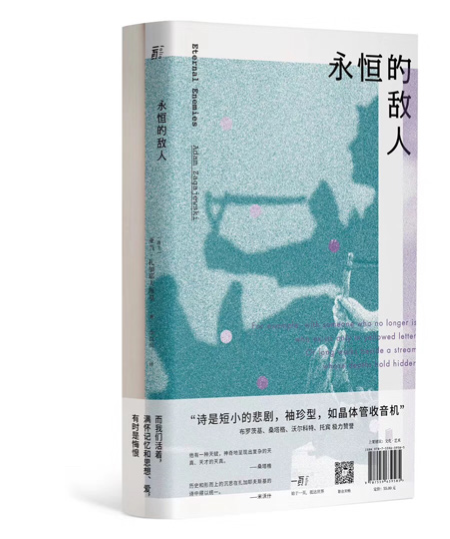
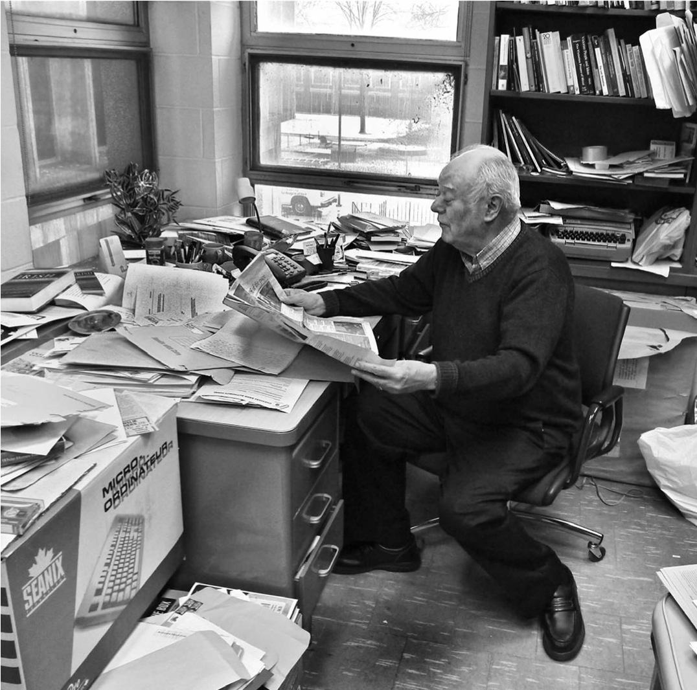

**03** 卷叁

**小 说**

24 小时文学聚会 \| P5 破地儿 刘宛照 P23 安兰江上 齐东 P33 公众号 郑智勇

P39 博斯普鲁斯海峡的蓝色日出 何知小说家 \| P45 瞳 赵松先睹为快 \| P57 雪
罗贝托·波拉尼奥故事群岛 \| P63 父爱·劳驾·幽灵现象学 塞尔希·帕米埃斯 P67 水上魂影
蒂姆·高特罗

P71 与奥利弗的一杯咖啡 威廉·特雷弗 P77 爱 克拉丽丝·李斯佩克朵坏品味陈列室 \| P81
不想拥抱我的人 彭浩翔长篇连载 \| P93 慎余堂 · 叁 李静睿

**非虚构**

吉井忍的二次会 \| P99 开书店的疯狂和冷静：日本福岛访问记 吉井忍到上海去 \| P107
九曲 许佳重走 \| P115 长沙 - 益阳：不是水，想改河道？ / P119 常德：生命似异实同
杨潇局外人 \| P127“只不过再待一年”式生活 Christopher St. Cavish 昨日世界 \| P131
大鱼 潘尼克

发现经典 \| P139 与阿赫玛托娃和帕斯捷尔纳克的交谈 以赛亚·伯林先睹为快 \| P151
凌晨 1 点 28 分，第二民兵消防站 亚当·希金博特姆

**档 案**

废墟与纪念碑 \| P159 计划生育、房子和“南方人” 伊险峰作家笔记 \| P165 三个北岛
王竞

18 号车间笔记 \| P171 为何在这里，事情往往只能如此？顾天鹂

**诗 歌**

发现经典 \| P175 伟大的诗人已经离去 亚当·扎加耶夫斯基只有诗 \| P181 黄鹤楼 /
齐城墙 / 就到青岛 顾彬

**专 栏**

理想的读者 \| P185 麦克劳德的愧意 陈以侃 P189 当我最初阅读亚当·扎加耶夫斯基
黄灿然存档点 \| P197 暂停，你可以不玩了吗？ 顾天鹂王伯伯脑保健操 \| P203
舌尖上的青楼 王永智

电影《天才捕手》剧照

**小鸟问答 Vol.3**

小鸟 \| 小鸟问答

# 「上升的一切必将汇合」

《小鸟 Aves》在二月做的大事是推出了“24
小时文学聚会”，它将从本月第一个周六开始刊登。我们看完了到一月底的第一批短篇小说投稿，379
篇，这个活比我们想象得要繁重复杂，每篇都至少有两个编辑看一遍。总体上觉得还算是认真负责的。最后选出
8 篇，三月第一个周六开始，每周推出一篇。我们给它设计了一个主题，
“上升的一切必将汇合”，这句话直接抄自美国南方小说大师弗兰纳里·奥康纳，用它来表达我们做《小鸟
Aves》、发现一群有写作理想还那么有创造力的作者、甚至单单是“嘿，我现在开始做文学编辑了”的心情，都恰到好处，真不错。

新的小说还在源源不断地到来，“上升的一切必将汇合”。来吧！

**i**

**投稿没有回复啊？**我们首席文学编辑李静睿老师说了，一个月之内没有回复，请作者自行处理。如果没有收到回复，那可能是我们觉得没有那么好吧。有些小说我们会跟作者进行沟通，看看是否有修改的可能，所以联络邮箱还是要经常打开看一看。

不用急着把稿费账号发过来。

**ii**

**你们有什么喜好标准或者禁忌吗？**有一天，女权主义编辑、曾经的《卫报》爱好者，游戏专栏作家，顾天鹂女士——
她本来是不管小说的，但她也会看我们放到群里的小说——她忍不住了，发出天问：男作家一定要写性吗？我想她的意思翻译过来可能是：男作家一定要写这么恶心的性吗？有一些是挺恶心的。虽然上升的一切必将汇合，但我还是得说，挺恶心的。

恶心的不是性，是没写好的性。引用日本文学编辑根本昌夫在《小说教室》里的一段话：关于小说，常有人误认为只要写一些反社会的事或泥泞不堪的内幕就是小说。

例如，写一篇小说描述平常谨言慎行的自己其实内心住着一个“色老头”，有人以为这样就是“写出真实的自己”。我不得不说这是天大的误解。

如前文所述，任何一个人除了正面的脸孔之外，还有侧面和背影，作者以独到的观点捕捉这些姿态就是小说。话虽如此，像“内在其实是个怪胎”之类的事，其实不必特地开诚布公地写出来。

不论是谁，只要剥开一身臭皮囊，里头当然是黏糊糊的内脏。这对每天替病患动手术的医师来说是再自然不过的事。没有必要特意挖出内部的不堪，夸大描写人类的污秽。这样的文章既不算忏悔录，也不是悔过书。

**1**

**iii**

**可以投长篇小说吗？**不能。因为我们现在人手不够，没办法看这么多，看这么细。有些作者贴心地准备了梗概，我们觉得从职业要求上来说，很难通过梗概判断一部小说的好坏。不能怠慢了作者。所以我们只能用最笨的办法来处理稿件。

虽然好看的小说在 3%
左右（一个超出我们预期的比例），但你知道毕竟还有好多个内心藏着“色老头”但是又迫切觉得这是在表达自我的作者写的男性生殖器小说……
在艰难地看过之后，我们通常还是要找一些厉害的小说来化解一下。从来没想到这工作会需要这样的安排。

**iv**

**你们为什么不设评论区？这是读者与文章的沟通，不要剥夺我们的乐趣！**这个问题上次回答过。但还是有读者（这位读者我们暂且叫他“了不起呀”）持续地给我们讲道理：“看一本书后，想看评论，这是在读完一本好书时才会有的想法，文章亦同”。

啊。乍看起来好像还是有道理的。他还说：“好读者是有生命力的信息系统，好文章也是有生命力的信息系统，两种信息系统的撞击，有时候还会产生新的风景”。

这我就不是太同意了。如果我能代表好文章说话的话，我一定会说：你看了你开心就好。不关我事。当然，“了不起呀”也会回些类似于子非鱼安知鱼之乐，我再咕哝一些别的，这事就会说个没完。

我只好拿出我们的标准答案：安静，它已经很难得作为一个选项存在了，不是吗？你看一本书或者一篇文章写得好，拼命想找一个人交流但却遍寻不见——这是我们前现代社会的常态。可能这也没什么不好。

**v**

**下载 PDF
版本字小又密，而且无论是用什么设备打开看都不太爽？**某种程度上是故意的，我们对设计师说做成那种地下手抄本的版式。其实原因在发布
PDF
的时候已经说过了，它主要是作为一个留档而存在。而且如果你真的打印出来，比较省纸。

**vi**

**你们上次小鸟问答里说的“介入感”是在说什么？是你们正在招募的非虚构吗？**你们上次小鸟问答里说的“介入感”是在说什么？是你们正在招募的非虚构吗？我们二月末的时候开始招募长篇非虚构作品。
并非做非虚构才叫做介入，好的虚构作品在反映我们这个世界的时候毫不逊色，而非虚构看起来天然介入，其实和虚构一样，由作者技艺和格局决定。

所谓介入感，我们放了一句话在非虚构招募的海报上，“每个人都是检验世界的一种方式”。我们用文学向我们所在的世界提问。提出问题即介入。

我们之所以强调长篇，是因为我们希望它可以更沉静一些，希望作者本身对某个问题的关注有一定的长期性，它不是通过一次“创作激情”就解决掉的，因为关注的时间够久，他也可以因此有更深入的思考。我们在说眼下社会里的许多事的时候，都会说“中国的事情很复杂”“现在的社会各种问题很复杂”之类的话，但在试图展现这些复杂的时候，都希望自己更像那些会一锤定音的人，恨不得一个微博就能把事情说明白。——我们觉得先把复杂性说明白可能更有价值一些。

我们与一位对这个长篇非虚构计划有兴趣的作家聊天，他问，你们想要什么样的长篇，我们说：一是提出的问题是真问题，不管是不是要解决它；二是结构、层次和长度是相匹配的，所以这个真问题有足够的复杂性；三是中文表达准确——不要小瞧这最后一个要求。它很难。

在非虚构写作或者媒体界，对非虚构报道有他们的理解，比如喜欢用大问题、小问题来定义选题和选题的重要性，我们对大小兴趣不那么大，对复杂性更有兴趣一些。

**vii**

**手动介绍第三卷内容**

非虚构部分在更新 2
个月之后可能你们已经看出规律了。许佳、Chris、潘尼克，他们的故事每月都在继续。

我们在跟作者约稿的时候希望他们都以一年为基础创作期限，一方面，只有非即时性的话题才有可能与读者建立一种微妙的情感联系：啊是的，你以前好像说过
/
你上次说什么来着？另一方面，因为创作的容纳力变大，作者必须考虑更为宽广的话题，我们发现自从严肃媒体塌缩以来，文字本身包含的时间性也越来越两极化。一种表现为社交网络和公众号里的即时消费，一种则直接跳跃到书，而原本应该介于两者之间的形式好像逐渐消失了。

我们认为有趣的地方在于，在一个缓缓展开的作品里——这并非意味着可以不加规划，相反，必须得有所计划才行，请试着想象一幅卷轴——作者和读者都会有充分的时间去思考和调整。也许它最终会成为一本书，但对于作者来说，有缓冲会更好。

Chris St.Cavish
的《局外人》就是这样，其实他的写作规划和现在稍有不同，但是他一旦开始叙述自己作为一个
2005 年来到中国的人，如何体验 /
创造属于自己的生活的时候，发现这即便对他来说也是一种全新体验——他从未想过很少有人写下这些，比如所谓外国人的舒适区。他的作品渐入佳境。

本期小说家是赵松。他的新作《瞳》极为细腻。好似水滴附着在物体之上，而你得以透过水滴的曲面观察那件物体。

这一卷的小说会多一点，除了彭浩翔和“故事群岛”，还有“24 小时文学聚会”——每周六见！

**2**

王竞这一期的“作家笔记”主角是北岛，而吉井忍会去探访一个和福岛地震有关的人物，这一期还会有一篇陈以侃的评论，聊《布雷顿角的叹息》的作者阿利斯泰尔·麦克劳德。

**viii**

**这一期的封面照片**

从赵松的《瞳》而来。不过可能小说的感觉不如它那么暖洋洋。这篇文章将在 3 月

12 日与大家见面。

**ix**

**阿赫玛托娃说：如果来得及思考诸多事情，并写出其百分之一来，该是多么幸福啊……**
余华的新小说来了。我们本来想让读者先睹为快某一章节，可惜出版方认为作品在开售前应当更谨慎。遗憾。

说回余华。一想到他们还在坚持写作，我就觉得世界还有希望。阿赫玛托娃说得没错。

**x**

**有什么话要对我们说？**

留言给微博 @ 小鸟文学，或邮件至 info@aves.art

**3**

**小鸟**一份新文学杂志。注意，不是文艺杂志。我们最大的愿望是找到最好的文学作品和作者，并呈现出来。

**栏目介绍**这个栏目每月一次，回答来自读者的各种问题。它放在每月的第一篇，兼有告知功能。

**4**

图片来自Daniel Norman / Getty Creative

# 小说

**破地儿**

# 刘宛照 \| 24 小时文学聚会

《追捕》里的主要配角之一，经典台词是：“跳吧，跳下去，你就会融在蓝天里”。

刘步真的跳了下去。

**一**

我回到这个破地儿，是秦楠跟我说，刘步跳楼了，抱着一本新华字典。十五年前，我和秦楠在这吃冷面，那时的老板，是秦楠她爸的战友，叫老严。老严转业后，和秦爸一块儿，给运输队开大车，从元市往烟台运石油。超期服役的苏联老车，赶上大雪，刹车失灵、操纵杆失灵，眼看要追尾，老严方向盘一别，开下路肩，前挡风给冻枝扎漏，人从窟窿里射出去，落在雪地里，居然毫发无损。他爬起来，碰碰车，已经在雪地上冻实诚了，就摘了车钥匙，爬上公路，去找派出所。走了有一里地，老严感觉不到脚了，低头看，竟也没有，往前走两步，还能走，就是没声，光上半身在飘。北风吹拂，四下漆黑，他一屁股坐在路边，发现屁股还在，顺着往下摸，腿也在，再摸底下，是个大冰窠。他心里有数了，掏出火柴，点着烟盒，扔在冰窠上。火光太小，化不了雪，只能看个影儿，他估摸脚还在，就是鞋没了，应该从车里窜出去就没了。鞋丢了，他没兴头再走，那是双新鞋，皮的，回家不好交代。他偎在雪里，上下眼皮一挨，就看见有人撬马葫芦盖一样，要撬走他的车。他跳起来往回跑，钻进车里，把方向盘卸下，扛在肩上，去寻警察，和另一双鞋。

照理说，运输队该给老严开表彰大会，他车上拉着半吨石油，要是追尾了客车，后果不堪设想。可惜他舍生未取义，车毁人未亡，又赶上百天会战，领导就和他商量，分他一辆新解放，把他从跨省长线，调成短线，专跑省内。老严当时没意见，第二天就把车让给了秦爸，说再不碰方向盘。领导寻思，老严这是闹情绪，赶着开春，分了他一套房，48
平，一楼，中门。老严想换个六楼，他住惯了平房，受不了头顶有脚丫子，也住怕了平房，做梦都在爬楼梯。领导劝他，一楼好，临道，对街就是一中，你媳妇没工作，正好干点小买卖。老严琢磨，领导的意思是，公房可以私用？这一犹豫，领导又批了他两架大铁床，纯蓝床架，床头两条大金鱼，鲜淋淋像要游出来。

老严赶紧接了钥匙，回村里把媳妇接来，儿子送进运输小学。

安置妥当，时已入夏，老严抱了两个西瓜，去找领导，说想打更。领导一听就急了，那是
1991
年，打更的好找，开车的难寻，况且队里有打更的，是领导叔伯堂哥的岳丈，八竿子打不着的亲戚，但也比老严近。老严说，要不他也舍不得这身技术，实在是不敢，不用打着火，手一碰方向盘，他眼前就两个车头灯，给前车照得通亮，
16
排座，第四排是个秃脑瓜亮，一个小姑娘，有病，活不过今年，旁边那个是她妈，怀着六个月的身子，胎儿发际线靠后，头发一半弯弯曲曲，粘在头顶，一半飘在羊水里，像面旗子。领导看他眼圈雀黑，印堂发青，三十出头的汉子，几个月熬成了干儿，现在还满嘴胡话，出车是冒进了点，就让他先进维修组。队里于是炸了锅，说老严大难不死，开了天眼，这要搁乡下，一定有人逼他出马。都说开了天眼的人，头十个算得最准，往后就差点意思，大家都巴结老严，求他给算一算。

秦爸不信这个，每隔半个月，跑了长线回来，照常找老战友喝酒。老严说：你要生姑娘啊。秦楠当时都三岁了，秦爸就骂：我那满月酒、百天酒、抓周酒，你喝马肚子里了？老严说：你回家问问嫂子。这一问，秦爸吃惊不小，媳妇又怀上了。秦爸说：生了老二，全家张嘴喝西北风？媳妇说：开除你正好，一个月就两天着家，姑娘现在都不认你。秦爸说：姑娘叫我大熊，我让的，你管着吗？媳妇：说得好，你也管不着我。秦楠她爸说：有管得了你的，我把你妈找来。他这个丈母娘，从前跳大神，现在赶时髦，信了基督教，两年后还要被骗去练气功。丈母娘一听，开天眼的说这胎还是女孩，马上忘了自己是教徒，撵着闺女去打了胎。

方向盘以外的故障，老严都能修，补胎尤其是把好手，不光能补好，还能让胎爆在去程的中点，前后不差五百米。这个距离非常考究，一是开出去够远，不能回队里换胎，二是回来还要跑十天，新胎也磨成了旧胎，反正肉眼不好分辨。新胎一个
20，旧胎 12，爆一个胎能挣 8
块，跑长途的师傅是赚了，维修组长的外快就缩了水。很快，老严被踢出维修组，去排出车表。自打排上班表，老严每个月去队里两天，闲得够呛，搁家开起了小饭馆，一开十几年，十几年不挂招牌，也不修门脸，但客源稳定，都是战友的孩子。一中没有食堂，他家算个小食堂，学生按月包伙。以前多少钱不知道，到了
2003 年，一个月是 40 块。

秦楠捏着她爸给的 40
块钱，叫声叔，给我点了碗冷面。说是冷面，上来时汤还是热的，烫嘴。我拿筷子一扎，一坨面跟上来，像张金丝饼。秦楠咬一口，吐到碗里说：有冰碴。完了把面饼翻个面，又咬一口，还是吐回碗里。我说：你让我怎么吃？秦楠不理我，

往汤里倒醋，一瓶醋倒空，接着倒酱油。我在桌子底下拉她：你叔出来了。她说：叔什么叔，专杀熟人，我弟就是他杀的。又往碗里加了半缸辣椒油，汤色恢复红润。我说：你还没给钱吧？她把方便筷撅成两截，丢在地上，拽着我钻出窗户，去买炸串。串摊人多，摊主让我们自己抹料，秦楠抢不到刷子，就捏着签子，在调料桶里烂滚一气，拎出来时，辣椒面比鸡柳还厚。秦楠说：我要有弟弟了。

2003
年夏至，秦楠的三舅妈生了个男孩，就是刘步。那年我们初三，初中四年制，没有升学压力，秦楠拽上我，逃学去看刘步。他黑黑的，嘴唇外翻，看起来像个非洲同胞。秦楠说：真好看。我说：他右手中指有点短。秦楠说：跟我一样，爱啃指甲。一年后，出了中考考场，我们直奔三舅家，刘步正在抓周，秦楠把一本《尼罗河女儿》，悄悄塞到铺红布的桌上。

那是十五年前的事，那时我们 15 岁。刘步也 15 岁，今年，以及永远。

秦楠来了，比五年前瘦了不少，看起来也就 120
斤。她说：刘步跳楼了。我说：在哪跳的？秦楠说：初四咱班那。我说：那不才四楼吗？她说：学校抽风，把丁香树砍了，他大头朝下，扎进了断根里。我想起那些丁香花的香气，一蓬一蓬紫色的，和栏杆外面音像社放的盗版磁带，“你说你最爱丁香花，因为你的名字就是它”，十五年前很红的歌，可以写进作文里，假装是泰戈尔写的。

我说：有遗书吗？秦楠摇头：三舅妈觉得是早恋，发现他送刘思甄回家，说了他几句，没想到能自杀。我说：你觉得呢？秦楠说：你知道我怎么想的。我看着她：是惠老师。秦楠点头：老惠教过的学生，每个都想跳楼，咱们那届没人跳，是她运气。我说：今天就查这事？秦楠说：先找刘思甄，看刘步留没留下话。我说：真找吗？秦楠说：真找，能当个借口。我说：你找老惠班上学生，跟她打招呼了？秦楠说：不进校园，在门口堵。我站起来说：你堵吧，我看看老惠去。秦楠拽住我：毕业这
15
年，你回来看过她？我说：我闲的？秦楠说：凡她教过的学生，没一个回来看她的，你这不帮倒忙吗？

眼看四点半，一中要放学，我和秦楠从店里出来，过街就是一中正门。我问秦楠：学校赔钱了吗？秦楠说：说赔
20
万，我没细听。我说：要是老惠的责任，能多赔吗？秦楠摇摇头。下课铃响了，不是我们念书时的铁铃，换成了卡农。孩子们背着书包，趿拉着球鞋，一个个挨着墙根，往远处蹭，看着像赶尸队，好像我们看不到的地方，有一根鞭子在抽。

秦楠突然说：不能再让她当老师了。

| **5 6** |
|---------|

老惠虽然是汉族，我和秦楠进了她的班，却像回到元朝，成了她治下的第三类人。第一类人，来自一中隔壁的供应小学，父母清一色机关里的干部。第二类人，地调小学毕业，父母是工人还是干部，有待甄别。第三类人，就是我和秦楠这样的，念运输小学，父亲都是跑大车的工人。第四类人，但凡早生一年，都没资格进一中，炼油厂才并入油田，父母毫无根基，就敢把孩子送来给老惠教？也不撒泡尿照照。第五类人，在老惠那就不算人了，俗称“地方生”，每年学费都比油田子女多
800
块。最后两类人，加起来没有十个，我和秦楠作为名义上的夹心阶层，实际上的下等人，坐在倒数第二排、正数第九排，当起九品芝麻瓜官。直到期中考试后，我才得到拔擢，官升四品，派去给李金杨当同桌。李金杨的妈，我进一中第一天就认识，管水房子的，负责给学生热铁饭盒，他爸开了个小卖部，就在水房子旁边，不管冬夏，终日水汽氤氲，不知道的还以为是澡堂子。要是没这个小卖部，李金杨肯定跟我同属第三类人，他的幸运在于，老惠有个儿子，爱吃辣片和鱼皮豆，才上小学一年级，每天都要丢铅笔、名签和红领巾，往后还要丢算盘、书包和计算器。这儿子每天一放学，就跑到我们班，坐在讲桌上，接老惠的班：我说你呢，别说话！你笑啥？给我上走廊站着！我们只要不抬头，不理他就行，最倒霉的是李金杨，要是那孩子说：我饿了！李金杨就得顶风冒雨，跑到小卖部找他爸要两个面包。

我串过去第一天，老惠就把话挑明了：要是李金杨成绩不进步，下学期你哪来回哪去。李金杨很看不上我，认为我是奸细，专门给老惠打小报告，不让前后桌理我。可我要是一摔书，他还真害怕，嗓子立刻尖了，像要哭，我要是不哄他，他能擤一天鼻涕。我心理落差非常大，本来预备当童养媳的，没想到对方是个林黛玉。秦楠看我给李金杨写作业，问我：你喜欢他？我说：就那榆木疙瘩，我伺候不了，考完试你帮我搬桌子。秦楠说：配眼镜的钱，你攒够了？我说：有那钱，我情愿给老惠送点礼。秦楠说：前排好吗？好，我说，空气清新，人口密度低，跟新西兰似的，椅子腿和桌腿之间，能塞进一只脚。秦楠说：你有点出息，往前考，登陆南极。

期末考试，我又前进了几名，利用价值提高，累进至第二排，给语文老师的大侄子当同桌。秦楠看此路可行，才开始发力，轻松考进前十，被老惠指派，负责教育局领导家的田公子。一听要给田亘当同桌，秦楠先吓哭了。田亘混蛋出了名，脏话不离口，初一就敢打高三的，就前两天，还砸了班里一块玻璃黑板，但老惠那个势利眼，怎么可能让领导赔钱？结果全班同学，每人平摊五块钱，替田公子买了单。我说：田亘还不如李金杨。秦楠非常丧气：咱又没的选。也是，我们没钱给老惠送礼，只好把自己当礼物，利用自己。

秦楠坐过去第一天，就被田亘气哭了。哭完这一场，秦楠破罐破摔，和田亘谈起了恋爱，就像言情剧里，红袖添香的小丫头，再和少爷情投意合，也是个工具人，她的作用在于，劝少爷改邪归正，使他成为新科状元郎。秦楠成了第二个老惠，每天给田亘吃小灶，出小卷子，改题打分，帮他做错题本，反正不管田亘有多喜欢秦楠，田亘他妈都要更喜欢她一点，秦楠简直从一开始，就走上了贤惠儿媳的道路。后来故事发展到，田亘他妈在一次检查中，和校领导大夸老惠，又在老惠面前，大夸秦楠，给老惠长了大脸。在十四岁的我们眼里，这段感情算是过了明路。

初三之后，换了新的语文老师，我开始烦我同桌，那个前语文老师的大侄子，连他喘气都嫌吵。这天他又在喘气，我骂他：你烦不烦啊？他特别懵。我说：你嗓子眼里的痰都快糊我脸上了！他脸红了，一直烧到脖子根。过了半天，我才发现他在憋气：你神经病啊！他突然说：你放心。我说：什么？他说：我爷是中医，儿科的。那一刻，我完全明白他在说什么。到了下学期，老惠突发奇想，放了学不许我们回家，原地上晚自习。4
点 45 放学，休息 15 分钟，从 5 点钟上到 5 点
45，头两天还讲讲题，后来就做卷子，每个人饿得东倒西歪。饿了两周，老惠从后门进来，右手拎扫帚，拍苍蝇一样，拍住几个说小话的同学，当时秦楠正给田亘讲题，也给她拍了一下，一脑袋的灰。打完人，老惠拿扫帚封住前门，一屁股坐到秦楠桌上，开始骂：操他妈的，我一天天，累得跟狗似的，为了你们，连家都不顾了，我为的是谁？我他妈的没孩子吗？你们家长一个个，穿金戴银，小脸抹佻白，花点钱在你们身上，可剜了她的肉了！回家告诉你们爹妈，谁他妈的告的我，别他妈的装缩头乌龟！大大方方告诉我，我肯定以后不管你了，我肯定把你供起来，让你当太上皇！看最后坑的是谁！看你们爹妈和我，最后哭的是谁！骂到激动处，她抓起秦楠的书，一本扔向打喷嚏的，一本射中撇嘴的，连那个低头抠手的也没放过，搞得我后背直刺挠，好像生了虱子。

老惠被告了，晚自习就不上了，一直也没提收钱的事。直到两个月后，班长看着我们上自习时，忽然哭了，说惠老师多不容易，每天一个人带孩子——我问秦楠：老惠离婚了？秦楠说：她老公跟我爸一样，开大车的。班长抒完情，通知我们：明天每人交
15 块钱。我们上了两周晚自习，十天，每天一块五，其实不算贵。

那是 2003
年，开始是非典，每天下午打扫卫生，喷消毒水。入夏后，学校搞操场硬化，下午就改成后院拔草，搞到后面，学校没钱了，每天组织一个年级的学生去阶梯教室看电影，也不怕传染了。头天看电影，第二天早上就交钱，每个学生一块钱，比租碟贵了点，比电影院是便宜多了，何况我们从小没见过电影院，只去过工人文化宫，银幕底下伸出个主席台。上午交了钱，下午我们回到操场上，搬自己出钱买的地砖，文体生活无比丰富。

上了初四，老惠愈加天恩难测，昨儿被她夸上天的人，明儿就挨批斗，连秦楠和田亘都被她拆开了。她忽然不管你爹妈是谁，也不管你上次考第几，但凡气不顺，她张嘴就骂，伸手就打，搞得我们根本不敢把塑料格尺放在桌面上，给老惠看见，抄起来就打折了，她才不管你那是脖颈子还是后脑勺。老惠身高
1 米
45，我们到了初四，全都长得比她高，于是她发明了新办法，让我们蹲着，她坐在椅子上，骂一句，踹一脚，什么时候你蹲不住，扑通一声坐在地上，什么时候算完。时间一长，我们都养成了最朴素的辩证观，觉得福兮祸之所伏，被夸就是挨踹的前兆。全班人心惶惶，恍如东厂，我们在学习数理化的同时，无师自通了察言观色，极为媚上。田亘那小子，站起来
1 米
8，被老惠踹了一脚，就坐地上不起来了。秦楠说：再不毕业，再来一次侵华战争，咱们都得当汉奸。

**二**秦楠堵在校门口，逮着个子高一点，看起来要被书包压死的就问：是初三一班吗？不是，不是，不是——有的不等她张口，直接跳开了，好像她裸露着断肢，夹着一只搪瓷碗，正沿路乞讨。我在她身后，遥遥见着一个像老惠的，都要打个哆嗦。我有十几年，没到过中学了，光看微博，中学女生都美艳异常，不日就能选秀出道。再看短视频，她们说话露骨，早就看穿世情，被包养抛弃了几回。可真站在这，我发现所有男生，都剃着平头，脸上冒痘，所有女生，都头发油腻，鞋底踩着没扦边的校服裤子。就算是送回
2000
年，也跟我们土得不相上下。偶尔迎面走来一个个子小小，头不梳脸不洗的女生，我都想挎住她的手臂，去买一块钱四个的小笼包。我和秦楠，当年也是初三一班的学生，我们毕业了，老惠年复一年地带着一班，和当年一样，带最好的班级，教最好的生源，出最好的战绩——
想啥呢？秦楠抓住我，把我往前拎：一班出来了，老惠今儿没来上课，好机会。

我看到一个男生，背弯得像伏尔加河上的的纤夫，抓住他问：刘思甄出来了吗？他后背像通了电，一下子站直了，书包掉在地上。对不起啊，我赶紧松手。他捡起书包，扑扑灰，背上走了，我看他站直了还没有一米六，八成是初一的。一个高个女生走过来，我问她：你是初三一班的吗？女生说：我二班的。我说：你认识刘思甄吗？刚才那个小个男生突然回来了：她请假了。我说：刘思甄？男生点点头：我是她前桌，你找她有事吗？我指指秦楠：她是刘步的姐姐。男生很白，此时脸上又白了一度，侧脸像极了我初中追的韩星，一时想不起叫啥。男生说：老师不让我们说刘步的事。

说完就走了。

秦楠正拦住一个男生问：你们班长是谁？男生高高大大，抱个篮球，身上冒着热气：刚还走我前面，小矮个儿，怎么没影了？我问他：像宋承宪那个？男生说：宋承宪是谁？秦楠说：他叫什么？男生一头汗开始往下淌：吴骓，惠老师的儿子。

我跟秦楠说：老惠的儿子，咱们上学时就七八岁，现在该上大学了吧？秦楠说：死了。我说：什么？她说：你忘了初四开学，老惠一个月没来上班？我说：她不是意外怀孕，去做人流吗？她摇头：那个暑假，她大儿子起水痘，开始没注意，后来发展成病毒性脑炎，拖死了。我说：你啥时候知道的？秦楠说：高一上学期，下雪天田亘来看我，听他说的。要这么算，我们中考时，老惠已经怀孕三个月了，一点没看出来。回想初四那年，老惠除了发疯，把我们班一锥子捅不出一声的乖乖女、全校最有希望的苗子，从二楼实验室拽着领子，拖过长长的走廊，又一个一个台阶，就差薅着头发薅到四楼之外，没再做什么出格的事。我说：老惠的老二，至少比刘步小一岁半，怎么跟他在一个班？秦楠说：你刚没听见，她儿子初一就是班长吗？我想，老惠真做得出来，等于皇上是她，宰相是她儿子，这朝廷还不让她治死了。

学生都走光了，剩下稀稀落落几个，都是被找家长的倒霉蛋。我和秦楠不得其法，只好回到刚才碰头的小店。我问她：你记得这吗？秦楠说：我爸战友开的。我说：你糟蹋了人家不少酱油、醋。秦楠说：是他先糟蹋面的。过了马路，秦楠突然说：生的冷面像塑料，立在墙角，扫帚似的，那么长一捆，也放不进冰箱，不知道咋能煮出冰碴来。原来，秦楠都记得。记得没有刘步的时候，这店就在这了，现在刘步没有了，它还是在这，鸟枪换炮，成了面包店。

一进面包店，秦楠就看见那个抱篮球的大个子，跟同学在长桌子上写作业，两男三女，旁边空着一把椅子，堆满了校服和书包。秦楠走过去，拖一把椅子坐下，看他们没点东西，就把水牌拿过来，让他们点。其他人不吱声，大个子做主，给每人点了一杯最便宜的美式，说作业多，怕困。秦楠让他们先写作业，等初中部的灯熄了，她给每人叫了一份意大利面，吃完了又叫薯条和冰激凌，让他们点自己喜欢喝的。这次孩子们都张口了，有要拿铁的，要卡布奇诺的，发音都是美式英语，比我们当年强多了。我还记得第一次，穿哥特裙的侍者问我喝什么，我说蓝山。我不知道蓝山是一种咖啡豆，是地图上的一个点，是牙买加的一座山。

吃饱喝足，孩子们话密起来。一个女生说：全校就惠老师讲究多，像我们女生，扎头发得用黑皮套，如果你之前是短头发，上了初三就不能留长。男生说：大夏天的，不许我们穿跨栏背心，想穿个裤衩吧，还必须过膝。另一个女生说：我长得太快，校服小了，惠老师就帮我从上一届买了一套，100
块钱。第三个女生捂着嘴乐：我听毕业生说，旧校服是惠老师找他们要的，没花钱。

要说生财有道，老惠是个中老手。我和秦楠那时候，校服是有，都当屁股垫儿使，每周升旗穿
10 分钟就行。老惠不甘寂寞，非给我们搞出一套班服，强制穿，不买不行，75
一套，进货大概 40，每套她净赚
35——要说班里的显贵子女真不少，难得老惠居安思危，家长礼送得再多，也没有蒙蔽她的双眼，扰乱她对金钱的嗅觉。

| **7 8** |
|---------|

男生说：惠老师其实对我们还行，对外班才狠呢。大个子说：可不是，要不是出了事，我还不知道她那大衣是新买的。女生说：听她扯吧，两年前我就看她穿过。另一个女生见我们好奇，就从头说起：过完年，惠老师穿了一件孔雀蓝皮羽绒，在走廊上，被初一六班的陈刚溅上了钢笔水，手指盖这么点的污渍，她非让陈刚照价赔。陈刚家里穷，家长真没钱，就求惠老师，想给她塞个红包，让她拿到洗衣店干洗，她非说洗不掉，让人家赔件新的。男生插嘴道：她还说，地主家也没有余粮啊，神叨叨的。看男生那样子，一定不知道黄世仁和白毛女是谁。我想起老惠当年骂齐天一，说他是横路进二，当时的我，也不知道谁是横路进二，我问我妈，我妈不告诉我。后来听老惠骂的次数多了，就明白此人是个傻子，也是，齐天一数学考四十分，当然是个傻子。等孩子们八卦完，秦楠问：刘步最近惹事了？五个孩子都摇头。一个非常肯定：没有。另一个说：这才开学一个月。第三个，也就是大个子，指着自己说：这个月惠老师一直在骂我，说我一条鱼搅了一锅腥。第四个说：上学期，刘步趁夏天雨不注意，把她椅子搬走了，夏天雨坐到了地上，被她妈带去医院拍片，因为这个事，惠老师说他道德败坏。秦楠说：还有呢？第五个说：说刘步长得像乌鸦。我看看秦楠，照老惠的嘴，这骂得不算狠，等于随口的小幽默。我问：夏天雨受伤了吗？男生说：没有，拍片看了，没骨折。第四个说：他们那一片，就爱搬椅子玩，刘步也被夏天雨搬过，也坐过地上，他就没告老师。秦楠说：这是几月份的事？第四个说：四月份，学校刚停气。秦楠不相信：六个月前？我说：当时夏天雨是刘步的同桌？嗯，大个子说，出了这个事，惠老师就把夏天雨调走，让刘思甄坐过去了。第四个纠正他：是夏天雨转学走了，刘思甄才坐过去。

看来，还得找这个刘思甄。刘步跳楼时，和她是同桌，刘步跳楼前一周，每天都送她回家。

面包店要打烊了，门外一声鸣笛，五个孩子呼啦啦上了车，挤得不可开交。秦楠说：记得我爸来接咱俩吗？我说：我坐后座，你骑在大梁上，掰一半康乐果给我。秦楠说：我喜欢骑大梁。忽然，一个女生跑回来，要了一杯咖啡，加了秦楠的微信。我说：发现没，她喜欢刘步。秦楠眼睛红了：天知道他为什么要死。我说：头一回被老惠骂乌鸦，我也想死。秦楠说：就一个道儿。我说：我还不是故意的，前桌一回头，白衬衫刮在我油笔上。秦楠说：老惠把你的笔袋，直接从窗户扔出去了。我说：多亏是一楼。秦楠说：现在想起来，算个屁。我说：如果我死了，刘步就不用跳楼，老惠也当不了他班主任。秦楠说：你想多了，刘步刚死，学校就说他是癔症，精神不正常才跳楼的。我说：所以是讹传？他根本没抱新华字典？秦楠说：到现在，监控也不给亲属看，学校要保老惠。

第二天，刘思甄还是没来上学，大个子看见秦楠，带球过人一样闪开了，另外几个孩子，也没来面包店写作业。打烊时，秦楠收到一条微信：惠老师看见你了。

第三天是十一长假前，最后一个工作日，下午没到四点，校门口就聚集了片警、驻校警察、政教老师、年级组长和体育老师。一中还是有些进步，至少体育老师和市场接轨了，长得像举铁达人，一触即发的氛围里，手里的握力器仍然一张一合，后来秦楠推了我一把，我才看清是钳子。她说：大假前，一向要大打一架，江湖恩怨了了，才好回家过节。我说：那个人你认识吗？秦楠说：露脚脖那个？我说：戴眼镜，正往这边走，秃顶，在掏烟。坏了，秦楠说，他是校长，姓陈。我说：你快走，去北门。

我往嘴里塞一块口香糖，嚼起来。陈校长走到我面前，没说话，身边的秘书替他问：看您来了三天了，揪住学生就问，是哪家媒体啊？我说：我这儿毕业的，来看老师。秘书笑了：您找哪位老师，跟我进门卫室，我把他电话给您。我说：不急，老师总在那，群架不看就没了。秘书说：什么？我说：你挡我道了。

才两分钟，小混混肉眼可见地多起来，细腿裤，牛仔上衣，敞着怀，口罩拉到下巴底下，单拎哪个出来，都看不出是小混混，可搁在一起，就瞅着贼眉鼠眼。敌人还没放学，他们暂时是良民，当着栏杆里的大盖帽们，掏出烟来抽。一个男生看我在嚼口香糖，凑过来问：还有吗？我说：得换，不白给。他问：怎么换？我说：说道说道，今儿什么恩怨。男生说：几个贱货瞎逼逼，说我朋友的妹子怀上了。我说：你不知道什么是避孕套吗？男生说：我知道啊，又不是我的妹子。我说：你第一个避孕套哪来的？操，他把烟扔到地上。我说：自古以来，一中就是情场，周边那些学校，要是没有一中，真不知道要怎么性启蒙。男生不见了，门口骚动起来，骚动完了还是骚动，干打雷不下雨，我看出来了，这帮孩子是隔壁二中的，另一个情场。卡农一响，太阳下山，秃顶校长不见了，黏在他身边的影子，马上缩回门里，毕竟他在外面有被围攻的危险。我往北走，去和秦楠汇合，北边树密，铁栏杆有个豁口，十五年前我俩钻过，昨天发现还在那。——不看了？秘书又冒了出来。我说：二中来的，没意思。秘书说：什么？我说：要是从技校摇人，能把脑浆子打出来。秘书说：看来真是校友，校长没认错人，您跟我来吧。

进了校长室，一个秃顶冲着我，抽完烟，他才跟着屁股底下的转椅，把脸扭过来：你什么单位的？我说：没工作。校长笑了：在读博是吧？我说：陈校长认识我？校长说：你是一中知名校友，高二拿了奥数一等奖，被保送北科大，你没去，高考报了北大，没考上，第二年上了清华数学系，对吧？我说：那两年盲报，便宜我了。校长说：老校长一直说，一中教出个女华罗庚，说的就是你。我说：老校长有心，我小时长得锉，放人堆里就没。校长说：中考全市第三十五，是不算拔尖儿，当年在你们一班，排到十名开外了吧？我说：记不住了。校长说：差不多，惠雨带出的班，每年全市前十，她最少占六个。我说：您有没有统计过，她每届学生的就业率、离婚率、自杀率？校长说：她只是个教数学的。所以呢？我说，只要能出满分，你就会保她？校长说：我知道，很多人看不惯惠雨，每年告到教育局的一大把，但这里面不应该有你。我说：惠老师做了什么，您不会不清楚吧？校长说：做什么？她能做什么？现在学校都是监控，学生不止一个手机，她要有什么出格的地方，照片、视频、录音早就放到网上了。我说：现在不是十五年前，我相信她没动手，不然学校不会赔那么点钱。校长说：师父领进门修行在个人，你碰见惠雨，成了数学家，你感谢过她吗？惠雨风光了这些年，现在摊上刘步，是她倒霉，是我当校长的倒霉，你嫌
20
万少，那是你不知道，这个钱学校一分没出，都是我和惠雨掏的。我当校长活该，你想想惠雨，她一个月加上班主任补助，才挣三千多，岁数那么大了，孩子还没上高中，你得给她留条后路啊。我站起来说：咱说不到一块去，别耽误您回家。校长说：你回去跟秦楠说，入土为安，再折腾下去，对刘步爸妈不是好事。我回过头：究竟还得逼死几个，学校才能重视？人没了，成绩有什么用？校长说：不是我要成绩，是家长要啊，惠雨不是一届、两届、偶然的好，她是每一届都好，你懂吧？

从学校出来，天已经黑了，秦楠不在面包店，不知道去哪了。路灯黯淡，街道坑洼不平，北风呼呼吹着，送我回到十五年前，挨了老惠的骂，不敢回家说。整件事最恐怖的地方，不是老惠逼学生，而是在她的高压下，真的出了好学生。这种繁荣盛景，给家长造成错觉：老师不让学生怕，净挑学生爱听的说，哄着学生玩，有什么用？还不如像老惠那样，出成绩，出名徒，每年有一两个跳楼的，有什么问题？只要跳的不是我儿子就行啊。

风里驶出一艘大船，很怪，但很眼熟。这是我从初二到高三，住过六年的家属区，刚才没认出来，是因为小区取消了门禁，塑料袋满天飞，地砖碎了一半，油田副业归地方后，物业已经弃管。但这艘两层的大船，夜里仍然神采奕奕，看起来将要启程。记得高中时，一层改成了自行车棚，二层一直是露天，平时大家晾被子，秋天晾白菜和大葱。大船后面，就是
16 栋，3 单元 601 没亮灯，我常坐在那窗台上，想跳下去会怎样。

上了大船二层，我看见秦楠坐在单杠上，还是十五年前她坐的地方。我说：怎么上去的？她说：扶我一把，我想下来。我说：你就为了这个哭啊？她啪地跳到我怀里：现在我特理解那个毕业二十年，回去打老师的，我也想揍老惠。我说：有件事，你不知道。高二晚自习，我拿公用电话，往她家打了一周。秦楠说：骂老惠吗？我说：你把我想得太伟大了，一周，一句话没敢说，电话通了就放录音，是一群大象在嘶叫，老惠还真害怕了，大叫着，老公老公，elephant，elephant！秦楠说：老惠会说英语？是啊，初中四年，老惠闲得没事，考我们单词时，念的从来都是中文，卑微的和低下的，我老写串。现在想起来，不知道真打过电话，还是编出来骗自己的。

**三**

十一长假，我们唯一的进展，是拿到了刘思甄的家庭住址。刘思甄住滨江一号院，母亲在税务局上班，父亲以前是派出所所长，去年下海开了干洗店，干得很大，我家退休的老太太都办了卡，洗羽绒服才
9 块
9。我以为秦楠马上会去找她，但每天一碰头，她就带我去三舅家吃饭。三舅妈跟以前一样，边择菜边唠嗑，也不回避刘步，好像儿子在学校上学，晚上还能回来吃饭。三舅明显老了，每顿四两酒，我和秦楠喝啤酒陪着，提起我们高考那阵，他说：本来和孩子老叔说定了，中考完，送他去上海念高中。

秦楠的老舅是学涡轮的，毕业后定居上海，秦楠当初报考复旦，也是奔他去的，可惜差了三分，掉档到第三志愿，让某
211
财经大学捡了便宜。大学开学第一天，秦楠给我打电话：你知道吗？《汉谟拉比法典》规定了性工作者的遗产该怎么继承。我说：时代特征吧，毕竟都不避孕。秦楠说：你是说比起法律，避孕套是更伟大的发明？我说：至少在父系社会。过了几天，她又告诉我：《汉谟拉比法典》只是现存的、比较完备的成文法典，这么多定语，一听就不牛逼。我说：法律系还讲这个？秦楠说：我倒想转专业，可这破学校连考古学都没有。我说：回来跟我一块复读吧。秦楠说：书我都卖了，七十三块六。混到大四，人家都找工作，她跑去日本交流，凑齐了日文版的《尼罗河女儿》，一年后回来，招聘季过去了，她直接回元市，成了待业青年，一个月才出一次门，宅家刷剧看动漫，也不多吃，控制体重，以每年
5
斤的速度胖起来。今年入秋，我给她找了个心理咨询师，但刘步出了这样的事，肯定顾不上了。

三舅妈拿起我的杯子，把剩的杯底嗦啰了：刘步学习没你们好，想着他老叔能帮着，考上复旦就好了，他们刘家人啊，死心眼，从老四开始，就要上复旦，老四没考上，就让楠儿考，楠儿没考上，轮到刘步了。要我说啊，这个复旦，不上也没啥，把儿子过继给老四，虽说是面儿上的，你三舅不舍得的。三舅说：我早就想开了，他去了上海，以后再出国，跟死了有啥区别？我又不是卖儿子，又不图他养我老。三舅妈说：我翻着个小字条，原来刘思甄要去上海学舞蹈。三舅说：到底是我儿，恋爱也谈了，没白死。我看秦楠，秦楠举着啤酒瓶，给自己满上，又给三舅妈满上，俩人干了一杯，又要满上，杯子顺着倾斜的桌面，碎在地上，三舅第一下没使上劲，第二下才把桌子掀了。

上尖的猪肉炖粉条，全兜在三舅妈腰上，三舅妈腰间盘突出，常年系磁石腰带，肉汤连着粉条，黏在磨光的磁石上，半天往下掉一根。我还没反应过来，三舅妈已经扑过去，把三舅从玻璃碴子里拖走。我听见她喊：我都说了，再生一个！刘步咱从小没养好，不爱说话，再生一个，你好好对他。三舅说：生你妈逼啊，你都四十几了？这是最极端的情况，也是我每天去三舅家，都要做好的心理准备，但一般用不上。一般都是三舅妈说：中午吃饺子。我说：韭菜馅儿的？三舅妈说：行，在自己家不怕放屁。然后和我一人一把韭菜，择着择着，三舅妈就想起来：自打上中学，刘步就没回家吃过晌饭。我说：做题吧？是啊，三舅妈说，十一点半放学，惠老师只给半小时吃饭，十二点开始做数学题。我说：刘步成绩怎么样？三舅妈说：还行，没出过年级前五十。要说惠老师啊，带班真有一套，不光管她自己那科，英语、语文、物理、化学她都管。刘步告诉我，惠老师说了，中午做了数学，晚上就能倒出功夫学别的。

| **9 10** |
|----------|

每当这时候，秦楠就要躲进厕所哭一会儿，她受不了这个。三舅妈不知道老惠是什么人，可以肯定，刘步没说过，老惠搓弄的羞耻感，让他在一切进行时无法发声，就像被家暴的人。晚上出来，我说：三舅妈不记得了？秦楠说：不记得是好事，明天不来了，去找刘思甄。我说：她还小，备不住比你还伤心。秦楠说：我知道。我说：咱没看见，但刘步是在她面前跳下去的。秦楠说：我不是找替罪羊，我知道我有罪。滨江一号院分两期，一期是高层，临街，二期是别墅，临江，据说是防洪区，大涝年全得淹，但建成这几年，松花江水位下跌得比股市还快，到处是水中沚。我和秦楠跟着一对遛柯基的情侣，混进小区，男的精神女的妖，就是狗拉了屎不捡。秦楠说：看见没，灯柱下半截都是锈。我说：单看建筑，挺像法兰克。她说：步子太大，扭着胯了。

严格意义上讲，元市不算我们的故乡，我们出生时还没有它，它在 92
年建市，比我们小四岁。我十岁以前，它没有一点城市气象，一共三趟公交车，1 路、2
路过江， 4 路不过，还有一个车型，跟 4
路跑一趟线，叫小微型，红黄蓝紫，乃至花的，都在街上跑，招手即停，哪下都行。出行主要靠倒骑驴，没棚，下雨天自己打伞，我家老太太爱坐，单位分了大米苹果梨，能让师傅给扛上去，换煤气罐也方便。出租车哪年有的，我不记得了，反正高中以前没坐过，多大雨都骑个自行车，单把，空出一只手打伞，楼少风大，根本睁不开眼睛，那年头满街都是偷马葫芦盖的，没摔死也是命大。

一期转个遍，没找着，我们往里码着江边走，发现一墙之隔的临江路，改名叫外滩路了，刘思甄家就在这路的尽头，正对着饮马河的汇入口。秦楠说：我怎么觉着，有点像都江堰。我抬头往上看，四层封顶，两层一户，刘家住楼上，最佳的观景地。秦楠按门铃，刚通就有人接，听声音是个小姑娘，秦楠说：刘思甄吗？我是——话没说完，楼门就开了，我右脚给撞了一下，正往后躲，里面出来一个小矮个，半截子风衣盖到屁股，胸脯以下、膊了盖以上一边粗，她哎呦一声，我还要往后躲，被秦楠从后面顶住了。我说：惠老师吗？老惠说：乔泽啊，跟秦楠还这么好？以前体育课，你俩就知道唠嗑，都没长高，现在跟我似的，后悔了吧？我说：您来串门？老惠说：给学生补课，一对一，现在抓得严，补课班是不敢开了。我发现恨不得敲掉她两颗门牙，那是背地里，真看见她，我还是怕。自打老惠出现，秦楠一直没说话，楼上以为按错了，挂了语音，此时一片寂静。

都别杵着，跟罚站似的，老惠说，学生家长给我说了，要来你们冲我来，初三正是要命的时候。我说：要不，我请您吃饭吧。秦楠马上掐了我一把。老惠说：你俩跟我回家吧，孩子在家，我得回去做饭。我说：我打车送您回去。老惠说：坐公交吧，出门就是站点，叫上秦楠，她也得一道。秦楠看着老惠，老惠也看着秦楠，我说还是打车吧，刚抬起手，老惠问我：真喜欢数学？我说：多亏您，从高中到大学，代数、几何、到微积分、概率论，只要跟数学刮边，我从来都考第一。出租车停了，前座有人，师傅摇下窗户问：上哪？老惠没说，反问里面那人：你上哪？完了跟我们说：顺路。秦楠和我依次上车，老惠关上车门，她的腿挨上我的，我突然犯了恶心，然后才意识到，我一直在恭维她。

车在一个贴满小广告的门洞前停下来，刚下车，已经有学生家长等在楼下：惠老师，孩子先上去了。老惠说：没事，吴骓在家。家长上车走了，一对双胞胎开了门，其中一个说：惠老师，我中午没吃饱，你焖饭带我点。阳光从前楼窗户反射过来，有那么一瞬间，我甚至觉得，老惠是无辜的。老惠扎围裙进厨房了，宋承宪出来给我们找鞋，两双粉色塑料拖鞋，上书老婆二字，以前地摊上看过，一直不明白谁会买，谁家有这么多老婆。门口堆着两箱“生命一号”，八成是双胞胎家长刚搬上来的，不像我们那时候，家长隔着校门，把购物卡往里一递，礼就送完了。

秦楠问宋承宪：你叫吴骓？那孩子说：乌骓马的骓。双胞胎里的一个说：你叫他“吁”
就完了。我是姐姐，她是妹妹，我叫陈一心，她叫陈一意，知道你好奇，别瞅了，你眼没花。这时妹妹问：你俩呢？秦楠说：一样，惠老师的学生，你们是一班的？妹妹说：我不是，我妈不让我跟我姐一个班。秦楠说：你们班老师让你说刘步的事吗？妹妹看吴骓一眼，没话了。秦楠说：补数学多少钱？姐姐说：一小时一百五。秦楠说：你们俩？妹妹说：我俩三百，双胞胎是俩人好不好？

老惠端着一盆蛋炒饭出来，菜是尖椒土豆丝，吴骓把桌上的卷子抱走，我们到桌边坐下。我发现老惠的居住条件，还维持在我上初中的水平，两室两厅，餐厅太小，吃饭一般在客厅，电视墙上挂着一块黑板，底下是一箱粉笔。我发现，这房子我来过，当年学校分大白菜，我们帮她搬过，男生一人两棵，女生一人一棵。秦楠还在这张桌子上，给老惠死掉的大儿子做过手工，拿笔刀刻的天安门，奖品是一根跳绳。吃完饭，三个孩子留在客厅做题，我们跟老惠进了卧室，坐在床上，像是要打斗地主。老惠说：秦楠，惠老师之前不知道，刘步是你家亲戚，他爸妈也没说，现在看你面子，我再赔
20 万。没想到老惠这么敞亮，虽说她一年带毕业班赚的，肯定不止 20
万，但这不等于承认自己有责任吗？秦楠说：我有啥面子，中考高考都没考好，哪回都没给你长脸。老惠说：教育心理学管这叫无意识逆反，虽然我挺喜欢你这个小不点，但你一直想打我脸，也是有可能。秦楠说：你今天找刘思甄，不是补数学吧？老惠说：跟刘思甄没关系，她早没事了，是家长不放心。秦楠说：当时你在场吗？老惠说：我在教研组开会，三年组的老师都在那开会。秦楠说：你的意思是，刘步有预谋。老惠说：铺垫也有，8
月 13 号开学，刘步第二天就没来，说中暑了，后来那个月，他又缺了两天课，一次是 21
号，一次是 28
号。秦楠说：你记得挺清楚。老惠说：要说对不起良心，就在这，他妈第三次给我打电话，我就猜着了，这孩子在装病，但我没说。秦楠说：刘思甄请假了吗？老惠说：你没当过老师，谁和谁在早恋，讲台上一看特清楚。秦楠说：但刘思甄和刘步早恋，你没看出来。老惠说：刘思甄不是那样的小孩，单纯得很——吴骓，你站门口干啥，卷子做完了？吴骓把门推开个缝：我爸喝多了，王大爷说马上送他回来。老惠站起来说：你怀疑我也正常，要说责任，我肯定有，从初一就带他，跟他在一起的时间比父母都长。现在这帮学生啊，说不得碰不得，从我家老大没了，我就不太管他们了，活着就行，要啥自行车啊。我跟刘步她妈也说，能要早点要一个，一晃儿也带大了。看秦楠没动，老惠就把门推上了：我找你来家里，跟你说这些话，不是因为我是刘步班主任，是因为我是吴骓的妈。刘步和吴骓，就像你跟乔泽，好得跟一个人似的，开始我不知道，说过刘步两次，吴骓就不干了，天天跟我作，我就不敢说了，绝对轻拿轻放。儿子在自己班上，我不好意思夸，就把刘步当亲儿子夸了，这两年他没少来家里玩。我琢磨，老惠这肯定问不出什么了，还不如早点走，回去找刘思甄，但秦楠像被点了穴，拽都拽不动。

老惠说：你要不信我，可以去找田亘，你知道他在教历史，跟我搭班吧？

外面扑通一声，接着哗啦啦一阵响，老惠冲出去，她老公坐在地上，岔着两条腿，扶着茶几想站起来，却带翻了上面的零食盒，核桃、榛子、开心果撒了一地，老惠像狗一样，趴在地上捡着，看起来，她不是怕坚果绊倒老公，而是这些坚果本身就比老公重要。

弟妹，我先走了。门外的老头下了俩台阶，又折回来说，弟妹，你别生气，我儿子办事儿，高兴，多喝了两杯。我眼眶像被人打了一下，秦楠站起来，绕过老惠，绕过满地坚果，绕过空气里弥散的酒气，走向门外。我跟上去问她：你是不是想要那
20 万？秦楠说： 8 月 28
号，是我给刘步请的假，三舅妈不知道。我说：他跟你在一起？秦楠说：上午我俩在冰点店，他背了几篇历史，下午说回供应小学，看叶老师。我说：他小学班主任？秦楠说：我刚上网查，9
月 3
号小学才开学。吴骓跑下楼，后面跟着双胞胎，他追上我们说：我带你们见刘思甄。秦楠说：什么？吴骓说：明天下午，小男孩冰点店。晚上回到家，想到和老惠的偶遇，我后背一阵发麻，仿佛暗中有一只眼盯着。曾经，有一个老人，在北京火车站，径直走到我面前，问我是不是到元市下车，我问他想干嘛，他说让我帮忙捎个信封，对方会在元市出站口等我，我问捎给谁，他说毕如是，而毕如是是我的语文老师，我初中同桌的大姑。有些凑巧很浪漫，但和老惠联系到一起，就让人后怕。我躺到床上，复盘老惠今天的言行，卡顿甚多，都卡在我自己这，我那副谄媚的嘴脸，仿佛还在她的治下不得动弹。我还拿老惠当老师，老惠却拿我们当学生家长，尤其在她家，有几个瞬间我特别熟悉，就是她当年见到田亘他妈的样子。刚要睡着，秦楠来电话了，她说：我梦见老惠了。我说：闲的。她说：我看见她老公的脸，变成了我三舅。我说：轮不着你同情她，指不定她老公是演的。秦楠说：你说吴骓呢？真想帮咱们？我说：明天见了再说，一共也没说上几句话。秦楠说：这半个月我见的人，比过去七年还多。我说：你知道田亘在一中教历史？她说：就那天在冰点店，听刘步说的。我说：刘步知道吗？秦楠说：什么？我说：你和田亘的事。秦楠说：没事，我都忘了。我说：有十年没见了？秦楠说：高二又见了一次，我在东京给他邮过明信片，他没回。我说：睡吧，我困了。

其实我不困，田亘去教历史，虽然跟他那个教育局当领导的妈有关，但说到底，他是因为秦楠。要不是秦楠，我们不会对古埃及、巴比伦和亚述国感兴趣，全班都在讨论周芷若和赵敏，我们聊的是曼菲士法老、爱丽丝女王、伊兹密王子和埃及大神官，六大门派围攻光明顶时，我们正忙着帮凯罗尔摧毁巴别塔。某种意义上，秦楠是初三一班的尼罗河女儿，给喘不过气的我们带来神迹。因为秦楠，我过早去到了友情的巅峰，以至于后来常常寂寞。我想田亘跟我一样，心里攒了太多话，因为离她越来越远，渐渐就不说了。表达欲像腾空的烟火，秦楠点燃那根捻，我们一辈子都在空中飘荡。

**四**

因为不知道下午从几点开始，秦楠决定十一点就到冰点店集合。我十点从家出发，十点半到卷饼店下车，看见秦楠在门口排队，她说：千万别抱希望，两年前就变味了。我说：记得那张饼比菜板还大，卷起来有两个手脖子粗，铛铛两刀，切成三截，咱们都抢中间那截。秦楠说：自打平房扒了盖楼，就换人了。我说：就那小土房，没被咱挤塌，真是烧高香。秦楠把十块钱给老板，找了四块，接过一个牛皮纸袋，上面印着“李金杨土饼”。她说：现在别管啥，都有个创始人。我说：哪像咱小时候，天天吃三无产品，都叫小熊饼，味儿一点不一样，吃个饼干跟抽奖似的。秦楠说：也不能说原来人心好，只能说命大。

我边走边吃：还行，就是不够辣，你中午吃啥？秦楠指指前边：有卖蛋卷的。又来了，我说，哪回买完不是我吃？她笑了：我喜欢听那个声。买了蛋卷，钻进胡同，光线暗下来，像是要下雨，我抬头一看，太阳挺老大，光看天，好像一点风也没有。我说：这不是原来的三角屋吗？秦楠隔着落地大窗往里看，里面一个人都没有，她问我：你说刘思甄长什么样？

我和秦楠每人点了一客香草三角，上来两个高脚杯，我说：日趋下流。秦楠说：味儿还行。我说：我是在这才知道，吃冰点要铺餐布，用不锈钢刀叉。秦楠说：切半天也切不动，倒是可以坐很久。我说：我猜啊，老板娘跳出三角恋，认识了新的人。秦楠说：以前一顿饭才
2 块钱，它一个香草三角卖 3 块
5，消费太超前了，能不往回调吗？我拿塑料勺挖了一口，果然非常凑合，DQ 的品质，KFC
的价格。我说：还有豚骨拉面呢，你不来一碗？秦楠说：算了，人快来了。

| **11 12** |
|-----------|

结果下午四点，吴骓才来，说刘思甄跳舞去了，还有十分钟下课。他给刘思甄点了块蛋糕，说自己不渴。秦楠说：给你点个沙冰吧，刘步说不甜。四点十五，刘思甄穿着跳舞服进来，银色脚蹬裤，一掌宽的小蓝裙，盘扣紧身衣，后背写着“轻舞飞扬”，吴骓眼睛有点直，我看了脑袋生疼。吴骓站起来朝她挥手，我又确认了一遍，吴骓的确没有一米六，是老惠亲生的。刘思甄长手长脚，站着比吴骓高不少，坐下却比他矮了，脸盘子极小，单眼皮一直没抬起来，敢情吴骓点这蛋糕，是为了让她有东西可看。我说：没别的意思，就想看看你，刘步搁家老提你。刘思甄被这话捶了一下，顿时矮了一截。我和吴骓找话说：刘步说他有张卖身契在你这，到底是什么？

原来，刘步和吴骓交好，是因为初一下学期的体育课，刘步大头朝下，从单杠上摔下来，当场口吐白沫。吴骓看见了，没回楼里找老惠，而是直接攀上铁栏杆，跳到学校外面打
120，十分钟就把刘步送上了救护车。吴骓说：第二天我正研究，要是刘步摔失忆了，怎么重置场景，给他恢复记忆，结果他下午就来上课了，坐下第一件事，就是拔开钢笔帽，给我画了幅小鸡啄米图。吴骓从包里掏出数学书，书里夹着一块纸，名片大小，压得紧紧地，展开一看，就是普通的红格纸，背面画着一地碎米，和一只硕大如哥斯拉的鸡，旁边签着刘步和刘建强。我说：怎么连他爸的名都签上了？吴骓说：刘步怕将来红了，不认账，要不是我拦着，他还要签他爷的。

刘思甄问我：姐姐，你从上海回来的？我说：从北京。刘思甄说：哦，你是另一个姐姐。秦楠说：我是他二姑家的姐，叫秦楠。刘思甄飞快地看了秦楠一眼：他说想离开这，去上海找你。秦楠嘴角抽了一下。我说：听说你要考上海跳舞学院？刘思甄说：是吗？我糊涂了：刘步没和你说，他要去上海念高中？刘思甄摇头。我说：他也没说，他喜欢你？那个啥，吴骓打断我，喜欢刘思甄的是我。啊？刘思甄看起来，比我和秦楠还惊讶。吴骓说：我初二就喜欢她了，她不知道。刘思甄说：你也没告诉我啊。吴骓说：刘步要不是怕我妈把咱俩调开，能天天送你回家吗？刘思甄瞪大了眼睛：那他推你干嘛？吴骓说：他啥时候推我了？你就臭美吧。我说：所以刘步追刘思甄是假的，是替你打掩护？吴骓说：我妈就看不得我跟女生说话，刘思甄好不容易从后排调过来，我怕我妈再把她调走。刘思甄脸红了：不会的，我妈给你妈塞了
2000
块钱。吴骓满脸紫红，把刘思甄搭在椅背上的衣服弄掉了，低头去捡，桌边露出一只耳朵，也憋得通红。

秦楠说：8 月 28
号下午，刘步回去上课了吗？刘思甄翻出手机看日历，看完冲我们摇头。秦楠说：他第二天有没有说，他回小学了？刘思甄说：不会吧，三年组老师的办公室，就对着供应小学的操场，让惠老师看见怎么办？吴骓从桌子底下钻出来说：他去看夏天雨了。秦楠说：夏天雨转学去哪了？吴骓说：江北三中。秦楠说不出话来，我在底下攥着她的手，发现她在抖。姐姐，你别生气，吴骓说，不是早恋，连手都没摸过，就传个本子。本子？秦楠说，你们不都有手机吗？吴骓说：有是有，我妈不让带，发现就没收，班里只能传本子。秦楠说：夏天雨为什么转学？吴骓说：她和语文老师吵了一架，闹到校长那了。我说：她可真会给你妈上眼药。秦楠说：学校怎么处理的？不知道，吴骓耸耸肩：反正那事之后，语文老师就不管我们了，每天打铃就下课，早自习也不来了，让我们自己背课文。后来夏天雨就转学了，她说祸是她一个人闯的，她不连累我们。

吴骓，刘思甄突然说，你帮我买个圆规吧？一会儿我爸该来了。吴骓走了，刘思甄才告诉我们：夏天雨转学，是学校里都传，她妈离婚，是因为和校长搞破鞋，还有人说，夏天雨是校长的私生女，她是在班里呆不下去了。我说：陈校长快六十了吧？刘思甄点头：陈校长那么丑，还秃顶，夏天雨那么漂亮，肯定不是他女儿。我说：这跟惠老师没关系啊？你怎么不让吴骓听？刘思甄说：有可能，是惠老师造的谣。我说：什么？刘思甄说：之前刘步搬她凳子，她妈来学校闹，惠老师就不管她了，这回是第二次。夏天雨走了，惠老师还在班里指桑骂槐，说这样的主儿她伺候不起。吴骓回来了，把圆规递给刘思甄：我妈给我打电话了，我得赶紧回去。完了跟我们说：你们看她上车再走，她家车牌子是吉
Z10086。见我点头，吴骓就走了。刘思甄说：吴骓也可怜，平时在班里，觉着同学要说他妈坏话了，他就自己走开。我说：你喜欢他吗？刘思甄一伸舌头：我不敢，惠老师太吓人了。我说：是，马上毕业了，别摸老虎屁股。刘思甄说：我妈说，要是我考上重点高中，就不用学舞蹈了。我说：那个夏天雨，刘步喜欢她吗？刘思甄说：我不知道，夏天雨走了，我才和他坐同桌，我笨，他说什么，我听不太懂，我觉得那些话，不是对我说的。我说：他都说什么？刘思甄说：克尔凯郭尔，爱德华·霍普，还有《质数的孤独》——我爸来了。刘思甄挂了电话，翻出夏天雨的手机号，让我抄下来，她说：我不知道他喜不喜欢夏天雨，但夏天雨一直是校花，开运动会都是她打校旗，全校一半男生都喜欢她。

刘思甄上车了，那是一辆玩具一样的霸道，经常出现在网红蛋糕上，想必未来会像古堡一样，出现在童话故事里。我说：你听说过夏天雨吗？秦楠说：夏天雨不重要，刘思甄在转移注意力。我说：你不相信她？秦楠说：我是想不通，照她的意思，夏天雨家境极好，养着几只名贵的波斯猫，这样的主儿，老惠巴结还来不及吧？我说：你刚才怎么不问她？秦楠说：刘思甄喜欢吴骓，她一直在保护他。我说：我给你捋一下，
8 月 13 号，初三开学；8 月 14
号，夏天雨和语文老师发生争执，刘步当天没上学，请假了；8 月 21
号，夏天雨转学，刘步第二次请假；8 月 22
号，刘思甄坐到夏天雨的空位上，和刘步成了同桌；8 月 28
号，刘步第三次请假，上午和你在一起，下午不知道上哪了；9 月 4
号，刘步开始送刘思甄回家；9 月 11
号，刘步跳楼。秦楠说：你说他请假干嘛去了？我说：你没逃过学吗？你逃学还不请假呢，怎么让老惠一说，就成问题学生了？哦，他自己不想上学，还在班里跳楼，让别人也没法上学？秦楠说：
28 号是我请的假，14 号是三舅妈请的，那 21
号，是谁给老惠打的电话？我说：都是星期二。秦楠说：什么？我说：这三天都是星期二。秦楠眼睛亮起来：电影院。元市只有一家院线电影院，四个普通影厅，一个
VIP
厅，普通厅挂牌价六十多，网上买票更便宜，比周二半价贵不了几块钱，要是充值满一千，享受会员半价，坏处是必须现场买票，得早到。秦楠去办卡时，报的是刘步的身份证号，查出刘步已经是会员，卡里还剩
971
块钱，看过一场《小偷家族》。秦楠问：他一个人吗？店员说：卡里只买过一张票。秦楠说：哪天看的？店员说：14
号，哎，有点奇怪。秦楠说：怎么了？店员说：那周店庆，电影 19 块 9
一场，他没必要走卡，多花 10 块钱呢。秦楠说：会员卡哪天办的？店员说：也是 14
号，下午 4 点，电影是晚上 7 点 15
的。秦楠看我：他买了电影票，但那天晚上他在家，没来看电影。我说：可能，票送人了，可能这张会员卡，现在在别人手里。

我们贿赂了店员，一旦余额发生变动，马上通知我们。两天后，又是一个星期二，我在电影院门口，碰到一个穿篮球卫衣的女生，她刚看完电影，拿着空可乐瓶，投进一米外的垃圾桶，大眼睛，马尾辫梳得很高，下垂腰间，我想她就是夏天雨。

夏天雨！我叫她，她回过头，视线在我周围划了个圈，上了扶梯。夏天雨！我又喊了一声。她在扶梯的尽头等我，问我：你认识夏天雨？我说：你卡哪来的？她说：夏天雨卖我的，才
300
块钱，我不告诉她妈就行。我说：你认识她妈？她说：她妈叫林琳，我家球球就从她家买的。我说：贵吗？她说：跟正规猫舍比，便宜多了，网上有好多猫舍，皇冠的，都是从她家直接发货。我说：有波斯猫吗？她说：特别掉毛，自己家养，还是买短毛的好。

看我把人放走了，秦楠一来就跟我急：怎么不拦住她？我去三中查学籍，她就没转过去。她不是夏天雨，我把名片给秦楠看，这是夏天雨家开的宠物店。顺着地址，我们找到一个破败的老小区，是一个把西山的一楼，刚做完保温层，外墙凸出一截，南窗做成铝合金拉门，底下砌着几个水泥台阶，秦楠上去敲门，没有人应。秦楠说：你给夏天雨打电话，看她接不接。我说：我打过，现在陌生的号，她都不接了，上午我去通信公司，把她通话记录打出来了。秦楠说：你找的谁？我说：谁也不用找，她的电话卡是刘步的名。秦楠说：之前我真没把她当回事。我走到门洞里，招呼秦楠过来：里面还有个门。

门一推就开了，一只异瞳波斯猫跳到笼子上，笼子里面，几只纯白的小猫挤在一起，像一堆没絮的棉花。屋里特别冷，空气冻成一块一块，像冰溜子，一碰一戳，但猫尿味儿还是很霸道。一个男人出来问：看猫？我点点头，蹲下到处乱摸，猫很多，也习以为常，排着队，蹭过我脚边，想早日脱离苦海。秦楠说：林琳是老板？男人说：她是老板娘，我是她老公，里边有玳瑁的，进里屋看看。我跟在男人身后，发现他腿有点瘸，窗台上横着一只拐，两只三花波斯猫在里安营扎寨。其中一只看见我们，一跃而下，就地瘫倒，露出雪白的肚皮，我蹲下去摸，男人看着我说：你没养过猫吧？我看看秦楠，她说：我是刘步的姐姐，来找夏天雨的。操，男人眉头一皱，刘步那小孩，大个儿，白白净净的，白瞎了。秦楠说：刘步他——男人打断她：小雨回来都说了，惠老师最近不让生人接触，让我们父母放学去接，前几天倒不出功夫，今儿两只母猫都生了，她妈就去接她了。秦楠说：一会儿我见见她行吗？男人说：孩子不在家里住，我家这条件你也看着了，初三学习紧，就在一中外边，给她租了个插间，小雨平常住那，周末才回来。秦楠说：那我去插间找她。男人说：插间在阁楼上，跟房东走一个门，你们晚上去不太好，而且孩子隔壁吧，住的一对母女，小姑娘也在一中上学，要是让惠老师知道，该给孩子穿小鞋了。我和秦楠非常困惑，只能留下电话，约好周六再来。临出门，看见猫眼底下，贴着一张黑白相片，女人穿着病号服，男人抱着刚出生的婴儿。我说：这是小雨吗？男人说：可不是，一晃儿这么大了。我说：您那时候真精神。男人说：精神啥，不瘸倒是真的。

出了门，秦楠说：看来她爸妈没离婚啊。我说：挺邪乎，她爸见过刘步，知道刘步跳楼，但他不知道夏天雨转学了。秦楠说：男的都不管孩子，像我三舅，要不是刘步出事了，他连老惠姓啥都不知道。我说：也有可能，她妈真和校长有一腿。

一阵风刮过来，我嗓子眼立刻起毛了。我说：这原来是杀猪厂吧？秦楠说：拆多少年了，还能闻着味？我说：你那是没走错过。秦楠说：味儿差那么多，一个腥一个臭。我说：看着差不多，都是砖房，带花窗，左右两个入口，细石粒的外墙。秦楠指指前边：就那个丁字路口，左边公厕，右边杀猪厂，直走运输小学。我说：后来改成不二蛋白厂了，味儿更冲。秦楠说：以前，我最烦我妈忆苦思甜，动不动扯什么，夏天小河沟洗澡，冬天棉裤里面没内裤穿。我说：我爷奶来看我，买了火车票的，有座位，可他们没出过门，不敢坐，就蜷在厕所外面，两节车厢的交接处，像要饭的。秦楠说：西方人，带着原罪出生，咱不是，从小爹妈拎着耳朵告诉你，我生了你，你真是积了大德啊，要是让爷奶给你当爹妈，够你喝一壶的。我说：你是长大了，没良心了，当年还不是被窝里哭半宿。秦楠说：有几年，我每天不琢磨别的，就想补偿我妈。我半天没说话。秦楠说：怎么了？我说：下午那小姑娘，穿的篮球衣是
11 号。秦楠说：刘步跳楼那天？**五**

| **13 14** |
|-----------|

那是后半夜两点，我睁开眼睛，发现我妈站在床前，指缝里一闪一闪。我说：是我手机吗？我妈说：响半天了。我说：对不起，我以为我调静音了。我妈说：你现在特烦我是吧？我说：先让我接电话行吗？我划开手机，刘思甄声音颤抖：姐姐，刘步他——我说：你梦着他了？没有，刘思甄说，我觉着，我快忘了他了。我说：先进被窝，别冻着。刘思甄说：每天早上起来，我都不记得他死了，走到班里，看到那个空座，才能想起来。我说：也正常，你们同桌才三周。刘思甄说：其实我、刘步、吴骓和夏天雨，我们是四人组，一起玩了一个学期了，吴骓说的那个本子，我们四个人都写，一个月能写两大本，只不过，直到夏天雨转学，我和吴骓才知道，原来她和刘步有一个单独的本子，我们都不能看的。我说：于是你有点生气，觉得刘步没拿你当朋友。刘思甄说：有件事，吴骓不知道，刘步送我回家时，牵过我的手。我不知道该说什么，手来回推着电褥子的开关。刘思甄说：可能我，还是有点喜欢刘步。喜欢吧，我说，人都没了，也不耽误你喜欢别人。但她马上说：要不是——
刘步死了，我不会发现，我真正喜欢的人——是吴骓。姐姐，你生气了？没有，我打个哈欠。刘思甄很不安，断续说了一些吴骓的事，以证明她和刘步不过是过家家。到后来，我不得不打断她：你认识一个穿
11
号篮球衣的女生吗？刘思甄说：我不看篮球。我说：好好想，这回别骗我。刘思甄说：等周一上学，我去篮球场找找。我说：别光找篮球场，说不定她穿篮球衣，但喜欢吹小号。刘思甄说：小号？是金色的，像唢呐吗？我想，刘步那么聪明，是不太可能喜欢她。

第二天是周六，我和秦楠去找夏天雨，我没跟她提刘思甄的事。说白了，刘思甄不是为了遗忘而内疚，而是为了不能遗忘而委屈。班里同学、刘步爸妈，都认定刘步喜欢刘思甄，而刘思甄为了符合这种预期，不得不愁眉苦脸地度过整个初三，就算老惠不干涉，她和吴骓的恋爱也谈不成。

意外的是，夏家没人，门也推不开，从南边的玻璃门看进去，几只猫晒着太阳，挨得非常紧，像碎布拼的小垫。再往里看，门后的猫粮桶倒了，冻干撒了一地，最麻人的是，地上有一半猫粮会动。秦楠说：活体面包虫，补蛋白质的。我说：补多了也得死吧？秦楠说：咱要是不怀疑她，都对不起这几只猫。见不着夏天雨这事，搞得我们很被动，我暂停了手上的调查，每天去夏家堵人。三天后，几乎可以确定，这家人不会回来了。秦楠说：咱俩也是缺心眼，人家电影卡卖了，学籍又没转到三中去，明显是要跑。我说：你记不记得，老惠答应赔
20
万？秦楠点点头。我说：会不会那个钱，其实是夏家赔的？秦楠指指门里的猫：这种家庭像趁
20 万吗？我看着她：现在怎么办？秦楠说：陈校长不是认识你吗，再去套个近乎吧。

等我去见了陈校长，夏天雨嫌疑更重了，别说夏天雨她妈，要不是我们提醒，他连夏天雨都对不上号。秦楠走在路上，开始关注水泥柱子上的小广告，马路牙子上的喷漆，一看到插间出租，她就跑去看房，变着法地问人家，前租户长什么样，什么时间退租的，结果没一个能对上，我琢磨，夏天雨就没租过插间。

又到了星期二，我和秦楠去电影院蹲那个 11
号少女，越是蹲不着她，我越觉得她就是夏天雨，虽然把我们引到她家去不合逻辑，但她是个孩子，只要自己能脱身，父母不会怪她。下班之后，电影院人多起来，羽绒服没地方放，抱在怀里，汗出得像冲澡。秦楠说：来暖气了？我说：我去买俩冰激凌。付钱时，我身后一女的说：不能把你手机铃改了？男的说：卡农惹着你了？女的说：说你俗你还不信，在学校没听够？我想，这女的一定比男的小，不知道《海豚湾恋人》是一部伟大的偶像剧，它凭一己之力，完成了对八零后的音乐启蒙，反正作为元市土鳖，我听过的第一首日语歌，是里面的《白雪》，第一首韩文歌，是插曲《想爱》，第一首英文歌《Journey》，由女主小瓶盖演唱，第一首钢琴曲，就是《卡农》，谢天谢地，它起了这么个好名儿。我指指大屏幕底下，一个穿貂的小年轻，跟秦楠说：那傻叉不知道《卡农》好在哪。秦楠接过冰激凌，没说话。我越看傻叉身边的男人，越觉得熟悉，突然心里一扑通，我嘴都瓢了：田、田田、不是田亘吧？得到秦楠的肯定后，我非常激动，秦楠没有，她冷静地说：元市这破地儿，就一家电影院。

我远远地，像陌生人那样，看着田亘，觉得当年一班 87
人，都是有眼无珠。他皮肤黝黑，自来卷的头发盘踞头顶，露出饱满的额头，本来就够高了，头型显得身材更为修长，简直是浮世绘里九头身的神仙比例，从上到下都穿白，虽然有点土，丝毫不影响他看起来像个明星。遥想当年，地理老师教人种分类，讲到黑种人，全班都看田亘，都笑他是非洲来的。他敲碎一块黑板，也是因为大扫除，有人要铰他的头发擦玻璃，说摸起来像铁丝球。突然，田亘往这边瞄了一次，我汗出了一身，冰激凌算白吃了。第二次瞄过来的时候，我明白了，他不方便，某种频段的密码恢复了，我们又能收到他的信号了。等傻叉去上厕所，我马上过去问：你女朋友？田亘说：不是不是，朋友刚介绍的，才见两面。我说：小女孩吧？他说：94
的。完了就没话了，他腾出手来跟我握手，另一只胳膊上搭着一件粉色水貂。我说：你知道刘步，是秦楠三舅家孩子吧？田亘说：什么？我盯着他，田亘低下头：算了，跟你我也不装了，惠老师跟我说了。我说：你先看电影吧，我和秦楠找个饭馆等你。田亘说：不用，我把大衣给她，我跟你们走。

我跟在秦楠和田亘身后，看着他们并肩，好像回到初中的教室，两个后脑勺一高一低，跟我们朝向同一个方向，但他们想去的地方，在老师后面，在黑板后面，在我们看不到的地方。我串到第二排才发现，好家庭的孩子不是牛鬼蛇神，他们比我们单纯太多。像大侄子，一被老师念作文，就钻到桌子底下，臊得满脸通红，我和秦楠不会，我们喜欢被人注视。只是当初的我，不会想到这些人，未来会比我们更幸福，更容易接近理想。十五年过去了，秦楠没有学成历史、当成考古学家，倒是田亘学了历史，成了历史老师，他比我们更健康，值得配一个未经过苦涩的傻叉。

秦楠很自然，她在时间的鸿沟上，轻轻一跃，落在对岸，俯身捡起话茬，继续讲那部还在连载的《尼罗河女儿》，一部漫画带出两部动漫，又勾出三个原画师，仿佛无限分岔的小径。她语速越来越快，仿佛时间有限，还是那个临考的学生，她教他做题，是他的小老师，但她不允许自己那么无聊，越是比他学习好，越要比他爱好庞杂，比他不务正业。从这点上说，不仅秦楠塑造了田亘，田亘也塑造了秦楠。

田亘带我们去吃红堡，俄罗斯风味的西餐厅，每个包房，都是流经俄国的一条河流，菜品则以俄罗斯的城市命名，叶卡捷琳堡、塔尔科萨列、符拉迪沃斯托克，最短的

是喀山，同样不明所以，结果三个人点了两个双人套餐。菜品重复很多，罐牛两份、

## **15**

罐羊三份、奶油杂拌达到了骇人听闻的四份，完了是奶汁鳜鱼、猎人沙拉和俄式红汤，等上到自制小麦啤酒时，我们仨都大笑不已，想起高一那场同学聚会，跟今天一样，只来了我们仨。老惠的班，大家保命要紧，根本没有感情，老惠怕我们聊闲天，除了秦楠和田亘、我和大侄子这种“官方一对一帮扶组织”，其余座位两个月一调换，没等熟已经串开了。我想，要是刘步没自杀，老惠千错万错，秦楠也会感谢她一辈子，虽说她一片私心，到底成就了秦楠的初恋。

重逢摄人心魂，秦楠短暂地遗忘了刘步，这个晚上好像童话里面，隔着玻璃的那点烛火，女巫灰飞烟灭，而我们都长大成人，逃脱了被诅咒的命运。酒酣饭饱，田亘去上厕所，当然极有可能是去买单，怕我们一会儿跟他抢。我说：他是那种典型的东北男人，一辈子不会离开东北。秦楠说：等他回来，你问问夏天雨。我说：以后再提吧？我先走。秦楠说：我对他没那个意思。我说：多少年了，还闹别扭？秦楠说：一个娇小的女生胖了，就是故事的结局。

刘步跳楼前，田亘不知道他和秦楠的关系，但这并不影响活着的刘步，给田老师留下深刻印象，因为“他和我一样帅”，看秦楠没有笑，田亘对我说：看到刘步，我就想，乔泽要是还小，一定会喜欢他，他非常深沉、不爱笑，我知道你，喜欢给你自卑感的男生，班里这帮小姑娘也是，一个个怕他看不起，挤着去巴结他。我说：夏天雨也爱往他身边凑？田亘说：夏天雨比较虚荣，和刘步不是一路人。我看看秦楠，她说：咱俩最开始也不是一路人。田亘骤然变色：我说的是品质问题，夏天雨撒谎成性，我们这帮老师，心里明镜儿的，她妈不可能认识校长，她也就骗骗学生，惠老师是心好，没当着全班揭穿她，到走还给她留了面子。秦楠说：这真是屁股决定脑子，你现在成了老师，开始替老惠说话了？田亘说：你没当过老师，不知道不能给学生好脸，不然他们根本不怕你。秦楠说：我明白了，你从来没把老惠当老师，她就是你一个阿姨，还是巴结你妈的那种，对吧？田亘说：她方式也许不对，但心是好的，她是势利了一点，但基本师德是有的——秦楠打断他：你知道中考前，我们为啥不是同桌了？老惠给我妈打电话，说我在闹早恋，我妈没听懂，中考完才琢磨过味儿，敢情老惠是点我妈，让我妈给她送礼，这跟明抢有什么区别？田亘震惊了：你还喜欢我？

寂静的一刻终于降临，秦楠没有否定，而田亘的惊诧，已经给出答案。我对田亘说：每年过节，你妈都没少照顾老惠，她两头通吃，就是瘪三行径。当时咱们小，想事情绝对，中考前两个月，秦楠和你分开，她从此觉得，不要想天长地久，只要动了这个念头，肯定没法如愿。田亘说：惠老师现在不这样了，她也可怜。秦楠说：她儿子死，不是我造成的。田亘说：刘步也不是惠老师推下去的，没有老师会惹这种麻烦。秦楠说：万一她把刘步当成麻烦呢？夏天雨不就被她挤走了？田亘说：你不要把夏天雨和刘步放一起说，你知道除了我，根本没有男老师愿意和她打交道吗？老的少的，只要批评她一下，给她出去一说，都像是性骚扰。秦楠说：照你这么说，老惠是为民除害了？田亘说：夏天雨主意太大了，瞒着家长，自己就敢把学籍拿走，到上周，两个月没落籍，成了失学儿童，给学校捅了多大娄子。秦楠说：哦，学校从加害者变成了受害者，夏天雨就必须十恶不赦，有逻辑吗？田亘说：我求求你，别代入那个夏天雨，她和你不一样。秦楠说：几个成年人，把一个小孩贬得一文不值，心理变态吧？

我不知道那件事对秦楠的影响，这么多年，秦楠不提，我也装作忘了。可我一直觉得，如果我们能一起度过高中，我和她、还有田亘，我们都会成为更好的人。

初四上学期，被老惠揭掉整张脸皮后，班里成绩最好的女生，先是一蹶不振，继而一味逆反，一上课就组织我们踢“桌上足球”，一个小纸团，四十五分钟，能从第一排踢到最后一排。四川麻将讲究“血战到底”，课上足球也是这样“血战到底”的踢法。老惠硬性规定，每张桌子的左上角放错题本，于是一个错题本，就是一个球门，我们除了当前锋，还要当守门员，一会儿带球过人，一会儿被破门而入，一会儿再来俩乌龙球，一堂课跌宕起伏，老师说下课不行，得那女生吹口哨，我们才能中场休息。到了下学期，被老惠棒打鸳鸯后，秦楠开始了她的另类造反，她专门找老惠的希望，当时班里第一的男生，合著了一本“虚构性史”，里面引经据典，从《金瓶梅》到《痴婆子传》的上官阿娜，从《绣榻野史》到《肉蒲团》的未央生，从《宜春香质》到《红楼梦》的多儿姑娘，从《灯草和尚》到《道士》的点灯之法，短短两个月，秦楠和他竟然翻阅了七十三本古代艳情小说，中考能考好就怪了。此书在班里广泛传播，在课上足球外，丰富我们的课余生活。秦楠受够了，她取悦老惠三年，和田亘假戏真做，到了无功反过，被老惠扔回原点，真是天恩难测。她铁了心，要报复老惠。老惠受没受影响，我不得而知，但班里的家长，尤其是男生的家长，没有一个不恨秦楠的。中考成绩出来后，老惠为了推卸责任，祭出这本“性史”。家长们义愤填膺，没考好的，当然恨不得杀秦楠全家，正常发挥的，也知道有一个女生叫秦楠，思想极其复杂。虽然秦楠考上了油高，但作为“一株毒草”，她无法跟我升入同一所高中，只能远走江北。

秦楠，田亘点了根烟说，不是谁被惠老师看不上，谁就跟你是一路人，十几年了，也该过去了。秦楠：你现在学老惠，倒是学得挺像。田亘说：我不是要洗白惠老师——
行了，秦楠说，你小时候虽然怂，也不管老惠叫老师。谈话进行不下去，田亘叼着烟出去抽了。我说：你是故意的，对吧？秦楠说：我也不知道怎么了，其实我们分开的时间，远比在一起长得多。我说：但你还是相信，他不是这样的人。秦楠说：我做梦也想不到，他会站在老惠那边。我说：别再激他了，你不能把他当妖精，觉得多扎他两刀，他就能现出原形。秦楠说：这事挺蹊跷，好像咱们碰不着他，他也会来找咱们。我说：让老惠当老师，真是屈才了，你信不信，是她跟校长推荐的田

亘？秦楠说：碰上老惠时，老惠准备好了，现在碰上田亘，田亘也准备好了，你要

## **16**

说他们无辜，我把脑袋揪下来给你。我说：老惠给了三个方向，第一个，是刘步厌学，第二个是吴骓，她儿子咱是指不上，第三个就是田亘，田亘怎么用，就看你了。

**六**

十五年前，秦楠是个好演员，事无大小，说哭就能哭出来。在对付田亘上，我是她的捧哏，她一哭，我就二三四五地告诉田亘，他到底哪做错了。我偷偷问过她：你怎么哭出来的？秦楠说：我这么才华横溢，让他搞得娘们唧唧，真是猪拱了好白菜。更多时候，秦楠是快乐的，运动鞋上套着长袜，像个足球运动员。老晒的天，我们仨人手一支冰激凌，挨个文具店荡进去，拽开笔帽、在纸上画道、把纸举到鼻子跟前闻味。不知怎么，秦楠的冰激凌总是化得最快，滴答滴答，落到脚尖，田亘蹲下给她擦鞋，冰激凌又滴答滴答，落进他头顶的铁丝球里。

十五年前，田亘有一个人尽皆知的笑话，一旦他拿谁当兄弟，就会吭哧吭哧地跟人家坦白：其实，其实——五十个其实后，他会说，我喜欢秦楠。大家早一百年就知道了，大哥还以为他在耍自己，非要揍他一顿。和秦楠同桌前，田亘是个混混，和秦楠同桌后，挨欺负的总是田亘。正上着课，秦楠钻到桌子底下，把田亘的鞋带解开，绑到桌子腿上，下了课田亘站不起来，好几次差点尿在裤子里。秦楠建了个伊甸园，反转了田亘在世俗中的方向，她凭一己之力，保持了田亘的单纯，还以为这样的单纯可以贯穿一生。

十五年后，秦楠开始找田亘，电话频得像查岗。有时他在开车，有时他在打球，每找他三次，他能出来两次。每次见面，无论方桌圆桌，秦楠都和他坐在一侧，偶尔，她会把手放在他腿上，就像老惠突然出现，她又救了他一命。田亘心里发慌，很多事他曾经记得，现在都影影绰绰，话到嘴边不敢说，生怕某个细节的错误，会让秦楠惊觉，他不是从前那个人了。他经常问我：秦楠有几个弟弟？刘步是那个我看过百天照的？还是姥姥养大的野孩子？我发现，他甚至一次又一次跟我确认：秦楠是
11 月生的？1988 年？她比我大 1 岁？不是，大 7
个月？田亘，我劝他，你太紧张了。田亘说：我不能相信，她在我之后，一直没爱上别人。反观田亘自己，他甚至没把秦楠当成过初恋——他连亲都没有亲过她。在他谈过各式各样恋爱，为女人打过各式各样的架之后，他不愿意管那么纯洁的过往叫做恋爱，不愿意玷污里面那个小男孩。这辈子，因为女人总是太容易爱上他，田亘还没有跟哪个异性有过交情，他觉得，秦楠就是他独一份过命的交情，他开始吃我的醋，时不时挑衅我：秦楠跟你，没有跟我这么瓷实吧？

田亘记得秦楠喜欢自动铅笔，于是每次见面，他都送她一支。秦楠有时收下，有时收了又后悔，让我退给他，三四块钱的东西，我不知道他俩在搞啥。秦楠还是老样子，可能她这十五年都是老样子，然而田亘明显地幼态化，为了和她共处同一时空，这个
29
岁的男人，现在可以非常熟练地噘嘴。偶尔他也困惑，秦楠时而强硬，时而臣服，对他的态度开始摇摆。我想，秦楠臣服，是因为她实在不懂元市的运作模式，虽然她和田亘一样，大学毕业回到元市呆了七年，但大多时候，她都在自己的卧室里。后来，田亘找到了生存之道，他开始主动提起刘步，提起学校对刘步的善后，他认为这是唯一安全的话题，他知道，她不知道，他不会错，她别想再伤心。自从他的意识发生扭曲，让他全盘托出就变得轻而易举。他说刘步一跳楼，他就负责此事，配合公安局进行调查，学生也是在他的陪伴下，依次接受警察讯问的。他说唯一的证物，那本新华字典，他亲眼见到过。他说字典里有折角，有涂黑的字，还有缺页，不知道是之前撕掉的，还是摔下去时让风刮跑的。他说那本字典，扉页上写的是夏天雨的名字，他问过学生，内页也是夏天雨的字。他说字典从前到后，依次涂黑了

“二”“横”“路”，似乎是个地名。

秦楠就像听一件他记得，而她忘了的事，不敢露出丝毫吃惊。第二天，她拉我去横路街，2
号是一家小旅馆，对街单号的房子都拆了，尘土飞扬，一地碎砖。秦楠说：夏天雨不会怀孕了吧？联想到她两个月没上学，没敢告诉家里，低价处理了电影卡，是有这个可能。我说：再往下走走。12
号没人，玻璃都碎了，22
号是个中医诊所，主治中风、面瘫、荨麻疹。我进去问能不能做人流，答案是 7
周以内可以药流，祖传的，一副 300 块。

秦楠一出来就哭了：他为什么不跟我说？我说：不一定是刘步的，带“二”“横”“路”
的地名多的是，先别吓唬自己。秦楠说：刘步肯定知道什么。我说：那个本子，吴骓和刘思甄都不能看。秦楠说：什么？我说：有一个本子，刘思甄说是牛皮纸皮的。秦楠说：应该烧了，火化那天，衣服、书、照片，都烧了。我说：你先去三舅家找，我在这等田亘送照片。

田亘很晚才来，复印了一张夏天雨的学生证，照片上的夏天雨 12
岁，蘑菇头，刘海盖住眉毛，想必和现在差距很大，旅馆和诊所都说没见过。我说：字典里缺的究竟是哪几页？田亘说：警察在旁边看着，哪有时间挨页翻。我说：除了你，还有谁接触过字典？田亘说：报警后，物证第一时间就取走了，我也是到了公安局才看见，再就是几个学生，去辨认过字迹。我说：老惠呢？田亘说：警察跟你们一样，怀疑过惠老师，没让她接触证物。我说：横、路、二，也许不是个地名，是个人名。横路进二？田亘脱口而出。我说：你记得吗，老惠骂笨的是横路进二，骂起头聊天的是臭鱼，骂你乌鸦是丑人多作怪，老家雀是——田亘的手机突然掉在地上，屏幕上亮着的页面是：横路进二，田中邦卫饰，日本电影《追捕》里的主要配角之一，经典台词是：“跳吧，跳下去，你就会融在蓝天里！”
刘步真的跳了下去。我头一回想抽烟，田亘却说他戒了，刚戒的，兜里就一个打火机。他看起来比我好不到哪去，想找个砖头往脑袋上削。我说我去买盒烟，回来他把打火机都扔了。我说：你不怕我掐死你吗？田亘说：你也觉得是夏天雨？我说：你相信一个
15
岁的少女，能教唆同龄人自杀？田亘说：能力，她肯定有，至于原因，她不需要。我说：不需要？田亘说：有这样的例子，还不远，前年县里就有一起。我说：先别告诉秦楠，不然她还得扯上老惠。田亘说：惠老师早就不骂横路进二了，学生听不懂，白骂，就咱们那阵，那电影都过时了。我说：秦楠她现在是，不仅不怀疑夏天雨，还担心她是受害者。田亘笑了：少女在她那都是善良的，谁让她曾经是那样的少女。我说：骂过夏天雨的男老师，有哪几个？田亘说：不可能，性骚扰不可能的，元市屁大点，真有还能藏住？我说：别磨叽，都叫啥名？田亘说：陈相儒，刘奇，冯震，说了你认识？我说：还有谁？田亘说：商广革，是我师父。我说：这个刘奇，是不是毕如是的外甥？田亘点头。我说：老惠和毕老师，一直挺对脾气。田亘说：我胆小，我给你把夏天雨找着就完了。

在田亘眼里，找人不难，是因为田家人脉颇广，早在元市结成密网，各行各业都说得上话。田亘发现，夏母除了养猫，还做点小买卖，入股了一家安利门店，就托他在税务局工作的亲戚，开了税费催缴单，让林琳回来补税。还在教育报和文化报上，登了对夏天雨的寻人启事。没过几天，税费缴上了，林琳却没露面。寻人启事搞得田亘灰头土脸，被校长堵在一班门口，骂了他整一节课，虽然他不承认是他登的，但撤版面的事，还得他串课去办。

夏天雨找不到，我们只好可一只羊薅，又去找刘思甄。十一月初，第一次摸底考刚结束，刘思甄考得很差，她妈给她加了几节舞蹈课，年底要送她参加艺考。刘思甄说：还以为我妈一生气，就不让我跳了，送我去补数学呢。我说：你不是一直在补数学吗？刘思甄说：那是陈一心，她数学老考满分，卷子上那些题，她在惠老师家都做过。我说：你是想见吴骓吧？刘思甄扭头往后看，吴骓正背着书包跑过来：你可别说我喜欢他。我说：夏天雨有没有联系你？刘思甄摇头。我说：夏天雨转学前，有没有不对劲？刘思甄还是摇头。我说：你怎么了？刘思甄说：夏天雨把我拉黑了。吴骓笔直冲过来：快走，我妈来了。我们钻进出租车，送刘思甄去学舞蹈，我和秦楠在小男孩，一人要了一碗面，等刘思甄下课。吴骓吃完饭来了，我问他：跟刘思甄闹别扭了？吴骓说：我俩在一起了。我说：那她怎么说，一和你说话，你就翻她白眼？吴骓说：约好的，在学校不说话，她总忘。我乐了：你当自己是明星呢？到处都是摄像头？

刘思甄跳完舞，浑身散发着热气，坐下来一脚一脚踹着凳子。我说：夏天雨走之前，有没有中暑？上吐下泻？刘思甄不说话，吴骓摇头。我说：没精神呢？上课犯困？吴骓说：都没有，就是脾气不好。哦，我看她天天脾气不好，刘思甄说，别人不敢和老师顶嘴，就她敢，别的女生不敢和你说话，她也敢。吴骓脸色变了：别胡搅蛮缠行吗？刘思甄说：是你说喜欢我的！你说刘步走了，我们要好好珍惜。吴骓说：你这叫珍惜？刘思甄说：分手得了，我不想陪你做贼、做特务、做奸细。刘思甄站起来就走了，吴骓低着头：他们都以为，我是奸细，其实是那谁，他为了讨好我妈，帮我妈看着我，我干啥我妈都知道。我说：你怎么知道的？吴骓说：刘步告我的，那谁拿个小本，记我上课说话，哪节课，跟谁。我说：你妈以前不这样，特宠你哥。可我哥死了，吴骓说，我现在还记得，小时候我一感冒，她看我的眼神——吴骓哭起来，我特别怕她不要我。我说：别瞎想，刘思甄不是真的跟你分手。吴骓说：她就是一小孩。我说：你也是一小孩，你还比她小一岁呢。吴骓说：你知道药家鑫吗？我点头。吴骓说：我特理解药家鑫，要是我撞了人，我也得自己解决，只要不让我妈知道，我宁愿犯罪。我看着他，心想老惠当时对我们，不过像独裁者，拼命镇压，到了她儿子这，却像在虐俘，她让儿子当班长，看起来是为了收集情报，其实是想孤立他，让他除了学习，别想干别的。我说：你晚上出来没事吗？他说：我妈上别人家补课去了。我说：你知道夏天雨在哪，是吗？吴骓说：我不能说，我答应她不告诉别人。我说：她还好吗？吴骓点点头，又摇摇头：是我害了她，害了刘步。我说：别傻了，我们找你，找刘思甄，找夏天雨，不是怀疑你们，你要是心里有鬼，也不会帮我们。吴骓说：语文老师骂她时，她在和我说话。我说：夏天雨？吴骓整个抱住头：要不是我妈以为我喜欢她，她不会被撵走。

我看秦楠，秦楠舔了舔嘴唇，没有追问下去。后来我们是听田亘说的，语文老师当时骂夏天雨：你家出什么事了，值得笑出鼻涕花？是天要打雷啊，还是娘要嫁人？田亘说：夏天雨爸妈早就离婚了，语文老师初三新换的，不知道。夏天雨说骂她行，带上她妈就不行，非让老师给她道歉。秦楠说：她爸妈离婚了？田亘说：入学档案我翻了，她爸那栏是空的。秦楠说：那瘸子是谁？我说：老惠挺护犊子，当年亲自撮合你和田亘，现在轮到她儿子，说句话都得转学。秦楠说：吴骓不太对劲。

| **17 18** |
|-----------|

秦楠说对了，才过两天，刘思甄就一个人来找我们。我喜欢吴骓，有时也喜欢刘步，她边说边哭，我以为吴骓跟我一样，有点喜欢我，也有点喜欢夏天雨，我怎么就没想到，惠老师是他妈，他妈怎么会看错呢？秦楠说：那不是喜欢，是同命相连。刘思甄说：我看见了，看见他和夏天雨在那种地方。秦楠说：夏天雨在哪？她好像——刘思甄噎了一下，开始打嗝，她站起来说：昨天天黑，但我肯定能找着。刘思甄领着我们，走她昨天夜里，尾随吴骓走过的路。那是元市最早的商业区，我小时候，全县两家商场，都在那个地方，一家叫巴特尔，一家叫大厦，巴特尔门口是哈哈镜，大厦门口是一缸青蛇，我每周去一趟，对着那些蛇吐舌头。这些地方早已破败，商场后身的县政府，因为建市搬到很远的地方，公务员家属楼里，现住的都是打工的年轻人。一个社会男青年骑辆破车，当着我们的面，就敢对刘思甄说：小奶子挺翘啊。我抄起半块砖头，没砸中他，骑没影了。刘思甄一直在哭，好像没听着，挎着我又走了很远，到一个方块楼停下来，是以前的银行大院，进了大铁门像鸽子笼一样。西边新老楼交界，老楼的楼梯在外面，新盖的一楼是车库，楼上是一家妇科医院。上了三楼，刘思甄不肯进去，一个人坐在楼梯口。秦楠推开门，看见一张浮肿的脸，我们终于见到了夏天雨。

夏天雨跪在床上，给我们磕头，说自己该死，说要不是她，刘步不会死。她忘不了刘步，忘不了他怎么劝她留下来，怎么说没有她，他一个人肯定活不了。但是，夏天雨说，我撒的谎戳穿了，我没脸见同学，我非走不可。刘步最后一次留她，她甚至冷漠地说：你要是想我，就翻字典吧，当我给你写的信。夏天雨说，刘步是抱着我的字典跳下去的，可我没给他写信，我一个字也没有写。秦楠说：字典里有一封信，刘思甄和吴骓都看到了。夏天雨愣住了：真的？秦楠说：刘步除了说我在上海，还撒了什么谎？夏天雨说：他和吴骓好，是因为惠老师不理他。夏天雨说：我和刘步是小学同学，小学时，老师特喜欢他，说他能有大出息。后来上初中，惠老师都记不住他名字，他很消沉，觉得当初那个自己，身在福中不知福，他老盼着一觉睡醒，还在上小学。夏天雨说：他和吴骓走得近，是为了让惠老师注意他，他从来没把吴骓当朋友，他跟我说过，他不想送刘思甄回家，每次替吴骓跑完腿，他都觉得自己特别贱——
病房门“嘭”地开了，刘思甄的影子长长的，盖在每个人身上。

刘步不是自杀，刘思甄说，他想把吴骓推下去。

**七**

每隔两周，横排串一次座，这次轮到刘思甄挨着窗台，刘步坐在她外面，挨着过道。窗帘早就掉下来了，一年多没人挂，就刘思甄事儿多，怕晒，非要挂窗帘，上了窗台又够不着，急得直跳脚。吴骓看见了，让刘步上去帮她挂，刘步说：你妈开会去了，你还不敢？于是吴骓就上了窗台，上去才想起来，刘思甄比他高，胳膊也长，刘思甄都够不着，他更没戏。吴骓叫刘步：你找点东西，给我垫一下。刘步抄起桌上的牛津英汉词典，搁在窗台上，吴骓试了下，还是够不着，刘步又加了一本新华字典，两本摞在一起，终于够高了。吴骓踩在上面，每挂完一个挂钩，刘步帮他往右挪一掌宽的距离，挪着挪着，刘步发现自己在计算，还要挪几掌，才能挪到大开的窗户那。刘步摸着字典的厚度，比一块砖头还厚，即使在平地上，踩秃噜一块砖头，也要跌跤吧？他抬起头，看看矮小的吴骓，这扇窗给他真是毫无遮挡，一跤即万丈深渊。现在正对着刘步的，是毫无遮挡的大窗，他感到窗外的风，和那死去的丁香花气味。刘步挪完字典，吴骓的脚还没踩瓷实，刘步手一推，新华字典就落下楼去，原本他指望看到，吴骓腿一弯，侧着身从窗户栽出去，却看到那封夏天雨临走前留给他，而他一直没找到的信。刘步推开吴骓，伸手向窗外，去够那封信，信纸飘飘荡荡，往下一米，又被风吹起半米，他看着上面的字，有一刻觉得它静止不动，他把身子整个探出去，够到了，他觉得自己被信纸扎了一下，他甚至看到她写“行行重行行，与君生离别”，够到了，他真的够到了，信落到砍断的树根上，他跟着落到了信上面。这是刘思甄的版本，我们需要得到吴骓的确认，可每次我们拦住他，他都喊狼来了。他一说老惠在后面，我们就得松手。现在我们知道，刘步对他起过杀心，我们不想逼他。可秦楠受不了了，这天，她死死拽住吴骓：刘步推了你几下？吴骓说：他没推我。我说：别瞒了，刘思甄都看见了。吴骓淌下泪来：我不抬脚就好了，让他抓着我的腿，就不会掉下去。

吴骓还是把刘步当朋友，可刘步只有一个朋友，就是夏天雨。他和她一起编织谎言，一起追忆峥嵘往昔，一起争取老惠的注意，企图回到那个业已失去的世界，去珍惜那个降临时他并不满足的巅峰时刻。每个人，都有属于自己的流金岁月，只不过，刘步过早地经历了那个阶段。像我和秦楠，小学里也没过过好日子，上了初中自然没资格去死。被老惠骂了几年，脸如猪皮厚，往后虽然一天比一天学习好，和老师的关系却始终疏离，就像吸毒犯跟警察，能躲多远躲多远。我们始终觉得，老师是要害我们的，暂时没下手，是于他们的事业有益，我们是成果，被摆在橱窗里。

秦楠不肯相信，她知道刘步很阴郁，但她不相信刘步会害人，她想让吴骓觉得，刘步的举动，和男生之间打架上头了，你给我一拳，我给你一脚，没有任何区别。得了吧，我让秦楠松手，难道你这辈子，没有哪怕一次，希望我去死吗？我说：反正初中四年，数不清有多少次，我都希望你能消失。对田亘，我一点不来电，可有些时刻，我还是希望能替代你，和他谈一场全校轰动的恋爱。秦楠哭了：吴骓，谢谢你替刘步隐瞒，我跟你说对不起，跟你妈说对不起。吴骓看起来要吐，他甩开秦楠，往前走了两步，突然一头栽倒。田亘抱着他上半身，掐他的人中，他半睁着眼说：是我害死他的。田亘说：意外，都是意外。吴骓说：都怪我妈。

吴骓提醒了我，事情还有疑点，刘步是推吴骓了，可他真的是一时冲动吗？会不会从夏天雨离开那一刻起，他就一直想报复老惠？我说：听说夏天雨吃了过量的安眠药，流产了？吴骓说：刘思甄说的吧？她以为孩子是我的，对吧？我说：我知道不是你的，是刘步的吗？吴骓摇头：夏天雨没流产，她根本就没怀孕。我说：真的？吴骓说：夏天雨觉得值，她妈终于离开那个瘸子了。我说：瘸子不是她爸？吴骓说：她爸早死了，瘸子也姓夏，小时候把她当亲闺女，后来她妈上省里学美容，瘸子就开始骚扰她。我说：夏天雨没告诉她妈？吴骓说：说了，她妈不信，夏天雨就不回家住了。瘸子还去插间找她，害她总得换地方住。刘步自杀后，她开始威胁她妈，说她也要自杀。我说：自杀也是假的？吴骓说：她问过医生，吃
20 片不会死。

夏天雨让我刮目相看。见到她那天，她和刘思甄的对比是强烈的，虽然两个人都在哭，但她很倔，流泪也梗着脖子，让人叹息。我原以为，别看夏天雨骄傲，别看她瞧不起刘思甄满脑子粉红泡泡，可她终究会沉沦，而刘思甄，则会维持体面的中产生活。夏天雨和刘思甄，就是这个时代阶级固化的缩影。可是我改主意了，夏天雨说不定，真的能突出重围。田亘松了一口气：我就说，男老师不会骚扰她吧？秦楠对吴骓说：你放心，我会帮夏天雨。秦楠说到做到，她真的帮夏天雨站了起来，她让夏天雨相信：要不是老惠这么势利，你根本不用拿校长吓唬她，你小学也没有骗人，老师一样喜欢你，以后到了新的班级，到了高中和大学，你一样不用骗人。后来，田亘帮夏天雨转了学，秦楠给夏天雨找了房子，还告诉她：你谁也不欠，你什么都没做错，我知道你让刘步看字典，是因为他语文不好，形近辨音老错。

一切归于平静后，我说：我该回北京了。秦楠纠正我：去，去北京。我说：你来找我吧，我回去把考研资料寄你，你肯定能考上。考上之后呢？秦楠说，你以为我不知道，你在外边怎么说话？大约（yao）母说成大约，大约说成大抵，装得跟民国大儒似的，你不累我都替你累得慌。我说：人总得往前走，总得想自己。秦楠说：至少中考前，我要看着老惠。我说：难道不让她当老师，就是你的目的？秦楠说：也许今年不行，但总会行的。我说：那是，老惠快退休了。秦楠说：不是那么算的，刘步和夏天雨，我想看着他们成年。我没有纠正她，也许在心里，她早就把吴骓当成刘步了。

我说：你和田亘，还有可能吗？秦楠说：你知道人家谈过多少恋爱？你这样子，让人家笑话。我说：爱笑笑去，笑死他。田亘给我饯行时，我问他：你和秦楠，还有可能吗？田亘说：你没事吧？我说：秦楠从始至终，只有这一件事。田亘瞪着我：你知道我谈过多少恋爱吗？语气跟秦楠一模一样。我说：你不该在高一时，顶雪过江去看她。田亘：是吗？我去看过她？我说：她那天穿的是运动裤。田亘：什么？我说：她一直后悔，那天没穿裙子。田亘半天没说话。我说：你从什么时候不喜欢她的？田亘说：有时我都怀疑，我真的喜欢过她吗？我说：像看电视剧是吧，怎么看怎么觉得，那男的演得真假。田亘说：我配不上她。

我临走前一天，吴骓从阶梯教室的外楼梯跌下，左腿骨折，右脑脑震荡。刘思甄拍了照片给我看，她说那楼梯扶手才一米高，她不明白他怎么翻不过去，之前三米多高的外墙栏杆，他为了给刘步叫救护车，嗖地一下就跳过去了。

我陪秦楠去看他，到病房时，吴骓正趴在一只脸盆上，吐得翻江倒海。吐完了，老惠喂他几口水，他倒出嘴来，特别冷静地跟他妈说：你没生过我就好了。老惠眼睛都没抬，拿着脸盆去冲水了。秦楠过去说：你妈她，不是什么坏人。吴骓说：你们带我走吧。我说：等你考上大学，来找我们。吴骓摇头：那太久了。秦楠说：你有点指望，时间越过越快。别骗我了，吴骓说，我可以不去死，不变成刘步，但我是惠雨的儿子，你们再也不会理我了。秦楠说：惠雨怎么了？开补课班怎么了？老师就不能赚钱吗？家长让孩子当老师，还不是图这个活儿轻巧、稳定、有假期、能顾家、好赚钱吗？不然谁去报师范院校？老师这个职业，上升空间本来就小，还不允许平时赚点钱吗？听得我目瞪口呆，可秦楠还没说完：那么多男老师性侵女学生，我得说，你妈在这方面，比那帮禽兽强多了，你妈她起码没犯法吧？你妈骂学生、打学生、摧毁学生，是因为性格有问题，她控制不了自己，她不是奔着毁灭我们这个目的来的，她就跟那些受过创伤的母亲一样，不知道怎么对我们好。

吴骓说：你真的能原谅我妈？啊？秦楠攥住我的手，冰得跟床栏杆似的，这个问题，显然超纲了，我听见秦楠说：我爱的人，要不是你妈，也不会爱上我。吴骓说：田老师是渣男。秦楠说：以后你就不这么看了。吴骓说：你真喜欢田老师？秦楠指指我：你问她，我让她干过啥。我说：我拆散过三四五——大概六对吧？反正高中里，你田老师谈的恋爱，全让我搅合黄了，我脸上这道疤，就是田老师前女友挠的。吴骓说：别人挠的不疼，我挠得疼。我愣了一下。吴骓说：我只想到刘思甄，想着她不能走，我不能让刘思甄像夏天雨，刘步得多疼啊。

刘步死了，于是每个活着的人，都成了凶手。刘步一死，秦楠就想到老惠，是因为她受不了这个结局。每个人都认为是自己，每个人的方式都不同，像三舅妈，她就装作忘了，装作老惠是个好老师，装作秦楠没有提前预警过。其实秦楠拉着她妈，在刘步小学毕业那个暑假，说尽了老惠的坏话，没人当回事，三舅妈到底求爷告奶，把刘步送进老惠班里。我前天去看三舅妈，她还埋怨秦楠，说她不争气，生生打烂一手好牌，好像秦楠现在家里蹲，是因为没有老惠逼她。

我听秦楠说，夏天雨倒是常去看三舅和三舅妈。怎么办，死不了的人，总要想办法活下去。想到夏天雨，我心里一沉，走之前，我得单独见她一面。夏天雨穿着白色的确良衬衫，小十字绣花纹，领子硬扎，下摆掖在裤腰里，后背鼓包一大块，像灌了风，应该是她妈年轻时的衣服。出租屋暖气很足，我让她把我买的米糕和冻包子，赶紧放冰箱，小蜜蜂我放在桌上，让她一周吃完，那是一款老式豆沙面包，鸡腿面包的翻版，是我小时候吃的东西，油大，吃两个都齁嗓子，我不明白她怎么会爱吃。我说：瘸子不知道你在这吧？夏天雨摇头：就梦里我能见着他，经常他把我电视拆了，安上监视器。我看看墙角，电视插销拔了，屏幕冲着墙。我说：你妈来过吗？夏天雨说：她以为我住宿舍，宿舍不让家长进。我说：还是在撒谎？夏天雨说：张嘴就来，想咽都咽不下去。我说：怎么上瘾的？夏天雨：好像不撒谎，就没法让人相信我，我需要更强劲的理由。我说：你需要再糟糕一点，你总是觉得现实不够糟糕，对吗？夏天雨点点头。我说：你有资格的。夏天雨笑了：我没有。我明白那种绝望，就像我每天做的梦，一艘白色的大船，即将起航，我手里有票的，我老早就买好了，可是我没法让它停下来，没法登上那艘船。

| **19 20** |
|-----------|

我说：你成绩不错，想来北京吗？夏天雨说：我要去上海，刘步喜欢上海。别扯了，我说，秦楠又不在。夏天雨说：你为什么不喜欢我？我说：这破地儿早就装不下你了，你不是真想取代刘步，替他享受亲情吧？夏天雨看着我。我说：你字典里，涂黑的横路进二是怎么回事？她还是看着我，异常无辜。我说：刘步跳下去那天，风速
2
米每秒，你知道什么意思吗？夏天雨摇头。我说：那天没风。夏天雨哆嗦了一下：没风？我说：从
jie 到 jin
的缺页，不是风吹没的，是吴骓给你揣起来了。夏天雨说：秦楠姐知道吗？我说：我不会告诉她，但你别再招吴骓了。夏天雨说：不行，他妈不配当老师。我说：刘步已经死了，还不够吗？夏天雨说：我要替他报仇。我说：吴骓和刘步是朋友。夏天雨说：刘步没那么想。我说：要是没有你，他会的。夏天雨说：你凭什么这么说我？我笑了：干嘛假装生气？其实你没所谓，不是吗？你要的不是喜欢，你要的是帮助，我会帮你的。真的？夏天雨看着我，大眼睛流光溢彩，我看着她，就像照镜子。

我在去机场的火车上，睡着了，梦见自己成了老师，准确地说，是成了老惠，我拽着刘步的领子，让他赔我皮大衣——你个小瘪三，弄脏了我的衣服，你还想跑？欺负我是老师吗？你叫我一声老师，就要拿我当冤大头？醒来后，梦还很清晰，列车员对我说，您好，检票。我看着她身上的制服，心想老师也是个工种，却没人规定，轻拿轻放，小心易碎。

汇车，车身左右漂浮起来，刘步的脸贴在对面的车窗，随着枕木上下。我想起他伸着小手小脚，在夏至的阳光里，皮肤透明如虹，秦楠抱着他，如掬水月在手，她觉得自己才三岁，从前失去的那个弟弟，现在回来找她了。

秦楠没来送我，元市这个破地儿，到机场要倒两趟火车加一趟高铁，她晚上回不去，还得在省城住一宿。她来电话说：吴骓睡着了。我说：你还在医院？她说：老惠一直想着他哥。我说：现在你信了吧，你妈不是重男轻女。秦楠说：我爸后来才知道，老严搞上了队里的妇女主任。什么？我耳边轰隆又起，一辆列车迎头撞来，擦身而过。秦楠说：他假装自己开天眼，是为了帮姘头完成计生指标。操，我说，真是破地儿操烂人，天长日地久。秦楠说：你还回来吗？

作者介绍：《消弥》作者，陈医生患者，正在治疗对色彩的恐惧。

栏目介绍：他们在各种各样的地方写作，不管他们赖以谋生之道是什么，在写小说的时候，他们的职业都是小说家。欢迎来到
24 小时文学聚会。每周六见。

**刘宛照**

《消弥》作者，陈医生患者，正在治疗对色彩的恐惧。

| **21 22** |
|-----------|

**24
小时文学聚会**他们在各种各样的地方写作，不管他们赖以谋生之道是什么，在写小说的时候，他们的职业都是小说家。欢迎来到
24 小时文学聚会。每周六见。

图片来自视觉中国

# 小说

**安兰江上**

齐东 \| 24 小时文学聚会

# 师傅伸开双臂，纵身一跃，

从高空往地上坠落。

“发现尸体具体是什么时间。”

“记不清了，当时拍了两张照片。”

“照片在哪？”

“没来得及拷出来，还在相机里。”

“看清楚尸体了么。”

“着急从线路上下来，没仔细看。”

“你师傅让你朝下面看的？”

“我师傅找到没？”

“你和你师傅关系怎么样。”

“我啥时候可以回家。” “先把问题讲清楚吧。”
李云峰在安兰江八百千伏超高压输电线路第二个间隔棒休息时，师傅周文才已经快走到第五个间隔棒了。方框阻尼间隔棒四个角上都装着带橡胶垫的销子，牢牢固定住线路。天气冷，李云峰哈出的气，把眼镜弄蒙了，他屁股下面是怒仑山山谷。山谷里密密麻麻的树林顶部浮着一层灰雾。树林中央有条白色的小路，他和师傅一个小时前走过。

小路上有猎人放的捕兔夹子。夹子系了根红绳，拴在树上。师傅先发现的，弯下腰观察后指了指夹子，又朝李云峰扭了下头。李云峰拿手上木棍一戳，夹子叭的一声咬住了木棒顶端。师傅说要拿走夹子，害怕伤到后面再过来巡线的兄弟。李云峰觉得拿走夹子，猎人可能会有意见。但既然师傅那么说了，就抖了抖夹子上的草，放进了工具包。

李云峰一百八十多斤体重，本来不适合高空巡线。但来输电检修班组两年了，一次也没有在高空巡过线，说出去让人笑话。李云峰心想这次有了机会，一定要好好完成高空巡线的任务。

李云峰站在线路上，臃肿的身体让线路开始轻微地抖动。师傅回头望了望他，他迅速调整姿势，稳住身体，头却有点开始发晕。他和师傅走了两个小时，才走到高压线塔脚下。由于耗费了太多体力，他产生了低血糖的征兆。

李云峰打开胸前的工具包，看见师傅出发前放进去的紫色阿尔卑斯水果奶糖。当时他说师傅自己已经不是小孩儿了，早就不吃这种葡萄味的水果糖了。师傅笑了笑，没说话，一副到时你就懂了的样子。师傅虽然只比他大五岁，懂得的东西却比他多的多。他停下来，大声喊师傅，我要吃糖了。师傅没理他，继续往前走。阳光照在师傅蓝色安全帽上，亮晶晶的像跳跃着的一根根细刺。李云峰撕开水果奶糖的包装，把糖塞进嘴里，一股酸味儿上到舌头。他皱了皱眉头，松开手指。紫色的包装纸缓慢地下坠，而糖果在舌头上蠕动，然后渐渐融化。

拉上工具包，李云峰看到捕兔夹子上有一丝丝已经干枯的血迹，可能是之前夹到过的兔子留下的。这玩意一旦夹到兔子腿，兔子就跑不脱。开始兔子还能跳来跳去折腾，但折腾没劲儿了，也就老实了。老实了，离死也就不远了。

李云峰见过死掉的兔子，歪着头瞪大眼睛望向天空。空荡荡的天空倒映到兔子瞳孔上，留下一片灰蓝。兔子腿上的血肉磨烂，露出白色的腿骨。空气里的血腥味儿引来苍蝇。

苍蝇在树丛里嗡嗡乱飞。

他们再往前走，脚下就是安兰江了。这条线路在省内有四百五十公里。他们师徒俩巡的这一段儿，下面一半儿是怒仑山山谷，一半儿是长江支流安兰江的江面。超高压输电线距离江面一百七十三米，接近六十层楼的高度。江面上抹着红漆的拉沙子船，慢悠悠前进，不时发出一声长长的鸣叫。

汽笛声停止，李云峰的耳膜却还在震动。他好像听到拉沙子船上的人在讨论天气（一会儿会不会下雪），或者女人（镇上哪里女人的奶子更大）。这些声音从他脚下传过来，围着他打转。他的双手紧紧抓住头上的线路，而线路在风里摇晃。不知道什么时候起的风，吹的他后脖颈凉飕飕的。

电力学校毕业快三年了。同学里的电二代，关系厉害的分到了省电力研究院，不知道具体研究些什么。关系没那么硬的分到市公司调度中心，天天坐办公室。李云峰这种没关系的，基本上都分到了最基层的输电检修班组，一年到头闲不下来。大年三十晚上去荒山野岭巡检线路，也没什么稀奇。都是一个学校毕业的同学，差别那么大，李云峰开始想不通。干的时间长了，也就慢慢习惯了。

第一次走高空线路，李云峰很不适应。他好像沿着六七十度的陡坡下山的瞎子，小心翼翼地保持着身体的平衡。线路下的树木，在他眼里变成一个个灰色小点。无数的小点让他想起那条眼镜蛇圆圆的瞳孔。

那是第一次跟师傅去巡线。李云峰胖，走不来山路，不一会儿就气喘吁吁。于是师

傅让他坐在一块岩石上休息休息。刚坐下没多久，李云峰就听到一阵急促的呼呼声，好像有人在吹一枚小哨子。他想站起来看是什么东西，师傅拿探路的木棍按住了他的肩膀。

他低头，一条灰蛇身体一大半儿已经爬过他的脚面，而尾巴还在高频率地振动。李云峰不敢移动，直愣愣地盯着蛇。而蛇也用圆圆的瞳孔看他，然后慢慢从他脚上爬过去。他赶忙往后退了几步，蛇钻进去草丛走了。后来他去感谢师傅救了他一命，师傅说救他的是他自己，当时李云峰心里静，站住了，要是乱动一下，肯定被眼镜蛇咬死了。

走到离师傅还有五十米左右，他就有点走不动了，喊了几声师傅，师傅却像个聋子一样没啥反应。后来师傅好像发现了线路上的某些问题，拿出相机开始拍照。李云峰趁着师傅拍照的时候，紧赶慢赶撵上了师傅。

师傅拍完照，指了指下面，又指了指工具包。李云峰明白了师傅的意思，是想让他用望远镜看看线路下面。有时候线路下面会产生一些障碍物，影响电流的传输。不过他暂时还不想去观测，而是想和师傅聊几句。

“幸亏师傅带了糖，刚才头晕的很。”

“葡萄味儿的会不会太酸。”

“上周高压塔上摘的鸟窝里有几只鸟啊。”

“两只，我拿给涛涛养了。”

“云峰九二还是九三年的。”

“九二的。”

“年轻人开朗点，别愁眉苦脸好像有心事的样子。”

“我没什么心事，有时候爱瞎琢磨。”

“看看脚下面有什么。”
李云峰拿着望远镜往下面看，先是看到地面上的枯草。枯草里好像藏着什么东西，一时看不清。他移动望远镜，镜头里出现一大片黑色。他调整焦距，看到了一张女人的脸。那张脸并不完整，缺了鼻子下面到脖子的一大块皮肤，像小孩子拼好的人物拼图，被人拿走了几片。女人的下颌骨裸露出来，上面还附着点血肉，似乎被什么东西啃咬过。李云峰想去找女人的躯干，却发现除了一个头颅外，什么都没有。

他紧张起来。望远镜从手里滑落，嘭一声撞击到线路，然后掉了下去。

“师傅，下面是什么？”

“看清楚没。”

“师傅。”

“知道咋回事么？”

“师傅！”

“和你无关知道么。”

“师傅？”

“替我向红山的君君问声好。”

“君君？”

李云峰觉得师傅在开一个玩笑，或者自己是在一场梦里，因为这一切并不真实。然而线路的摇晃，水果糖的酸味儿，江上的汽笛，这些细节都告诉他这并非一场梦。他还想追问地面上的女人和君君的事情。师傅侧转身子，摘下蓝色的安全帽，往下一扔。安全帽往下落，上面带卡扣的黑色带子飘起来。

师傅身后的安全绳不知道什么时候解开了。师傅松开双手，刚才还抓着的两根线路开始摇晃。李云峰伸出手想去抓住师傅，手指却只触碰到师傅的外套，粗糙的触感一下就消失了。

| **23 24** |
|-----------|

师傅伸开双臂，纵身一跃，从高空往地上坠落。他在跳下去之前，面颊抽动了一下，好像在笑。但笑容转瞬就消失了，脸上没有了任何表情。安全绳挂在线路上，被风吹得摆动着。

师傅下坠的身体，像只受伤的鸟，扇不动翅膀，别扭地飞行。然后他下坠的速度突然加快，越来越小，最后变成一个黑点。李云峰凝视着浅浅变淡的黑点。

黑点渐渐不见了。李云峰赶紧拿出手机报了警。他从高压线塔上爬下来，坐在塔座旁，等待警察的到来。

**02 君君**

“叫什么名字？”

“君君。”

“真名。”

“刘然君。”

“认识周文才么？”

“谁。”

“照片里的人认识么。”

“好像来过几回。”

“具体说说是什么关系。”
红山是安兰镇上一个足浴按摩会所，君君呆在红山一年多了。对面那家鼎元因为扫黄倒闭之后，红山的生意火爆起来。君君走进红山大门时，收银的丽姐笑着喊她，快上去快上去。楼上有个客人换了几轮人了，都不满意，就等你了。

引用：“我没什么心事，有时候爱瞎琢磨。”

君君有点不高兴，本来是上六点的班儿，王经理四点多就给她打电话，弄得晚饭都没来得及吃。噔噔噔，她踩着高跟鞋走上螺旋状楼梯。楼梯靠着的墙上贴了张足浴宣传画。一个黄色木盆里飘着红花，红花把脚盖住，只露出几根雪白的细长脚趾和浅粉色的透明指甲。紧挨着宣传画贴了张浅蓝色的公安告示：禁止黄赌毒，群众如有线索请及时举报。君君用食指轻轻叩了下告示，告示粘得太久了，有个角想脱落。

“先生，我是 18 号，很高兴为你服务。”

“没有其他技师了么？”

“其他技师要六点才过来，要不你等等。”

“不等了，就你吧。”
男人走到君君身后，抱紧她，去亲脖子。胡子扎的君君有点疼，她跳着躲开，让男人先去洗澡。按照相关部门要求，按摩的房间不能洗澡。会所不光摘掉了房间的花洒，还用水泥把冷热水阀门也给糊死了，要洗澡只能去隔壁的公共浴室。君君把毛巾和

蓝色一次性内裤塞到男人手上，让他进去隔壁去洗，男人一会儿就出来了。

“那么快洗好了。”

“这层楼七拐八拐的，我差点走不回来。”

“不就在隔壁么。脚还湿么，我帮你擦擦。”

“好像已经干了。这里房间都差不多，容易弄混。”

“那你躺下吧。”

“躺哪？”

“不是有按摩床么，趴着吧。”
男人趴在按摩床上，头放进床头的凹洞里，手指轻轻抠着垫子里的海绵。君君走过来给男人按摩放松肩颈，男人用手触摸君君的一双白腿，却碰到了一片冰凉。他开始用拇指的指腹轻轻摩挲君君的小腿肚子。

“别摸了，痒。”

“腿上挺凉的。”

“走过来的时候被风吹到了。”

“穿得太少了。”

“本来想穿条丝袜的，忘记了。你今天不用上班啊。”

“有事儿休息了。”

“你做啥工作啊。”

“我卖螃蟹的。”

“你身上没有螃蟹的味儿啊。”

“这不洗澡了么。”

“我不会挑螃蟹，前几天买螃蟹还被夹到了过手，都夹冒血了。”

“最后你买夹你的那只螃蟹了么。”

“没有，我按的手劲儿合适么。”

“你该去我那里买螃蟹。我卖的螃蟹都绑得死死的，咬不到人。”
君君知道男人不是卖螃蟹的。男人去洗澡的时候，把裤子扔在了沙发上。裤袋里掉出个工作证，君君塞回去时看了一眼，输电检修班组周文才。男人原来是干跟电有关的工作。这也不奇怪，安兰镇是高压输电线路的一个枢纽，挺多电力工人住在镇上的，他们经常会来红山找找乐子。

君君还在想男人为啥说自己是卖螃蟹的。男人手又开始乱动起来，先是摸向君君的手臂，然后顺着手臂，摸向女人的腋下。君君的工衣比较紧绷，男人没能摸到衣服里面。

“怎么，憋得厉害？憋得厉害找你老婆去啊。”

“和她没啥话说。”

“没啥话说就不过了？有小孩儿了么。”

“有个儿子十二了。”

“儿子都那么大了，儿子好，我明年也想要个儿子。”

“你有小孩儿没。”

“有个女儿，四岁了，在老家她奶奶带着。”

“挺好。”

“按正面吧。”
按了会儿正面，准备推一推关键的地方了。君君这时候发现忘带油了，又回去拿油。拿到油，她朝外面讲了声，梅姨，302
房要了支油。梅姨没应她，她又喊了声，梅姨才露头，原来刚才在房间里和别人聊天。梅姨从房间里走出来，来到楼梯口，倚着栏杆往下瞅。看没啥动静，梅姨朝君君点点头，君君拿着油走进房间。男人抬起身子望了望她。君君脱了高跟鞋，坐到床边。

男人有点难出，君君努力了很久，手都发酸了，虎口的部位开始有点痉挛。她暂时停下来，甩了甩手，放松下手指。男人有一下没一下的，拍打她的脸，好像在和她开玩笑。君君开始以为他不小心碰到，扭转头避开。但还是挨了男人几下，君君脸上的白粉，开始往下掉，画的细细的眉毛挤到了一起。

君君正准备换个姿势帮男人弄出来，男人突然压住了君君，用很大力气往她脸上打了一下，打得君君脸上红了一大片。打完后，男人在君君耳边叫着打死你这个骚货，打死你这个骚货。骚货你乐意不乐意被我打。

君君把男人推开，死命地翻到男人身上，啪啪还了男人两个耳光。男人被打了开始还有点发懵，反应过来就把君君拉到了身子侧面，紧紧抱住她，用舌头强硬地顶开君君咬紧的牙齿。君君叹了口气，放松了牙齿，两人的舌头搅动起来。

两人接吻的时候，君君加快了手上的动作。这时候手上的油有点干了，摩擦力变得很大，她的手有时不得不停下来。男人随着她手上的动作抽搐着身体，最后在吼叫中喷射到君君的手上和腿上。射完之后男人终于完全放松下来，仰面躺着。

“就是开开玩笑，怎么还急了。”

“我也是开开玩笑。还以为你喜欢。”

“拿点纸巾过来吧。”

“你别动，我给你擦。”

“我自己擦吧。”

“那我去条干净毛巾。你去洗洗。”

“加个微信吧，下次来好联系。”

“我没带手机。”

“说下手机号码，我来搜你。”

“我给你输下号码吧。”

“别忘了通过。”
加了微信后，男人老是让君君出来，君君当然知道出来是啥意思，就不愿意出来。男人缠得紧了，君君就说出来也可以，先转两千块钱过来。男人可能觉得太贵，就没再提出来的事儿。过了段时间，男人又来会所，专门点了君君的钟。这次全程两人基本上没什么交流，男人也没在微信上再找过君君。

“周文才死前说让人向你问好。”

“问什么好，他死了关我什么事。”

“照片里这个女人你认识么？”//

“啊，这也太恐怖了，鼻子下面啥都没有了。”

“你仔细看看认识不认识。”

“有点像那个谁，那个真真。”

“真真在哪？”

“好像前段时间回老家了。”
这个行业的人员流动性特别大，经常会有技师没打招呼就走了。真真没来上班儿，大家也都没在意，以为她回老家去了。警察提供的这张照片，君君一眼就认出可能是真真。不是因为她认出了真真的五官，而是认出了真真戴的耳环。耳环上吊了个可爱的黄色小狗，很像君君之前在淘宝上买过的款式。当时买了两对，总共二十五块。一对儿黄色，一对儿白色。她戴了两天，觉得不好看就不戴了。真真觉得好玩儿，拿去了黄色那对儿去戴。

“她耳朵上的耳环我认识。”

“她有什么亲人在安兰么？”

“那倒不知道，老家好像挺远的。”

“她住哪里你知道么？”

“就住在永兴牌坊对面的安居街六巷。”

“你去过她的住处么。”

“没进去过，但知道是哪一间。”

“你现在就带我们过去，可能那里是第一现场。”

“是周文才杀的么，太残忍了。”

“真真有没有给周文才上过钟。”

“那得找经理查查系统才知道。”

“我们现在走吧。”
君君跟着警察们上了警车。警车开动没多久，就停在路口等红绿灯。君君从车窗往回看，红山招牌上的霓虹灯在黑暗里闪烁。她伸出手到窗外，一片片冰凉落到手上，外面开始下雪了。她把头伸出去，雪落到额头上。等回到车里，额头上的雪瞬间就融化了，顺着脸颊流了下来。黑夜罩住了城市，路灯一盏盏亮了。红灯转成绿灯，警车缓慢地开动了。

**03 外卖**

“来这屋做什么？”

“送外卖。”

| **25 26** |
|-----------|

“这屋里有人叫外卖？”

“对门 403 叫的，我进错门了。”

“这屋多少号？”

“401。”

“就是进错了，你也该立马出来，呆在里面干什么。”

“尿急，我上个厕所。”

“你认识屋里的人么。”

“不认识。”

“那你知道真真么。”

“不知道。”

“不认识不知道你就进人家屋，上厕人家所，你知不知道她死了。”

“我不知道，冰箱好像冻着点什么东西，你们自己去看。”
警察立马把贾山按在地板上，开始搜查冰箱。冰箱最底层搜出来一个沉甸甸的绿色塑料袋。打开袋子，发现一大块腊肉。腊肉冻得像灰色石板一样，敲起来当当响。脂肪的部分由于长时间冰冻，生出一层白色冰霜，摸上去有点扎手。红色的瘦肉像干燥木柴劈开后碎裂的纤维，似乎随时准备从腊肉上脱落。警察提起腊肉上的油绳，走到贾山面前。腊肉摇晃着，不断碰触着他的头发。

贾山已经送了四五个月外卖了。他是市里师范学校毕业的，但因为经济形势不好，找不到合适工作，就先干起了外卖。他女朋友李丽则在一家早教机构做老师。送外卖虽然顶风冒雨的，挺辛苦，但好在时间灵活，比较自由，对他这种需要临时工作过渡的人来说特别合适。

这栋楼的 401，他其实挺熟悉。屋里的女孩子经常点外卖，贾山往这里送过好几单。

第一次去送的是大份麻辣牛肉粉，加虎皮蛋、炸豆腐，一罐可乐。打包费 1 元，配送费 5
元，红包减 5 元，合计 19.5
元，备注是别忘了配萝卜干，记得不要配成酸菜丝。女孩儿两点十五点的，贾山三点才送到，敲她的门，半天没人应。再急促地敲一阵，门开了，女孩好像是刚刚睡醒。

当时天气还热，女孩穿黄色的睡裙，露着一双白腿，光脚趿双粉红色拖鞋，脚趾甲上涂着银色的指甲油。女孩儿接了外卖，就关了外面的不锈钢门。透过不锈钢门的玻璃，贾山看到女孩低头在外卖里寻找着什么，可能在找送的萝卜干吧。

她背朝着贾山往里走，贾山看到她脖子上有颗红痣在颤动。女孩回头，看贾山还站在门口，一抬手把第二道木门关上。

贾山没去继续送外卖，而是跑去卖麻辣牛肉粉的店里，尝了尝麻辣牛肉粉。

萝卜干洒到圆滚滚的米粉上。黄的是萝卜干，白的是米粉。红褐色的是麻辣牛肉片，牛肉片片得很薄。加块炸豆腐，搅拌到一起吃，吃一口再偷偷喝口汤。那汤上漂着红油，看起来很辣，一般人不会喝。

想着女孩儿也在吃麻辣牛肉米粉，白色的牙齿嚼着薄薄的牛肉片，牛肉片上的辣椒粉末粘到嘴角上。女孩儿的大腿上，红色的冰可乐晃动，浑浊的液体从罐子拉环的裂口处涌出。贾山的身上燥热起来。他发微信给李丽。

“干嘛呢？”

“上班儿，你没去送外卖。”

“送了几单，有点累，歇歇。”

“不跟你讲了，我要换衣服了。”

“换衣服？”

“今天轮到我扮小丑宝贝了。”
小丑宝贝是李丽工作的早教机构分店里的卡通人偶。每到下午四点钟，小丑宝贝都要在店里跳上一支舞，然后和小孩子一起玩。扮演的人要套上头套，穿上厚重的服装。头套不露眼睛和鼻子，里面的人看不见东西，呼气也困难，大家都不太乐意穿，小丑宝贝只能轮流扮。今天轮到李丽了。贾山想去看看，就拐去了商场，坐手扶梯到了三楼那家早教店。

贾山没有进店里，隔着玻璃橱窗往里看。店里挤满了来上课的孩子和家长。家长和早教店里的工作人员围坐成一圈儿。孩子们坐在圈里，有的爬到家长腿上，有的坐在地上扭动身子。他们所有人都把双手放在下巴两侧，扮成可爱的花朵唱歌：

“你笑起来真好看，像春天的花一样，把所有的烦恼所有的忧愁，统统都吹散你笑起来真好看，像夏天的阳光整个世界全部的时光，美得像画卷。”
歌唱完，老师带着家长和孩子欢呼：小丑宝贝来了。所有人站起来，空出地方。小丑宝贝挥舞着双手走过来。它一米六左右，个子不是很高，小朋友觉得很亲切。头上戴了顶浅蓝色带白点的帽子。帽子下面一缕缕红色的毛线，披散在圆脸两边。黑色的眼睛拉的很开，下面是圆球样的鼻子和弧度非常大的深红色嘴巴。

小丑宝贝晃动着大脑袋，伴随着音乐的节奏蹲下，站起来，转身，围着它的小朋友跟着做动作。它穿着背带裤一样的棉裤，一条裤腿是绿色，一条裤腿是蓝色。脚上是一双红鞋，在黄色地板上蹦跳。

贾山站在外面，随着音乐不由自主的也转了个圈儿，身体倾斜着摆了摆手，甚至做了个蹲下又起来的舞蹈动作。他不知道自己为什么这么做，从手扶梯上来的一个抱着小孩的女的，看到他的动作，强忍着没有笑。她怀里的小孩轻声说，外卖叔叔怎么也在跳舞啊。

贾山才发现自己还穿着外卖平台的冲锋衣。他把冲锋衣脱掉，挂在手上，趴在玻璃围栏上往下看。商场一楼中央正在搞什么活动，搭了个舞台，几个穿古装的女人正在候场，一瞬间他有跳下去的冲动。然后古装女人们开始上场了，她们在舞台中央转动，白色间杂红色的裙摆和露出的光滑小腿吸引住他的眼球，他开始冷静下来。第二次送的外卖是红烧牛肉肥肠双拼面，多加点香菜，中辣，一盒维他奶（冰的
)。打包费 1.5 元，配送费 6 元，平台红包减 5 元，合计 32.5
元。贾山能闻到打包盒里的牛肉和香菜的味儿，牛肉是用花椒大料香叶卤的，带着股浓浓的五香味儿。他很熟悉这种五香味儿，小时候他妈做什么菜，最后都会洒上一把五香粉。褐色的五香粉在菜里散开，融了后看不出颜色。香菜的味儿有点像挂在树叶背面的臭屁虫，掉到地上用拖鞋踩扁，拖鞋上会带着股清香。当然也有人说那味道很臭，比如他二姐。送外卖那天不巧下了大雨，他很快就要超时了。他打电话给
401
的女孩儿说了下情况，雨还很大，他一会儿才能到了，先点下已送达可以么。女孩那边说雨太大听不清他说话。他又大声讲了一遍。女孩说，没问题，自己还不饿，现在雨大你就慢慢送，不着急。

这次送到后敲了门，门开得很快，女孩穿了件红色棒球服外套，下面穿个蓝色牛仔短裙。短裙屁股上有些亮晶晶的铆钉，贾山暗暗想那些钉子会不会有点扎人。女孩接住外卖，向他道了声谢。大雨的嘈杂从外面传来，谢谢的声音被淹没掉。

贾山的手碰到了女孩儿的手指，感觉她手指上的皮肤有点粗糙。女孩儿移开手指，包装袋里的蓝色维他奶掉到地上，发出很大的声音。女孩儿蹲下来去捡维他奶，露出腰间的一片肌肤。贾山看着那道白白的闪光一愣，本能地想伸手去触摸，半道又停下来。女孩站起来关上门，贾山听到女孩儿坐到床上的声音，床垫吱吱作响。

晚上他和李丽做爱的时候有点走神。

“想什么呢。”

“没想什么。”

“别干外卖了，我们公司在招人呢。”

“我再想想。”

他走神是因为他觉得身子下面不是李丽，而是小丑宝贝。他动一下，小丑宝贝就咧嘴朝他笑一下。

“你是谁？”

“我是小丑宝贝啊。”

“你笑什么？我很好笑么。”

“你还记得白天的舞蹈动作么，我们来一遍。”

“我正忙着呢。”
但是小丑宝贝的动作开始在他脑海里一遍遍重复：站起来，蹲下去，左右摇晃身子，摆摆手，转一圈儿。突然音乐被打断，他脑海里涌进来一双白色的长腿，银色的脚趾甲，红色的肉痣。他把
401
的女孩儿压到床上啃咬她的嘴唇舌头。女孩舌头上有肥肠混杂香菜的味道，他毫不在乎。

“不要亲，嘴里有味儿。”

“你还记得我送的外卖么。可惜时间久了，维他奶不冰了。”

“外面雨下得很大，你超时了。”

“我要送下一单了。系统开始提醒了。”
手机里平台滴滴地提醒着他要去送下一单。他忙乱起来，却发现找不到自己的电动车。然后突然他又回到了床上，
身子下面有人在蠕动。他想找地方进去却又找不到入口，突然好像又找到了，他在一片温暖中穿行。他的眼前不断闪现着
401
女孩儿的脸庞和她大腿内侧的褶皱，他迅速到达快乐的巅峰。他一动不动躺着，看着头顶上蚊帐上的一个个圆形小孔。有个蚊子好像趴着一动不动，不知道什么时候死掉的。哗啦啦的水声响起来，李丽去洗澡了。

第三次送外卖，就是这次。麻辣烫（金针菇、生菜、芝士丸、蟹柳、海带、肥牛）、萝卜牛杂、茅根竹蔗糖水（热），记不得价格了。这个是
403 点的，401 有一个月都没点外卖了，他有点好奇。他把耳朵贴到 401
的防盗门上，想听听里面的动静。谁知道防盗门只是虚掩，里面的木门也没锁，他推门进去。里面收拾得干干净净，没有人在家。

他肚子有点饿，打开冰箱想看下有没有吃的。冰箱上面有一罐自制的辣椒酱，下面冰冻室冻了块长条形东西，其他什么都没有了。他感觉有点累，躺到女孩床上。粉红色
Hello Kitty
床单有点发皱，上面还能看到弯弯曲曲的毛发。他捡起来毛发，丢到地上。床上还扔了只肉色的
Bra，他拿来盖在脸上闻味道，是淡淡的汗味儿。女孩去哪里了，她会不会在下一刻回来，他全都不知道。

贾山扭过身子，拉开床头柜的抽屉，想找到更多关于女孩的东西。结果看到一张心电图报告，报告提示出现时间大于
0.04S，深度大于同导联 R 波 1/4 的 Q
波，建议进一步检查。他把报告放回抽屉，心想女孩儿是不是去做进一步检查去了。

然后警察就来了，警察问完他话开始忙自个儿的事儿，没人理他了。他盯着床头柜上女孩的一张照片看。照片里的女孩有非常年轻的面孔和灿烂的笑容，右下角的嘴唇边上有颗黑痣。他之前两次送外卖都没注意到这个。女孩咧嘴笑起来，黑痣一下下跳动着。

“你去哪里了，警察说你死了。”

“你看到那块腊肉了么，我妈过年时拿给我的，一直放冰箱里没吃。”

“你怎么那么久没点外卖了。”

“我在减肥啊，辣椒酱都吃得少了。冰箱上面的辣椒酱很香，你要不要试试。”

“不了，我不怎么吃辣的。抽屉里心电图怎么回事，你还好吧。”

这时警察好像发现了什么，在卫生间里大声地讨论。但这一切都和他无关了。

**04 大雪**

“你有情况要讲？”

“嗯。”

“有什么就讲什么，不用怕，你妈就在外面。”

“嗯”

“你叫涛涛吧。”

| **27 28** |
|-----------|

“周林涛。”

“讲讲九号的事情。”

“九号是周几？”

“周五，班主任刘老师说你下午没去上课。”
周五上午上课时，涛涛一直往窗外望。外面天色暗暗的，好像要下雪。课文里经常说下起了鹅毛大雪。去年雪就下得挺大，但也没鹅毛那么大，鹅毛他不是没见过。对门李青海家养了一只鹅，红嘴白羽毛，但不爱干净，白羽毛上溅着点点滴滴的泥巴。

他放学路过李青海家门口，鹅晃着屁股出来，小碎步追他，要拿嘴去啄他的屁股。他往前跑，鹅扑棱着翅膀，喉咙里发出尖锐的叫声，鹅毛掉到地上。如果弯腰捡起鹅毛放在手心里，一吹就飞起来。一点都不像雪花，雪花掉到手上是一朵花，还没来得及仔细看就变成一滩水。

雪花要是钻进衣服里就惨了，那股冰凉会顺着脖子流到背上，把里面的秋衣都弄湿。不过弄湿也不怕，下雪让一切都变得好玩起来。堆雪人，打雪仗，滚起很大的雪球，都很有趣。世界变成一片白色，比平常好看和有意思多了。

没下雪时他一直盼着下雪，因为爸爸答应下雪了就给他买烟花。去年他们在雪地上放烟花，爸爸拿火机点燃烟花的捻子。捻子烧着了，刺啦刺啦响。然后火焰就喷出来，先是一点点的火星子往外蹦。然后轰隆隆迅速往上生长成一棵树，枝叶开始变得茂盛起来。这时候人得往后躲，因为怕火花呲到衣服上，烧出洞来。

那火花见人躲它，开得愈发放肆，一股股地向上喷射着。喷射的力量到了极点，突然不再往上膨胀，所有火花开始往下坠。

上一刻还是红色的火花，下一刻就变成一粒粒的烟尘，失去了光彩，缓缓从夜空中飘落到地上。雪地上只剩下东倒西歪的烟花筒，还有张着嘴巴的孩童以及空气里呛鼻子的火药味儿。

放完烟花，爸爸喊他回家，他不愿意回去。爸爸说妈妈做了小酥肉。小酥肉是用猪肉裹了面糊炸成焦黄，用大段葱白衬在碗底，放到蒸笼上蒸来吃。碗里的小酥肉看起来都差不多，牙齿咬到时，才感受到有细微差别。肥肉更酥软，瘦肉则有点发柴，细细的纤维会塞进牙齿缝里。

他喜欢吃小酥肉，却不想回去听爸妈两个人争吵。爸妈吃饭时候都还沉默着，不说什么话，等到晚一点，以为他睡着了就开始激烈地争吵。他并没有听清楚他们争吵什么，只是觉得两个人的嗓子越来越高。他住的屋子离他们有点远，在院子的东头。他大声喊他们不要吵了，爸妈两人的声音开始低下来，后来只剩下喃喃声，院子里的桐树的树枝被风吹得哗哗响。他在响声里慢慢睡着了。第二天早上起来，爸爸上班去了，妈妈照旧给他煎鸡蛋做早餐。他没提昨天听到的争吵声，妈妈也没说，好像什么都没发生过。

爸爸有天下班时带回个高压线塔上摘了来的鸟窝。高压线塔很高，鸟喜欢在上面垒窝。它垒的是高兴了，高压线路就有危险了。如果鸟屎掉到线上，该绝缘的地方就不绝缘了。要是有蛇爬上去偷鸟蛋吃，高压线说不定会短路。出了事儿都不是小事儿，会影响线路安全，所以要把鸟窝摘下来。

爸爸说摘下鸟窝往里面看的时候，窝里的两只小鸟正张着嘴要食儿吃呢。它们可能以为是妈妈回来了。但它们妈妈去哪里了，没人知道。

鸟窝拿回来没几天，两只小鸟就都死掉了。羽毛发白并且有点蓬松的小白不吃饭粒儿，也不吃涛涛放进去的白菜、花生还有苹果，慢慢眼就睁不开了。

有天早上小白蜷在那里不动，涛涛拿树枝逗它都没任何反应。涛涛就把它扔进门口臭水沟里。臭水沟里死猫死狗到处都是。小白丢下去，倒立在黑色污水里，长着白羽毛的屁股被水流一下下冲刷，不停颤动着，好像还活着似的。

深色羽毛的小黑什么都吃，喙上经常粘着白色的饭粒。它低头去啄花生或者苹果，一下没啄到，就跳起脚换个位置继续。

过了几天，小黑长大了不少，却被邻居家的黄狗蹿过来衔了。那黄狗挺狡猾，开始在门口装作随便转悠着玩的样子。趁涛涛不注意，一口把小黑衔走，然后撒腿就跑。涛涛追上时，狗把小黑吐了出来。但小黑身上有了一圈子狗的牙印，血从牙印下面渗出来，它已经不行了。

鸟儿都死了，还留鸟窝干什么。不过他涛涛想着剩下个鸟窝，说不定会还会有鸟愿意住进去，要是在里面下了蛋，又会孵出小鸟来。下次再有小鸟，他得找点什么虫子给它们吃，兴许就对胃口，不会饿死了。还得提防着邻居家那条黄狗，不要让它跑进自己家院子里。如果能再摘到一窝小鸟就好了。他保证会加倍认真地对待它们。

“周五下午我去我爸班组找他，没找着。”

“找你爸是做什么。想让他再帮你掏一窝小鸟？”

“不是，我眼睛有点不舒服。想让他带我去医院看看。”

“怎么当时没给老师说。”

“老师正找同学谈话，我害怕打扰他们。”
涛涛偶尔做梦的时候，会迷迷糊糊回到以前。梦里面他的眼睛还是正常的，他和爸爸一起玩耍，不好的事情都还没发生。

两年前冬天的一个晚上，下着小雪，天已经黑了，爸爸还没回家。涛涛骑着家里的二八大杠自行车去路口迎爸爸。那辆自行车挺高，涛涛能骑，但骑得并不好。他人还小，腿短，踩不了一圈儿，只能大半圈儿大半圈儿蹬。

周围光线越来越暗，雪下到地上，车碾过去，把雪压实了，路面变得非常光滑。他骑去路口，要爬个小坡。爬坡的时候，自行车轮胎打了个滑。他整个人摔到地上，自行车飞出去好远。

不凑巧是脸先着了地，一根树枝子扎进去左眼。开始他没感到疼，只是觉得脸木木的。过了一会儿，眼睛才感觉针扎一样疼。他有点喘不上来气，鼻涕、眼泪混杂着血水流到了嘴里。

当天送进了医院，做完手术没能保住受伤的眼睛。他开始很不适应，后来时间长了，也就慢慢习惯了。偶尔会想起两只眼睛都还好的时候，他撑开眼皮子做鬼脸的样子，感觉时间过去了好久。

“去班组没找到你爸，你去了哪里？”

“我准备回学校去，谁知道路上又看见了他，但他没看见我。”

“你叫他了么？”

“没有，他和一个女的一起，我不认识，就没上前去。”

“他们去了哪里？”

“我跟到永兴牌坊对面，又来了一个男的和他们碰头。我就走了。”

“你看看是不是这个男的。”

“认不得了，天晚了没看清楚。”

**05 师傅**

“师傅，落到地上疼么。”

“废话，那能不疼。”

“师傅，死是啥滋味儿。”

“和活着差不多，没啥特别的。”

“师傅，你在看什么啊。”

“看本书。”

那是一本书页有点泛黄的线装书，书的封面上画着个小孩儿红扑扑的脸。李云峰凝视着封面，小孩儿的脸突然从上面跳下来，在地上翻滚。李云峰趴到地上，却看到了师傅惨白的面孔。

师傅落地时没立马死去，而是像条砍掉了头的大鱼。鱼头在一边，身子又在另一边。而鱼头上的腮还在下意识地张合着，露出鳃下面红色的瓣膜。灰色鱼肉上的小小心脏仍然一下下跳动。师傅的身体已经无法移动，他转动着眼球去看天空。天空里高压线路上的人，像天空中的一粒灰尘。那粒灰尘移动，然后逐渐消散。他想再看点什么，却发现眼前一片白色。大脑里的一场大雪已经无边无际开始了，并且永不停息。李云峰睁开双眼，起床为今天的高空巡检做准备。他很快要调去市里去坐办公室了，工友们都恭喜他，而他的表情却看不出来高兴还是不高兴。他只是淡淡地说要申请下年底的高空线路巡检。因为去年他师傅那档子事，组长本来不想安排，但最后没拗过他，还是安排了。到年底了，请假回家的工人多了，巡检的人手有点不足，这次高空巡检李云峰是单独一个人。

他走过树林里的小道，发现有什么东西啪哒啪哒响。找了一会儿，才发现有个捕兽夹夹住了兔子。兔子的左腿被夹住，拍打应该挺久了，但没能甩掉。兔子甩累了，就用舌头去舔被夹住的腿，腿弯的毛都被舔的湿漉漉。李云峰掰开捕兽夹，把兔子的腿拿出来。兔子想跑，但腿受伤了，跑不动，拖着腿慢慢往林子深处爬。

李云峰觉得有点饿，他打开工具包，拿出一包馍片。馍片是四四方方的小包装，用塑料膜密封得很完好。他用手指甲去剔透明的塑料薄膜。第一下并没有剔开，坚硬的馍片隔着塑料膜扎进去他手指甲缝，出了点血淤在里面，还有点疼痛。第二次去抠，塑料薄膜烂了很小一个口子，香味儿冲出来。

李云峰顺着口子撕开薄膜，露出金黄色的馍片。馍片很干很脆，孜然味的。他的手一碰，馍片就碎成了两半儿。他用右手把一半儿拿进嘴里，牙齿咔咔咬着咸香的馍片，用左手托在下巴的部位，去接着馍片的碎屑。然后一仰头，把碎屑倒进嘴里，吞了下去。吃完一片，他忍不住又吃了第二块馍片，最终把一包里的五个馍片全都吃干净了。这时候他感觉口渴，就拿出了矿泉水瓶开始喝水。他仰着脖子喝水的时候，白色软化的馍片残渣随着水流涌进瓶底。这些残渣翻滚着，好像一群不知名的微生物在透明的河水里游动。

他喝水的过程中，矿泉水的瓶体塌陷了一块，发出咔咔的声音。等他喝完，塌陷的部分又慢慢鼓起来，但最终没能恢复到塌陷前的样子。

他走到高压线塔脚下，没有休息就往上爬。之前下过雨，线塔有点湿滑。他小心地控制着攀爬的节奏，避免因脚滑而失足。

爬了没多久，他看见一个鸟窝。鸟窝并不大，看样子刚垒好没多久，散发着新鲜的草木味道
。他爬到鸟窝旁边，往里看，没有看到鸟，只看到几个鸟蛋。他顺手把鸟窝摘下来，往地上一扔。鸟窝从几十米高处掉下来，反扣着掉到地面上。清除了鸟窝，他加速往上爬，很快爬到了高压线塔绝缘子的部分。

棕色陶瓷的绝缘子像一枚枚圆盘重重叠叠镶嵌在一起。李云峰手脚并用，爬过一个个绝缘子，来到高压线路上。他的动作已不像和师傅第一次高空巡线时那么笨拙，线路的摇晃也没之前厉害。

他爬到了第一个间隔棒上。间隔棒上粘了污渍和其他脏东西，李云峰拿出工具，开始清理。他先拿小刀刮掉间隔棒上灰色的污渍，然后用毛刷慢慢刷干净。他清理地很小心，好像坐在狭小的工位上戴着目镜的珠宝工人，细心地用小镊子去镶嵌金丝到首饰上。

清理完，他往下一个间隔棒走去。他走得特别稳，也许是没有风的原因。他好像听到有鸟叫，却没发现鸟。往下看，他已经来到安兰江上。开阔江面上浮着的仍然是货船，拉沙船，渺小如沙地上的蚂蚁，而蚂蚁依旧在无意识地搬运和蠕动。

| **29 30** |
|-----------|

他往下面吐了口口水，口水分散开下落。如果落到船上，落到甲板上某个人的额头上，那人肯定以为是天上下了雨。而实际上并不是雨，而是他带着烤馍片孜然味道的唾液。他坐在间隔棒上。江上起了大雾，雾气往上蔓延，慢慢把他包围。雾气里浮现出一张脸，那是一张女人的脸，缺失了鼻子下面的部分。他再仔细看，那张脸慢慢清晰和完整起来。他想起来永兴牌坊对面安居街六巷
401 房下午发生的事。

那件事发生时，他很慌张。女孩儿好像没气儿了，他不知道是自己掐的力道太重了，还是女孩本身有什么问题。女孩没动静了，脖子上因为按压产生了一片潮红。耳朵上戴着的小狗耳坠，一下下晃动着。小狗伸出的舌头，舔着女孩儿脖子上的红痣。

床头柜上，还放着女孩儿点的外卖，好像是粉还是面，散发着麻辣的味道。

师傅和女孩儿在里面的时候，他偷偷透过门缝看。师傅用狠劲儿扼住了女孩儿的喉咙。女孩儿开始喘不过气，嘴里嘟囔着什么，好像是在责怪师傅用力太猛。师傅松开点手，女孩儿咳嗽几下，开始大口大口吸气，师傅又重新掐上去。他把门关上，坐到客厅沙发上，用遥控打开电视，选择菜单时随机进到了央视纪录片频道。

频道正在播的是《恐龙复活》，一头幼年霸王龙正在追踪一群成年的梁龙。梁龙们扭头望着霸王龙。幼年霸王龙抬起爪子，准备发起进攻，梁龙露出迷惑的神情。它们轻轻摆动着尾巴，在空气中搅动起风，形成小小的气流旋涡。等幼年霸王龙过来，梁龙强有力的尾巴迅速地甩动，猛烈地击打到小霸王龙的嘴巴。满嘴是血的幼年霸王龙重重地倒在地上，尘土飞扬中梁龙们昂着头离开。

幼年霸王龙并没有死，而是慢慢长大了，后来可能还会向梁龙们复仇。但李云峰并不想了解后来发生了什么，他关掉了电视。那一刹那间，恐龙们的影像变得非常暗淡，然后完全消失，只留下阳光照到屏幕上形成的反射光点。

茶几上摆了盒绿豆饼，红色的包装盒子（刘妈绿豆饼），打开看吃掉三四个，还留下来七八个。他拿起来一个尝尝，咸味儿的绿豆饼，不像甜味儿的那么腻人。绿豆饼的碎屑沾到了他的嘴角和下巴上。他想找纸巾擦，却一时没找到，只能用手去抹掉。手指变得油腻腻的，他把手指伸到茶几的背面摩擦干净。这时候师傅出来了，让他进去。

他进去了，一切突然发生了，意外就出在他扼女孩儿脖子的那一下。他已经回忆不起自己到底用了多大的力气，他只是在模仿，他有强烈不断的快感。女孩不动后，他是那么紧张和恐慌。他叫师傅，师傅走进来了，师傅让他别动，师傅去工具包里拿了点东西，师傅把女孩儿搬进了卫生间，师傅让他先离开。

他没立马离开，他留意听卫生间里有什么声音。他听到了花洒呲水的声音，好像有人一直在往个塑料浴盆里放水，然而水一直放不满，于是声音一直持续着。终于水声停了，他好像听到了哼哼的声音，好像猪把头埋在泥巴里拱着嘴找食儿吃。这种哼哼声持续地非常短暂，就变成咔嚓咔嚓锯木头的声音。一下两下三下，吱吱吱，突然他听到什么东西断裂了，像冬天山里树上枯死的树枝，啪啪啪地折断，掉落在地上。然后一切声音又都消失了，只剩下呜呜的水流进地漏的声音。他急忙跑出了

401 房间。

太阳出来了，
空中的浓雾逐渐散去，女人的脸从他眼前消失，他看到对面线路上，有个人影向他走过来。那个人影背着个沉重的工具包，包里鼓囊囊不知道装着什么。

当人影走近，他看到了师傅熟悉的脸。

“师傅，工具包里装着什么？”

“还能是什么，工具啊。”

“打开让我看看。”

“你巡线走了一半儿，怎么停下来了。”

“雾气太大，看不见前面的路了。”

“我这有个手电筒给你照照。”
师傅打开工具包，李云峰看到包的中间躺着一个圆滚滚的东西，他重新看到女孩儿的脸庞。女孩儿的眉毛弯着，眼睛里带着一股笑意。女孩儿的脸上鼻子下面的部位仍然没有皮肤，红色的血肉在跳动着，好像想要和他说话。工具包里的头颅跳动着，想从包里挣脱出来。师傅抓住头颅的头发，把头颅扔了下去。李云峰冲过去想抱住师傅，却只抱到了一团虚空，师傅和头颅一起消失了。

太阳慢慢出来了，雾气消散个干净，前面的线路被阳光照得像一条金光闪闪的大路。

李云峰向前走去，走进无限的阳光里，他脚下的安兰江依旧平静地流淌。

**齐东**写小说的，之前从来没有发表过，最近喜欢写犯罪题材。在小说里，我跟随凶手一次次进入略显恐怖的犯罪现场。而现实里我是个腼腆内向喜欢宅在家里的人。对我来说，写小说是一场冒险，或者说是一种另类的“犯罪”。

小说让我们的生命扩充以及成长，希望大家喜欢我的小说。

| **31 32** |
|-----------|

**24
小时文学聚会**他们在各种各样的地方写作，不管他们赖以谋生之道是什么，在写小说的时候，他们的职业都是小说家。欢迎来到
24 小时文学聚会。每周六见。

图片来自视觉中国

# 小说

**公众号**

郑智勇 \| 24 小时文学聚会那两篇小孩子的作文确实挺好的啊。

**一**

于素英坐在县政府办公室里，有点忐忑。她是怎么也没想到事情会闹到那样大，都惊动了县长大人。早知道就不把那俩作文往“兰水小星星”上发了，也不至于让萧鸣瞅了空去，扯七扯八，做出更大的文章。去之前，吴校长找她谈过一次，到了县政府，该说的说，不该说的不要说。虽然这话说了跟没说一样，于素英还是下意识地点了点头。这个习惯一时半刻难以改变。

约谈定在下午三点半。说约谈，其实就是新上任的副县长兰道伟想找她了解一下情况。于素英去得早，三点出几分就到了，一个看上去很干练的女士接待了她，说于老师先坐会，喝点水，兰副县长手头还有点事在忙。于素英又点了点头，欠欠身，连声说没事。

办公室的冷气挺足，刚进去时没啥感觉，十几二十分钟后直觉钻肉的冰。于素英站起来活动了几下，绕着椭圆形的桌子走了一圈，墙角有个书架，摆放着一些书。

兰道伟进来时，于素英正翻着书看——一本不知哪年出版的《兰水县志》。“
地瘦栽松柏，家贫子读书”，于素英翻到这句话时不禁有些惭愧，枉自己教了几十年书，今天才知此话正是出自兰水先贤之口。兰道伟看上去比电视上要瘦一些，一进来就扯开一把凳子坐下，于老师，不好意思，久等了，坐。于素英忙把书放回架上，坐上了对面。兰道伟说，吴校长跟你说了吧，找你来，主要想了解一点情况，于老师负责哪个班？于素英说，四年二班，我是班主任。兰道伟说，那篇文章你看了吧？说说看法。说着交叉了十指，拿掌缘往桌上敲了敲，大胆说，不要有什么顾虑，要的是真实想法。于素英没想到话题直接就到了这，想了想，说，我觉得萧鸣他们挺标题党的，故意让读者往社会阴暗面上联想，还有，煽动情绪，宣传负能量，有关部门应该找他谈谈。兰道伟点了点头，说，这个另有安排，于老师，那两篇作文都是你辅导的？于素英说，嗯
，说是辅导，其实都是孩子自己写的，辅导老师一栏照例放了个名字。兰道伟点了点头，说说裘不负同学家的情况吧。于素英说，基本上跟裘不负在作文里写的差不多，我家访时到过他家一次，顶多四、五十平，装修粗糙，刷了白墙，地上铺的是那种一看就很便宜的砖，没什么家具，最显眼的就是裘不负的那张课桌，上面一堆作业，码得齐整。我说，裘师傅，这得算学区房吧，哪有这么小户型？裘光明说，嘿嘿，于老师，我给格了两套，大的那边租给人，原是
108
平的。说着拉开帘子，有道暗门通往隔间。他还说，早晚得卖，将来不负要是能考上好的大学，在大城市找个好工作，再卖了凑首付。你看，这才小学四年，想得挺远。我走时，裘光明还硬要塞我一盒茶叶，我说我从不喝茶，不要这样。他就说你带回去你爱人喝，不负那边学习你多辛苦。边说边塞，手劲挺大。我明白他意思，不收怕他有想法，只好带了走，后来学校要求买校服，我就给裘不负买了两套和一双运动鞋，也不知这样对不对。兰道伟说，也是个弥补，裘光明这人怎样？于素英说，家长会时沟通过一次，话少，翻来覆去就一句：“于老师，不负这孩子要是不听话，你给我往死里打！”
跟一般的家长不太一样。兰道伟说，确实好像没什么文化，作文里说他跑滴滴？于素英说，现在是。以前在八一农场开车，临时工，公车改革后场里只留下一个正式工司机，他就下了岗，听说下岗后爱人还跟人跑了。兰道伟说，这些是他跟你说的？于素英说，不是，我学校有个老师的爱人也在八一农场，是个正式工，对他比较了解。兰道伟说，还有吗？你接着说。于素英说，裘光明后来就把老家新盖的三层楼卖了，凑了首付，买了实小的学区房，把裘不负从山里小学转了下来，自己买了辆二手车，先是跑黑车，后来才开始跑的滴滴，后面这些是在家长会后我撬他说的，问一句，答一句，挺有意思个人。兰道伟说，裘不负这孩子怎样？于素英说，成绩一直都不错，就是人有点敏感，过分自尊，不爱跟其他同学交流，有时做不出题会发狠拿笔戳自己腿。萧鸣的那期“父亲节推文”俩孩子都看了，现在都不互相讲话，闹脾气，都把对方爸爸当仇人。兰道伟说，孩子都想得简单，你多留意点，不要有什么出格的事发生。于素英说，领导，当时挑这两篇作文发上去，一时没想到之间还有这层关系，闹出这么大事，给您添麻烦了。兰道伟说，两个小朋友的作文都写得挺不错，是拿来做文章的人别有用心了，不关你事，嗯，于老师，今天辛苦您了，大热天的专门跑一趟。

从县政府出来，差不多五点，盛夏的日头仍然火力全开，不见稍软。于素英叫了辆滴，往学校赶去，一路想，到底什么是该说的，什么是不该说的，比教书难多了。算了，今后公众号还是交回吴校打理算了，没事还好，有事惹一身麻烦。但是，不管怎样，那两篇小孩子的作文确实挺好的啊。

**二**

萧鸣看到那两篇作文时眼前一亮。作文是手下一个新来的文案转给自己的——转自兰水实验小学的公众号“兰水小星星”。他知道这个公众号是自己的文友于素英在打理，主要发些校内动态和优秀的小学生习作。当初刚开通时，于素英还向他请教了些问题，后台也给开了授权转发。实话说，没多少人看，关注的多是一些年轻家长，除了孩子作文被登上去时偶有转发，平时乏人问津。这新来的文案估计是被逼急了，到处搜索关键词，希望能在父亲节来临前找到灵感，写出爆款的文章，一来二去，给搜到了这两篇作文，如获至宝，转了过来。作为一个敏感的诗人和商业嗅觉同样敏锐的商人，萧鸣下意识觉得这两篇小学生作文放在一起发绝对是天赐的流量，拿来做个父亲节专题，原文嵌入，煽点情绪，肯定成爆文。而这正是他的营销号“兰水那些事”最想看到的。这年头，有话题就有流量，有流量就有广告，有广告就有钱，有钱就能请到好写手，萧鸣想，时间紧迫，得好好开个会策划一个。

同题作文，同一个课堂，悬殊的爸爸，他要的就是这种反差。“兰水那些事”是自己一手创办起来的，起初还是叫“兰水诗韵”，发些自己和同好的诗作，几无人看，属于小圈子里的自娱自乐。搞了一阵，自己也腻了。人还是得先找办法活着。看人家营销号做得风生水起，广告接了一长串，不免动心。两年前的五四，他跟一帮诗友去登了大灰山，到了山顶，极目远眺，底下全是崭新的楼盘，围着绿衣，节节拔高，塔吊在空中转来转去，刹那间让他觉得所谓诗与远方皆是虚幻，如空中楼阁，换不回方寸之地。把做营销号的想法跟诗友们说了，有赞有弹。有反应强烈的直接甩下一句“你变了”，愤而下山，似乎羞与为伍。“兰水那些事”就是那时更的名。是的，他也觉得自己“变了”，变得更加实际、功利，只为创收，昔日文学情怀正在丝丝远去，肉眼可见。他承认再也写不出当年那样的诗句了，灵动、丰饶，永远澎湃的激情，写完自己也泪流满面。“兰水那些事”一步一个脚印，转型得十分成功，紧抓热点，娱乐八卦，家长里短，日更。曾经十分看不惯的“标题党”行径现在自己用起来驾轻就熟。还别说，恶俗归恶俗，却十分管用，涨粉利器。总之，两年运营下来，后台关注人数近百万，每篇平均阅读量在三万以上，如今更是公认的兰水第一大自媒体，广告接到手软。前不久萧鸣还刚去兰水学院招了两个文案，想起自己当年刚从这座学校出来时的青涩模样，愣了好长的神。

萧总，你看这几个标题怎样？新来的文案问他。萧鸣回过神来，逐个看了一遍。就第一个吧，他说，“父亲节，我同桌的爸爸亲手铐上了我爸爸…”，这个标题好，冲击力和想像空间俱足，嗯，封面配图再好好找一找，最好是一副手铐什么的，锃光瓦亮，夺人眼球。

**三**

| **33 34** |
|-----------|

兰道伟再次打开“兰水那些事”的那篇父亲节推文，是在县长亲自转发他之后——不光转发，还附简短留言：请兰副阅读，关注此事，酌情处理，舆论影响不可小视。兰道伟这才觉出是个事情。这文章之前就有不下五人转过他，有他的同学、朋友，大概都知道他新官上任，分管兰水的教育和交通。他粗略看过，掷机长叹，觉得现在的营销号是确实能来事，逮着什么都能做文章。母亲节说母爱，父亲节关怀一下父亲，本也正常，就是标题党让人反感，什么叫“我同桌的爸爸亲手铐上我的爸爸”？这标题够吸睛的，难怪阅读量轻易“十万加”。感叹归感叹，当时也是看过即忘，一大堆事，文化这块不归自己管。可现在县长老大亲自转发，便没理由不认真关注了。这篇推送主要是转发了“兰水小星星”上的两篇小学生作文，分别是兰水实验小学四年二班的裘不负和贾梓涵写的，题目都是《我的爸爸》。

裘不负小朋友的全文如下：我的爸爸叫裘光明，裘是我们家的姓，“光明”两个字是爷爷给我爸爸取的，意思要他好好读书，长大才能求到前途光明。可惜我的爸爸没有好好读书，gu
负了爷爷的一片苦心，现在是个没有文化的人，除了开滴滴，什么事也做不了。

我已经好几天没看到我的爸爸了，都快忘了他长什么样了。我的爸爸总是早出晚归，我醒来他就出去了，早饭做好放桌上；他回家我又睡着了。我的爸爸今年才三十六岁，可是，见过他的同学都说他看上去就跟他们的爷爷一样老。

我真希望他的车又坏掉，因为只有在他修车的时候，我才能看到他，他才会陪我到处玩。哦，不对，我记得他上一次就在家里呆了好几天，可惜脾气不是很好，动不动就骂我，我感到很委屈，在心里
zuzhou
过他。后来我才知道是他的车让警察叔叔扣了，说是不能接客人，要罚钱，罚好多好多钱。

现在，我已经原谅他了。

爸爸后来借了很多钱才把车子要回来。车子一回来，又不能见到他了，我真不知道是应该开心还是伤心。

我曾经问过爸爸，为什么你要这么起早贪黑地跑滴滴？爸爸说，因为要赚钱供你读书啊！我说，能不能只在我上学的时候出去跑滴滴？我爸爸认真想了想，摇了摇头说，
kong
怕不行，因为如果赚不够钱，我们就交不起每个月还房子的钱，那我们的房子就要被银行的叔叔阿姨没收回去，那实验小学就不让我在里面读书啦！我说我不要在实验小学读书，如果每天都能看到爸爸，我愿意回老家去读书。我这样说完，我的爸爸就拉下脸来了，他大声问我，你叫什么名字？我知道他又生气了，他只要一生气就问我叫什么名字。我哭着说我叫裘不负，不负爸爸的期望，不负爷爷的期望……可是我真的是想每天看到爸爸呀！我的爸爸也哭了。打针那么痛，也没见他哭过。直到一个叔叔打电话来说车修好了，我的爸爸才抹抹眼泪出去了。

我到现在又是很久没看到我爸爸了，但我知道他是一个好爸爸，我一定要好好学习，不负他对我的期望。

贾梓涵的作文相对短些：我的爸爸叫贾俊伟，他人如其名，是一个很帅气的男人。他身高一米八，浓眉大眼，鼻梁很高，笑起来阳光灿烂，很多人都说我爸爸长得像电影明星黄晓明。

我的爸爸跟我一样喜爱小动物，不过，他喜欢狗，我喜欢小乌龟。他每天都说要带几只乌龟回来给我放假山那边爬，可他每次都忘了。

我的爸爸工作很忙的。他是一个英勇的执法人员，每当他穿起上班的衣服的时候，我都觉得他是天底下最威武的人。我爸爸的工作就是专门跟那些狡猾的司机们做斗争，以保护我们这些乘客的安全。以前，每当周末的时候，他会开车陪我和妈妈一起去孔雀山公园玩，还会去很远的山里看瀑布。爸爸还答应我，暑假的时候就带我去巴厘岛玩。他喜欢大自然，他说我们应该跟大自然做朋友。

但是最近，我的爸爸很久都没陪我们出去了。因为爷爷说，爸爸最近的任务比较重，要抓很多很多狡猾的司机。我的爷爷年轻时也是跟爸爸一样的执法人员，但是他现在退休了，他的工作就交给我爸爸做了。

我恨死那些狡猾的司机了，都是他们害得我爸爸没有休息，没空跟我玩。

我爱我的爸爸，我希望他早一天不忙起来，那样，我们就又可以过上丰富多彩的周末啦！我为我有这样的一个爸爸而自豪！

兰道伟只觉童言无忌，反感的是营销号掺合了进来，牵强附会，添油加醋，煽动情绪。

不觉间刷去文末，留言比先前又多出一长串：

“光明不负，寒门温情”

“寒门再难出贵子，有些人注定输在起跑线上”

“有一种爸爸叫‘别人的爸爸’……”

“学区房就是个笑话，中国的教育啊，呵呵呵。”

“好学校就一定能培养好学生吗，天真！老子一路重点小学重点中学重点大学重点班，时间过得真快啊，如今监狱出来都快两年了……”

“不敢苟同这样的教育方式，陪伴是最好的成长。”

“楼上说陪伴的那个，别煽情了，你是没遇到无奈的时候。”

“我就不明白，有些人为什么非要往县城的学校挤，是家里没有学校吗？”

“哈哈哈，从今往后，这俩小伙伴友谊的小船还能平稳地行使在兰水吗？”

“跑滴滴都能买学区房不错了，我跑滴滴还车贷都累！”

“我说兄弟，干什么不好，非得跑滴滴？没日没夜跑，一抓解放前，赚白菜的钱，悬白粉的心。”

“运管抓个毛啊，就会钓鱼弱势群体，人家跑滴滴方便市民赚点油钱也抓？”

“运管家里头还有别墅假山啊，这信息量有点大 .......”

“呼唤教育局长，呼唤运管局局长……”

“这是我今年看到的最悲情的故事了，心疼裘不负和贾梓涵小盆友两秒。”

“希望大人的事不要破坏了小盆友间纯真的友谊！”

“正能量，正能量，敲黑板！在每个孩子心中，自己的爸爸都是最棒的！”

……

兰道伟看得有点心烦。摁灭手机，想了想，又摁亮。突然想起该给老同学何昭上转去一个，他想听听这位市交管局二把手的看法。

**四**

兰道伟接过何昭上的烟，又复点上。老同学，就为这事？何昭上说，你们县长老大有点闲了。兰道伟说，是可管可不管，一篇公众号的爆文他完全可以当没看到，指不定在考我。何昭上说，有这可能，你打算怎么处理？兰道伟说，最简单就是让宣传部通知萧鸣把这文章删了，一了百了，父亲节转眼即过，很快就是建党节，到时全是党的庆生文，到处一片红，这事就盖过去了。何昭上说，对啊，那你愁个什么，全国每年发生那么多震撼人心痛心疾首的事，还不是发酵个三五天就没了，网民总是健忘，抛个明星八卦，他就会忘了一周前刚关注的桥梁塌方、孩子跳楼，你们这小县城里的一点杂音算啥？兰道伟说，删是容易，显得粗暴和欲盖弥彰，县长在考我呢，这招太一般，谁都能想到
......
不了不了，真不抽了。何昭上说，最后一根，抽完出去吃个便饭，都不开车，打个滴，咱老同学喝两杯。

何昭上抽烟挺猛，酒量却是输兰道伟极多，两杯干红下去，瞬间上脸。兰道伟起了童心，想给拍个照，左摸又摸，才想起手机大概是落刚才来时的滴滴车里了，急出一脑袋汗。何昭上跟着着急，说，帮你叫一个，看你运气了，边说边飞快摁着手机。很快“叮”一声响，何昭上松了口气说，有了，那师傅接了单，正往咱这赶，这有个“失物招领”功能，你没用过吧？兰道伟把绷的弦松下，说，真不知道还有这功能，实话说这滴滴确也方便。何昭上把烟往玻璃缸摁了，侧头说，方便归方便，可它不合规啊！没证啊，没证咱就要抓要罚，上头不但有规定，还有指标。兰道伟说，抓到得罚多少？何昭上说，不一定，1
到 3
万不等，看态度。兰道伟说，不瞒你说，前阵子我老家有个亲戚就被你们运管抓了，托我给找关系。何昭上说，哦。兰道伟说，当时想到你，后来一是想不给你添麻烦，二是自己那阵也要提拔，不想节外生枝，自掏了一万帮交了罚款。我那亲戚到现在还以为我升了官，“更好使”，唉。何昭上举了杯说，谢老同学理解！录了档案，我也帮不了忙，这年头不比往年，讲不得人情，有些人还是老一套，车子一被逮，硬要给我递这送那的，老同学我说实话，我是一包“中华”
都没敢收。何昭上说着竖起一根烟，虚空划了一下，说，我自己买，抽得踏实。兰道伟扇了扇鼻子，说，还是少抽点，烧钱呢。何昭上没理他，捻了打火机说，你垫得起一家，垫得了七八姑八大姨？以后再有亲戚被抓，还找你，怎办？你们老家干这行的还特别多。兰道伟说，那也得你们交管局普法啊，你们不也有个“公众号”吗，干嘛用的？实话说，别说寻常坐车的老百姓，就是新入行的菜鸟司机也不知开滴滴违法，以为注了册，就跟淘宝开店那样可以做生意，话说这事儿确实也有说不通的地方，你说要是非法营运，让平台不给那些无证司机派单就是，扼犯罪种子于襁褓之中，一边放任平台派单，一边抓那些谋生的司机，处以重罚，难怪人家会不理解。何昭上说，怎聊着聊着聊到公事来了？新生事物都有争议，慢慢完善，咱就是在这喝三天三夜也说不清，你分管教育，我就不信你没碰到让你烦心的事，学区房那么贵，大家挤破头买，只为进到城区学校，山区学校却留着长草，师比生多，这问题你怎么解决？兰道伟说，唉，大问题了，这事我要能解决，早去中南海了。何昭上喷了口烟，大笑说，就是嘛，咱工作照上头执行就是，但求不出事，混几年就退休了，这把年纪，我算看开了，不想升官也不求发财，反正罚款也落不到咱口袋，不似老贾在任那些年，肥了去。兰道伟说，老贾？何昭上说，就是两篇作文里贾梓涵她爷爷，我老领导，人家能平稳着陆也是本事，换现在……唉，不说了，老同学我已经掏心掏肺了，这杯我先干，你随意。

几杯酒下肚，手机响了，是滴滴师傅送手机回来了。何昭上喝得有点上头，按着免提喊：给送贵
2 ！贵 2
在哪你都不知道？那我是谁你知道不？兰道伟知他喝得差不多了，急忙阻了，转身下楼。

拿回手机，兰道伟有点感慨，这玩意是越来越难离身了，有许多的东西要通过它来完成，衣、食、住、行，它包揽一切，像个魔盒。那个滴滴司机——那个倾家荡产也要让儿子读上好学校的裘光明呢？是不是此刻正行驶在这万家灯火中，像个小心翼翼的贼，偷偷摸摸，左顾右盼，提防着何昭上派出的千军万马？

一时间，那篇引发骚动的公众号文章又浮在眼前，同时涌上的还有一句古话——解铃还须系铃人。兰道伟突然有了主意，也许可以回去找萧鸣谈谈，在七一来临之前再做一期推文，于素英、裘光明和俩孩子都要上，当然，何昭上那边得说动他们配合，以市交管局的名义。

揉了揉太阳穴，兰道伟返身进屋，冷气自玻璃门上方直灌而下，使他清醒了许多。

**五**

| **35 36** |
|-----------|

裘光明到现在也不能确定自己做对了没有——卖了祖上老宅，来到县城陪孩子上实小。他没管那么多，反正只一个念头，儿子一定得考上好大学，再也不能吃没文化的亏了，自己辛辛苦苦跑一天车，不如人家在办公室翘一天脚。儿子也算争气，回回班里第一，挺自觉，对作业上心，只是脾气臭，偶尔会跟同学争吵动手。就这点不好，随他。接到于素英的信息时，他正在万达接到一个单子，纵是夜晚九点多，接客时他仍小心翼翼，前瞻后顾，提防有没有运管的执法车埋在邻近。上个月下午四点多，他就是在这儿踩得雷，也怪自己大意，一是不太相信跑滴滴真会被抓，前段时间国家还鼓励网约车出行呢；二是好不容易接到一个长途单，有点兴奋，心里只顾盘算，完了这单流水就该上三百了，完了任务，再跑多跑少无所谓，还可早点回去陪陪儿子。车刚停好，才知上车的不止有乘客，后头还跟着一辆面包车，橙白相间，箭一般别在他车头，陆续下来几个穿制服的。他一下懵了，明白是传说终于成了现实。处理结果很快出来，非法营运，定性黑车，得罚一万，几时交钱，几时放车。裘光明不争不辩，疲惫地在几张打印好的笔录和处罚书上签了字，摁上手印。从交通执法大厅出来后直接就瘫倒在公交站上，满脑子想的都是哪里去凑钱赎车的事。后来车子能回来，他还得感谢于老师，知道后第一时间给转了三千，说不要有负担，手头宽了再还。手头哪有宽的时候，裘光明唯有更起早贪黑地跑。

想到这，裘光明才想起刚于老师发过信息。送完乘客，还未打开，裘光明一股子火先自心里腾起，定是裘不负又跟人打架了，这孩子自尊心太强，由不得别人开他玩笑，一句“狗娘养的”都可能引来他不要命般掐架。为这事老给于老师添不少麻烦。信息挺短：明早九点，抽空来校办公室，有事面商。听着不像往常口气。以往信息通常这样：“对方家长说明天办公室见，你自己想好怎么跟人家道歉，不负先动的手”。每当那时，他总要回去把儿子拎起先打一顿。不负挺倔，咬牙让着他打，往往是打到最后自己哭了，他才哭，两个大老爷们气喘吁吁，满脸泪水。这回话风不对，有点严肃，裘光明心里搁不下事，当场关了听单，给于老师拨去电话。于素英说，以为你正开车呢，当下把大概事情说了，裘光明这才知道儿子写了一篇自己，闯了祸——至少他是这么认为的。于老师说，副县长、运管头头，还有记者都要出动跟自己谈
....... 那不是惹祸是什么？当下再也无心出车，只想早点回去把这事儿捋一捋。

父亲节啊，一路裘光明想，这个自己几乎从未留意过的节日竟然也能引起这么大反响，城里人都太无聊了，吃饱操心别人的事儿。他从没过过父亲节，也从没给自己的父亲过上——他甚至敢担保父亲一辈子都不知道还有这么一个节日。而现在，自己突然间就成了这个小城最受关注的父亲。一个跑滴糊口，被运管罚过，坚信知识能够改变命运并固执地把这观念强加给下一代的父亲，到底算不算一个称职的父亲？于老师还说，到时可能会有记者采访自己，该说的说，不该说的不要说，那到底要我说些什么呢？**六**

从何昭上处起身返回，已是晚上十点多。南方的夏天来得早，去得晚，地面上的热气仍未散尽，烘得人浑身发粘。何昭上给兰道伟叫了辆代驾，先送他去小区，再往兰水开去。

司机开得挺稳，刚上高速不久兰道伟就睡着了。

迷糊中，兰道伟做了个梦。他梦见“七一”来临，到处党旗飘扬。这一天，“兰水那些事”如期更新，萧鸣照他给出的思路发出新的推送，标题为《今天，请为这群党的执法人员点赞》，正文描述了贾俊伟从女儿处得悉了裘不负家的困境，主动向局里提出捐款，得到了何昭上的热烈支持并带头响应。罚款上交国家，捐助出自私囊，公事公办与私下援助不矛盾，展现了执法人员也是一群有血有肉的人。老贾十分激动，特地来到县委办公室，表示要成立一个援学基金会，尽上绵力；一忽儿，门口突然涌来几个记者，长枪短炮对着何昭上，请他谈谈网约车的合规问题，何昭上胸有成竹，侃侃而谈，从民众的出行需求直谈到未来的无人驾驶，最后表示一定会尽早落实网约车的合法运营，使出行做到“有法可依”，接着，他拿起一个巨大的红包，郑重地交到裘光明的手上，面带微笑，伸出了右手。裘光明只好把大包夹在胳肢窝下，腾出双手，与之紧紧相握，动作怪异，现场笑声与掌声混在一起。记者接着把话筒转向裘光明，裘师傅，你说两句。裘光明猝不及防，十分紧张，紧紧揪着裤腿，嘴角抽搐，半天吐不出一个字来，他在一旁急得直跺脚，递过无数暗示，裘光明依然无语，突然间泣不成声，泪流满面。记者纷纷掏出手机，拍个不停。现场司仪缓缓说道，男儿有泪不轻弹，这是感动的泪水，这是喜悦的泪水，这是幸福的泪水，此刻，一切尽在无言中，这伟大而深沉的父爱啊，像极了沉默的大山。现场又响起了环绕立体声般的的掌声。于素英从掌声中走来，一左一右，拉着裘不负和贾梓涵，三人胸前的红领巾鲜艳夺目，二位小朋友分别朗诵了自己写的同题作文《让我感动的一件事》，从各自的角度出发，用稚嫩但饱含真情的文字（主持人语）感染了大家，现场再一次沉浸在经久不息的掌声里。恍惚中，兰道伟看到县委书记和县长一齐来到了现场，一左一右，拍着他的肩膀说，小兰，干得漂亮！

兰道伟在莫大的喜悦中醒来，感觉好像真有人在拍他的肩膀。定了定神，有张陌生的脸在他眼前晃着：哎呀，老板，你可醒了，我们到了！

兰道伟点了点头，伸了个长长的懒腰，下车走动起来。夜已深，兰水吹来的江风凉爽无比，让人不舍离去。刚才车上睡了一觉，酒意去了大半，使他分外清醒。回首梦境，依稀记起片段。此刻，万家灯火渐次熄去，楼宇开始泡在鼾声里，他明白，在自己的周围，是一个更大的梦乡，无数的梦此刻正自空中走来，各入其主，在沉睡的躯体里炸开，无声无息，花朵般绽放。

**郑智勇**滴滴司机，业余写作及白日梦患者。偏爱乡

土，亦流连市井。

| **37 38** |
|-----------|

**24
小时文学聚会**他们在各种各样的地方写作，不管他们赖以谋生之道是什么，在写小说的时候，他们的职业都是小说家。欢迎来到
24 小时文学聚会。每周六见。

图片来自 dagasansener / Getty Creative 小说

**博斯普鲁斯海峡的蓝色日出**

# 何知 \| 24 小时文学聚会

“如果你早说在酒店里尝过，我就不会带你来这里了。其实正宗的口味并不一定最好，这里还是晚上更有趣些。”我喝了口茶，忍不住开口问他：“真没想到你会来伊斯坦布尔结婚，或者说我压根没想到你会这么快结婚。怎么想到要来这里？”
他笑着摇头：“我也没想到。你可能不敢相信，我们动身前一周才决定好目的地，为了避免临时出差，当天晚上我就向公司告了假。”他也放下面巾纸，喝起桌旁的茶来：“其实我们并不打算在土耳其结婚，只是来这里中转。我们在圣托里尼预约了一间承办国际婚礼的教堂，那时正好还有一天可以排期，但她想在这里拍拍婚纱照，你明白的，和你的客人们一样，女孩子们喜欢土耳其的浪漫。”

“来伊斯坦布尔拍照，去圣托里尼结婚，我的客人可没有你们这样潇洒，他们不过是同我工作室外包了整趟行程，与其说是度假，不如说是赶来完成某项任务，除了对外景的几个小时兴奋不已，其他时间都呆坐在车里，纠结新娘的造型。”

“说到这里，真不好意思，这种事还要拜托你。”

“没有，其实你与我联系的时间正好，下周我也要去安塔利亚工作。一年多没见，在他乡重聚的感觉很奇妙。”

昨晚临睡前，我正和工作室的助手预约下周安塔利亚外拍的司机和化妆师，手机上突然接到他的来信，他先是与我寒暄了两句，字里行间都透露出他这一年多来对我生活状态的一无所知，若不是我们的对话框里还存有之前的互祝和道别，他便与我每日的新客户别无二致，开口闭口都是“土耳其”这个名字。交谈中我得知他同未婚妻来到伊斯坦布尔度假，并计划在此次旅途中完婚，由于未能提前预约好语言互通的摄影师，他决定亲自掌镜为她拍摄一组贯穿镜头内外的“婚纱照”，而我作为大学里与他同在一间摄影社的“前辈”，半年前成立个人工作室驻扎伊斯坦布尔做婚纱摄影师，是他眼中完美的走访对象。他们下榻在新城区的香格里拉酒店，并会在那里的房间住上五晚。香格里拉周边伫立着这座城市一半以上的五星级酒店，那里有一整片朝东的海景房，每一间都有自己的阳台，透过落地窗便可隔着博斯普鲁斯海峡远眺亚洲区笔直的海岸线。清晨，那里总能率先披上伊斯坦布尔的朝阳，随后太阳越升越高，方才照在金角湾以下的老城。这半年来，我为图工作方便，一直住在君

士坦丁堡老城区南部的一家长租公寓酒店里，几步之外就是圣索菲亚大教堂和蓝色清真寺，工作日我来得及吃完早餐再去迎接新客户。那间公寓实在无可挑剔，只不过房东做的早餐永远是单调的奶酪片和火腿肠。

我和他很快就吃完了大部分烤肉和沙拉，周围几桌土耳其人陆续起身离开，我才意识到午餐时间早已过去。

挺直了后背，我刻意摆出一副认真的神情：“说说你的规划吧，我需要怎样帮忙？”
“没什么复杂的，她今天正好要同在酒店认识的日本女孩去集市逛逛，我就想着来找你叙叙旧，顺便上个速成班。”

“不过实话说，这很难速成。”

| 但我确定，我们所望，并非同一片海峡。 他的语气听上去没有任何紧张感，这和他昨晚连发几条消息给我的样子完全不同， 下午，我和他约在艾米努诺东部的一家土耳其餐厅见面，那是我听闻他来到伊斯坦布尔已有几日，却还未品尝过 Döner 后匆忙做的决定。餐厅位于霍卡帕萨街角的一条大排档里，周围塞满了头巾商贩和纪念品店铺，遮雨棚上的霉斑让整条巷子看上去暗淡无光，绝非一个宴请宾客的好去处。虽然我们此时正面对面坐在室内餐位上，我仍觉得缺少足够的庇护。坦白讲，从安卡拉路拐到这条街上开始，我便笼罩在一种忐忑不安的情绪里，这种情绪的来源很难道明，若不是正压在沉重的双肩包下面，我甚至怀疑自己要发起抖来。 而他似乎对我们之间的凝滞感毫不在意，正低头津津有味地研究着菜单。 “你要我尝的 Döner 是哪一个？这里、这里、还有这里，都有这个单词。” “Döner 就是土耳其烤肉，把肉串在肉柱上，慢慢旋转着烤熟，再由厨师一片一片切下来。”我答他。“这里虽然是家小店，但口味正宗，是土耳其朋友介绍给我的，这半年里我经常来。”我一边解释一边示意侍者过来点餐，并小心地避开了洋葱和那些奇怪的香料。 “土耳其烤肉！你早说是土耳其烤肉，我知道。” “那你吃了吗？昨晚你说你来这边还没吃过 Döner，我就想着带你来这家餐厅尝尝。” 他摇摇头：“还没有，那天一落地，我们就住进了酒店，接着就下起暴雨，她又因为坐了十几个小时飞机而头痛恶心，这两天我们都只能留在酒店。” 侍者很快端来了烤肉和红椒黄瓜沙拉，配上塔可饼皮、酸奶汁和莴苣叶碎，看上去像是一种中东食物。我赶忙把桌子上的水杯往里推了推，腾出一块绝无障碍的空间来。 他吃惊地看着盘中的肉片：“哦！我在酒店吃了这个，可能是没有亲眼看见厨师把肉从肉柱上切下来，所以不知道自己吃的就是 Döner。”他紧接着又说：“哈哈！没关系，来尝尝更正宗的。” 我低头微笑着，把侍者刚放在桌上的餐盘逐一排列整齐。这一带的餐厅都缺少洗手池，却偏偏主打烤肉卷饼，它们仿佛带有某种天然的矛盾特征，或是洒脱到毫不关心食物被品尝的途径，只任由厨师在昏暗的厨房里反复炙烤、切割，而我则无法对这一切置之不理。我从兜里摸出一袋纸巾，是我在来的路上顺手买的，随后垫着纸巾用饼皮卷上烤肉和生菜递给他，不知道为什么，我总是怕在他面前露怯。 他轻声道了谢，就着我卷好的部分吃起来：“尝起来像是羊肉，不过准确来说更像木炭的味道，很特别。”  | 像是伊斯坦布尔街头闲逛的游客，并不在意自己是否错识了这座城市的容貌，我不得不将自己抛到如同面对新客户的窘境里，试图通过主动发言来引导他转动脑筋：“相机你都会用，也带了三脚架和无线快门，那就是要尽可能拍得好看些，你们有商量过想要的效果吗？” “她喜欢热气球。” “热气球的拍摄地在格雷梅，你们需要乘飞机往返。” 我没由来的有些泄气，不过那里确实是星月国婚纱摄影的必备场景，搭乘飞往开塞利机场的航班是我和助手每周的固定项目，客人则要么选择夜宿格雷梅洞穴酒店，要么同我们驱车前往日落观景台，有时新娘还需要提着沉重的婚纱裙摆爬上爱情谷的土坡，只为一路收获陌生人的祝福和一张夕阳下接吻的纪念。我非常熟悉那里日落开始的一个小时里，相机所要频繁调试的不同参数，也会在背包中常备一只折叠三脚架和塑料袋，以便在路旁捡一块有分量的石头，用塑料袋装着钩在脚架下面，来应对山谷突如其来的狂风。刚做这行没多久，我就摸到了婚纱摄影的诀窍，很少有客户在旅拍中挑三拣四，上山下海就足以让人精疲力竭，到头来，凡是能为这趟苦旅装饰丁点浪漫的东西，都能轻易把他们取悦。晚霞凝萃得最浓烈的几分钟里，我会打开相机的慢门，让新郎新娘在山顶的岩石上长久亲吻着，慢门从放开到结束可能有足足半分钟，我不会告诉旁人自己正在拍摄，便总有不明所以的路人从镜头前走过，于是我捕捉到的画面总能让客户满意付款，和普通快门相比成倍的进光量可以充分还原出晚霞的底色，恰逢三三两两的陌生人经过，路过的人被慢门拉成朦胧透明的影子，细密的流动让静止的胶着更显隽永。听完，他忍不住发出一声轻呼：“我果然该来找你。” 而我则忍不住补充道：“不过你最好观赏完日落就转道离开，若是等到太阳落到地平线以下，热气球上的工作人员们陆续下班的时候，从同一片山顶望去，几十只热气球就像漫天的飞蛾，在一点残阳下聚成黑漆漆的一团。当你们和人流挤在一起排队下山的时候，一切美好都会被封存在相机的储存卡里，那时真是半点浪漫都没有了。” 他哈哈大笑了两声，但我知道他们还是会去那里，照着我说的方法折腾一番，又不得不悻悻放弃，拍下一张以热气球为背景的合影。 我们从餐厅出来时日头已渐渐往西，我也惊慌地发觉他所谓的“没有头绪”并非是在表现谦虚，即便我知道他一直爱好摄影，常与未婚妻一起旅行，也在社交媒体上晒 |
|-------------------------------------------------------------------------------------------------------------------------------------------------------------------------------------------------------------------------------------------------------------------------------------------------------------------------------------------------------------------------------------------------------------------------------------------------------------------------------------------------------------------------------------------------------------------------------------------------------------------------------------------------------------------------------------------------------------------------------------------------------------------------------------------------------------------------------------------------------------------------------------------------------------------------------------------------------------------------------------------------------------------------------------------------------------------------------------------------------------------------------------------------------------------------------------------------------------------------------------------------------------------------------------------------------------------------------------------------------------------------------------------------------------------------------------------------------------------------------------------------------------------------------------------------------------------------------------------------------------------------------------------------------------------------------------------------------------------------------------------------------------------------------------------------------------------------------------------------------------------------------------------------------------------------------------------------------------------------------------------------------------------------------|--------------------------------------------------------------------------------------------------------------------------------------------------------------------------------------------------------------------------------------------------------------------------------------------------------------------------------------------------------------------------------------------------------------------------------------------------------------------------------------------------------------------------------------------------------------------------------------------------------------------------------------------------------------------------------------------------------------------------------------------------------------------------------------------------------------------------------------------------------------------------------------------------------------------------------------------------------------------------------------------------------------------------------------------------------------------------------------------------------------------------------------------------------------------------------------------------------------------------------------------------------------------------------------------------------------------------------------------------------------------------------------------------------------------------------------------------------------------------------------------------------------------------------------------------------------------------------------------------------------------------------------------------------------------------------------------------------------------------------------------------------------------------------------------------------------------------------------------------------------------------------------------------------------------------------------------------------------|
| **39**                                                                                                                                                                                                                                                                                                                                                                                                                                                                                                                                                                                                                                                                                                                                                                                                                                                                                                                                                                                                                                                                                                                                                                                                                                                                                                                                                                                                                                                                                                                                                                                                                                                                                                                                                                                                                                                                                                                                                                                                                        | **40**                                                                                                                                                                                                                                                                                                                                                                                                                                                                                                                                                                                                                                                                                                                                                                                                                                                                                                                                                                                                                                                                                                                                                                                                                                                                                                                                                                                                                                                                                                                                                                                                                                                                                                                                                                                                                                                                                                                                                       |

“我明白，只不过我目前还毫无想法，想要人来点拨一下。”
过不少风景优美的照片，但我仍隐隐陷入一种职业病般的担忧中。像从前一样，他总是让人捉摸不透，而同他在一起的我，总是显得不安，这一度让我十分苦恼，却又不得不如此。我催促他尽快赶往卡巴萨卡尔路，那里有圣索菲亚大教堂、蓝色清真寺、君士坦丁堡竞技场和一片干净的海岸，足够他拾集这座城市的碎片，而借此完成几张婚纱照更是绰绰有余。对于未能了解伊斯坦布尔的人们，这或许就代表着它的全部。他们理所应当的以为，一个旅居伊斯坦布尔的婚纱摄影师也应该是幸福的，只因摄影基于相信的力量。正如圣索菲亚大教堂几经易手，在苏丹的统治中仍得以保留一整片圣母像，美或许可以穿越相异的文明，转化为一种凭空而来的相信，就像人们相信以格雷梅热气球海为背景的亲吻非同一般，相信婚纱摄影师比其他人更懂爱情。

我们并肩走着，他总是落我半步，和他说话时我不得不微微向后扭头：“你的出片量至少该够你和她分别在社交软件上晒一下。”

“我也这么想。”

“格雷梅热气球那里，无论如何会有三四张，蓝色清真寺近远景，加上石阶到塔顶眺望大海的角度，至少有四五张，如果她的穿着不露肩膀，你们还可以进去拍几张，圣索菲亚大教堂也是这样，只不过内部的壁画更有特点一些，但我们一般不去那里拍，你明白的，游客很多。”
我悄悄停下脚步，希望他可以趁这个空档多往前走一步，没想到他也跟着停下，目光投在脚面。他同我对话时从来不看我的眼睛。

他问我：“你每次工作都会这样精打细算吗？”
我回答：“当然，客户对这些都是没概念的，你不能指望着每一次都即兴发挥。”

到了九月末的深秋，伊斯坦布尔的日落拉得很长，我们途经居尔哈尼公园旁的一家羊肠面包店，我忍不住带着他多绕了一条街，直到可以清楚望见那家面包店的招牌。

晚餐前，有不少包着头巾的土耳其女人在排着队。我指给他看：“那家的羊肠面包很有名，明天你们肚子饿了正好来这里吃。”

“我们今天不吃吗？”

“留给你们明天再来吃吧。”

“其实今天吃也可以的。”

他一副有点失望的样子，好像对和我一起吃东西很感兴趣。让我想起大学时我在摄影社做社长，应学校要求组织过一次外拍教学。活动那天正好赶上暴雨，我在学校对面的公园等了足足半个小时，也不见有人来，正打算通知其他社员改期，突然看见他撑着伞走过来，脚上穿着一双雨靴，仿佛事先知道要下雨。他说自己不小心在公园里迷了路。

那天我和他躲在广告牌细长的遮檐下，雨越下越大，雨滴落在地面又飞溅到我们的膝盖上，远处还传来隆隆的雷暴，让我无时无刻不在怀疑我们是否可以就那么挤在那。我侧过身，把相机放进双肩包，又紧紧搂在胸前，生怕它淋湿。他依旧帮我打着伞，试图将避雨的遮檐再拓宽一分。我们就一同躲在那一小块干燥的空间里，即便雨声、雷声、蝉鸣声、心跳声，四周万物都很吵闹，还是能清楚听见对方的鼻息。

那时我小声问他，你用过单反吗？他摇头。我又问他，你想学什么？他笑着说，随便什么。

我记得那天自己一口气和他讲了很多很多，从机内设置到构图原则再到后期空间，几乎倾囊而出，我们于是也在那条遮檐下躲了很久，直到雷暴过去，天边泛出一小条彩虹。他放下雨伞，突然掏出一大包零食。那时，正好有一滴雨水顺着遮檐掉下来，砸到他脑门上。我忍不住笑了，而他似乎并不在意，只是把零食打开并递给我：“你讲得太认真了，刚才我都没敢拿出来。”

我有点生气，方才用力的教学像是在对牛弹琴，所以当他把那包零食递给我时，我拒绝了。一周之后他发给我三张自己拍摄的照片，我很快认出照片的取景地在那座公园里，画面的尽头是我们避雨的广告牌，我本想攒着劲，对他的处女作上下指点一番，好让他明白摄影艺术的严肃性，但我如今甚至不记得自己那时有没有回复过他。

顺着居尔哈尼公园的外沿一路向南，走过两个街区就到了圣索菲亚大教堂的后身，教堂被围在棕红花色泥砖砌成的高大围墙里，从背面只能看见几座尖塔和一片圆穹顶，长方形结构让整个建筑仿佛长着一双宽大的肩膀。我们脚下渐渐从柏油马路变成青白色相间的地砖，此时正好快到六点，大部分游客已经游览完毕，正成群结队地走出来。

我在教堂的门口停住脚步：“要门票的，马上就要清场了，就在外面看下吧。”
他仿佛没有听见我说的话，径直去买回两张门票。“进去看一眼吧，”他说。

我只能跟着他走进去，经过门口卖烤面包圈的小贩，他还向对方微微颔首，那一段路很短，我们却逆着人流走得缓慢，在拥挤间一同闻到别人身上浓重的香水味。当我们踏入教堂内部，又几乎同时望见了穹顶正上方那片马赛克镶嵌画。画像有些斑驳，却在小窗打进来的暮光下显得异常生动。我忽然对他说：“我总能在这里感受到伊斯坦布尔的哀伤。”

他依旧没有看我，而是轻描淡写地回答：“你从前就是这样。”他往大殿内部走了走，站在一棵石柱下，仿佛要避开旁人的叨扰：“面对很多事，你不愿意接受它带给你最直观的感受，而更愿意相信经过自己内心发酵的加工品。”

“或许你可以把它理解为思考。”我扭头看他，阳光下，他的脖颈处泛着一层微小的绒毛。

他轻轻笑了：“我只知道你不容易开心。”

他沿着石壁向祭坛走过去，似乎想看清上面的装饰，我跟在他身后说：“这最初是座东正教教堂，奥斯曼帝国征服这座城市的时候，它又被翻修为清真寺，金色的伊斯兰书法覆盖了很多东正教的痕迹，但他们仍保留了这几片壁画。很多人觉得，穿越血腥争战而得以保留的圣像令人感动，但这一切始终让我怀疑美的真实。”

他没有应答，我便继续说下去；“如果美所承载的，是抛开理解的直观感受，那美又是什么？来伊斯坦布尔旅拍的这半年里，我无时无刻不在思考这些。如果我面对素未相识的人们，才刚刚打过照面，便力图帮他们施展出最浓烈的爱意，那我又是否在纵容刻意雕刻之下的‘美’去篡改真实呢？”

他望着壁画，对我说，“相比思考这些，我更愿意走近一点看它。我或许会先被它震撼到大吃一惊，又在它细小的拼贴里看到瑕疵和破旧。我所拍下的照片始终是属于我的，它们从来不曾动摇我，或是成功欺骗了我，它们不过是用来承载我，表现我。”
谈话间教堂已几乎寂静无人，站在门口的工作人员向我们招手示意，我发觉教堂内部渐渐变暗，只有彩色玻璃越发鲜艳起来。

“我明天应该不会来这里。”他说，“这里更适合观赏。” 我点点头。

我提出带他到对面的蓝色清真寺看看，他欣然应允了。日落里，清真寺广为人知的蓝色穹顶映衬出一种淡淡的灰白色，致使我不得不和他解释，在那些天气晴朗的白天里，这座寺庙的顶部确实是蓝色的。那种名叫伊兹尼克的砖蓝得非常微妙，与天空、大海的颜色都有区别，甚至形成了一种过渡，值得亲眼一见。他颇有耐心地听着我颠三倒四的叙述，我们很快就走在清真寺外侧的草坪上。我将他引到正面稍偏的位置，告诉他这是个不错的角度。

“不错，我觉得我可以驾驭这里。”他看起来有点兴奋。

“就算你做最简单的黄金分割构图也完全没问题，因为建筑本身已经非常出彩。”

“如果想要更复杂一点呢？”

“那就在大门口拍一张大景深吧，最容易操作的就是这个。”我回答。

我随后又同他讲，这里每天早上八点半开门后都会排起几百米的长队，信徒和游客各占一半，每个角落都不得安宁。不过，清真寺前方的小花园里有一处喷泉水塘，天气好的时候，将脸贴近水面，便可以观察到一整片建筑的倒影，或是站在水塘前，他也可以从远处更完整地捕捉这座清真寺的形态，而不是深入其中，把画面里的人物镶嵌到石壁上，让那些古旧的墙砖顷刻间化作摄影棚的印刷壁纸，变得清晰又无趣。而在此时的黄昏，水面放弃映像，只泛出粼粼的金光，我们便同无所事事一般，徐徐绕着水塘打转。

他又说：“其实我最担心的是没办法捕捉到她完美的表情。”

我与他保持着松松垮垮的间隔。“这很考验你，但或许你可以想办法让她回眸一笑，这是最简单的。”因为几乎我遇到的每一对新人，都在伊斯坦布尔的美景中，被频繁的调试和漫长的等待击垮，他们的面部表情逐渐僵硬，呈现出任何一种后期方式都无法拯救的模样，而我会让他们先闭上一会儿眼睛，再以扭转的嘴唇带动脸上的肌肉微微放松，在我倒数三个数字后，回归他们想要的表情。那时他们的眼神会重新发光，笑容也可以落在最自然的弧度，即便这种妥当只会短暂停留几秒钟，仍然足够我在蓄势待发后接连按动快门，那时空气会陡然凝滞，我们都听见一连串的咔嚓声，并因此感到满足。

“可我好像不大擅长这个。”听完我的话，他摇摇头。

我们打转的速度十分缓慢，却让我想起刚来土耳其时，在蓝色清真寺后的小饭馆偶遇的托钵僧们，他们褪下象征着世俗的黑色长袍，又将代表着坟墓的土黄色帽子扣在自己头上，双手先于胸前交叉，随后双臂展开，右手掌心朝天，左手掌心向地，在音乐中连续旋转长达半个小时之久。我从饭馆半掩的大门向里看去，发觉他们的面孔好像无色透明，他们五官松弛，不携带任何一种表情。那时讲解员告诉大家，旋转这种单调的动作，可以帮助肉体模拟宇宙的形态，从而达到情感与灵魂的高度契合。

我停下，说：“你可以这样喊她。”

“怎样？”他也站在原地。

“就像，我爱你！” 他突然回过头来，片刻后他重复了一句：“我爱你。”

“不对，”我走近一步，“是这样，我爱你！”

“我爱你！”

| **41 42** |
|-----------|

“没错，人在吃惊又羞怯的时候，表情总是最可爱的。”我做出一副跃跃欲试的样子，并好心提醒他：“别忘了按快门哦。”
就在我试图走近他的那一小步里，远眺蓝色清真寺的视角好像也完全不同了。太阳已迅速落到圆顶的后面，蓝色的伊兹尼克石砖在剪影中透出一片悠远的静谧来，我站在这个特殊的角度，将六座高大的宣礼塔尽收眼底，方才想起，这座清真寺本因穆罕默德妒圣索菲亚大教堂而建，而往后的人们，却从未试图将这两座建筑相提并论。它们不过是长久地立在那里，看遍无数个伊斯坦布尔的日夜，它们贯穿着两种文明，又任人各取所需。

引用：而执起相机的人所能创造的极限，是捕捉一种属于自己的光影之色。

我对他说，“现在你看，蓝色清真寺果真是蓝色的。”

“不仅如此。”他笑着说。“日落之后，天空、大海、还有整座城市，都是蓝色的。”
我想起圣托里尼也是蓝色的。或许用不了半个月，我便会在社交软件上看到他与她在圣托里尼教堂结婚的照片。在那里，即使是最糟糕的摄影师，也能捕捉到最梦幻的蓝与白，而在那之后的几个月里，伊斯坦布尔什么都没有。过不了多久，这座城市就会迎来初雪，随后海面冰封、轮渡停业、蔬菜短缺，整条街上都是丢了工作的船员。

“我会在下雪前离开土耳其，这里的冬天特别难熬。”
他点了点头，语气轻松：“好啊，等你回国，我们可以再约着见上一面。”
我也笑了：“到时候再见，你的身份可不同了呢。”

此时我们都发觉应该离开，因为伊斯坦布尔夜晚的喧嚣就要升腾起来，而我们从未想要自己被置入其中。我表示会送他到加拉塔大桥，他便可以自己乘车回到酒店。我们几乎一路上都没有交谈，他偶尔会四处张望一下，但并未表现出过多的好奇，我们很快就到了海边。

加拉塔大桥上钓鱼的人们曾一度被认为是伊斯坦布尔的风景之一，而现在他们正准备收摊回家，桥上显得有些狼藉。我们并肩站着，面对载满准备夜航船只的博斯普鲁斯海峡，我告诉他，海对岸的加拉达石塔与我们身后的苏丹曼尼耶清真寺隔海相望，它们都身形高大、样貌独特，如此，没有人需要担心他会在伊斯坦布尔迷路，因为只要找到目光所及的这两座建筑，便可以即刻明白自己身在何处。

我原以为他要做些礼貌性的告别，却听见他说：“其实这里也很美，是那种很自在的美。”
我感到耳边擦过一阵海风，便深吸了几口气，紧接着拿起手机，翻出几张没有人物的风景照给他看：“一直以来，我最喜欢的都是土耳其的海。”照片的内容与我们眼前所见的场景极为相似，所拍摄的对象也不过是一条简单的海岸线。在照片柔雾质感的色彩中，依稀可以看到海对岸的灯火，一丝丝溢出的黄色光影调和在天空与大海幽深的蓝色里，让照片看上去更像是一幅画作。

我说：“对于摄影而言，布景和人物都可以轻松复刻，而执起相机的人所能创造的极限，是捕捉一种属于自己的光影之色。”迎着海风，我浑身泛出一丝湿润的凉意，见他仍站在我身旁，有耐心地听着，我便继续说下去：“日出前、日落后的一个小时，是捉住这种光影的绝妙时刻，这段时间也被称为
‘blue
hour’，我见过最美的人像就是在北半球夏季凌晨四点拍摄的。如果你想，也可以试试看。”

“听起来很妙。”他盯着我手机上的照片答道。

我同约定好的那样，没有随他穿越博斯普鲁斯海峡，而是目送他乘上直抵酒店的巴士，巴士缓缓开过加拉塔大桥，很快就驶出了我的视线。

我一路往回走，遇见一如往常一样，在最不合时宜的地方向人乞讨的乞丐；土耳其姑娘从居民楼上降下竹篮，里面装着购物清单和纸币，指使驱车而过的小贩为她填满货物；巷子的尽头有人在举办订婚仪式，姑娘们一直跳舞，人群拥挤又吵闹，周围的住民从窗户里探出头来，却笑意盈盈，没有人会对这种喧嚣表达不满。

我又见到了蓝色清真寺和圣索菲亚大教堂，而它们此时正笼罩在夜幕下，像是孤傲的巨人。我独自买了最后几块羊肠面包，拐进长租公寓所在的街区，想起奥尔罕·帕慕克在《伊斯坦布尔》中写道，“面对绝境只有两种方式：沿着博斯普鲁斯海岸行走，或者去城里的后街凝望废墟。”

饭后，我又和助手讨论起新客户的行程，几乎断定，未来两周我都会在土耳其几个城市间频繁出差。我在台历的日期上反复勾画了很多红圈，看见他又发来一段视频，在目及亚洲区海岸线的香格里拉大酒店里，他正和未婚妻在花园做着
BBQ 。

我并没有认真看完那条视频，而是草草瞟了一眼就关掉了。他像是有所预料一样，又附来一行文字：应该叫你过来尝尝，她说正好答谢你。

我隔了一会儿回复他：别客气。拍摄顺利，提前祝你们新婚愉快！随后我一反常态，早早上床睡觉，却整宿都睡不踏实。或许是因为没有拉严窗帘的缘故，夜里，我好像被一束亮光照着。光影隔着皮肤在眼前流动，弄得睫毛上都痒痒的。半梦半醒间，我起身走到窗前，目光所致是油墨一样浓稠的黑夜，我试图寻找那恼人亮光的来处，却依稀在遥远的天边，望见一种趋近于原色的蓝，我盯着它看，那处蓝色仿佛就向我走了过来，我于是吃惊到不敢眨眼，便清楚看见它一点一点浸入黑夜里，让黑夜逐渐稀薄，终也透出蓝的色彩来。随后那蓝色又开始发白，云彩方显出影子，间隙中射出了几道阳光，窗外便多了蚕丝般细密的金黄。我才明白，自己等来了一场他乡的日出。

在那片逐渐明亮的世界里，我隔着清晨的薄雾，看见了博斯普鲁斯海峡，那里常年汇入从金角湾流淌而去的海水，此时海面无风，只轻轻擦过海鸥的啼鸣，我猜想，他们或阖眼沐浴在落地窗外的朝霞中，或已向着博斯普鲁斯整装待发，在海的这边，我发觉自己与他都能看见立在水中央的孤独的少女塔。但我确定，我们所望，并非同一片海峡。

**何知** 1997 年生于吉林长春，华东师范大学首届创意写作 MFA
在读，写小说、影评、游记，业余时间是一枚散装摄影师。

| **43 44** |
|-----------|

**24
小时文学聚会**他们在各种各样的地方写作，不管他们赖以谋生之道是什么，在写小说的时候，他们的职业都是小说家。欢迎来到
24 小时文学聚会。每周六见。

图片来自过客莫知/图虫创意

# 小说

**瞳**

赵松 \| 小说家我在想那些不属于我的东西。

我不想看自己的脸。

他要把那些蛾子从酒里滤出来。我是说我爸。上午十一点，我刚从宿醉中爬起来，发现他正在客厅里，像个雕像，右手托住那个大玻璃瓶的颈部，左手臂抱稳瓶底部，身体保持前倾……那已充分倾斜的酒体里，密密匝匝的蛾子涌到了前面，乘着酒液不断地落入餐桌上的那个白铁盆里，翻转浮沉，散了又聚。之后，他又用漏勺把那些蛾子都捞出来，放到一个小铁盆里。

他不喜欢我说蛾子。这是雄蚕蛾，你们这些人。他用“你们”说事，我就知道，他不高兴了。他觉得我是在嘲讽。我并没有嘲讽他的意思。蛾子于我，只是个中性词。要是我发现自己头发过于蓬乱时，也会说我看着像个扑棱蛾子似的。可他不想听我的解释。我走过他身旁，他抬头看了我一眼。他的眼睑有些浮肿。为了避免表情歧义，我让自己尽量显得神情黯然。这当然不难做到，我还没洗脸呢，头发乱糟糟的，更不用说还有昨晚醉酒的残留效果了。不知道是不是我的错觉，他的眼神好像比之前柔和了。

人总是更容易原谅那些比自己活得还要衰的人的。

进了洗手间，我把洗手池的水龙头扭到了最大。我没有去看那面满是淡灰水渍的镜子。我有些头疼。根据我以往的经验，要是喝完酒就主动呕吐的话，头是不会疼的。可昨晚我吐过两次，现在竟然还是头疼。感觉身体仍然有种麻醉后的感觉，就是自己的身体是在移动的，却不像个实体，而更像个影子。我看着自己的手，肚子，胳膊，腿，脚，它们之间好像也没什么关系。站在那里，我发了会儿呆，就像在等着它们的各种关系恢复。透明的水流泛着清凉气息，在白瓷洗手池底有些头发的漏眼周围漫成了一小片旋转晃动的水，下水管里不断发出呼噜呼噜的低响。

我看着。

洗手间的灯光是那种荧光绿的。在这样的光色里，我发现无论是马桶，还是浴缸、洗衣机、纸篓，或是各种装满洗浴用液体的塑料瓶子，都有些诡异的陌生感。特别是这个洗手池，甚至有些迷幻的感觉，就好像它原本不在这里，也不是这个形状，而是刚刚浮现并扭曲成这个样子的。

为什么要选这种灯呢？我站在那里琢磨了好一会儿。另外我还发现，即使是在最熟悉的环境里，好像也有很多东西是经不起注视跟琢磨的，会觉得它们其实多数都是不合乎逻辑的存在。想想看，要是在深夜里，你睡眼惺忪地来到洗手间门口，正准备往里走，却忽然看到，绿光里，老爸正端坐在马桶上，衬裤退在脚踝上，露出毛绒绒的两条瘦腿，手里拿着正在发出笑声的手机，而屏幕的光则映亮了他的下半张脸……这难道不会让你惊异其突兀吗？这里还有个白色的圆型顶灯。我找到了开关，按了下去。毫无反应。我又试了几次，灯也没有亮。无意中，我发现墙壁上的白瓷砖其实并不是那种纯白的，在绿光的映射下，能看出表面都有些不规则的细纹络，以一种不是很规则的方式纵横交错着，有点像发着淡绿色光泽的散断网格。

我是个难以理喻的人？

爸端着布满小孔的洗菜盆，拖着那条僵直的右腿，有些摇晃地经过我的身后。他把那些蛾子都倒进了马桶里，然后又看了看，这才放水，轰隆一声冲下去了。水箱里又传出重新蓄水的轻响。之前有一回，他正从瓶子里倒出酒来，我就随口就问他，这蛾子真有用吗？他就用筷子夹了只雄蚕蛾，让我看仔细了，跟蛾子不一样。我觉得没什么不同。要是他夹的是只活的雄蚕蛾，我当然会同意他的说法，可现在这头、翅膀跟腿都去掉了，风干成深褐色蚕蛹状，我就觉得把普通蛾子如法炮制，也就这样。还在那个大玻璃瓶子里时，它们密集于酒体的顶部，看着就像浸泡着福尔马林的标本。不过实验室里是不会有人把蛾子泡在瓶子里的，只会跟其它昆虫标本一样，钉在白色硬纸板上，加上玻璃罩，还有标签。我曾仔细看过各种蛾子的标本，怎么看都觉得它们好像是别的什么神秘昆虫伪装的……小时候抓蛾子玩时，手上都会沾上粉，滑腻腻的。伙伴就告诉我，你要是不小心，这粉末弄到嘴里，你就成哑巴了，要是弄到眼睛里，你就瞎了。我就把那蛾子扔到了地上，伙伴立即踏上一只脚，发出幼稚而又欢快的叫声。

要是按以前的习惯，每喝光一大瓶子酒，爸就会补满新酒，继续泡那些蛾子。他觉得这样能把它们的最后药性也泡出来。可是这一次，新酒注满没过几天，他就把那些蛾子都倒掉了，还故作一副若无其事的样子，有点反常。

我觉着有什么东西正在脱落。

我以为爸会把水龙头关掉。可他没有。他只是随手关了灯，然后停顿了片刻，想要说什么，转念一想，又把话咽了回去，就又拖着那条僵直的腿，回了客厅里。这是下午。灯关了后，洗手间里的光线有点暗淡。他找了个漏斗，在上面蒙了块细白沙布，把那个白铁盆里的酒，重新通过漏斗倒回那只大瓶子里。他要把残留在酒里的蛾子杂质也滤掉。滤了一次，又滤第二次……伴随着酒入瓶中发出的回响，酒气也在不断地飘过来，甚至还压过了自来水里的味道。

我关了水龙头。忽然出现的安静里，我又站了一会儿。

爸正盯着那瓶酒看呢，还轻捶着那条僵直的腿。那一大瓶子酒里已然空无一物，看着确实有些不习惯。他也不理会我，像在观察酒里是不是还有微小的悬浮物。我都没搞清楚他到底把这酒过滤了几遍。我总觉得他是在琢磨别的什么事，跟这酒，跟蛾子，跟我，都没什么关系。

“那些蛾子，”我有些没话找话。“哦，我是说那些雄蚕蛾，要是在它们活着的时候，就放进酒里，是不是效果更好些呢？”
他面无表情，没言语。我感觉他脸上的皮肤明显有些松弛，似乎正顺着鼻子两侧缓慢下坠。我甚至能闻到从他的鼻息冒出来的酒味儿，这是早上那顿酒留下的。当然，也有可能是我自己身上的酒味。

“比如说，做醉虾，”我接着说道。“总要活蹦乱跳时泡到酒里……”

“那泡醉虾的酒，”他白了我一眼。“还能喝么？”

“哦，那你怎么又把那些蛾子都倒了呢？”我递了支烟给他，为他点着了。

“雄蚕蛾，”他深吸了口烟，出了会儿神，才把烟从鼻孔里喷出来。“不是蛾子。”他吸烟的样子，就像在吞烟，吞下去之后，还要等一会儿，仿佛要等到烟在身体里好好转上一圈，才值得吐出来。所以他向来觉得我根本就不会抽烟，随抽随吐的，抽多少都是浪费。

“你看看你那脸色，灰突突的，都有点浮肿了，”他打量着我。“你跟你的那些朋友，都这样？有今天，没明天的感觉。我年轻时要是也像你们这样……不过你倒是也有个好处，就是没什么人管你，怎么样也都是你一个人的事儿。在你这个年纪上，我是知道怕是什么了……”

“怕什么呢？” 我其实并不希望他能坦白什么。

有人跟他说：这酒，喝光了就得把雄蚕蛾丢掉，不能再用新酒接着泡，这会把雄蚕蛾体内的毒素都泡出来的，性质就跟泡尸体一样。这种说法，虽然听起来似乎也多少有些在理，可实际上未必有什么科学依据。他信了，也因此有点不安。

| **45 46** |
|-----------|

为了让他多说点，不要闷着，我就又忽发奇想：“你说为什么不能把活的雄蚕蛾直接泡在酒里呢，那样效果不是更好？接着我就为他脑补了一下那个场景：雄蚕蛾要挑最健壮的放到酒里，它们刚落入酒里的时候，就会拼命地扑腾……等用蜡密封好盖子，就可以看着它们在里面扑腾，那酒就像水开了似的，冒着酒花……它们应该能扑腾很久，这样就能把精气更充分地释放到酒里……后来那些先不动的就会被压到下面，还在扑腾的，就会浮到上面……最后看上去好像都不动了，其实细看，还是能发现有个别的偶尔颤抖抽搐……可以根据这些蛾子扑腾的时长来定酒的等级，时间越长，等级越高。”
他打量了一下我，把烟头慢慢地摁灭在烟缸里，然后起身回了自己的房间，关上了门。对着那瓶酒，我就继续琢磨：这雄蚕蛾是复眼，据说里面有三千多个小眼睛……在酒里扑腾的时候，那胖乎乎的身体应是不时翻转的，想想看，几十只雄蚕蛾聚在一起，就是十多万只眼睛在转动，要是能通过什么方法获取这些眼睛看到的景象，再用投影机放映在幕布上，该是多么的壮观。再把它们在扑腾的过程中发出的声音也录下来，放大百倍，然后用好的音响播放出来，说不定就能有涨潮时海浪的声效。

我是不会跟爸说这些的，估计他听了不但不会表现出什么兴趣，没准儿还是会对我翻起白眼，然后再盯着我的脸，说你真该去照照镜子，看看你这是什么气色，眼睑红得好像在发炎，嘴唇也没什么血色，这样下去……
我不想看。

自从那天把那些蛾子倒掉了，他就再也没碰过酒。就这样过了一个多月，我发现那一大瓶酒还是满的。我算了算，在他六十六岁之前，至少是三十年里，还从未出现过这种情况。我妈说他是那种肚子有酒虫的人，一天不喝，吃什么都没味道……这种人要是几天不喝酒，晚上睡着了，你把一大碗酒搁在他的枕边，只要他张着嘴，就能把那只酒虫子引出来。

我以前都是每周末回来看看他，当晚就走了。但这次，我有意多住了几天，他就明显不适应了。跟我一样，他也是独惯了。即使是我妈还在这里的时候，他们也是分房睡的。到在第三天晚上，他就忍不住了。

引用：他想一个人待着。我可能就是想拉着他点。

“我看你，还是回去吧，”他尽量心平气和地说。“本来也没什么事儿，大眼瞪小眼的，都不自在……”

“我是想看看，你什么时候恢复喝酒……”我的语气也很平和。

“我没戒酒啊，”他点了支烟说。“我就是想试试，停下来，看看会怎么样……”

“什么怎么样？”

“你不也是试过一段时间不抽烟吗？”

“你可以先一点点地把量减下来，这样比较好，不能急停的……是不是因为蛾子呢？”

“跟那个没关系。”

我把手机上搜到的雄蚕蛾照片发给他：“你看，还是这活的好看吧，也确实是蛾子比不了的……你看那尾翼上的圆点。”
他有些走神，却也没再说什么，也没再提让我走的事。他看上去很疲惫，像个半透明的投影，跟我脑海里还在悬浮的那些雄蚕蛾重叠在一起，有那么一瞬间，我甚至觉得它们就像是从他体内飞出来的，无声盘旋着，发出嗡嗡的低响。他想一个人待着。我可能就是想拉着他点。我倒是巴望着他能伸手拉住我，什么都不说也没问题。

我四十岁了。我想多少稀释一下彼此那些尴尬的感觉。

另一件出乎我意料的事，是他忽然开始早起了。以前他没这习惯，不管我妈怎么讽刺他，他始终都是一如继往，想什么时候睡，就什么时候睡，想睡到什么时候，就睡到什么时候。现在他不但早起了，还出去散步了。想着他拖着那条僵直的腿，在不远处的河浜边跑步道上艰难散步的样子，我就有点睡不安稳。

周日早上，我不到七点就醒了。站在阳台上，我翻着手机，看昨晚有哪些未接来电，还有哪些微信，同时也注意到小区东面，到处都是灿烂的四月阳光。阳光照不到这里，但我能闻到它的味道……在这种过于舒服的天气里，似乎没有什么是不在生长的，甚至一个老人也不会例外的。我摸着自己的脸。手指滑过那些几天没刮的胡子，感觉脸颊的皮肤很是松软，想着这张脸有些不规则的轮廓，灰暗的色调，我不想去照镜子。我怕自己会忍不住咧开嘴，露出那两颗松动的牙齿，看到牙龈萎缩后的黄牙根，怎么看都不像是属于我的。我想到阳光里去。我甚至能听到阳光爆裂的微响，头发一阵发麻。

我在想那些不属于我的东西。

穿过那条小河浜上的两座相距约半公里的小桥，我走出了一条环形轨迹。天空淡蓝明净，没有风。踩着那条树木掩映的红色跑步道，遇到没有树阴的空地，我就停下来，晒晒蓬勃的阳光，让整个身体都变得松软。后来我才发现，爸就坐在被几棵歪扭交错的细树干遮住的长椅上。他那身皱巴巴的深灰衣服被树冠的阴影遮住了，那条僵直的腿伸在阳光里。

我问他走了多久？他也不理我。站在那里，我四周望了望，又看着他的侧面。看得他心情平静。

“它挺舒服吧？”我故作轻声细语地问他，我是指那条腿。他俯身摸了摸它，手也被阳光照亮了，像从身体里刚长出来的新手。

我蹲下身去，隔着他的裤管，摸了摸膝盖的部位，皮包骨的感觉。这条腿其实比左腿要略细一些。以前给他搓澡时我仔细看过它，皮肤有点要透明的感觉。现在它是暖的。阳光晒着我的右脸。我发现我有点喜欢这条僵直的腿了，就好像它跟我的亲缘关系远胜于我跟它主人的。

闻着周围树木被铁阳光所激发出来的浓郁气息，我了站起来。我扶着他的胳膊，让他也站了起来。他并没摆脱我的手。离开这树下的阴影，我们走入阳光里。他拖着那条被晒得暖洋洋的腿，我扶着他的左臂，周身暖洋洋的，“咱们回去，弄点菜，喝点酒吧。”他没言语。

我承认我之前没说实话。我在爸这里住下来，其实另有原因，为了躲开一个人。最近一段时间，她经常来找我。她叫李简恩。而陈繁馥，是她的室友。这都是她们自取的名字。她还曾半开玩笑半认真地跟我说过，你要是有兴趣，也可以给我们再取个新名，反正都一样的。这还是半年多以前，在一个酒吧里，我刚认识她们时的事。当时已是临近午夜，我等的人没有出现。我就坐在那里喝啤酒。她们坐在我侧后方的角落里。我来时她们就在那里了。我知道她们是做什么的。后来，我带的那半包烟都抽完了，又不想出去买，就忍不住回头瞄了几眼她们那张小圆台上的两包红双喜。这时，小舞台上的那个菲律宾乐队正在卖力演唱美国的乡村歌曲，声音混浊而又轰响。

她们笑着。我用余光打量着，她们都拿着手机，像在偷拍我，然后互相看着取乐。酒吧里的光线光怪陆离而又幽暗，估计她们也拍不大清楚。后来我就忽然转过头去，李简恩的手机正对着我，而陈繁馥则低头笑着。乐队的声音大得让人厌烦。我指了指烟。从尴尬中回过神的李简恩忙大声说，随便抽。我就拿了一支，点着了，打量着她们。陈繁馥好像忽然没了表情。怎么了？我问她。她摇头表示听不清。我就放大声问了一次。她大声说，我的美瞳掉了。李简恩顿时笑得歪倒在她身上。她推开李简恩，我说的是真的！我就打开手机里的手电筒，伏下身去，在地上找。有只美瞳掉到了桌脚边。陈繁馥接过它，看了看，就笑道，真不好意思，这是日抛型的，你找到了，我也还是会扔了它。她身体前倾，让我看左眼，白天能看得清楚些，是蓝色的。

我的热心虽说有些夸张，但她们还是决定请我喝酒。我坐到了她们对面，那只美瞳，被它的主人随手搁在了一枚变形的瓶盖里。我们碰了碰酒瓶，像多年老友。她们的酒量都很好。不到半小时，一打啤酒就喝光了。她们又叫了一打。关于名字的对话，就是这个时候发生的。后来李简恩说，你知道我们取这名字，是什么意思吗？我说不知道。她就看了陈繁馥一眼笑道，我的，是说我这个人其实很简单，但知道感恩。她的呢，是说她这个其实是个很复杂的人，但有体香。说完她就大笑。陈繁馥没笑，只是不声不响地抽着烟，弹烟灰的动作都是缓慢的。李简恩又说，你看，她看着就挺复杂的。我点了点头。那，她接着问道。你是喜欢简单的呢，还是复杂的？后来的事，我就不记得了。等我迷迷糊糊地爬起来，去洗手间小便时，发现外天色刚蒙蒙亮。透过薄窗帘，能隐约看到树的影子。很多鸟的叫声。我只能隐约看到客厅里各种物件的轮廓。躺回到沙发上，手指头摩挲着毯子的花纹，我感觉自己仿佛又一次缩回到无光的壳子里。

你是不是该醒了？

有人在我耳边轻声说话。我努力睁开被眼屎糊住了的眼睛。毯子把我从头到脚包裹成了蚕茧状。等我把头露出来，看到的是一张涂着黑色面膜的脸，嘴里还叼了根没点燃的烟。

“看不出来了吧？”她说。“是我啊，李简恩。”
我坐了起来，又转过身子，歪靠在沙发背上，浑身酸痛。我有些茫然地看着她。她从茶几上摸起个黑色塑料打火机，终于把那支烟点上了，又问我要不要。我摇了摇有些胀胀的脑袋。手机在堆成一团的毯子里，上午十一点多了，十几个未接来电，几十条微信。除掉那些骚扰电话，几个同事的电话，剩下的五个都是爸的。李简恩转身去了洗手间，说是要弄掉面膜。我感觉脑子有些迟钝，就又闭了会儿眼睛。等我再次睁开眼时，发现李简恩又站在了旁边，脸上的黑面膜还在。

“你没事儿吧？”她问道。听到这略显低沉的声音，我才意识到，这是陈繁馥。她们不仅身材相似，穿的睡衣都是一模一样的。“不好意思，”她接着说。“昨晚有点过火了，把你喝成了这样……还没经你同意，就把你弄到了我们这里……主要是不知道你住哪里，我们等了好长时间，也没见有人打你手机，总不能把你丢在马路上吧，只好把你带回来了……你这个人啊，重得像头猪，差点儿把我们两个累死……你呢，还进了门就开吐。后来等我们都收拾干净了，我也吐了。”

她说我后来就自己灌自己，一副拼命要跟往事干杯的架势，不过最后喝到昏昏欲睡的时候，竟还知道抢着去买单，倒是很能看出人品。她们把我弄上出租车的时候，司机反复问她们，不会吐的吧？据说我当时忽然就大声说，不会的，绝对不会。说完就睡着了。到了她们的住处，我进门就吐了一地。等她们把那些秽物清理干净，开窗通完风，喷过空气清新剂之后，已是凌晨三点多了。她们把我安顿在这个沙发上，陈繁馥贡献了薄毯和抱枕。据说她给我盖上毯子时，我还不忘道谢呢。

我并不是真的很相信。

她们两个都把面膜去掉了。

我怀疑她们是在一家医院里整的容，参照的形象也是同一个。要仔细看才能看出差别，陈繁馥的脸要略方一些，眼睛更大，嘴唇略厚，肤色没有李那么白晰。她的牙齿白且整齐，不像李那样有烟黄色。她说那是因为最近她刚到牙院洗过。她坐在地板上的那个米色懒人沙发里，正若有所思地看着手机。

李简恩侧歪在长沙发的另一端，蜷缩着腿，抽着烟，不时地看看神情仍旧有些茫然的我。

“你有只猫？”她忽然问我。

“我？”我愣了下。“我不喜欢宠物，任何宠物。”

“哦，”她点了下头。“我还以为你有只猫呢……”

| **47 48** |
|-----------|

“我看着像有猫的人吗？”

“你裤子上有猫毛，你没注意到吧？”
昨晚我是穿着衣服睡的，衬衫跟裤子上都是有很多褶皱，而且裤子上确实有些猫毛，只是我一时又想不起来是在谁家里粘上的了。

“还有啊，你昨晚倒在这个沙发上的时候，好像还念叨过猫的……”

“我都说了些什么呢？”我努力搜索着脑袋里的那个空白时段。

“好像是，在跟猫道歉吧……”她笑道。“反正是听得我当时就大笑了起来，你都毫无反应。”
“她逗你玩儿呢，”陈繁馥微笑道。“你都醉成那个样子了，哪里还能说什么，我给你擦嘴你都没反应。”
我继续想着昨晚的事，可是什么都想不起来。我发现最后的记忆点，就是李简恩问我，你是喜欢简单的呢，还是喜欢复杂的？后面就是空白了。我现在已经是清醒的了。面对两个陌生的女孩，我有点不知道该说些什么。我发现，这个客厅里除了常用家具之外，还有很多盆栽植物，多是我不认识的。李简恩告诉我，这都是我们这位植物控搞来的，她还是个购物狂，你去她房间里看看就知道了。

“你们不去上班吗？”我随口问道。

“我们晚上才去上班的，” 陈繁馥说话时有明显的鼻音。“就在昨天晚上的那个酒吧里……
你是不是要去上班了？”

“不去了。”我看着手机说。

“那你今天干脆就在我们这儿待着好了，”李简恩看了我一眼。“等晚上我们走时你再走……要是你还会做饭呢，那就更好了，我们冰箱里还有好多东西……哦对了，昨晚让你破费了，今天就算我们在家请你了。”

“她跟你开玩笑呢，”陈繁馥面无表情地说。

“我觉得可以。”这样说着，我下意识看了看她的眼睛。她知道我在看什么，就挺起身子，睁大了眼睛，让我看她戴的美瞳。今天她戴的是绿色的，像猫眼，有神秘的花纹。

“怎么样？”她问道。“是不是这个也很好看？我还有好多呢，可以每天换一种，不重样。”

“有男的戴的吗？”我被她的美瞳看得有些不自在。

“有的啊，很多小年轻的都喜欢戴。”

“感觉有点怪怪的……”

“好玩啦，”李简恩插话道。“你也可以试试。”

“那可就太像妖孽了……” 她们听我这么说，就都笑了起来。

我已经很久没有做过饭了。偶尔也会去超市买些食材，想好好做顿饭，最后的结果都是那些东西放到发霉变质。我让她们把想吃的东西都搁到厨房里，然后起身来到了阳台上。天是阴的。阳台上也有很多盆植物，有的还在开花，有杜鹃，有月季，不过多数都是不开花的。这时候，我爸来了电话。

“你妈走了，”爸说。什么？我有点没听明白。“你妈，”他顿了顿道。“回老家了。”好吧，为了什么？“她啊，”他叹了口气道。“觉得我对她有很大的怨气……她指着我的鼻子说，你啊，就是个奸臣，是潜伏在我身边的特务，一直在等着合适的时机，跟我来一次彻底的反攻倒算……她说别看你整天装聋作哑，可我知道你隐藏得多深，我能从你嗓子眼看到你的……她说我现在就可以正告你，这个机会你是等不到的，门儿都没有！”

听到这里，我脑海里忽然浮现出类似于革命电影里的场景：老妈就像个革命者，毅然跟革命意志不坚定的丈夫分道扬镳了，她摔门离家而去，独自前往解放区。不过按我爸讲述的感觉，结果应该是她要代表人民把我爸绳之以法才对。可我还是觉得老爸有意隐瞒了什么。如此戏剧化的场面，注定会有一个让人尴尬的源头。他不说，我当然也不会问。在他那充满挫败感的人生里，总得有个不可说破的秘密留在心里吧。再者说了，他也以自己独有的方式回应了那些挫败的时刻，就是尽可能地在最简单的口腹之欲里自得其乐。有些时候，我倒是羡慕他的。他可以对很多事情充耳不闻，或无动于衷，只要有点酒，哪怕只是佐以花生米，在他那里仿佛也是上等的美味。

“这周末，你不回来了吧？”临挂断电话之前，爸又问了句。

“应该，”我想了想说，“还是回的吧。”我感觉这不是他想听到的消息。

这个是我做不到的。

不知道她们到底从那个大冰箱里掏出了多少东西。李简恩在客厅里大声说，“都做了，不要怕我们吃不了啊……”我有点喜欢她这种憨憨的率真劲儿。

客厅里回荡着时下流行的歌曲，都是我不知道的歌手唱的。透过厨房的玻璃拉门，能看到她们丝毫没有要收拾房间的意思。李简恩把有对黑色兔子耳朵的耳麦戴在头上，叼着烟，举着手机，摇晃着身体，满屋子乱逛。而陈繁馥呢，则躺在了那个长沙发上，正在跟什么人通电话，一只手臂伸得笔直，在沙发后面的墙上随意地写着什么字，或是画着什么无形的图案。

我把那些冻得跟石头似的肉类依次放到微波炉里化开了。我仔细地把它们都切了，焯过水备用。还有那些土豆、洋葱、胡萝卜、茄子、青椒、西红柿，都洗净了切好。

其间爸又来过一次电话。

“她一直在发微信咒我，”他说。“各种恶毒的话，没完没了，我真是受不了了……你在哪里呢？没上班么？在做饭？什么朋友？我被她搞得心脏都疼……她说你就等着吧，我不会让你如愿的……周末，你不回来也可以的。”我听着，手并没有停下来，就像个老练的厨师那样，手法娴熟地把一盘盘的菜料都摆好了。

“这几十年，她是真把我当成傻子了。”他低声说出这句话时，我刚好把一盘鸡翅倒入烧热的油锅里，随着快速翻炒，火苗从锅边漫了上来引燃了锅里的油，随即又因为酱油的淋入与更快的翻炒而消失了。排油烟叶机嗡嗡响着。我说你们都快七十岁的人了，还在那里互相清算呢。他沉默了片刻，挂断了。我想起小时候经常看的那道墙。

把炖菜烧上，盖好盖子之后，我才腾出手来，点了支烟。她们正把脑门贴着拉门玻璃，看着我。拉开玻璃门，我把一盘盘菜递给她们，摆上刚清理干净的㮋圆形实木餐桌上。

等到大骨炖酸菜出锅了，米饭也盛好之后，我们都落了座。我坐在了她们对面。

“哎，这个场景，”陈繁馥寻思了一会儿说。“有点像电影里的……哦，想起来了，《饮食男女》。”李简恩听着就乐了，觉得这个电影名字听着就有点色情的意思。我就告诉她，就是个老厨师烧菜的片子，还有他跟三个女儿的故事。然后她们就都不言语了，只是不声不响地吃着。我把每道菜都尝了尝，味道都还可以。

“哎，”李简恩忽然长出了口气，瞅了陈繁馥一眼。“这大概是我们出来后吃得最丰盛的一顿饭了吧？”后者默默地看着她。

我没听明白。

“有啥不能说的呢？”李简恩歪了下脑袋，郑重其事地看着我。“我说的出来，是指十天前，我们从看守所里出来……”

“哦，”我没有流露出诧异的意思。又觉得还是该再说点什么。“没事儿就挺好。”
陈繁馥说她吃好了，都撑到了。她点了支烟，坐在那里看手机。李简恩说她也吃饱了。我就放下筷子，看了看手机，也点了支烟。就这样，三个人在沉默中抽了半天烟。音响里一直在播放着流行歌曲。现在是一个女声在唱着：“慢慢等，我看起来会很陌生……人山人海啊，那是什么样的……”
这一桌子的菜，我们已经很尽力在吃了，可看起来还像没怎么吃过。看着看着，就忽然觉得有点奇怪。

我喜欢坐到墙边大树伸过来的树杈上。

我离开的时候，已是傍晚五点多了。那一桌子菜，还在那里。她们说不用管的，等下了班，说不定我们还要再吃呢。可我还是忍不住来到厨房里，把那些锅啊大勺啊菜板啊铲子勺子啊，都洗刷干净，放回了原处。然后，我又看了眼楼下的那些茂盛密集的树冠，在傍晚渐渐暗淡的光线里，它们看上去都是黑黝黝的，充满了下面整个空间的感觉。

“我们这里欢迎你常来啊，”我离开时，李简恩在后面笑着说。“我是认真说的，我们白天基本上都在的。”
这个小区虽然老了些，但还是挺大的。我拿着手机，边看边走，结果好半天都没找到出口。最后问了一个正骑自行车巡视的保安，才搞清了方向。

后来在小区的门口，我又站了好半天。我在犹豫，要不要直接回自己的住处。这时候，有个老头子，牵了条小狗，出现在小区门口。小狗活蹦乱跳的，想往前冲，结果被老头子拉住了，他在看手机。差不多同时，我的手机也响了。是妈妈。她要求我，你没事就多回去看看，给我盯着他点，别让他犯错误，到了他这个年纪上，他已经犯不起错误了。我说好，我会的，放心吧。她沉默了一会儿。我感觉她好像又要哭了。等我叫的车来到时，我发现她们都在微信里跟我说话了。李简恩发来的是个红心表情，以及“感谢大厨！”而陈繁馥的则是“今天让你受累了，说感谢会很虚伪，那就说句泛泛点的，保持联系，希望有机会能再见到你，多保重。”之前，临要从她们那里离开时，她从房间里出来，手里拿着一顶假发，是那种几乎可以乱真的墨绿色长发。她就是举着它，把我送到了门口。

“我戴这个感觉怎么样？”她说完就戴上了，瞬间就变成了另外一个姑娘。然后她又故意睁大了眼睛，让我看眼里的美瞳，“这个是紫色的。”

“日抛型的？”

“是啊，”她笑道。“好看吗？”

“好看，”我点了点头，“看着有点像亚马逊丛林里的女巫……要是你在脸上画几道油彩，就更像了。”

“像吗？”她就扭头对着旁边的镜子看了又看，“我还以为你会说像什么埃及艳后之类的……”
我还不知道怎么直接落地。

李简恩找不到陈繁馥了。

她觉得我应该知道去向。那天中午她一觉醒来，发现陈的房门还关着。她就坐沙发上玩手机，看各种短视频。后来她饿了，叫了外卖。饭后她又眯了一觉。等她醒来时，已是下午三点多了，陈的房门仍旧关着。她们是凌晨四点左右才到的家，都喝了很多酒。后来她又去敲了敲门，里面也没有回应。她就推了下门，门开了。她愣在了那里，房间里已经搬空了。陈的手机关机。又发微信，结果显示的：“对方开启了朋友验证，你还不是他（她）朋友。请先发送朋友验证请求，对方验证通过后，才能聊天。”

我的住址，是陈繁馥告诉她的。

| **49 50** |
|-----------|

自从那次在她们那里之后，我就再也没见过她，在微信里也没聊过几句。跟她有关的信息，都是陈繁馥跟我说的。比如，有一天她在微信里告诉我，“李简恩有了个新男友，是个调酒师。”没多久他就住到了她们那里。陈繁馥觉得很不方便，而李并不觉得，因为他每晚回来的时间跟她们的几乎重合。“我觉得，她有点母性泛滥了，那个男孩说自己是个孤儿，七岁时妈妈就跳楼死了，爸爸失踪了，是爷爷奶奶把他拉扯大的。他说的时候，让我觉得有种不是很当回事儿的感觉……”就这样，过了半个月左右，她就不想在那里住下去了。
“我一直以为，”李简恩坐下来后说道。“她是跟你在一起呢……”说着，她四处打量着我的客厅。“她经常会说到你，说你们总是聊到很晚，有时甚至能聊到天亮，然后你就直接去上班去了……我就问她，为什么不让你来我们这里玩儿呢？她说你好像事情很多，不像有空的样子……其实我也不知道是不真的像她说的那样，我觉得你总归会有空的时候吧？”

“我有时候确实也挺忙的，”我说道。“当然有些时候也确实没什么事……我跟她其实就是在微信上聊，都是些家常小事……比如她小时候的事，上学的事，还有她七岁时因为家里穷被过继给人家的事，继父继母还有那一家子人对她都非常好什么的……”
她站了起来，在客厅里转了转，走到那两个门敞开的房间门口看了看，又来到关着门的卧室那里，转头看了我一眼，“这是你的卧室？”

“对，”我说着就走了过去，推开了门，她往里面探了探头，然后又转身回到了客厅里。
“一看就是个单身男人的卧室。”她摇了摇头说道。“还真是够乱的……她还跟你聊过些什么呢，有没有说到过我呢？”

“哦，她说你，有了男朋友……”

“嗯，还说什么了？”

“说她不太习惯他住到你们那里……”

“然后她就经常到你这里来了？”

“是到她的别的朋友那里，不是我这里……”

“那她有没有跟你说起过，她在老家有个服装店的事？”

“哦，说到过，说是由她的表妹打理呢，经营得不好，所以她才会跑到这里挣钱，去贴补那个店，让它能继续开下去……”

“你应该是喜欢她的吧？”

“就是聊得来……”

“那你最近一次跟她聊，是什么时候呢？”

“差不多一周前吧……”

“她真的没在你这里住过？”

“一次都没有。”

“那你知道她把你的地址告诉我，是因为什么吗？” 我摇了摇头。

“她说她以后会经常在你这里住，你对她很好……而且啊，你是做金融投资的，她在跟你学理财的事……”她这样说着，仔细观察着我。

“这个也确实是我们后来聊得比较多的话题，”我说。“她很聪明，虽然以前从没接触过这方面的事，但我一讲她就懂……”

“什么时候也给我讲讲呢？”

“这个没问题啊……”

“你们真的就没再见过？”

“一次也没有，我约过她几次，她都答应了，都是到了最后时刻，她又说临时有事，就没见成……”
我说的不都是实话。

当然我也看得出来，她始终都不是很相信我说的，但又找不到反驳的理由。后来，她似乎是站得有些累了，就坐到了沙发上，默默地抽了几支烟，都是只抽到一半就掐灭了。她跟我说了那个男友的事。那个男孩其实跟她并不是真正的恋人关系，原因也很简单，他喜欢男的，而不是女的。他在一家酒吧里上班，她们偶尔会去那里，就认识了。她让他住到她们那里，纯属是帮忙，因为他家里人一直在催他找女友，所以他请她假装他的女友，只要一个月就可以了，为此他会付她一笔钱，但她要保密，包括对陈繁馥。她就答应了。

“他不是孤儿吗？”我忍不住问道。

“怎么会？”李简恩愣了一下。“她说的？” 我点了点头。

“她跟我说起过，”她看着我的眼睛说道。“你带她理财，让她在三个月里就把她投入的本金翻了一倍，这是真的？”

“是真的。”我没有回避她的眼神。

“那你告诉我，她为什么就消失了呢？”

“我也很想知道……” 她站起身来，又忽然俯下身去，伸手从茶几上拿起了个东西。

“你不会是也开始戴美瞳吧？”她笑道。“还是蓝色的呢……说句实话吧，我到现在也还是挺难相信你说的这些的……”她当然认为这是陈繁馥留下的。而我的这种颇为尴尬的样子，刚好又验证她的判断。

“这样吧，”她的表情严肃了起来。“我也不用再跟你绕圈子了，她从那个男孩，哦，就是所谓的我男友了，她说服了他，把积蓄拿给她去理财了……不是笔小数目。反正我找不到她了，那我就只好盯着你了。要么你帮我找到她，要么，我就天天来找你。”
她来到门口，低头穿上鞋之后，回过头来，看了我一会，然后说：“对了，她有没有跟你说起过，她结过婚？而且呢，还有两个小孩儿？好了，你不说我也能看出来，她没跟你说过这事。还有啊，你知道么，最近不只我在找她，至少还有好几个人在找她，有的是熟客，有的是老乡，情况跟我说的那个男孩差不多……要是哪天我没了耐心，就把你家地址，你的手机号，也告诉他们，反正你也不怕麻烦的，对吧？”
我其实是个很怕麻烦的人。

我有爸那里的钥匙。可是当我隔了一周再去看他时，却发现他把门锁换掉了。我只好敲门了。等了几分钟，里面终于传来了脚步声。有人从门镜里朝外看。不像是爸的眼睛。正看着，门开了，出现在我面前的，是个四十岁左右的女人。作为同龄人，我觉得她的穿着打扮有些夸张。她穿了身大红的长裙，化了很浓的妆，而且还穿着高跟鞋，脖子上戴着两串珍珠项链，眉毛是纹的，眼线也是纹的，还有一头棕红茂密的大波浪长发，头顶还别了副墨镜，当然最为突兀的是，我发现，她戴着美瞳，是暗金色的。

当她弄清楚我是谁之后，热情许多。她自我介绍说，她是我爸的舞蹈教练，每周会来两次，教我爸学探戈。我并没有笑，只是想了想那个场景，老爸拖着那条僵直的右腿，在她的带动下，艰难地迈出奇怪的舞步。她说已经练了一周基本舞步，你爸进步还是挺快的，那条右腿啊，也比以前灵便了些。她听我爸说起过我。

说到我爸学跳舞，在我的印象里，那还是三十年前的事。那时老家正兴起跳交谊舞，先是在小广场上，后来还有专门的舞厅。他全身心地投入，大部分业余时间都沉湎在这事上了。直到有一天晚上，我妈冲进那个舞厅，把他当众臭骂了一通，还把那个舞伴也骂了。从那以后我就再也没有听说过他到哪里跳舞的事了。现在听到这个女人说他在学探戈，真让我觉得有点穿越的感觉。

我在客厅里转了转，没看到之前放在餐桌上的那一大玻璃瓶白酒。厨房里也没有。就连原来爸常用的那个总是刷不干净的玻璃酒杯都不见了。那个女人轻轻哼着探戈舞曲，站在那里，看着手机，告诉我，这个教学视频，还是她去年在布宜诺斯艾利斯得到的呢，她在那里住了三个月，专门学探戈。她太喜欢那座城市了，那里的一切她都喜欢极了。她跟我爸讲了很多那个城市的事。我爸就决定，今年夏天无论如何都要跟她去一趟阿根廷。她在讲的时候，手机里就一直在播放着教学视频，她的那双脚自如做着动作。后来，她干脆就举着手机，自己跳了起来，仿佛我根本不存在。即使在我这个外行看来，她跳得也很好，能让你意识到，那确实是种肢体语言的表演，每个动作她都控制得准确到位。虽然没有舞伴，但她仍然是全然投入的状态。想到爸要是此时回来，见我也在，估计是会有些尴尬，我就决定先走了。

她把我送到门口，跟我说，“你爸啊，为了学跳探戈，把酒都戒了。当然这是我最初就跟他提出的要求，戒了酒，才好跳舞，不然的话，不要说体力上不行，就是那个酒臭味儿，都会让舞伴受不了的。再说你看他在那酒里都泡的什么啊，我就跟他说啊，你整天喝这种泡了蛾子尸体的酒，还能好么？那里面的毒素都被你吸收了……这样喝下去，不要说那条腿了，你整个人都得硬掉。”

我听着听着，就笑了，然后向她表示了诚挚的谢意。临关门前，我就又多问了她一句，我们年纪应该相仿吧？她笑了，谢谢夸奖，我比你大五岁。我的惊讶表情确实不是装出来的。

我觉得说谎确实不是什么好事。

那美瞳，确实是陈繁馥落下的。我本来想着要把它收起来的，后来却忘了。尽管除此之外，李简恩并没能找到其它与陈繁馥有关的证据，她还会认定，陈繁馥肯定在我家里住过的。我怀疑，从那天之后，她可能会经常游荡在我这个小区里，或是藏在小区对面的那个星巴克里，长时间观察着。

实际上，陈繁馥在我家里住了一周。我还特地请了年假，陪着她。那些天里，我陪她去过几次服装批发市场，帮她拎回很多包衣服，再寄回她老家。她还给我买了两双不同款式的皮鞋，说我的皮鞋太丑了，穿着见人都会让人怀疑我的身份。她每天给我烧饭，说是为了报答我教她理财方面的事。最后那两天，我们几乎都是在床上度过的。她跟我讲了些过去的事，说在读书的时候，她其实像个男孩，留着短发，经常喜欢打抱不平，交的第一个男朋友，都是在为人出头打架时认识的。她说她之所以会跑出来挣钱，主要是因为继父继母身体不好，花掉了很多钱，几个哥哥姐姐家境也不大行，她本想在县城开个服装店来接济他们的，结果经营得不好，不但没帮上什么，还欠了很多债，到现在都没还完，有时候连流动资金都没有。说着说着，她眼睛就湿了。我们就拥抱在一起，互相亲吻，然后做爱。我跟她说起自己离婚后的混乱生活，其中有些事情说起来甚至很可笑，然后两个人就笑个不停，又拥抱在一起，再做一次。她说你这样会把自己搞死的，这可不行啊，我得跟你收费了。我就拿起手机，给她转了一笔钱。她觉得有点多了，就又转回两万。后来她沉默良久，跟我说，其实我还有些事是你不知道的，现在还不能告诉你，以后吧，等我觉得可以的时候，我告诉你的……希望那个时候我还能找得到你。我说我不会消失的。可是我会，她说，然后很认真地看着我。你知道我最喜欢的美瞳是哪一种吗？说完她就起身去包里取了戴上给我看。是深黑的。我贴近她的眼睛，仔细看了看，里面其实也是有花纹的，那种黑，看久了，会觉得仿佛看到了时间的尽头。

我不知道她是什么时候离开的。我上午醒来时她就不在了。也是在那个上午，同事打电话告诉我，公司里来了很多警察，把所有人都控制起来之后，不但带走了十几个高管和中层，还拿走了很多资料和电脑，要求所有人都不得离开本地，随时听候协助调查。到了晚上，我试着去订一下机票和高铁票，发现已受限制了。别人也是如此。

| **51 52** |
|-----------|

陈繁馥的手机关机了，微信上也回复了。无论我说什么，都没有回应。我觉得她是看得到的，只是不想回应而已。我告诉她公司里发生的情况，以及李简恩来过的事。已经有过几个人给我打过电话，询问她的去向。估计再这样下去，他们可能就会跟李简恩一起找上门来了。最为关键的一点，就是我提醒她要尽快把我转给她钱的账户里的钱提出来另存，否则被查封就麻烦了。因为根据我的经验，这是大概率的事。另外，就要是立即把我们微信里的聊天记录删除，所有的。

说完这些，我就重新看了之前的所有聊天记录。我们确实聊了很多。几乎每次都持续了几个小时，有几次还是通宵的。现在，它们彻底地在那里停住了，就像谜语。

她：那天你走了之后，我在去酒吧的路上，就在想，你应该是养过一只猫的，只是后来这只猫死了，生病，或者是意外，总之，它死了。然后你觉得自己对它的死，是有责任的。

我：确实，是有过一只猫，养了两年多，死了，是在夏天里，生了奇怪的病，去宠物医院看过，都说不清楚究竟是什么病，只能带回家里，眼睁睁地看着它卧在沙发下面，露出半个头，慢慢地死。

她：还好，至少不是你失手打死的。

我：你会这么想？她：会，这种可能性，也不是没有，因为我听人讲过，猫在发情期的时候，是非常让人厌恶的，尤其是没有被阉过的公猫，会到处喷它的尿，也可能不是尿，是某种味道很难闻的体液吧，然后你就会忍不住想制止它，甚至教训它……
我：它是病死的。

她：嗯，我知道，你没有洁癖，也不是容易暴躁的人，只是个有时候会莫名消极，这一点，让我有点吃不准，根据我的经验，有时候，过度的消极，也能引发人的暴力倾向……
我：你不会是自学过心理分析那套玩艺儿吧？她：你是在讽刺我吧？我：没有，就是感觉很多搞心理分析的人都喜欢这么说事……
她：我上初的时候，打死过一只猫，是我亲生父母家里的。

我：为什么？她：是不是很震惊？我：有点……
她：它咬坏了我小时候的一个布娃娃，还在上面喷了它的体液，我当时非常愤怒，就把它堵到了仓房里，用棍子打死了，装到布袋子里，到后院里埋了，埋在一棵桃树下。等到来年五月里，那棵桃树开花了，我还去看过。这件事，我没跟任何人说起过。

我：那为什么要跟我说呢？她：因为我希望你能知道。我对你有种特别的信任感。我跟你不一样的地方，是我不会对猫说对不起。同样是在埋掉猫的时候，你可能会掉眼泪，但我不会，我会很平静。不要以为我是个冷漠无情的人，我对我的继父继母很有感情，对他们的孩子，也就是我哥哥姐姐们也很有感情，我会报答他们对我的好，尽我所能……他们在我高三决定辍学出来打工的时候，都没有骂过我一句。

我：嗯，你是个重感情的人。

她：难说。

我：我能为你做点什么呢？她：等我想歇一歇的时候吧。

……
她：我们头回见到的时候，在那个酒吧里，你好像说过是在等一个人，结果那人最后没来……我有点好奇，那是个什么人？要是那人来了，我们就不会认识了，对吧？我：有可能。

她：是个女的吧？我：是。

她：女人的嗅觉。就像我从一开始就感觉到你是喜欢我的，或者说有点喜欢我这种类型的人吧……你知道我为什么执意要你付钱么？因为我不想让你对我有幻想，这不是谈恋爱，这是工作，只有这样才不会有什么负担……其实你这个人啊，哪怕明知道是不真实的，也要先拉上感情垫底，否则就没法进行下去。

我：我要的并不多……
她：这个我知道。只要我有一点冷淡的意思，你就会退得远远的。那天我给你讲那个杀猫的故事时，你肯定会想，还是个小女孩，就能把猫打死，得是多么心狠的人啊。

结果你最后竟然说我是个重感情的人，我就觉得啊，这人也是个不多见的奇葩。

我：那个故事，是你编的？她：说明你对我还怀有善意的，别人是不会像你这么问的。那天晚上，你给我讲了你那些自己听着都觉得可笑的事，说实话，我听了还是有点难过的……后来你睡着了，我就想啊，我对你也还是怀有善意的……不过你是不会明白我为什么这样讲的。

…… 她：要是有一天，你找不到我了，不要担心，那说明我变成另一个人了。

我：为什么？她：为了大家都过得安静些…… 我：……
她：别多想，凡事不一定都有答案的，要么就永远不会有，要么就自己长出来。

我：我不多想。

她：嗯，这样最好。

…… 我也会觉得自己是有些可疑的。

那些人报案了，要求警方缉拿陈繁馥、李简恩，还有我。李简恩也消失了。她把我的住址和手机号都告诉那些人，说我是幕后主使者。尽管他们从没见过我，仍旧迅速地堵住了我家门口，直到警察赶到。实际上跟他们签订投资理财协议的那家公司里，并没有陈繁馥和李简恩的名字，跟我也没有任何关系。该公司早已作鸟兽散，法人和实际控制人都已卷款人间蒸发了。最后让这些报案者崩溃的是，就连查获的公司账目里，都没有找到他们所签订的协议。这意味着，他们陷入的是个里应外合的骗局。

证明我是清白的过程，远比我想象的要复杂得多。警方调取了我的手机通话记录、微信聊天记录，我住的小区以及陈繁馥她们原来住的那个小区的监控录像，以及我名下的所有账户资料。当然他们随即就发现，我还是我们那个公司的中层，属于等待接受调查的人员，就怀疑这两个案子有关。他们连夜对我进行了突审。我知道他们并没有发现什么真正意义上的证据，所以才会把突破点放在我跟那两个女孩子的关系上。我一遍又一遍地复述着，我是怎么跟她们认识的，为什么会在她们那里住过一晚，陈繁馥又为什么会到我家里住了一周，我为什么要给她转款十万元，她又为什么退回两万，以及李简恩来找我的那几次都聊过什么，诸如此类。他们不断地从任一点重新发问，我也不断地复述着全部事实，甚至包括我给陈繁馥讲理财的事。我说的基本上都是实话，当然我也隐掉了那些容易引发怀疑的说不大清楚的内容。实际上她们几乎没有留下任何可以让警方抓她们的证据，她们也只是牵线搭桥而已，至于她们从中获利多少，则根本就无从查证。另外，在我们公司那件案子里，我也是个无足轻重的角色，这主要是因为我既不属于融资部门，也不属于放款部门，加上最近一年来，我的表现实在糟糕，导致我就连分红的机会也失去了。突审直到凌晨两点多才算告一段落。当时我之所以还保持着足够的清醒，跟我平时惯于熬夜有关。次日上午，审讯继续进行，只是换了两位警察。我以为他们会换个方式重新问那些问题。出乎我的意料，他们的询问从一开始就明扼要。我又一次完整地复述了昨天说过的那些事情。最后他们让我在审讯笔录上签字按了手印，告诉我可以走了，但三个月内不能离开本市，随时听候传讯以及配合调查。取回个人物品之后，我还有些恍惚。说实话对此结果我还是挺意外的。据我所知，像我这种情况，即便是发现并没有什么实质问题，也没有什么证据，再审上几天甚至更久些也是正常的。而且，尽管我把那些事实梳理讲述得很合逻辑很清楚，但并不代表我就可以完全免除嫌疑。在往外走的时候，我看到走廊里有几个同事刚被警察带进来，估计我的筋疲力尽的状态让他们非常紧张，以至于大家都迅速地转移了眼神，不看彼此。

来到外面的阳光里，我长出了一口气。我也觉得自己是可疑的。要是我是他们，恐怕就不会这么轻易地放过我的。我掏出手机，正准备叫辆车，却忽然看到不远处站着一个人在看着我，是我爸。

他叫了辆出租车。我们钻进车里坐定之后，他看了看我，并没说什么。我也不知道该说点什么，只是脑子里还有不时地盘旋着昨晚被那两个警察反复审问的场景，那种感觉有点类似于把我置于烧烤架上，不时翻转……或许说，就像一种反复持续的挤压状态，而我则像支牙膏似的，已被挤得吐出了所有的东西，那挤压却还在继续。尤其是结束时，听到他们说，你的解释其实并不是很有说服力，我真的有种绝望的感觉。

此刻，坐在行驶的出租车里，看着窗外流动在阳光里的街树、行人、建筑和车辆，感觉所有这一切都在反复冲刷着我的脑子。那两个女孩的形象又浮现我的脑海，我不知道她们的真实姓名，不知道她们是何许人也，不知道她们现在身在何处，不知道她们是如何参与的那个骗局，感觉她们就像汪洋里的两座小岛，我曾到过，现在却如同不存在一样，却已把我像沉船的幸存者那样，丢在了漫无边际的荒凉大海里。出租车一直开到了我爸住的那个小区里。老爸走向电梯那里时，我发现他的那个右腿确实不像以前那么僵硬了。我跟在他的后面。在电梯上升的过程中，我们互相都没看一眼。电梯里的那个广告屏幕上，正在播放某家民营整容医院的广告，里面的模特面孔似曾相识，她们笑靥如花，明眸皓齿，甚至还能看出瞳孔周围的褐色花纹。我颇为意外地发现，多日不回来，这里又变得乱糟糟的了。最为意外的还不是这个，而是餐桌上，又出现了一大玻璃瓶白酒，里面的酒并不是全满的，而是在上面留出了差不多九分之一的空间。我过去仔细看了看那澄清的酒体。我们坐在餐桌那里，都点了支烟。

“你跟她们，”爸看着那支烟说。“怎么会搅到一起呢？”

“无聊吧……”

“无聊也得有个限度吧？这么大的事儿，本来跟你半点关系都没有，你也能把自己绕进去……要不是我那个朋友，你现在估计还得在里面蹲着呢……我那朋友跟我说，你那儿子啊，还是挺有意思的，竟然跟警察说，要是我看我自己这情况，也会觉得可疑的。好在他是个老公安，看过你的案情之后，就知道你其实没什么问题，也没发现什么有力的证据，否则的话，你还得在里面继续熬着……”

“我妈知道这事吗？”

“怎么可能啊……”

“我昨天在里面的时候，后半夜还想起很久以前的事……”

“什么事？”

“就是那年，我妈单位分了个旧房子，然后我自己搬过去住……”

“哦，那是好久以前了，好像是八七年吧？”

“嗯，那天我把最后一点东西也搬过去的时候，正好是下午，我发现我妈已经在那里，正跟一个朋友谈笑风生的，特别开心的样子。窗外有个小院子，里面有棵小树，她跟我说好像是苹果树呢，那个人也说像是苹果树，我好像从来没见过她这么开心过……”

“哪个朋友呢？”他把半截烟摁灭在烟缸里。“我认识吗？”

“应该是认识的。”我看了他一眼。

“然后呢？”

| **53 54** |
|-----------|

“然后我就走了……我还记着你当时刚调动了工作，很喜欢跳舞，出差去湖南的时候，还特地找舞厅跳舞，你的同事还特地给你拍了些照片，你还有印象吧？你戴着那种做工粗糙的假发套，也是笑得特别开心的样子，咧着嘴，露着白牙，看上去还挺搞笑的……”

“你不说，我都忘了……” 我们又都不说话了。

就这样坐了好半天，他才站起来，把椅子拉开，从桌子下拎起一只好像充了气的塑料袋。等他把它拿到桌子上，我才发现，竟然是满满的一袋子活的雄蚕蛾。看不出有多少只，就是密密匝匝的，有些在上面不停地扑腾，互相碰撞着，多数则在下面翻滚挤压在一起。他先是把那个大玻璃酒瓶盖子取下，然后略松开袋口，把塑料袋的气放掉，一只手握着袋口，另一只手则伸了进去。就这样，我看着他一只一只地把那些活的雄蚕蛾抓出来，放入酒瓶里……那些刚落入白酒中的，会先是不动，随即就拼命地扑腾起来，试图向上飞起，但都是撞到了瓶颈壁上，又坠入了酒里。随着雄蚕蛾越来越多，这扑腾的场面就显得越来越可观了，它们无一不在拼命挣扎着，酒里不断泛起细小的气泡。等到把最后一只也放进了瓶子里，他就把玻璃盖子塞上了。然后点了支烟，他就那么默默地注视着那些扑腾不已的蛾子们。我也在看着。那些蛾子逐渐停止挣扎的过程比想象的要短些，最后停止挣扎的，都是在最上面的，等到下面那些都已不再有任何轻微抽搐的时候，它们中的有一些还在偶尔扑腾两下，直到耗尽最后一点能量。这最后的几秒钟里，我几乎是屏住呼吸的，那种慢慢窒息的感觉。

“你们什么时候去布宜诺斯艾利斯呢？”我问他。

“什么？”他明显有些诧异。“去哪里？”

“你的那位探戈教练，”我若无其事地说。“她说你们会去……”

“哦，那个事情，黄了……”

“为什么呢？”

“没什么……”

“我看她还是挺专业的，人热情爽朗，跳得也很好……”

“是么？你见过了？”

“那天你出去了，”我说。“不过我发现，你的腿，看起来是好多了……”

“嗯。”

我看了看那一大瓶白酒，还有里面那些已然寂静的雄蚕蛾。他下意识地伸出右手的食指，在瓶子壁上轻轻地弹了弹，发出金属般的轻响。

我看着餐桌的布满木纹的桌面，仔细搜寻着。爸转过头来，打量了我几眼，问我在找什么。我说没找什么。过了一会儿，我终于还是在桌面的另一端，靠着一个茶杯的地方，发现了它们，一对暗金色的美瞳。我就起身过去，把它们都拈起来，反复看了看，又递到爸的面前，就跟他当初把酒里的那种风干后的雄蚕蛾夹给我看一样。

“这是什么？”他不解地问道，伸手拈起一个美瞳，拿到眼前，仔细看着。

“美瞳。”我说。“戴在眼睛里的，其实就是隐形眼镜……”

“谁的？”

“你那位探戈教练的吧……”

“我都没注意过……”他说着出了会神。“为什么要戴这种东西呢？”

“其实就是隐形眼镜，”我说。“这种是日抛型的。”

“什么？”他没明白。

“就是每天戴过后，会扔掉的那种……”
听我这么说，他又陷入了沉默。大约又过了十来分钟，他才忽然出离了走神的状态，又看了看酒瓶子里的那些一动不动的雄蚕蛾。

“你晚上住这吗？”

“我回去，”我想了想说。“累了。”

“嗯，”他又沉默了片刻。“也好……”

2021 年 1 月 3 日

**赵松**作家、评论家。辽宁抚顺人，现居上海。已出版小说集《伊春》《隐》《空隙》《抚顺故事集》《积木书》，志怪赏读《细听鬼唱诗》，随笔集《最好的旅行》，文学评论集《被夺走了时间的蚂蚁》。

| **55 56** |
|-----------|

**小说家**这里是华语作家的首发原创小说。我们尽力挑选出最好的作者，也等待最好的读者。

题图来自 Natalya Letunova on Unsplash

# 小说

**雪**

罗贝托·波拉尼奥 \| 先睹为快

# 我没法向你解释，想明白这一切，你必须理解斯拉夫人的心灵

大约五年前，我在西班牙巴塞罗那塔耶莱斯大街的一家酒吧里认识了他。一听说我是智利人，他就凑过来跟我打招呼，因为他也出生在那遥远的国度里。

他年龄和我差不多，三十出头，很能喝酒，可是我从来没看见他喝醉过。他名叫罗赫略·埃斯特拉达，体形消瘦，个子不高，黑皮肤。他笑起来的样子似乎永远介于半惊奇与半狡黠之间。但是，随着时间推移，我发现他比表现出来的样子要天真得多。一天夜里，我跟着一群加泰罗尼亚地区的朋友前往那家酒吧。我们聊起书来。罗赫略来到我们桌旁，他说，本世纪最伟大的作家，毫无疑问，就是米哈伊尔·布尔加科夫。这些加泰罗尼亚人里，有一位读过《大师和玛格丽特》以及《剧院情史》，但罗赫略提及的是这位杰出小说家的另外一些作品，我记得他说了有十几部之多，用俄语讲的书名。我和我的朋友们那时以为他是在开玩笑，话题很快就转到别的事情上了。一天夜里，他邀请我去他家，不知为什么我就跟他去了。他住在附近的一条街上，距离一家很破的电影院寥寥几米，当地的孩子们管它叫“幽灵电影院”。他家的房子很旧，里面摆满了不属于他的家具。我俩在客厅里坐下，罗赫略选了一张唱片，那音乐很难听，渐强音段的时间长得可怕。而后，他倒了两杯伏特加。书架上摆着一个银边相框，照片里的姑娘俯瞰着客厅。其余的装饰品都并无特别：几张来自欧洲不同国家的明信片、一面智利科洛科洛足球俱乐部的三角旗、一面智利大学足球队的三角旗、一面圣地亚哥早晨足球俱乐部的三角旗。三面旗都很老旧。很漂亮，对吗？罗赫略指着相框里的姑娘问道。是的，很漂亮，我回答说。重新落座后，我俩静静地喝了一阵儿伏特加。等到罗赫略终于开口时，酒瓶已经快空了。首先应该喝光酒，然后再和盘托出心里话，他说。我听了以后耸耸肩膀。他又说：当然啰，我是不信什么灵魂之类的东西的，但主要问题是时间，对吗？你有时间听我讲故事吗？那要看故事的长短了，我想是这样的，我说。故事不太长，罗赫略说。随即起身拿来银边相框，在我对面坐下，左臂抱着照片，右手端着伏特加，开始讲故事：

我的童年生活很幸福，但跟我后来的生活没什么关联。少年时代，我的生活出现了拐点。那时候我们一家人住在圣地亚哥，我爸爸认为我注定要变成少年犯。我爸，你大概还不知道吧（当然我看不出你为什么要知道），他叫何塞·埃斯特拉达·马丁内斯，外号“大肚子埃斯特拉达”，智利共产党的主要领导人之一。我们出身于光荣的无产阶级家庭，有阶级斗争的觉悟，无限忠诚，可以经受战火的考验。我十三岁的时候偷了别人一辆自行车。你可以想象的，不需要我再解释什么了。两天后，我被抓住了，挨了一顿臭揍，这就没必要说了吧。十四岁我开始抽大麻。那是几个住在隔壁的朋友在安第斯山坡上种的。那时候我爸在阿连德政府里当大官。可怜的老爸，他最担心的就是反对派报纸披露他长子正在干的勾当。十五岁时我偷了一辆汽车。没被抓住（虽然我现在知道，如果再多一点时间警察会抓住我的），因为短短几天后发生了军事政变，我们全家都去苏联大使馆避难了。干吗要给你讲在大使馆里的日子呢！可怕极了。我睡在走廊里，一直试图博得那个女孩的欢心，她是我爸一位同僚的女儿，但是那群人整天所做的事就是唱《国际歌》和《不准通过》。总之，那气氛很悲惨，像是在晚会上抽大麻的人们。

1974
年初，我们全家到了莫斯科。说实在的，我很高兴到那儿去，一座新城市，金发蓝眼的俄罗斯姑娘，飞机旅行，欧洲，一种新的文化。实际情况当然完全不同。莫斯科很像圣地亚哥，但更安静，更大，冬天极度寒冷。起初，我被送进一所双语学校，那里一半时间教西班牙语，一半时间教俄语。两年后，我进入正规学校，已经能讲说得过去的俄语了，日子过得无聊之极。我猜后来是有人帮我走后门才让我上了大学，因为说真话，我没怎么好好念书。大学头一年，我读的是医学系，念了一学期就退学了，医学不适合我。但是，医学系给我留下了美好的回忆：我交上了第一个朋友，我的意思是第一个不像我这样是从智利逃亡的朋友。他名叫吉米·冯德瓦，来自中非共和国，就像国名的字面意思，位于非洲的中部。吉米的父亲和我父亲一样也是共产党人，也是被迫流亡的。吉米相当聪明，但是骨子里跟我一样。他也喜欢熬夜，喜欢喝酒，喜欢时不时地抽一口，喜欢女人。不久后，我俩就成了亲密无间的朋友。除了圣地亚哥帮派里的兄弟们，吉米就是我最要好的朋友了。圣地亚哥的那帮弟兄们留在那边了，恐怕一辈子也难再见到，可谁知道呢，对吗？总之，情况是在那儿的时候我和吉米联合了起来，势力、心愿，以及需求都联合在一起，从此以后，我俩不再是孤独、迷茫的流亡者，而是两匹在莫斯科大街上乱窜的野狼，互帮互助，你不敢干的事我敢干，渐渐地（之所以是渐渐地，因为吉米有时还得念书，他的确是个好学生，不像我），我俩对这座可能要长期生活的城市有了总体的概念。我俩年轻时的冒险经历就不多说了，只讲讲一年后我俩知道了什么地方可以找到大麻叶，这事今天在巴塞罗那似乎轻而易举，可那时候在莫斯科这真的是英勇事迹。

另外，我那时已经试着念过拉美文学、俄罗斯文学、无线电广播、食品科学等专业，总之什么都学过一点，原因可能是念书没意思，或者上课无法集中注意力，或者只是不想去上课，我生活里的大部分时候基本就是如此，一事无成。终于有一天，我爸声称要把我送到西伯利亚一家工厂去劳动，可怜的老头子，他就是这么一个人。

这就是我进体育学院的原因，有些乐天派的俄国人将那里称为高等体育学院。这回，我努力保持克制，直到拿到文凭。是的，伙计，如今站在你面前的是一位合格的体操教练。当然，不是个优秀的教练，尤其跟某些俄国人比，但归根到底也是体操教练。我把毕业文凭交给父亲时，老人家激动得老泪纵横。我想我的青春期也就到此为止了。那时我常自称罗赫尔·斯特拉达
[1]。我总是惹麻烦，朋友圈也不是由人们常说的那种好人组成的，我自己就坏透了。似乎我总是满腔怒火，不知如何发泄。我给一位体育教练当过助手，这位教练是个声名狼藉，品行令人不安的家伙（的确很合我的胃口），他专门在中学里寻找田径运动员的苗子，而我则将大部分时间消磨在派对，以及能增加收入的不正当交易上。我这位上司名叫普尔塔科夫，离了婚，住在列留申科大街的一套小单元房里，离罗加乔夫广场不远。前面说过了，我是个坏小子，吉米·冯德瓦也是，任何认识我们的人都知道我们是坏蛋（我想自称罗赫尔，起初纯粹是因为渴望与吉米般配，骨子里我自觉是个新意大利匪徒），可是普尔塔科夫是地地道道的坏蛋。随着和他交往的时间越来越久，我开始学习他的种种计谋、堕落和恶习。我父亲生活在一个堆满文件和备忘录的莫斯科，一个官僚的莫斯科，他们发出命令又收回命令，议论时事，拉帮结派，明争暗斗，生活在一个理想化的莫斯科。我生活在一个有毒品、妓女、黑市，有享乐、恐吓、罪行的莫斯科。有时，这两个莫斯科会在某些领域发生碰撞，甚至混在一起，但通常情况下，这是两座完全不同的城市，彼此都意识不到对方的存在。我跟着普尔塔科夫进入了体育博彩的世界。我俩当然是拿别人的钱来赌的，但有时也用自己的钞票。我俩赌足球、曲棍球、篮球、拳击，甚至滑雪冠军赛—一项我一直觉得无趣的运动—总之遇上什么就赌什么。我还结识了一些人，各种各样的人。通常都是些不错的家伙，和我一样干点小偷小摸的勾当，但有时也会碰见真正的犯罪分子，他们是些什么都敢干的家伙，或者说至少是在“某种情况下”什么都敢干的人。我出于生存的本能，尽量不跟他们走得太近。他们是从大牢里或者阴沟里出来的人，能吓倒普尔塔科夫，能让我和吉米毛骨悚然。其中有一人除外，他和我们同岁，不知为什么对我有些好感。他叫米沙·谢苗诺维奇·巴甫洛夫，莫斯科犯罪团伙里的能人。我和普尔塔科夫经常在米沙下注时为他提供各种体育消息，而米沙则时不时地邀请我们去他的公寓做客，或者说去他的其中一间公寓做客，每次都不一样，但都比普尔塔科夫家或者我家更破，大多位于莫斯科东北郊外的工人聚居区里，在波卢博亚罗夫、维多利亚、旧市场这些地方。普尔塔科夫不喜欢米沙（对了，普尔塔科夫谁也不喜欢），他尽量避免跟米沙来往，但我这个人一向没心没肺，米沙顶着黑帮神童的光环，待我也很周到—有时送给我烧鸡、伏特加或者鞋子—最终还是征服了我，就像人们常说的那样，身体和灵魂都追随他去了。

| **57 58** |
|-----------|

就这样，年复一年地过去了。我父母回了智利，妹妹没走，因为她跟一个俄国人结了婚。我父亲死在圣地亚哥，家里人给我写信说葬礼很隆重。吉米·冯德瓦仍住在莫斯科，在医院里工作（他父亲回中非共和国去了，后来被人杀害），而普尔塔科夫和我继续像两只老鼠那样在各个体育场馆里窜来窜去。到了民主时期（尽管我对政治一向漠不关心），苏联解体，人们自由了，黑社会组织公开活动。莫斯科成了一座迷人的、欢乐洋溢的城市，是俄国人特有的那种欢乐喧闹。我没法向你解释，想明白这一切，你必须理解斯拉夫人的心灵，你虽然读了很多书，可我觉得你不懂他们的心。忽然之间，对我们来说，一切都变得太大了。普尔塔科夫，他骨子里是个斯大林主义者（我始终想不明白这事，因为要是斯大林还活着，他肯定会老死在西伯利亚的），他怀念旧时代。我刚好相反，适应了新形势，决心攒点钱，如今这是有可能的事情，有了钱我可以彻底离开莫斯科，去闯荡世界，看看欧洲，然后是非洲，虽说我那时已经三十多岁，到了对世界该有更深了解的年纪，却还是把非洲想象成冒险家的乐园，想象成无边的土地，想象成一本新的故事书，在那里可以重新开始幸福生活，找到自我，就像
1973
年时我们这些圣地亚哥小子们说的那样。就这样，几乎是在不知不觉中，我成了米沙·巴甫洛夫的雇员。当然了，米沙此前就变成了权贵。那时候他的外号是比利小子
[2]。别问我为什么。比利小子拔枪很快；米沙干什么都不快，就是掏信用卡也如此。比利小子很勇敢，至少在我看过的电影里，他很瘦又灵活；米沙也很勇敢，可是胖得像一尊佛，即使按照俄国人的标准也是胖子，厌恶各种类型的体育锻炼。我继续当赌场经纪人，但不久就开始为他干别的工作了。他有时给我一大笔钱派我去看望一位认识的运动员让他输球。有一次，我差不多收买了半个足球队的人，一个接一个，讨好那些更愿意合作的球员，含蓄地威胁其他固执的家伙。有时候，他让我去说服一些下注的人撤回赌注，或者别掀起大浪。但大部分时间我的工作是提供关于运动员的情报，一个接着一个，表面上没有什么意义的情报，巴甫洛夫雇的计算机专员不知疲倦地把情报输入他的电脑。

然而，我还做了另外一件事。莫斯科黑帮的情妇大部分是夜店妓女、脱衣舞娘、女演员或想成为演员的姑娘。这很正常，一向如此。但米沙·巴甫洛夫喜欢的是女运动员，跳远的，中、短跑的，三级跳的……他还短暂泡过某个女标枪运动员，但他真正偏爱的是跳高运动员。他常说，她们就像羚羊，是完美的女性。此话不无道理。我的任务就是为他找这样的姑娘。我常常去训练场馆，为他安排约会。有些姑娘很乐意跟米沙·巴甫洛夫共度周末，可怜的姑娘，但大部分姑娘是不愿意的。可我总有办法为他找到他喜欢的姑娘，哪怕为此我得自己掏腰包，或用些威逼的手段。就这样，一天下午，他说他喜欢纳塔利娅·米娅伊洛芙娜·崔科娃，一个十八岁的女运动员，来自伏尔加格勒地区，刚刚到莫斯科，有希望进奥运代表队。我不能太确切地说明那是什么，但我可以感觉到从一开始巴甫洛夫说到崔科娃的时候，神情就很不一样。他给我下令把崔科娃弄到手时，身边站着两个兄弟。这俩人等米沙一说完，就冲我使眼色，好像在说：罗赫尔呀，老老实实执行命令吧！比利小子这回玩真格的啦。

两天后，我跟纳塔利娅·崔科娃说上话了。那是在斯巴达诺夫卡室内田径场，体育中心林荫道那里，上午九点，这可不是我通常起床的时间，但是是我唯一可以见到这位女跳高运动员的时刻。我先是从远处看见了她，她正要跑向跳高横杆，聚精会神，双拳紧握，眼睛望着上方，好像在向上帝祈祷或者在寻找天使。接着，我走过去做了自我介绍。你叫罗赫尔·斯特拉达？她问道，所以你是意大利人。我没敢多做解释，我告诉她我是智利人，有很多意大利人住在智利。她身高一米七八，体重不超过五十五公斤，一头栗色长发梳成简单的马尾，但美得无与伦比。她的眼睛几乎是黑色的，我可以发誓，她的双腿是我这辈子见过的最长最美的腿。

我不能告诉她我来访的动机。我请她喝了一瓶百事可乐，告诉她我喜欢她的跳高技法，然后就走了。当晚我不知道该如何向巴甫洛夫汇报，不知道该编什么样的谎言才好。最后，我决定选择最简单的办法。我说，崔科娃需要时间考虑考虑，她与他从前认识的姑娘是完全不同的类型。米沙望向我，他的脸有点像海豹，又像被宠坏的孩子。他说，好吧，给你三天时间搞定。如果米沙说给你三天时间，那就必须在三天里解决问题，多一天也不行。我冥思苦想了几个小时，反问自己问题出在哪里，是什么阻碍了我，最后决定尽快解决问题。第二天一大早，我又去见了崔科娃。最早到田径场的那批人里就有我。我用了好长时间观察来来往往的运动员，他们个个像我一样半醒半睡，叽叽喳喳地说着什么或争论着什么，我听不太清楚，像是毫无含义的杂音，或是在用我听不懂的俄语喊什么，仿佛我突然忘记了俄语，直到崔科娃出现在人群中。接着，她开始做热身运动。她的教练在一个小本子上记录着什么。有两个女跳高运动员在跟她说话。她们有时哈哈大笑，有时跳过去之后坐下来聊天，穿上红蓝配色的运动服，很快又脱掉，有时喝点水。我快活地看了半小时之后，意识到自己心生爱慕了。这种事可还是第一次发生在我身上。之前，我喜欢过一两个妓女，待她们好与坏无关紧要。现在我是真的爱上她了。我上前跟她交谈，解释了米沙·巴甫洛夫的情况，他是什么人，他想干什么。起初，崔科娃又气又怕，后来又觉得有趣。她同意去见米沙，尽管我建议她别去。我把约会的时间尽可能延后了一些。下午训练结束后，我请她看了一场布鲁斯·威利斯的电影—他是她喜欢的演员之一—之后还邀请她去高级餐厅吃了晚饭。我俩聊了很长时间，内容广泛。她以前的生活艰苦而令人沮丧，她简直是坚忍不拔、意志力强大的典型，与我的生活完全相反。她的爱好简单，不求有钱，只要幸福就行。在性爱问题上，我很想套出她的心里话，她思想很开放。一开始我有些沮丧，以为她已经是米沙·巴甫洛夫的囊中物，想象着她跟米沙的所有保镖一一上床的情景，这想法令我难以忍受。但后来我才明白崔科娃所说的是一种我根本不理解的性关系（至今我也不理解），意思就是她不可能和所有家伙上床。我还明白了一件事，无论如何，我有责任保护她。

一周后，米沙·巴甫洛夫派我去室内田径场给崔科娃送去一束红白康乃馨，估计这花贵得要命。崔科娃收下了康乃馨，让我等她一会儿。我俩整整在一起待了一天，先是在市中心（我给她买了两本布尔加科夫的小说，那是她喜欢的作家，是从旧巴斯曼纳亚街的流动摊位上买的），后来去了她住的小房间。我问她跟米沙的事进展如何。我可以冲你发誓，她的回答真把我给惊呆了。她说，这束鲜花就说明了一切。朋友，这话说得多么简明扼要，又多么冰冷啊！你明白我在说什么，她是俄国人，我是智利人，我觉得天塌地陷了，立刻就痛哭起来。我常常会回想起那个痛哭流涕的下午，以及那个下午如何改变了我的生活。我解释不清楚，只感觉自己像个孩子，第一次觉得莫斯科这么冷，冷得让人受不了。那天下午，我们做爱了。从那以后，我的人生就落在崔科娃手里了，而她的则在米沙·巴甫洛夫手里。这情况本身似乎看起来很简单，但是随着对米沙·巴甫洛夫的认识加深，我知道跟崔科娃上床是在拿自己的性命冒险。而且，日子一天天过去，我已确信他们两人上过床了—
我还准确地知道是在什么时候—我日益愤恨沮丧，这导致我开始宿命地看待自己的生活（以及广义的生命现象）。如果那时候有个可以推心置腹、倾诉衷肠的朋友就好了。但我不可能将这件事告诉普尔塔科夫。吉米·冯德瓦则总是忙得不可开交，我和他早就不能像从前那样经常见面了。我所能做的只是忍耐和等待。

就是这样，一年过去了。

跟巴甫洛夫在一起的日子总有点奇怪。他本人的生活至少分成三部分，我有幸，或者说不幸，全都了解：一是巴甫洛夫作为生意人的生活，身边永远站着保镖，散发出令人不安的铜臭和血腥气；二是谈情说爱或者我们圣地亚哥人说的玩女人的巴甫洛夫，这部分折磨着我，让我胡思乱想；三是巴甫洛夫灵魂躁动的私人生活，一种忙于或者说乐于消遣娱乐的生活，按照他的说法是“内心休息的时刻”，探索文学艺术，你可能不敢相信，巴甫洛夫博览群书，因此也乐于和别人聊聊正在读的书。这也是他常常邀请三个人来聚会的原因，这三人可以说是他团伙里的文化派或世界主义者。一个是小说家费奥多尔·彼得罗维奇·谢苗诺夫；一个是真正的意大利人、在莫斯科语言学院用奖学金攻读俄语的学生保罗·里佩利诺；再一个就是我，米沙介绍的时候总说我是他的朋友罗赫尔·斯特拉达，尽管他有时对待我就像对待一条狗一样。巴甫洛夫嘴角带着一点微笑说，两个俄国人加上两个意大利人。他这样说是为了当着里佩利诺的面贬低我，可是里佩利诺对我一向很尊重。不管怎么说，这样的聚会还是很开心的，但有时是半夜召集我们过去，一接到电话我们就不得不立即赶往巴甫洛夫在莫斯科诸多住所的某一处，那时候困得只想上床睡觉，我们还得忍耐着听完老大的高谈阔论。巴甫洛夫的阅读口味兼收并蓄，这个词是这么说的，对吗？至于我本人，坦率地说，只读过布尔加科夫的作品，那只是出于对崔科娃的爱，至于别的书我没有任何想法，我不是个读书人，这是明摆着的事情。据我所知，谢苗诺夫在写色情小说；里佩利诺有个电影剧本，他希望巴甫洛夫能赞助他拍摄，是个关于空手道拳师和黑手党的故事。这个聚会里唯一真正懂文学的人就是发起者。因此，巴甫洛夫会提出话题，比如说说陀思妥耶夫斯基，我们几个人就跟随附和。谈话次日，我会去图书馆找些关于陀思妥耶夫斯基作品与生平的概述，这样下次聚会就有可说的话了，尽管巴甫洛夫几乎从不重复话题，这周说陀思妥耶夫斯基，下周谈鲍里斯·皮利尼亚克
[3]，再下一周谈契诃夫（不知为什么，他说契诃夫是同性恋），再后来攻击果戈里，或者就谈谈谢苗诺夫，把他的色情小说捧上了天。谢苗诺夫绝对是个人物。他年龄和我一样，也许大一点，是受巴甫洛夫的保护与提携。我听说他让自己的老婆失踪了。我不知道怎么看待这种传言。谢苗诺夫什么事情都做得出来，除了咬巴甫洛夫的手。里佩利诺则不同，他是个善良的小伙子，唯一公开承认老大挂在嘴边的那些小说一部也没读过的人，但他读过诗歌（俄语诗歌，朗朗上口、便于记忆的那种），通常是在我们大家都已经喝醉了的时候，他就朗诵几首。这人是谁？谢苗诺夫用低沉的声音问道。里佩利诺回答说：是普希金，还能是谁！我赶紧趁机大谈陀思妥耶夫斯基，巴甫洛夫和里佩利诺会一起朗诵普希金的诗歌，谢苗诺夫则掏出一个小本子来，大概是在起草下一部小说。有时，我们聊斯拉夫人和拉丁人的心灵，我和里佩利诺在这个话题上处于劣势。你简直想象不出巴甫洛夫关于斯拉夫精神的知识是多么渊博，他所能触及的层面是多么深刻，多么令人悲伤！到了最后谢苗诺夫往往会哭起来，我和里佩利诺刚一开始交锋就败下阵来了。当然，聚会不总是单单我们四个人。有时巴甫洛夫会派人去叫几个妓女来。有时会见到一两张陌生的面孔，什么小杂志的主编、失业的演员、真正了解阿列克谢·托尔斯泰
[4]
全集的退伍将军之类的。这些人无论和蔼可亲还是让人讨厌，他们要么是想跟巴甫洛夫做生意，要么是指望能从他那里得到资助和接济。聚会的夜晚有时是令人愉快的。有时，坦率地说，很糟。我永远无法理解斯拉夫人的心灵。有一次，巴甫洛夫给客人们看照片。起初，我不愿意看，但后来大家叫我过去，我没法拒绝。照片上是四五个我给他弄到手的姑娘。纳塔利娅·崔科娃也在其中。我觉得不爽，估计巴甫洛夫也察觉到了，他用长胳膊把我搂住，在我耳边唱起一首关于死亡和爱情的祝酒歌，他说死亡和爱情是生命中唯一真实的事情。我记得当时我因巴甫洛夫的俏皮话笑了出来或努力想笑出来，一向如此，我的笑声常死在喉咙里。后来，当别人醉酒酣睡或走掉之后，我在窗户旁边的椅子上坐了下来，静静地望着那些照片。事情就是如此，那时候我觉得一切都好，一切都令人知足（就像我父亲常常说的，知足常乐），我深深吸了一口气，平静，自由。那时我还想，斯拉夫精神与拉丁精神区别不大，事实上二者是一回事，与非洲精神是一回事，那精神大概也照亮了我朋友吉米·冯德瓦心中的暗夜。

也许斯拉夫精神能受得住更多的酒精，仅此而已。

时间就这样过去了。

| **59 60** |
|-----------|

崔科娃落选奥运代表队，因为她一直跳不过队里要求的高度。她参加了全国选拔赛，名次不佳。显然，她更别想打破什么记录了。尽管她不肯承认，但她的职业生涯的确要结束了。有时候，我俩说起未来的日子，既害怕又期待。她跟巴甫洛夫的关系时好时坏，巴甫洛夫有几天爱她爱得要命，似乎超过世界上任何人，有几天又待她很坏。一天夜里，我们见面时她满脸青肿。她告诉我是训练时摔的，可我知道那是巴甫洛夫干的。有时，我和她聊得很晚，聊旅行，聊别的国家。我给她讲智利的事情，那是我瞎编出来的智利，我猜，她会觉得智利听起来和俄罗斯很像，不会让她产生多少热情，但会引起她的好奇。有一次，她跟着巴甫洛夫去了意大利和西班牙旅行。他们出发的时候没有邀请我，但回国时我跟着大家去机场迎接了。崔科娃皮肤晒得黝黑，非常漂亮。我献给她一束白玫瑰花（那是前一天夜里巴甫洛夫从西班牙下令我给她买的）。谢谢你，罗赫尔，她说。没什么，纳塔利娅·崔科娃，我回答道。我没有告诉她这一切是因为我们共同的老大打来过长途电话。这时，巴甫洛夫正在跟几个保镖说话，没有察觉我眼中的柔情（我的眼睛像老鼠一样，甚至连我妈都这么说，愿她老人家在天上安息）。而实际情况是，我和崔科娃的亲热劲儿越来越忘乎所以了。

一个冬天的晚上，巴甫洛夫打电话到我家里。他好像很生气，命令我马上去见他。我听闻他的什么生意进行得不顺利。我找理由拖延，说现在时间太晚，外面天气太冷不适合出门。可是米沙毫不通融，他说：要么半小时内露面，要么明早我揪下你的蛋来。我立即穿上衣服，出门前把我在医学系念书时买的一把匕首放进了口袋。我猜你是知道的，清晨四点钟的莫斯科街道并不安全。走在大街上，好像那场巴甫洛夫来电话时我正做的噩梦在继续。路面上铺满积雪，气温估计在零下十到十五度，很长时间都看不到一个人影。起初，我走十米跑十米，让身体暖和起来。十五分钟后，我的身体冷得缩成了一团，一步一步艰难前进。有两次我看见警车驶过，便连忙转身躲避。又有两次看到出租车飞驰而过，但都不愿停车载我。此外，遇见的只有醉鬼，他们全然不知道我的出现，还有躲在梅德韦季察大街宽阔门廊下的人影。巴甫洛夫约我见面的住所位于内梅茨卡亚大街上，通常情况下走路需要三十至三十五分钟。

在那个寒冷的冬夜里，我走了一个小时才到，进门时左脚四根脚趾完全冻僵了。

巴甫洛夫坐在壁炉旁一面看书一面喝干邑白兰地等着我。不等我说话，他迎面一拳打在我鼻子上。我几乎还没有感觉，就轰然倒地了。我听见他叫喊道：别弄脏我的地毯！接着，他连续踢了我肋骨五下，因为是穿着拖鞋踢的，我也没有觉得十分疼痛。然后，他坐下来，拿起了书和酒杯，似乎平静下来了。我站起来，去卫生间洗掉鼻子里流出来的鲜血，然后返回客厅。你看什么书呢？我问巴甫洛夫。布尔加科夫，他说，你知道他的作品的，难道不是吗？对，布尔加科夫，我说着，胃像打了结一样难受。我心里想，要是他跟我说起崔科娃，我就宰了他。我把手伸进大衣口袋里去摸那把匕首。我喜欢诚实的人，巴甫洛夫说，老实人，不玩两面派的人，因为我既然信任你，那就会信任到底。我说：我一只脚冻坏了，得去医院看看。巴甫洛夫没有听我说话，于是我决定不再诉苦，再说也没那么严重，我的脚趾头已经可以活动了。有一阵工夫，我们都沉默着：巴甫洛夫在看布尔加科夫的作品（我估计是《不祥的蛋》），我则望着壁炉里的火焰。巴甫洛夫说：崔科娃告诉我，你经常去看她。我没说话，但是点点头。你跟那婊子睡觉了，对吧？我撒谎道：没有。我俩再次沉默。忽然间，我冒出一个念头，巴甫洛夫已经杀害了崔科娃，今夜他要杀我。我没权衡后果，一下子扑过去，割断了他的脖子。我用了半小时的时间，擦掉了自己的手印和脚印。

后来就回家去了。当夜喝醉了。

一星期后，警察逮捕了我，把我带到伊利宁科夫警察局，审了一小时。纯粹走走形式。巴甫洛夫的继任者名叫伊戈尔·鲍里索维奇·普罗托波波夫，外号“小沙丁鱼”。他对女运动员不感兴趣，但是仍然让我干赌场经纪人并负责操纵比赛。我为他干了六个月后，离开了俄罗斯。你一定很好奇纳塔利娅·崔科娃怎么样了。杀了巴甫洛夫的次日一大早，我就见到了她，在她训练的体育场上。她不喜欢我的脸色，说道：你像个死人。我从她说话的口气里听出一丝轻蔑，但也听出了亲切甚至亲热的意味。我哈哈一笑，告诉她我昨夜喝多了，仅此而已。然后，我去了吉米·冯德瓦工作的医院，让他看看我冻伤的脚趾。问题不很严重，但是我们贿赂了几个人，让我在医院里住了三天。后来，吉米改了入院日期，证明我那时不在杀人现场，而是舒舒服服地躺在病床上。

前面我说了，六个月后，我离开了俄罗斯。崔科娃跟我一起走的。一开始，我们住在巴黎，甚至谈论过结婚的事情。那是我人生中最幸福的一段日子。现在回想起来还有点害羞呢。后来，我俩在法兰克福和斯图加特都住过一阵子，因为崔科娃在那里有几个朋友，希望找到一份好工作。后来，那几个朋友并不那么友好，可怜的纳塔利娅无法找到一份稳定的工作，她甚至想在一家俄式餐馆试试厨师的工作。可是她干不了厨房的活。我俩很少谈到巴甫洛夫之死。崔科娃不同意警察的看法，她认为巴甫洛夫死于他的部下，具体说就是“小沙丁鱼”，但我对她说是一个敌对帮派干的。说来有趣，在她的记忆里，巴甫洛夫是位绅士，她常热情夸赞他的慷慨大方。我由她去说，自己心里在笑。有一回，我问她是不是崔科夫将军的亲戚，就是那位保卫斯大林格勒的人，那座城市如今叫伏尔加格勒。罗赫尔，你想什么呢，她说，当然不是啦。就在我俩同居一年后，她把我给甩了，爱上了一个德国人，名叫什么库尔特，不知道姓什么。她告诉我她恋爱了，后来还哭了，为我难过或者是为她自己高兴，我不得而知。我用西班牙语说：走你的吧，婊子！她哈哈笑了，往常也是这样，我一说西班牙语她就笑。我也笑了。我俩喝了一瓶伏特加就分手了。后来，我意识到在这座德国城市里我已无事可做，于是就来到了巴塞罗那。如今我在一所私立学校当体操老师。生活过得不糟，找妓女睡觉，常光顾两家酒吧，有自己的圈子，就像他们描述的那样。但是有时，尤其是在深夜，我会想念俄罗斯，想念莫斯科。这里是不错的，但跟莫斯科不一样，如果你非要问我，我还真说不出来究竟在想念什么。

仅仅是因为活着而感到高兴吗？我不知道。过几天，我要坐飞机回智利去了。

1.  斯特拉达（Strada），意大利黑手党常见的姓氏。罗赫尔·斯特拉达（Roger
    Strada）也与其本名罗赫略·埃斯特拉达（Rogelio
    Estrada）拼写相近。中译注，下同。

2.  比利小子也是美国历史上一个传奇罪犯用过的绰号。他出生于美国西部，少年时代便成为亡命之徒，以枪法精准而闻名。

3.  鲍里斯·皮利尼亚克（Borís
    Pilniak，1894—1938），俄罗斯二十世纪二三十年代颇负盛名的小说家。他的作品在叙事方法和思想内容上都别具一格，被称为“皮利尼亚克风格”。代表作有《荒年》

    《暴风雪》《红木》等。

4.  阿列克谢·托尔斯泰（Alexéi
    Tolstói，1882—1945），跨越沙俄和苏联两个历史时期的俄语作家。他早年醉心于象征派诗歌，而后转向科幻及现实主义小说创作，代表作有《苦难历程》《彼得大帝》等。

    

    **本文摘自《重返暗夜》**

    [ 智利 ] 罗贝托·波拉尼奥赵德明 译

    2021 年 3 月世纪文景·上海人民出版社

    

    **罗贝托·波拉尼奥**智利诗人和小说家。他四十岁才开始写小说，身后留下十部小说、四部短篇小说集以及三部诗集。
    1998 年出版的《荒野侦探》在拉美文坛引起的

    轰动，不亚于三十年前《百年孤独》出版时的盛况。

| **61 62** |
|-----------|

**先睹为快**这里是尚未上市的新书。我们选摘部分章节，但一本书是不可割裂的领土，希望这些章节能引领你们读完全书。

图片来自 Jesus Argentó Raset / EyeEm / Getty Creative

# 小说

**父爱·劳驾·幽灵现象学**

塞尔吉·帕米埃斯 \| 故事群岛三个独立的故事，指向最微妙难言的情感。

**编者按：**

**以下包括三则并无关联的小故事，选自塞尔吉·帕米埃斯短篇小说集《穿风衣的艺术》。**

**01 父爱**

从五十岁起，奥马尔就开始围着一连串的预防性医疗检查打转。如信条一般强加在受干预越来越多的健康状况之上的动词便是“排除”。从各类分析到检查，就跟检测车辆性能一样，这一测试自身性能的常规行为令其为生活质量而做出的各类放弃与承诺相应翻倍，并抑制了之前曾令他感到快乐的各类习惯。靠着一种伪装成好奇的屈从心理，向来都不是鲁莽之人的奥马尔出于对家庭和职业的责任感开始适应起这一新阶段。在五十六岁的时候，他通过了好几项检查，结果到了最后一项控制检查——
做过超声波检查之后，发现了一些来历不明的小结节——女医生要求他做尿检，但并不像平常那样只取一个样本，而是要一整天内累积下来的尿液。“为了排除。”她不带任何讽刺意味地对他说。

在药房买了一个（超过 2
升的）特殊容器之后，奥马尔就开始犹豫到底是待在家里，还是在必须出门时把容器装在背包里。出于日程安排的问题，他情愿利用周日来采集液体，这一选择与其说是向检查造成的义务低头，不如说是一种直面检查的姿态。临近中午，他做了周日常做的事——去看一场早场电影（一部英国恐怖片，人物都是橡皮泥捏出来的），但电影看到一半，他有了尿意，于是拿着容器去了洗手间，完事之后回到座位上。容器装在背包里，没人会对里面装的东西起疑心。出电影院的时候，奥马尔对自己没有更改看电影的惯例而感到分外满意。

有节制地用过午餐之后（在家里不停喝下医嘱的水量以促进排尿），奥马尔约了他的女儿阿米拉出门练车。尽管他已经为女儿考驾照付了驾校费用，而且女儿也已经上了四十多堂课，结果还是让人不太满意。他女儿既不能缓解自己的不安全感，也无法在驾驶的重要细节上集中精神，其证据就是在庆祝她通过考试的那天，他们开着家里的车出门去兜了一圈，结果她差点压到一名行人、一名自行车骑手和一位修女，还闯了一次红灯和一个慢行让道标志。为了给她传递信心，奥马尔主动提出陪她练车，直到达到两人均认为相当合理的水平为止。

两人相见时，奥马尔再次感到一阵激动，自打他们不住在一起之后，这种激动之情已经起了变化。此前他拥有的是一种具象的父爱，跟阿米拉生活中可以触及的细节和回忆有关，仿佛所经历的时时刻刻都汇总转化成一种不断增长的情感，并能从理性的角度加以定义。而在这一系列经历的积累阶段，各种被克服的困难和诸多场景干预进来，记忆对这些场景以编年学式的专横态度进行筛选（一次肠胃炎发作、在一出话剧中的一次表演、混杂了阿米拉愉快的自尊和晕眩的沮丧状态的多场排球赛、跌宕起伏的初恋抑或第二天的一枚药片）。自从离婚以后，奥马尔认为这一情感愈发抽象起来，已经不再与某个细节、某种情境或一连串经历有关，而是与诸多情绪相关，他能感受到这些情绪，却无需明白个中成分——哪怕他想，他也做不到。这就仿佛两个人对彼此一无所知，说着不同的语言，却维系着一种生物学纽带，徘徊在一种现实的边缘。阿米拉生活在这一现实中，却并未意识到父亲的观点或他实施干预的能力。奥马尔也知道自己无需像他想要表现的那样严厉。他要克制住自己的不耐烦和闪过脑际的各类不祥念头，还要掩饰自己对一个学生从来不能在如此昂贵的学习中准备充分所感到的困惑。“等她准备好了，才能参加考试。”驾校负责人在奥马尔去增订十节课程的那天对他如此说。不过，此时他坐在副驾驶座上，并未心疼自己为课程付了钱，他一边就阿米拉的驾驶方式发表评论，一边不由自主地微笑。不过最令他惊讶的是在错误之中并没有任何行为模式可循。阿米拉正确地履行交通规则和程序，但百米开外后，并非有意为之，她又以同样的方式违反和遗忘了这些规则与程序。比方说，就在几分钟前，她差点在桑塔罗路上烧掉离合器，奥马尔正要责备她，她又在一个滑板青年凭空出现时表现得极为镇定，那人戴着耳机，丝毫未意识到如果换作任何一个人开车的话——别人不说，就说奥马尔——照这样子他早就死了。阿米拉对这一操作和自己救了人命的反射行为毫不在意，对鲁莽的当事人天经地义般的忘恩负义也没当回事。为此，奥马尔坚持要夸奖她（当她还小的时候，学校老师总是鼓励他们要着重增强她的自尊心，因为阿米拉天生容易泄气），顺便跟她重申了有关驾驶的三个基本理念：柔和、谨慎和预判。他们继续开着车，没有意外出现，他们品味着春季的周日里顺畅的交通，并未将各自可以想着各自事情的满意之情用言语表达出来。换挡很顺利，转向灯的声音标志着每一次方向的改变，令人生出某种拥有特权的感觉，不过，当他们达到平行线大道跟莱里达路交界的弯道时，奥马尔感觉车子开得有点过快，就在拐弯的当口，他放在车后座上的背包掉

到了地上。他没有预料到这一点会令他坐立不安，他用不耐烦的口气要求阿米拉停车。她以最好的方式照办：看了车内和两侧的后视镜，并在减速前打开位置灯，然后刹车，把车停下，并拉下手刹。奥马尔下车查看容器是否松开了。看到容器并没打开，他松了一口气。阿米拉好奇想知道发生了什么事，尽管他想轻描淡写，但还是得以暗示性的方法跟她解释了这一特殊情况的复杂性。

阿米拉重新开起了车，此时她默不作声，也没犯任何错误，就在要进入停车场停车而无需进行更多操作的时候，她先开口问了奥马尔一件他已经跟她部分解释了的事：
“你一整天都得把尿液存在瓶子里用背包装着？”回答完这个问题之后，他们拥抱告别，这一拥抱比他们相见时更为热烈，奥马尔感到一阵实实在在又不同寻常的如释重负——父爱为理解不曾纪录在书面上的沟通规则提供了机会——他觉得阿米拉对他的看法已经彻底改变。直到此时都存在的一种被某些特定规则（优先事项、信号、主动和被动的安全程序）所制约的情感让位给了一个全新的阶段，无论是奥马尔还是阿米拉还都无法想象这一阶段，但是，他直觉地感到，这一阶段将会要求他们——
尤其要求他——更多的谨慎、更多的柔和与更多的预判。

**02 劳驾**

他们一大早就来了：两个女孩、三个男孩挤在一辆租来的现代牌汽车里，开车的是我的儿子。他们把器材卸了下来，并像我们此前在电话里约定的那样，占据了被我们称为“花园”的地方，那里其实就是一片用篱笆围起来的空地，如今已变成一个堆放各类垂死杂物的仓库。我觉得我儿子变得更沉默寡言了，不过这也不是什么新印象：这跟我将对其儿时的回忆过度美化不无关系，那时的他总是笑个不停。我怕他们想要吃早饭，于是把甜甜圈和咖啡给他们放在饭厅的桌上，然后我就躲进书房，离得够远，免得碍手碍脚，同时也靠得够近，能清楚看到拍摄情况。我儿子并没有给我介绍他的朋友们，他们只是跟我远远地打了个招呼，保持着他们所认为的未来电影人应有的晦涩姿态。他们会不时走过来要点什么东西，但都没说“请”字：有时是打火机，有时又是斧子、大富翁游戏里的纸币、绳子、一片止血纱布。我尽量满足他们的需要，不做出会让他们感到不自在的评论。就在某一次进进出出时，我看到饭厅和厨房的插座几乎都被充电器占满了，有可能是手机和摄像机电池的充电器。

| **63 64** |
|-----------|

自打住到这个家之后，我已能篡改我的才干，可以假装工作直至毫无产出的巅峰。我整小时、整天乃至整晚地在沉溺于互联网的海洋，串连起一朵又一朵的浪花，将我推离本该在三周前完成的一篇有关儿童肺炎随笔的翻译。虽然出版社还没催讨，可我越是对逾期感到愧疚，就越没有意志力干下去。透过打开的窗户，我试图捕捉到短片中的人物对话。我的听力想必正在丧失，因为我只能分辨出像是“开拍”和“停”
这些由我儿子喊出的清晰指令。其它的句子都揉杂成了无法明辨的轻声细语，蓄意地发音不清，还会被像是出于盲目乐观而非欢乐的笑声打断。我不时地站起身，走到窗边，不加掩饰地看着他们。我试着将演员们的动作跟我儿子用电子邮件寄给我的两幕场景的剧本联系起来，在发剧本前，他曾在电话里要我把家让给他们拍摄用。我记得在挂电话前他对我说：“啊，对了，你得出演个死人。”就这样，也没加个“请”字。听完我儿子的指示后，我努力不去阻碍他。看着他执导、下达指令和说明在我们之间产生了一种相互的不适感。想必这正是他将我的介入放到最后的理由，作为高效无事故的一上午的终结。在不同于寻常的环境中，要在自己人面前展现自己真正的样子会让我们所有人都有点难受。在意识到这一不和谐之处后，我采取了一种专业的态度，担当起一个勤快的群众演员。当导演要我躺在地上，跟我解释说短片的主角，也就是一个蓄着传教士式大胡子的年轻人会抓住我的双脚在地上拖我时，我只问了句我该怎么处置我的胳膊。“就跟你死了一样。”这回答不能让我信服，但我也没跟他争辩。

就在我仰面躺倒在地时，我感到右肩那里一阵刺痛。我儿子小时候生病时，为了安抚他，我总会问他那种疼痛或不适是熟悉的还是新出现的。几乎每次都是已知的疼痛，了解到这一点能让他明白并不是什么大问题，劝告他喝水、吃药、喝浓汤或吃苹果泥，他也就能更顺从了。此刻我感受到的刺痛不像是任何我所经历过的疼痛。由于我不了解这种疼痛，于是我开始分析。这股疼痛处在收缩运动中，在右边出现几秒钟，又在左边出现几秒钟，在身体表面出现几秒钟，又在我根本不知其存在的内脏深处出现几秒钟。疼痛的节奏一直在重复，仿佛拉威尔的《波莱罗舞曲》，强度不断增加，似乎又加入了其他乐器（食道、肺、气管、心脏），演奏的虽是同一旋律，却令其显得更让人惊慌。我并未将这一疼痛跟死亡联系起来，我只是感到恐惧，就在我想叫拖着我的大胡子演员别再抓我的脚时，我发现自己没了力气，而能定义我这一状态的最精准方式——这是文字工作者的职业病——就是“死亡”。

我很讶异死亡居然具有沙漏的结构。就在我不知道自己滑向天晓得什么地方的时候，我却比活着时有了更清醒的意识，彷彿是我被给予了跟我自己告别的机会，不是通过回顾我的一生，而是回想这最后一刻。这一光亮乍现的时刻传递给我的第一点是我无法完成翻译了。第二点则跟充电器有关：我怀疑电力设施能否撑得住。第三点，和我目前所处的这一略显荒诞的境况有关：演员照我儿子的指示，已经把我到处拖了好一阵子了。照我的理解，这一幕里我的尸体还会被肢解，但演员应该是已经意识到有地方不对劲了，他犹豫着并停了下来，靠近我，牢牢盯着我看（透过他被大胡子占据的面孔表面，一股夹杂着惊恐和疑惑的神情流露了出来），大喊着他觉得我死了。就在那时，我听到我儿子的声音，里头含着一种我不知从何（显然不是从我这儿）而来的决断，冲着晦暗不明的摄像喊道：“千万不要停止拍摄！”。

**03**

**幽灵现象学**

我坐在巴塞罗那到马德里的高速列车 AVE 的第二节车厢 9C
座上哭了。我专心盯着车上的一块屏幕，戴着耳机，在看一出有关时间旅行的浪漫喜剧片。我再次惊讶于自己看电影时那么容易动感情，却在真正的戏剧发生时能惊人地不动声色。窗外接踵而过的景色也吸引了我的注意力，向我传递出一道朝相反方向蜿蜒的地平线所具有的韵律。大片铺陈开去的旱田让我想起共和国时期的诗人和佛朗哥时期的画家。长着焦黑树木的山丘和风能发电用的风车的庄严模样都令我惊叹。云朵被风驱赶着，在农田上洒落下颇具威胁性的阴影。不是出于悲伤而是由于眼药水的持久性所产生的泪水令我看到的一切都覆上了一层亮晃晃的釉面。缘分使然，我旁边坐着一位社会党的前教育部长。那是一个低调的男人，有着亲切的丑陋感和奇异的庞大身躯。他穿着一件天蓝色衬衣，系着领带，戴着处在时尚边缘的男人会戴的那种眼镜，脚上穿的是系带皮鞋，很可能还是定做的（我估计他得穿
50
码）。他翻看了好一会儿我参与合作的那份报纸。当他翻到刊有我今天发表的那篇文章（对一部有关卡萨尔达利加主教
[1]
的电视电影的评论）的那一页时，他跳了过去，“呼啦”一下，那股漠然的样子不仅没有冒犯到我，反令我露出了微笑。之后，他跟列车服务员要了一罐健怡可乐，并打起电话，用的是一台带有黑色皮外套的三星智能手机。他声音很小，为了不让人听到他在说什么，这一点和
10C
座上的乘客完全不同，后者嚷嚷着重复了三遍：“如果我们解决了连接问题，这事就不会发生。”带着那种惯于分秒必争的人的神情，前部长从皮包里拿出一本大学版的黑格尔《辩证法》、一份打印的文稿——
我猜是一份演讲稿——和其他一些研究资料，他用一枝红色的百乐牌记号笔在材料页边上写了些什么，又用施德楼牌荧光笔标出一些地方。他的字体很优雅，却难以辨认。我想用眼角余光辨识出他的字，只能看出“希腊人”和“大师们”这样的词语，这些词被用老练的演讲者惯用的线条划了出来，这样的线条都用于强调某个观点或划在某些题外话的结尾，通常这些题外话往往比演讲的主干实质部分更精彩。当前部长打起呵欠时，我意识到自己没在哭了，我又寻回了电影的情节线。与片中的主角不同，我既不能时空旅行也无法赞同喜剧结局所传达的信息——我们要懂得享受生活中微不足道的时时刻刻的伟大之处。在离到达阿托查火车站还有半小时的时候，电影以一首再次令我感动的歌曲结束了。我很想给什么人打个电话，哪怕是开玩笑，要问问对方是否爱我，但是出于理智，我克制住了自己。我紧张地拿起一本我总是随身携带的笔记本，就跟那本子是心脏病患者的硝化甘油药片似的，徒劳地试图写下些什么。为了让自己显得有趣一点，我模仿起其他乘客异常活跃的神情举止来。我看着手机屏幕，那是一台诺基亚翻盖手机，确认没有任何信息提醒和未接电话。火车停下时，我是率先下车的人之一，带着一种随着加快走向出口的步伐而逐渐平息下来的羞愧之情，我发现自己正对着电话说话。我以单音节词作答，假装发出心领神会的笑声，并用一种有力而坚决能让人听到我说话的嗓音重复道：“如果我们解决了连接问题，这事就不会发生。”

[1] 卡萨尔达利加主教（Pedro Casaldáliga Pla，1928-
），出生在巴塞罗那省的西班牙神职人员、作家和诗人，其大部分时间都居住在巴西，致力于自由派的神学传播，也是弱势群体权力的捍卫者。

**译者：马科星**以上故事选自 L'art de portar gavardina

（Copyright © Sergi Pàmies，译文由群岛图书授权发表）

**塞尔吉·帕米埃斯**生于 1960
年，西班牙短篇小说家、文学翻译家和媒体人，用加泰罗尼亚语写作。他常以幽默、戏仿的笔调描写人失败与绝望的困境。

| **65 66** |
|-----------|

**故事群岛**威廉·特雷弗说，短篇小说是惊鸿一瞥的艺术。来吧，登上这个精选世界短篇小说的“故事群岛”，在惊鸿一瞥中，体味人生种种无奈、困顿、痛苦……

图片来自 Amazing Crafts Video

# 小说

**水上魂影**

蒂姆·高特罗 \| 故事群岛

# 「噢，杰基，以前这里不是水。」

黎明时的景象似乎更像太阳下山，地平上是一抹明亮的桃红色，天上是一小朵一小朵的灰云，像是一座座小城镇，底部呈金铜色。老人拿着一杯咖啡来到后门廊，注视东面的海湾，他的曾孙，
一个瘦弱的九龄男童，双手插在口袋里，悠哉悠哉地跟在后面。克劳德·雷德八十八岁，皮肤像一块被太阳晒褪色的布，上面布满凹坑和暗紫红色的斑点。他低头审视他的小码头，这码头紧紧依偎着小岛。

“今天我们去钓鱼，到河口去。”老人说。

“河？”男孩升高的声音中带着疑问。

“密西西比河，”他的曾祖父不耐烦地打断他说，“你什么也不知道！”
男孩咧着嘴笑了，傻傻的样子非常可爱。“我知道坐你的小船去很远，克劳德老爸。”
老人把脸转向西边，观察气候。有时候他会看到一些实际存在的东西，而有些时候，他的思想会离开现实进入深层的记忆中去，他会想到去年发生了什么，十年前发生了什么，或者会想起六十年前他在桩基上建造小屋的情景。前一天，他看见采集牡蛎的双子号大木帆船驰过，里面装得满满的，他向他的堂兄弟亨利和雷内挥手致意，他们坐在甲板上，整理从租赁的船上打捞上来的战利品。尽管亨利和雷内已经老死多年，“双子号”也已沉没在博恩湖里，早就化作了腐泥。有时候，他还会同时看到几十年内不同时期的东西，蒸汽拖船、沿海飘游的帆船、崭新的红褐色克里斯
\-
克劳夫特游艇、载着追风的孩子在海浪上飞驰的摩托艇。一幕幕随时光而去的影像交晃和叠合在一起，犹如一碗剥了壳的牡蛎。

克劳德低头看着男孩。“你怎么在这里？”

“布伦达阿姨今天不能来陪你，她感冒去看医生了。”

“那个最大的女孩不能来吗？”

“你是说苏西？”

“没错。那么多人来和我聊天，我都排不过来。”
男孩的眼睛盯着他。“苏西姑婆是你的女儿。”
老人面向西边点着头。“去门廊里拿两根钓鱼杆来，还有我的盒子，我去解开小船。”

“大概三星期前，她朋友的老公死了，是因为钻井平台出事，海湾乱成一团。”

“我的收音机烧坏了，那该死的电视机对我毫无用处。”

“人人都在说这件事，你没听到？”
克劳德用一只手摸着他又短又阔的下巴。“我们要带一些饼干、罐头肉，还有一壶水。”
男孩的卷发上戴着一顶棒球帽。“我不知道我们是去钓鱼。”

很快，他们两人跻身在一艘厚木板做的小艇里，克劳德的“冠军”有五马力功率，推动着小艇向东驰去，它是一台陈旧的、被烟熏得乌黑乌黑的艇外推进机，必须连续拉动十次，才会砰砰发声，最初几次拉动绳子的时候，发出的只是母鸡受惊的嚷嚷声。十二英尺长的小船嘎嘎地响着，开始在水中慢慢游荡，但是，过了一会，当它从大虾公司的码头和一艘将要靠港的拖网渔船之间穿过的时候，达到了每小时十英里的速度。

那艘船上的舵手从驾驶室探出身，看着他们把他在水面留下的尾迹搅乱，小孩也回过头去对它张望。“克劳德老爸，你肯定要直奔那条河吗？”

老人没有回答，因为他在留意去海湾的途径，一分钟之后他看到了河道，进入其中，然而在两分钟后又折回来了，因为一个三英尺高的巨浪引起小艇剧烈的颠动和摇摆。他们开始沿着那座没有房屋、长满草的岛屿的后背行驰，方向依然朝东，这是一条路程较长、但水势较平静的航线。

前行了几英里之后，他们开始经过夹在左右沼泽中的石油公司的水道，发动机撞上了一根树桩，很硬的树桩，船蹦了起来，然后缓缓从空中落下，直到克劳德摸到紧急制动按钮才平稳下来。当他在给螺旋桨重新换上安全销时，男孩问他，树桩怎么会在这片咸水里。

“噢，杰基，以前这里不是水。” 男孩轻轻摸了一下帽子下面的黑发。“那么是什么？”

“哈，是陆地，你这个小傻瓜。你看我们现在这个地方，看上去多像是一个浅湖？好多年以前，它只是一条又长又窄的切口，远没有一百英尺宽。”他从操作中抬起头来。
“这里全是陆地，那边是兵营，但是它们统统被水淹了。一个农夫还在那边一块肯定是农田的地方种过甘蔗。我想起了一条路。”他眯起眼睛沉浸在记忆之中。“由于这些钻井水道，整个世界都在融化。”

“也许你应该离岸远一些，避开那些树桩。”男孩轻声说。

“是啊，”老人让发动机落回水中，“我要走远一点，走那条老路。”

在此后的五分钟里，岛屿被撇到了右后方，他们在一个开阔的海峡停下。“这片水域不算太坏。”克劳德指着一长条低凹的海岸，在一英里远的东北方向，有五条水道切入其中。“我们能往那里去，然后沿着南边那条长长的海岸线往下去，在河口附近越过防波堤，我们可以泊在岩石中的钩状小湾里，那里水很平静，是鲑鱼藏身的地方。”
他的目光再次越过这片水域。“这里，过去长满柏树，曾经是一块小高地。”

当发动机停息下来，他们打量着一条开阔的、浪尖泛着白沫的水道，他们必须穿过它。空气中除了沼泽的苦涩味，还弥漫着另一种气味。曾祖父推动发动机的杠杆，小艇向东边滑去。他们颠簸地经过了一段深浅变化不定的水路，只漫进了几加仑水，因为老人依然熟悉怎样在河床隆起的水中行舟。

他们靠近了那片新月形的沼泽地，在巨流的推动下，小舟滑入铁锈色的水中，水面蒙着蒸汽冶炼厂散发的臭气，让人窒息。“究竟怎么回事。”在发动机的喧闹声中老人喊道。

“克劳德老爸，那是什么气味？”男孩弯下身子，看见一片有光泽的粘状物。

“我不知道，宝贝。我猜，我们到了一个小油潭上。”
但是当小艇向前滑动的时候，他们看到前面是一片又阔又深的淡红色原油水塘，已经扩展到了岸边，正在使沼泽中的水草变成涂了焦油的椒盐卷饼。他们看见鹈鹕在岸边哆嗦，像是一些铜色的幽灵。蜿蜒滑行的小艇，像是在一个浓胶状原油的巨大贮存槽里迷失了方向。船外，克劳德看见电动水泵正在抽取纯油，一边冒出恶臭的黑烟，一边把油喷出。他关停了艇外推进机，担心会引发一场海上大火。

“这里肯定就是那个爆炸的钻井平台。”男孩说。

“什么？什么钻井平台？是靠近北帕斯的蒸汽工厂？”老人感到头晕、恐惧，他的思绪突然偏离，回到好多年之前。在东边他看到了比他记忆中更为浩瀚的水域，开阔的海湾延展到一个被侵蚀而成的呈橙色三角形的河口。他想知道陆地上究竟发生了什么，那鱼群穿梭的入口、游虾产卵的沼泽、橡树成荫的树林、白鹭聚集的山岗，一个对所有过往的人们如此慷慨的地方，它的历史、教堂、墓地和住宅怎么会化为乌有！

他们等着，等到太阳当空；现在是五月，当小艇止步不前的时候，路易斯安那州的高温把油烤得冒出了烟雾。一个小时过后，男孩开始对着船外呕吐。克劳德把他的手臂伸进水里，立刻，他的半条胳膊上覆盖了一层黑红相混的糊状物。男孩再次反胃呕吐，老人自己也感到头在旋转，不堪忍受。他拉动发动机的绳子，寻思应该奋力驰向南边的开阔水域。小艇在摇摇摆摆中提升了速度，吃力地通过油区，直到船头实然拱起。怎么啦！是撞到了一根千年的老柏树桩？是撞到无数废弃油管中的一根？船体窜了上去，向右颠簸着落下，把克劳德·雷德掀入到可怕的污水中，当他下沉的时候，他的思绪又断断续续地回到了现实，他意识到他必须立刻回到水面，因为男孩，他认定男孩会在他后面落水。一条三十年前读到的新闻漫上心来，一位祖父带着孙子去钓鱼，在指定的时间他们没有回来，第二天上午，当县治安官的救援人员在运河里仔细搜索的时候，吊钩把这位祖父和他的四岁孙儿双双捞出水面，祖父用双臂紧紧抱着孩子。克劳德想，仁慈的耶稣啊，帮帮我们吧！

| **67 68** |
|-----------|

他扭曲着身子，
想弄清楚他所处的方位，但是他无法从下面辨认，直到他感觉到有十根狭小的手指抓着他的手臂，在一阵剧痛中他知道杰基和他一同落水了。此刻，在那种没人能解释的血脉之情的驱使下，老人明白应该怎样做了，于是他张开双臂，两手成杯状，向着水面奋力划动。当他的脸冲出水面时，他还记得不要过猛地呼吸。他知道他曾孙是个技能低下的泳者，男孩已经喝了大量的油，所以咳嗽和呕吐时，油液从鼻孔里喷了出来。老人抓住他的衣领，挣扎着朝岸边游了五十码，速度慢得像是一只巨大的水蝽。到了浅水中，他坚持着让两人走了最后一程，他们跌倒在一层薄薄的贝壳礁上，他们咳嗽，呕出一条条通红的油溪，直到他们在这种折腾下几乎失去知觉。他们坐着，像是两只在油里浸过的鸟，他们牵挂自己的小艇，只见它远远地搁浅在开阔水域的另一边。又过了一个小时，男孩开始哭泣，因为他全身皮肤像烧灼一样疼痛，连呼吸都感到困难。克劳德抽出手绢，把男孩脸上和眼上最厚的污泥擦掉，但是皮肤无法清洁，回不了它的白皙，依然蒙着一层脏脏的柏油色。老人站起来，从贝壳礁边上离开，走到草地上，但他只能看到大片朝北延展的平坦沼泽地。几英里之外，一艘船沿着河朝海湾航行，看起来像是在陆地上运动。一架直升飞机在二千英尺的高空突然转弯，他们能做的只有等待。

克劳德坐在杰基旁边，但是抚摸更使男孩觉得伤心，所以老人只好守望和睡觉，他时时打着瞌睡，又会突然从恐惧中醒来，忘记发生了什么，不知道旁边哭泣的人是谁，不明白自己的颈和背为什么会火辣辣的，还鼓起了泡。在四点钟左右，
他们看见一个以捕鱼当作体育运动的渔者，克劳德站起来，挥动他瘦骨嶙峋的双臂。他们被送到一艘脏脏的新船里，被带到岛上的码头，一辆救护车把他们载上一号公路送往医院。老人在医院待了一个夜晚，因为护士花了很长时才把他清洗干净，
还一次次为他验血。他不顾所有的禁令，穿过大厅，从牧师身边走过，经过一大群亲戚、朋友、或者那些他猜是来看杰基的人，杰基在用呼吸机呼吸，他的眼睑发青，豆粒般的指尖冰凉冰凉。克劳德久久地等着，想看男孩是否会醒来，至少张开一只眼睛，看到他的克劳德老爸身体和精神都好。但是没有。护士已经把杰基清洗干净，然而油的气味像是个不受欢迎的幽灵，还在病房里飘浮不散。

一个星期之后，亲戚们拿走了克劳德的船，然后拿走了他的车，不管怎样，他已有三年没开车了。在一个星期四，他醒来，穿好衣服，要去已经倒闭二十年的鱼厂工作，他女儿不得不叫他坐到小门廊里喝咖啡。而他却走进他的码头，站在最最前端，自言自语地说，从昨天开始，这片土地怎样溶化了他周围的一切；如此多的水域，
却无处可去。他转过身子，呆呆看着头发灰白的女儿，她在门廊里，坐在一把灯芯草椅子上，把头埋在两只手中。

发动机的声音在他耳中颤动，他再度注视那片水域，看见了他的老伯父，阿巴迪先生，在一艘舷内单缸发动机的长艇里，从老虎岛驰来。伯父的北边，新油漆过的阿芝特克号帆船在全速前进，从船群中穿过，船主是以河为家的捷克人，而正在进港的是双子号，甲板上一袋袋牡蛎高高地堆着，杰基站在船头的最前端，举起双臂，挥动着被太阳辉映的双手。

**译者：程应铸**《水上魂影》（Gone to Water），选自《信号》（Signals: New and
Selected Stories， Copyright © Tim Gautreaux，译文由群岛图书授权发表）

**蒂姆·高特罗（1947- ）**美国南方小说家，在东南路易斯安那大学教授写作 30
年，退休后任驻校作家。高特罗熟悉南方蓝领阶层和路易斯安那州法国人后裔的生活和文化，作品主要讲述这些人的故事。

| **69 70** |
|-----------|

**故事群岛**威廉·特雷弗说，短篇小说是惊鸿一瞥的艺术。来吧，登上这个精选世界短篇小说的“故事群岛”，在惊鸿一瞥中，体味人生种种无奈、困顿、痛苦……

图片来自Clem Onojeghuo on Unsplash

# 小说

**与奥利弗的一杯咖啡**

# 威廉·特雷弗 \| 故事群岛

他从她的脸上看到了自己的影子，尽管她更像安杰莉卡。

那是德博拉，奥利弗心想，我的女儿来看我了。但他依然坐在人行道上的咖啡桌前，一动不动，甚至没有微笑。毕竟他的眼角里闪过的只是一个瘦小女孩的身影——黄裙子、金发、墨镜。那完全可以是另一个女人。

但奥利弗努力说服自己：你对这种事是有预感的。自己的亲骨肉，你应当能感觉到。再说了，如果德博拉不是专程来看他，她来佩鲁贾做什么？女孩孤身一人。她急匆匆地走进咖啡馆旁的酒店，似乎有公务在身，不太像游客。

奥利弗是个四十七岁的英俊男人，头发有些花白，五官端正，面相和善。今天早晨来佩鲁贾，他的穿着一如往常：乳白色亚麻正装，绿条纹白衬衫，配上英国公学风

格的领带。他的棕色皮鞋擦得锃亮，与正装搭配的乳白色袜子紧紧地裹住脚踝。

“小姐！”

他唤来刚给邻桌的客人结完账的女侍者，又点了一杯卡布奇诺。这个女孩会在十一点交班，接班的侍者只会收他一杯卡布奇诺的钱。这很公平，奥利弗为自己辩解，他是咖啡馆的常客，远比普通游客的消费要高。

“好的，先生，请稍等。”

在那个走进酒店的姑娘身上，他看到了安杰莉卡的影子——身材同样苗条，也长着金发，脸庞娇小，步伐小但走路快。如果那姑娘停下来并由于某种原因摘下墨镜，他会立刻认出她母亲那双深陷的黑眼睛，那会是一个温情与伤感交织的瞬间。若非她的长相酷似安杰莉卡，他也不会如此笃定。女儿长大以后，他只在照片上见过她。最好不要贸然相认，他想，让德博拉按照自己的想法来。倘若按照他的想法，他会去酒店前台联系她，在大堂等她，然后两人共进午餐；他会带她逛逛这座小城，她参观画廊的时候他会坐在街边咖啡馆；之后他们还能去酒吧喝上一杯——但那不是德博拉的想法，这么做对她不公平。况且一天下来花销不菲。尽管德博拉住的是高档酒店，她手里也不见得有闲钱。她的母亲并不是个大方的人。奥利弗今天来佩鲁贾是去意大利信贷银行确认安杰莉卡按月汇来的钱已经到账。他在银行兑现了一张支票，那是未来一个月的生活费。

“您的咖啡，先生。” 女侍者把卡布奇诺放到他面前，并更换了烟灰缸。

他微笑着道谢，轻轻吹了吹卡布奇诺上的奶沫，抿了一小口。然后他点了一支烟。你可以在这儿坐上一整天，他想，看着这些红头发的佩鲁贾人走过。三三两两的小伙子，语言学校里的外国学生，还有从停车场走来的满头大汗的游客。像他这样优哉游哉，思考一下人生，还真是惬意。最终奥利弗付了咖啡钱，起身离开。或许他应该买点肉，说不定女儿会在晚餐时间去他家。肉对他来讲是一种奢侈品，他心血来潮时才会买一包熟火鸡肉片，然后吃上好几个月。在普寥里路上有一家他经常路过的肉铺，早晨摊位前挤满了妇人，争先恐后地向摊主喊话。奥利弗受不了那种喧闹，也没耐心排队。贝托纳村里也有一家肉铺，他坐十二点零五分的那班公交车回去，肉铺应该还没关门。最好到那时再说，这么热的天，肉很快会变质的。

他从市中心出发，抄一条下陡坡的近路，来到他常去的公交站。在这一站上车能省一点路费，虽然他不常来佩鲁贾，但毕竟积少成多。德博拉竟然来佩鲁贾了，太惊喜了！奥利弗站在阳光下微笑。最美好的事总是不期而至。

在德博拉的记忆里，父亲只出现过一次。那是一个星期天的午后，他来到公寓门口，当时她站在两层楼之间的一小截楼梯上方。虽然不知他是谁，但她觉察到异样的气氛，因而盯着他看，听着他们说话。男人微笑着站在门前，说她母亲的气色很不错。

他希望她不要介意。母亲很生气。那一年德博拉五岁。

“你知道我介意。”她听见母亲回答。

“我只是路过。不打个招呼太不礼貌了。我们不至于永远不说话吧，安杰莉卡。”
母亲的声音低了下去。她又说了几句话，德博拉一个字也没听清。

“好吧，我走了，”他说，“不打扰了。”
之后德博拉问起时，母亲告诉她那个男人的身份。母亲是个坦诚的人，从不对她说谎。

如果两个人不合适，她说，就没有必要做样子给别人看。

两人在门口说话时，他点了一根烟。他轻声打断她的母亲，问能不能进屋说话。母亲没有同意。

“我的出生也是个错误，对吗？”多年后在与母亲的一次争吵中，德博拉毫不留情地大喊。每当提起婚姻，母亲总是淡淡地说：那是当年两个人犯下的一个错误，最好把它忘了。

奥利弗栖身于贝托纳村外山上的一栋不起眼的石头房子里。它曾被用作冬季的羊圈——羊群挤在楼下，羊倌待在二楼唯一的房间里，两层之间由一段近似木梯的笨重台阶相连。房子是多年前安杰莉卡买下的。她对它做了一定程度的改造：从村里接来电线，楼下装了厨房和带淋浴的洗手间。但从装修的痕迹能看出，她对这项工程渐渐失去了兴趣。离婚的时候，她把这栋破房子给了他。她自己只来过一次，离婚手续启动后她便停止了改造。当奥利弗只身搬来时，瓦楞状铁皮屋顶还在漏雨，洗手间和淋浴喷头都不出水，厨房里没有台盆也没有炉子，粪坑也没挖。那时他背着衣物和四幅乌木框挂画从英格兰赶来。“好吧，至少有个住的地方。”他环顾楼下散发着水泥味道的四壁，自言自语道。他看了一眼自己那双算不上灵巧的手，叹了口气。

如今这个小窝里多少添了几件家具。楼下摆了两张折叠式花园椅，一张浅黄褐色塑料桌，还有一个松木书架。水泥地面上铺着褪色的地毯，只有个别地方袒露出来。四幅厚框的萨福克郡风景画为粗粝的石墙增添了些许精致。角落里还置了一台电视。粪坑直到现在还没挖，不过除此之外，奥利弗的运气还不错。有一次他在去意大利信贷银行的路上遇到一个不懂意大利语的英国同胞，奥利弗帮他解决了一个意大利语的问题。为了表示感激，那人坚持要请他喝杯咖啡。奥利弗预感那人或许会对自己有用，便建议他开车带自己回贝托纳村。最终奥利弗为那人提供了一个夏天的住宿（在水泥地板上铺了一个睡袋），而那人帮他修好了铁皮屋顶，接好了洗手间和淋浴喷头的水管，安装了厨房台盆，还把一个捡来的老式煤气炉改造成了液化气炉。他说自己正处在事业的低谷，很乐意手头有点事情做。每当奥利弗谈起自己的婚姻，那人就会找个机会接过话头，回忆起自己曾干得风生水起最后却不幸破产的商业世界。奥利弗很反感他的插话，干脆不听他说话。每天傍晚六点，那人会步行去村里买一升红酒和一些食物。奥利弗声明，那些东西他一个人的时候是不会买的，因此不该他出钱。但他已经为客人提供了住宿，公平起见，他偶尔白吃一个鸡蛋或者喝一杯红酒也不算过分。

“安杰莉卡可不好对付，”又一个晚上，奥利弗继续聊起自己的婚姻，“她很爱吃醋。”
此外，他还自信地宣称，自己在贝托纳山上蜗居的日子不会太久了。他常在画廊里或是酒店旁的咖啡店里与单身的英国女人搭讪，希望借此摆脱眼下的窘境——不过他觉得这些事无关紧要，不必向住客提及。他竭力把安杰莉卡的故事讲得绘声绘色，甚至为自己的口才洋洋得意。没过多久，一次无关紧要的争吵迅速结束了他们短暂的友情。除了免费住宿，住客还向他索要一笔事先承诺过的酬劳。奥利弗承认曾讨论过这笔费用，却坚决否认自己同意支付这笔钱。最终两人不欢而散。

两年前安杰莉卡去世时，德博拉二十岁。母亲的离去并不意外——她已在日益加剧的病痛中煎熬了数月，死亡近乎一种解脱。尽管如此，德博拉依然心如刀绞。在青春期她虽与母亲时有争吵，母亲的陪伴却是无可取代的。死亡到来的那一刻，德博拉才体会到长久以来母亲对自己的包容与关爱。母亲是个很开朗的人，常为一些小事开怀大笑，逗得德博拉也忍俊不禁。沉浸在悲伤中的她从没想过，那个曾在某个周日下午到访的男人或许会在葬礼上出现。事实上，他并未出现。

“你的事我都安排好了。”安杰莉卡死前说。她指的是德博拉本科毕业后念研究生的费用。“不用担心，亲爱的。”
德博拉握着母亲的手，想起多年前母亲太频繁地提到自己的婚姻是个错误时，她就很烦躁。后来母亲再没说过类似的话。想到这里，愧疚之情涌上心头。

| **71 72** |
|-----------|

“我是个不孝的女儿，”德博拉在母亲的病榻前痛哭，“我简直是个小恶魔。”
“亲爱的，你是个好女儿。”
在葬礼上，人人都称赞她的母亲，夸她待人和善。他们邀请德博拉去家里做客，说她心情低落的时候随时可以登门。

奥利弗在村口的公交车站下了车。肉铺还开着，但他最终决定不买肉。他在车上一直在想要不要买一块猪排，虽然要花上两万意大利里拉，但一块肉排切成两小块也很方便。可是话又说回来，万一根本不用请德博拉吃晚饭呢？说不定她下午就到了——那并非不可能。最终他买了自己需要的面包，还有一包汤料和香烟。

他猜测德博拉或许是来带个口信，没准安杰莉卡想让他搬回广场边的那套公寓——
那并非不可能。他不知道安吉莉卡已经去世了。奥利弗沿着斜坡走向石头房子，各种愉快的想法在他的脑子里冒出来。“德博拉，我需要考虑一下。”他看见自己和德博拉坐在石头房子的“露台”上——那不过是屋前的空地，之前的住客不知从哪个垃圾堆里捡来两个汽车座椅，又在水泥底座上摆了一张旧桌面权当茶几。“看情况吧。”
他听见自己不置可否地回答。

他脱下外套搭在胳膊上。“真是热疯了！”卖面包的妇人抱怨道。在贝托纳村只有酷暑和严寒才会让人们谈论天气。奥利弗的额头和后颈都挂着豆大的汗滴。他感到衬衫下面也濡湿起来。德博拉的到来让他满心欢喜，无论她为何而来，有人陪伴总是件好事。

奥利弗回到二楼的卧室，脱下正装挂在铁丝衣架上，然后解下领带搭在上衣的肩上。他换了件衬衣，穿了条旧灯芯绒长裤——虽然有点厚，却是他最好的裤子。他在厨房泡了壶茶，和刚买的面包及香烟一起端上露台。他坐下来，等待女儿的到来。

安杰莉卡死后，德博拉觉得自己成了孤儿。她有个舅舅，从小没见过几次面。舅舅和舅妈出于同情，会不时关心她。母亲的朋友们也是一样。其实德博拉有自己的圈子，不需要专门的照顾。她继承了母亲在伦敦的公寓，放假时就回家住。她去诺福克郡的舅舅家度过一次周末，之后再没去过。舅舅从头到脚都和母亲不一样，他是个笨手笨脚的中年男人，穿一身单调无趣的灰色正装，叼着烟斗，眼镜腿上挂着链子；舅妈面无血色，有些笨嘴拙舌。他们把招待德博拉当成一项责任。当他们发现她是个独立的姑娘时，两人都着实松了口气。

整理母亲的遗物时，德博拉没有发现任何来自父亲的照片或者信件。她不知道的是，母亲每隔几年就会寄给父亲一张女儿的近照，作为她成长的见证，但除此之外，她不会在信里附上只言片语。至于多年前父母双方达成的财务协议，德博拉也毫不知情。因此她从没想过，或许没人把母亲的死讯告诉那个曾在周日到访的男人，更没想过要自己去告诉他。那个曾微笑着点燃香烟的男人早已被时间冲淡，成为一个稀薄的影子，一如她躺在坟墓里的母亲。

她对他的事没有一丝兴趣，舅舅也从未提起过他。当安杰莉卡的朋友偶尔请德博拉吃午饭或是喝酒时，他们也从未说起那个人。有一次陌生人问起她的父亲，她说他大概已经死了。她心中念念不忘的始终是与母亲共度的幸福时光，以及对自己年幼无知的悔恨。

下午三点暑热达到顶点，之后热度却迟迟不退。奥利弗家露台上的混凝土块、汽车座椅的金属框架、发烫的皮面，以及房子的石材本身，纷纷释放出积聚了一天的热量，彻底抵消了日光的衰退。到了五点半，空气里终于透出一丝凉意；七点，凉意弥漫开来；八点半，人们终于可以愉快地纳凉了。

也许他做出了错误的决定，奥利弗后来想，自己应该主动和那个女孩搭讪。有时深思熟虑反而误事。如果她想等凉快了再出门，她会错过最后一班来贝托纳的公交车，而出租车又贵得离谱。换作是安杰莉卡，奥利弗想，她会毫不犹豫地叫一辆出租车——
尽管她在别的方面都锱铢必较。

那天晚上德博拉没有出现，第二天没来，第三天还是没来。于是奥利弗又专程去了一趟佩鲁贾。唯一的解释是那个姑娘不是德博拉。但他依然相信自己的直觉，并为她迟迟不出现感到疑惑。他甚至想，女儿是不是她母亲派来的，此刻正躲在暗处监视他。

“有什么能帮您的，先生？”酒店前台的店员微笑着问他。奥利弗慢慢地用意大利语说出自己的问题。他在一张纸上写下德博拉的名字，以免有任何误解。他记得上次来咖啡馆的日期，并依据女儿的照片描述她的相貌。

“稍等，先生。”店员转身走进侧面的小间，几分钟后拿回一张登记表。上面有德博拉的名字和签名，还有伦敦那套公寓的地址。她只在这间酒店住了一晚。

“学生，”和店员一道出来的女孩说，“她想在佩鲁贾租一间房子。”

“租房子？”

“她是这么问我的。”女孩耸了耸肩，“我可没有房间可以出租。”

“谢谢。”奥利弗朝两人分别笑笑。在他离开前，店员用意大利语把他叫住。那女孩当时给德博拉介绍了一家帮学生租房的中介，和酒店只隔二十米。“谢谢。”奥利弗再次道谢，但他没有写下那家中介的名字。他走到酒店外的咖啡馆里，点了一杯卡布奇诺。

德博拉大概注册了一门课程——语言类、文化类，或者两者兼有。佩鲁贾在这方面很有名，全世界的学生慕名而来。有时他们会待上一年或者更久，这都取决于课程的内容。奥利弗对这些很熟悉，因为他时常会碰上一两个学生。他向他们介绍佩鲁贾，而他们请他喝一杯咖啡或者白兰地作为感谢。有一次他遇上一个有钱的伊朗学生，他显然很感激奥利弗的热心肠，还请他共进了午餐。

“您的咖啡，先生！”十一点交班的女侍者把一杯咖啡放到他的面前。

“谢谢。”

“不客气，先生。”

他点了一支烟。他曾有一只打火机和一个银质烟盒，那是他在这里的卡尔杜奇花园遇到的一位道格史密斯太太送的。恍惚间他似乎又看到了那只纤细精致的雕花烟盒，以及打火机左下角如藤蔓般纠缠的首字母。这两件东西他在几年前都卖了。

酒店里走出一个女人，她站在路旁，漫不经心地望向街边的咖啡桌。她的身材比道格史密斯太太高，而且苗条得多。这是个寡妇或者离了婚的女人，奥利弗想。然而一个男人走出酒店，拉起她的手。

“你母亲为你付出了那么多。”他的脑海里毫无征兆地响起安杰莉卡恼火的声音，“你居然偷她的东西。”

他感到有人擅闯了自己的私人领地，唤醒了这些不愉快的陈年记忆。这都是因为德博拉，她的到来把他带回了有安杰莉卡的世界。不过随之而来的也有愉快的记忆——
他想起女儿的名字是他起的。“德博拉。”当时他建议道，安杰莉卡没有反对。

为了躲避脑海里的安吉莉卡的身影，他盯着一只在人行道上踱步的鸽子，一边倾听邻座一对意大利男女的对话。男的穿深色正装，女的穿红色条纹裙。他们在谈论泳装，男人似乎在经营一间时尚服饰店。一群年轻人结伴走过，奥利弗飞快地扫视每一张面孔，女儿不在其中。再过十分钟，早班的女侍者就下班了，他点了第二杯卡布奇诺。安杰莉卡说他偷母亲的东西，那完全是她的臆断。母亲到了晚年越发糊涂，没有谁比他更难过了。他看着她一步步丧失记忆，又眼睁睁地看她把自己的财产捐给了巴拿度儿童之家
[1]。安杰莉卡是后来才出现的，她并不了解他的母亲。

奥利弗又点了一支烟，不紧不慢地抽起来，消磨着侍者交班前的这一段时间。等到新的女侍者接班了，他把第一杯咖啡的小票攥进手心，只把第二杯的钱留在桌上。不过这一次他没能蒙混过关，刚走出几米侍者就追了上来，说着急促的意大利语。

他微笑着摇了摇头。她抬起手，手里是他刚付的钱。

“哦！真抱歉！”他说完，付了另一杯咖啡的钱。

“德博拉。”

她听见有人喊自己的名字，回过头来。一个中年男子正朝她微笑。她笑了笑，心想这大概是某位不甚熟悉的老师。

“你不记得我了，德博拉？”
两人站在广场中央。他原本坐在用于公众集会的木制平台一角。和德博拉同行的两个女孩已经走出了几步。

“亲爱的。”男人说。他上一次出现在德博拉眼前还是那个周日的下午。那已是十七年前的事了，她早已忘了他的相貌和声音。“真的是你！”男人说。

德博拉疑惑地摇了摇头。

“我是奥利弗，”他说，“你的父亲。”
他们在最近的露天咖啡馆坐下。她依然戴着墨镜。她让两个女伴先走，然后告诉奥利弗，她两点有课。

“至少有时间喝杯咖啡。”奥利弗说。

他从她的脸上看到了自己的影子，尽管她更像安杰莉卡。原来她不是专程来看他的，她出现在佩鲁贾只是一个巧合。他不免有些失望。

“你应该知道吧？”他说，“你有我的地址？”
她摇了摇头。她完全被蒙在鼓里。她甚至不知道他离开了英国。

“但是，德博拉，安杰莉卡一定——”

“她没有，从来没有。”
咖啡来了。一个年轻的男侍者，蓄着短髭，穿着便装，不同于酒店旁边咖啡馆里穿制服的女孩。他的目光在德博拉的脸上略作停留。奥利弗似乎听到他的唇间发出轻微的口哨声。

“我常常想起你和你的母亲，想起那套公寓。”

德博拉意识到他还不知道安杰莉卡已经死了。她犹豫了许久才结结巴巴说出口。

“上帝啊！”他说。

德博拉把一根手指伸进咖啡的泡沫里。这次偶遇对她来说并非惊喜，她宁愿这件事没有发生。她不愿和一个她不认识也不想认识的男人坐在这里。“看来他是我的父亲。”
刚才她对女伴说。那句话乍一听很酷，但之后免不了被她们刨根问底。

“可怜的安杰莉卡！”他说。

德博拉不知道为什么没人事先提醒她。她那个整天穿着灰色正装的舅舅，还有安杰莉卡的众多朋友，为什么没有一个人告诉她要避开这座意大利城市？为什么母亲也从未提过？没人提醒她，或许因为他们都不知情。母亲从来不愿提起他的名字。她不是那种会在背后说人坏话的人。

“她每年夏天都会寄来一张你的照片，”他说，“最近两年没有照片寄来，我不知为什么。

没想到世事无常。” 她木然地点了点头。

“你为什么要学意大利语，德博拉？”

| **73 74** |
|-----------|

“我本科学的艺术史。我需要提高意大利语水平。”

“你在学艺术史？”

“是的。”

“你能来这儿太好了。”

“嗯。”

她选择佩鲁贾，是因为这里的课程比佛罗伦萨或是罗马的更好。假如她能预见今天的偶遇，她一定不选佩鲁贾。

“这不是纯粹的巧合，”他柔声说，“这种事都是冥冥之中注定的。”

德博拉感到心头的无名火升起。如果不是母亲滥做好人，对前夫心存善念，也不至于发生今天的事。她既然把自己的婚姻视为一个错误，为什么不快刀斩乱麻？不过德博拉的埋怨一闪即逝——怨恨死者是不敬的。

“你住的地方远吗？”她问，心里期待着肯定的回答。

奥利弗从支票本上撕下一页存根，写上自己的住址，然后又撕下一页画了一幅地图，并在上面标明去贝托纳村的公交车号。

“你能来太好了。”他把两张存根递给女儿，又感慨了一番。他的心底涌起一阵激动。如果那天早晨他没坐在酒店外面，他大概永远不会知道她来过佩鲁贾。她无声无息地来了又走，而他一无所知。安吉莉卡去世之后，一家人只剩下他们两个。如果没遇上德博拉，他连这个事实也不会知晓。

“如果你不介意的话，”他听见自己的女儿说，似乎在重复一句他之前没有听懂的话，

“我不想去你家。”

“大概是别人对你讲了我的坏话，德博拉。”

“没有，一点也没有。” “我们可以有话直说。”

安杰莉卡也是这副脾气，他早已深受其苦。她对他立下了严苛的规矩，坚信那是他罪有应得。她给了他那套改造了一半的房子，再加上每个月的生活费，条件是他再也不能到她的公寓来，也不能住在英国。他对这个安排颇有怨念，但既然她坚持如此，他还是同意了。至少在那个女人死后，每个月的汇款还是如期而至。奥利弗笑了笑，这对他来说是一种胜利。

“安杰莉卡是个容易嫉妒的人。嫉妒毁了一切。”

“我从没发现她是个爱嫉妒的人。”

他又笑了笑。没人比他更了解安杰莉卡。只有上帝知道安杰莉卡对这个女孩讲了什么，不过这些不再重要，因为此刻他坐在她面前，而安杰莉卡已经不在了。

“你不去贝托纳看看，真是太遗憾了。虽说公交车费不便宜，你在佩鲁贾的这段时间我还是会经常过来。”

“嗯，说实话，我更希望我们不再见面。”德博拉的语气淡漠而坚决。她的言语中透出一丝烦躁，竟让奥利弗想起他的母亲，而非妻子。

“我平时每月来一次。”他从自己的 MS
牌香烟盒里抽出一支烟，“安杰莉卡想把我们分开，”他说，“这些年一直如此。这都是她精心安排的。”
德博拉从手提包深处掏出自己的香烟和火柴。奥利弗说早知道她也抽烟的话，刚才就递给她一支。她说没关系。

“我不想再有任何麻烦。”她说。

“麻烦，德博拉？不过是偶尔喝杯咖啡——”

“说实话，连咖啡我也不想喝。”

奥利弗笑了。没有争论的必要。他从没跟安杰莉卡争论过。她总是那个挑起话头的人，然后一个人越说越激动，仿佛在和她自己争吵。其实德博拉可以睡在楼下的客厅，每天搭早班公交车去佩鲁贾。他们可以分摊日常花销，他之前与那个破产的男人就相处得十分愉快。

“抱歉。”德博拉说。在奥利弗听来，她的口气太过随意。她吐了口烟，往一侧扭过头去，看她的同伴是否还在附近。他感到一丝愤怒。他坐在这里，仿佛一个路人。他想提醒她，是他给了她生命。

“贝托纳还不错，”他尽量心平气和地说，“我算不上有钱。但我觉得你不会讨厌那个地方。”

“我不会讨厌那儿。无论如何——”

“你知道，安杰莉卡从小就不缺钱花。但她从来见不得我有钱。”

德博拉错过了两点的课，起身离开比她预想的要难。奥利弗讲了很多事，没有一件是她此前知晓的。他也提到了她记忆中的那个周日下午。“那时我的情况不太好。”
奥利弗说。那一天后，双方签署了法律协议：奥利弗将获得一系列经济补偿，代价是他不能再来她的寓所，也不得探望女儿。贝托纳的房子转到了他的名下，但那不过是个棚屋。“协议里没有一条是对我有利的。”他说。他每年收到的女儿照片也是协议里的一条，那是他唯一的要求。他忽然站起身，说自己要去赶公交车。

“我可以理解，”他说，“你为什么不愿来贝托纳。你有自己的生活。”
他点了点头，转身走了。德博拉望着他的背影消失在午休之后重新涌起的人潮中。谁能相信他居然比安杰莉卡活得久？世事难料，或许冥冥中自有天意。安杰莉卡曾说过，他总是想赢。她生气的时候说过，他没办法不欺骗别人，因为他无法控制自己。如同一个嗜赌如命的赌徒，或是一个无酒不欢的酒鬼，他必须在自己做的每件事里得到好处。

当奥利弗在回贝托纳的公交车上想起安吉莉卡时，他并没有感到怨恨。大概因为她已经死了。过了这么多年，卸下怨恨的重负是一种解脱，这一点毋庸置疑。然而，他始终不理解她到底想干什么。当她在他的东西中发现三四样母亲的物件时，她忘了那些东西其实也属于他。母亲已经神志不清，告不告诉她都一样，但安杰莉卡拒绝接受他的解释。她一遍遍地数落他，说他无法抗拒“占自己母亲的便宜”。她说他小心眼，说他吝啬，还说这样的性格让他冷血——这几句话她常挂在嘴边。他觉得她向来口不择言，也不在乎那些话有多伤人。

在公交车上，安吉莉卡的脸在奥利弗的脑海里浮现，一并出现的还有母亲的脸。令他惊讶的是，女儿的脸也在一旁。安杰莉卡在乞求着什么，年迈母亲的脸上挂满了泪滴，德博拉只是轻轻地摇头。“就像身体里的癌细胞。”安杰莉卡说。然而死的却是安杰莉卡，他又一次想。

德博拉会来的。她一定会来的，因为她是他的骨血。有一天当他从二楼望下去，他会看到她朝他走来，怀抱着礼物，因为她知道他过得很拮据。律师用丑恶的字眼写下冷冰冰的条款，将他们分隔多年。当德博拉想到这一点，她会幡然醒悟的。在两人分开前，他从她的脸上觉察到一丝不安，那是代替安杰莉卡的悔意。他对此并不意外。

这个想法让奥利弗心情大好。他回房间换衣服时，他回想起那个追上来要钱的女侍者。无所谓，毕竟自从她在咖啡馆上班以来，他已经白喝了二三十杯咖啡。那个破产的男人在这里住了一段时间后大吵了一番，那也无所谓，因为他已经把屋顶和水管修好了。道格史密斯太太跟他翻了脸，那也无所谓，因为她已经把打火机和银质烟盒送给了他。这种事安杰莉卡总是理解不了，如同她无法理解他母亲的昏聩，或许她也无法理解他们的女儿。你不可能拆散至亲骨肉，你也不该做这样的事。

奥利弗到厨房里烧了一壶水。水开之后，他用早晨用过的茶包泡了茶。他端着茶杯走到露台上，点了一支烟。汽车座椅依然烫得无法落座，于是他站着等它凉下来。她完全没理由不付两人的咖啡钱，因为要不是她出现在佩鲁贾，那两杯咖啡也不用点。

当时他瞟了一眼账单，一杯卡布奇诺要一万八千里拉。

[1]“巴拿度儿童之家”是一间英国慈善机构，由托马斯·约翰·巴拿度于 1866
年创立，致力于帮助照顾弱势儿童。

**译者：亚可**《与奥利弗的一杯咖啡》（Coffee with Oliver），选 自 Family Sins
and Other Stories（Copyright © William Trevor，译文由群岛图书授权发表）

**威廉·特雷弗（1928-2016）**爱尔兰作家，尤以短篇小说著称，被《纽约客》称为“当代英语世界最伟大的短篇小说家”。他先后三次获得英国惠特布雷德图书奖，五次入围布克奖。

| **75 76** |
|-----------|

**故事群岛**威廉·特雷弗说，短篇小说是惊鸿一瞥的艺术。来吧，登上这个精选世界短篇小说的“故事群岛”，在惊鸿一瞥中，体味人生种种无奈、困顿、痛苦……

图片来自 Marek Okon on Unsplash

# 小说

**爱**

克拉丽丝·李斯佩克朵 \| 故事群岛她臆造的生活，外壳已碎，水都流了出来。

安娜登上了电车，她有一点疲惫，买的东西把新网兜撑得变了形。她把东西抱在胸前，电车开动了。然后，她靠在座椅上，想坐得舒服些，满意地舒了口气。

安娜的子女都很好，这件事真真切切、丰润可口。他们长大、洗澡、需要自己。他们娇生惯养，每分每秒都越来越完整。总之，厨房还算宽敞，用旧的炉具里传出噼啪声。公寓里很热，他们慢慢地还着房贷。但是，风吹动她自己剪裁的窗帘，提醒她，可以停一停，擦一擦额头，望一望安静的地平线。就像一位农夫。她播下手里的种子，就是这些，不是其他。种子生长，变成了树。她和电费收缴员之间的快速交谈在生长；水在生长，蓄满水池；孩子们在生长，饭桌在生长，丈夫带着报纸回家，饿着肚子微笑，大楼管理员的歌声不合时宜地响起。为这一切，安娜默默地献出了她那双小而有力的手，那生命的长流。

午后的某个时刻是至为危险的。午后的某个时刻，她种下的树在嘲笑她。当没有东西需要她时，她会坐立不安。不过，她感到她的坚固更甚以往，她的身躯变壮了，从她给孩子裁剪衣裳的姿态就能看出，大大的剪刀撕裂布料。从很久以前，她所有的朦朦胧胧的艺术渴望都通向过日子与把日子过好，时间流逝，她对装饰的兴味得到发展，超越了内心的纷乱。她仿佛发现，一切都有可能完美，每一样事都能有和谐的外表，生命可以由人的手来成就。

安娜从心底需要感触到事物坚实的根基。家庭暧暧昧昧地满足了她。在歧路之上，她堕入了女性的命途，然而意外的是，她很适合，仿佛正为其量身定做。她嫁与的男人是真正的男人，她生出的子女是真正的子女。青葱岁月仿佛无关于己，只是生命的一场宿疾。她慢慢从中浮出，发现没有幸福一样可以活着：她发现了从前她看不见的人，他们成群结队，把活着当成工作，以忍耐、坚持与快乐。于是，她抛舍了幸福。拥有家庭之前的那个安娜她再也无法企及：那种令人不安的兴奋，总被她误以为是不可承受的幸福。终于，作为代替，她创造出某种可以理解之事，一种成人的生活。这是她想要的，也是她选择的。

她的谨小慎微仅限于小心面对午后危险的时刻，那时，家中空寂无人，不需要她，太阳很高，家庭成员各司其职。她看着干净的家具，心在惊恐中收紧。但是，她的生命里没有空间，能让她感受惊恐所引发的柔软。她扑灭了恐惧，干净利落，一如扑灭家中难事。然后，她会出门购物，或是把物品拿去修理，在家人不在时，照看这个家与家里人。她回来时已是黄昏时分，孩子们从学校里回来，会需要她。就这样，夜晚来临，连同她静静的激动。清早，她在晨曦初照时醒来，安静地做事。她发现家具又一次落满尘埃、肮脏无比，仿佛心怀悔意地回归。而她，她暗暗地成为了根须的一部分，世间黢黑柔软的根须。她籍籍无名地滋养生命。这样很好。这是她想要的，也是她选择的。

电车在轨道之间摇晃，驶入宽阔的路面。之后，更为湿润的风吹来，宣告下午的终结，更是不稳定时刻的终结。安娜深深地呼了一口气，她的接受为容颜增添了女性气质。电车拖曳着向前，然后突然停下。到达乌玛伊塔\*之前，她尚有时间休息。就在这时，她看向了伫立在站台上的那个男人。

他和其他人的区别在于他是真的一动不动。他站立着，手向前伸。他是一位盲人。是什么令安娜不可置信地挺直身体？一件令人不安的事正在发生。之后，她看到了：盲人在嚼口香糖……一个盲人在嚼口香糖。

安娜尚有片刻时间，想起兄弟们要来吃晚饭，她的心剧烈而缓慢地跳动。她侧着身子，深深地注视着盲人，仿佛在注视看不到的事物。他在黑暗中咀嚼口香糖，毫无痛苦，双眼圆睁。咀嚼的动作让他看起来像在微笑、突然停住不笑、微笑、又停住不笑，仿佛在辱骂她，安娜注视着他。如果有人看到她，会留下一个印象，这是一个满怀仇恨的女人。但是，她继续注视他，身体越来越倾斜，电车突然开动，猝不及防之下，她整个身子向后倒去，沉重的网兜从怀里滑落，在地上迸裂开。安娜发出一声尖叫，司机不知发生了什么，命令停车。电车停了下来，乘客惊恐地张望着。

安娜动不了，无法拾捡她买的东西，只能面色苍白地挺直身体。脸上，一种久未出现的表情艰难地再现，依然不确定，依然不可理解。报童笑着把网兜递给她。但是在报纸的包裹里，鸡蛋破碎了。金黄而黏稠的蛋黄在网格中滴落。盲人停止了咀嚼，两手不安地往前探，徒劳地试图把握到底发生了什么。鸡蛋的包装被扔出了网兜，乘客们笑了，司机下了指示，电车重新开动起来。

很快，大家就不再看她了。电车摇摆在轨道之间，而嚼口香糖的盲人永远甩在了后面。

但是不适已经形成了。

指尖的网兜粗糙极了，完全不似编织它时那般友好。网兜线绳失去了方向，坐上电车是开裂的一条线，她不知道该如何处理怀中的物事。就像一首奇怪的音乐，周围的世界重新开始了。不适已经形成了。为什么？难道她忘记了世上有盲人？慈悲令她窒息，安娜粗重地呼吸着。那一幕之前发生的事此时仿佛是警告，更具敌意，更会致死……世界再一次变成不适。若干年尽付消磨，蛋黄流淌了下来。她被排斥出自己的生活，觉得街上的人都在冒险，在黑暗的表面，保持着最为微妙的平衡，有一瞬间，失去方向令他们如此自由，竟不知道该去往何处。安娜如此突兀地感受到法则的缺席，不由得抓住了前方的座椅，仿佛会从电车上掉下，仿佛以一种不曾拥有的冷静，一切可以得到逆转。

所谓危机最终来临。它的印痕是无比的快乐，现在，她以此注视着万物，于惊惧中痛苦。炎热越发憋闷，一切都拥有了力量与更高的调门。在祖国志愿者大街上，一场革命蓄势待发，下水道的网栅干枯了，空气中尘埃弥漫。一个嚼口香糖的盲人让世界沉入了黑暗的饕餮。每一个强壮的人身上，都缺乏对盲人的怜悯之心，人们充沛的精力把她吓坏了。她身边坐着一位穿蓝衣服的女士，有一张脸。她迅速地转移了目光。人行道上，一个女人推搡了儿子！一对情人牵动着手指，微笑……盲人呢？安娜陷入了极其痛楚的善之中。

她很会安抚生命，对它照顾有加，令它不至于爆炸。她以平和的理解保持一切，分开众人的衣物，都已洗好马上可穿，在报纸上选出晚上要看的电影，所有事都已干完，这样，明日可以重复今日。然而那嚼口香糖的盲人击碎了一切。经由同情，一种生命出现在安娜面前，它甘甜得恶心，直抵嘴边。

那时她方才发现，很久以前就已坐过站。极度脆弱的状态中，一切都会激起她的惊惧。她拖着虚弱的双腿下了电车，看着周围，握着被鸡蛋弄脏的网兜。有一瞬间，她无法辨别方向。仿佛跳入了黑夜。

这是一条长路，边上有一道黄色的高墙。她徒劳地辨认着四周，心因害怕而狂跳，而之前发现的生命脉搏依旧，一阵更为温吞神秘的风拂过她的脸庞。她站定，注视着高墙。终于她知道在哪儿了。她沿着篱笆墙走了一段，走进了植物园的大门。

沿着中间的林荫路，她浑浑噩噩地走在椰子树之间。植物园里空无一人。她把网兜放在地上，在一条小路的长椅上，呆坐了很久。

空旷仿佛在抚慰她，寂静调整着她的呼吸。她于自身之中昏昏欲睡。

她远远地看到了一排排树，那里，下午清澈而圆润。但是枝条的阴影遮蔽了小路。她的周围，充溢着平静的嘈杂、树木的气息、菟丝子的小惊奇。促逼的下午时分把整个植物园切成碎片。萦绕她的困意从何处而来？仿佛蜜蜂与鸟儿的嗡嗡声。一切都很陌生，太过温柔，太过伟大。

一种轻微而隐秘的动静惊醒了她。她迅速回神。什么都没有动。但是在中间的林荫里，一只强大的猫一动也不动。它的皮毛柔滑，以寂静无声的走姿，消失于无踪。

| **77 78** |
|-----------|

她不安地看着四周。枝条摆动，阴影在地上摇摆不定。一只麻雀在土中啄食。突然，她感到不适，仿佛陷入了突袭。一项隐秘的工作正在植物园中进行，她开始感受到了这点。树上，果实黢黑，香甜如蜜。地上，果壳干枯委顿，满是纹路，仿佛萎缩的大脑。长椅上，沾染了紫红的汁液。溪水以强烈的温柔潺潺而流。树干上，钉着蜘蛛丰裕的爪子。世界残酷得很安静。杀戮很深沉。死亡和我们想得不一样。

她耽于想象，那是一个靠牙齿才吃得进去的世界，一个有着太多大丽花和郁金香的世界。树叶里的虫子爬过树干，拥抱柔软而粘连。正如投降——它令人着迷——之前的憎恨，女人感到恶心，然而它令人着迷。

树上果实累累，世界如此丰饶，以至于腐烂。当安娜想起有孩子和大人在挨饿，恶心便抬到了喉咙处，仿佛被遗弃的孕妇。花园有另外的精神世界。现在，盲人引她来到此处，她颤颤巍巍地迈出了最初的脚步，步入一个晶光烁烁、昏昏沉沉、王莲如怪兽一般飘浮的世界。草丛里的小花星星点点，看上去既不黄也不粉，而是暗沉的金色与红色。世界的解体深沉而芳香……但是，在她观看这林林总总的沉重之物时，总有一群虫子，由世界上最精微的生命派遣而来，绕着她的头颅飞舞。微风潜藏于花间。与其说安娜闻到了它的甜味，不如说是猜到了……花园如此美丽，竟让她害怕地狱。

夜晚已近，一切看上去饱满而沉重，一只松鼠在阴影中飞过。脚下的土地松软无比。

安娜惬意地吸它入口。它令人着迷，而她感到恶心。

但是，她想起了孩子，在他们面前，她一向深感愧疚，她站起来，发出一声痛苦的喊叫。她抓起网兜，沿着黑暗的小路，走到主路上。她几乎是在跑，看到了周遭的世界与它倨傲的不近人情。她摇撼着紧锁的大门，抓住粗糙的木头，使劲晃着。守门人出现了，他被吓住了，因为之前没有看到她。

她仿佛置身于灾难的边缘，直到进入住宅楼门。她抱着网兜，跑到电梯口，心怦怦直跳，这是怎么回事？她对盲人的同情与焦虑一样剧烈，但是她觉得世界是属于她的，肮脏、易腐，但是属于她。她打开家里的门。起居室很大，四四方方，门把手一尘不染、闪闪发亮，窗玻璃闪闪发亮，灯具闪闪发亮，这个崭新的世界是谁的？在那一瞬间，她觉得，过往的健康生活，现在仿佛是一种精神层面已经发疯的生活方式。向她跑来的男孩有着一双长腿，脸长得和她一样，他跑来，拥抱她。她惊慌失措地紧紧抱住他，于自我保护中瑟瑟发抖。因为生活摇摇欲坠。她爱这个世界，她爱一切造物，她怀着恶心而爱，一如她对牡蛎的迷恋，接近真实时引起的轻微恶心在警告她。她紧紧抱住儿子，几乎要伤到他。仿佛得知恶——是盲人还是美丽的植物园？——附在他的身上，她爱他，胜过一切。信之恶魔纠缠住她。生命很可怕，她饥火中烧，低声对他说。如果她跟从盲人的召唤，会去做什么？她将一个人前往……有需要她的地方，富裕的，贫穷的。她也需要这些地方……我害怕，她说。她的臂膀感受到孩子纤细的肋骨，听到他吓得哭了出来。妈妈，孩子叫她。她松开他，看着那张脸，心缩成一团。不要任妈妈忘记你，她对他说。感觉她松了手，孩子马上逃离，跑到房门口，看着她，那里更安全。那眼神很糟糕，她之前从未见过。血涌上了她的脸，开始发烫。

她颓然坐在一张椅子上，手指依然缠在网兜上。她在羞愧什么？没有办法逃脱。她臆造的生活，外壳已碎，水都流了出来。她正面对一只牡蛎。她不能不看它。她在羞愧什么？这已不再是同情，这已不仅是同情：她的心充满最坏的活下去的意愿。

她已经不知道，自己是站在盲人一方，还是站在茂密的植物一方。男人慢慢地远去，在煎熬之中，她仿佛转向了伤害他眼睛的那一方。安静、高大的植物园给了她启示。她骇然发现，她归属于世界上的强者一方，那又该给她那强烈的慈悲取什么名字？她本该亲吻麻风病人，因为她永远不是他的姐妹。盲人让我认识到自己最差的一面，她惊愕地想。她感觉遭受排斥，因为没有一个穷人在她火热的双手里喝过水。啊！做圣人比做人简单多了！上帝保佑！同情从她的心底掘出了最深的水，难道竟不是真的？但是，这是狮子的同情。

她深感屈辱，她知道盲人宁愿贫穷的爱。她瑟瑟发抖，她也知道是为什么。植物园中的生命在召唤她，仿佛月光在召唤狼人。啊！但是，她爱那个盲人！她眼泪汪汪地想。然而，这并不是人们去教堂时升起的那种情感。我害怕，在起居室里，她自言自语。她站起来，来到厨房，帮助用人准备晚餐。但是生活就像寒流，令她毛发悚立。她听见学校的钟声，遥远、悠长。尘埃的小小恐惧接连不断，连到炉具的内部，在那里，她发现了一只小小的蜘蛛。她端起花瓶，给它换水，花很恐惧，无精打采、令人作呕地向她的双手投降。在厨房里，同一股暗流在涌动。在垃圾桶旁边，她用脚踩死了一只蚂蚁。这是对蚂蚁的小小谋杀。那具小小的身躯瑟瑟发抖。水一滴滴落在水池里停滞的水中。夏天的金龟子。无法表达的金龟子的恐惧。周围，生命寂静、缓慢、执着。恐惧，恐惧。她在厨房里走来走去，切牛肉，搅奶油。炎热夜晚的蚊子盘旋，绕着电灯，绕着她的头颅。这样的夜晚，同情太过夹生，恰似腐烂的爱。

汗水顺着乳沟流下。信仰击碎了她，烤炉的热力在她的眼眸中熊熊燃烧。

之后，丈夫到了，她的兄弟和他们的妻子到了，兄弟的孩子到了。

在楼的第九层，窗户全开着，他们共进了晚餐。一架飞机颤抖而过，耀武扬威于天空的炎热。尽管没用很多蛋，但晚餐还不错。她的孩子也都醒了，在地毯上和其他孩子玩。这是夏天，没法逼迫他们睡觉。安娜面色有些苍白，温柔地向其他人笑着。他们吃完了饭。终于，第一缕凉爽的微风吹进了窗子。他们，一家人，围坐在桌子旁。白日令他们疲惫无比，他们为没有争执而感到幸福，完全不想看到任何不足。他们嘲笑一切，以一颗善良的人类之心。在他们周围，孩子们奇迹一般地长大。在她再也不能做自己之前，安娜将那一瞬拈在手指之间，宛如一只蝴蝶。

后来，当客人离开、孩子们上床后，她变成了一个看着窗外的粗鲁女人。炎热的城市入睡了。盲人激起的一切会进入到她的日常吗？会持续多长时间，直到她再一次变老？她只要动一动，就会踩到她的孩子。但是，以一种恋人的恶，她仿佛接受了花朵中冒出蚊子，王莲飘摇在湖的幽深里。盲人在植物园的果实中悬浮。

如果是炉子爆炸，整个家都会烧着的！想到这点，她奔到厨房，发现咖啡洒了出来，丈夫正站在面前。

“怎么回事？”她浑身颤抖，喊道。

妻子这般害怕，让他感到惊讶。突然，他了然地笑了：

“没什么，”他说，“我太笨了。”他好像很疲惫，黑眼圈很大。

但是看到安娜面色不同寻常，他便细细查看起来。之后，他倏然把她拉过来，搂住。

“我不希望你出事！任何事。”她说。

“至少得让炉子在我面前爆一次。”他笑着回答。

她的胳膊依然绵软无力。今天下午，某些宁静的东西发芽了，整栋房子里，充斥着一种讽刺的色调，令人悲伤。该睡觉了，他说，已经很晚了。他挽住妻子的手，这个动作不是他习以为常的，但是看起来却自然而然。他拉着她离开，不看后面，远离了存在的危险。

善的眩晕结束了。

就这样，她穿越了爱与爱的地狱，现在，她站在镜子前梳头，那一瞬间，她的心里没有任何世界。在上床之前，就像熄灭一支蜡烛，她吹熄了白日的小小火苗。

\* 里约热内卢南部的一个街区。

**译者：闵雪飞**《 爱》（Amor）， 选 自《 家 庭 纽 带》（Laços de
Família，Copyright ©1960, Paulo Gurgel Valente，译文由上海九久读书人授权发表）。

**威廉·特雷弗（1928-2016）**克拉丽丝·李斯佩克朵（Clarice Lispector,
19201977），巴西现代经典作家，被誉为“卡夫卡之后最重要的犹太作家”，也是拉美文坛真正独树一帜的作家之一。代表作有《星辰时刻》《黑暗中的苹果》

《家庭纽带》等。

| **79 80** |
|-----------|

**故事群岛**威廉·特雷弗说，短篇小说是惊鸿一瞥的艺术。来吧，登上这个精选世界短篇小说的“故事群岛”，在惊鸿一瞥中，体味人生种种无奈、困顿、痛苦……

图片来自 Autri Taheri on Unsplash

# 小说

**不想拥抱我的人**

彭浩翔 \| 坏品味陈列室仍能寻觅怎么可能问谁是最好

“陈太，今天早了回来哟。”

“对呀，是早了点。”

“嗯？要做饭么？真甜蜜啊。”看更见到陈太提着两袋餸菜，赶紧帮忙按升降机。

“难得他早下班嘛，就露两手吧，呵呵～”
陈太进升降机后，露出近来罕有的灿烂笑容，因为刚才那十秒客套对话，换了其他住客可能早就忘了，但她却能为此回味上好几小时。

幸福，大概就是这味道。陈太心中告诉自己。

这是她坚持要他租下这里的原因。虽然同区附近还有些新装修、楼底较高的旧唐楼，租金也便宜上差不多二千元，家具电器还一应俱全，可是她坚持要租下这里。

她并没有告诉他真正原因，其实她是喜欢大厦楼下有看更。每次回来，白天那年轻看更总会跟她寒暄几句，相对晚上较木讷的老家伙，这个年轻人虽然话多，却比较可爱。

陈太并不喜欢跟陌生人搭讪，当然也不像她公司里某些女同事，是那种不瞅不睬的冷漠派。到发型屋，她不喜欢负责洗头的助理老是拉着她，巴拉巴拉地聊娱乐圈八卦，她并非没留意这些新闻，只是想静个十五分钟而已；也讨厌健身房中的教练老是跟她胡扯，所以她宁愿赶紧同意买课程，避免他继续讲下去。因此说起来，陈太也算个怕生的人。

但她却喜欢和看更谈生活上的琐碎事，也爱到对面街的洗衣店磅洗时，跟老板娘聊些茶余饭后的话题，因为在这些话题中，可以不经意地提到陈生。就像前两天，陈太到洗衣店拿衣服时，老板娘一见到她就说：“陈太，最近怎么都是你来拿衫呢？”

“他很懒的。”陈太耸耸肩。

“嗯哼。”老板娘一面点头，一面用眼角瞄向在玩手机的丈夫：“男人都是这副德性。”
陈太明白，陈生和洗衣店老板娘的丈夫不一样，只要陈太提出，陈生还是会愿意去拿。只是陈太不想在这时候拆散这条联合阵线，于是继续附和，反正他也不会知道：“要等他来，这星期都没床单了。”

陈太喜欢跟别人聊到陈生，因为这样可以提醒她，陈生并不是她自己虚构出来的人物。陈生在她嘴里和对话中出现，会让他变得踏实和存在，她需要旁人的肯定，就像电影中贝隆夫人到了欧洲后，渴望得到教皇接见和加持一样。

陈太曾经想拍一辑婚纱照放床头，当然她知道这是不可能实现的提议，因此想过好几次，最后还是把话咽下去。其实陈太每次总是很小心，只会提到陈生姓氏，不会提全名。原因有两个，首先是她答应过他，即使是自己的闺密也不可提起陈生这角色。虽然陈太也曾反驳，反正大家都不认识，提起他也没甚么顾虑吧；可是他怕人家一旦追问，就得说出陈生全名，这又会衍生另一问题，陈太记性不大好，要是说多了，就会让人发现陈生的名字每次都不一样。

＊ ＊ ＊

陈生曾在报上读过一则内地新闻，有个政府官员因日记曝光，结果被揭发贪污受贿，还和十几个女下属有暧昧关系。陈生想，大概所有没写日记习惯的贪官，都在暗角嘲笑他吧。

当然，陈生明白有些事情还是不要记下来比较好，可他就是逃不过那心瘾。要是没有记下来，彷佛就不曾存在过。记录是事情发生过的有力证据，也正好解释了为甚么连环杀手明知将对自己不利，还是喜欢保留受害人的车匙、首饰，甚至身体的一部分。

陈生一想到这，不禁心寒，彷佛自己正干着连环杀手般的勾当。

话虽如此，他还是把他和陈太的事记下来。为免档案会被人发现，因此陈生在档案中给当时还未成为陈太的她起了个代号。

翠儿是她最喜欢看的卡通片角色名字。

某星期二的早上，陈生在上班时，就开始在自己手提电脑写下他们相识的经过。

我和翠儿的认识，是去年八月。

因为要探望移居旧金山的哥哥，所以在闷热的早上，我到了花园道的美国领事馆办签证。自
911
后，领事馆彷佛成了军事要塞，保安充斥着每一个路口，弄得像戒严一般。我不过想拿签证去探望我哥，干吗如此复杂？在人山人海的情况下，让我想

起那些越战电影，像快要有直升机降落领事馆天台，接走领事大人和居港侨民。

排了大概四十五分钟后，隔着防弹玻璃的领事馆职员才告诉我，我带去办签证的照片不符合规格。

“有甚么不符合？不是 50 乘 50mm
吗？”隔着防弹玻璃，我对着咪高峰反驳里头那中年女职员。

“颜色不对。”中年女人大概已经回答过这问题二万次，因此声音变得机械化的不耐烦，加上透过柜位只见半身，她很可能就是一台机械人，毕竟美国有着领先全球的高科技啊。

“嗯，你说甚么？”

“背景颜色规定要白色。”机械人再次发音。

“这里能影吗？”

“力宝中心二楼。”

“甚么？”

“你落下面的力宝中心二楼，有家快图美可以影。” 机械人从柜枱下方坑槽中递出一张 A5
大小地图，上面印着如何从花园道领事馆走往金钟地铁站上的力宝中心。这意味着我下去拍照回来，又得重新排四十五分钟队。走在花园道上，正后悔没带上帽子时，我在想，到底这照相店真是只因为最接近美国领事馆，还是店主曾在甚么场合救过领事一命之类，才得到这个大国恩惠？单凭机械人命令下来拍照的人，相信就已为店里带来不错收入。后者其实也不是没可能，听说澳门某赌场外的一个小卖摊档，就是因为店主曾有恩于赌城大亨，所以大亨才让他在赌场前开一个小摊。

由于照相店里有不少客人，于是我只好排队等着。大概这店也知道，客人都是带错照片去领事馆的，因此等再久都不会跑掉，所以他们拍照手脚也温温吞吞，让这里彷佛成了美国领事馆的分支部门。

就在我胡思乱想着这店跟美国领事之间的关系时，翠儿走了进来。我以为这是我们今天的第一次碰面，但后来翠儿告诉我，在店内碰见时，其实已是我们当天的第四次遇到了。我问她是如何算出来，她告诉我，头三次都是在领事馆排队时，因她排在我后面约十多人之后，所以在队伍调头转弯时，我们就有过三次近距离迎面相遇，她还说在第二次碰面时，我瞄过她一眼。但说实在，我一点印象都没有。

那天是这故事之开始。

＊ ＊ ＊

陈生有好几次都想把这些文字删掉，可是最后还是下不了手。他甚至不敢把这个锁上密码的档案放到手提电脑内，只是把它存到一支
USB 扣在他的锁匙扣上，文件名也刻意用上一串无意思的英文和数字混合之名称。

陈生拍过照后，没有马上回领事馆，而是故意站在店外装作发短讯。当她出来时，陈生就故意迎上去。

“要不要买杯咖啡才回去？”陈生问。

“要是等一下错过了，下午又要再回来。”翠儿礼貌地拒绝。

| **81 82** |
|-----------|

陈生有点不知所措，后悔着自己的急进。大概翠儿也感觉到他的尴尬，于是提议大家一起早点回去。她想让他知道，自己只是拒绝去买咖啡，而不是拒绝他。二人低着头，默默在阳光下走回领事馆。陈生努力调整自己呼吸，他不想为了上斜坡而过分喘气，这会让她知道自己平日太过缺乏运动。

“我一直想纹身。”在花园道圣约翰座堂门前，翠儿突然冒出这句话。

每当紧张时，翠儿就会突然冒出一些奇怪话题。说实在，她不是真的喜欢这个话题，只是受不了这种沉默，同时也为刚才打击了他的邀请作一点点补偿，因此她决定展开另一话题。

“是吗？那你打算纹甚么？”陈生问她。

“我想过在手臂上纹个玛丽莲梦露，但同事都说这样就不能穿小背心上班了。但其实我不明白，为甚么公司不让人家有纹身，这也算是歧视吧。”

“我不肯定。”陈生调整着自己的呼吸。“纹身这回事，过去多少都带着罪犯刺青的标志，会让公司高层感到不大好吧。”

“但现在可是一种艺术啊！你不觉得吗？为甚么要歧视？好像只有坏女孩才会纹身。

你认识有纹身的女生吗？”

“我不敢说没有，因为我没看过每一个我认识的女生身体，所以不肯定。但以我看过的女生来说，真的好像没一个有纹身。”陈生告诉翠儿。

“那是因为你认识的人都太沉闷。”翠儿说着扁了一下嘴。

“那你认识很多有纹身的女生吗？”

“也没有，大概我认识的人也沉闷吧。但跟你最大的分别是，我可不想成为一个沉闷的人啊。呵呵！”

二人一起走上领事馆时，是刚认识的朋友；可是当他们不约而同被柜台的机械人拒绝签证申请时，他们关系就瞬间变得同仇敌忾。

“有甚么了不起的！”翠儿抗议：“谁稀罕去这鬼国家。”
虽然知道自己的抗辩无力，但她还得骂一下，说领事馆总觉得每个年轻女生都是为了去卖淫，不然就是嫁老外骗居留权似的。

“那你为甚么要过去呢？”陈生问翠儿。

“旅游啊。”

“你这样一个女生去申请，他们担心，我即使不认同也算能够明白，但我只是去探望我哥而已，为甚么都不给我签证呢？”

“大概就是因为你有家人在那边，更担心你有人接济，会偷偷留下来吧。”
当走到地铁站时，两个不获发美国签证的人，因为意犹未尽，决定交换手机号，找天再出来骂美国政府。

第一次约会，陈生约在何文田街的 Sweet
19，除了因为翠儿住九龙区外，更主要是因为陈生家在港岛，朋友也大多住那边，即使有住九龙的，也不见得会在这街。

有次陈生坐朋友车子，不知甚么原因绕错路，他才发现这位于旺角火车桥附近，却相对比较宁静的纯住宅区，有着唯一一家隐蔽的小咖啡店。在香港这闹市中，总有些奇怪地方，热闹地区一过了某个路口，就突然变得死寂。

陈生约定七时半，但翠儿表示她七时才下班，因此可能要晚一点。最后她差不多八时二十五分才到达。

“都怪我老板，总是最后一刻才给人家工作，好像每个人都像他不用下班似的。”

翠儿在一家出入口贸易公司里当秘书，她说自己工作并没有陈生在广告公司当文案企划那么有趣，她甚至到现在仍搞不懂老板到底在做甚么生意。这份工作是她爸爸的一个世交叔叔介绍，老板每个月有一半时间都不在公司里。她不认为自己会有甚么晋升机会，因为老板只是给朋友面子才聘用她，反正生意稳定，公司就多养个闲人。

“我就是这样一个闲人。”翠儿一面吃着焗猪扒饭一面说。

“你喜欢独个儿旅行？”

“嗯？”她有点不明所以。

“你不是打算自己去美国吗？”

“嗯，是。想跟过去的中学女同学一起旅行。”
三个星期后，当翠儿正式成为陈太，她才告诉他那是她第一次跟他说谎，同时也发现了自己喜欢上他，因为要不是喜欢他，自己才不用急着撒谎话。

“那你们想去甚么地方？”陈生问她。

“都是随便的，从东岸到西岸，可能最后会停一下洛杉矶吧。”

“小时候看过杰克‧凯鲁亚克的《在路上》，好喜欢那种流浪。你有看过吗？”陈生问。

“没有。我不喜欢看字。”翠儿有点不爽，彷佛他在暗中嘲讽她无知。

“很好看的一本书。”

“说甚么的？”

“就说几个酒鬼一直在公路上偷车、打架和流浪。”

“嘻嘻。”翠儿虽然只是笑了一笑，但脸上酒窝却深得像用修图软件修上去似的。“光听就觉得他们好臭哟。”

“蛮感动的，那时看过后，就马上去旺角买了一条 Levi’s 牛仔裤，也一直梦想去 66
公路流浪。下次有机会和你们一起去吧。”

“我和朋友都是女生呀，恐怕不方便。”

“几个女生，路上不需要男生保护一下吗？”

“只怕跟男生在一起，女生会更危险，不是吗？”

“问题不一定是来自男生的。”陈生喝一口咖啡后，调整了语气：“说不定是几个女生为争这个男的而争风呷醋呢。”

“臭美！我才不让你认识我的朋友呢。”翠儿虽然有对陈生说谎，但当晚这一句话却是真心。陈生一直没认识过翠儿任何一个朋友。

“我们不是要数一下美国政府的不是吗？为甚么总是聊着别的？”陈生笑着问。晚饭后，翠儿提议别往窝打老道那边走，尝试向后面走一下，看看是甚么环境。于是他们往何文田山方向走去。

“又是上斜坡。”陈生叹了口气。

“对啊，好像每次见面都在走上斜坡。”

“为甚么不往那边走？”

“我喜欢上斜坡。你不行吗？”

“你是说上斜坡，还是其他？”陈生反问。

“嘴贱。”翠儿故意瞄往另一边。

最后，他们一直走上了何文田山。

“我从没来过这里呢，想不到有这样的一个地方。”翠儿说。

“香港看来虽然很小，但许多地方要不是你曾在那住过，或是有个情人在那边，否则你一生都不会去那儿。”

“你有睡过住在这里的人吗？”翠儿问。

“没有。”陈生摇头。

“我也没有。”

“你家在哪？”

“美孚新邨，和我爸妈。”

“有兄弟姊妹吗？”陈生问。

“有个弟弟，在英国念书。你刚说有很多地方都没走过，那你听过香港有个叫乌鸦落阳的地方吗？”

“在哪啊？”陈生摇头。

“我也不知道，听说在边境禁区附近。小时候有次在报章上看到，说政府要发展北区，其中一个重点开发区就是乌鸦落阳。你说这名字多奇怪啊，虽然好像有点不搭配，但听起来其实挺诗意的。”翠儿转个身，边向后行边对着陈生解释。

“找天过去一下吧。”

“去哪里？”

“乌鸦落阳嘛。”

“才不要，听起来很远的。”翠儿说着转回头快步走开。

翠儿清楚自己心中有股无法言喻的邪念。当然，看着她那副婴儿肥的纯真脸，一双深邃酒窝，一身让人提不起性欲的民族服饰，实在很难把她跟邪恶连在一起，即使家人朋友都一致认为她是个单纯的人。

但她不甘心。认识 Alex
是在大二那一年，他是她的师兄，成绩好，家境富裕。拍拖三个月后，翠儿就带他回家拜年，爸妈还跟
Alex
的父母吃了顿饭，一切彷佛就像她小时候搭地铁的九龙线一样，九龙塘之后是乐富，乐富之后是黄大仙、钻石山，过了彩虹后出地面，跟着到九龙湾、牛头角和观塘。翠儿小时候跟爸妈乘地铁到观塘探望亲戚，在终站下车时，观塘就恍如世界尽头，那时她一直想知道，还能再走下去吗？后来有了蓝田站，再一直延伸至鲗鱼涌，就像生命有着许多不同的可能。

Alex
对她没甚么不好，管接管送，每次柠檬茶送上来时，他总会捣碎了柠檬，甚至还撕开伸缩吸管那包装胶纸，插进杯内，拉起吸管那个伸缩弯位，调校好角度后才递给她。

“这样的男生难找啊。”母亲和 Alex 家人吃饭后给她的结论。

有一段时间，所有人，甚至她自己，也认定了 Alex
是她生命中的唯一。生活可以很简单，在还没毕业时，Alex
父母已为他们二人做好计划，Alex
在香港大学毕业后，到洛杉矶念硕士，待翠儿也毕业了，便过去一起陪
Alex，然后他们就办绿咭定居在那。可是当 Alex
到了洛杉矶一年后，翠儿突然不想再被钉死在乖乖女路线上一直走下去。她不认为自己是反叛，只是希望能像地铁观塘线扩充一样，探索和延续其生命的各种可能性，到最后才作出选择。

后来她告诉陈生，那段时期她在所有人不知的情况下，偷偷交过好几个男人，例如她过去的大学学长、公司销售部主管，但这让她压力很大，因为纠缠一久，就变成生活负担，每当她跟别人约会后回家，爸妈不是问她今天做过甚么，就是提醒她现在洛杉矶时间，问她要不要赶紧去洗个澡，然后给
Alex 电话。翠儿感到这较直接被

Alex 揭发更为羞耻。

第二次约会的那个下午，陈生和翠儿到了粉岭，问过许多街坊后，终于找到了乌鸦落阳。那里没乌鸦，也没落阳，不过是一片破烂荒地。二人就在附近路旁坐下来。

翠儿告诉了他关于 Alex
的事，包括她办美国签证，其实不是为了跟中学同学去旅行，而是被 Alex
催得要命，答应过去陪他度生日。

“为甚么要告诉我？”陈生问。

“因为我想改。你的出现，让我有个改变的机会。你会原谅我这个小秘密吗？”

“嗯哼。”陈生微微点头。

“不然我用另一个秘密跟你交换。”翠儿微笑地问：“你知道为甚么会有美人鱼吗？”

“其实我也有个小秘密。”陈生深吸了一口气，打断了她。

“说吧，反正我骗了你，你说甚么我都原谅你。”

| **83 84** |
|-----------|

“我有太太。” 翠儿停了片刻：“不能算小。” “甚么？”

“这个秘密，不能算是小秘密吧。”

“你希望我怎样？那天在花园道就跟你说我已结了婚？”

“我甚么都跟你说，即使我有男朋友也告诉你。”

“你也是今天才说吧。”虽然陈生很明白，她有 Alex
这件事，和自己已婚一事，根本不能算同一份量，但还是作出这个无力反驳。

＊ ＊ ＊

第三次约会晚上，陈生送翠儿回美孚新邨的家，在她家楼下的停车场转角处，他们第一次亲吻。回家五分钟后，翠儿给陈生发了一条讯息。

到哪了？在车上，准备回家我妈跟亲戚到桂林旅行家中没人？我爸在，但我妈不在时，他很早睡已睡了吗？陈生看了一下手表，十一点二十分。

未，但他已在刷牙。你去到哪里？快入隧道想我吗？

“不走西隧了，行旧隧吧。”陈生看到这个讯息后，告诉司机。

对于陈生这个临时决定，司机不禁有点惊讶，虽已算深夜，但要是红隧开始实施单管双程行车的话，还是会有点堵的。

有点你到家了吗？没有。想见我吗？翠儿没有回复。但陈生相信自己的直觉，因此并不着急。一分钟后，收到翠儿回复。

你可上来，但不能过夜只想见见你，刚才吻得不够你这样说会让我紧张

我就是想见你

楼下密码 4795，我是 9F，但别按门铃，在后楼梯等我，我爸睡了我就偷偷出来给你开门

“司机，麻烦调一调头，回刚才上车那。”陈生告诉司机。

大概看更在这里干久了，看到陌生人深夜按密码进来时，都不太惊讶，但还是露出挣扎该不该向陈生询问的表情。

美孚新邨是香港七十年代富起来的人聚居之地方，可是到了今天已开始有点残旧，后楼梯有着大概从尤德时代就已经累积的垃圾臭。

可是陈生并不介意，也没理会地上的污迹，就直接坐在梯阶上。他本想抽根香烟，藉此辟除一下异味，但又怕翠儿不喜欢。虽然翠儿从没明确表示不喜欢人抽烟，但每次当看到他抽烟时，翠儿都会皱眉头，因此陈生近来已减少了抽烟次数。

翠儿告诉陈生，她不是个晚睡的人。这也是她和 Alex 一直吵架的原因之一，Alex
总希望每天晚上透过长途电话跟她好好聊一下当天发生的事，可是翠儿每次都会拿着电话打瞌睡。

陈生担心没等到她爸入睡时，翠儿自己就已经先睡着。因此陈生有想过，该等到甚么时候就离开，总不能无了期地一直坐到天亮。可是他还没想出答案，就已看到穿着毛巾布拖鞋的翠儿走到后楼梯。

“我爸进睡房了，你先脱鞋子，免得他听到。”
陈生在门外把鞋子脱下，穿着袜子直接踩到地上。

“进去就跟着我，拿着鞋子直接进我房，免得我爸看到门口放了双鞋子。”

“像回到了中学。”陈生不禁苦笑。

翠儿家有三个房间，父母住在客厅的另一端，而翠儿则和弟弟房间相邻，两个房间的露台是相通的，自从弟弟到英国念书后，房间就一直丢空。

陈生跟着翠儿穿过客厅。那是传统七十年代发迹家庭会有的客厅，角落有一台上面盖了白色织花布的钢琴，墙上挂着从菲律宾旅游买回来的木盾，上面有着各种以铁片打造成的迷你小刀。陈生记得自己父母以往在东南亚旅行时，也买了一个回来，大概同代人都会有相同的消费习惯。

小时候翠儿妈妈一直想她当钢琴老师，她过去也努力学着，发现还是没甚么天分；后来转玩吉他，最后也不甚了了。

翠儿谨慎地带着陈生进房间的背影，让陈生不肯定她试过多少遍类似的事。但没关系，反正今天受惠的是自己就可以了。

一进房间，翠儿便把桌子上计算机的视像镜头冚下，大概这样能令她感到安全。翠儿房间只有书桌前的一张椅子，陈生在她床边坐下。

“刚才在外面等很久吗？”翠儿问陈生。

“不是呀。”

“你小声点，我爸才刚刚睡，很容易醒呀。”

“他会出来吗？”

“也不会啦，但偶尔会上洗手间。有时候睡不着，也可能到客厅看电视，所以怎样也得小心。怎样？这里跟你想象似么？”
陈生环顾房间，这里就像电视剧中典型少女房间一样，墙上贴着布满星星暗纹的墙纸，摸上去还有些凹凸感。

“有点不像。”陈生苦笑着。

“为甚么？你想象的是怎样？”

“很难想象喜欢纹身的女生，房间会这样卡娃伊。”

“纹身和卡娃伊可以结合在一起呀。”翠儿说着又露出酒窝。

陈生看到床头上墙角安装了一个三角小架，上面放了翠儿和男生的一张合照。他猜大概这就是
Alex。翠儿察觉他在看，于是想把相架盖下来，只是三角架太小，只够竖着照片，盖下来就放不下，要是勉强把相架搁着，待会有机会掉到床上，因此她只好把它反过来放到书桌上。

“你这样看，我会尴尬的。”翠儿说。

当翠儿转身把天花灯关掉，只留着床头的小夹灯，房间变暗了，陈生发现墙纸上的星星图案都带着夜光。

陈生笑着跟她说：“纹身女孩的满天星星啊。”

翠儿没回答就转身坐回床边，陈生靠上前。二人缓缓躺下，一边吻着一边彼此探索对方的身体。翠儿的睡衣不算残旧，却因洗过许多遍而变得松弛，黏满微微的毛头，那微厚的棉质刚好掩盖了她的乳头。陈生顺着她的乳房一直摸下去，隔着内裤摸到她的阴毛时，他仍努力保持克制。

“有安全套吗？”陈生问翠儿。

“怎么会有？男友在美国呀。”翠儿皱着眉头看陈生，明显是怪他怎么没准备好。

陈生上来之前，一直挣扎着一个问题，就是该不该先到便利店买个安全套。大家心里明白，要发生的还是会发生。可是到翠儿房间时，施施然从袋中拿出安全套，又好像太处心积虑。可是陈生知道，要是准备好，也会惹来另一形式的责怪。

陈生走到楼下一家便利店，为免遭店员白眼，他还多拿了一包湿纸巾和口香糖。他加紧步伐，因为不想出现任何变卦，不管是她临时改变主意，还是她父亲突然出来看电视。

陈生顺利回到房间，二人再躺到床上。

他将拆开的安全套包装锡纸丢到桌上，锡纸的润滑剂沾到了相框。他缓缓进入她身体时，二人尽量轻力，不让金属床架摇动得太响。这种紧张感让陈生没多久就完事。

翠儿没介意，二人紧紧拥抱在一起，她觉得他身体很温暖。

“今晚出来的时候，你就已经决定了要和我做吗？”二人侧着睡，陈生从后抱着翠儿，一面吻她耳背一面低声问。

“才没你这么色。”

“那你是甚么时候决定的？”

“刚才在楼下被吻过后，回来就有点想你。”翠儿尴尬地笑：“每个月总有几天特别想要。”

“我跟你不一样。”

“哦？”翠儿转身面向他。

“我甚么时候都想要。”

“贱人。”翠儿打他一下。陈生忍不住吻她。

“一直幻想抱着你的感觉。”陈生用掌心缓缓托着她的乳房。

“跟你想象似吗？”

“Size 跟目测差不多。”陈生说着轻力捏了一下，翠儿笑着打他的手。

“能这样抱着待到天亮就好。”陈生的呼吸吹到翠儿颈上，让她打了个颤抖。

“不行啊。”

“我可以天光前走。”

“你早不过我爸的，他真的很早就起来晨运，要是他回来看报纸的话，你更没机会走了，所以刚才说了不能在这里过夜呀。”
陈生只是随便说说而已，要是真的过夜，他也不知道怎样跟太太交待，因为他说今天公司有个创作会议要开，但一般来说这种会也只开到三四点，从不通宵，所以虽然时间还早，但他深知今晚总要回家。

“多抱着一会吧。”陈生把翠儿抱得更紧。

“我怕这样太舒服，我俩都会睡着。”

“没事，就抱一会。在你墙上那些星星全黑了，我就离开。这样好吗？它们通常会亮多久？”

“没算过。”她想了想：“大概一小时吧。”

“我们就这样抱着。”

“真的不会睡着？”

“殊——”陈生示意翠儿别再问。“专心看星星。”
二人专心地看着墙纸上的星星，幻想那是玛雅人就开始观察着的夜空星河。那些星星大得像颗波子，翠儿心想，大概地球还没被污染之前，玛雅人看到的星光也应该这么亮吧。

翠儿不知道陈生有没有真守住他的承诺，因为没多久她就睡着了。早上醒来时，陈生已经离开。她发现陈生把安全套和纸巾等都带走，也把她和
Alex 的合照放回原来三角架上，甚至视像镜头都扶起了，一切彷佛没发生过似的。

| **85 86** |
|-----------|

到底只是自己的一场绮梦，还是真实的性爱呢？翠儿为了这事，在公司思考了一个早上。

＊ ＊ ＊

用翠儿作为翠儿的昵称，实在贴切不过，她就是有着一种完全在温室里成长的感觉。快二十七岁了，生活还能完全不用照顾自己似的，念书、工作，甚至跟男朋友将来的婚事，一切都已被家人安排妥当。陈生觉得他和翠儿之间的关系，就是她对这种固定生活所作出的反抗行为。

那晚之后，他试过好几次再到她家，可是后来翠儿觉得压力太大，爸妈即使睡了也会让她不安。他们也去过几次情侣酒店，翠儿表示自己从没到过这些地方，虽然她曾跟
Alex 以外的人上床，但对象都是独居，所以到他们家也较方便。

翠儿告诉陈生，他是她第一个爱上的已婚男人。

“有分别吗？”陈生问。

翠儿想了想：“感觉像回到念书时代。”

“甚么意思？”

“中学拍拖时，黄昏跟男生从自修室各自回家后，就不能打电话给他，免得他爸妈接到电话发现。你不觉得很像我们现在吗？”
送翠儿回家的出租车内，翠儿一面说一面瞪大双眼看陈生。翠儿说过，现在每次见面，她的妆都会化得比较淡，免得他有天会因吃下太多化妆品而中毒身亡。

陈生苦苦一笑，不知道该如何答话。

“所以呢——”翠儿把头转向车窗外继续说：“我现在会把自己想象是仍在念中学那时候，你呢？不是结了婚，只是有个很凶很凶妈妈的小男生，为免让你妈妈生气，所以下课回家之后，都不能打电话去烦你。”
陈生听着，没搭上一句话，只是默默低头。虽然他努力尝试不想事情的对错，但这也让他深深内疚，不管是对家中那个，还是翠儿。

“过去下了班，经常和同事逛街，但自从认识你之后，我的世界就失去了铜锣湾，每天只赶着来见你，而我们永远不会在闹市里走。除了公司和我家，其余时间都在九龙塘。有时我甚至想过，要在九龙塘附近找份工作，这样就不用来来回回了。那天听同事说，大家很喜欢在电车路的一家日本餐厅已结业了几星期，但我都也不知道。我不用记得我俩拍拖有多久，因为只要记住有多久没到过铜锣湾，便知道我们拍拖多久了。”翠儿像在叙述别人的事，不带着个人感情。

陈生再次用沉默来回应。

当翠儿下车时，陈生没像以往那样在她家附近下车，到餐厅等翠儿父母睡觉后上她家，而是告诉翠儿他有点累，就直接坐同车回家。

回家前陈生发讯息问翠儿：我们要不要租个地方？翠儿考虑片刻：在甚么地区？几经研究，他们决定租在新蒲岗。新蒲岗没有地铁，容易避开所有认识他们的人，加上是个老化小区，年青人一般较少会出现在那儿，因此感觉较安全。

自从决定租房子后，他们到情侣酒店的次数越来越少，反而将大部分时间花在找房子这事上。陈生一开始就想定，找来一个可靠的旧同学，借用他的身份来租下单位，这样自己跟此单位就没关系，不会让人发现，而这个旧同学也跟自己大部分生活圈子没有重迭。因为旧同学姓陈，为免别人问太多，所以他和翠儿看房子时，都会向经纪介绍自己为陈生，翠儿就是他的陈太。翠儿喜欢这个称呼，因为地产经纪成为了他们感情的唯一见证人。

当看了两次房子后，翠儿提出在租下单位后，他们应该以陈生陈太这角色扮演来活在新蒲岗这小区，因为这个恍如孤岛的小小区，成为了他们的舞台，只要有了舞台，角色就是活的。

陈生原本希望租下每月五千元左右的单位，可是看了几个单位后才发现，根本没八千元以上是不可能租到象样的空间。二人都决定不租板间劏房，因为太像时钟酒店的炮房感觉。翠儿希望有家的感觉，可在屋里做饭，也可以过那种发个讯息提醒陈生回家前先买个灯泡回来更换的甜蜜生活。

人最可怕的地方，就是不会用同一个标准去批判自己。就像陈太，她讨厌陈生破坏他们的世界，因为在新蒲岗的家中，那是陈生和陈太的舞台，陈太不可能容纳陈生去回复另一个女人的讯息，尤其他竟胆敢在刚洗完澡，脱光衣服的时候，去接听他太太的电话，她认为这不只是对自己不尊重，更是对陈生陈太这两个角色的不尊重。每次她提出抗议时，陈生都会反驳，那是因为
Alex 不会给你发讯息，每次总是以电邮或长途电话来沟通，自然不存在这个问题。

陈生每次提起
Alex，陈太都觉得可怕，原来自己对于这个身为未婚夫的男人，能淡忘得如此快，甚至一丝内疚也没有，更重要是她不觉得要和
Alex 断绝关系。透过与陈生的关系，她反而更清楚是无法永远和陈生在一起，所以更肯定
Alex
是她人生的救生艇，现在和陈生在一起所做的，不过是为减轻这种近乎炮友关系的罪疚感吧，把游戏玩得认真点，好让她对罪疚免疫。

翠儿开始学习做饭，可是新蒲岗街市没甚么好菜可买，所以她得下班后，在公司附近街市买点材料回家。陈太从没在美孚家中做过一顿饭，感觉现在就像玩真人版的
Cooking
Mama，她甚至在上班趁老板不在时，上那些新婚网站浏览，化名在讨论区跟别人谈论做饭技巧。陈太努力说服自己，长远来说对她和
Alex
的关系也有帮助。陈太的工作没甚么机会加班，相反陈生却经常晚上被困在公司。她逐渐对这个家有了依赖，即使陈生没空回来，她还会窝在这里，很晚才回美孚。有次母亲问起她是否认识了别人，她就推说老板有新工作指派给她，所以得留在公司晚一点。

她想了解陈生的世界多一点，于是辞去了原本的秘书工作，跑到广告公司干活，虽然并不是和陈生在同一家广告公司，但总算进了同一行业，感觉上彼此关系又靠紧一点。陈太找到广告公司工作后，才告诉陈生这个决定。为此，陈生担心了好几天，怕事情有天会失控，虽然陈太只是在客户服务部工作，但那是家他认识的公司，部分曾在那家公司工作的同事，现在都转职到他公司来，因此他觉得即使可能性多微，二人还是有可能在某些场合碰上。这种关系让他忐忑不安，男人和女生不同，激情最后，还是会暗藏一道止损线，陈太的举动令到陈生不得不思考这问题。但单位付了三个月按金，不能说走便走。

＊ ＊ ＊

“我好奇你为甚么不好奇。”周末的下午，陈太突然问起在午睡的陈生。

“甚么？”他被她唤醒。

“你不想知答案吗？”

“甚么答案？”

“这世界为甚么有美人鱼啊！那天在乌鸦落阳不是问过你吗？最后我们没聊下去，你不好奇吗？”

“也许是我太想午睡。”陈生说着又闭上眼。

“我好奇心可跟你不一样。我总是好奇，甚么都想一通，例如好奇为甚么会有美人鱼？又譬喻好奇为甚么你从不介绍你的朋友给我认识？”

“是你说过不想认识我的朋友嘛。”陈生知道午睡要结束了。

“我改变主意了，现在想呢。”

“为甚么？”

“每次总是只有我俩在一起，我就有种感觉，好像你觉得我丢你脸似的。”

“我们不是已经讨论过吗？”陈生睡意全消，调整了一下语气解释：“她认识我大部分的朋友呢。”

“总有些哥们不会把我说出去吧？我又不是要见她家亲戚或你们儿子的干妈。”她扁嘴抗议。

“首先，我没有儿子，即使有，也不会有甚么干妈。”陈生没力气反驳。

“只是个比喻呀。”翠儿说。“你总有些朋友是可靠的吧？我们可以跟他们一起出去呀。

你说我是个普通朋友就可以嘛。”

“这样带你出去，人家要智障才会相信只是普通朋友。”
陈生没告诉她，她的样子确实和他年轻时喜欢过的两个女生有点像，就是那种略带婴儿肥又有大眼珠，要是从小就认识的朋友，一眼就能看穿这是他会吃的类型。
“我不理，我就要和你朋友见面，自己好好安排一下和谁吃饭吧。”她语气坚定。

“否则呢？”陈生反问。

“否则你将失去享受以下福利。”说着她开始用舌头在他身体上蠕动。陈生知道这事他非安排不可。

一星期后，陈生安排了两个朋友和陈太见面，一个是他中学同学细辉，另一个是旧公司的同事阿满，二人都像陈生一样已结婚，但同时在外面有情妇。细辉从不在旧同学聚会间掩饰，甚至会把情妇带出来，其行径让聚会上的女同学侧目，但也令当年跟他分手的女生暗自庆幸，总算没为渣男浪费太多青春。阿满在旧公司也有点名声，经常组织大伙到东莞嫖妓。当陈生向二人提出要组织一个情妇聚会，各自带自己的情妇出来吃饭时，阿满马上赞成，细辉也认为构思不错，他女友就老是埋怨常要躲在房间内。

陈生安排在星期五晚上，尖沙咀天文台道的一家上海菜馆吃饭。他一心以为约在九龙区是绝对安全，但订枱后就后悔，因为那菜馆就在九龙往港岛之的士站前面，虽然太太很少朋友住在九龙，大部分都在港岛，但总有可能会过来尖沙咀逛街后乘的士回港岛。只是既已约定，也不好意思再改，于是只好硬着头皮赴约。他更特意把时间约在她下班时段，这样就可避免和她一起进入菜馆，又不用刻意提醒她得前后脚进去。

陈生走进菜馆时，细辉和阿满已到，而他们的女朋友都各自坐在他们旁边。陈生见过他们不少女朋友，但这两个他并没见过。陈生不懂怎样去描述这两个女生，她们散发着共通的一种气质，他好一阵子才勉强想出一个形容词：媚艳。

当点过前菜，女生们去了洗手间后，陈生稍稍靠近细辉问：“你女友是干甚么的？”

“妈咪。”

陈生一时没意会过来，细辉补充︰“在夜总会当妈妈桑。”

“她们两个认识的？”陈生再问。

“之前在同一家夜总会工作，就是去年我和阿满常去那一家。”细辉眉飞色舞地说。

“泡小姐已经过时，吃妈咪才是王道。”阿满补充。

“小姐都是花你钱，叫你买这买那，当你是水鱼。妈咪可不卖身啊，得花点时间精力去泡呢。”
陈生面对二人，不知道该回甚么。

| **87 88** |
|-----------|

片刻陈太来到，陈生让她坐在自己的另一边，让她不用跟那两名女生坐得太近。陈生简单介绍了细辉和女友
Jacqueline，及阿满与女友 Mimi。陈生心中暗忖，真非常妈妈桑的名字。

这桌的奇怪组合，即使旁边食客也能看出来，陈太跟她们二人格格不入。大概客人会想出一个这样的情节︰小康家庭长大的纯情女生，因父亲欠下巨债，不得不透过扯皮条协助，介绍她到夜总会下海，而两家夜总会就派妈妈生出来面相一下，看看谁愿意出价竞投，把她罗致旗下。

陈生知道自己想得出这样的故事，陈太也该有类似感觉。席上，陈太表现出应有礼貌，在两女生聊化妆品时，她会搭上一两句；当阿满说着他的烂笑话时，她也恰如其份

地陪笑。但陈生看得出她很不爽，她大部分时间都只默默地吃饭。

“喂，小妹。”在吃得差不多时，Jacqueline 突然问陈太：“能喝酒吗？”

“可以，但不算太好。”她点点头。

“等一下去卡拉 OK，唱个歌，劈下酒？”

“好啊。”她爽快回答。

Jacqueline 最近在尖东一家卡拉 OK
夜总会上班，细辉跟经理也熟络，所以当他们来到时，经理就带他们到一间能坐十五人的中型房。

“先给你加热个碟。”经理向细辉微笑。

“要找你组的小姐来坐坐吗？”酒还没送上来，阿满已赶紧向 Jacqueline 提出。

“可以呀。”Jacqueline 把视线转向陈太：“小妹介意吗？”
陈生瞄了瞄陈太，她却回他一眼神便直接回答 Jacqueline ︰“随便，反正没试过。”

“爽快，我喜欢。”Mimi 给了陈太一个大姆指。

陈太微微地笑，是嘴角有动但脸上没出现酒窝的那种程度。

Jacqueline 打过电话后十五分钟，有五六个女生进来，从口音听出都不是本地人。
Jacqueline
表示时间尚早，所以来上班的女生不多，甚至得把附近正在吃饭的女生都叫过来。

小姐们分别坐到各人身边。Jacqueline
很识趣，没叫她们坐到陈生身旁，可是在陈太和阿满之间，就坐了两位小姐。靠近陈太身边的那位懂一点广东话，于是跟陈太聊起来，并问陈太是哪里人。陈太告诉她，自己在香港出生和长大。气氛顿时变得尴尬。陈生提议她点歌，于是她起身走到计算机那边选歌，陈生则独自在喝啤酒。

“没事吧？”细辉靠近陈生问。

“你认为呢？”陈生瞪了他一眼。

“想我怎样？”细辉一脸无辜。“是你说要各自带女伴嘛。”

“没想过你们是这一类型呢。”

“可不是人人都像你这般好命呀好不好？”细辉说着敬陈生一杯。

经理用纸巾垫着在微波炉加热过的瓷碟进来。

“小心热。”经理把碟放在茶几上。

阿满靠到陈生身边去，从口袋拿出小包可卡因，并用信用卡把粉末弄松，跟着𠝹成三小行，再卷起钞票。

音乐响起，陈太坐在角落，一面拿着咪一面看着陈生。二人对望之际，伴随着幽幽歌声，阿满的头在中间缓缓划过，俯身到茶几吸了一行可卡因。

仍然难禁看着你这个坏人
有甚么的吸引残酷至此更让我想靠近心知要换个别人还是有人她一直唱，视线没离开过他。陈生感到尴尬，于是转去跟细辉聊天碰杯。

记得在第三晚约会后，翠儿曾发过一条讯息给他：别再把我拖下水好吗？我快无法自拔了当时陈生想了片刻回复：我们早已在水里。抱在一起能浮，比较安全他知道自己不可能给她一个名份，他甚至期望每晚翠儿回家后，会和
Alex
甜蜜地通电话，这样就能减轻他的内疚，并告诉自己，他没有耽误这个女生任何事，她还有一个属于她的幸福家庭愿景，在远方等着她，将来她和
Alex
还可以到大型超级市场选购泳池滤水器、防止婴儿在楼梯自行上落的护栏，在冬季去影圣诞树，在万圣节雕南瓜弄伤手，过着荷里活电影里典型中产家庭的沉闷生活；而自己则继续待在香港，为每年银行加息而烦恼。

陈生无法记起，那个晚上陈太还唱了甚么歌，她只是一直唱，尽量避免跟其他小姐聊天，偶尔在阿满举杯碰饮时，礼貌地陪着饮。直到细辉拿着钞票，让一位小姐跳上茶几跳脱衣舞时，陈太走进了洗手间。陈生不知该欣赏表演还是做别的甚么，于是点了《不想拥抱我的人》，他只想躲在厕所那道门后的陈太知道，他并不陶醉在其中。

陈太一直没告诉他，其实《不想拥抱我的人》是她还未当陈太之前，就已经好喜欢的张国荣歌曲，这首虽不是哥哥的主打歌，但她好几次在车厢正回讯息时，都因听到收音机在播这歌，让她的手不其然地停下来。

同偕人生路不知要如何做得到仍能寻觅怎么可能问谁是最好陈太在门后听到，按下洗手盆水龙头，任由水流出来，藉此掩盖她的饮泣。陈太发现，坚持下来，到最后能往哪里走，她不知道。

她明白世事往往没有标准答案，最后都是莫衷一是的模棱两可，正如小时候看罗兹威尔解剖外星人的片段，说来说去片段到底是真的假的，她无法搞懂。当亚视播出外星人片段，无线就会播放一个踢爆外星人节目，接着亚视再播出踢不爆节目来反驳，这样的一直纠缠下去。

当陈生的陈太对吗？或许世上爱情只有想不想，没有该不该。

陈太有时感到害怕，自己不像其他第三者会觉得愧疚和对不起男人的太太，对 Alex
更是淡然。陈太是个摸不着的模糊概念，就像计算机程序里的病毒一样，每当她一思考这段感情，便会自动当机。她曾看过一篇报道，说世上有百分之四的人，是毫无罪恶感的，这些人大部分会成为罪犯，有些则会成为运动员或敢于冒险投机的金融经纪。陈太认为也许她是那百分之四的其中一员，只是报道没有提及这类人会否成为第三者，甚至是个快乐而不挣扎的第三者。但要是她真不挣扎，为何现在又会哭？那是因为陈生置她于这种位置，让她落得跟那些小姐成为同一类人？翠儿想到这里，才发现原来自身受伤的，并不是自己的行为，而是自我的感觉。

＊ ＊ ＊

三个星期后，陈生在往新蒲岗的出租车上，听到收音机播着新闻，张国荣在文华酒店堕楼身亡。陈生有想过今天是愚人节，这会是愚人节的玩笑吗？但司机听着的是香港电台，这样的官方电台不大可能在新闻报道中开玩笑吧。

到了新蒲岗的单位时，他发现桌上那杯薄荷茶仍有余温，但翠儿的衣服、化妆品和杂物已不见了，床头只剩下一个插在迷你扬声器上的小
iPod：那鲜红色的 iPod，是乐队 U2 主音 Bono 为艾滋病筹款所成立的 (RED)Project 与
Apple
联乘设计产品。那是陈生在初相识时送给她的礼物。陈生轻轻触碰旋转键，有首歌已被选定在那里暂停着，陈生单击播放键，音乐缓缓响起：同偕人生路不知要如何做得到仍能寻觅怎么可能问谁是最好陈生知道，翠儿不会再回来了。

每次偷偷拿出扣在锁匙扣上的
USB，打开档案看着讲述他和翠儿相遇经过的文件，才让他踏实，否则一切好像从没发生过。他只得在手提电脑上接着继续写，也是他唯一可做的救赎：

同偕人生路，不知要如何做得到。

也许不该太恨你，因为我们都很清楚，甚至太清楚，根本不可能有甚么好结果，毕竟我们彼此都是背叛了各自伴侣而来。只怪我太天真，始于谎言的感情，又怎该要求忠诚？只好代表过去所有被我伤过的女孩，向你说句感激。

你我太像了，因此我了解你甚于你自己。可惜过去尚可客观，一旦投入其中，就宁愿再信你不是属于任何人，更渴望相信你是属于我。

做爱时经常都要你说：你是属于我的。那是因为我明白，大概唯有在床上，当我还在你体内时，你才愿意为我撒个谎，假装我俩能天长地久。记得有次在电话中，忽然问起这问题，你马上就迟疑起来，最后勉强挤出答案。那时我就该提醒自己。

可惜我没有。

新蒲岗住所的租务和各种问题，陈生花上一段时间处理，家具杂物都得被迫弃掉或送给别人。之前替新居添置的东西不多，大概已预示彼此对这段感情都有所保留。

买下来吃火锅的电磁炉和器具，结果一次都还没有用过便要弃掉。

他感觉自己像鳏夫般在收拾亡妻一起生活时的遗物，一边埋怨对方死得比自己早。翠儿结束的方法很简单，就是把东西收拾好，转身离开，然后让陈生收拾这烂摊子。

陈生安慰自己，幸亏接下来几星期都不用加班，正好处理这事。

写这些不是为了怪责你，我自己读着，感觉就像只鬼魂在阴间徘徊呢喃，不肯面对早已被杀的事实。惊觉自己成了那种过去自己最讨厌的拖泥带水人。我不该，也不想如此。反正既然不关心，又何必多说呢。

世事玄妙，有时开始是一回事，到后来事情又变成另一回事。不但令身边人奇怪，而更重要的，是惊讶了自己。

正如一开始没想过有结果的感情，到后来有朝，竟变成你人生中最认真、最刻骨铭心的一段。法国人说，所有最精彩的旅行，都不是发生在外在，而是在每个人的灵魂之中，发掘内在的自己，往往更胜于到外面走一万里。

一直以为，自己是那种不会认真地爱人的人，可是今天，终于发现了自己的另一面。要是在过去，大概不少和我一起的女生，都会渴望拥有这种感情，但遗憾的是今天，这段情却像失去了主人的一件失物，流落于街头。

就像跌落在车上的皮包、遗下于戏院的手机、呆插在餐厅门口的雨伞。

失物待领，物主佚名。

虽然旁人不了解，但失物自身却清楚，他之所以遗落于这世界尽头，冷酷异境，不是因为物主的疏忽，而是她主动将之丢弃。明明是抛垃圾，却造成不经意地掉了东西。

就像她故意地不经意地向人流露出不屑的冷笑一样，无人知。只有你知、我知。

| **89 90** |
|-----------|

他到底有爱过翠儿吗？这大概像他小时候的一位表姨，她患了肝癌，最终在医生劝喻下动了手术，切除半个肝脏。表姨告诉他，在手术后第二天醒来时，除了那疤痕令她隐隐作痛外，她感觉不到身体少了一个部分。明明跟着她三十多年的那个肝脏，突然有一半离开了自己身体，永远不再回来，那个被充满了三十多年的地方，现在突然成了个空洞。表姨告诉他，其实生命的存在和不存在，都是一种习惯，它没有你想象的这样坚固。

存在，你习惯；失去，你也会习惯。

因此陈生在日后拍拖时，不管是自己提出分手或是被女生抛弃，他都用这方法提醒自己。在今天看来，翠儿就像那坏死的半个肝脏。我们生活在这城市，有太多琐碎事要烦恼，八达通增值了没有？今晚球赛上盘让球是多少？今晚有赛马，该走红隧还是西隧？红筹该沽货还是持有？该条视频在那网站还可下载吗？一天有太多事要忙，哪有闲暇去照料感情？

每次看戏，我在入场时都抱着平常心，一直地看，直到看到某一幕、某句对白、主角的某一个眼神时，我就会决定，我喜欢／讨厌这出戏。我总认为，无论去留，都有个下决定的点吧。

因此我努力回忆，到底我是在哪个点让你决定不再想爱我，哪句说话令你不愿再跟我走在一起。

会不会是我要求了甚么，令你开始讨厌我？还是我没有要求甚么？是我讲了甚么？还是我某些话讲得不够多？是我忽略了你的感受？还是我拥你拥得太紧？不知道。大概我不够聪明去想这问题。

也许，是我让你感到我爱自己多于爱你，你大概想找个要让你感到爱你，多于爱他自己的人去跟他一起，不管你是不是爱他。

算吧，说得太多。死了是死了，也不过是头冤魂。阳光一来，就魂飞魄散。

陈生收拾时，发现厨房墙上的一个开关灯掣胶壳下，有个藏着电线和开关系统的铁盒。这铁盒并没有如平常一样，嵌入在水泥墙上，而是外露于墙壁上，就像装修工人临时想起要为厨房装上一个灯掣开关按钮，但负责凿墙的工人已离开，他只得外装在墙上应急一样。陈生惊讶自己一直没有发现这事，大概因为每次做饭的都不是他，因此很少进出厨房，所以没有留意到。加上这个外露铁盒被它表面的那个灯掣胶壳要小，要是你从客厅直望过去，那个灯掣就像正常嵌入墙的灯掣一样，一旦你走近看时，才发现它是整个凸起来。陈生觉得这里像是个临时戏棚，跟围村附近的神功戏戏棚一样，演几场后，戏棚便会拆掉，烟消云散。

陈生把外露的开关灯掣轻轻一拨，然后离开。

＊ ＊ ＊

陈生越想抓住当日的真实，却越觉脚底空虚，像立于一片浮砂上挖井，凭着记忆构筑的感情世界。彷似打了多年的网络游戏，今天才发现其系统程序充满漏洞一样。

张国荣在二零零三年愚人节当天逝世，U2 乐队 Bono 的 nano 红色 iPod
要在三年半后才推出；Cooking Mama
则是二零零六年面世。一切时序就像漩涡般纠缠一起，陈生已经无法梳理出有多少记忆是亲身经历，还是后来时空基因改良的追忆。

陈太、翠儿到底是一个人的分身，还是多人的综合体，或是潜意识中感情出轨的投射化身？这一切已不可考，所有过去，都只落得这支
USB。

＊ ＊ ＊

陈生再次申请美国签证，是四年之后。他出席一个移居洛杉矶的朋友之婚礼。婚礼在洛杉矶唐人街附近的一个商场里一家中式酒楼举行，那天他正好早了到达，于是在商场闲逛，就在商场中庭的洗手间门外遇上翠儿，翠儿没显得特别兴奋，倒是有点不安。

“好久不见了。”陈生跟她微笑点头。

“对……Alex
和孩子在洗手间，我们出来买点东西。”翠儿给了一个没酒窝的笑容。陈生留意到她的右手背上有一个小纹身，是一只小乌鸦飞过正在地平在线的太阳。

“结婚前纹的。”

“恭喜你，找到了要纹的图案。”

“来旅行？”翠儿问他。

“不是，朋友结婚，来做兄弟。也差不多要进去准备了。”陈生转身离开，突然想起一事，转身问翠儿：“对了，为甚么世上会有美人鱼？”

“你还记得这个？算了，很无聊的。”

“没关系，说来听听。我也猜过几个可能。”
翠儿再次展露她那个酒窝笑着说：“那是因为有些男生打完手枪后，没洗干净就直接跳进海里游泳。很无聊吧？”

“也不是，只是跟我猜的不太像。”

“听到答案会失望吗？”

“也没有，但这么多年，总算搞明白了。”陈生点点头，再次转身离去。

还没到入席时间，陈生独自去买了杯咖啡。他在想，要是那天在力宝中心这样做的话，可能会是另一光景。

**彭浩翔**作家、编剧、监制、导演、演员、主持、广告文案、书籍编辑。至今执导十五部电影；出版著作数十部。文字作品曾获釜山
PPP 奖项、香港文学双年奖及时报文学奖等。

| **91 92** |
|-----------|

**坏品味陈列室**这是电影导演彭浩翔的小说专栏，他曾经认真讨论我们应该选择屎味的巧克力还是巧克力味的屎，这个专栏将带你走得更远。

图片来自Historical Photographs of China, University of Bristol

# 小说

**慎余堂 · 叁**

# 李静睿 \| 长篇连载

就是这样，困在这城里，永远不知道自己想做什么，能做什么。

过了旧历八月，虽说除正午那半把个时辰，孜溪河已是下不得水，但达之每日从仓库骑马回慎余堂，还是出一身黏汗。那日他正去水房冲凉更衣，路过余立心的书房，隐约听见胡松说：“父亲，小姐今日又去了七碗楼。”
达之本拿着换洗衣物，听了这话便停下来，往前走了几步，藏身于窗棂下面。余立心仿佛正在喝茶，过了一会儿才听到盖碗搁下，他说：“还是跟那洋人一起？”
胡松说：“是，小姐说是去给洋人做翻译。”
余立心沉吟半晌，说：“你别管这事了，改日我去和令之说。”

七碗楼是孜城内的茶馆。孜城虽不像省城，每街每巷必有茶馆，但城门内总也有个两三百家，百年来孜城人都是这般，盐井上挣生活，茶馆里过日子。茶馆里可喝茶，可听戏，可闲谈，不少人每日起身，先去茶馆洗脸漱口，晚间则在茶馆洗脚擦身，然后方回家入睡。因下有盐卤，孜城井水苦咸，城内河水污浊，仅能用于洗涮，平日里饮的河水，还是靠挑夫从城外运来，小户人家买水不便，又疼惜燃料，索性多花几文用茶馆的热水。慎余堂则像其他大户盐商，当年修运卤笕管时多修了一根，可引来凤凰山山泉，泉水较河水更贵，有茶馆门前贴有告示“本店专供甜泉”，每碗茶就要多收五文。

茶馆向来是男人的地方，妇人们仅能前去买水，或借灶头炖肉熬药，这些年风气渐开，女人们也开始上茶馆喝茶听戏。光绪三十二年，孜城最大的茶馆竹园第一次允许女客入内，但和男客进出口不同，且座位分开，男客坐楼下堂厢，女客在楼上包厢，前有布帘，布帘留隙，女客就靠那点缝隙看戏台，也有胆大的索性掀开布帘，只是这样会惹得楼下男客骚动。余立心这两年也带令之去过不少茶馆，竹园、悦来、松记……去看馆内戏台上演的《射白鹿》《紫金铃》《意中缘》。令之胆大，又受了新式教育，后来不愿隔着布帘，余立心也就随了她，一场戏下来，倒是她被人看了个仔细。

七碗楼地处城南，向来是盐场下等工人们去的茶馆。虽名中有个“楼”字，那地方不过是个竹棚，摆数十张木桌竹凳，倒有一大半是在露天坝上。白瓷茶碗补了又补，黄铜茶船积有数年污垢，掏耳修脚的手艺人在馆中穿梭，招揽生意。茶棚隔壁有三尺见方小间，那是自挖的茅厕，中置下沉大缸，粪臭茶香，七碗楼的熟客能面不改色，在茅厕旁的位置上吃红油抄手。有些烧盐工收工后出了盐场，上身赤裸，下身仅围布巾，得先去七碗楼喝一碗花茶，吃一份醪糟蛋，这才回家歇息。七碗楼这些年也有女人出入，三三两两单坐一桌，脸比墙白，大红小嘴，黑炭粗眉，人人心照不宣，那是孜城的暗娼，要价低廉，专揽盐工生意。

余令之第一次见启尔德，只觉这洋人高大，自己穿西式半跟鞋，也不过勉强到他肩下。玻璃眼的洋人她在省城中学见过不少，已不觉稀奇，学校的英文老师是爱尔兰人，红发绿眼，语速极快，发
R
音时和孜城人一样，习惯性卷起舌头，济之归国后，说试试她的英文，听了之后笑说：“怎么听起来是含着热锅盔，要不就是嘴上套了一个
muzzlea[1]。”

令之起先没听懂，后来启尔德才偷偷说：“你大哥可能是笑你小狗。”他知道自己个子太高，和令之说话，有意微微往下压着身子。

令之却还是得抬头，一眼看去，启尔德金色头发，眼珠子蓝也是蓝，但较一般洋人要深，他自己说，似是祖上有一点波斯血统。令之虽然是新式女子，却也羞怯，好几日与启尔德说话，都不敢看他双眼。启尔德和余济之在纽约大学相识，他本业是学医，跟一个来过中国的牧师学了中文，又莽莽撞撞跟着济之来了孜城，说要兴教育建医院传福音，“所以你们要去，使万民作我的门徒，奉父子圣灵的名，给他们施洗”。济之在第八大道上的一个小教堂受了洗，凉水浇头时，启尔德站在一旁观礼，随后拥抱他，说：“恭喜！
Neither is there salvation in any other，for there is none other name under
heaven given among men ！ [2]”

启尔德中文《圣经》读得不熟，尚不知 salvation
为拯救之意。那时正是圣诞前后，教堂内有唱诗班正在排演赞美诗，济之听那属灵歌声，室内虽冷，他却血液奔腾，但也夹有丝丝疑惑：“这样就能得救？就是这样？是不是有点
......
过于相因了？”“相因”是孜城土话，意为便宜，自少年成熟，济之已知自己心藏魔鬼，他不信万事如此这般相因。

济之没有问出声，自然也无人解答，他还是每日祷告，寄望能听到回音，他不信自

己已经得救，却相信唯有这条路通往得救。父亲来信，说国内局势渐紧，一两年内必有大变，劝他应早日归国，投身于这革新之世云云，济之心下轻蔑，跟启尔德说：
“中国人……从来就是这么可怜，只知道寄望于什么器物和制度，却不认识主和自己的灵魂。”

启尔德就这么来了孜城，要把主的福音带给可怜的中国人。他照着唐人街模样和两本利玛窦的书，以为自己要来如何穷苦蛮荒之地，行李中甚至有五十磅糖和一百磅面粉。后来到了慎余堂，看那大门高墙已是心惊，又见到城外密密天车，济之漫不经心说：“大概有两成盐井是我们家的。”在纽约，济之只是一个寻找救赎的东方青年，吃穿用度看不出家底，回到孜城，他免不了露出少爷气，归国几天，就让胡松熔了两块金砖，打一个纯金十字架挂在房里。

余立心将启尔德安置在一个独门别院中，院子虽小，却依样有池塘假山红荷翠竹，每日饭前院内击钟提醒，也可吩咐下人，用食盒把饭菜送到房内。启尔德愿意一日三次，走颇长一段路到正厅吃饭，早晚人齐，午饭则时常只有令之在场，二人坐得老远，也不大言语。前面两日饭桌上多有辛辣之物，启尔德就只食白饭青菜，后来不知道谁叮嘱厨房，荤菜就多有白味汤锅。令之以往周身少有修饰，近来却做了好几身旗袍，母亲留下的首饰不多，她轮换着戴出来，有一个金镶玉缠丝镯子，吃饭时碰在花梨木上，闷声作响，更提醒人去看她的莹白手腕，启尔德也不知掩饰，深蓝眼珠始终不能却开。

有一日胡松终是忍不住，对余立心说：“那个洋人对小姐……”

余立心多少也看出点端倪，他沉吟半晌，没有说话。周遭的一切都在剧烈变动之中，与这些比起来，女儿哪怕以后嫁给洋人，似乎没有那样可怖，也许比嫁给当下的林恩溥还稳妥一点。林家已让人看不清眉目，前两日陈俊山过来吃饭，忧心忡忡提起，他听到消息，林家和滇军这两月往来甚密，说是已送过去几万斤盐。陈俊山的人去年被川军一师收编，现属四川军政府，北京政府的京防军一营去年也进了孜城，两派乱战数月，百业俱废，一时间城内新出了歌谣，“停汇者银行，停运者盐商，停煎者灶户，停走者大帮……麦面因兵战而飞涨，新年因戒严而凄凉。戏园因兵多而不敢言，娼妓因军扰而假从良……”过了大暑，陈俊山才算勉强稳住了局面，以往做生意的女人们，又回了七碗楼。

启尔德去七碗楼是想行医。先治百病，后传福音，是耶稣对十二门徒的叮嘱。自上一个传教士马埃尔走后，孜城已没有西式医生，大家私下里流传，德国人有一种针药叫
606，专治梅毒，连余济之都私下里问启尔德：“你有没有带一点 606
过来？听说盐工里得这病的人不少。”

启尔德没有带
606，但他有解热止痛的阿司匹林、治疗疟疾的奎宁、止咳的克里西佛、消毒的雷佛努尔……令之喉咙肿痛，济之带启尔德去她房里看诊，开了三日的阿司匹林，闲谈中说到过几日启尔德打算去茶馆义诊：“他那半吊子中文，还听不懂方言，我这几天慌毛火气，家中也没有别人懂英文，小妹，不如你去替他做做翻译？”
启尔德惊喜交加，看着令之，她似是喉咙痛到说不出话，又憋到脸红，沉默许久，才微微点了点头。

| **93 94** |
|-----------|

他们坐临街方桌，一人叫一碗香片，一坐一天，中午有慎余堂的人送来饭菜，二人就在茶馆里匆匆吃完。一个碧眼洋人，一个余家小姐，说是他们来给人看病，茶馆里的人倒是在看他们，没几人敢前来就诊，坐了四五日，只替几名皮肤溃烂的工人处理了伤口。孜城潮湿，井上又接触盐卤，工人们手脚皮肤多有癣疥，启尔德带来的膏药触感清凉，两日下来，都说止了痛痒，启尔德想趁机传福音，工人们却嘻嘻哈哈，只自顾自打长牌吃水烟，又和女人们谈价，谈好了各自办事。

一日下午，来了个年轻牛牌子，浑身牛屎味，又穿牛屎色长褂，怯生生对余令之说：

“小姐，麻烦问问洋医生，我的牛要死了，他能不能治牛病？”
盐场上离不了牛，采卤提卤用水牛，驮运煤米豆料用黄牛，牛牌子不算盐场工人，只负责铡草、泡料、喂草、牵牛洗澡，孜城的牛牌子上千人，一人养牛二三十头。眼前这孩子看起来未满十五，个子矮小，两手乌黑，说话间忍不住上下打量启尔德，他站在跟前，看起来还没有坐着的启尔德高。

令之问：“你的牛是我家井上的？有没有去找过唐七少？”
盐场都有订约的牛医，慎余堂是孜城有名的唐七少，牛医大都穿草鞋背褡裢，不过挣一点卖草药的辛苦钱，但唐七少因医术精湛，买了大宅娶了小妾，平日骑大马穿城而过，故有“七少”之名。

牛牌子哭哭啼啼答：“早找了，七少说他也看不了。小姐，你替我求洋医生去看看吧，我的牛前几天就死了三头，今天有两头又起不了身了，就在那里吐沫子，拉稀屎。”
启尔德听了翻译，忙说：“让我去看看，我以前在家给狗和马看过病……这可能是
rinderpest。”

令之不懂，追问了两句，才知道是说牛瘟。

茶馆里有人也插话：“肯定是牛瘟，我们井上的牛也病了，浑身烫手，眼珠子和牛鸡儿都红通通的，眼流水还黏人得很。”

令之又翻给启尔德听，翻到“牛鸡儿”，她声音突然细不可闻，启尔德倒是脸色越发沉下来，说：“Rinderpest
就是这些症状，我得马上去看看，这么下去，城里所有的牛都会死。”

他们本想雇一辆马车，但听说有瘟，车夫都不肯去，怕染到自家马身上。那牛牌子于是领二人出了城门，沿着孜溪河往凤凰山去，他脚程快，和二人的距离越拉越远，令之和启尔德相识数月，彼此有些情愫，却第一次有机会别除旁人，私下相处。二人虽言语不多，但都有些不知今夕何夕，待到天色渐暗，令之才猛然惊觉，他们早已到了荒野半山，前方也没有盐井天车。

令之见前面牛牌子还有一点背影，就大声呼叫：“喂，牛牌子！你到底要带我们去哪里！”
听到叫声，那背影反而消失得更快。又过了片刻，四周传来马蹄声，几匹黑马将他们团团围住，令之隐约看见军服，启尔德还懵然不觉，忙问：“这些人是谁？是不是你家派人来找我们了？怎么来这么多，怎么还有枪？”
令之脚下一软，坐在了荒草地上。那几人步步逼近，也没有说话，其中一人拿一个黑布口袋，还算客气地套在她头上，再用麻绳绑住她双手，令之也不挣扎，她心知挣扎无用。

死死绑好后，听到有人说话：“这洋人怎么办？能不能带回去？”

“别，洋人会惹麻烦，放他回去，给余立心带个信。”
过了三日，余令之才回到慎余堂。她是被人规规矩矩送回来的，周身整齐，绑匪还给她备了新衣，小袖窄边的蓝布褂裙，黑鞋白袜，令之穿上倒像是几年前的学生模样。那时她尚在省城读书，去桂王桥南街涤雪斋照相，就穿这么一身，六寸照片需两块大洋，她冲洗两张，一张夹在国文书里，一张邮给在东京的林恩溥。

正厅里人人都在，不知为何还有林恩溥，面色苍白，穿西式衣服，不声不响，坐在一旁喝茶，令之进门后也未起身，只抬头看了看她。启尔德却满脸倦容，见到令之按捺不住，几乎要上前握住她的手。

令之不想在林恩溥面前示弱，又不想在他面前和启尔德显出亲密，何况他们本也无甚亲密。她微微躲开启尔德，只不住对众人说：“我没事，真的没事，他们给我吃得好得很……住？住得也好，旅馆里的上房……不知道哪家旅馆，开始我蒙着黑布袋子……”她本故作轻松，说到这里，却还是哽咽。

林恩溥站起来，拱一拱手，说：“既然三小姐无事，我就先回去了。”
余立心还未把他送出大门，后面已有达之的声音：“还好意思上门！是我就两枪打死他！狼心狗肺！想想令之以前怎么对他！”

济之也忍不住：“这是被魔鬼控制了心智……上帝所赐的甲胄穿着，可以攻破魔鬼的诡计……愿我主赦了他的罪。”
达之冷笑：“你又在背什么经，有什么屁用？这种人怕的不是你的上帝，是枪子儿和炸弹！”令之不解，只觉羞赧，低声说：“大哥二哥，你们都在说什么？！”
达之说：“说什么？还不是林家联合滇军，这才绑了你！”
令之一惊：“这不可能，绑我干什么？”
林恩溥不知是否听到这些，快步出了慎余堂。令之还在厅上说：“不可能……这不可能……”被绑三日，她仗着一股气，始终没有露过慌张，此时却终于落了眼泪，软软坐下来，“……恩溥哥哥不会这样对我……就算我们现在这样，他也不可能会这么对我……”启尔德站在一旁，他的中文再不济，此时也大致明白了。

令之确是被滇军第五旅的刘法坤绑架。川军和京防军乱战时，也听说有小贩被当街刺死，大户人家的女人被军长奸淫。余立心和胡松平日出入盐井，腰上别着驳壳枪，连四川省盐政长官前来孜城，也带着贴身侍卫。但余林严李四家，毕竟在孜城根深叶大，两边军队对他们都还算客气，只盐税又往上涨了几分，余立心对此早有准备，虽说心痛，却也没有伤到根本。

那日令之被绑，启尔德回来，他的中文不得行，颠三倒四说不清，正举家着急时，林恩溥来了，还是他惯常模样，一张脸煞白，一身打扮丁是丁卯是卯，开口就说：“三小姐在刘法坤手上，他说给你三天时间。”
余立心此前已听陈俊山说过，刘法坤的军队由昆明南上，一路劫财征兵，目标怕是孜城，林家又一直在给他们运盐运粮。余立心从小看着林恩溥长大，以为他迟早会是慎余堂的女婿，没想到却有这日。他叹了一口气，说：“你说吧，他想要什么？”
林恩溥沉吟半晌，说：“每傤盐三百元，另许一万人马进城。”
孜城盐商现今交给川军的盐税，已是每傤盐六百元，如若加上这三百元，再算上遥遥途中，不知会遇到多少本地小军阀，成本一涨再涨，川盐的远方市场务必将被淮盐取代，这都是看得见的前程。如此乱世，大厦将倾，但余立心和整个孜城一样，并无其他选择。

他凝神看了一看林恩溥，说：“三百元也可，但你回去告诉刘法坤，以后我运盐出去，他得一路派人跟着我的船。驻军的事，我做不了主，容我明天答复。”
最后是第三日才答复下来，因陈俊山举棋不定，既想要余立心允诺的盐场股份，又担心如此白放一万滇军进城，他日多有纷争。等他答复的这两日，林恩溥清晨即来，整日坐在慎余堂厅中，三餐和余家同进，济之达之都和他自小相熟，饭桌上却无人言语，只有启尔德，按捺不住问道：“密斯特林，你不是和密斯余有过婚约？一个
gentleman，怎么能和外人一起，kidnap 自己的未婚妻 [3] ？”

济之达之都停下筷子，想看他能怎样回答，但林恩溥只是伸手添了半碗汤，过了良久才淡淡说：“我和令之，现在已经没有婚约了。”
达之摔了碗，想上前揍他，济之死死挡了下来，却也忍不住说：“恩溥啊，前面日子长得很，申冤在主，主必报应。”
林恩溥不言不语，这两日他大概也没有睡好，嘴角生疮，眼窝瘀青，但犯了鸦片瘾的人也是如此。令之返家之后，林恩溥匆匆离了慎余堂，留下一屋子满怀心事的余家人，过了良久，胡松突然开口：“滇军……是给林家少爷带了不少福寿膏吧？云南是不是产这个？你看他慌里慌张的，怕是瘾头上来了。”
令之刚止住眼泪，听了这话，又开始哽咽，余立心觉得不忍，却也只是说了句：“……
你快回房歇着吧……总比婚后才知道要好。”

济之达之就陪着她回房，看她躺下这才出来，启尔德一个外人，只能在院里等着，济之拍拍他肩头，说：“Slow
down[4]。”一起前往凤凰山时，有些许瞬间，启尔德觉得他和令之之间，只隔着窄窄孜溪，但见到林恩溥之后，河面突宽，又看不清对岸和前程。

滇军确是随军带了二十万斤烟土。过了几日，刘法坤的军队驻在孜城城门口的伍家坡，指挥部更是直接设在县丞衙门，烟土运了几日方全部运进城。胡松打听了一番后回来禀道，现在都装在林家的盐仓里，林家在八店街的两家茶馆停了业，林恩溥整日在馆内，督人进进出出，运来软榻靠枕，看起来是要改成大烟馆。

余立心分不出身理这摊杂事，那日令之和启尔德虽是被牛牌子诓去野地，但慎余堂发了牛瘟却是真的。也就二十日时间，盐井上的牛死了一半，牛尸无人敢吃，只能暂时层层垒在天车下，远远看去，像井上凭空多了十尺高的坟冢。唐七少和启尔德试了中药又试西药，都回天乏术，最后余立心才下了狠心，把所有露出瘟相的活牛和死牛一起运到凤凰山脚下，赶进一个挖了两日的大坑，一车车倒进石灰，引入河水，坑中沸了数个时辰，最后又倾土填坑，盖住那些未煮尽的残骸。牛瘟算是勉强止住了，但剩下的牛成不了气候，盐井的产量这两月降了一半有多，盐工们百无聊赖，整日混在茶馆中，叫骂赌钱，拉客的女人出入频繁，一来二去，总能谈上生意。

一日饭桌上，余立心对达之说：“这些日子你也知道，井上没牛拉车汲卤了，这么下去，明年连盐税都交不上，你的蒸汽机车……到底什么时候能用？”
达之这半年自然并未研制什么蒸汽机车，但他略加迟疑，说：“差不多了，等我再写信去北京，问个小问题。”
余立心明知并不只是“小问题”，但济之达之归国之后，他猛然发觉，自己和儿子们的距离，已比隔着重洋时更远，有些事情，也就只想彼此糊弄过去，彼此不要伤了感情。

达之本想当下邮路时断时续，一封信来去一个月也是常有，他还有时间慢慢合计。谁知第三日胡松就来了仓库，先参观了一下那些买来后几乎原封不动的机器，也不知看懂了什么，只是半晌不语，然后说：“义父说他这几日要去省城谈点生意，让你给个准话，如果不行，他就找人去重庆买机器，听说林家上月已经买了。”
达之心下知道，倘若这次不成，他日自己在父亲面前恐怕再难说上话，而自己想做的事情，以后用钱的地方还多，他对胡松说：“你让父亲放心，等他从省城回来，井上必定已经用上了机车。”

待余立心带胡松上省城，余达之就去找了林恩溥。他们约在云想阁，找了一个僻静包厢，那日楼心月说身上不爽，唱曲的是一个梳双髻的杭州姑娘，穿碧色旗袍，左手抚琵琶，一团稚气，尚未长开，因眉目有几分像灵凤，达之就多看了她两眼，云想阁的老板娘凑近了说：“那是青云，十六岁，还没有开苞。”

达之找林恩溥前，想到这两月一直在家休养的令之，心中略有挣扎，但这点挣扎和他的志业比起来，并不真正要紧。他们坐下来，听一首《阳春古曲》，又来一首《大浪淘沙》，各喝一盅桂花酒，又吃了一点零星小菜，二人似是都携着当下心事，回到了没有心事的从前。

林恩溥问：“这桂花酒怎么样？去年桂花开得好，我就在这里存了两坛。”
达之说：“还不错，就是略甜了一点，可能放多了冰糖。”

| **95 96** |
|-----------|

“可能是，孜城就这样，要不辣，要不甜……你在日本喝过京都的桂花酒没有，那味道就淡了……不过日本什么都淡，只有拉面汤味重，听说因是渔民爱吃。”

“没有，我在京都的时间短……那一段也比较忙。”

“你在日本也待了几年，觉得怎样？”
达之想了想，说：“是不是日本不重要，出去就好……出去，就能知道自己要做什么。”
青云又起了一支新曲，林恩溥凝神听了片刻，这才说：“就是这样，困在这城里，永远不知道自己想做什么，能做什么。”
两个人沉默下来，包厢没有窗户，又熏着檀香，白烟中仿佛升起知音之意，又过了一会儿，达之说：“……我们井上的牛……”
林恩溥打断他：“我知道，牛死了一大半，慎余堂需要蒸汽汲卤机……不是说你在自己研制？怎么，差什么零件？”
达之不知道怎么，竟对林恩溥说了真话：“我那只是摆个幌子……我需要地方，还有钱，做我自己的事情。”

“什么事情？”

“炸药，真正的好炸药。”
林恩溥不动声色，夹了一点儿熏鸭丝，这才说：“……我家井上有两台蒸汽机，可以先匀给你。”

“那你们怎么办？”

“重庆那边有个人，专做这门生意，我和他熟识，只要水路不断，下个月就能再运来一批。”

“还有一个月……你父亲发现了怎么办？” 林恩溥摇摇头，掩不住嘴角轻蔑，说
;“发现不了……刘法坤那边送了一些上好的烟土过来，他几日都没起身了……况且上个月他还新收了一个小妾。”
后来他们出了云想阁，暮色四合，小贩沿街叫卖鸡丝凉面，挑水夫要趁城门未关，送入相熟茶馆第二日所需用水，补伞和补扇子的夫妻准备收摊，男人背挑，女人提篮，两人一式一色的团团圆脸，正商量晚饭吃鱼鳅还是黄鳝。陈俊山和刘法坤各自派了兵巡街，川军着灰蓝军服，滇军的则是枣红，彼此相安无事，云想阁面前是一条窄窄巷子，两边眼看就要劈头碰上，川军的人迟疑片刻，先退出了巷子，待滇军过了之后才又进去。这座城市，不知有何异能，在吞吐纷繁事端后，又真的在这一刻回归秩序，重返宁静。

二人本要各自上车，达之却踯躅不前，说：“……刚才那弹琵琶的小姑娘……要不我们都晚点再回去？也就是找个乐子……”
林恩溥明白他的意思，笑笑说：“你去吧，我还有点事。”又想了想，他突然说：“……
上次绑架，本来刘法坤和我商量，是想绑济之或者你……但你们几日都不露面，令之又每日去七碗楼……和那洋人一起……刘法坤就自己动了手……我也是后面才知道……不过你也不用跟令之说这些……也都过去了。”

达之没空跟令之说这些。第二日清晨，林恩溥就派人偷偷将机器送来盐仓，当日下午，达之招来胡松，将机器运往井上，也就几个时辰，蒸汽机轰隆汲起了第一筒卤水。在余立心回孜城前，达之每日泡在云想阁中，从北京回来这几月，他有心谨慎，一直未近女色，这件事一旦有了个开始，再生生掐断，就显得分外难熬，有时深夜燥热，自渎时又担心弄脏床单，只能最后关头起身，对准地面。青云开苞的价钱不低，但对达之来说，也就是从账房里支了一张银票。她初来川地，还不大会说官话，第一个晚上缩在床角，也不出声，达之倾身过去，想解她的衣服，她双手死攥衣襟，说：“少爷，你等我一息息，等我一息息。”

后来是她自己褪了衣裳，到最里两件，她躲进被子，丝绸被面绣红鲤穿翠荷，取鱼水合欢之意，达之看她被下颤抖，微有曲线起伏，他笑吟吟先喝口热茶，再掀开进去。处子的身体有诸多相似，黑暗中达之辨不清青云和灵凤，她们都这样，先是羞涩，后有风情。到了第三个晚上，青云俯下身子，含住达之。娼女大都经此训练，达之初觉得她口技生涩，稍有痛感，但后来，他翻了一下身，揪住青云散开的长发，享受这蚀骨风情。

现在青云既未灭灯，也不关窗，房间临街，窗外店铺连绵，白日售古董、铜器、旧书、洋货、冠帽、香火、中药、绸缎、洋布，至夜市则换成售卖彩票，店前时常需排长队。乱世之中，每个人都唯有寄望于天运。达之恍惚记得，家中还存有光绪三十一年和宣统元年的彩票，均由张之洞发行，名为“湖北签捐彩票”和“奏办湖北签捐副票”，票纸青紫，正面为湖北签捐总局木刻印画，边框连成大清的蛟龙出海戏珠图，背印奖项详目，头彩为一万银元。

达之想，明日父亲回抵孜城，他将看到井上机器轰鸣，铁匠们正连夜赶工，制造与蒸汽机相配的铁质汲卤筒。自北宋庆历年间发明卓筒井以降，井上汲卤筒向来以楠竹制成，但楠竹易损常更，现正在赶制的汲卤筒则由六层铁皮重叠而成，层间以铅锡焊接，仅为加工方便，两端尚留有楠竹，如果铁皮锈蚀，就需先以酸除锈，烙铁焊接时，还可再加松香。

但余立心无须知晓这些细节，只要盐井如常运转，依他的性子，又有当下无数几成死结的千头万绪，他不会追问任何细节。达之将双手枕在脑后，听窗外小贩提篮叫卖卤牛肉，每两二十文，青云还在身下，肉身愉悦，灵魂出窍，他遥遥闻到牛肉香气，觉得有些饿了，又觉自己实在幸运，似是中了头彩。

《慎余堂》为作家李静睿首部长篇历史小说。由广西师范大学出版社（上海公司）出版，现已上市。

[1] 英文，口套。

[2]“除了这个人，没有别个救主，因为天下人间，上帝再没有赐个名儿，可以靠着得救的了。”（见

《新约》使徒行传 4：12）

[3]gentleman，英文，绅士。kidnap，英文，绑架。

[4] 英文，慢慢来。

**封面**此书由广西师范大学出版社（上海公司）出版，已经上市。

**李静睿**以前是法律记者，现在写小说。出版有《北方大道》、《微小的命运》、《小城：十二种人生》等，长篇历史小说《慎余堂》现已上市。

| **97 98** |
|-----------|

**长篇连载**这里是作家李静睿长篇历史小说《慎余堂》的节选，一个百年之前的故事，希望百年之后的人愿意去读。

图片为 Deon van Zyl on Unsplash

# 非虚构

# **开书店的疯狂和冷静：**

**日本福岛访问记**

## 吉井忍 \| 吉井忍的二次会

有人在那里坚持开书店、继续卖鱼或开始新生活，一旦知道这些事和人，某种意义上你我也在其中。

今年三月初的一个下午，列车到达 JR
常磐线的小高（Odaka）站时，车门一开穿制服的一批男女高中生向我扑面而来，我侧身与他们相互错开下车。整个日本还在疫情中，月台上的高中生都带着口罩，但这也盖不住他们青春光彩的笑容和魄力，这一刻的活跃和我潜意识下对“灾区”的刻板印象产生了明显的对比。等我回过神来，月台上好几十个学生都被吸到车厢里去了，载满学生的电车往仙台方向开走，我拿起背包走向车站出口。

小高站风景。墙上贴的是福岛县节庆活动“相马野马追”的宣传海报，该活动传承战国时代武士道精神，拥有千年历史。窗外的大型巴士是区内一所高中的校车。

车站等候区设有辐射检测仪，显示当前照射量。0.109 微希沃特 /
小时（μSv/h）是在安全范围内。

小高站位于福岛县东北部的南相马市小高区。南相马市分为三个地区，最北方的鹿岛区（总面积
90 平方公里）、在中间的原町区（200 平方公里）以及南边的小高区（90
平方公里），从小高区再往南约 18
公里就有福岛第一核电站，位于福岛县双叶郡大熊町。2011 年 3 月 11
日，日本东北部太平洋地区发生的里氏 9.0
级强震引发海啸，导致第一核电站的严重损毁以及放射性物质的泄露。4 月 22 日凌晨 0
时开始，福岛第一核电站半径 20
公里范围内被指定为“警戒区域”、小高区就在其中，这意味往小高区的路口都由警方严密把守，当地居民也不能进去，必须到外地避难。

一年后的 2012 年 4 月 1
日，官方解禁“警戒区域”的同时把这区域又分为三种：“避难指示解除准备区域”指的是辐射量较低、一年之内累积被辐射量低于
20
微西弗（msv），住民可以自由进入并从事工作（但不能过夜）。“居住制限区域”的被辐射量在
20-50 msv/ 年，住民可以进入并从事部分工作，而“归还困难区域”的辐射量超过 50 msv/
年，无法归家。小高区属于辐射量较低的“避难指示解除准备区域”和

“居住制限区域”，加上从 2015 年夏日开始的“准备宿泊（= 可以过夜）”措施，等到 2016
年 7 月的避难指示撤销日，已经有不少住民重返家园，区内几家餐厅也马上开始营业了。

**01**

**爱看书的鱼店老板**

“避难指示撤销日是 2016 年 7 月 12 日，我的店在三天后的 7 月 15
日恢复营业、开始卖鱼了”，当地居民谷地茂一（Yachi
Shigeichi）先生说道。他在小高地区经营的“谷地鱼店”是创办于昭和 28 年（1953
年）的老铺，谷地茂一先生是第三代。我是在小高站附近的书店“Full
house”遇到他的，他是这家书店的常客，每周会来一两次，每次要点“海鲜芝士焗饭”。为什么是这道菜呢，谷地先生以极有亲和力的笑容回道：
“因为他们用的海鲜是我家供货的，海虾、鱿鱼、章鱼和扇贝，我要知道这些海鲜的味道怎么样，也想看看客人的反应如何”。

谷地茂一先生今年 73
岁，从小在这里长大，十年前的地震也当然经历过。地震前的谷地鱼店，除了卖海鲜还会为聚会等场合提供送餐服务，3
月 11
日那天也忙着准备一百多人份的菜肴，是两天后的葬礼用。谷地夫人开车到十公里远的浪江町进货，回来路上感觉到地震。那一刻谷地先生在家里，没来得及穿鞋子就跑去外面。不久夫妻和邻居一起到附近的小高工业高等学校（现名为福岛县立产业技术高等学校）避难，这所学校就在名叫“吉名”的丘陵上，离小高站步行二十分钟。从这里眺望市区，他发现站前一条街弥漫着白色的烟：“一开始以为是火灾，后来才知道那是灰尘。站前那一条街上有好多商店老铺，每家院子里有土墙仓库，那天我们看到的是这些仓库倒塌时发生的粉尘。现在都没了，换来一批现代风格的小房子。”

谷地茂一先生。 书店 Full house 的咖啡厅提供餐饮服务。

到了第二天，邻居说孩子在第一核电站附近上班、那里的人开始撤离了，谷地先生听邻居的这番话才知道麻烦来了。谷地先生的母亲在鹿岛区的养老院，夫妻开车一小时去接她，在混乱中的养老院二话不说就把母亲还给了谷地先生。刚好车上还载满妻子买来的食材，五百只冷冻海虾、八条新鲜鰤鱼和三十公斤真空包装咖喱汁，他们统统送给了养老院和朋友们。“鰤鱼是我切好之后分给大家的，一共两百多片，人家可开心了”，谷地先生道。

邻居的传话还是真话，第一核电站确实发生了事故，不久小高区被指定为“警戒区域”。谷地先生带妻子和母亲离开了故乡，到一百公里外的栃木县并寄居于亲戚家。两个月后政府在鹿岛区开设灾民用的临时住宅，于是谷地夫妻从亲戚家回到鹿岛区，和其他两千多位灾民开始了长达五年的避难生活。（※
谷地先生的母亲也回到了以前的养老院。）

“临时住宅用的申请书上要填写自己的职业，我回不到自己的店了，只能写‘无业’，心里真不是滋味。后来入住没多久，之前的常客给我打了电话，是个老年人，说是他吃不惯超市卖的生鱼片。那没得说，超市的生鱼片切好之后过了好几个小时才上你们的餐桌，而我家的生鱼片是你要多少就切多少，口感和新鲜度当然天差地远。后来我就开始开车卖鱼，小高区的常客都分散到不同的临时住宅区，我开车巡回这些地方，车侧面写‘小高的鱼店’，边卖鱼边一个个地确认每个邻居的平安与否。”

据谷地先生介绍，地震之前在小高区有五家鱼店，超市也有四家。南相马市附近的海域属黑潮（暖流）和亲潮（寒流）的交汇处，是一个浮游生物极其丰富的绝佳渔场，这里被捕捞的鲽鱼、比目鱼、鮟鱇鱼等海鱼因鲜度及品质极高被誉为“常磐物”（注：
“常磐”是“常陆国”[ 相当于现在的茨城县 ] 和“磐城国”[ 福岛县 ]
的并称，常磐物指的是在这一带捕捞上岸的海产物。），受到全日本的喜爱。“离大海这么近，这里的人当然喜欢吃鱼”，谷地先生有些骄傲地跟我说道。（注：第一核电站发生核泄漏事故后，福岛县周边海域的部分海鱼体中被检测出放射性物质。至今福岛县各地的市场对当日卸载的所有鱼类进行筛查检测，确认其安全性之后才允许贩售，检查结果都在福岛县渔业协同组合联合会官网上公开。现在日本食品安全标准规定放射元素
[ 铯 ] 每公斤的含量为 100 贝克勒尔 [Bq] 以下，这与欧盟 [1250 Bq/kg] 和美国 [1200
Bq/ kg]
相比非常严苛，而在福岛县渔业协同组合联合会采取的“自主标准”是比日本一般标准还要严的
50 Bq/kg，只要超标立即停售。）

| **99 100** |
|------------|

避难生活中让他心疼的是家里的藏书。“核电站事故后我们是隔了五年才回到家里的，中间来过几次打扫清理，掉在地板上的那些书都变成老鼠和果子狸的窝，臭得很，没法看了。室内都变成那样，原来的房子只能拆掉，现在住的是
2016
年盖的新房。现在我书架上还有一些从原来的房子救回来的书，翻一下就有点味道，没办法。我年轻时开始喜欢看书，二十岁那年在超市上班，用第一次拿到的薪水买的也是书，立原正秋（Tachihara
Masaaki，作家，1926-1980）。我是透过他的作品体会到成人世界的爱情和女人，他的书我收藏了好多初版。以前小高区有两家书店叫‘铃木惣兵卫’和‘爱真堂’，我喜欢躲在书店里看书，不去帮忙家业，经常被父亲骂，这些书店在地震之前早就没了。说回咱们刚去的
Full house，那里氛围不错、很时髦，毕

Full house 外观。

阿伊努族的传统工艺品、木雕熊。 作家柳美里和福岛的另外一个重要关联是她的作品《JR
上野站公园口》。

店内风景，设计由著名建筑师坂茂负责（无报酬），面积约 35 平米，店内摆放 1800
多种、约

5000 册书。

竟是那么有名的柳桑（柳美里）开的店，但选书风格有点偏，漫画、杂志和我喜欢的伊集院静（Ijyūin
Shizuka，作家，1950-）都没有。不过在这块地方能有那样的书店确实是件好事，客人冲着她的名气从全国各地跑过来，当然说不上带动了地区的经济活力，不过一个地方也不能没有书店呀。在那儿若找不到想要的书，你可以跟店里的人说一声，他们会帮你订，我也刚订了几本。”

小高地区曾经拥有 12800 人口，这数字因避难措施一旦跌到零，现在渐渐回复到 3700。从
2016
年的避难指示撤销日算起已经有了五年，人口才恢复到三分之一，而且其中接近一半是老年人，那么剩下三分之二到什么时候可以回来？我刚提了这个问题，谷口先生立刻回了句话：“不可能，他们绝不会回来的”。

“生活不方便嘛，我家是小高区第一个恢复营业的小铺，现在是有了几个便利店，但还是不够。超市也有一家，上午九点才开门，晚上七点关门，周日又休息。若你要上班、又有小孩，就根本没法买到新鲜的蔬果。这里的生活就是这样，所以有小孩的年轻夫妻就定居在周围的茨城县、栃木县或千叶县。你别以为今天是平常日，所以街上的人这么少，其实到周末还是这个样子，没人。做小生意的也一点都不轻松，我们恢复营业的那一天是来了好多媒体做报道，客人也有一百多，第二天来了五十，第三天就三十。第一年基本亏钱，现在好些了，固定顾客每天有十来个，货车司机也会来买几份生鱼片，他们回到宿舍当下酒菜。但总之生意规模比过去小了很多。”
我问他经过这里的货车是搬什么东西的，谷地先生回道：“土壤。难道你没看过校庭角落或住宅附近堆着的那些塑料袋么，他们是把那些（核辐射）污染土壤运到过渡性储存设施的，就在大熊町。司机他们是从相马市（福岛县北部）来的，离这里还有点距离，货车就停放在小高区。那些司机在车上透过无线电聊天，好像有人说这里有一对夫妻卖鱼的、说话像漫才（注：类似中国的对口相声）一样好玩，这话传开之后好几个司机成为我们的顾客。你知道么，福岛县的货车司机有个习惯和别的地方不一样，他们看到对面有货车开过来，轻轻举手互相打招呼。这习惯是从那次地震开始的，大概的意思是‘原来你还活着呀、真好’。别的地方不会这么做的，所以偶尔从别的地方来的司机看到对面的司机举个手，会觉得有点怪。不过最近举手这个习惯也变少了，我是听说哈。”

**02**

**书香满屋“Full house”**

当柳美里（Yū
Miri）决定卖掉在镰仓市（神奈川县）的房子、并搬到福岛县南相马市时，很多人以为她疯了，也劝说她改变主意。镰仓是颇具人文情怀的日本三大古都之一，她在这里已经生活了十四年，而南相马市还没摆脱核电厂事故的影响，生活各种环节中的核污染可能性仍令人忧虑。“你在虐待孩子”、“肯定是为了宣传，是不是电力公司给了一笔”，这些网上的攻击和谤言也挡不住她的行动，2015
年 4
月她带着刚毕业初中的儿子来到福岛县，先在南相马市原町区租了一栋旧房子，开始了全新的生活。

柳美里 1968
年出生于茨城县土浦市，成长于神奈川县横滨市，十六岁从当地名门女校退学，不久去东京并参加剧团“Tokyo
Kid Brothers”做演员，十八岁主办话剧组织
“青春五月党”。高中一年级退学之后她再也没去上学，在 Tokyo Kid Brothers
创办人东由多加（Higashi Yutaka，剧作家、1945-2000）的鼓励之下写出不少优秀作品：
1993 年以《鱼之祭》获 37
届岸田国士戏曲奖，创造了该奖有史以来最年轻的获奖纪录，1996 年以《Full
house（简体版译名：家梦已远）》获泉镜花文学奖以及野间文艺新人奖，1997
年以《家族电影》获芥川奖，成为日本少数三十岁之前获得此奖的作家之一。因为柳美里是在日韩国人第二代，她的获奖信息被日韩两国的媒体纷纷报道，这还刺激到日本极右派并导致签名会炸弹恐吓事件。她三十一岁生下了儿子，而长年的伙伴东由多加在她的儿子刚满三个月因病去世，柳美里依托自己的亲身经历写出了《命》、《生》、《魂》以及《声》的四部作品，该系列出版后不久成为百万册畅销书。

东由多加去世后，柳美里搬到镰仓并注力于育儿和写作。而她和福岛县的关系可以追溯到几十年前，柳美里的母亲年轻时在福岛县的小镇“只见町”生活过一段时间，柳美里小时候跟着母亲来过一次，母亲把她带到那里的水坝湖，说是水里有一座被淹没的小镇。当柳美里得知福岛第一核电厂半径二十公里内即将被封闭时，这让她联想到在水坝湖里永远去不了的那座小镇，她急不可待地赶到第一核电站附近的小城市，因为她深怕以后再也去不了这些地方。她拍了满开的樱花放在社交网上，不久很多人求她去自己的故乡拍樱花，他们都是因为海啸或核电厂事故在避难所的灾民。楢叶町、富冈町、原町区、二本松市或三春，核电厂周围本来就有不少赏樱名胜，其中几个地方柳美里是在被指定为“警戒地区”前几个小时赶到的。之后她每年都会去福岛各地赏樱，2011
年开始的樱花巡礼，让她加深和福岛之间的纽带。

2011
年的夏天，柳美里去参观福岛地区一年一度的盛大传统节目“相马野马追”，以这件事为缘由，她受到南相马市临时灾害广播电台“南相马云雀
FM”的邀请，从 2012 年 3
月开始进行与当地居民的对话节目“二人与一人”。受访的”二人“包括父子、老朋友、在避难所认识的新朋友、酒吧的妈妈桑和单身女子、领养三个孤儿的夫妻、当地长年开餐馆的中国人夫妻、博物馆工作人员和昆虫爱好者，也有宫城县女川核电厂的工作人员和他的妻子。虽然这份工作无报酬、连交通费和住宿费都得自己掏腰包，但柳美里投入了相当多的心力，一年三分之一的时间都在福岛。其实她在
2015 年搬到南相马市的主要原因，是为了节省镰仓和福岛之间往返（单程约 350
公里）的成本。到 2018 年该广播电台被关闭时，她采访到的当地人已经达到了六百位。

“这个广播节目第 100
次的嘉宾是小高工业高等学校的语言老师，他们担心学生不爱看书。没有阅读习惯的学生，等他们毕业、找工作的时候就会遇到麻烦，因为大部分的公司入职考试有作文。后来柳美里在那所学校给学生们讲课，教他们写文章、怎么表达自己。你坐电车来小高站的话也应该知道，这里的班次特别少。学生下课稍微晚了些，就只剩一个班次、晚上九点二十分。我们店长柳美里也发现车站附近没有地方可以打发时间的，她之所以创办
Full house
的初衷，是想给学生们取暖、看着书打发时间的小角落。所以刚开业的时候我们营业到晚上九点半。现在关得稍微早一点，到晚上六点为止，因为周围的店铺也渐渐多起来了，对面的餐厅营业到晚上九点，区内也有了便利店。”

在书店“Full house”里，副店长村上朝晴（Murakami
Tomoharu）先生跟我解释道。这家书店开业于 2018 年 4 月，柳美里在小高区花了 2050
万日元（约人民币 123
万元）买了旧房之后改造而成，第一层是书店，第二层是柳美里和家人的居住空间。店名
Full
house（满屋）来自她的第一部小说，运营资金来自云筹，“要创造出世界最美的地方”的目标下五百多人表示赞同，开业之前筹资金额已经达到
890 万日元（约人民币 53 万元）。

| **101 102** |
|-------------|

时间刚好是中午，书店前方面向街道，透过落地玻璃窗射进来春日的阳光。木桌上有一对老夫妻、一位老人（是谷地先生）和两位妇人正在吃午餐，老夫妻好像是第一次来的，问了另外一个店员（是柳美里的儿子）和书店相关的一些事情，两位妇人边吃边商讨某一件商品设计事宜。虽然店外的街道几乎没有所谓的“人流”，但我在
Full house
的几个小时里，从开门到关门时刻总是有人在这里看书、在咖啡厅慢慢吃饭或找店员聊天，听他们口音以当地人为主，但也有外地人。Full
house
开业时的媒体采访里柳美里说过：“书连接着另一个世界。希望这里能够成为那些返回家乡或是造访地震灾区的人们互相交流的场所。”看来这家书店已经相当融入部分居民的生活里，柳美里的愿望也实现了。

部分书架由二十位名人的选书而成，一人二十册，选书人包括电影导演岩井俊二、摄影评论家饭泽耕太郎、诗人和合亮一、剧作家平田织佐、作家角田光代、最相叶月、村山由佳、青山七惠等。

“名人选书目前在店里占最大面积。刚开业的 2018
年，我们每周六举办了朗读会，邀请作家来到这里，先请作家本人朗读自己的作品，接下来和柳美里进行对谈，然后是现场观众参与的问答时间。每场长达三个多小时，观众有当地人，也有坐飞机赶来的读者们，活动氛围非常活跃。平时也有从远方来的客人，比如每周四来的一位医生，他是从岩手县（日本东北区）开车四小时来的，在我们书店里花一个多小时细看每个书架，买些绘本回去。”

“这段时间我最注力心血的是绘本角落，因为绘本是最好的媒介。柳美里也经常说绘本最能和记忆联系起来，因为父母给小孩念绘本的时候经常有身体接触，这种体会在人的记忆中会留很久。而且绘本是人生每个阶段都可以看的，有些绘本的内容非常深奥，不逊于小说。很多人到了初中或更早就不看绘本了，觉得小说或诗歌更适合自己的年龄，而我想提醒大家绘本的重要性。目前小高区的住民以老年人为主，他们经常来这里为家里的小朋友们买绘本呢。”
村上先生对绘本那么热情，我问他小时候他的父母也给他念过不少绘本吧，他挥挥手笑道：“没有呢，我家采取自由放任主义。”
其实村上先生也经历过大地震，他 1983 年出生于神户市（兵库县），1995
年发生阪神大地震时他小学五年级。“我其实是柳美里的伙伴，高中毕业后在便利店罗森打临时工，二十岁时遇见柳美里，之后一直在一起”。

“虽然我们是小高区唯一的书店，但在旁边的原町区就有
TSUTAYA（笔者注：和‘茑屋书店’不同概念的大型书店）和另外两家独立书店、文艺堂和大内书店，这些书店的书目种类非常齐全，一般书店该有的书、杂志和漫画他们都有。那我们这儿可以自由一点吧，若有人想找东野圭吾的书，我们就可以介绍原町区的那些书店。除了卖书，我认为
Full house
的存在意义还有‘交流’，书店的好处就是你不用花钱也可以呆很久，希望这里能够成为你想见别人的时候会想到的地方。有一个年轻人经常来这里，跟我聊两个小时就回去，不买书，我觉得这也挺好的。在这里经营一家书店，只能就这样一步步地培养一种信赖关系。”

“经常有人说这里的好多书在别的地方没看过，但这不可能，不管是什么书店，卖的都是在别家都能买到的，你去一趟纪伊国屋书店或丸善，应该都能找到。不过这也就是独立书店选书的妙处，你怎么选书、怎么摆在店里，就可以帮一本书和读者拉近关系。比如讲谈社学术文库系列出了一本新书，如要让一个读者遇见那本书，书店越大这个几率会越少，但在我们这种小书店，哪怕在书架上竖着放，读者比较容易注意到。另外，我们发现日本全国有好多有意思的小出版社，比如
Nana Roku
社（位于东京都，出版过川岛小鸟的摄影集《未来酱》），还有专门出版昆虫有关的文一综合出版（东京都），希望读者在这里注意到这些出版社的书籍，他们所提供的不同世界应该能够把你带到更大的、以前没想过的世界里。”

离店之际，我问了村上先生搬到这里的感受，他说这里是个好地方。“到现在还有人问我柳美里老师是不是偶尔也会来这里，我说她就住在这儿。我们是喜欢这里的风土和人情搬过来的，搬家本来不就是这样嘛。而且福岛这块地确实是个好地方，大家以为东北区下雪天多、很辛苦，但这里的冬天几乎没下雪呢。离仙台市（宫城县）坐电车一个小时，看电影或其他购物都在那里可以完成，也许因为工作需求要到东京，也就是坐新干线三个小时的距离。你想想，东京的确有很多商店和文化设施，但你住那里天天都去这些地方吗？其实你生活上真正所需的其实并不多，这样想来，这里能够让你过一种适当的、没有过也没有不足的生活。”

**03**

**灾害让人更相信书**

从 Full house
往车站方向走三分钟，就在小高站前有一家“双叶屋旅馆”。我在这里住了一晚，女将小林友子女士告诉了我，2011
年核电站事故发生后人人急着要找辐射检测仪，最后她在一家书店里买到的。花了十三万日元，也一点都不觉得可惜，因为当时那台机器就是生命线。她对这家“大内书店（Ōuchi
shoten）”赞口不绝，说是很有义气的书店老铺，又说是“本屋桑（honya san=
对书店的口语化称呼）”的好榜样。

其实这家书店的名字，我从村上副店长的嘴里也听说过，他说在 Full house
开店之际大内书店的老板给他不少鼓励和建议。我后来又得知，大内书店是在 311
地震之后没多久恢复营业的书店，当时渴望“信息”的居民天天去买书，这家书店几乎成为市民的信息交换中心。

大内书店位于南相马市原町区，从小高站乘坐 JR 常磐线两站地，或者开车约十分钟

大内书店外观。

收银台周围是一个小宇宙。

“这块地方现在不能进去”，谷地先生说。 大内一俊先生。

即可到达，是一家老夫妻经营的独立书店老铺。店长大内一俊（Ōuchi
Kazutoshi）先生是长相清秀、举手投足很温柔的一位老先生，我问最近的经营情况如何，他说因为疫情大家居家的时间多了，书的订购量也多了一些，还是比较忙。是不是
311 地震后也很忙呢，他点头回道：“那简直是供不应求的日子。”

大内先生回忆，地震那一刻他刚好在家里吃饭，地震后马上开车到店里看看。书店面积有
35
坪（约一百多平米），所有的走道都被掉下来的书塞满，只有一个小角落有空地，店员就在那里站着不知所措，他让店员回家之后开始整理书籍。虽然自来水停了，但电还有，他打开电视得知海啸那件事，但他看到的是仙台（宫城县）周围的情况，并不知道自己所在的福岛县沿海地区也受了同样严重的灾害。第二天他照样开店，街道的样子也和平时差不多（大内书店周围没有受到海啸的侵袭），但后来有一位客人从双叶区来的，他要买张地图，说马上得离开这里，要到尽量要远一点的地方。这位客人为这块地区的平静反而感到错愕，离店时跟大内先生说：“你们怎么还没逃！？”

深信“核电安全神话”的大内先生还没发觉到事情的严重性，但妻子也从别人听说核电站发生事故，他跑到对面的报社确认这则信息无误，还知道报社的员工也马上要撤离了。大内夫妻开车到山形县（离福岛县约有一百公里）的亲戚家避难，前所未有的“油荒”中，他在加油站前排长龙购买燃油，每周一次开车回到书店继续整理书籍。

虽然并没有正式营业，但大家看到店里有人，不时地进来买书回去。

| **103 104** |
|-------------|

“我们的店就在（福岛第一）核电厂也有二十五公里，事故之后官方把核电厂半径二十至三十公里内指定为‘屋内退避区域’，意思是居民需要留在屋子里，尽量不要出来。一个多月后的
4 月 22 日，屋内退避指示被解禁，到五月份的黄金周我的店已经恢复营业了。”

大内书店所在的原町区，核电厂事故之后离开了不少人，但等到五月黄金周其人口已经恢复到曾经的一半，大内书店一开门，很多居民涌进来了。

“核电厂半径三十公里内的区域，当时一般货车都没被允许开进来，所以便利店也没有货，不用说杂志，连食物都很缺的。其实我当时也几乎要放弃开店，因为中盘没法把书和杂志送过来，后来我跟中盘说我自己开车到三十公里外的运输中心行不行，他们也同意了。就这样我每天开车取货，回到店里电话响个不停，那段时间我的脖子都歪了，因为我一边接电话一边接待客人。”

我问大家当时到底要看什么书，他说“什么书都要看”。小孩要看漫画和绘本，教材也卖得好，成人要看杂志，主要是为了获取最新信息。

“因为地震之后两个月运输系统都停掉了，这段时间的杂志都堆在仓库里。我跟中盘商量之后把这些过期的刊物都摆在书店，大家可开心了，那段时间的周刊杂志一直在刊登和核电站有关的信息，不少客人拿来好大的塑料袋，装满杂志买回去。大家尽可能想获取信息，因为在非常时刻你手里的信息和其正确性能画出一个很清楚的生死界线。但包括社交网在内的网上文字很多时候是不可靠的，或者只有吸引人们眼球的标题和内容，并没有灾民真正需要的信息。那段时间里我们意识到，还是印在纸上的信息比较可靠。而且看纸质书不用电嘛，停电的时候也可以看。还有一件事，平时你们可能没法感觉到，纸质书本身的重量和手感，在非常时刻能够给人一种安慰。

再后来和这次的地震相关的书、摄影集或访谈集陆续出来，也卖得非常好。”

十年了，我问他现在回想当时的感觉如何，他沉默一时跟我慢慢道：“从那时候开始，我对这份工作的心态就产生了很大的变化”。

“说实话我以前不怎么喜欢开书店这份工作，只是习惯性地持续着，而现在呢，我认为这是一份天赋的职务，特别喜欢。这是因为我看到当时那么多人想要书，很多客人感谢我在这里开有书店。我可开心呀，从心底为自己的工作骄傲。现在我的生活就围着这家书店而转，有时候感到身体虚弱、不得不住院几天，也忍不住逃出来看店。睡眠时间分两段，我是晚上七点回到家的，用餐之后躺两小时，零点之前回到店里整理书、帮客人查书目。凌晨四点回家再睡四小时，吃完早餐就开店了。”

知道大内先生的生活节奏这么忙碌，我有点不好意思打扰他了。正在准备离开时，他悄悄地跟我说“这可是企业秘密呢”，然后递给我了一张纸。那是客人传真过来的订单，上面写有三本书的书名和作者，纸上还有密密麻麻的不同字迹，是大内先生查询这些书之后写上去的。

“这些书都是绝版，所以只能从旧书店找来。为了应对这种客人的需求，我取得了古物商许可证（笔者注：包括旧书在内的旧货物品买卖时必须得到的许可证）。有些书比较难找，查询一本书的信息就要半个小时，等于是客人的这张传真花一个半小时才能处理。还有的书在亚马逊上也找不到，但我知道出版社那里有，那我打电话给出版社，求他们把书快递给我。现在这种订单挺多的，这里的人知道大内书店除了卖书之外，还会帮他们查信息，会尽可能把他们想要的书找出来。客人想要的书无论如何都得找出来，这是一个小书店生存之道。”

大内先生接着介绍，地震之后因为人口结构的变化，大内书店的客群也产生了明显的变化：因为带孩子的家庭没回来定住，教材和儿童书现在都卖不动，之前畅销的
BL
系漫画和小说、以及女性杂志的销售额也少了九成，因为喜欢这类作品和杂志的年轻女子都搬到别的地方去了。反观，开始增加销量的是老年人喜欢的摄影、下棋、遥控飞机或铁道相关的书籍和杂志，和地震前相比翻了五倍。

“书店的经营很困难，不管是在灾区或日本其他地方这是都一样的，我们的店也在地震前连续十二年销量衰减，我当时几乎绝望了。书店销量减少的原因很多，网络书店、便利店、少子化，阅读习惯的变化等，加上地震前的一年，这附近开了一家全国性连锁书店，很多同行以为大内书店不行了。但是接下来的事情让我大开眼界。那时候大的书店没法应对史前无例的大灾害，反而我们这种小的书店可以自己想办法把书递给客人手里。小书店有小书店的好处，我们能够照着周围的变化改变自己、应对眼前的现实，我们是有希望的。这是我从地震之后的那段时间里学来的，我相信客人也认识到我们店的存在意义。一旦有了这种信任，客人不会忘记我们，我也尽可能不要辜负大家的信任。”

**04**

**春天的细雨**

离开福岛县的那天我又去找谷地先生，因为有点舍不得，想跟他打个招呼。那天刚好是鱼店的定休日，按下他家的门铃马上传来“嗨”的回声。我说谢谢您的照顾，他说哪里哪里，说完走出门外开始跟我闲聊。他说今天没去
Full
house、而是去了别的一家食堂吃了午餐，我问他吃了什么呢，他说吃什么不是个问题，关键是“那里的阿姨胸部大”。想必这是
Full house
的村上副店长提供不了的，我偷笑一番，不久开始下雨了，谷地先生根本不在乎，继续跟我说笑话。雨下得有点大，我们终于走进玄关里避雨，他望着天空说：“春天的雨真好，你说呢”。

他在那里让我等一会，说可以给我看看小高区以前的样子，因为他曾经的另一个爱好是摄影，拍过不少当地的生活情景。我坐在玄关处的台阶等着，整个房子还是很新的、也不小，结构一看就很坚实的平房。室内铺上很干净的榻榻米，有大屏幕电视和传统木桌，桌上我看见吃了一半的甜面包，电视屏幕上播放着无声黑白电影，该是他放的碟片。

照片没找出几张，他跟我道歉，我说请千万不要这么说、这些照片都很好看呢。但照片越好看，我越不知道怎么反应才好。看完照片、跟谷地先生道别，一直保持笑容的谷地先生，那一刻却一本正经地直视我说：“柳桑是自己决定来这里的，而我们呢，本来就在这里生活的，我们没得选”。

从小高站乘坐电车，再换乘大巴回到了东京（为节省交通费，我没坐新干线），首都的空气和节奏马上把我拉回到自己所熟悉的生活里。但到现在，我脑子里偶尔会浮现下午阳光下的面包块、屏幕上的黑白老电影，还有像绢丝一样温柔的春雨。我会想起谷地先生说过的好几个黄色笑话，也想到他没说的种种，不禁怀疑这样的采访和写稿是不是太肤浅，因为我知道自己一点都没懂他们。但另一方面，我还是相信圣埃克苏佩里说的那一句：做人即承担责任。我们知道了，这本身附带有一种责任。有人在那里坚持开书店、继续卖鱼或开始新生活，一旦知道这些事和人，某种意义上你我也在其中。

フルハウス（Full house）

福岛县南相马市小高区东町 1-10

周二 - 周六 11：00-18：00（周日、周一定休） https://odaka-fullhouse.jp/

おおうち（大内）书店福岛县南相马市原町区三島町 1-29

9：30-20：00（无休、周日十点开门）

**吉井忍（Yoshii
Shinobu）**日籍华文作家。著有《四季便当》、《四季便当II》、《东京本屋》等。作品获
2016 诚品书店阅读职人大奖。

| **105 106** |
|-------------|

**吉井忍的二次会**二次会是上班族大家一起去喝酒、喝完第一家后自由参加的第二轮聚会，大家谈得更加舒坦的场合。这个系列采访的是接地气、尘满面的日本普通民众。

图片来自卡兹

## 非虚构

**九曲**

## 许佳 \| 到上海去

扫墓，要早早地谋划。

墓在乡下，去一趟，首先就很烦难。

车停在窄窄的水泥路边。路北是城镇——排矮房：小餐厅、粮食供销所、完整保留着上世纪九十年代初风貌的日用品商店。路南是七浦塘——一条四五米见宽的小绿河。走水泥桥到河对岸，取唯一一条小路，七折八折，穿过由两三层高的农村住宅组成的小建筑群，前面就是农田。

田埂上走着我们一行十几个人，断续地排列成行。

最前面的是爸爸，手捧骨灰盒。我端着奶奶的遗像，跟在他后头。其他人大都不空手，有的手提几大包纸元宝，有的拿着炮仗、鞭炮，还有人肩扛一小捆甘蔗，把走在他后面的人隔开老远，无形中打破了均匀的队形。

热葬，据说是目前流行的一种白事办法。做法大致是在告别仪式和遗体火化当天将骨灰落葬，全套相应的法事，在次日一口气做完，如此即告结束，省却了四十九天的做七流程。长话短说，冷事热做。

按照定规，春节里不可做白事，奶奶走时，大年夜已在眼前，采用热葬，是势在必行。

**01 阵雨**

来的路上下了一场雨。同车坐我前座的阿姨急得跳脚。“啊呀！”她喊，“这怎么办！我一床被子、一床垫被，全部晒在窗外面！”她打电话给楼下邻居，请求对方设法把她的被子收进去。“拿根啥长的东西……拿根晾衣杆把它拉下来呢？”她试探着问，“……
是吧？行不行呢……”

她这紧急的情况立刻引起全车人的关注。一等她收线，众人就七嘴八舌，问她被子到底晒在哪里，此刻谁在负责营救，如果救不下来，她将作何打算。阿姨一边叹，一边笑，说：“我身上盖的、下面垫的，整只床都在外面！”大家听了都说：“这怎么办？”设想，人在楼下，如何从阳台探出身体，去够楼上晒的被子？不是不可一试，但希望渺茫。坐前面的人扭过头，坐后面的人探出身体，又是紧张，又是想笑。

窗外，雨下大了，天地间笼罩一层灰白的光。这时电话铃声响起，全车人侧耳倾听——
听到阿姨接通电话后顿了顿，已经觉得不好。果然她说：“不行啊？那怎么办！那怎么办！”四下里人尽皆扼腕。这阿姨挂上电话，把脸转向被雨水打湿的车窗，竟立即释然了。她无奈地，却是很爽快地笑着，对同车人反复诉说：“啊呀，现在可怎么办！我今天晚上怎么睡觉？啊呀，这怎么说！”这事很值得从冬说到春，从春说到夏。旁人劝她：“现在已经来不及了，就让它去吧。”办法是没有，但谈资有了。阿姨兴奋地在椅子上扭着身子，接受亲戚们的慰问。人生的跌宕，大多数人是从这种小事上咂摸出来的。

遇到大事，反没有那个心境了。

我们的车从上海市郊的殡仪馆出发，开往苏州下属的太仓市，一座叫做九曲的小城镇。

在路上发生了这一段插曲。

这位阿姨，我不知道在辈份上该怎样称呼她。说实话，我也不知道她究竟是谁。我们从告别厅退出，正站在广场上，商议下面的安排。她带着一张在我眼中完全陌生的脸，匆匆忙忙跑进殡仪馆大门，径直往我们站的地方赶过来。几个相熟的亲戚立即招呼她。大家说：“你怎么才来？”她喘着气说：“哎呀，我本来想搭某某的车，结果他不出来。我去乘（公共）汽车，那么开得很慢。”大家说：“已经结束啦。”她大声说：“啊？”停顿一下，连呼吸都摒住，环视众人一周，追问道：“真的已经结束啦？”
她看上去活像一个送外卖的骑手，风风火火地赶到目的地，才发现叫外卖的人已经走了。她胸脯还在上下起伏，说了声：“哎呀。”遗憾、伤感、懊悔，都还没来得及浮现在她脸上。她只是睁大了似笑非笑的双眼，脸上有种不知所措的表情。

大家说：“现在只有去吃饭吧。”

她是老远从太仓赶出来的。那么只有等吃过豆腐饭，再跟车一起回太仓去。

在回去的路上，一场大雨淋湿了她的被褥。

**02**

**吃酒**

如果奶奶还在，我便可向她请教：我该如何称呼这位亲戚？奶奶同家族中所有人熟识，其中大多数是她的小辈。他们都叫她“阿伯”。这是太仓方言里对姨妈、阿姨的称呼。叔叔则叫“夫夫”。这套称呼体系透着稚气的色彩——爷爷奶奶，叫“亲公亲婆”，舅公舅婆，叫“娘舅公公”、“舅妈婆婆”。有一个时期，爸爸常说，准备上“浮桥的夫夫”
家去一趟。这五个字让我想象出一个面色红润，须发花白的小老头，他的家是一幢小房子，建在河上，浮浮沉沉。

说来惭愧，直到现在，就算面对面，我也认不得他就是“浮桥的夫夫”。

从小到大，在婚丧嫁娶的场合见过他多次。但小孩的心思不在亲戚脸上。酒席摆在主人家的客堂和两侧的偏房，还摆不下，就在门前场上支了凉棚，十几桌挤挤挨挨铺出来。我给大人牵着，绕着一张张桌子走，叫人。有时连他们自己都说不上来该怎么叫，笑脸凝固了，嘴巴半张，面面相觑，你问我，我问你：啊呀，应该叫啥？这时桌上若有年岁较长的，他就是亲戚辈份专业的博士，他带笑看看大的，再看看小的，全凭心算，说出一个答案。我鹦鹉学舌地一叫，被叫的长辈再一答应，时间和酒水便再度流动起来。

我年幼时不怎么喜欢乡下的酒席。肉太肥，房子太冷，桌子底下还有狗来回穿梭。很多人是从本村或邻村赶来吃酒，家里的狗就跟着一起来。在乡间小路上，常能见到狗夹着尾巴，尾随主人的自行车一路小跑。夹着尾巴的狗在我眼中依然很可怕。在恐惧中，我身体靠近狗的那一侧一定变形了，像熔化的玻璃般往里凹陷进去。我抬起一条腿，全身贴在家人身上，用眼睛的余光去瞟那条狗。家里人很不耐烦，说：有什么好怕！它不会咬你的！你别看它！有时狗从身后来，一听到爪子踏在地上的沙沙声，我就以为它要来追我，而且立刻要追上了。我撒开腿向前逃跑，边跑边哭。大人在我身后喊：狗不会咬你的！或者：你越跑它越追你！我大哭着，狗静静从我身边超了过去，跑出十几米，忽然停下来，嗅嗅脚下，回头往我这边看。我立刻掉转身往后逃跑。

这些狗也去赴宴，吃的是自助餐。乡下的酒席，人们往桌前一坐，把骨头都吐到地上。黑的、黄的、白的狗，就自己一路嗅着，一路吃着，在桌子下面轻轻拱人们的腿。我哼哼唧唧，在长凳上不安地扭来扭去。忽然，一个形体蹭了我的腿，我一声尖叫，两条腿像弹簧刀般，霎时折到长凳上。同桌年轻点的表叔圆睁双眼吓唬我：你脚放在桌子下面，它看不清楚，一口咬上去……我语带哭腔埋怨着狗：它们为什么总是走来走去啊！

在没有狗的场合，我也疑神疑鬼。冬天，穿一件新的尼龙外套在田埂上走，犬吠声始终如影随形。我胆被吓细了，又怪狗：怎么这狗总是叫啊！家里人说：哪里有狗？是你衣服摩擦的声音。仔细一听，果然光滑的衣袖滑过下摆，汪，汪，汪的。

| **107 108** |
|-------------|

对乡下酒席的好感，一部分被狗驱散了。还有部分留下来。我最喜欢酒席吃到一半时，抬菜的人忽然端出一大盘一大盘热毛巾，挨个抛给每一个客人。毛巾折成卷，是滚烫的，在手里拿不住，所以分发者虚虚把它抄起，即刻往客人眼门前飞掷出去。客人看向空中，一伸手接住，捏着两角展开甩动，热气散开，他就把毛巾轻轻向上一抛，脸凑上去，让它平平展展地覆盖在脸上。擦过一把脸，再去擦脖子，擦手。一时间张张桌子热气蒸腾，人们的面孔又红，又亮，像刚从澡堂出来。我还喜欢在吃酒前一日，门前场上排上桌子、支起油锅，村上的人都跑来帮着一起做“油货果子”——一种我们乡下的酥皮点心。做法跟外国人差不多，用面粉，加上大量的油和白糖和在一起，捏出形状后下锅炸，捞上来是一个个手掌大小的，散发甜香的小点心。吃到嘴里，糖和酥皮像雪片般往下掉，说话时，香甜的粉末就“扑，扑，扑”，喷到空气中去。

我又特别喜欢在中午的酒席撤下之后，坐在桌角边闲看。场地四周站着好些游手好闲的客人，只等八仙桌擦干净，他们就蓦地成群飞扑上去。占到桌子，才有打扑克、打麻将的权力。你动作不够快，那你只有整个下午站在一旁眼睁睁地看。看到太阳西沉，看到场上的灯一盏盏点亮——是专为办酒借来的一种刺眼的太阳灯。这时戴袖套的帮工手端大托盘，从后面走出来，乒乒乓乓，把凉菜盘子摆上桌。

乡下的酒席，先上汤水，再上大菜，接着上甜羹。这样反复上三轮，才告席终。盘子碗垒在桌面上，人们吃得太多，已经忘了具体吃过什么，能谈谈者，只有最豪华的那一两道——过去是走油肉，近年来也逐渐向海鲜酒楼靠拢，演变为龙虾了。

**03 还乡**

二十多年前，爸爸开摩托车。春季的早晨，不冷不热，出了点太阳，空气是芳香的，行车感觉很好。他只身返乡，只须一小时不到，即可抵达那个叫浮桥的城镇。从浮桥再行十几分钟，就到了九曲。

苏州，太仓，九曲镇。爷爷奶奶生在这里，爸爸、姑妈、叔叔也生在这里。今天它不再叫九曲，改名“金浪”。我想，新的名字，许是取它近在长江口的意思。至于九曲曲在哪里，我不知道。小的时候还觉得纳闷：此地与上海城隍庙的九曲桥有什么干系？爸爸儿时跟随父母迁居上海，首次踏上九曲桥时，心里也许曾生出同样的困惑，只是思考方向截然相反——说不定他曾经想：这座桥是从我老家搬来的吗？

家里保存着一张爸爸小时候拍的黑白肖像照。照片上的他应有八九岁年纪，身穿海军服。他直视镜头，眼神紧张，仿佛有一只手从后面伸过来，揪住了他后脖子上的皮。他也许随时会哭出来，或大喊大叫着逃跑。妈妈一边看这张照片一边笑，说：“两只眼睛吓得这个样子，果然是刚从乡下出来的。”

我所认识的爸爸，从来说一口沪语，太仓话是讲不大来的。因此我很难把他跟那个满脸慌张的乡下孩子联系起来。此外恐怕另有个重要原因——较年长的人，在后辈眼中没有童年，生出来就有胡子、有颈椎病。小孩看父母，总是无所不知、无所不能的，除去发怒，他们在其余时间始终很从容。

但爸爸确曾是个乡下孩子。每次下乡，遇到儿时的玩伴，他都很高兴。他会讲自己刚到上海时做的傻事。其中一件最可笑的，是剃头。爷爷带他上家附近的剃头店，跟剃头师傅交代过，就自己回家去了。交代的是“剃短点”，但师傅不知是听错，还是技术不到家，竟剃成了一个光头。

炎炎夏日，爸爸顶着新剃的光头回到家，踏进家门，才哇哇大哭。

“还我头发！”他哭喊道。

家里人质问道：“你哑巴吗？干嘛不说？”

“把头发还给我！”他继续哭喊。

自然是因为不敢说。

就这样，大概在爸爸八九岁的年纪，奶奶带着他们三个孩子到上海投奔爷爷，落下了脚。他们在上海的头一个住所在汉口路——他们口中，至今依旧按照早年的说法，把它叫做三马路。三马路的房子很小。前两年家庭聚餐时，大家谈及当时，说是五口人住十二平米——爷爷奶奶的四尺半大床靠一边墙，爸爸叔叔的一张小铁床靠另一边墙；两张床之间，一头摆个衣柜，另一头摆张饭桌，桌子底下藏了一张折叠帆布床，吃完饭，把帆布床拉出来搭上，给姑妈睡——头露在桌子外面，腿掩在桌子底下。

就是这样的房子。这样的房子，还能腾出余地，去款待从乡下来的亲戚。我问：怎么睡？爸爸说：把床都拆了，大家打地铺。

印象中，奶奶家里总是有好多被褥。这个习惯一直保留到浦东时期。一卷一卷的被褥，藏在“后面房间”的吊柜里。那时奶奶年纪尚轻，手脚灵便。她搬一张大凳子，上面叠把小椅子，敏捷地登高抱下被褥来。乡下仍常有人来，但留宿的需求越来越少。

后来私家车普及，便再没必要留宿了。

反而奶奶在上了年纪之后，很愿意回乡下去，一去就住一个多礼拜。早先叫上爷爷一起去，后来爷爷糊涂了，就带着爷爷一起去，再后来，爷爷走了，她就自己去。

乡下有她的弟弟妹妹。他们也老了。

曾有一朋友，一个高个、长脸、尖下巴的女孩，她来参加我的婚礼，后来说：你们家的人一看就是你们家的人，一眼望去，全是一张张圆脸。

在这一张张圆脸当中，有三张脸格外相似。三人都是矮小身量，花白头发，皱巴巴、笑嘻嘻的脸，微仰起脸看人的神态——站做一堆，活像三个套娃。我说：呀，她们太像啦。爸爸说：能不像吗？她们是三姐妹啊。

奶奶是大姐姐，下面有两个妹妹。常年生活在城里的姐姐，不务农，比起妹妹们来，还显得年轻些，面孔胖胖的，白皙的两颊透出血色——就连满脸的褶皱，也是滋润柔软。两个妹妹，我称作“阿伯婆婆”的，彼此更为相像，仿佛两个略微风干的奶奶。

“阿姊！”她们这样叫奶奶。

2019
年清明前后，我听姑妈和爸爸商量说，奶奶想再回一趟乡下，看看姊妹们。“是最后一次了吧。”他们说。我心里把这话琢磨了两遍，就不再细想。觉得无法往细里想。

奶奶去了，又回来了，自然得到很好的照应。又过两个月，她的病就沉重了。

不知住在乡下时，奶奶会跟弟弟妹妹聊些什么。有每一个晴朗的午后，他们坐在屋檐底下，让故人的影子一个个从太阳地上走过。

也可能每日忙于赴宴。“请请阿伯。”小辈们会说。奶奶会笑嘻嘻地坐在圆桌前，往后微微一靠，两手交叠放在肚子上。她其实吃不下多少东西的。

这几年来，我也是一样。去看奶奶，就带她出去下趟馆子。她一次比一次吃得少，后来也没有精神说话。我们吃我们的，她看看我们。

最近，爸爸收拾奶奶的遗物，拿回很多照片。随意翻看一下，便发现其中好些是在乡下拍的——坐在小院里，在一株盛开的月季花前面；在田埂上；在一片湖边。爸爸要给爷爷奶奶做一张小相。他挑选出几张两人的合照，问我哪一张好。仔细看了看，发现每一张的表情都有些似笑非笑，像还没准备好，头发也梳得不太整齐。比较着选出一张，两人站在一条小路旁边——似乎就是九曲街边某处，可能是娘舅公公家门外——修掉背景，打印出来贴在小木盒上，盒子里装着一绺奶奶的头发，是火化之前剪下的。

趁天气好，爸爸买了点老年人喜欢的鸡蛋糕、桃酥饼，回老家探望他的阿伯——奶奶的小妹妹。回来说，阿伯躺在床上，已经有一段时间了。“也快了。”

**04 落葬**

爸爸用一把螺丝起子撬开墓室的盖板，一边撬，一边提高嗓门：“爹爹，姆妈来陪你了！三毛，姆妈来了！”

盖板移开，露出长方形的小小墓室，掩着一块红布。红布底下是爷爷的骨灰盒，旁边的空位留给奶奶。爸爸把奶奶的骨灰盒放下去，大声说：“爹爹、三毛，姆妈来了，你们开心吧？”围观的亲戚们像舞台上的和声声部，纷纷说：“开心了，开心了。”“有人烧饭吃了。”“当然开心。”

盖板合上，表姑父猱身而上。他提着一个装涂料的白色塑料桶来的，里面有硅胶、起子、榔头等物。因他是木匠，工具都现成。几年前爷爷落葬，只在盖板四角点了点硅胶，预备着奶奶来。这次是可以妥善封好了。譬如夜里家中有人晚归，先睡的人就要留门。

等那人回来，才拧上保险。是一家团圆，没有后来者的意思。

三毛是叔叔的小名。叔叔早逝，一人在这田间墓地守足二十多年。他生前是个好玩乐的帅气小伙，烫头，跳舞，穿西装喇叭裤，和厂里的小兄弟打通宵麻将。家里人都管不住他。离世之后，独自不受管束地玩了二十几年，应有奇遇。如今爷爷去了，奶奶也去了，他大概可以过点安稳的生活吧。在人世间，他当年的玩伴都退休了，据说后来纷纷有好的机遇，也过得很不错。

叔叔过世时，家里为他准备了一幢大纸屋，三上三下，床铺、桌椅、锅碗瓢盆、电视、收录机、双缸洗衣机、家用小汽车，一应俱全。大家说，他喜欢搓麻将，应该烧一副麻将牌过去。我七八岁，自诩会画画，搬个小板凳坐门口，在一寸见方的白纸片上画了一百四十四张牌。大人们看了都啧啧称赞说：这个幺鸡，这个春夏秋冬，画得多好！

那一百四十四张牌，如果叔叔在泉下使用，到现在应该散落得差不多了吧。地府当有自动麻将桌。

盖板四周都打好了硅胶。这时人丛中腾起一阵骚动，恰如两幕戏之间，有人退场，有人候场，有人赶忙上台掉换道具，原本站在后排观看的人提着装纸元宝的塑料袋冲到前面去。红的黑的塑料袋打开了，但一时忽然想不起用什么家什装着去化，于是七嘴八舌，合计了一番，选中一个厚实的瓦楞纸盒。

接着又找打火机。抽烟的男亲眷凑上去。第一次点，火烧了不一会儿就钻到纸堆里，缝隙中红彤彤地一闪，湮灭了。连忙又点一次。有人说：用香烟去点。另一人呵斥：这怎么可以！认为会构成不敬。第二次点，火苗跳动了几下，窜起来，顿时蓬出老高，烟雾弥漫开去，笼罩了墓地。

| **109 110** |
|-------------|

**05 坟地**

这片小小坟地镶嵌在田野的肚腹，前后有沟渠隔开，形式上无异于周围的自留地，等于在田地之间，辟出一小块做坟。叔叔二十几年前已在此地落葬，我记忆中对它最早的拜访，也在那个时期。下雨天，道路泥泞，雨靴陷在烂泥里，脚一使劲，拔了出来，靴子却被烂泥抢去。这样艰难地一路走到坟上去，人小，只顾跟上大人的脚步，实际上不太清楚此行的目的。天色阴沉，又冷。

也有晴天时的记忆。沿田埂一路走去，视野中始终没有墓碑。但引路的大人们忽然扒开前方路上的长草丛，嘴里大声抱怨着，说草怎么那么长，真是一塌糊涂。大家忙起来，用手薅，用脚踩，甚至拔出刀去割，奋力地在草丛中挺进。很快，灰色的岩石就从长草后面露了出来。

扫墓，要早早地谋划。墓在乡下，去一趟，首先就很烦难。所以大家约着，看什么时候、坐哪一趟车合适。计划好时间，接着统筹须带些什么东西。除了要烧送的元宝、纸钱，要供奉的果品、糕点之类，还得策划打扫、翻新的事宜，而这最考验组织者的才华和创意——带些什么工具最为趁手，而又轻便？因为一路下来，须得换好几趟公交车，抵达之后，又有十几分钟的一段土路，带上铁铲，固然好使，却于行路不便。物品要带齐，又要尽量精简。从家里搜罗一些还得用又差不多要扔掉的抹布、破衣服，把墓碑、墓石擦拭干净之后，可以毫不心疼地就地抛弃；带一两把中等大小的折刀，既能割草，又能在路上削苹果分给大家，是极为经济的选择；红漆分装在空的药瓶或饮料瓶里，再带一支旧毛笔，也是用完即弃的思路。

至于到了乡下，上哪一家亲戚处吃饭，再去拜访哪几家，相应的准备多少礼物，也要一一落实。

如今的乡下，哪怕乡间小路也铺上了水泥。在飘忽的细雨中一路走去，脚底始终是坚实的，不再有什么困扰。至于墓地，近几年去时，也显见得比从前规整，甚至是扩大了。旧的墓碑似乎自己退到后排，躲进草丛，给新来者腾出地方。

爷爷奶奶和叔叔的墓挨在一起。相邻皆是族中亲眷之墓。我们安葬了奶奶，站远一点，隔着渐淡的白烟，歪头端详面前的三人。雨刚才停了，这时又零星地下。在我们脚边，一丛丛长满了蚕豆秧。是风和鸟把它们的种子带到这里。人群分散了，有些打起伞，站在田埂上聊天，等待白烟散去，留下灰烬。大家有圆满之感——彼岸人团聚的圆满，此岸人办完一件大事的圆满。

最后要把带来的甘蔗分掉。来的路上，我只以为是预备把它们留在坟上的。谁知突然之间，爸爸分起甘蔗来了。没有刀，就在田埂上，两手抓住甘蔗两端，在抬高的大腿上一碰，用力一掰，成为两段。如此重复，徒手把它掰为十几段。每人分到一截带泥的甘蔗，提溜在手上，向来时的路走去。有不讲究的，用牙齿撕开皮，三两口嚼完了。“这甘蔗很甜！”他们高兴地告诉别人。

雨淅淅沥沥，稍许下大了一点。我们排成一行，像春游的队伍，走回对岸去。河的南边是农田，河的北边是九曲街，爷爷和奶奶长大的地方。河流向东，远远的地方，是江和海团圆的地方。

**06**

**九曲街**

九曲是太仓的乡下。但九曲也有市镇。所谓市镇，即九曲街。以街为纲，发展出几十户人家、若干店铺。儿时记忆中，在九曲街上，我曾踏进过那么几个地方。

一是街道中段一个格局齐整的中式院落。进门有一前庭，后面是个四方天井，连接小楼，两头也有房屋。主人作着讲求实际的安排，把自行车和农具摆在前庭，天井里设置水井、晒台等物。我去时，正逢喜事，他们在天井设宴，摆下了好几桌，空气中混杂着大白兔奶糖和香烟的气味。

二是街道末端靠近转角的一栋小屋。进门就是客堂，靠墙摆张小桌，水槽、炉灶设在里厢，连接后面一个很小的天井。那房子侧面好像钻得很深，我只记得有一个又高又冷的大房间，在尽里头黑黢黢的墙角摆了一张大宁式床，放下泛黄的帐子，投下巨大的黑影。妈妈带我在那张床上睡过一夜。阴森、寒冷的夜。

三是城镇西头，隐藏在一所小工厂后面的院子。沿一条弯弯曲曲的小路深入，看见左手边一小片菜地，右手边几棵花树。绕过去，是一块四方空地，西头有水井，井沿湿漉漉的。这院子春天开牡丹，夏天开月季，秋天结石榴，冬天开腊梅。正对院子，坐落一幢二层的简易公房。房子外观很难看，里面采光也不够。幸而院里风景好，人看到好看的东西，眼睛就不去看那丑陋的东西了。娘舅公公和舅妈婆婆就住在这幢公房的一层。他们的门前总有一个小篓，里头装些等待收拾的毛豆、青菜之类。进门是四方的客厅，家具陈设完好保存了一九八〇年代的风貌。沙发，沙发上的盖巾，抽屉柜，桌椅，桌上的水杯和水瓶，窗棂上的黄漆——再走到后面，厨房里的老式碗橱，碗橱里的瓷碗瓷盘……它们得到主人的加意爱护，已经被使用了很久很久，旧得蒙上一层娇弱的色彩，好像随时会解体，化作粉尘飞散在空气中，每一粒粉尘都包裹着一层薄薄的油脂。

娘舅公公，就是奶奶的弟弟。他在九曲街上长住至今，因此我去他家多些，记得清楚些。

至于前两个地点，可以说是从记忆的深海中打捞上来的残骸。我至少有十年不曾往九曲街里面走。去就是扫墓，不必穿街走巷。车开下公路，经过九曲菜场，拐弯停在七浦塘边，所见是一座失去了青壮年的，沉闷、凋敝的小镇。路边供销社还保留着玻璃柜台，柜台里陈列有香皂、洗衣粉、帆布运动鞋、劳防服等等。店堂中央的开阔地方，用龙门架展示着几排过时的人造丝衣服。门口显眼处堆叠着色彩鲜艳的塑料凳、脸盆、拖鞋、儿童玩具。路上没有人。小饭店门口的儿童摇摇车也没有开。熊大的眼睛是黯淡的。

长大之后看到这座小镇，我突然更深地理解了于连，理解了包法利夫人。它是那么难看，难看得那么单调。没有人关心它。早春的七浦塘边，桃红柳绿，短短一两百步路，十分怡人。但只有春光，是不够的。

可是在奶奶眼中，一定另有一副景象。儿时的、青年时的、定居上海后返乡时的印象会叠影在这单调的现实上。街道的弯曲是有一个定规的。每一幢房子都有它的姓氏。

窗口映出的脸，是会立即微笑的。“你回来啦？”他们都会说。

上海人一度惯于称外省市人为“乡下人”。上世纪最后二十年中，这种带有偏见的称呼，曾长期引起他人的不满。无论你来自哪座城市，都有被称作“乡下人”的危险。你是不是乡下人，跟你的户口性质，跟你的居住情况，跟你所从事的行业都没多大关系。“乡下人”三个字，似乎写在你的肤色里，藏在你人造丝围巾的褶子里头，挂在你鼓鼓囊囊的行李上。我读法国小说，读到司汤达、巴尔扎克、福楼拜、莫泊桑他们笔下的外省人和巴黎人，感到“外省”和“乡下”，几乎代表完全相同的心态。

在我们家，没人有这样的心态。因为多年以来，爷爷奶奶就像从家乡的母舰上放出的一艘小艇，船尾生了一根绳子，漂得再久，最后是要拉回去的。

**07 奶奶**

奶奶的悼念仪式，在殡仪馆最大的厅举办。据说，前一天打电话预约时，殡仪馆告知仅剩这一个厅可约，要或不要，悉听尊便。亲戚们陆续抵达，站在门前空地上等入场，顺便聊起此事。众人纷纷感慨：殡仪馆生意那么好？年关难过，老天最近在收人啊。但又立即怀疑起来：谁晓得呢？到底是不是只剩这个厅，那也随他们讲讲，难道你还能挑吗？话音刚落，有人严谨地指出：你们看看，所有厅确实都是满的，哪有一个空的？众人伸头环视一周，承认他说的在理，到底信了。

悼念厅的正面大门开向广场，后面墙上开一扇小门。从前参加追悼会时，我只见过遗体都是从那扇小门推进来。这次作为至亲，跟着爸爸他们一道，被工作人员引出小门，来到了后面。原来，大厅后头是一条长长的走廊，连接所有悼念厅，像地铁站台，调度不同遗体进入不同门洞。各厅下一场的遗体，都准备停当，停在一扇扇门边。人们三五成群地走进来、走出去，不太近也不太远地在灵柩前停留，使得本来还算宽敞的走廊变得拥挤了。这边是前一场仪式的家属们，正围绕遗体匆忙地最后道别，紧挨着就是下一场仪式的死者家属，刚被工作人员领进来说明流程。前厅不时传来哀乐声、痛哭声，走廊里弥漫一种慌张的气氛。

这慌张又分两种——即将送亲人遗体去火化，那依依不舍的慌张；劈脸见到修饰一新的亲人遗体，那认得出，又不敢认的慌张。一种慌张和另一种慌张，两相交织，看不见，但觉得分明，像蜘蛛网，兜在往来人众的头脸上。

我站在爸爸、姑妈他们后面，踮起脚尖，看了奶奶一眼。看不清楚，朦胧觉得她穿戴了色彩艳丽的衣服和帽子，令人感到陌生。我知道这套寿衣是她早前为自己准备的。另一个印象，是小，意料之外的小。奶奶本就矮小，病重后又消瘦了。但人的遗体，可能丧失了什么看不见的东西，总像比活人缩小了一圈。

告别仪式结束后，我们大家走出大厅，回到户外广场上，表妹阿蕾红着双眼，勾住我的胳膊，在我耳边说：你觉得吗？外婆看上去不像了。

是，我觉得了。虽然她去世前一天，我还见过她昏睡中的样子，但刚才躺在灵柩中的她，同记忆中的模样却合不上。

彼时我没有想明白个中原因。此时此刻，把病床上的奶奶，和棺材里的奶奶并列在一起比较，发觉那细微又明显的差异，应该是表情。哪怕在昏睡中，奶奶脸上也是有表情的，是迷迷茫茫，像等一班晚点的公交车的那种表情。没有了呼吸的奶奶，就什么表情都没有了。

在告别仪式上，和亲友们站在一起，尽管位列最前排，也看不清奶奶的模样。脑海里总还是那个经常笑呵呵的，穿一件袖子略微嫌短的棒针羊毛开衫的奶奶。在薛弄底街，她接送我去街道幼儿园。她走路微扬起头，风风火火的，急着办完一件事，要去办下面一件——买菜、做饭，或街道里有什么任务。她经常忽然从厨房冲出来说：哎呀，我忘记了！两三分钟后，就能听见她在屋后某处跟邻居大说大笑着那件差点忘记的事情。

后来我大一点了，参加报社的小记者团。我独自从嘉定坐车出发，她到黄陂南路的终点站去等我，再陪我坐车赶到浙江中路去。在浙江路桥上，我说，亲婆，前面我认识了，你回去吧。她说，我送你到门口。我说，不用了，我自己过去。她看了看我说，好的，那你当心车子。我对她挥挥手，背着书包往桥下走，心里不太舒服。我知道她看出来了，我不想让报社的人看见她。小记者团的其他孩子都能独立坐公

### 111 112

交车来去，但我是郊区来的，还没学会自己买票坐车。我觉得奶奶很明白我的心情，这让我更不舒服。我没回头看，但心里看到她微扬起头，一颠一颠地走回去。

排队走到奶奶的遗体前，鞠躬，只短短几秒钟，我看到她一无表情，穿着陌生的衣服，躺在鲜花中。这和我脑海里的印象对不上。这就是奶奶？我哭了起来。

小时候住在奶奶家时，每天早晨等爷爷奶奶起床，我都喜欢钻到他们的被窝里待一会儿。那里头留着他们的体温。旧的细棉布被横头贴着面颊，格外和软。走到灵柩前，看着奶奶的遗体，那么陌生。那一瞬间，仿佛被窝被掀开，积累了一晚上的热气和人味，瞬间消散。

其实，从长大以后，我就跟奶奶疏远了。但直到此时此刻，我才刚刚发现。

**许佳**作家，三明治写作学院联合创始人。著有长篇小说《我爱阳光》《最有意义的生活》《青春雨》，小说集《只在梅雨天爱你》等作品八部。译有《傲慢与偏见》。

**到上海去**在我小时候，住在上海郊区的人，管进城叫“到上海去”。今天，当我回顾过去，我发现，自己一直在重复这个“到上海去”的过程。

### 113 114

图片来自 shangchu Constantine on Unsplash

## 非虚构

**长沙 - 益阳：不是水，想改河道？**

杨潇 \| 重走

## 「于今离家前行，前路茫茫，能无怅惘？」

次日晚上 7 点，船终于开了。两艘汽船，拖着九条民船，用毛绳连结成两组
[1]，载着三百多各怀心事的师生。这一天是 1938 年 2 月 20
日，一个长沙学生在日记里写：
“大丈夫志在天下，然余临寝亦未尝不潸然下泪。余母如何度此寂寥之三年乎？”[2]
他以为，战争打上三年就很久了，没人知道一打就是八年。

开船不久天就黑了，船上灯光昏暗，无甚活动余地，北大经济系大三学生余道南想早点就寝，但睡不着。有人谈论国事，有人诉说流亡逃难之苦，加上机声水声，就更加难以入眠。他的父亲原本在南京工作，首都沦陷，寓所被炸，老父只能回湖南老家退职闲居，家境并不宽裕，而他自己结婚已有年余，妻子怀着身孕，家中老弱无人照顾，“于今离家前行，前路茫茫，能无怅惘？”想着想着，夜深了，他感到非常困乏才睡去。[3]

在 1930
年代的湖南，无论客运货运，水路仍然是统治性的交通方式。从长沙沿湘江而下，到临资口（旧称临泚口）溯资水而上到甘溪港，再下行入洞庭湖（资水在甘溪港分为两支，一支往东在临资口入湘江，一支往北注入洞庭湖），溯沅水而上，到常德，进湘西，这是湘黔滇旅行团计划的路线，也是西南水运通达中东部最重要的线路之一。整个湖南的帆船和竹排都会汇聚到这里，再从这里入洞庭、下汉口、去上海。这里是由江入湖、江湖切换之地，熟知掌故的人说，当年这里寺庙香火缭绕，晚间客栈排房灯火相映，三教九流，七十二行镇上一门都不少，民谣有云，“船到临资口，有风都不走”[4]。

江湖已逝，长常水路客运也不复存在，哪怕是火车，在一轮轮提速以后，也不容易再找到那种每站都停，和“沿途”有真正关联的慢车。我在长沙火车站等候从这里始发开往成都东的
K502 次列车，“益阳的去 5 车厢！常德的去 6 车厢！”工作人员在站台上喊。

列车往北驶过浏阳河和捞刀河，我想着 1939 年 9
月起三次长沙会战，国军以这些东西走向的湘江支流为堑，阻挡日军前进的情形。车厢里飘荡着戴佩妮的歌曲与槟榔的气味，又甜又辣。旁边乘客嚼的那袋槟榔特意标注了“木糖醇”字眼，就好像有一个贴心的声音在说，“让我们更健康地损害你的口腔。”不久，列车离开京广线，转向西行驶，对我的旅行地图来说，从此都是填补空白了。远处是弯曲的河汊和大片的紫云英，还有刚刚犁好，尚未插秧的稻田。三次长沙会战，日军每次进攻都在
9
月，因为秋收后稻田里没有水，便于机械化部队通行。中国军队于是发动民众，秋日犁田灌水，拖住日军铁骑。音乐忽然停止了，这时我才意识到，车厢里真安静啊，下午
3 点，大家都在闭目养神。我从背包里掏出那本厚书，开始读北大外文系大四学生林振述
1938 年春发表在《大公报》副刊上，描绘那次旅行的纪实散文《湘江上》。
“夜雾重重下，船头坐着我们的艄公。约摸六十开外人。胖胖身材，稀疏的山羊胡，锐利的鹰眼……他是二十几左右就来江中打发着日子的……出过长江，仿佛也在外国人的船上充当过二等小头目，在太平洋上显过身手。洞庭湖畔，扮过强人，红白刀子进出中，替世界完结了好些生命……但如今年老了。十年前听一位堂兄的劝告，结束放荡生涯，用历年积下的一点积蓄，买进一艘大船，娶妻，生子女，在水上成家立业。……像虎子离山，他的性子变得驯顺了……凡事按规矩，满面慈容，从不与人计较。

在他船上，有他的老婆，弟弟，一位朴实的中年水手，一个退伍兵……一位基督徒……
参加过护法时代有名的棉田堡战役，参加过北伐，参加过‘喜峰口’，参加过‘一二八’。
‘八一三’事变时，他在大场，正面对着敌人，七八昼夜，没有进过一口水，没有睡觉。后来伤了腿，退出战壕，在后方医院，去了一条腿。他说他的活着，是“天捡来的”……
本来他可以坐着，按月领抚恤金，但他不愿为着自己，而拖累国家，找老艄公要了这份无需足履的工作……”[5]

船队很快离开了夜的长沙。湘江由南到北，倒立躺着，像条白色的带子。老艄公告诉林振述和他的同学，因为要搭载他们，他的船被码头扣了
20
多天，才领到两块钱伙食费。“你为什么不逃走呢？”学生问他。“我们没法子想啥，不是水，想改河道？”
他说，过路要路钱，船只要纳税，“先生们，这个码头不封扣我们，那个码头便封扣我们，我们没得法子啥！……先生们天天吃肉，我们放几把盐巴度日咧！”

夜半，下弦月在满天繁星中升了起来，寒风飕飕地从江上吹来，带着汽船烟囱冒出

的煤灰。北大政治系学生钱能欣和同学用木板和包铺盖的油布搭成人字形的帐篷，呼吸一口气，把全身藏进被窝，头也不敢伸出来。他想起三年前和同学带着营帐、食具、画板、小洋号、纸牌和绸制的国旗上莫干山宿营竹林，遇大风大雨。那时是年轻人作乐的自找苦吃，如今却是真切地品味这流亡的困苦了
[6]。入睡前，林振述听到老艄公在给弟弟指点天上的星宿和水中的航路。江上浮着冷雾，高高土岸上，柳林里飞出几只乌鸦。半醒半睡间，是船头的分水声，和中年水手传布主的旨意的低平音调，“我们恍惚都受到了祝福。”

到临资口是第二天上午 9
点，船队驶入资水。这是一个无云的晴天，天空是淡蓝色的，让清华土木工程系大二学生杨式德想起了北方的家乡。杨式德
1917 年 4 月 9
日出生于河北省行唐县，从小早熟聪颖，在著名的保定育德中学读高中时参加了共青团组织的学生活动，因此被捕入狱，“我一个叔叔跟我讲，是（育德）中学校长保他出来的，”杨式德之子杨嘉实告诉我，“他是独子嘛，爷爷辈儿的都说，你不能再搞这个，再搞这个就砍头了……（他）就专心念书了。”

1936
年杨式德高中毕业，会考全省第一，当时各大学自主招生，杨世德在唐山铁道学院（现西南交大）、北洋大学（现天津大学）等几所高校的招生考试中都拿到了新生第一，在清华大学招生考试中名列第
11 名（几千人投考，录取新生 294 人，颇有趣味的是，这年英文作文考题为“Dog’s
Fight”）。为了节省学费，杨式德舍清华取唐院，不过只上了一个多月，就因为当地日本浪人猖獗，选择离开，转向清华报到，学号
3411，和同年入学的吴大昌（学号 3404）等成为这所按照美国大学设计的中国顶尖学府第
12
级学生。杨嘉实记得父亲跟他提过，刚到清华时不知如何使用坐式抽水马桶，以及，在体育馆上游泳课时曾被体育老师夏翔推入池中——清华重视体育，要求毕业生至少能在泳池中游上一个来回
[7]。眼下，杨式德登上船顶眺望，看见湘江微黄，资江深绿，两江相汇处参差着一条明显的界线，这让他感到很奇异。帆船很多，拉缆的人沿岸走，大都穿着草鞋，头上裹着白布。已是河沼地带，老艄公给学生们指点各处河道的变迁，说应该还田于水。洞庭湖快要到了，这让艄公感到快乐，他说，他要让他们看看“这小湖子的蛮劲”，船夫们都知道，起了风浪的八百里洞庭可不是好惹的[8]。下午
1
点，船队在一个叫白马寺的地方歇脚午饭，岸上年轻的村姑摇着船，向学生们划来，售卖茶叶鸡蛋，同时暗送着秋波，杨式德对她们驾船技巧印象深刻，“用手一变，把桨画一个曲线，小船的方向便变了。”钱能欣则喜欢她们天真活泼的微笑，并且对临近的桃花江产生了浪漫的联想，“如果时间不限制我们，一定随她们去桃花江——这个似乎充满着神秘的地名，对于我们，也许永远是一个闭了眼迷迷濛濛追求的仙境了。”[9]

第二天，船队继续在河沼地带行驶，离洞庭湖越来越近，可以看见大片的沙洲。中午到了甘溪港，本应顺流而下入湖，却得知前方水浅，不得不转向上游先去益阳，再徒步去常德。民国时期，因为长江泥沙和围垦加剧，洞庭湖水面日渐缩小，《益世报》驻湘记者李震一当年报道淤积问题，“内河港汊，河深水富，任载重的轮船，畅行无虞。而船过南湖洲、青草湖、围堤湖，这些号称水阔的湖面，舟师却要处处以篙竿去试探水位。河水入湖，河身却深于湖面，这是洞庭湖的危险。”[10]

| **115 116** |
|-------------|

行程的改变让杨式德有些失望，因为他“极欲瞻仰一下伟大的洞庭湖”。船沿资水上行，河水愈发清亮，舀一盆上来，几乎和井水不能分辨。整条江呈现出一种透明的浅绿色，风吹起来，碧浪滔滔。从南京开上来的船只，贴着“大将军八面威风，二将军镇守乾坤”
的字样[11]。下午 5 点，他们抵达投宿地，距益阳城东 5
里的清水潭。舍舟登陆的时候，林振述听到艄公响亮的话追了上来，就好像落下东西在他船上似的，“没看那湖蛮子，没可惜呀？下次来？”只能留待日后了，1938、1939
年间，为了阻挡日军舰队前进，中国军队在洞庭湖设下水雷的天罗地网，有七年左右的时间水道断绝。[12]

夕阳高照，向西边的益阳城望去，河水璨斓夺目，不能久视
[13]。清水潭江岸的斜坡上有二三十家商店，理发铺，茶馆，零食摊，供应水手的日用，一艘船靠岸，带起一阵杂乱，茶馆老板热情张罗：“啊，先生们辛苦了啊。”问他今年冬天收成如何，“不成了，水跟人斗法，田荒了，人少，剩不出脚手来下地。”他有五个儿子，四个大的被征了壮丁，到益阳训练去了，最小的那个脚生了冻疮，走不了路，花了
20
块钱找别人代替，留在茶馆里看店[14]。晚饭前，杨式德和同学在地头上和当地村民聊抗战，感到他们“都有相当的民族意识”。

下午 6 点，K502 抵达益阳，我穿过推销宾馆的人群（“美团 4.9 分咧！”），坐上

20 路公交车晃晃悠悠进城，路过一处小山，黄色土坡上暴出深色岩体，红字标注着
“益阳地幔柱，科马提岩”，查手机才知道这是施工时挖出的古火山口，当年火山喷发时地幔由此处溢出地表——地球
10
亿年前的内心活动就这么暴露在你眼前。到酒店办好入住，又匆匆出来，这片街区颇旧，巨大的黑色铸管堆在空地上，孩童们嬉戏其间，天黑前我赶到资江边，看到了林振述描绘过的“碧色的水映照着笔立的塔的倒影”，塔叫斗魁塔，有七层，与对岸江北的三台塔遥遥相望，建于乾隆年间，说是镇水之用，而两座“站岗”的宝塔，还能使上行的船只排筏感到益阳古城的“威武”——
如今站岗的更像是江对岸几座 30
多层的在建楼盘，和它们比起来，宝塔简直袖珍，以至于我一开始居然视而不见。

坐在江边的石头上，和一个同时甩出三根钓竿的小哥闲聊。他 30 岁，开了 11
年货车，常德益阳来回跑，甘蔗、稻谷、莲藕，有什么就拉什么。先是开农用车，载重两吨，拉十多吨，后来开大货，载重
15 吨，拉 30 吨是起码的，没办法，这边运价低，稻谷 60 块钱拉一吨，按载重拉 15
吨才 900
块钱，往返一趟油钱加过路费就花光了，不超载赚不了钱。也跑过长途，往湘南、广东方向，拉鱼罐车，五米长一米二高的水箱，装上一万斤，里头鱼挤鱼，得不停注纯氧，停
10 分钟鱼就开始翻肚白。有一次他拉鱼去衡阳，“就赶时间，就跑得快不咯”，到 S61 高速
251 公里的地方——他对这个数字记得清清楚楚——四个后轮爆了两个，当时时速 110
公里，路基下面是水塘，七八米高，他想着宁肯在路上翻车也不能掉下去，拉方向盘拉得整个人都斜了过来，滑了
100 多米，把路旁 100 多米的护栏全部扫飞，最后硬是吊住了没摔下去。

“开车不是什么好事情。”他盯着钓竿，水面半天没有反应。还有一次在永州道县，全是山路，急弯陡坡，拉过去还没事，把货卸了，出来时赶上大雪，路面结冰，上坡时开始滑车，刹车停不住，一边是几百米的悬崖，一边是山体，慢慢打方向盘控制滑车方向，最后滑到山体一侧排水沟里卡住了，脑子里还在后怕：要是控制不住，就只能跳车了。他有两个孩子，大的已经上幼儿园。跑大货越来越赚不到钱——物流专线的还可以，私企的基本没什么业务，两年前不开车了，跟着父母做水果批发，上半年生意不行，就等着下半年了。

天黑了下来，身后沿江绿化带广场舞的节拍轻微震动着耳膜，远处资江三桥变幻着霓虹，在江面倒映出好几个椭圆形来，更远处的清水潭大桥则是一条流线型黄色光带，桥头能看见三台塔，塔附近的尼姑庵不知是否还在？当年傍晚，杨式德看到庵门口立着一个穿着黑色衣裳的尼姑，面容俊俏清爽，颇为动人。

晚饭过后，学生们抓紧时间结队去逛益阳城，从清水潭到城区繁华的头堡、二堡、三堡，绵延着一条十五里长的临水长街
[15]。清朝中后期海禁渐开，各国商船沿江从上海到汉口，再穿过洞庭湖，通过流经益阳的资水把湘中地区纳入全球化版图。百余年繁荣水运集聚的大量财富在此沉淀，不仅修起大片青瓦高墙民居和九宫十八庙，也将麻石——一种带各色麻点的花岗岩铺遍了门前大街和门旁小巷。《益阳县志》载：
“街道以石铺之，民国十三年（1924
年）一律展宽，人力车往来乃无摩击之状。”街道两旁的房屋大多上下两层，木墙青瓦，深者九进，浅者亦三四进，“二堡大码头一带，西式石库门面鳞次栉比、竞丽增华”，“门面壮丽不减省城坡子街也。”因为铺面密集，廊檐前后相接，加上麻石温润滤水，当时人们描述，落雨上街，走完十五里长街，可以不打伞，不穿油鞋。[16]

学生们由东向西沿着这麻石街走过，能听到人力车经过时，两边建筑的店门吱吱回响。楼上临街的窗户开着，菜油灯下，年轻的女人，埋头绣着枕衣。算命者拄着拐杖，拐进了小巷。巡夜的两人排列，拿着雪亮的大刀，浩浩荡荡冲散了零星的行人。临街还有数十家赌馆，因为旅行团的到来，当地政府下令禁赌，有些赌徒不习惯，给抓住，连声叫：“老爷，冤枉！冤枉！”押解的人嘴里衔着半截哈德门香烟，吞吐着云雾：

“怕什么，关一会儿，没半杯茶久，就放出来，怕什么？”[17]

第二天我起得很早，想尝一尝益阳的米粉——在不那么重要的层面上，这一趟徒步，也是一个久居北方，吃了太多煎饼果子和鸡蛋灌饼的南方人的米粉重温之旅。我没做任何攻略，就是想考察街头的平均水准。随便进了一家“馋嘴小吃”，要了杯
5
元的擂茶，用花生、白芝麻、生姜、茶叶等等，加上各种草药，用钵擂成粉末，开水冲泡，喝着更像一种甜品，给朋友发照片，笑称“湘北鲜芋仙”；米粉挺多种，我看到有墨鱼肉丝粉和目鱼肉丝粉，有点疑惑，墨鱼是湖南米粉常见的浇头，目鱼大概是比目鱼吧？那就尝尝。特地向老板娘确认，是
mu 鱼肉丝对吧？对，是 mu 鱼肉丝。两三分钟后，她端上了一碗墨鱼肉丝粉。不是 mu
鱼吗？对，就是 mu 鱼啊。才意识到对这位桃江县的老板娘来说，目是 mu，墨也是
mu。米粉 12
元，墨鱼肉丝浇头煮得太久了，纠缠在一起，泛出不怎么诱人的粉红色，卖相和味道都令人失望。我想去看看当年的老城，问了三个人，有三个说法，好像每个人都有他心目里的“老益阳”。拦了辆出租车，“去最老最老的那个！”我说。司机：“那就去益阳古城咯！”
一脚油门到了资江北岸，再沿江走一段，“就是这里咯！”我隔着车窗看到一个石碑，上面隶书写着“益阳古城”四个字，旁边几棵不怎么高大的棕榈树，远处墙上刷着标语：

“适量运动，心理平衡”。

就是这里了？司机指着一块绿色路牌“鲁肃巷”，说，“那里是名人广场，你去拍个照撒！”我走过去，在那个并不存在的鲁肃巷里，发现了并不存在的古城：一小段城门遗址而已。上面介绍：“……城墙建于乾隆三十年（1765
年），成于嘉庆……南北城墙均用作防洪大堤，东门石门保存较好”，语焉不详，但至少告诉了我这里是古城的东入口，当年学生们从清水潭往西，就是从这里踩着麻石入城的吧。司机说，前面还能看到一些老房子和麻石巷。于是我们继续向前开。一路往西，一路都在拆迁，十五里麻石街自然不在了，连取而代之的资江东路都被拆得差不多了。

“这是北门巷。”司机指着一片废墟告诉我。

“这里是南岳宫。”废墟中立着一座完好的黄色建筑。

“这个应该是益阳最……以前是一个寺庙，后来搞成放电影的了。”绿色的琉璃瓦还在，但其余部分已经非常破败，门口贴着“剧场整体出租，灯光音响齐全……”，我后来查了一下，那是文昌阁。

司机说旧城改造是为了建沿江风光带，“因为我们益阳比较落后嘛，开发起来就慢一点，资金呀，招商引资呀，都比较慢不咯……主要就是我们益阳八十年代当时那个领导，哎呀，改革开放的意识还是差一点……东风二汽本来是要搬到我们益阳来的。那个领导就说，你一下子要来几万人，我的房子，我的大米，我的鸡蛋，都要涨价，哪来得这么多东西给你们吃呀。后来人家就到湖北十堰去了咯。益阳本身全部都是平原，十堰那边全部都是山区不咯，然后我们益阳领导不想要不咯。老百姓那种时候自己都没饭吃，有什么想法咯。所以反过头来，像现在我们经济发展这么慢，才慢慢地说起这个事咯。”

下车的地方异常安静。那里似乎曾是老城最繁华的路段，路两旁是密密麻麻的二层建筑，都已人去楼空。几个男人在一大片废墟上弄预制板里的铁条，“没办法啊，没得工作呀。”一个老太婆坐在一个挺好看的两层木楼门口，我想进去看看，她伸出五个指头，“你掏个五块钱子，买东西恰（吃）。”

往前走一会儿就进了这座空城。街两旁都是两层的木屋，一楼是那种老式门板，二楼有走廊，走廊栏杆上还有雕花，当年学生们看到的就是这种房子吧，“临街的窗户开着，菜油灯下，年轻的女人，埋头绣着枕衣”。第二天整队出发时，他们又一次经过了这古城的街道。那天落着细雨，行军的脚步声掀起了沿街的户户窗子，对话就此开始。“呀，大队人马。”
“昨夜开一夜呢。” “他们是哪一军的老总？” “不是咧，他们是学生子。”
“唷，学生子？学生子会走路？” “他们要走到云南省咧。” “到云南，

几百里路？” “几百里？三千多呢。要你磨破足皮？” “唷！不得了！不得了！”[18]
我趴在门缝或窗户往里头看，天花板塌在沙发上，还有倒在地上破掉的泡菜坛子。一间屋子墙壁贴着老报纸，能辨认出是奥运特刊，大标题：“栾菊杰：我很享受，我很甩”。应该是
2008 年的报纸，当时这位 1984 年洛杉矶奥运击剑冠军，以 50
岁“高龄”代表加拿大出战北京奥运。但“很甩”是什么意思？另一间屋子外面的水泥地上，生锈的晾衣铁丝还连接着泡桐树和窗台。两株小泡桐花还立在门口，像看门狗一样，让我想起了冯友兰说的那句“我们都是丧家之犬”。

空城里贴着不少标语，标语旁边几乎都有“反标语”。“棚户区改造，为民、惠民、靠民”
旁边是“杜绝侵占或破坏，文化是国家的财产”；“棚户区改造，我有责，我支持，我参与，我受益”，落款“大码头棚改分指”，旁边有张
A4
纸打印的告示，“严禁在古城区域非法拆除房屋、破坏文物等违法行为，情节严重的将移交公安机关依法追究相关责任”，落款“明清古城”。一条走廊里高高挂着一件长衫和一条内裤，往里走一点，醒目的红底黄字：“早签协议早搬家，早日实现安居梦”，一间屋子里有张尚未完全撕去的海报，海报上立着西方三圣，左边写着
10 个字：“看破放下自在随缘念佛”。

玉陵坡等几条古巷没有拆迁，在这里我看到了铺在地面上的长条麻石，衬着青苔和石缝里的七星莲，确实温润。也是在这里，我终于又见到了人影，一个男孩在给他的女朋友拍照。几年以后这里也会变成我们熟悉的老街景点吧，卖一模一样的小吃和纪念品，放一模一样的音乐，游客们摆出一模一样的手势自拍。我在只有一线天的古巷里穿行，很有些阴凉，最后一条巷子的出口外面，写满宣传标语的墙上远远露出“富强”二字。几年前在美国时，每次去哈佛
COOP 书店，总是看到汉学家夏伟（Orville Schell）的书（Wealth and Power: China's
Long March to the Twentyfirst
Century）摆在入口处，封面上两个大大的汉字“富强”格外醒目——真是困扰中国人百年的一个梦啊。

| **117 118** |
|-------------|

走出古巷，我看到了墙上的“益阳市资江风貌带项目概况”，“力争通过 3-5
年时间，把资江风貌带打造成为益阳城市的产业带、生态带、休闲带、文化带、安全带，使其成为国内外知名的城市滨江风貌带。”一条马路之隔是一栋被拆空的五层白色水泥楼，外墙用粉笔写着温和甚至有点书生气的抗议：“告各位朋友：这里住了人，请不要破坏我们的水电！！！打烂水管，用这样的手段停拆迁户的水太不应该！！！”
本来是想追怀一下当年学生足迹的，没想到赶上一场拆迁的尾声。在北上广这样的城市，旧城改造已是完成时，但在许多地方，它还是进行时——此后的旅行，我会一再意识到这一点。中国的时间远非均质，道理上明白是一回事，亲眼看到却是另一回事。

坐 7
路车晃晃悠悠回酒店，在资江一桥桥头，我看到一个被公交车轮谋杀的矿泉水瓶，和它喷出的水迹，像吐着火舌的火炬，心里猛地一惊。上午
11 点 40 分，退房，桃花仑西路，徒步出发。

本文摘自杨潇新书《重走：在公路、河流和驿道上寻找西南联大》，全书逾 40
万字，单读出版，将于 2021 年春季上市。

1.  杨式德《湘黔滇旅行日记》，张寄谦编《中国教育史上的一次创举——西南联合大学湘黔滇旅行团记实》，北京：北京大学出版社，1999
    年 12 月，p425）

2.  转引自易社强（美）《战争与革命中的西南联大》，台北：传记文学出版社股份有限公司，

    2010 年 4 月 15 日，p36

3.  余道南《三校西迁日记》，张寄谦编《中国教育史上的一次创举——西南联合大学湘黔滇旅行团记实》，p369

4.  铁庭《临资口凭吊》，http://www.sohu.com/a/148303087_205698

5.  林蒲《湘黔滇三千里徒步旅行日记二则》

6.  钱能欣《西南三千五百里》

7.  杨嘉实《回忆我的父亲杨式德》，《家在清华》，济南：山东画报出版社，2008 年 4
    月，p285

8.  林蒲《湘黔滇三千里徒步旅行日记二则》

9.  钱能欣《西南三千五百里》

10. 李震一《湖南的西北角》，宇宙书局，1947 年 9 月

11. 林蒲《湘黔滇三千里徒步旅行日记二则》

12. 李震一《湖南的西北角》，宇宙书局，1947 年 9 月

13. 杨式德日记

14. 林蒲《湘黔滇三千里徒步旅行日记二则》

15. 林蒲《湘黔滇三千里徒步旅行日记二则》

16. 周立志编著《史说益阳》，广州：暨南大学出版社，2011 年 10 月，p130

17. 林蒲《湘黔滇三千里徒步旅行日记二则》 [18]
    林蒲《湘黔滇三千里徒步旅行日记二则》

    

    图片来自旅行团二大队二中队四分队，后排右二为杨式徳

## 非虚构

**常德：生命似异实同**

## 杨潇 \| 重走哟，痛苦的黎明！让我们起来，让我们走过

徒步第二天，早晨起来浑身疼痛，又感到恶心，到楼下超市买了豆奶和面包，吃完感觉好了些，这是一周以来第一次早餐没吃米粉。背上那个
45
升的背包有点摇摇晃晃，人的身体真是神秘，昨天没想到可以负重走那么远，今天没想到休息之后直接崩盘。在“尚能走否”的沮丧自问后，我决定跳过太子庙与石门桥，坐车先到常德再说。不知是不是第一天行军下来需要适应，湘黔滇旅行团从军山铺出发的时间是早晨
8 点 40 分，以旅行团标准（通常是 7 点
[1]），算相当之晚了。黄师岳团长召集学生们讲话，说昨天队伍太不整齐，大家散走是非常危险的，并规定以后行进用二路纵队在公路两旁走，每走一小时小休息
10 分钟，到适当地点大休息 40
分钟，以便喝茶，简单吃点午饭——所谓“打尖”[2]。军山铺的老百姓送旅行团离开时放了鞭炮，虽然这听起来怪怪的（又不是送瘟神），但人们的确喜欢这群师生——头晚帮他们预备稻草，烧开水，极尽地主之谊，又向他们探询抗战胜利的消息，高高兴兴学唱抗战歌曲。[3]

公路在山窝中起伏蜿蜒，两旁栽着枝条参差的油桐，昨晚的大雨把草木洗得青翠可爱
[4]。在离军山铺二十余里的崔家寺，《大公报》特派随团记者戚长诚看见一个十二三岁的孩子卧地呻吟，经过一番问话，才知道他是由芷江被征发的壮丁，因为年龄不足（才
13
岁），扛不起步枪，由部队里遣散回籍。孩子拿出一张准“长假”的护照（以便沿途军警放行），说他家里有兄弟两人，哥哥
16
岁，因为抽鸦片，才征到他的身上。如今步行回家，不料伤足卧倒。戚长诚断定他是因为发育未成，骤受过度劳苦所伤，给了他几个零钱，劝他回家好好读书，又不免产生疑问：沿路明明看见许多二三十岁游手好闲的壮丁，抽壮丁怎么会抽到
13 岁的孩子？ [5]

当天旅行团宿太子庙民居，傍晚，杨式德独自在稻田洗足，到车站看报。晚上，他所在第四分队丢了一个提灯，队中各处寻找，找到凌晨，终于在老板娘的箱内找到了。太子庙经商者较多，戚长诚与一个小饭铺的老板攀谈，老板说，“军队在此经过驻扎……
与老百姓感情很好，他们为国辛劳，我们当然要好好的招待，预备稻草、房屋，烧茶、煮饭，盼望赶紧打退日本。只是近来地丁太重……汉寿县已经抽过四次壮丁，第五次又快开始了，可是并没见到抽去多少人，只是抽去现钱来赎兵役。”

由太子庙往西，地势渐低，过石门桥后，更展开沅水下游一望无际的冲积平原。这里少见稻田，多种花生与蔬菜，望着一畦一畦的黄花，环绕着几间茅屋，炊烟纷缈，让戚长诚想起了沉沦敌手的北国风光
[6]。他应该不知道，这大片农田已经被国民政府征用，将用于秘密修建常德机场（对外称建广场），为芷江修建的空军基地提供加油中转服务。1938
年 3 月，常德桃源汉寿三县一共出动了超过 1.2
万民工，自带工具和伙食，全凭人力在半年内建好了一条长 1350 米，宽 50
米的飞机跑道。10 月，武汉失守，11
月，湘北陷落，日军南下湖南指日可待，一片混乱中，长沙燃起文夕大火，而常德也不得不把刚刚修好的机场即刻破坏——地方政府再次征集民工，在那条一架飞机都没有降落过（另说降落过两架）的跑道上挖出
45 条深 2 米、宽 5 米、长 50 米的深沟
[7]——这只是典型的战时交通冰山一角，倘若回顾抗战时期中国的交通史，你会看到数不清的修好再破坏，破坏再修好的荒诞故事。在湖南，省政府具体规定了各地破路的步骤和标准，即所谓“准备破坏、预行破坏、彻底破坏、加强破坏”，从
1939 年夏初开始，湖南全省动员开始第一次全面毁路，一年余毁坏省内公路 1200
公里，占原有公路 1/3，1944
年为阻止日军打通大陆交通线的进攻，又发动民众毁掉省内公路 1200
公里，毁路过程中，越是重要干线，原来的修筑质量越高，毁坏就越要求彻底。湘省公路，以长沙至常德段最受人称道，毁路时全线被挖断，桥梁涵洞全部炸毁，许多路段干脆翻了个底朝天，种上作物，变路为田
[8]。

1949 年后湖南全省通车公路仅有 1300
余公里，按我们从小熟知的叙事，的确是一个“烂摊子”，可谁记得这烂摊子背后的故事呢？

在卖黑芝麻糊的吆喝声中，我上了一辆私人运营的中巴，票价 10
元，常德男科医院的广告占据了车身和椅背，离开军山铺后一派农村风光，稻田和饲养青蛙的蛙田（叫
“青蛙料”）交织出现，到太子庙，全车乘客被转到另一私人中巴上，继续开往常德，也是满车的常德男科医院。太子庙现在是汉寿县政府所在地，一个热闹混乱的开发区，像调低了饱和度的印度，我头枕着男科二字昏昏欲睡。

醒来时中巴正经过一条青黄色的河流，我又一次闻见了樟树的香味，路旁的广告“欢迎您上山抓土鸡”，看看手机地图，这里是一个叫毛家滩的回族维吾尔族乡，突然想起近
10
年前在新疆采访认识的一位同龄维族朋友亚森。他是阿克苏人，到过新疆的所有地市，但从没去过内地，我问他想去内地哪里看看，他说最想去湖南，理由是看到电视上说，那里有一个维族村。

临近中午，男科中巴抵达沅水南岸的常南汽车总站，和 80
年前一样，我也得过河去北岸的常德城区。学生们是乘小划子分批渡江的，沅水比资江水量要大，水是同样的绿而清，杨式德再一次发出了天问：“水为什么会这样绿呢，我不能回答这个问题。”
钱能欣也非常喜欢这一江碧水，“同伴李君真忍不住要跳下水去，来一个二百米自由式，北方是没有这样美丽的水的。湘资沅澧这四条水的沿岸，不知道产生了多少英雄美人……我们也还记得幼时读《江湖奇侠传》，常德和岳阳同是江湖奇人的出没之所。”
我惦记着沅水自然是因为沈从文，他无数次描绘过这条湘西的河流与它的大小支流，
“从汤汤流水上，我明白了多少人事，学会了多少知识，见过了多少世界！我的想象是在这条河水上扩大的。我把过去生活加以温习，或对未来生活有何安排时，必依赖这一条河水。”[9]
坐出租车过桥时我把头贴在车窗上望沅水，江面宽阔，水是淡绿色的。的哥是个开朗乐观的小伙子，我问他常德哪里还有比较老的房子，他说东门去年还有那种木房子，今年都拆了，他对我想去看老房子表示不解：“那个老房子没什么，跟大山里的房子一样。哈哈哈哈。”

“但是那个老房子有历史嘛。”

| **119 120** |
|-------------|

“那个虽然是以前的历史，但放在那里感觉就是穷嘛，哈哈哈哈。”
我住进一家可以俯瞰江景的酒店，这一天阳光强烈，屋外有二十七八度，但屋里还是冷飕飕的，这正是湖南奇怪的春天，不过也可能是因为我病了。午睡了一小时，起来毫无胃口，逼着自己啃了几口面包，下楼去江边。酒店恰好对着码头，左拐就是常德诗墙——投资过亿，以沿江防洪大堤为载体的一项吉尼斯世界纪录。

在这绵延 4 公里的诗墙上，我读到了布莱希特的《将军，你的坦克是一辆坚固的车》，
“将军，你的坦克是一辆坚固的车。它能摧毁一座森林，碾碎成百的人。但是它有一个缺陷：它需要一个驾驶员。……将军，人是很有用的。他会飞，他会杀人。但是他有一个缺陷：他会思想。”还有拜伦的《我的心灵是阴沉的》，“我的心灵是阴沉的——噢，快一点弹起那我还能忍着听的竖琴，……告诉你，歌手呵，我必须哭泣，不然，这沉重的心就要爆裂；因为它曾经为忧伤所哺育，又在失眠的静寂里痛得久长；如今它就要受到最痛的一击，使它立刻碎裂——或者皈依歌唱。”译者分别是西南联大外语系教授冯至和外语系学生穆旦，但那都是
1949 年之后的事了，两人在成为“翻译家”的同时，也在为自己的“诗人”过往送葬。

作为湘黔滇旅行团的成员，穆旦来过常德，在县立中学住了两天，很可能和其他学生一样，在学校清洗自己过去三天徒步弄脏的衣服，再沿着繁华的中山路去武陵澡堂洗澡
[10]。关于这次 68
天的旅行，他只留下过两首诗，其中一首叫《出发》，不难读出抗战初期的那种炽烈：

澄碧的沅江滔滔地注进了祖国的心脏，浓密的桐树，马尾松，丰富的丘陵地带，

欢呼着又沉默着，奔跑在江水两旁。

千里迢遥，春风吹拂，流过了一个城脚，在桃李纷飞的城外，它摄了一个影：黄昏，幽暗寒冷，一群站在海岛上的鲁滨逊失去了一切，又把茫然的眼睛望着远方，

凶险的海浪澎湃，映红着往日的灰烬。

（哟！如果有
Guitar，悄悄弹出我们的感情！）一扬手，就这样走了，我们是年青的一群。

沅江水滔滔地流去了，注进幽暗的夜，一条抖动的银练振鸣着大地的欢欣。

在清水潭，我看见一个老船夫撑过了急流，笑……
在军山铺，孩子们坐在阴暗的高门槛上晒着太阳，从来不想起他们的命运……
在太子庙，枯瘦的黄牛翻起泥土和粪香，背上飞过双蝴蝶躲进了开花的菜田……
在石门桥，在桃源，在郑家驿，在毛家溪……
我们宿营地里住着广大的中国的人民，在一个节日里，他们流着汗挣扎，繁殖！

我们有不同的梦，浓雾似地覆在沅江上，而每日每夜，沅江是一条明亮的道路，不尽的滔滔的感情，伸在土地里扎根！哟，痛苦的黎明！让我们起来，让我们走过浓密的桐树，马尾松，丰富的丘陵地带，欢呼着又沉默着，奔跑在江水的两旁。[11]

太阳晒得我有点头晕，沅江的水面好像也开始虚焦。下午两点多，我按照之前的电话约定，去拜访常德方志办。常德市委大院的门口正在动土挖路，院里头倒是幽静，方志办和党史办挂一块牌子，在一个老式五层楼的三楼，隔壁是妇女协会。一个胖小伙子和一个瘦小伙子很客气地接待了我，说他们上午接到我电话后就一直在帮忙查市志和抗战资料，看有没有关于湘黔滇旅行团的记载，可惜目前还没有什么收获。胖小伙子告诉我，常德是国统区，很多资料都毁于战火。不一会儿女科长进来了，给我拿来更多资料，又让我坐在瘦小伙子的座位上慢慢翻，看有没有有用的。她说他们前一阵做项目去了沅陵县档案馆，东西都堆在仓库里，他们翻了很久，把一些当时警察罚款的收据都给找出来了。得知我接下来要去桃源县，又打电话介绍当地一位“很厉害”的人给我认识，我们在电话里约好在下一站桃源见面，对方听说我南开毕业，又提到了穆旦，我有点不好意思，为着自己平白无故占了他的光，也为着他晚年在南开外国语学院的遭遇。

翻资料的时候，来了一个工作人员，好像是纪委的，客客气气地把一个 U
盘插入每个人的电脑运行一番，查是否有人泄密。大家有说有笑，看来都习以为常。我想确认旅行团当年入住的常德县立中学现在何处，按照县志，县立中学就是现在的常德二中，可按照学生日记对行军路线的描述，他们投宿的更像是现在的常德一中。女科长帮忙打了几个电话，确认了旅行团住的是二中，还找到了一位修校史的王老师，说他知道更多旅行团的情形。

隔天，我去常德二中拜访王老师。二中位于沅水南岸的德山，背靠孤峰岭。一场暴雨刚过，山道草木青翠，始建于初唐的乾明寺笼罩在烟云之中。我默念着“常德德山山有德，长沙沙水水无沙”这首湖南尽人皆知的民谣，转到二中门口，校门前红底黄字立着出入管理规定，第一条是“禁止学生携带手机进入校园”。王老师在校督导办工作，是一个慢条斯理的人，他告诉我，禁带手机是这个学期的新规，毕竟，“手机的功能太多了。”

我们绕过被雨水灌满的荷花池，沿着校史墙而上，二中前身是建于 1883
年的德山书院，书院匾额大大地写着：高山仰止，斯文在兹。往上走几步，有袁宏道描绘德山之行的五言律诗，标题很长，读来比诗更有禅意：“夜宿孤峰顶，玩月，前此看月江上，顶上有善坛。”再往上还有
1937 年赴延安的二中校友陈辉所作的《祭诗》，“丈夫一死耳，羞杀狗汉奸！”

接近高处的教学区，两株伞盖巨大的古樟非常醒目，其中一棵树龄 254 年。80
年前，湘黔滇旅行团从现在大门东边的“葫芦口”旧门进入学校后，也会一眼就看到这遮天蔽日的大树吧。王老师说，他听老人讲，这个院子里原来有几十棵古樟，现在只剩七八棵了，但仍然是常德最多，后面的孤峰岭一棵古树都没有，大炼钢铁时砍光了。我们穿过教学区，来到紧邻孤峰岭的操场，他指着篮球场背后被雨淋湿后发黑的石壁，说那里就是湘黔滇旅行团整队的地方。我见过那张整队的老照片，百来名穿着军装，戴着军帽，斜挎着背包的学生列队站着，他们前面是倒扣在一起的数百座椅，身后是一排老式二层房屋，而在房屋的一角，有石阶扶摇而上，2009
年，王老师在《中国教育报》刊登的老照片上看到了这个石阶，从而确认了旅行团所处的具体位置，现在这张照片被学校贴在办公楼的走廊里，作为校史的一部分。我好奇他如何跟学生们讲述这段历史，他有点不好意思地笑了：“北大南开清华这么有名的学校也落过我们这个地方，说明一个是这个学校有一定的文化底蕴，它不是一个随随便便的单位人家就会跑进来的，另一个，那时候的学校有一定名气。当年的校长杨筠如还是有一定名气的。”

如今已经没有多少人听过杨筠如这个名字，杨是清华国学院第一届学生，王国维的高足，以第一名的成绩毕业后，先后任教于中山大学、青岛大学、厦门大学、四川大学，在经史研究上有其建树。抗战爆发后杨筠如返回家乡常德，就任县立中学校长，迎来湘黔滇旅行团，与青岛大学时的老同事闻一多重逢，不知两人如何叙旧？
1938 年 2 月 26
日，闻一多在常德给父亲写信，提及杨筠如是旧同事，“颇蒙款待”，可惜除此以外并无更多记录。同样，也很难知晓为何杨筠如在短短几年里换了那么多学校——县立中学后，杨还曾任教于湖南大学和西北大学，1946
年在西北大学去世，时年 44
岁。在得知杨筠如的死讯后，原清华大学教授，卢沟桥事变后举家返湘任教于湖南大学的杨树达在日记里提到，杨筠如近年沉迷麻将，研究荒废，“社会无学术环境，诱道之者皆恶事，致令优秀之士不能有大成就而死，个人与社会当分负其责也。”[12]

王老师 1996
年调到二中，老二层楼两年后拆除，当时已是危房，他记得有一次下大雨，学生还撤出来了。雨后篮球场有层薄薄的积水，光可鉴人，上面是孤峰岭的郁郁葱葱，从前石阶还在时，可以拾阶而上，一直走到峰顶的孤峰塔。想象一下一条大江的拐弯处有一座形似拳头的孤峰，峰顶上一座宝塔，夕照之下，峰塔倒影落在波光粼粼的江面，这曾是常德人习惯的风景。可惜这座建于明万历年间的宝塔命运多舛，三次被毁，最近一次是
1969
年，拆了的青砖都用来盖二中的防空洞了——我路过了那个防空洞，洞口已被水泥封死，但巨大的塔砖仍清晰可辨。1982
年，作家丁玲回到家乡常德，一到就问：“德山孤峰塔岭上的宝塔怎么不见了？”1988
年，常德各界集资第三次重建宝塔，到了 2018
年，第四轮重建，据说是为了旅游开发，塔身被脚手架层层包裹，要不是人提醒，我还以为是座煞风景的在建写字楼。

1938 年 2 月 26
日傍晚，常德县立中学为旅行团开了一个欢迎会，并邀请几位教授发表演讲。清华地质系教授袁复礼教授讲旅行回忆，说他在中国旅行已十七年了，他主张记日记，并要科学地记载，并鼓励同学们沿途多多考察，随处都会有收获，如山的高度、地名、地质构造、化石搜集、气候的记载都是有用的
[13]。发表演讲的还有清华生物系教授李继侗教授。他讲的是湘黔一带的农植情形，说现今贵州省政府铲除烟（鸦片）田，改种桐油的计划不适宜，因为现在中国桐油出口量虽占第一，但国际贸易不稳定，恐怕来日价格跌落，对中国不利[14]。李继侗的担心或许不无道理，但中国在抗战中获得的第一笔来自美国的援助恰是因为桐油——1938
年底，美国宣布向中国提供 2500
万元的商业贷款（《中美桐油借款合约》），中国以土特产桐油作为偿还，时人在报章发表评论，“我们所植的油桐，似乎每一株桐树，要抵过一枝机关枪，一个桐果要抵过一个手榴弹，一粒桐子，要抵过一棵子弹……”[15]

第二天，旅行团决定在常德休息一日，部分原因是，当天全团第二次注射伤寒和霍乱疫苗，许多人起了反应，不便步行。此时常德尚处战时的“变态繁荣”中，外来人口骤增带来了洋货与书店的兴旺，大小书铺里挤满了人，“随走随入，很少间断，抗战丛书销售最广”[16]，物价随之上涨，吴大昌买了一双质量比较好的“布草鞋”，花了二角五分，而通常一双草鞋只卖一角。街头两旁三五成群聚集着农夫，挑着一担担的大米往城里兜售，米粒颗颗饱满，大如豆芽，还有个头不输美国新奇士的橙子和粗大如竿的甘蔗，孩子们则喜欢吃槟榔，红的纸，绿的纸，包着半个槟榔壳和一片槟榔肉[17]。戚长诚还注意到，常德的金店很多，询问一位店铺老板，对方答：“因为当地的木材商人，在过去曾经赚过好钱，他们不愿存在银行里，大多购买金条金器储存起来，或者埋在地下……”

| **121 122** |
|-------------|

店老板说的“好钱”是清末民初以来沅水流域繁荣的木材贸易。川黔两省山地众多，不仅盛产松杉，也盛产檀楠等珍贵木材，林农伐木后将其堆积在山上，待到山洪爆发，将木材滚下溪水扎成木筏，顺流下放，到河面较宽的地方，扎成中小型木排，等到了下游的桃源、常德，再联结为大木排，有的木排如此之大，上面还盖有房屋，客厅卧室厕所一应俱全。从常德往下，转运汉口乃至江浙，每发排一次获利往往几倍
[18]，常德也随之成为四省通衢——1911 年 5
月，著名地质学家丁文江从欧洲留学归来，借道滇越铁路先抵昆明，然后沿驿道一路往东，调查滇黔二省地质矿产，行到贵州镇远，换乘水路，坐小火轮顺流而下经常德去汉口，走的正与湘黔滇旅行团同一路线，只是方向相反。在船上，丁文江遇到了一位江苏同乡前辈，是位老进士，在刑部守了十几年，才放了云南普洱府知府。那是个苦缺，做了三年，没攒下什么钱，这年告老还乡，到了常德，第一件事就是叫人买西瓜。他对丁文江说：“我四年没有尝着西瓜味了。一到湖南境内，我就想吃它，无奈因为大水，沿途买不出瓜来。常德是个大码头，一定要多买几个来吃一顿。”等到买了瓜，又生又小，一股子淡水气，但他还是一口气吃了两个，还觉得不过瘾。后来到了汉口，买到了好瓜，他一天吃好几个，路上就得了病，到家没有几天，就死了。[19]

到常德第二天，我的身体恢复了一点，上午叫了个顺风车，去桃源县枫树乡，桃源有四个回族维族自治乡，枫树乡是最大的那个，也是新疆以外最大的维吾尔族社群。头一天晚上，我重温了《湘行散记》中的几篇文章，1934
年，沈从文母亲病危，他由北平南下，在常德稍事休整，打算前往桃源包只小船沿沅水而上前往家乡凤凰，旅行就从常德前往桃源的那辆新式黄色公共汽车上开始。

车从很平坦的沿河大堤公路上奔驶而去，我身边还坐定了一个懂人情有趣味的老朋友，这老友正特意从武陵县伴我过桃源县。他也可以说是一个“渔人”，因为他的头上，戴得是一顶价值四十八元的水獭皮帽子，这顶帽子经过沿路地方时，却很能引起一些年青娘儿们注意的。这老友是武陵地域中心春申君墓旁杰云旅馆的主人。常德、河洑、周溪、桃源，沿河近百里路以内“吃四方饭”的标致娘儿们，他都特别熟习；许多娘儿们也就特别熟习他那顶水獭皮帽子。但照他自己说，使他迷路的那点年龄业已过去了，如今一切已满不在乎，白脸长眉毛的女孩子再不使他心跳，水獭皮帽子，也并不需要娘儿们眼睛放光了。他今年还只三十五岁。十年前，在这一带地方凡有他撒野机会时，他从不放过那点机会。现在既已规规矩矩作了一个大旅馆的大老板，童心业已失去，就再也不胡闹了。当他二十五岁左右时，大约就有过四十左右女人净白的胸膛被他亲近过。我坐在这样一个朋友的身边，想起国内无数中学生，在国文班上很认真的读陶靖节《桃花源记》情形，真觉得十分好笑。同这样一个朋友坐了汽车到桃源去，似乎太幽默了。

朋友还是个爱玩字画也爱说野话的人。从汽车眺望平堤远处，薄雾里错落有致的平田、房子、树木，全如敷了一层蓝灰，一切极爽心悦目。汽车在大堤上跑去，又极平稳舒服。

朋友口中糅合了雅兴与俗趣，带点儿惊讶嚷道：“这野杂种的景致，简直是画！”

“自然是画！可是是谁的画？”我说。“牯子大哥，你以为是谁的画？”我意思正想考问一下，看看我那朋友对于中国画一方面的知识。

他笑了。“沈石田这狗养的，强盗一样好大胆的手笔！”说时还用手比划着，“这里一笔，那边一扫，再来磨磨蹭蹭，十来下，成了。”
我自然不能同意这种赞美，……似乎被他看明白了，他就说：“看，牯子老弟你看，这点山头，这点树，那一片林梢，那一抹轻雾，真只有王麓台那野狗干的画得出。

因为他自己活到八九十岁，就真象只老狗。”
这一下可被他“猜”中了。我说：“这一下可被你说中了。我正以为目前远远近近风物极和王麓台卷子相近：你有他的扇面，一定看得出。因为它很巧妙的混合了秀气与沉郁，又典雅，又恬静，又不做作。不过有时笔不免脏脏的。”[20]

这位热情快乐的牯子大哥是专程来送沈从文上船的，在《一位戴水獭皮帽子的朋友》（也是《湘行散记》第一篇）里，这是一个极富生气的人物，“那向湘西上行过川黔考察方言歌谣的先生们，到武陵时最好就是到这个旅馆来下榻。我还不曾遇见过什么学者，比这个朋友更能明白中国格言谚语的用处。他说话全是活的，即便是诨话野话，也莫不各有出处，言之成章。而且妙趣百出，庄谐杂陈。他那言语比喻丰富处，真象是大河流水，永无穷荆……”不知道一路采风的南开大学哲教系大二学生刘兆吉有没有见过这位牯子大哥？无论如何，刘在常德采集到的一首民谣倒也颇为生动：“倒唱歌，顺唱歌，河里的石头滚上坡。爹娶亲，我打锣，打到家家门前过；家家睡摇窝。

舅舅摇家婆。”[21]

我的车已到桃源县境内的陬市镇，国道有点拥堵，私人中巴鸣着喇叭横冲直撞，司机冲着窗外用普通话骂了一句傻逼，我立刻想起了那位戴水獭皮帽子的朋友，问司机，让他教我一句骂人的常德土话，结果这位以前跑大货的
60 后大哥居然害羞起来，憋了半天没骂出来，只是自嘲：“我们常德人讲礼貌，不骂人……”

陬市镇往南五六公里就是枫树维吾尔族回族自治乡，这里的民居看起来没有任何特别，两三层小楼外墙抹着水泥，家境好一些的贴着白色黄色的瓷砖。临近中午，街道上没什么人，我转悠半天，看到一位浇花的妇女，一问，果然是维吾尔族人，“新疆一帮人搬过来的撒！”她的样貌与汉族人无异，不会维语，我问村里有没有会的，她指着不远处一个刚从小楼里走出来的一个老太太，“看这个老人会不会讲。她一百了咧。”“她一百岁了啊？”“不是，是说她礼拜了咧。”

老太太 1938 年生人，今年正好 80
岁。“我是回族，我们是新疆搬来底，陆（六）百年了。” 她用手比划。

“您会讲维语吗？”

“就会一句。按舍俩目，尔来库目（穆斯林打招呼用语，“愿真主赐你平安”），”她说一口桃源话，“就是代表回族人的喊你，我喊你也是么（这）句话，你喊我也是么句话。”
我跟着她笨拙地学了半天，把老太太逗乐了。村子里很安静，不知道哪儿的鸟叫声真大。我又问她礼拜怎么做。

“要信真主哒。”

“要说些什么吗？”

“信神哪，以后死了升天哒。就少受罪哒。昨些天你做的好事，做的坏事。过奈何桥你过得去，就升天哒，就进天堂。走不过去，你就下地狱。你就没有做好事等于。

哈哈哈。”

“那平常要做什么好事呀？”

“就是要行善撒。好比你在这里就喊你进去喝茶，你喝不喝擂茶？哈哈哈。”

我还没吃午饭，还真有点饿，就不客气地答应了。老太太领着我进了他们家，一栋二层水泥房子，给我泡了一碗热腾腾的擂茶，又拿出来好几本书和杂志，《伊斯兰教简介》、《湖南回维族穆斯林》，还有她参加常德市伊斯兰教协会妇女培训班的笔记，第二页用歪歪扭扭的字写着斋戒对于人体的益处，“可以增进人体的健康，节制各种欲望和嗜好……能使人产生恻隐心、同情感……”

老太太去做礼拜是近些年的事，年轻的时候忙着养育六个子女，“不得空，忙天忙地。”
不过她记得自己七八岁的时候，母亲就在家里读了“三十本经书“，”看完了害怕得很，你要不做好事就要落到火坑，蛇坑里哒，你就受罪，你做好事就上天堂，哈哈。”等她到了泡把岁（十来岁），不让信教了，“把书都烧个哒，我妈妈偷偷底，在屋里礼拜，人家不晓得啊。她信的时间长的很，90
多岁才去世。

现在不用偷偷信了，还经常来一些访问的人，拍电视的人。我们聊了会儿天，她高高兴兴带我进里屋，从衣柜里翻出一抽屉的头巾，大的小的都有，她选了一条灰白色的戴上，又掏出一面镜子，确定把头发都藏了进去，“我戴着这个盖头拍了好多像。

主要是开会戴，古尔邦节时也戴。”

她说以前村子里有“叛教”的，阿訇来了以后他们“又变成回族哒”，以前的村主任也曾经“偏过去”，阿訇给他开会，家里老人的葬礼又和回族一样办，不磕头不烧纸钱了。老太太的幺媳妇和三媳妇是汉族，也跟他们一样不吃猪肉，“回族和维族都一样底，吃的也是一样底。都是牛啊羊啊鸡啊，鱼就不得吃。有翅膀（或者）有角的才可以吃，别的不能吃。泥鳅可以吃，黄鳝不能吃，泥鳅有翅膀撒。我妈妈跟我说的。”
我好奇每周五礼拜时阿訇会讲些什么，“讲就是要行善。讲人活在世界上的时间太短了，死的时间太长了，人升天哒，永久永久魂魄都在，所以要做好事。”老太太说。我愣了一下，不是为“要行善”的道德劝诫，而是为“死的时间太长了”这种表述方式。纳博科夫在回忆录《说吧，记忆》以类似描述开头：“摇篮在深渊上方摇着，而常识告诉我们，我们的生存只不过是两个永恒的黑暗之间瞬息即逝的一线光明。”

下午，我在清真寺里见到了阿訇，一个侃侃而谈的西北小伙子。阿訇来常德之前在桂林一个清真寺工作，我们聊了一会儿中东难民问题和保守排外潮流的兴起，他主动提起了“穆黑”这个词，并认为这主要是美国和以色列的阴谋。他也注意到了国内网上的一些言论，“说到处都是清真食品啊，说中国清真寺的风格太阿拉伯化了啊，要说这个建筑，那常德的德国小镇（一个商业地产项目）还都是德国风格的建筑呢，难道你把这些都拆了？”

阿訇觉得这里的传统比北方淡不少，比如穆斯林讲究厚养薄葬、土葬、速葬，“速葬还是做不到，还是要摆酒，弄个三天时间。”不过他也理解这种仪式有时不只是仪式，
“当地人告诉我，说是 58、60
年那会儿太困难了，死了人丧葬费都出不起，就只好摆酒，收了礼再来安葬。”有时他跳脱出来看，也觉得这儿的维吾尔族也“挺神奇的”，语言、文化都忘记了，靠修族谱维持着自己的身份认同。

清真寺里有湖南维吾尔族始祖翦八士与妻子的合墓，墓碑前面还有个石碑，上刻“威震南方”四个大字，据说是朱元璋御笔。按照翦氏族谱的说法，湖南维吾尔族的远祖哈勒是高昌回纥人，在
13
世纪蒙古的西征中归顺成吉思汗，因为骁勇善战被元太祖封为折冲将军，其后代在元朝世袭为官。14
世纪中叶，明朝兴起，哈勒将军的后代哈勒八十加入反元大军，跟随明朝将领李文忠、徐达、常遇春等征战，屡立战功，被朱元璋赐姓“翦”，寓意为剪除敌对势力，更名“八十”为“八士”，这是
1371
年的事。第二年，朱元璋将翦八士调至南方，镇守湘西，一方面是让他参与几年后平定云贵的征战，另一方面也是担心他心系西域，重投蒙古——历史在这里展现了它诡异的一面：一支西域军队（很可能信仰的是伊斯兰教），帮助汉族军队，沿着蒙古人修的驿道，一路征讨西南的少数民族，把它们纳入“中国大一统”的进程。1388
年，明朝平定云贵七年后，翦八士死在军中，奉旨葬于常德，八士后代的一支，遂选择在常德桃源一带定居。[22]

将近 600 年之后的 1945
年年初，翦氏家族一位杰出的历史学家翦伯赞，在重庆《新华日报》发表了一篇名为《我的氏姓，我的故乡》的著名文章，考据了翦姓的由来，并且用略带悲情的笔触，叙述了祖上的命运：“13
世纪初鞑靼人的世界征服正像一阵狂风暴雨，横扫世界而过，许多弱小种族的人民便像沙砾一样，被这历史上的暴风雨卷上天空，又落到他们自己想不到的地方。我的元祖哈勒就在这暴风雨的时代中，不自主地离开了他的故乡，徙向中国的内地。……谁知到
14
世纪中叶，历史上又再飘起一阵狂风，把鞑靼征服者扫出了中原。在这一历史的风暴中，我的始祖八士遂又像沙砾一样，被卷到湖南……”

| **123 124** |
|-------------|

这篇文章针对的是蒋介石《中国之命运》一书，“猛烈抨击（《中国之命运》）所谓中国没有少数民族、中国的少数民族只是汉族的宗族的谬论”——引号里这句话被印在枫树乡的翦伯赞故居博物馆里，作为翦伯赞“民族观”的体现——虽与他的始祖翦八士在征战中促进“大一统”的做法颇异其志，倒是符合
1940
年代中共作为在野党时反对中央集权、支持民族独立的立场。这篇文章影响了后来中国的民族识别——直到
1940
年代，桃源的翦姓都还只认为自己是回族，毕业于西南联大的南开大学历史系教授杨志玖就记得，当时联大有一位来自湖南常德的同学名叫翦万松，称自己为回族
[23]，到了 1950
年代初，由于翦伯赞的个人影响力，他将祖先追溯到西域的论述被官方确定下来，湖南的翦姓被识别为维吾尔族。[24]

吉登斯说，“所有族群认同在某种程度上都是运用权力的结果，并且是在多样的文化资源中创造出来的。”[25]
此后几十年，湖南维吾尔族在与外部世界（新疆乃至整个穆斯林世界）的交往中不断强化自己的身份认同，同时强化的还有他们保家卫国的荣耀历史——很容易理解，1949
年后中共已是执政党，“统一”再度成为官方叙事—— 阿訇告诉我，全国总共有 10
个“民族团结示范点”，枫树乡是其中一个，“从哈勒八士起都是为了国家。”他总结。

接近下午 3
点，我从枫树乡出来，空气里有山雨欲来的气息，路旁九里香（还是含笑？）开得让人心安，竟完全留意不到
226
省道上的车声。回到常德市区后，我去了阿訇说的德国小镇，建筑仿得有模有样，只是保安和清洁工比游客还多，有一家还没有开业的酒吧给自己取名
Full house（客满），挨着它的另一个家酒吧叫 Marx
House（马克思之家），这个名字提醒着我，20
世纪好像真的已经过去了。接下来的两个小时，我都在老城区溜达，因为河道湖泊众多，常德还是一个挺温润安逸的城市，矮城墙遗址旁边老西门剧场的灯柱广告简直教人微笑了：“纽约？那里有常德米粉吗？”已经很难想象仅仅在
70 多年前的 1941 年和 1942
年，这座城市还曾遭遇过大规模细菌战的袭击。那是湘黔滇旅行团离开后三年多的事了，常德短暂的战时繁荣已告终结，而它扼守湘黔、湘川公路，为国军战区尤其是长沙提供大量补给的战略位置令日军颇为恼火，1941
年 11 月 4
日，日本轰炸机在常德上空空投了大量含有鼠疫病菌的麦粒、谷子、破棉絮、烂布条等杂物，一场黑死病在常德蔓延开来，有名有姓的死者达到
7643 人，我在常德查阅细菌战遇难者资料时偶然发现了当年杰云旅馆的 7
个人，其中那位被记录为“曾秦川”的 42 岁死者
[26]，很可能就是沈从文的那位“牯子大哥”。

我在常德停留了三天，每次想到这件事就非常难过。在《一位戴水獭皮帽子的朋友》的结尾，牯子大哥在风雪里送他的牯子老弟上了船，又叮嘱着，“回来时仍住到我的旅馆里，让我再照料你上车吧”，又嚷着“一路复兴，一路复兴”，像豹子一样一跃就上了岸，船就开了。没错，人的生存确实是两个永恒的黑暗之间瞬息即逝的一丝光明，可是，那毕竟是一丝光明。在沈从文写于
1981 年（这一年他已经 79
岁）的《湘行散记》序里，他说，“内中写的尽管只是沅水流域各个水码头及一只小船上纤夫水手等等琐细平凡人事得失哀乐，其实对于他们的过去和当前，都怀着不易形诸笔墨的沉痛和隐忧，预感到他们明天的命运——即这么一种平凡卑微生活，也不容易维持下去，终将受种来自外部另方面的巨大势能所摧毁。生命似异实同，结束于无可奈何情形中。”[27]

查完资料后，史志办申请了公务用车，陪我去市里转转。第一站是 1943
年常德会战阵亡将士纪念碑，青天白日的碑坊上，刻着蒋中正为死守常德，血战 16 昼夜的
74
军将士的题字：“天地正气”，背面是何应钦的“万古军表”，右侧横匾是白崇禧所题“旗常炳耀”，左侧则是陈诚的“碧血丹心”——据说在文革期间，是有人把这些题字给包住了，又在上面写满了当时的口号，纪念碑才逃过一劫，不过连史志办的工作人员也不知道是谁做的。胖小伙子觉得，当时的高层知道下面在保护这些，但他们默许了。他相信大家在心底里对这段历史抱有尊敬。我觉得他有点乐观，但并没有和他辩论。我们又去了文理学院，去看那里留下的一个碉堡——在常德会战之前，国军用美国提供的高标号水泥，在城区修建了数十座碉堡，厚度达到了
50-80
厘米，后来在守城巷战中发挥了重要作用。碉堡外面被密集子弹咬出的坑坑洼洼现在仍然清晰可辨，和城区遗留下来的碉堡不同，校园里的碉堡上没有“开发票”的小广告。我们隔着保护栏想象当年的情形，那也不过是想象罢了。不远处，大学生在马路上练习交谊舞，大约是害羞吧，都是男生和男生，女生和女生在结伴练习。女科长舒展一下身子，说感觉又回到了青春时代。飞机从蓝天上划过，他们说，今天天气好，没有雾霾。“常德也有雾霾？”我问。“In
China ！”胖小伙子说。

他们最近要有个大项目与中共党史有关，但是他们决定把常德会战也弄进去。我随口说了句常德会战和共产党没有关系吧，胖小伙子的反应很强烈：“怎么没有？
1943
年早就是抗日民族统一战线了！”我们还不熟，很多交流还只能停留在语义层面，我不知道他的反应是价值层面的（“现在一些年轻人不了解情况，知道一些之后就认为以前学的都是骗人的，就又到另一个虚无主义极端去了”），还是技术层面的（“我们编党史的，当然会有自己的方法呀。你看我们编的那本书，上来就是中国共产党的什么什么……”），也许兼而有之，但说到底，我总觉得，那是他的某种骄傲。我尊敬这种骄傲，因了这骄傲，我们总归能学会点儿什么，留下点儿什么。

[1]《三千里长征竣事——联大旅行团抵滇小记》，1938 年 4 月 28 日《云南日报》第 4 版

1.  杨式德日记

2.  长诚《抗战中的西南（三）》，《大公报》汉口版 1938 年 3 月 14 日

3.  钱能欣《西南三千五百里》

4.  长诚《抗战中的西南（三）》，《大公报》汉口版 1938 年 3 月 14 日

5.  长诚《抗战中的西南（三）》，《大公报》汉口版 1938 年 3 月 14 日

    [7]《常德抗日事典》，常德市史志办提供，p245，岳其霖《解放前常德水陆交通情况》，《常德县文史资料》第
    4 辑，p17

6.  李占才、张劲《超载：抗战与交通》，桂林：广西师范大学出版社，1996 年 12
    月，p142、143

7.  沈从文《我的写作与水的关系》，《沈从文自述》，郑州：河南人民出版社，2006 年
    6 月，p99

8.  杨式德日记

    [11]穆旦《出发——三千里步行之一》，原载于《大公报》重庆版 1940 年 10 月 21
    日，《穆旦诗文集 1》，北京：人民文学出版社，2006 年 4 月，p205

9.  何广棪《经史学家杨筠如事迹系年（二）》，《古籍整理研究学刊》，2010 年第 3 期

10. 杨式德日记

11. 杨式德日记

12. 转引自赵国壮《资源调查与对日战争：20
    世纪三四十年代西南地区桐油业调查资料研究》，《近代史学刊》，2017 年第 1 期

13. 赵悦霖《自长沙到昆明》，《再生》杂志 1938 年第 10
    期，龙美光编《八千里路云和月——长沙临时大学播迁记》，云南人民出版社，2018 年
    12 月，p102

14. 钱能欣《西南三千五百里》

15. 岳其霖《解放前常德水陆交通情况》，《常德县文史资料》第 4 辑，p17

16. 丁文江《漫游散记》，昆明：云南人民出版社，2008 年 9 月，p22

17. 沈从文《一个戴水獭皮帽子的朋友》，《湘行散记》，《沈从文全集 第 11 卷
    散文》，太原：北岳文艺出版社，2002 年，p223

18. 刘兆吉《西南采风录》，商务印书馆，1946 年 12 月

19. 佟春霞《客观文化、主观认同与民族意识
    来自湖南维吾尔族的调查与分析》，北京：中央民族大学出版社，2011 年 6
    月，p15、16

20. 杨志玖《关于元代族史的几个问题》，《陋室文存》，北京：中华书局，2002 年 9 月

21. 佟春霞《客观文化、主观认同与民族意识
    来自湖南维吾尔族的调查与分析》，北京：中央民族大学出版社，2011 年 6 月，p18

22. 安东尼·吉登斯（英）《迈向全球化的时代》，中国市场经济研究会学术部编《分裂的社会》，北京：中国青年出版社，2001
    年，p282

23. 陈致远《日军常德细菌战致死城区居民人数的研究》，《民国档案》2006 年第 2 期

24. 沈从文《湘行散记》序，《沈从文全集 第 16 卷
    文论》，太原：北岳文艺出版社，2002 年， p387

    

    **杨潇**记者，作家，哈佛尼曼学者。特稿写作从业十余年，获奖若干，出版有作品集《子弟》，非虚构新作《重走：在公路、河流和驿道上寻找西南联大》即将问世。

| **125 126** |
|-------------|

**重走**作家杨潇新作《重走：在公路、河流和驿道上寻找西南联大》将于 2021
年春问世。此栏目为节选，又名《去我所知最好的学校》。

图片来自来自 丁亦然 on Unsplash

## 非虚构

**「只不过再待一年」式生活**

Christopher St. Cavish \| 局外人要是能知道自己能待多久，那该多好。

想当年，陆家嘴就是不折不扣的不夜城。深夜下班时，我能看到焊接时的火花从高楼侧面飞溅下来，直落几十层楼，像橙色的萤火虫在空中飞舞。建筑工程全天推进，二十四小时不间断。泛光灯照亮了工地。那是
2005 年，陆家嘴遍地都是工地。

在 36
楼的窗边，我能俯瞰到建造中的国金中心正在打钢桩。中国目前最高的建筑——上海大厦——所在的地块当时还是高尔夫练习场。白天，我在位于五星酒店的翡翠
36 餐厅里走来走去时总能瞥见这些建筑。

每个人都说这儿的开发是大事件，形势大好。老一辈的酒店经理们都在议论要不要在附近买房。房价已经高得离谱了，他们抱怨说——每平方米
3 万块！在浦东！这种房价肯定是虚高，是泡沫。可是，那些公寓现在都已价值千百万了。

一连几个月，我上班下班都是独来独往。早上坐地铁时昏昏欲睡，因为总是熬到最后一秒种才爬起来，一路清醒过来，再现身于陆家嘴大工地。上班时，我和服务员打情骂俏，还跟她们学怎样用上海话数数，但到了晚上，我总是一个人回家。经过一整晚的工作，残余的精力和肾上腺素一时很难消散，我就靠上网打发，熬到很晚才睡。

每逢休假日，我就骑自行车满城乱逛，戴着 iPod
听歌，不断地迷路。一整天下来，我和人打交道——和大活人有关联——的唯一机会就是吃饭时和服务员交流。即便如此，我都不说话，只用手指点中菜单上的照片就完事了。多年以后，等我终于认识几个汉字了，才知道自己当时点了些什么。现在我知道了，在中国的第一年，决定我味蕾感受的常常是鱼香咸鱼茄子煲。现在我已经不吃这道菜了；那个味道会让我伤心。

日子过得很寂寞。但我不想又一次半途而废。能在上海找到这份工作，我已经非常幸运了，哪怕这工作不符合我最初的预想。我签了一年合同，所以，至少要把这一年坚持到底。我不想重蹈南美的覆辙。

我有过出国待一年的经历：当时有人答应给我一份工作：在首都利马做厨师，所以我去了秘鲁。那些朋友已经和利马的一个餐馆老板谈好了，但等我去见他时，他总是“前脚刚走”。就这样错过了整整一星期，始终没联系上，我就决定去旅行。我的要求很简单：免费工作，换取经验，这位老板却连见我一面都不愿意？行吧。那我就在南美逛一圈，自学成才。我会利用那一年时间，自己找到工作，再从长计议。

结果，一周又一周，我始终独自在途。我登上了马丘比丘，但无人同行，也无人分享。我去了亚马逊雨林。我得知前女友——我本来打算和她结婚呢——已有了同床共枕的新男友。我在利马捱过了郁闷的几周。每一顿饭，我都是一个人吃的。我会去超市，走过长长的过道，看看陌生的食材，纯粹为了消遣。我没有去交朋友。三个月后，我对自己坦白了：我不能再这样下去了。我就回家了。

一年后，我到了上海。在厨师岗位的工作合同为期十二个月。我不喜欢这里的主厨，也不喜欢他烹饪的食物。合同期满后，我不想在这里逗留更久。再说了，我从头到尾也没打算来中国。我一直想在泰国生活。来中国，好比过一个带薪长假，但真的是意料之外的事。

\*\*\*

西蒙在英国的时候当过一家米其林三星餐厅的高级厨师。胖胖的他有一头金色的卷发，他本是我的顶头上司，后来却成了我在上海的第一个朋友。他喜欢喝酒。他喜欢衡山路的灯红酒绿，酒吧遍地，流莺缤纷。但工作还没几个月，西蒙
21 岁的弟弟在足球场上突发心脏病去世，他第二天就离开了。后来就没他的音信了。

我还有一份工作，以及一套公寓，但我又回到了糟心的状态。孤独。想家。

我总会交到朋友的吧。

芙蓉蛋是来自纽约的
DJ，有一半中国血统，他妈妈是上海人。那时候，他刚好打算回上海闯荡。他在迈阿密的时候，我们就是朋友了，当时我们都在夜店里打碟。他还在曼哈顿一家唱片店打过工，借助那儿的人脉以及互联网，他与一个上海的
DJ——斯托克斯先生——联系上了。斯托克斯邀请芙蓉蛋去他的派对。我也跟着去了。

斯托克斯的真名叫亚当，出身于常春藤学府，明明是高眉，却过得像个难民。在中国，他享受的是穷日子，开派对，给免费的英文杂志写文章。他的朋友们也都是受过高等教育的藤校毕业生，有些人拥有与中国相关的学位，有些人并没有，但他们都在

二十一世纪初的中国热潮中找到了某种自由、某种刺激。他们毕业于达特茅斯之类的藤校。我毕业于厨房。但我们都是来这儿寻觅某些在故乡找不到的东西。后来，亚当成了我最要好的朋友。他的朋友也成了我的朋友。这些朋友改变了中国对我的意义。

\*\*\*

他们都是老外，常常拖着我去“泡泡圈”——那不是个真实的地方，而是一个泡泡般的小圈子。在上海，既有属于中国的上海——有点可怕、令人沮丧的、很难融入；也有属于老外的上海——舒适又昂贵，可以说英语——比如“泡泡圈”。当年，几万几万的外籍人士都生活在这个泡泡圈里，每年还有成千上万的新人加入。就在那些意大利餐厅和进口超市之间，在法国幼儿园和英国医生之间，泡泡圈成了影子世界，城中之城。2005
年我初来乍到时，上海就有 10 万外籍居民。现在更多。

泡泡圈无处不在。移民和外籍人士会自动创建属于自己的泡泡圈——根据你的祖国的贫富程度进行野蛮的一刀切。纽约法拉盛的福建人，西班牙的非洲人，丹麦的叙利亚人……人类天性中就有部落倾向，和“我们”自己人聚在一起，用“我们”的语言，用“我们”的价值观。但我们来中国时，不管我们落脚何处都会做同样的事情：我们会建起自己的“泡泡”。

那帮朋友和我都是大学毕业后（对我来说是从厨房毕业后）流浪四方、寻求刺激的年轻人。我们和那时典型的驻华外籍人士完全不一样，那些大都是一本正经的高管，拿着丰厚的高薪，出行的别克商旅车配备司机。我们不是生活在那个泡泡里的，并且为此自豪，但我们创造出了另一个属于自己的脆弱的小世界。

我们是带着好奇心来中国的，有些人能像模像样地说几句中文，但我们住在法租界，吃遍了新开的西餐厅。我们在设计、建筑、广告或媒体行业工作。（从不教英语，因为有一种普遍的看法认为：那是“低级”老外才干的活儿）。但是，我们当中的写作者是用英语写文章的，写给那种让别的老外看完就扔的周刊。我们告诉在上海的外国人：哪家餐馆的汉堡最好吃，哪家餐馆的酒单最实惠，怎样去医院看病，怎样支付水电煤账单，我们把卖廉价鳄梨的蔬菜摊捧上了天，还在让我们有宾至如归之感的酒吧里喝酒。我们玩得挺开心。

我们很幸福地与世无争，如在世外。

\*\*\*

适应厨房外的新生活需要时间。亚当是作者，他的朋友们看我也想写，又懂美食，就帮我找了份餐饮编辑的兼差。当时我
26 岁，以前从未在办公室工作过。

在厨房里，有一长串的事情必须在餐厅开张、第一批顾客到来之前完成。时间永远不够用。压力很大，风险很高。立竿见影，反馈即时。但凡你搞砸了什么事，当场就会被发现，就会被骂，你就得再来一次。十有八九，我是那个扯着嗓子骂人的人；我的职责就是纠错。每个人都很紧张。食客到来、服务开始后，压力就更大了。如果你能幸运地逃脱主厨连珠炮般的辱骂，那就算一个美好的夜晚。从来没有闲暇的时刻，总有事情要做。

| **127 128** |
|-------------|

办公室就不一样了。我的新老板是个“总编辑”，当他给我列出每周要完成的文章清单时，我笑了。好的，非常好，我说：一篇专题文章，三篇餐厅评论，一个八卦专栏，还有杂七杂八的行政工作。周一午饭后我就能全部完成。那么，周二到周五我要做什么呢？干过这么多年的体力活儿、每天站立
14
个小时后，现在我要做的就是……每周在键盘上打几个小时字？还能坐着？这简直有点滑稽。还能领取（微薄的）薪水，我简直都要愧疚了。

在厨房里，勾心斗角和反馈一样，都很直接。如果你对某人有意见，你就要和他们对峙，当场解决问题。有位顾客不喜欢这道菜？他们就把菜送回厨房，我们就要再做一道新菜。问题不断出现。我的工作就是处理这些问题。

在办公室里，勾心斗角存在于影子世界，反馈也是间接的。我不太明白这一套。过渡并不顺利。十多年来，崇尚大男子主义的厨房灌输给我的完美主义在铺着地毯的办公室里一点儿用都没有。办公室里的员工很娇气。我觉得自己像是从另一个星球来的。

但我有朋友。

我们几乎每星期都会在夜里出去玩，十到十二个人一起走。当我们到泡泡圈外探险时，会去乡土气息浓郁的湘菜馆里喝上一箱雪花啤酒，也会去脏兮兮的铜川路老海鲜市场霸占几个摊位。我拉朋友们入伙，一起骑行。我们自称为“午夜骑行俱乐部”，一口气骑几个小时，而那时候大多数人都已入睡。与其说我们这帮杂七杂八的人凑成了一个运动团体，还不如说是个聚众喝酒的俱乐部，把这座城游了个遍，每次都骑到凌晨两、三、四点。

那时候的上海，真的和现在不一样。搁在前车筐里的白酒让我们勇敢地、醉醺醺地探索老城区，深入中国古城厢的狭窄小巷。错综纠缠的小巷可以追溯到几个世纪前，在一百年前的外国人看来无异于禁区——太危险了。我们肆无忌惮地游走在历史悠久的会馆和破败的庙宇之间，后来，它们都在上海的新一轮开发中消失了。我们并不知道那些小巷的渊源和典故，但能切身感受到它们的历史。

有牌楼的街道整夜灯火通明，露天小吃摊排列两边。夏天，凌晨三点，我们去吃小龙虾和不冰的啤酒。成百上千的居民把小床搬到街上，从拥挤、酷热的老房子里逃出来，晚上就舒舒服服地躺在外面。粉色和紫色的霓虹灯照亮了街道两旁的“理发店”。收泔水的人推着自行车缓缓前行，后轮上一左一右挂着塑料桶，桶里微微颠荡的是店家倒掉的馊水。野路子的收废品人骑着三轮车在街上扫荡，四处寻找泡沫塑料、纸板或铜线，不管找到什么都抛进车斗里。亚当几年后写完的博士论文就是以这些人为主题的。

我们骑车穿过虹口区的小巷，二战期间，上一代外国人曾在这里安家；我们骑车绕过在黄浦江畔一字排开的一大片工业基建工地。在苏州河边的棚户区，我们发现有人在高楼大厦的阴影下种玉米、养鸡。

在城南，我们擅自闯入老旧的货运铁轨区。趁着保安们呼呼大睡时，我们在成堆的集装箱间逡巡，然后爬上龙门吊——就是今天西岸滨江上的那些个。在一座横跨黄浦江的巨大桥梁下，我们仅凭三寸不烂之舌就侃晕了一头雾水的保安，溜进了正在开工的船厂。

有一次，我们当中有个人因为超速而撞车，背部皮肤蹭掉了四分之一，我们在最近的便利店停下来，用一瓶旅行装
Smirnoff 给他的伤口消毒——那是我们在凌晨 4 点能想到的唯一的消毒剂——然后接着骑。

尽管我们可能醉醺醺的，但这些骑行的体验为我们所有人认识上海打下了基础。我们探索，我们发现，像出租车司机那样熟悉这座城市。但这样的体验不会持续太久。再有不到五年的时间就要举办
2010
年世博会，上海正紧锣密鼓地展开各种筹备工作。到处都在挖路造地铁。大片城区被标明了要改建。事实上，我们探索过的许多街巷都已接近荒废。

上海人几年前就搬走了，拿到补偿款，搬去了郊区；我们去玩的时候，那些老房子如同悬置在地狱的边缘。没人知道拆除机的怪手落锤会在何时降下，但与此同时，他们把这些半废弃的老房租给尽量减少生活开销的外地人住，他们是进城生活的新移民。老住宅区已被毁弃，但外来的移民又搬了进来。

\*\*\*

我说不清自己当时有什么打算。我没做任何规划。白天，我慢慢地学习怎样写东西。晚上，我和朋友们出去玩。泡泡小圈子里的生活很轻浮，但我找的乐子实在太多了。偶尔，我也能觅到特别好、特别中国的故事：我找到了这座城里最后一批手工打制铁锅的匠人，又偶然发现了上海最大的清真寺外有一个当时完全不为人知的周五街头市集。我心想，没必要太认真，等这波大冒险结束后，我大概还是会回厨房，重操旧业。不妨趁这段时间，多多了解中国的点点滴滴，以及外籍人士的更多秘辛。

“再待一年”。那时候，我们都是这么想的，现在很多在中国的老外大概也会这么想。再过一年，我们会通盘考虑，再做决定：是回国，还是去别的国家。这就是“明天综合征”——明天永远不会到来。那一年永远不会结束。

但对我们来说，那就是我们规划自己生活的方式：一次只想十二个月。这是一种短线思维，避免严肃地规划长远未来。这其中也有政治因素。大多数外籍人士有这种短视心态，追根溯源也很简单：因为要签证。你看到的每一个外国人都得受制于签证。

签证决定一切。没有签证，就没有在中国的生活。也不会有泡泡圈。

除了个别例外，对于大部分人没有和有身份证的中国人结婚的外国人来说，中国政府允许我们一次在这里生活一年。我们必须每年申请，而且，获得签证的要求一年比一年高。我们需要大学学位、学位证书的正规翻译、犯罪纪录证明、指纹信息、工作经历及相关经历、健康证明（不能有艾滋病）、中文水平测试以及……

等我们把这些证明凑齐了，作为一个潜在的中国居民，就会被打分：用分值来界定我们的个人价值。我们会被分成三个等级：A、B、C。A
级是月薪超过 6 万人民币的精英人士，或是拥有中国政府特别想要的特殊技能的人才。C
类是不受待见的，但中国可以容忍他们从事服务业。除此之外，我们，或者说我们中的大部分人，都属于
B 级外国人。从开始申请签证到办完手续，我们都得耗上几星期、甚而几个月的时间。

整个过程会让人忧虑。即便事情很顺利，也会让人焦躁不安。万一今年有什么变数，那该怎么办？万一签证没通过，怎么办？你在中国待的时间越长，扎根越深，你就会越忧心。我在中国已经待了十五年多了。拿了十五次签证，我太了解这种心态了。

十五张小纸片贴到了我的护照上，准许我在中国生活，签一次过一年。

当然，中国可以在任何时候、以任何理由准许任何人入境。我在这里逗留的时间并不会自动衍生出给我的特权，让我无限制地进入这个国家。

获得美国居住签证要难得多。中国允许我客居这么久，这是我的幸运。如果有什么办法能给某些外籍人士永久居留权，那当然好，但中国已有足够多的居民了。我没资格要求更多。

不过，正是因有每年续签的签证程序，外籍人士的“明天综合征”才会经久不衰。假如没有安全感，不知道自己再过两年、三年、五年还会不会受到中国的欢迎，他们就不会热衷于在此扎根，他们就会留在泡沫般的小圈子里，住在外籍人士扎堆儿的地区，拖延不去上中文课，租昂贵公寓的合同总是一年一签。

我们这些已在此待了一阵子的外国人一直在谈论这个问题——要是能知道自己能待多久，那该多好。我们哀叹：要是早知道会待这么久，我们就会买房子，现在就会很有钱。我们哀叹：我们就会多上几节中文课，现在中文就能说得很流利。我们哀叹：我们本可以成立自己的公司，现在就是大老板啦。

但我们没有那么做。

我们说，我们没打算在这里待这么久。

只不过再待一年，过一年算一年，总是这样。

### Christopher St. Cavish

美国作家，2005 年移居上海。

他写美食，也写作为一名“局外人”的生活。

**译者：于是**

| **129 130** |
|-------------|

**局外人** Christopher St. Cavish
以前是个厨师，他也是这样开始他在中国的生活的。但后来他变成了作家、编辑或者随便怎么称呼那些与文字打交道的人。他与他感兴趣的人交谈，写下自己的见闻和思考，也写下了这个剧变中的国家不少变迁故事——直到他发现自己和中国的更多关联。

印度北方平坦的大地，唯一的起伏来自草木和农民的房屋

## 非虚构

**大鱼**

潘尼克 \| 昨日世界

## 「我和阿德南计划明年在土耳其举办我们的婚礼，还会邀请全世界的朋友来参加。」

经过一连串的奔波和换乘，我来到了土耳其东南部地中海边一个名叫 Çıralı 的小村庄。离
Çıralı
最近的大城市是安塔利亚，那是土耳其第五大城市，某些方面来说，它和土耳其其他的大城市没有什么区别，高楼林立（绝大部分都毫无特点），街道宽敞（一般来说都对行人特别不友好），有现代化的购物中心（土耳其几乎所有的商场进入都需要安检），崭新而繁忙的车站和机场建在遥远的市郊（对于一个外国游客来说，到达和进入如果不去折腾哑谜一样的公交系统，就要和精于算计的出租车司机拉扯）。它同时也是土耳其著名的旅游度假地，古城内遍布古罗马、拜占庭和塞尔柱先后留下的遗迹，比如所有古罗马大城市都拥有的剧场和浴池，立足成为古城制高点的
Yivli
宣礼塔，古老的城门、港口，以及红瓦白墙的旧式民居，有些至今熠熠生辉。城市的南部边缘即是海岸线，由蔚蓝的地中海和断断续续的沙滩交织而成，每到夏日旺季，沙滩上就会搭满躺椅和遮阳伞，其中大部分，恐怕都会被汹涌而至的俄罗斯游客占领。安塔利亚的核心区域随处可见俄罗斯人的身影（部分也因为他们大多金发浅肤，走在当地人中间自然容易显眼），类似景象还同时出现在从东地中海一直到西太平洋的各处海滨度假地上，让我几乎以为俄罗斯人口有
30 亿。

Çıralı
好就好在除了地中海和阳光之外，安塔利亚所有的一切它几乎都没有，有也只是点到即止，一点点沙滩夹在村庄和海洋之间，一点点遗迹是曾经盛极一时的古代城市
Olympos，一点点杂货商店，一点点酒店餐厅，一点点俄罗斯人。石榴树、橄榄树、棕榈树和刺桐紧紧包围着整个村庄，并呵护着一点点的静谧。那是
10
月中旬的一个夜晚，夏季的余味犹在，干燥的海风在树林间艰难穿行，触及脸庞时只剩微凉和舒适。Çıralı
只有几条大路，我嫌它们绕弯，索性和凉风作伴，开辟出自己的道路。走着走着，我发现自己站在一家名为
Villa Lukka 的度假酒店的草地上，置身于一个将近 100 人参加的派对之间。

参加派对的宾客们正在玩一个破冰游戏。游戏的规则很简单，有一堆写着两两成对的名字的卡片，比如罗密欧与朱丽叶，金庸和古龙，所有人从中随机抽取一张，然后根据上面的名字在人群中寻找和自己相配的那一位。但编写配对名字的人设置了一些蹊跷：如果你抽到的是马克思，倒是可以很自然地去寻找恩格斯；如果抽到的是大不里士的沙姆斯，那可能需要先
Google
搜索一下才知道自己要找的是鲁米；如果抽到的是福尔摩斯，你得到最后一刻才会知道自己配对的是华生、莫里亚蒂还是亚森罗平；如果抽到的是普京，那你恐怕都想不到写卡片的人给你匹配的不是梅德韦杰夫而是特朗普……
我没有参与他们的游戏，只是从酒保那里拿了一杯葡萄酒和一点小食，一边在草地上走走停停，一边自顾自地吃喝着。大部分人似乎已经找到自己的配对对象，根据游戏规则，他们会互相交换礼物，还会一起用拍立得合照，并把照片贴在酒店接待处的墙上。还没找到的人也并不着急，和来往的其他宾客随意闲聊着，同时见缝插针打听剩下没有着落的孤魂或自己猜想的配对名字。还有一些人已经或坐或站在草地上围成一圈，聊着不知道地球上哪个角落正在发生的变动。我发现手中的玻璃杯空了，又转身去拿了一杯。

一个头戴棒球帽，身穿带帽卫衣的东亚裔中年男子走近我，用所有会这样穿的人都用的方式跟我打招呼说
“Hey bro, what’s up”，并把自己手中的酒杯向我伸来。“Not much, cheers mate.”
我一边回应，一边与他碰杯。

“派对挺不错的，对吧？”他接着说。

“是啊，看上去你们好像是在搞婚礼派对是吧？”

“是的……”他愣了一下，脸色浮现出疑惑，“你不是新郎新娘邀请的客人吗？”

“不是哎。我只是一个游客，正好路过这里看到里面人挺多的好像在搞什么派对，就进来凑个热闹，顺便蹭点免费酒水喝呵呵呵呵呵。”

“呵呵呵呵呵没事，来了都是客，我们都是很随性的人，玩得开心就好。”他脸上不免带着尴尬，但仍然极尽友好地说道。

我们继续闲聊。他姓李名字叫道格，祖籍广东台山，已经是加拿大第二还是第三代移民，从小生长在多伦多。我问他还会不会讲粤语或普通话，“一句也不会，我也希望我会，”他如此回答说。我没有继续追问为什么，感觉他也并没有很想学。我又问他有没有到过中国，他摇摇头说：“还没有，但有机会倒很想去看一看。”我看着他说话的样子，觉得这句话比先前的回答听起来要可信得多，而且不仅仅把那个地方当成一个旅游目的地。不过这都不重要，重要的是他现在生活安定富足，工作和家庭中偶尔出现的烦恼也都甜蜜而微不足道。他在多伦多一个中学里面当老师，有一个大儿子和一个小女儿，儿子现在正好是自己的学生。最后这一点让他既安心又焦虑：他对自己的教学水平有自信，这样一来还能更好地看着自己的儿子，了解他在学校的情况；但他俩之间的关系会不会变得更加复杂，儿子会不会因此感到窒息？

“其实……”我有点憋不住了，“我前面只是在开玩笑。我并不是随便乱入的哈，我跟新郎新娘都认识，他们叫我来的。”然后连忙道歉。“可以啊小老弟，我真的信了。”
他一副并不在意的样子，但我疑心他一会儿就要跟新郎新娘告状。

于是他请了几天假，横跨大西洋到另一片大陆去参加这个婚礼，顺便透口气——道格和新郎阿德南是邻居加发小，从小一起长大，直到上大学之后各自的生活才开始分道扬镳，所以至今仍是可以一起出生入死的兄弟。阿德南是跟着父亲一起从巴基斯坦搬过去的第一代移民，过了一会儿我就会知道，新郎当年刚落脚的时候，可以说是道格和其他几个小伙伴在帮他融入这个全新的世界。我本来想开玩笑说这才是真正的中巴友谊，但想想还是算了毕竟他们也不是那么根正苗红。

“怎么样？玩得开心不？”这时候阿德南也走了过来，向我们问好。这天晚上其实只是一个欢迎派对，第二天才是正式的婚礼，但他已经穿上洁白的衬衫，搭着一条笔挺的黑色西裤和一双棕色布洛克鞋。还是我印象中的样子，头发因为天生微卷而看似紊乱，实际依然经过梳理；脸上的笑容因为多年的去国游历而显得不羁，但对待所有自己看重的事情都极其细心熨帖。道格立即跟阿德南告状。

“哈哈哈哈哈别听他胡说八道。我们大概是 6
年前在阿富汗的时候认识，那时候他做沙发客在我们家住了几天。”阿德南又大概介绍了一下他跟我俩各自的关系。

“对了你们知道吗，真的没有刻意安排，我的配对对象竟然就是安妮卡，她是威利·旺卡，而我是巧克力工厂。”

\*\*\*

我第一次遇见阿德南和安妮卡是 2013 年 11
月在阿富汗的首都喀布尔。那时候我和另外三个分别在印度和巴基斯坦遇见的中国小伙伴一起，已经在阿富汗行走了小半个月的时间。我们各自先后从白沙瓦穿越开伯尔山口，然后在喀布尔会合，一起包车去了阿富汗中部的巴米扬，回到喀布尔之后又坐巴士去往北部的马扎里·沙里夫。

除了其中一个姐姐之前到过喀布尔之外，我们另外三人都是第一次踏上这片土地。我们因为它自身地理和历史造成的神秘和传奇而满怀兴奋，又因为四处潜伏的传言和风险谨言慎行，步步为营。那时候肯尼亚刚刚发生一起震惊世界的恐怖袭击事件，据说一群伊斯兰武装分子占领了首都内罗毕的一个商场，并强迫被劫持的人质背诵古兰经，如果背不出来的话当场枪杀。看到这个噩耗，即将前往阿富汗的我连夜悬梁刺股，借助拉丁字母注音硬生生地背下了阿拉伯语《古兰经》的第一章。直至今

Çıralı的林中小径，两边都是郁郁葱葱的草木。 从城市两边的山上俯瞰喀布尔。

| **131 132** |
|-------------|

图片由Hulki Okan Tabak拍摄

几名哈扎拉妇女，走在尘土飞扬的巴米扬城外。
一个哈扎拉青年和空荡荡的巴米扬大佛石窟。

公开表演日里，杂技学校的露天区域坐满了观众。 马扎里·沙里夫的“蓝色清真寺”。

日我都说不好那一章里面每句话的实际意思是什么。

我自己在从白沙瓦和两个普什图人一起拼车前往喀布尔时就开始提心吊胆，倒不是害怕路上遭遇危险，而是担心沿路关卡的协防部队将我拽下车把我遣返回巴基斯坦，因为按照规定，开伯尔山口禁止普通外国游客通行。车辆驶出白沙瓦城市范围，开伯尔山口是两国之间至关重要的交通运输通道，时常遭遇塔利班的侵扰，沿途军车和军人数量密集。于是我在副驾上把身位压得极低几乎像躺着一样，期待不会被车窗外的军人轻易识别出来。如此一来，我几乎什么都看不到了。重型车辆碾压坎坷不平的路面的声音，军人们呼来喝去的叫喊，干燥的空气，清蓝而灰尘纷飞的天空和两边山壁的顶端构成了我对这个曾被亚历山大大帝、贵霜帝国、杜兰尼王朝和莫卧儿蒙古的大军相继踏过的山口的主要印象。不过军人似乎不太会为难我所乘坐的这种由老实巴交的司机驾驶，后座只坐着老者和妇人，看上去毫无特别之处的四轮小轿车，所有经过的关卡，我只看到他们花更大的时间和精力在排查大型的车辆而对我们几乎不管不顾。坐在我身后的老者轻轻拍了拍我的肩膀，简单地说了一句“不要担心”。我仍然无法做到完全松弛下来，但开始时不时探出脑袋，正好有看到
20
世纪初英国殖民者所修建的开伯尔铁路。这条铁路轨道颇显老旧但大部分依然完好，著名美国旅行家保罗·索鲁在
1970
年代中期就曾搭乘蒸汽火车沿着这条铁路从阿富汗的贾拉拉巴德前往巴基斯坦的白沙瓦。即便经历过一系列的战争和动乱之后进入
21 世纪，开伯尔铁路的巴基斯坦部分仍在顽强地运行着。直到 2006
年雨季带来的洪水将一些路段冲毁，再加上一直以来令人头疼的安全问题，这条铁路终于陷入停运，至今仍未恢复运转。

在我们四人一起包车往返于喀布尔和巴米扬之间时，笼罩在沿途的阴影则是塔利班或者更多是冒充塔利班的土匪随时伏击的传言。这也是我们舍弃更廉价的公共巴士而选择包车前往的主要原因。等真正一起坐在包来的四轮小轿车上时，我们心照不宣地意识到彼此其实也没有多担心，或者说如果担心也只是因为觉得自己应该担心，算不上真正的疑惧。我现在依然不确定当时的那种心大是因为年轻还是与生俱来，一路上我们依然会谈论这个顾虑，但很快就把它转为笑言。当然我们最后也安全抵达巴米扬又返回喀布尔，顺利看到了被塔利班政权彻底炸毁的巴米扬大佛所留下的巨大石窟。同行另一个男生当时信佛，觉得此地空余大石窟亦是佛法的一种印证，毕竟凡所有相皆是虚妄，从世俗意义上来说也是动荡历史的见证。我说那幸好是发生得晚，大佛被炸毁之前已经留下珍贵的图片摄影记录，否则被毁之前的历史真的说没就没了。下榻时，我们也心安理得地选择了廉价的行旅客栈，而非当地接待贵宾的宾馆。那家客栈依然保留古代遗风，一楼铺满地毯，平日作餐厅用，出入此店的皆是途径巴米扬的贩夫走卒，他们坐在地毯上各自靠墙用餐，到了夜里便窝进店家搬来的铺盖，就地入梦。二楼是配置轻简床铺的房间，主要供携带女眷的家庭使用。在巴基斯坦和阿富汗的大部分地方，由于传统和宗教观念的缘故，没有血缘或婚姻关系的男女不得共处一室，我们四人便一致声称彼此是姐弟夫妻，店家也并未较真，轻易让我们住了进去。我们用餐依旧在一楼。巴米扬是阿富汗哈扎拉人的大本营，此地停留的客人也多是哈扎拉人，和我们有着相似的形容特征。我们就坐在他们中间，看着他们显然在议论我们的相貌和来头，我们也开始看着他们进行比对，彼此相安无事。哈扎拉人和普什图人之间有长期的民族仇恨，于是在这里我们反倒感觉安全了起来。

我们还腾出一天时间去巴米扬附近的班达米尔湖游玩。塔利班政权倒台之后，阿富汗民主政府在此地建立了这个国家第一个国家公园。亲眼所见之下，我觉得给它赋予多么奇妙的传说和多么崇高的地位，用多么夸张的话语来描述都毫不过分。然而维持整个国家的稳定便已极其艰难，政府和非政府组织都没有余力再对这个地方进行更多的投入和建设。我们到达班达米尔湖时，毫不意外地成为了那天仅有的游客。景区的售票处空无一人，成排的天鹅型脚踏船停靠在岸边不知被闲置了多久。我们在茫茫的戈壁上环绕着湖随意行走，碧蓝的湖水有如亘古的巨镜反射着我们的灵魂；又擅自踏上无人看管的脚踏船，大尽游客之责。深秋的阿富汗高原已然降雪，黄、白、蓝三种颜色在这里堆叠出一片旷然的沉静，任谁都无法轻易将它打破。夜晚我们住在湖边一个大概算客栈的小屋。小屋没有二楼，屋内依例铺着日常作息都可以用的地毯，中间搭着管道直通屋顶的火炉，取暖烧水做饭都在这上面，客栈的老板也负责给我们做饭（公园里竟然还是有人的）。吃完饭后不久，一个塔吉克族民兵进来找老板聊天，还随身带了鸦片，看了看我们不好意思地笑了笑，便用一根铁丝挑出一小块放在火上烤，再用一根细木管将烤出来的烟一吸而尽。他抽完就走，我们四人和老板也借着火炉的热量很快沉沉睡去，在梦中继续回味班达米尔湖的纯净和闪耀。

前往阿富汗北部城市马扎里·沙里夫我们乘坐的是公共巴士，因为它靠近塔吉克人和前北方联盟的势力范围，路线总体而言是安全的。一路上我们要翻越雄伟的兴都库什山，穿过海拔
3800
多米的萨朗山口。山口雄奇险峻，两边全是光秃秃的山脊，鲜有植被覆盖。一旦入秋，随着气温急剧下降，山口便时常遭遇暴风雪的侵袭，直至晚春才慢慢停息。1960
年代，苏联人在此援建了一条隧道，保证山口在冬季积雪之时仍然可以通行。讽刺的是，到了
1980
年代，苏联军队从北方进军喀布尔所借助的也正是这条隧道。我们的巴士在穿过隧道的时候正好遇上前路被暴雪封堵。我不喜欢被困在车里，便下车走动观望。雪依然在下，从侧面源源不绝地飘入隧道内部，竟然也积了厚厚一层。隧道口外，当地人正在争分夺秒地铲除积雪，疏通道路，每个人脸上都凝聚着经验、坚韧和勇气。那天我不明原因地一直在单曲循环
Kendrick Lamar 的《Now or
Never》，从此以后每次听到这首歌，眼前都会浮现起风雪交加的萨朗山口。

穿过山口之后，沿途地势便趋于平坦，马扎里·沙里夫也不远了。这个名字的意思是“王公的陵墓”，一些阿富汗人相信，伊斯兰教的第四任哈里发、先知穆罕默德的堂弟兼女婿阿里的尸体埋葬在这里，城市亦由此得名，尽管大部分什叶派穆斯林都认为真实的安葬地是在伊拉克北部城市纳杰夫。完好保留至今的圣祠建于
15
世纪，因其绿松石色的圆顶和通体镶嵌的青金色瓷砖又被人们俗称为“蓝色清真寺”。参观蓝色清真寺是我们来马扎里·沙里夫的主要目的，我们想要进去一探究竟的时候，入口的保安一眼就看出来我们是中国人，以我们不是穆斯林为由拒绝放我们进去。小伙伴们也不计较，就围着清真寺的外墙，在周围的广场上转悠。我不愿就此作罢，说：“我是穆斯林。”保安一听来了兴趣：“你说你自己是穆斯林，怎么证明？“”我会背古兰经。“”好的那你背背试试看。”他刚把话说完，我就
“Bismillah”
了起来，行云流水一气呵成。保安听完哈哈大笑，说：“不错不错，进去吧。下次你直接说万物非主，唯有真主，穆罕默德是主的使者就可以了，不用那么麻烦。”这也是迄今为止我背的这段《古兰经》唯一派上用场的机会。

总而言之，我们在自己能够承受的范围内，最大限度游览了阿富汗的一些地方，但主要是几个大城市及其周边，还不包括阿富汗南部重镇坎大哈。至于这个国家广袤的山野和乡村，对我们而言依然是一片空白。我们在喀布尔认识了当地一个在政府部门工作的年轻人，他开车带我们去了喀布尔附近的卡尔哈湖，体验了喀布尔晚上的水烟吧，还邀请我们到他家作客。他笑着对我们说：“你们看，喀布尔没有外面的人想的那么危险吧？他们应该都来看一看。”我们没有直接回应，而是反问他除了喀布尔之外有没有去过阿富汗其他地方。他嘿嘿了一下，坦言自己只去过靠近巴基斯坦边境的贾拉拉巴德和马扎里·沙里夫，而且后者还是坐飞机去的。我们都很理解，因为根据传言，像他这种在政府部门工作，还有那些为外国机构服务的阿富汗人，都有可能成为塔利班伏击的目标。我想起那个在从白沙瓦到喀布尔的拼车上从身后拍我肩膀的老者，自始至终我们之间都没有发生多余的交流。但在整个过程中不管我遇到什么疑难，他都能够有所察觉，然后点到为止地提供帮助。他一方面满怀善意，乐于伸出援手，另一方面又跟我们这些外来人一样对对方保持十分的警惕和戒备，生怕惹来难以预料的灾祸。作为一个四处晃荡的游客，这种矛盾我只在阿富汗人身上见到过。

\*\*\*

从马扎里·沙里夫回喀布尔之前，我在沙发客网站上看到了安妮卡的个人页面，便给她发去了请求信息。我向来更多把沙发客网站当作一个旅行者互助平台来使用，帮助别人也获得别人的帮助，并不特意挑选对象；而身为男生，我通常无需过于担心安全的问题。尤其在阿富汗也没有多少挑选的余地，有人还愿意冒着未知的风险来提供沙发已经很不容易，而为数不多有资质招待外国客人的旅馆价格在当时的我们看来可谓离谱。即便如此，安妮卡的个人简介一眼看去便令人印象深刻：她是德国人，研究人类学，正在阿富汗做硕士学位的田野调查，同时还在喀布尔一个公益性质的杂技学校当志愿者；男朋友阿德南是一名巴基斯坦裔加拿大记者，两人现在在喀布尔租了一套房子，有多余的房间可以招待客人；她自己也有着丰富的旅行经历，兴趣爱好和擅长的技能更是千奇百怪。很快我就收到了她同意的回复，回复中更加详细地描述了住处的条件，并附上了他俩在当地的电话号码。回程前一天晚上，我们在马扎里·沙里夫的街头捡到了一个丹麦男生名字叫
Jeppe，他从乌兹别克斯坦进入阿富汗，第二天也要前往喀布尔。考虑到喀布尔住宿的不易，我又给安妮卡和阿德南发了个信息问能不能再带上一个人，他们很爽快地同意了。

| **133 134** |
|-------------|

回到喀布尔，另外三个小伙伴都另有去处，便各自散去，我和 Jeppe
两人一起去找安妮卡和阿德南。根据他们提供的信息，我们先去到他们工作的杂技学校跟他们会合。这是我第一次见到他们，安妮卡全身上下几乎全是黑色，倒不完全是出于保持低调的目的，据她后来自己所说，最喜欢的颜色就是黑色。一副金丝眼镜赋予她典型的知识分子气息，左边鼻孔上挂着的鼻环又将此消解；混黑的头巾盖着一头浅黄的秀发，颇有《国土安全》女主角的风姿。阿德南则长着一双印度斯坦人典型的金刚怒目，脸上时常挂着似是而非的笑容。他身穿一件福柯式的灰色高领毛衣，说话的语调和方式却更像是罗温·艾金森和伍迪·艾伦的混合体。在阿富汗这样的环境里很难讲究时尚，传统的精美也只能养在深闺孤芳自赏，但是再朴素的衣物，只要打点适宜也能尽显庄重得体。而安妮卡则笑着对我说：“如果你不说话走在街上的话，我还真以为你也是个哈扎拉。”是啊，我太善于隐匿自己的踪迹了，有时候连我自己都找不到。

我们坐在杂技学校的办公室里闲聊，除了我们几个还有学校的两位创办人，David 和
Berit。两人竟然也来自丹麦，除此之外还有一个丹麦女生在这里做短期实习。这让 Jeppe
心花怒放，连珠炮似地追问起他们背井离乡不远千里来到阿富汗创办杂技学校的缘由。关键是，为什么是杂技学校？“我们不是要为阿富汗培养专业的杂技演员，”Berit
说，“我们所做的更像是给当地的孩子们提供更加丰富的兴趣活动。他们在这里学习、锻炼、游玩，成为好朋友，甚至结成密不可分的团体。这个国家的精神和自由表达已经被压抑得太久了，而我们可以通过杂技的方式去鼓励这一代的孩子们去释放自己的天性，感受生活的美好。我们偶尔还会带他们走出喀布尔，去其他地方参加活动和表演。在这样的交流活动中，小孩子们也可以接触到更多外面的事物，同时更好地认识自己。而这样的交流活动本身也可以让不同地方的人更好地联系在一起。”培养心灵应该是和维护稳定、保证安全、提供物质援助和恢复正常的义务教育同样重要的事情，所以他们在
2002 年阿富汗战争刚结束不久就来到了喀布尔，建立了这所学校，到那个时候已经坚持了
11 年，其运作资金来源，全部来自民间捐助。

就这样，我和 Jeppe 住进了阿德南和安妮卡家里。他俩租的地方距离杂技学校不远，走路
10
分钟左右就能到。那是一个三座平房加一个院子的宅子，砖砌的外墙只简单糊上一层水泥，院子里种满花草，也不见得有人精心打理。他俩的居所是正对着院子大门的那一座，里面有两个房间，稍大的那间他们自己住着，另外稍小的接下来几天就由我和
Jeppe
暂时盘踞。以这间简陋但安稳的小屋为据点，我继续在喀布尔尘土飞扬的街道闲逛，重温之前拜访过的街头集市和生机勃勃的清真寺，一次又一次从远处眺望因为战争毁损严重而无法靠近的堡垒和达鲁拉曼宫，偶尔也早早回到杂技学校看老师们（包括安妮卡）给小孩子传授技艺，还赶上了他们一次正式的公开表演。他们并不觉得有为我们的安全和单独行动担忧的必要，而我们也并不因为贸然叨扰的顾虑而感到不自在——这种默契和信任，仿佛从一开始就已经产生。

有一次正好阿德南和安妮卡也要外出处理各自的事务，我们就一起拼出租车，阿德南坐前排，我和安妮卡坐后排。无意之间，阿德南发现出租车司机会说乌尔都语，便和他攀谈起来。原来司机是阿富汗内战期间逃离的难民，在巴基斯坦度过了
10
多年的流亡岁月，直到阿富汗战争爆发又结束才回到喀布尔。然而自己生长的城市在战火的摧残下变得面目全非，好不容易重聚的家族也在为所剩无几的家产争得支离破碎。“这座城市的魔力就这样消失不见了。”阿德南事后引述道。

彼此有空坐下来的时候，我们聊起各自的旅行经历。当时我从泰国出发，前面已经走过印度和巴基斯坦，接下来会从阿富汗西部城市赫拉特进入伊朗，然后继续一路向西，前路充满变数。Jeppe
大概正好反过来，他从芬兰直接到俄罗斯再进入中亚，那是他这趟旅程的中心，阿富汗算是
detour，喀布尔之后他就会北上回到塔吉克斯坦，然后赶到英国参加牛津大学的入学面试。安妮卡和阿德南也是旅行爱好者，就在
2012
年，他俩伙同另外一个朋友一起三个人买了一辆南亚地区满大街跑的那种突突车，稍加改装大肆涂抹，开着它从喀布尔出发，绕道巴基斯坦穿越伊朗，最终直抵土耳其的伊斯坦布尔，全程
8000
多公里。那时候他们已经和杂技学校建立紧密联系，在学校的支持下，他们沿途还为各地难民营、医院和边缘群体的儿童表演杂技。两人相遇相知则是
2009
年在巴基斯坦，当时安妮卡在伊斯兰堡一所大学里游学交换，阿德南担任加拿大一家新闻杂志的驻大中东地区记者，已经在这片地区游走数年，死结一般的局势和几乎每天都在发生的悲剧将他的心态带入了一个瓶颈期，便以挖掘巴基斯坦和两边邻国的线索和故事为由，回到自己故乡进行自我调整。在安妮卡导师组织的一次聚会上，阿德南第一次见到了安妮卡。看着眼前这位美丽灵动又充满活力和学识的女生，他听见了万物复苏的声音。安妮卡一开始没有积极回应，幸好阿德南虽然人近中年，内心依然装着劈开冰封大海的斧头。最终大海被劈开，汹涌的情感浩浩荡荡，即便两人的生活轨迹尚未产生明确交集，他们仍然不舍不弃地在两个不同的世界里分离又重聚。这次安妮卡为了做关于阿富汗游牧民族的硕士论文田野调查而移居喀布尔，本来驻扎在伊斯坦布尔的阿德南毫不犹豫地搬了过来，两人终于能够生活在一起。“要是当时我没有搬过来，可能咱们就吹了呵呵呵。”阿德南说。

阿德南在说起很多事情的时候总是轻描淡写，在严肃的话题上也从不停止插科打诨，但只要稍加留心，就能抓住他敏感细腻认真的马脚。有一次我们一起在路上一边走一边聊起了爱丽丝·门罗和奥尔罕·帕慕克，前者当时刚刚获得诺贝尔文学奖。阿德南觉得这位加拿大老太太其实不太行，至于奥尔罕·帕慕克，“他刚获得诺贝尔文学奖时我是有一些怀疑的，但《纯真博物馆》出来之后我就心服口服了，那确实是一部杰作。”我其实对《白色城堡》和《我的名字叫红》更有好感，觉得帕慕克前期的作品更显年轻气盛，在探索历史和身份命题的同时，也不断摸索和尝试不同的类型和技巧。而阿德南更偏爱他中后期作品中的细腻悠长和对内心欲望和情感的自在表达。

“假如你流落荒岛并只能带一本书的话，你会带什么书？”我突然想到自己每次长途旅行，哪怕总是随身带着
Kindle，也还是会再带上一本卡尔维诺的《看不见的城市》。

“《世界百佳英文短篇小说全集》。”

“你这是作弊。”

“哦只能是单个作者的作品是吧？”阿德南想了一下，说：“那我应该会带鲁米的《沙姆斯集》。这本诗集相当于我的圣经。”

阿德南其实是个内敛的人，而安妮卡则是完全外放的。她以拥抱的方式去热爱人类和世界，并把这份热爱化作自己生活和学习工作的无限勇气和动力，她的单纯、真诚、善解人意和庄重得体也全都基于这份纯粹的热爱。有一天我们三个在家，安妮卡特别认真地看着我说：“潘尼克，我来教你玩玻伊球（Poi）吧，我觉得你一定会喜欢的。”
那是一种最早由新西兰毛利人制作的表演道具，由球和绳子组成，后来风行于全世界，尤其盛行于各地的嬉皮社群当中。而她前脚还说我随身带着
Kindle、笔记本电脑还有好几台相机，算是长途旅行者里面现代化设备最全的了。说完她就站起来给我演示了一番，还重复了一遍又一遍的慢动作供我效仿。可惜我资质愚钝，又没有人事先传我内功，耍起来基本等于在耍不求人。阿德南在一旁看不下去了，招呼我过去跟他玩双陆棋。当时我也不会玩，但凭借阿德南的几轮指点，日后我将从伊朗到埃及，一路披荆斩棘。

临走之前，我和安妮卡在家里煮茶喝。从喜马拉雅山两侧一直到地中海东部沿岸，茶叶广泛普及于古代丝绸之路所经过的广大地区，但绝大部分的人要么用煮沸的水浇灌茶叶，要么直接将茶叶丢进水壶里和水一起煮开。安妮卡也在做同样的事情。我灵机一动：“你听说过茶艺吗？”她果然被吸引了进去。但是手头上并没有合适的茶具，我只能就地取材拿来马克杯当盖碗，尺寸小一点的碟子当盖子，硬是给她演示了一番功夫茶的路数，同时东鳞西爪地拼凑了一堆古老神秘东方的生活哲学之类的话语。安妮卡看得津津有味，毫不在意我把水洒得满地都是。“下次咱们再见面，我一定给你带一套中国的茶具。”

再见到安妮卡是 5
年之后的事情。硕士毕业之后，她又去到美国波士顿大学继续攻读人类学的博士学位，研究的方向转到了阿富汗的苏菲社群。她仍然要花大量的时间在阿富汗做调研，但令人欣喜的是，我在新英格兰游玩的时候，她正好要回到美国参加一系列的学术研讨会和哈佛学会奖学金的申请面试。那时候整个北半球正值深秋，波士顿下着冰凉的微雨，我和安妮卡约在哈佛大学校园外的一家咖啡馆见面。在我看来，5
年时间过去，除了稍显沉稳了一点点之外，她几乎没有什么变化，充

安妮卡和彼得在“斗法”。 傍晚时分的Yanartaş，大家在等待夜幕降临。

Çıralı的地中海岸。图片由Umit Yildirim拍摄 深秋无人的班达米尔湖。

满温和的理性和真诚的热情。她的穿着依然低调朴素，即便在这里也习惯戴着一条轻薄的黑色头巾；她也依然管我叫“潘尼克（Panic）”，而我在很久以前就为了省事直接在外国人面前自称“尼克（Nick）”了，让我仿佛又闻到了藏红花和抓饭的气息。

5
年来我们一直通过社交网络保持联系，她不但把一个研读亚洲研究的朋友介绍给了我（跟她后来也成了好朋友），而且还发现我过去在北京的一个旧识竟然和她在硕士期间是同学。我们说起
Jeppe，我告诉安妮卡他已经在英国把本科和硕士都读完然后现在已经回到丹麦投身新闻事业。说起我们在喀布尔一起住过的房子，安妮卡说我们离开之后没有很久他们就搬出去了，房东是流亡到美国的阿富汗难民的后代，回到喀布尔是为了接管留在当地的产业，那套院子是其中之一。“房东可能有严重的精神问题，他回来之后就一直在酗酒，经常和跟他回来的美国女朋友吵架。有一次他甚至拿着手枪叫嚣要把她打死，还真的在院子里开了两枪。第二天我们就搬出去了。”说起自从北约部分撤军以来就越发阴晴不定的阿富汗局势，就在两个月以前，塔利班还一度攻占了北方重镇昆都士，而那里向来被认为是前北方联盟和政府军的势力范围。“其实塔利班可能已经控制了整个阿富汗
50%
的领土，但是官方一直没有公开或承认这个事实。”不过也有好消息，在日益恶化的形势下，杂技学校仍然平稳地运转着，而且越来越受到阿富汗社会的接受和认可。我没有提起中国茶具的事情，本来出发的时候带了一套自用，但是在路上放在背包里面被压碎了。

| **135 136** |
|-------------|

“对了，”安妮卡举起杯子一口把里面的咖啡喝完，说，“有个事情我还没有跟很多人说。我和阿德南计划明年在土耳其举办我们的婚礼，还会邀请全世界的朋友来参加（土耳其正好算是一个折中点）。不过现在还只是一个初步的想法，具体怎么举办什么时候举办还不知道呢。不管怎么样，如果能顺利举办的话，到时候希望你也可以来。”
\*\*\*

第二天的婚礼计划在下午 5 点举行，我大概 4 点半从自己下榻的旅馆出发往 Villa Lukka
走去，但内心并不是很确定婚礼是否还在同一个地方举行。拐了个弯，我看到一男一女并肩走在我的前头，男的看上去几乎有两米高，留着一头银黄色的长发，身穿靛蓝色的印度
Kurta；女的头发染成玫瑰红色，身上的披肩和阔腿裤也都是红色的。我笃定他们也是参加婚礼的宾客，走上前去没有确认便径直问他们婚礼是不是就在
Villa
Lukka，得到了肯定的答复。我们结伴向前走去，顺便闲聊了起来。他俩都是英国人，高个男子名叫彼得，也是杂技的狂热爱好者，和安妮卡就是多年前在德国的一次杂技爱好者集会上认识，Bee
是陪他过来的女伴。“后来他俩突发奇想决定要开一辆突突车从喀布尔穿越到伊斯坦布尔，沿途还要给各地的孩子们表演杂技，还叫上了我一起。不过去阿富汗太麻烦了，我是在巴基斯坦跟他们会合的。”原来另一个人就是他！

我们一行来到昨晚聚会的草坪上，现场正在紧锣密鼓地布置中，大伙儿也正从各个角落陆陆续续冒出头来，而安妮卡和阿德南还没有出现。我开始和大家聊天：在美国旧金山一家医院当护士长的凯蒂和她的毛毡制品匠人丈夫，我们在前一天晚上的聚会上便已相识；现在住在印尼巴厘岛的比利时人托马斯，早年在伊斯坦布尔留学的时候和阿德南做了
3 年的室友；一位我忘了名字的瑞士生物学家，后来我发现他是阿德南的表姐夫；在 BBC
俄罗斯分社担任视频记者，驻扎在耶路撒冷的安娜斯塔西娅，所以俄罗斯人口真的有 30
亿……

会场布置完毕，人逐渐到齐，我们也停止聊天按部就班地在草坪上坐成一个半圆。圆心对面地上用花瓣摆了两个紧紧相扣的圆环，阿德南不知什么时候已经站到了圆环的一侧，装束与昨晚差别不大，只是衬衫外面多挂了一件浅棕色的马甲。阿德南和托马斯在伊斯坦布尔多年的密友、安妮卡的大提琴老师
Duygu
就坐在他的身旁扶着一把大提琴，马上就要演奏起动人的音乐。这时候安妮卡出现了，由她的父亲牵引着，款款地走向人群的中心。她穿着一条简约而优雅的长裙，裙子上纯净的蓝和班达米尔湖是一样的；这次她没有披头巾也没有，化妆是在她的左右眼眶下各点了三个银色斑点，仿佛这场仪式要通往更古老的异域神祗。其实整个婚礼仪式非常简单，没有华丽的礼服和繁复的装饰，所有的一切都是大家一起操办，证婚人也是他们其中一个密友来兼任。在波士顿的时候安妮卡就跟我讲过，他们早已有了婚约，并不需要神父或者阿訇的见证，也不需要一场盛大的仪式来加持。“但我希望可以借婚礼这个机会，把我们全世界各地的好朋友聚集在一起，创造一个让我们毕生难忘的时刻。”
当两人象征性地交换戒指，深情拥吻在一起的时候，我希望我也会永远记住这个时刻。

婚礼仪式结束之后，我们到附近的餐厅吃晚饭。依照西方的婚庆礼仪，晚饭时会有亲友敲响酒杯然后致词。可惜餐厅太大，又是露天的环境，我基本一个字都听不清。后面阿德南和几个朋友还有
Dyugu
一起即兴合奏的时候也是这样。但这也不成问题，他们依然自顾自地玩着，其他人继续吃饭、聊天，交换各自居住的世界里的生活和信息，又伴着宝莱坞歌舞片里的音乐和上个世纪八九十年代的流行歌曲，跳起混杂了无数特色和起源的舞蹈。在这场热闹的聚会里面，我们没有化成一颗颗激烈碰撞的原子，各自的身份并没有因为没有人在乎而被泯灭，反而更显突出。我们像一朵朵烟花，带着各自的故事在夜空中绽放，放射出五彩缤纷的光芒。阿德南和安妮卡的婚礼即是主题也是底色，辉映着又烘托着，如同他们和在场每个人的关系中的自己。

婚礼第二天绝大部分人仍留在
Çıralı，这算是婚礼选在这里的好处，毕竟出入不太方便，大家便索性前后多腾出几天，也能凑成一个小小的假期。用过早午餐之后，一群人约着要走去附近的
Olympos 转转。我被明媚的阳光照得懒腰增生，只想在清凉的海水里面泡着。Çıralı
的海滩算不上优良，主要问题在于铺于其上的不是细细绵绵的沙子，而是一块块小小的鹅卵石。

游完走上岸的时候，我看到左前方海滩上独自坐着一位似曾相识的金色短发女子，眯着双眼，静静地望着面前的大海。我想了想，向她走了过去。“不好意思，请问你是喀布尔杂技学校的老板吗？”“呃，不能叫老板，说是管理人会比较合适吧。”我没认错，她果然就是杂技学校的两位创办人之一
Berit。这两天我就在寻思杂技学校会不会有人来参加这个婚礼，但婚礼上人太多，并没有看到熟悉的面孔，我也没有刻意寻找。不过
Berit
这次是从丹麦而不是喀布尔飞过来的。据她自己所说，最近几年她也不是一直待在阿富汗了，只是偶尔过去一段时间，更多时候杂技学校由他们多年来培养的本地人在管理和维持。“毕竟，我们所做的事情最终都应该交由他们自己来完成。”她新的计划是准备在东非的南苏丹难民营里去做类似的事情，但和阿富汗的情况不同，南苏丹难民营分布在周围好几个国家，于是这一次他们未必再建立固定的杂技学校，而是采取更加机动的方式。这个计划已经在筹备当中，预计在
2020
年上半年就开始运作。虽然已经有着丰富的经验，但她也预料到新计划将面临的种种困难。她觉得自己年纪也不小了，所以这个计划应该是她宣布退休之前最后一个大动作了。我希望可以尽微薄之力帮助她，虽然也不知道具体可以怎么帮，但依然对她充满信心。当时谁都没有预料到，我们即将面临的是一个更宏大的变数。

傍晚时分，阿德南和安妮卡组织大家步行前往一个叫 Yanartaş
的地方，在那里安妮卡和彼得要给大家表演节目。路途不算遥远，而且一大半都是铺平的马路，直到进入公园范围才有一段散步级别的登高，但一大群人集体走过去，还是颇花费了一些时间。到了之后我才发现这个地方的神奇：我们面前的一片山头上布满无数大大小小的坑，许多坑口燃烧着不知从何而来的火焰。后来我查资料，原来这些火焰生成于此地底下的沼气，而且已经燃烧了
2500
多年。还有人考证说，这些火焰正是《伊利亚特》中的喷火怪兽奇美拉的灵感来源，至于
Yanartaş
这个名字，在土耳其语里正是“燃烧的石头”的意思。我顿时明白安妮卡为什么要兴师动众地带领大家到这里来看表演。

暮色终于全然褪去，周围的火焰在夜幕的衬托之下显得更加明亮。彼得身穿灰色 T
恤，手中拿着火棍；安妮卡则一身简练的黑衣，双手提着用绳子吊着的火罐。山头上有一片相对平坦的小小的空地正好可以作为舞台，两人用身旁的火焰点燃各自手中的“兵器”，彼此微笑注视着。突然之间，有人弹起口弦，两人一触即发。口琴的声波徐徐荡漾，彼得和安妮卡鬼魅般启动，六团熊熊燃烧的火焰也开始在众人眼前四处飘浮，恍如面对尘世满眼稀奇的精魂。两人时而分据两侧各领风骚，时而缠斗一处不可开交。我从未见过安妮卡如此自信、自由又自在的样子，也许她从来都这样自信、自由又自在。中间她不小心出了点小差错，只是笑着对众人吐吐舌头便继续表演。而平日总是沉默而谦逊的彼得，此时也如汪洋般恣肆，屡次踏到空地边缘几近跌落，却总在众人提心吊胆之际分寸精当地归回原位。他现在是英国一家儿童公益机构里的社会工作者，我觉得他这番忘我的表演几乎等于奉献，尽管一副张牙舞爪的模样，但每个细微的动作里面，都蕴含着关怀。口弦的演奏越发激越，两人舞动的节奏和速度也越来越快，身影越发模糊。我只觉得眼花缭乱目不暇接，仿佛在看铁水倾入高炉，满天流星在大气层里飞驰。

“感觉如何？”这次轮到我问候站在身边的道格了。

“你看过一部叫作《大鱼》的电影吗？”道格意味深长地看了我一眼，视线便又转回正前的表演，“我感觉自己走进了那部电影的结尾。这么多年来阿德南跟我描述的各种人和事情，这几天我都亲眼看到了。”

“所以你在暗示什么……”

“别搞我了小老弟。”

本文图片如无标注，均由作者潘尼克拍摄

**潘尼克**曾供职于北京数家媒体，业余写作者、当天来回徒步爱好者，擅长休闲式穷游及半糖水纪实摄影。目前在重庆某洞子酒吧打工，尚无任何著作出版。

| **137 138** |
|-------------|

**昨日世界**总会有一个时刻，我们会怀念起自己的语言，习以为常的眼神，熟悉的言行习惯和道德标准时，然后恍然惊觉自己已经距离家乡几万公里远。

图片为电影《关于安娜·阿赫玛托娃的电影》剧照

## 非虚构

**与阿赫玛托娃和帕斯捷尔纳克的交谈**

## 以赛亚·伯林 \| 发现经典

他希望他的小说能够传遍全世界，用火去焚烧，去摧毁人们的心灵。

**一**

1945
年夏天，驻莫斯科的英国大使馆报告它那儿缺人手，尤其是缺懂俄语的官员。有人建议可以由我来补四五个月的缺。我急切地接受了这项提议，我得承认，主要是因为我非常想了解俄罗斯文学和艺术的状况，当时西方对此相对来说知之甚少。当然，我了解一些二三十年代发生在俄国作家和艺术家身上的事。十月革命在俄国的各个艺术领域激起了一股巨大的创作浪潮；大胆的实验精神处处得到鼓励；只要能体现是给资产阶级趣味“一记耳光”，那些新的文化监控者就不加干涉，不管你是马克思主义的还是非马克思主义的。在视觉艺术领域掀起的新运动——包括康定斯基、夏加尔、苏汀、马勒维奇、克留恩、塔特林等画家和阿尔西品科、佩夫斯内、加博、利普希茨、查德金等雕塑家，以及梅耶荷德、瓦赫坦戈夫、泰罗夫、爱森斯坦、普多夫金等电影和戏剧导演在内的作品—造就了许多对西方产生过巨大影响的伟大作品；在文学和文艺评论界也同样出现了一股上升的势头。尽管国内战争激烈而又极具破坏性，而且带来的是一片废墟和各种混乱，但充满特殊活力的革命艺术作品仍源源不断地被创作出来。

我还一直记得 1945
年我与谢尔盖·爱森斯坦的会面；当时他的状态非常消沉：因为他的电影《伊凡雷帝》的初版遭到了斯大林的谴责。原因是斯大林经常自比的那位暴君，在面对镇压旧贵族叛乱的重任时，被错误地塑造成一个内心煎熬乃至有些神经质的人物，这也正是斯大林所不满的一点。我问爱森斯坦他觉得哪一段是他生命中最美好的时期。他毫不迟疑地回答：“二十年代初。就是那段时期。那时我们还很年轻，在剧院中干了许多惊人的事情。我记得有一回，几只浑身涂满油的猪被我们放进了观众中，吓得许多观众跳上座椅，大声尖叫。真是太有意思了。那时是多么幸福啊！”

显然，这样的幸福不可能持续得太久。它很快受到左派狂热分子的攻击，他们主张集体主义的无产阶级艺术。于是斯大林决定结束所有这些政治—文学争吵，因为它们纯粹是浪费精力，对五年计划根本没有任何帮助。1930
年代中期成立作协以强化官方的正统思想。于是不再有争论，不再有人们思想的骚动。接下来是死水一潭的顺从。最终惨剧降临——清洗、作秀的政治审判、1937—1938
年间愈演愈烈的恐怖，野蛮地、不分青红皂白地摧毁个人和团体，然后是整个民族。我无需细述那个杀人时代的血淋淋的事实，这在俄罗斯历史上既不是头一回，恐怕也不是最后一回。有关那个时期知识分子生活的真实记录我们可以从比如娜杰日达·曼德尔施塔姆、莉季娅·楚科夫斯卡娅等人的回忆录，以及在另一层意义上从阿赫玛托娃的诗歌《安魂曲》中找到。1939
年斯大林停止了各种迫害活动。俄国文学、艺术和思想所表现出的境况就像一个刚刚遭受过轰炸的地区，只有几座像样的建筑还相对完好，孤零零地站立在已经荒无人烟、满目疮痍的街道上。

随后便是德国的入侵，并且发生了一件非同寻常的事情。面对外敌需要实现民族的团结，这使得政治控制有所缓解。在俄国爱国主义情感的洪流中，俄国的作家，无论老幼，尤其是诗人，在读者看来他们会为自己说话，会说出他们自己的感受和信念——这些作家被史无前例地偶像化了。那些诗人的作品曾经被当局看不顺眼，因而很少出版，甚至根本没有出版，现在他们突然之间收到了许多前线战士的来信，信中所引用的通常是他们那些表达个人情感的、与政治几乎无关的诗句。鲍里斯·帕斯捷尔纳克和安娜·阿赫玛托娃，他们曾经长期生活在一种国内流放状态中，此时也开始收到数量惊人的战士来信，信中所引用的既有他们已经发表过的也有从未发表过的诗歌；甚至出现了一股搜求他们手稿、求证手稿的真实性以及寻求他们本人对各种问题的表态的潮流。最终这一现象深深触动了一些党的领导人。结果这些曾经让当局愁眉不展的诗人，他们的地位得到了提高，人身安全也获得了保障。诗人在公众场合诵读，人们在私人聚会上背诵诗歌，这些在十月革命前的俄国曾经十分普遍。令人惊奇的是，当帕斯捷尔纳克和阿赫玛托娃大声朗诵他们的诗歌，偶尔在一个词上停顿时，在一大群聚集起来聆听他们朗诵的观众中，总会有几十人马上说出他们发表过或者还没发表过的，至少不是公开允许发表的作品中的句子来提示他们。没有哪位作家不会为此所感动，没有哪位作家不能从这种真正的敬意中获得创作的力量。

少数诗人显然已经远远超越了其他人，我觉得他们的地位是独一无二的。无论是画家、作曲家还是随笔作家，甚至是最受欢迎的演员或是雄辩的爱国记者，都没有得到过如此深挚如此普遍的热爱和崇拜，尤其是受到那些我曾经提到过的经常乘坐电车、列车和地铁的人们的热爱和推崇，尽管他们中的有些人承认他们一个字也没有读过他们的作品。在所有俄国诗人当中，最著名最受推崇的是鲍里斯·帕斯捷尔纳克。他是我在苏联最想见到的人。有人提醒我要想见到那些当局不允许出席官方招待会的人非常困难，外国人只有在那里才能见到已经经过慎重筛选过的苏联公民，而其他人脑子里则形成了一个非常固定的印象，见外国人对他们既不可取也不安全，特别是私下会面就更是如此。我很幸运。凭借各种机缘巧合，在到苏联后不久，终于设法在莫斯科附近佩列杰利基诺的作家村，帕斯捷尔纳克的乡村小屋中拜访了他。

**二**

1945
年秋天的一个温暖而又阳光明媚的下午，我去拜访他。诗人本人、他的妻子和他的孩子列昂尼德正围坐在别墅里屋的一张粗陋的木桌旁。帕斯捷尔纳克热情地接待了我。他的朋友、女诗人玛琳娜·茨维塔耶娃曾这样形容他，说他看起来像一个长着马脸的阿拉伯人——从他的许多照片和他父亲的画像中，我们已经很熟悉他的脸庞黝黑、忧郁、表情丰富，带有鲜明的民族特征。他说起话来慢条斯理，声音低沉而又单调，始终保持同一声调，介于蜂鸣和风笛低音管发出的声音之间，和他见过面的所有人几乎都提到了他的这个特点：每个元音都被拉得老长，就像在柴可夫斯基歌剧中凄婉哀怨的咏叹调里听到的一样，只不过底气和力道更足罢了。

帕斯捷尔纳克几乎是一口气说个不停：“你来自英国。我在三十年代曾到过英国—— 是在
1935 年，当时我到巴黎参加了一个反法西斯代表大会，返回途中路过英国。”
随后他说那年夏天他突然接到当局打来的一个电话，对方告诉他有一个作家代表大会将在巴黎举行，要他一刻也不要耽搁马上准备动身。他说他没有合适的服装——
那些政府官员说：“我们会打理的。”他们设法为他准备了一件正式的大礼服和几条有条纹的裤子，一件板袖翼领的衬衫和几双很合脚的黑漆皮靴。但结果他获准穿着普通的服装前往。他后来才得知是那次大会的组织者安德烈·马尔罗一直坚持要邀请他；马尔罗对苏联当局说虽然他充分地理解这么做他们有多么不情愿，但不派帕斯捷尔纳克和巴别尔来巴黎却很可能导致不必要的推测；他还说他们都是最著名的苏联作家，如今已没有多少这样的作家有可能让西方的自由主义者如此感兴趣的了。
“你一定想象不到来了多少名流，”帕斯捷尔纳克一一列举，“德莱塞，纪德，马尔罗，阿拉贡，奥登，福斯特，罗沙蒙德·莱曼，还有其他许多极其著名的人物。”我发了言，我对他们说：“我知道这是一次作家的聚会，目的是组织起来共同抵制法西斯主义。我只想对你们说一句话：不要去组织。组织是对艺术的扼杀。只有独立的个性才是最重要的。无论是
1789 年、1848 年还是 1917
年，作家们都没有组织起来拥护什么或者反对什么。不要组织，我恳求你们，不要去组织。”

| **139 140** |
|-------------|

“我想他们一定很奇怪，但我还能说什么别的吗？我原以为说了这话回国后会惹来麻烦，但没有人再与我提起过这件事，无论是当时还是现在。随后我到了伦敦，乘坐我们的一艘船回国。我和谢尔巴科夫住一个舱，他当时是作协的书记，颇具影响力，后来进了政治局。我没日没夜不停地唠叨。他求我停一停让他睡觉。但我还是不停地说呀说。巴黎和伦敦已经唤醒了沉睡的我。我无法停下来。他要我可怜他一会儿，但我却无动于衷。想必他一定以为我精神已经错乱：或许正是这一点后来救了我。”
我觉得他的意思是，被认为有点疯或至少行为非常古怪，对他在大清洗中逃过一劫可能有所裨益。接着帕斯捷尔纳克问我是否读过他的散文，特别是他的那篇《柳威尔斯的童年》。

“从你的表情上我能看出来，”他丝毫不容分说，“你觉得这些作品做作、读得让人头疼、自以为是、现代得让人恶心——不，不，不要否认，你确实就是这么想的，你的想法完全正确。我为写出这样的东西而脸红——我说的不是我的诗歌，而是我的散文——它受了象征主义运动中最微弱最混乱的那部分东西的影响，象征主义在那些年很流行，其中充满了各种离奇的混乱——当然安德烈·别雷是个天才——《彼得堡》、《科吉克·列达耶夫》都包含了精彩的内容—这些我都知道，你无需告诉我——
但他的影响却是致命的——乔伊斯是另一个例子——当时我所写的一切都像着了魔似的，言不由衷、支离破碎、矫揉造作、毫无价值；但我现在正在写的东西则全然不同：它是新的，全新的，清新、典雅、比例得当，具有经典作品所必须的纯粹和简洁——完全符合温克尔曼，对，还有歌德的要求；它将是我的最后一部作品，也是我面世的最重要的一部作品。它是，是的，我希望它是一部能被大家牢牢记住的作品；我将用我的余生全力写好它。”

我不能保证所说的这些话全是一字不差的原话，但我所记得的就是这样。那部精心构思的作品便是后来的《日瓦戈医生》。到
1945
年他已经完成了前几章的草稿，他要我看看，并让我捎带给他在牛津的姐妹；我照办了，但直到很晚我都还不知道他整部小说的计划。说到这，帕斯捷尔纳克沉默了一阵，我们谁也没有说话。随后他接着告诉我们他有多么喜欢格鲁吉亚，格鲁吉亚的作家，亚什维里，塔比泽，还有格鲁吉亚的酒，他在那里总是那么受欢迎。之后，他友好地向我询问西方的现状；我是否认识赫伯特·里德，是否理解他的个人主义学说？这时他解释说他之所以信奉个人自由主要因为康德的个人主义学说——勃洛克的诗歌《康德》完全是对康德的误解。对于俄国的现状，他无话可说。我不得不意识到俄国（我注意到，不论是他还是我拜访过的其他作家都不曾说“苏联”这个词）的历史已经停在了
1928
年前后，那时它与外部世界的一切联系事实上都被切断了；比方说《苏联百科全书》对他和他的作品的描述仅仅停留在那时候，关于他后来的生活和著作，里面没有任何可资参考的内容。

他刚说到一半，著名的老作家莉季娅·谢芙琳娜突然闯了进来，打断了他的谈话：“我的遭遇和他一模一样，”她说，“百科全书关于我的文章的最后几行是这样写的：‘谢芙琳娜正处在一场心理和艺术上的危机之中’——这篇文字已经二十年没变了。对于那些想了解苏联的读者来说，我仍处在一场危机之中，一场生命暂时中止的危机。我们就像庞培人一样，你和我，鲍里斯·列昂尼多维奇，说到一半就被灰烬所湮没。而且我们孤陋寡闻：我知道，梅特林克和吉卜林死了；但韦尔斯、辛克莱、刘易斯、乔伊斯、蒲宁、霍达谢维奇呢，他们还活着吗？”帕斯捷尔纳克看起来有些尴尬，便换了个话题。他已经读过普鲁斯特——他的法共朋友给他寄了他的整部作品——他说他很熟悉他的作品，还在最近重读了一遍。当时他还没有听说过萨特和加缪，对海明威也不甚了解
[ 他说，“我想不通为什么安娜·安德烈耶夫娜（阿赫玛托娃）对他什么都知道”]。

他说起话来很是慢条斯理，偶尔也会突然冒出几句连珠炮。他说出的话经常跃出语法结构的限制—前面几句还明白易懂，接下来便不着边际，不可思议的是尽管如此却始终能给人留下生动、具体的印象——而且后面可能还跟着些让人费解的黑话——
接着又突然会变得清晰明了起来。他的演讲，和他的作品一样，在任何时候都带有诗人的气质。有人曾说，有些诗人当他们写诗的时候是诗人，写随笔的时候便是随笔作家；另外还有一些人无论他们写什么他们都是诗人。帕斯捷尔纳克无论他是谁也无论他做什么，他都是一位天才的诗人。至于他的谈话，我无法形容它的质量。在我拜访过的人中只有一个人说话和他一样，她就是弗吉尼亚·伍尔夫，和他一样，她也让人头脑兴奋，而且她还以一种与他相同的令人激动的、甚至通常是令人震惊的方式去颠覆一个人对现实的一般看法。

我用“天才”这个词是有用意的。经常有人问我用这么一个极易唤起人们想象但又不那么明确的词要表达的是什么意思。我只能这样回答：有人曾经问过舞蹈家尼金斯基他怎么能跳得那么高。据说他的回答是他觉得这没什么大不了的。大多数人腾空后马上就会落回地面。“你干吗要马上回到地面？为什么在你落回地面之前不在空中多待一会儿？”据说他是这么说的。在我看来天才的标准之一准确地说就是：能够轻而易举地做到一些普通人做不到而且也清楚自己做不到的事情——普通人既不明白是怎么做到的，也不知道为什么他们自己做不到。帕斯捷尔纳克说话经常带有很大的跳跃性；他的用词在我所知道的范围内是最有想象力的；既灵活又非常感人。当然，还有各式各样不同类型的文学天才：艾略特、乔伊斯、济慈、奥登、罗素就不这么说话。我可不想打扰主人太久而讨人嫌。当我离开时，我已经被诗人的谈吐和个性深深地打动，事实上是被彻底地征服了。

帕斯捷尔纳克回莫斯科后，我每周都去拜访他，对他的了解也逐渐加深。我不打算描述他在外表、声音和仪态方面的改变。他谈论书籍和作家；他喜欢普鲁斯特，深深为他的作品所吸引，他喜欢《尤利西斯》——至少在当时他还没有读过乔伊斯后来的作品。他谈到法国的象征主义者，谈到了凡尔哈伦和里尔克，这两人他都曾见过面。他非常推崇里尔克，无论是作为作家还是作为一个人。他还深深为莎士比亚而着迷，对自己翻译的莎士比亚作品很不满意：“我曾试图完全把握莎士比亚，”他说，
“——但并不成功。”他说，他是在托尔斯泰的阴影下长大的——对他来说，托尔斯泰是一位无与伦比的天才，比狄更斯或陀思妥耶夫斯基更加伟大，是一位堪与莎士比亚、歌德和普希金比肩的作家。他的父亲，也就是那位画家，曾在
1910
年带他到阿斯塔波沃车站托尔斯泰临终的病榻前看望他。他觉得几乎不可能对托尔斯泰提出批评：俄罗斯和托尔斯泰就是一回事。至于俄国的诗人，勃洛克当然是他那个时代举足轻重的天才，但他并没有从他那里找到默契。别雷更接近他，那是一位充满奇妙和闻所未闻洞见的人，一个充满魔力的、在东正教传统中被称为圣愚的人。布柳索夫在他看来就是一个自制的、精巧的、机械的音乐匣子，一个机灵的、工于心计的取巧者，根本算不上一位诗人。他没有提到曼德尔施塔姆。他对玛琳娜·茨维塔耶娃感觉非常亲切，多年的友谊已注定让他们心有灵犀。

他对马雅可夫斯基的感情则要复杂得多：他跟他很熟，他们一直是很亲密的朋友，而且他还从他身上学到了很多；他当然是破除各种旧有形式的（泰坦似的）巨人，但，他补充说，他与其他共产主义者不同，他始终是一个有血有肉的人——仅此而已，而主要不是一位诗人，不是像丘特切夫或勃洛克那样的永垂不朽的神，甚至不是像费特或别雷那样的半神。他已被湮没在时间的长河里。他那个时代需要他，他正是那些时期所召唤的人。他说，有许多诗人都拥有属于他们自己的时光，比如阿谢耶夫、可怜的克柳耶夫（遭到清洗）、谢尔文斯基，甚至还包括叶赛宁。他们满足那个时代的迫切需要，他们的天才之作对他们国家诗歌的发展起着至关重要的作用，而之后他们就不再辉煌。马雅可夫斯基就是其中最伟大的一位——《穿裤子的云》自有它重要的历史地位，但叫嚣得有些过头：他把自己的天赋吹得太大，直到吹破了牛皮。想拿五彩的气球充当可怜的遮羞布，但你是俄国人的话，你终究还是俄国人。他有天赋，有他的价值，但粗糙，还不成熟，最终只能做一个海报艺术家。马雅可夫斯基的爱情经历对他来说，无论是作为一个人还是作为一位诗人，都是致命的。他，帕斯捷尔纳克，一直很喜欢马雅可夫斯基这个人；他的自杀对他来说也是他自己生命中最黑暗的日子之一。

帕斯捷尔纳克是一位热爱俄罗斯的爱国者——他对自己与他的祖国之间的历史渊源关系感受非常深。他一再地向我表示能到佩列杰利基诺作家村消夏对他来说有多么高兴，因为那里曾是伟大的斯拉夫派尤里·萨马林的庄园的一部分。真正的传统之链从“萨德阔传奇”开始，传给斯特罗加诺夫家族和柯楚别依家族，接下来又传给杰尔查文、茹科夫斯基、丘特切夫、普希金、巴拉丁斯基、莱蒙托夫、费特和安年斯基，最后传到了阿克萨科夫家族、托尔斯泰和蒲宁那里——是斯拉夫的传统，而不是自由知识分子的传统，正如托尔斯泰所强调的，后者根本不知道人们生存依靠的是什么。他这种近乎痴迷的渴望被看成是扎根于俄国土地上的真正的俄国作家的情怀，最明显的表现就是他对他自己的犹太血统的反感。他不愿意讨论这个问题——不是因为他觉得尴尬，而是他不喜欢：他希望犹太人不要再作为一个民族而存在。

他对艺术的趣尚在他的青年时代就已经形成，他仍保持着对那个时代的大师们的尊崇。斯克里亚宾——他自认为已成了一名作曲家——给他留下的印象是神圣的。我很难忘记帕斯捷尔纳克和涅高兹（著名音乐家，帕斯捷尔纳克的妻子季娜伊达的前夫）对斯克里亚宾和象征派画家弗鲁别利的赞美之词，他们将弗鲁别利，还有尼古拉·罗里赫，置于所有的当代画家之上。无论是毕加索和马蒂斯，勃拉克和博纳尔，克利和蒙德里安，还是康定斯基或马勒维奇，比起他们来似乎都不算什么。

话中给人一种感觉，阿赫玛托娃和她的同时代人古米廖夫、玛琳娜·茨维塔耶娃是 19
世纪最后的绝响——而帕斯捷尔纳克或许可以占据世纪之交的位置，曼德尔施塔姆或许也可以。也许只有他们才能够被称为是第二次俄罗斯文艺复兴运动最终的代表，这场运动基本上与现代运动无关，与毕加索、斯特拉文斯基、艾略特、乔伊斯和勋伯格无关，尽管他们对他们推崇备至；因为俄国的现代运动已经由于诸多政治事件而夭折（曼德尔施塔姆的诗则是另一回事）。帕斯捷尔纳克深爱着俄国，心甘情愿地包容祖国的所有缺点，除了斯大林的野蛮统治；尽管如此，他还是把
1945
年看作是黎明前的黑暗，他睁大双眼来发现那黑暗中的晨曦——他在《日瓦戈医生》的最后几章中表达了这一希望。他相信自己将与俄罗斯民族的精神生活交融在一起，共同分担她的恐惧，分享她的希望和梦想，将像丘特切夫、托尔斯泰、陀思妥耶夫斯基、契诃夫和勃洛克一样，以他们各自独特的风格，表达出她的心声。（这时我才知道他对涅克拉索夫一点也不认同。）

在我访问莫斯科期间与我的谈话中，我们总是单独待在一起，坐在一张油光发亮的桌子前，桌上别说一本书，就连一张纸片也找不着，他不断地重申他的信念，确信自己已经非常接近国家的精神核心。他还坚决且不懈地否认高尔基和马雅可夫斯基做到了这一点，特别是前者。他觉得他有话要对俄国的领导人说，一些只有他能说出来的非常重要的话，但他所要说的话——他经常说——对我来说既模糊不清又语无伦次。这很可能是因为我这方面缺乏理解——但安娜·阿赫玛托娃告诉我，当他用这种先知似的语调说话时，她也听不懂他要说什么。

| **141 142** |
|-------------|

有一回，他正是在这种亢奋的情绪中向我讲述了他与斯大林通电话谈论曼德尔施塔姆被捕一事。这段著名的对话流行有许多不同的版本，而且至今还在流传。我只能靠记忆来复述他在
1945
年向我讲述的这段往事。据他说当时他正与妻子和孩子待在自己在莫斯科的公寓中，家里没有其他人，突然电话响了，电话里的声音告诉他电话是从克里姆林宫打来的，斯大林同志想和他通话。他以为这是别人开的一个愚蠢的玩笑，于是把电话挂了。但电话铃又响了，电话里的那个声音不知怎的让他相信这次是真的。接着斯大林问他是鲍里斯·帕斯捷尔纳克吗，帕斯捷尔纳克回答我就是。斯大林问曼德尔施塔姆朗诵一首讽刺他斯大林本人的诗时他是否在场。帕斯捷尔纳克回答说他在不在场在他看来并不重要，但能和斯大林通话，他感到非常荣幸；他说他一直相信这一天会到来；他还说他们必须就一些至关重要的问题进行面谈。随后斯大林问曼德尔施塔姆是否称得上是一位大师。帕斯捷尔纳克回答说作为诗人，他们有很大不同；说他很赞赏曼德尔施塔姆的诗歌但感觉不是一个路子；但无论如何这都不是问题的关键。在他向我讲述这段插曲的过程中，帕斯捷尔纳克又开始了他的一个关于世界历史的重大转折点的形而上学畅想；他希望和斯大林谈的正是这些——他应该这么做，这才是至关重要的。我很容易想象他也是以这样的口气对斯大林说的。至少斯大林又问了他一次，当曼德尔施塔姆朗读那首讽刺诗的时候，他是否在场。帕斯捷尔纳克再次回答：最重要的是他必须与斯大林见面，而且必须马上见，一切都在此一举，他们必须谈一些有关生和死的根本性问题。“如果我是曼德尔施塔姆的朋友，我会更清楚如何来为他辩护。”斯大林说完挂断了电话。帕斯捷尔纳克试图拨回去，但不出意料，无法接通。显然这段插曲一直深深地困扰着他。他至少在两个不同的场合重复向我说起过我刚才叙述的那个故事版本，但很显然他还以其他各种不同的形式向来访者讲述过这段故事。尽管他多方设法解救曼德尔施塔姆，特别是向布哈林求助，这些努力或许至少有助于保护他一段时间——几年后曼德尔施塔姆最终还是被摧残至死——但帕斯捷尔纳克显然察觉到，也许换一种方式回答可能给受害的诗人带来更大的帮助。这无需讲什么理由，只要是一个没有被自大和愚蠢蒙蔽双眼的人都会这样觉得。

说完这个故事他又谈起了其他几位受害者。皮利尼亚克焦急地等待着（“不时地朝窗外看”）一位特使，要他在一份谴责一个
1936
年被指控为叛徒的人的公开信上签名，但没有任何人来，他意识到他自己也要大难临头。帕斯捷尔纳克提起
1941
年茨维塔耶娃自杀时的处境，他觉得如果不是那些文学官僚对她如此绝情，简直到了骇人听闻的地步，这种事情或许也不会发生。他还讲了一个故事，一个人跑来要他在一封声讨图哈切夫斯基元帅的公开信上签名。帕斯捷尔纳克拒绝了并解释了拒绝的原因，那人听后失声痛哭，说诗人是他见过的最高尚最圣洁的人，还热烈拥抱了他；但随即他便径直去找秘密警察告发他。

帕斯捷尔纳克接着说，尽管共产党在战争期间，不单在俄国还在其他国家，都起到过一些积极的作用，但他发现任何与其有关系的想法正日益令人厌恶：俄国就像一艘大船，一艘奴隶船，党员就是监工，他们用皮鞭抽打着划手。他很想知道为什么当时在莫斯科的一位英联邦的外交官，我肯定认识，那个人懂一些俄语并自称是诗人，有时会来拜访他；为什么这个人老是建议他，帕斯捷尔纳克，在一切可能和不可能的场合都应该向党靠拢？他不需要来自世界另一边的绅士来告诉他应该做什么——
他问我，我能否告诉那个人他不欢迎他来访？我答应了他，但我并没有那样做，部分是因为我担心这样做会使帕斯捷尔纳克本来就不太安全的处境变得更不稳定。

帕斯捷尔纳克也指责过我；倒不是因为我试图将我的政治观点或什么其他观点强加给他——而是由于一些在他看来同样糟糕的事情。当时我们俩都在俄国，你无论往哪儿看，所有的一切都让人厌恶、令人震惊，简直就像一个让人作呕的猪圈，而我看起来却为之激动不已：“你到处闲逛，”他说，“看什么都觉得迷惑”——我也不比（他断言）其他外国访问者好到哪里去。那些人什么也没看见，为荒谬的错觉所蒙蔽，对可怜而又可悲的当地居民怒其不争。

帕斯捷尔纳克对于指责他本人顺应党或国家的要求极其敏感———他似乎担心，只剩下他还活着，有人会把这归结为他为摆平当局做了一些不该做的事，为逃避迫害不惜让良心做出一些卑鄙的妥协。他不断地回到这个话题，花很长很长的时间否认他会这么做，凡是认识他的没有人会认为他有罪。一天他问我，我是否听谁说过他在战时发表的那本诗集《在早班列车上》是他向主流看齐的一种表示。我如实告诉他我没有听说过，这完全是谬论。

安娜·阿赫玛托娃，他的挚友，也是他最敬佩的人。她告诉我说，战争临近结束，当时她正从塔什干返回她曾从那儿被疏散的列宁格勒，她在莫斯科做了短暂的停留并顺便造访佩列杰利基诺。她刚到没几小时就接到帕斯捷尔纳克叫人捎来的口信说他不能来看她——他发烧了——正卧病在床——完全不可能来。第二天她又接到了同样的口信。而第三天他便出现在她的面前，气色看起来非常好，没有任何生病的迹象。他做的第一件事就是问她，她是否读过这本他最近发表的诗集。他提问时脸上的表情显得如此痛苦，所以她故意说她没有，还没有看；闻此他脸上的疑虑顿消，如释重负，他们谈得也很愉快。显然他对这些诗感到羞愧，这完全没有必要。在他看来写市民诗歌是一种三心二意的行为——没有什么比这种类型的诗歌更让他反感的了。

然而直到 1945
年他依旧对俄罗斯的伟大复兴抱有希望，因为战争带来的那场横扫一切的风暴，在他看来是一场以它自身的可怕形式表现出来的、与十月革命一样具有改天换地力量的风暴，是一场超越我们孱弱的道德范畴的巨大突变。他强调，如此巨大的突变不能轻易做出评判。你必须反复思考，尽最大的可能充分地去理解它们；它们已经超越了善与恶、接受与拒绝、怀疑与肯定的范畴；我们必须把它们看作是一些根本性的改变，是地震和海啸，是一系列超越了所有道德和历史范畴的改天换地的事件。因此，那些关于背叛、清洗、对无辜者进行大屠杀的梦魇，和紧随其来的一场令人恐惧的战争，在他看来似乎也变成了实现某种不可避免的、前所未闻的精神胜利的必要前奏。

此后十一年我再也没有见过他。到 1956
年，他与他的国家的政治当局之间的对立关系结束。一提到它，或它的代表人物，他就不寒而栗。在此之前他的朋友奥尔加·伊文斯卡娅已经被捕、受到审讯和虐待，并被送往劳改营待了五年。“你们的鲍里斯，”
国家安全局局长阿巴库莫夫曾对她说，“”他们说的没错，”帕斯捷尔你们的鲍里斯讨厌我们，是不是？“纳克说，“她无法否认也没有否认。”我和涅高兹还有他与首任妻子（如今已经嫁给帕斯捷尔纳克）的一个儿子一起前往佩列杰利基诺。涅高兹一遍又一遍地反复说帕斯捷尔纳克是一个圣徒：他太不谙世故了——他指望苏联当局会允许出版他的《日瓦戈医生》，这简直太荒谬了——牺牲作者反倒更可能。帕斯捷尔纳克是这几十年俄国涌现出的最伟大的作家，因而他也会像许多人一样遭到政府的迫害。这是独裁政治的内在要求。传统俄国和新俄国之间无论有什么样的差别，对作家和艺术家的怀疑和迫害则是共同的。他的前妻季娜伊达——如今已是帕斯捷尔纳克的妻子——曾告诉他帕斯捷尔纳克已经决定在什么地方公开出版他的小说。他曾试图劝阻他，但他的话不管用。如果帕斯捷尔纳克向我提到这个问题，我会不会——这很重要——至关重要——你可以说或许事关生死，甚至就在这些天？——
我会不会去劝他罢手？在我看来涅高兹是对的：帕斯捷尔纳克或许真的需要保重自己的身体。

这时我们已经来到了帕斯捷尔纳克的家。他正在门口迎接我们，他先让涅高兹进屋，然后一边热烈地拥抱我一边对我说，在我们分别的十一年间发生了太多的事，大多数都糟透了。他顿了顿接着说：想必你也“有些事想对我说吧？”我的回答愚蠢至极（简直就是愚蠢得无可救药）：“鲍里斯·列昂尼多维奇，看到你气色这么好我真的很高兴。但最重要的是你挺过来了。在我们有些人看来这简直就是奇迹。”（我当时满脑子想的是斯大林晚年针对犹太人的迫害。）他的脸色顿时铁青，怒目相视：“我知道你在想什么。”他说。“我在想什么，鲍里斯·列昂尼多维奇？”“我知道，我明白是什么，你心里想什么我一清二楚，”他有些声嘶力竭——这太可怕了——“不要支支吾吾的。你想什么我能看得很清楚，比我自己的还清楚。”“我在想什么？”我又问了一遍，我被他的话搅得越来越糊涂。“你心里想——我知道你心里这么想——我为‘他们’办过事。
“鲍里斯·列昂尼多维奇，我向你保证，”我回答，我从来没有这样想过——而且我也从来没有听任何人这样说过，哪怕是愚蠢的笑话。”终于他似乎相信我了。但看得出他有点心烦意乱。直到我让他确信，全世界有教养的人都非常钦佩他，不仅仅因为他是一位作家，而且因为他是一位自由而独立的人，这时他才开始逐渐地恢复常态。

“至少，”他说，“我敢像海涅那样说：‘作为诗人，我或许不值得被记住，但作为为人类自由而战的战士，我必将被人们永远铭记。’”

他把我带进他的书房。在那里他把一只厚厚的大信封塞到我手里：“我的书，”他说，
“全在这。我的封笔之作。请指教。”当天晚上和第二天一天我都在读《日瓦戈医生》。两三天后，当我再次见到他时，我问他他打算如何处理这本书。他告诉我他已经把这本书给了一位在苏联广播电台意大利分部工作的意大利共产党员，他同时还是亲共产主义的意大利出版社菲尔特里内利的代理人。他已经将全世界的版权都授予了菲尔特里内利。他希望他的小说、他的绝笔，是他的所有作品中最标准、最成熟的——
相比起来，他的诗歌就算不上什么（尽管他认为这部小说中的诗或许是他写过的最好的诗）——他希望他的小说能够传遍全世界，用火去焚烧（他引用普希金曾引用过的《圣经》中的名句），去摧毁人们的心灵。

午餐结束后，他的妻子季娜伊达·尼古拉耶夫娜把我拉到一边，眼泪汪汪地恳求我，要我劝他不要在国外发表《日瓦戈医生》。她不希望她的孩子们受罪；我当然知道“他们”
会干出什么事。我被这一恳求所打动，不失时机地和诗人谈了此事。我答应将他的小说做成缩微胶片，并把它们分别藏在地球上四个不同的地区，把一些副本藏在牛津，一些藏在瓦尔帕莱索（Valparaiso），一些藏在塔斯马尼亚、开普敦、海地、温哥华和日本，这样即使爆发了核战争，一些副本也能够保存下来——他真的打算和苏联当局对抗吗？他想过后果没有？

一周内我第二次和他谈起此事，在与我的谈话中他显出一丝不快。他对我说，我所说的当然是好意，他对我对他本人的安全和他家庭的安全（这被他讥讽地说成是小事）的操心也很感动，但他知道他自己在做什么；他说我比十一年前那位没完没了的英联邦外交官还要啰嗦。他已经和他的儿子们谈过。他们也已经做好了受罪的准备。我不要再提这件事了。我已经读过那本书，我当然知道这本书，特别是它一传播，对他将意味着什么。我只能惭愧地缄口作罢。

又过了一段时间，我们如往常一样谈论起法国文学。自我们上次见面后他设法弄到了萨特的《恶心》，但觉得它艰涩难懂，它的淫秽描写更是叫人作呕。在拥有了四个世纪的创造性天才之后，难道这个民族就再难产生出伟大的文学作品了吗？阿拉贡只会趋炎附势，杜哈梅和盖埃诺则无聊透顶；马尔罗是否还在创作？我还没有回答，他的一位客人，一位彬彬有礼、沉默寡言的女士，略带羞涩地问奥尔德斯·赫胥黎在《针锋相对》之后是否还写了什么作品。她是一位教师，在劳改营待了十五年，最近才刚刚回来，她被定罪仅仅因为她教授英文。弗吉尼亚·伍尔夫还在创作吗？——她还从未读过她的书；但她从一份在她的劳改营神秘现身的法国旧报纸上读到一篇文章，她觉得她可能会喜欢她的作品。

| **143 144** |
|-------------|

能够将外部世界的文学和艺术信息带给那些像这样真正如饥似渴，但又极难从其他渠道获得信息的人们，这种喜悦之情真是难以言表。我把我知道的所有英国的、美国的和法国的作品都告诉了她和聚在一块的客人，就好像在一座荒岛上向一群与文明世界隔绝了几十年的海难幸存者讲述一样。他们感觉听到的一切都是新的，都让人觉得兴奋和欣喜。格鲁吉亚诗人基奇安·塔比泽，是帕斯捷尔纳克的挚友，已在大清洗中殒命。他的遗孀尼娜·塔比泽当时也在场，她想知道莎士比亚、易卜生和萧伯纳是否还在西方戏剧界声名显赫。我告诉她对萧的兴趣已经有所减弱，但契诃夫却得到了极大的推崇并且还经常被搬上舞台。我加了一句，阿赫玛托娃曾经对我说她无法理解为什么会推崇契诃夫。他的世界完全是灰暗的，从未闪耀过阳光，没有刀光剑影，一切都被可怕的灰雾所笼罩，契诃夫的世界就是一潭泥淖，悲惨的人物身陷其中，无依无靠。这是对生活的扭曲。帕斯捷尔纳克说，阿赫玛托娃大错特错。“你见到她的时候告诉她——我们无法像你一样能随意到列宁格勒去——是我们这里的所有人对她说的，所有的俄国作家都在对读者进行说教：连屠格涅夫都告诫我们说时间是一剂良药，是一种可以治愈伤痛的药物；契诃夫却没有这么做。他是一位纯粹的艺术家——完全融入艺术——他就是我们的福楼拜。”他接着说，阿赫玛托娃肯定会对我说起陀思妥耶夫斯基，她还会抨击托尔斯泰。但托尔斯泰对陀思妥耶夫斯基的评价是对的，他的小说是一锅糟糕透顶的大杂烩，掺杂了沙文主义和歇斯底里的宗教情绪：“告诉阿赫玛托娃，是我说的！”但是当我再次见到阿赫玛托娃时，那是
1965
年在牛津，我想最好还是不提他曾下的断言：她或许早就希望对他做出回应。但帕斯捷尔纳克已经躺在他的坟墓里了。实际上，她确实怀着无比热烈的崇敬之情向我说起了陀思妥耶夫斯基。

**三**

这让我想起了我与阿赫玛托娃的会面。莫里斯·鲍勒的引介让我认识了她的诗歌，我一直都期待着能够见到她。1945
年的 11 月我从莫斯科前往列宁格勒。自 1920
年起我就再也没有见到过这座城市，当时我才十一岁，我们全家获准从列宁格勒返回我们的家乡里加，当时里加还是一个独立共和国的首府。到了列宁格勒，我对童年的回忆突然变得格外鲜活起来。看着眼前的街道、房屋、雕像、河堤、市场，还有突然闪入眼帘的一家熟悉的小店，我的激动之情无法言表，小店的扶栏还是残缺不全，店里的茶炊已经修补过，我们家就曾住在这家店房的下面。这栋房子的内院看上去就像十月革命头几年一样脏乱不堪，无人料理。这些真景实物勾起了我对那段突发事件、那些场景和经历的回忆。我就像是走进了一座传说中的城市，我自己转瞬成了那个依稀记忆中的鲜活传说的一部分，同时还能从置身事外的有利位置对它进行观察。这座城市虽然遭到了严重的破坏，但到
1945
年她那难以言传的美丽风貌尚存（直到十一年后我再次见到她时，她才完全得到修复）。我设法找到了位于涅瓦大道（大街）的作家书店。在看书的过程中，我偶然与一位正在翻看诗集的读者攀谈起来。他原来是一位著名的评论家和文学史家。我们谈起了近来发生的事情。他向我描述了列宁格勒被围困期间的惨状和许多市民英勇战斗为国捐躯的故事，他还告诉我，一些人被冻死、饿死，而活下来的大多数是年轻人。还有一些人被疏散走了。我问他在列宁格勒的作家命运如何。他说：你指的是左琴科和阿赫玛托娃吗？”对我来说，阿赫玛托娃是一个属于遥远过去的人物。莫里斯·鲍勒曾翻译过一些她的诗，他向我谈起她的时候对我来说就好像在谈一位自一战后就销声匿迹的人物。“阿赫玛托娃还活着？”我问“，阿赫玛托娃，安娜·安德烈耶夫娜？”他说：“为什么不，当然还活着。她就住在离这不远的喷泉河上的喷泉宫；你想见见她吗？”这就好像突然被邀请去见克里斯蒂娜·罗塞蒂小姐。我激动得简直说不出话来。我嘟哝着说，我实际上很想见到她。“我会给她打电话，”我那位新结识的朋友说。不久他回来告诉我说她可以在下午三点接待我们。我先到书店，然后我们一块去。

我按约定的时间到了书店。我和那位评论家一起走出书店，向左拐，穿过阿尼奇科夫桥，接着再向左拐，沿着喷泉河的河堤一直向前走。喷泉宫，原是谢列梅捷夫伯爵的宫殿，是一座华丽的巴洛克晚期风格的建筑，围绕宽敞的庭院（和牛津或剑桥中一个比较大的学院的方庭差不多）而建的精致铁门是列宁格勒一个著名的标志。我们爬上一段昏暗陡峭的楼梯，来到上一层，并得到许可进入阿赫玛托娃的房间。屋内布置得非常简陋——我猜屋里的所有东西事实上在围城期间都被洗劫一空——
不是被抢走就是被卖掉。屋里放置了一张小桌子、三四把椅子，还有一个木柜子和一张沙发，壁炉没有生火，在壁炉的上方还挂着一幅莫迪里阿尼的画。一位仪态高贵、头发灰白的女人，肩上搭着一条白色的披肩，款款起身迎接我们的到来。

安娜·安德烈耶夫娜·阿赫玛托娃极为雍容高贵。她举止从容，道德高尚，容貌端庄而又略显严肃，而且表情总是流露出一种深深的忧郁。我向她鞠躬致意。看起来我做得非常得体，因为她的尊容和举止就像悲剧中的一位女王。我感谢她的接待，并对她说西方的人们如果知道她还健在一定会很高兴，因为许多年都没有听到关于她的任何消息。“是吗，不过《都柏林评论》最近发表了一篇关于我的文章，”她说，“据说谈的是我在博洛尼亚的作品。”她身边带着一位朋友，看起来是那种颇有学问的女人，她们偶尔会友好地交谈一阵。之后阿赫玛托娃问我伦敦遭轰炸的情形：我尽可能回答她，但迫于她远远的女王般的威仪我还是真切地感觉到害羞和紧张。突然间我听见外面有人在喊我的名字。我愣了一下——这只可能是幻觉—但喊声却越来越大，已经能很清楚地听到“以赛亚”的声音。我来到窗前向外张望，看见一个人在那里，我马上认出那人是伦道夫·丘吉尔。他正站在宽敞庭院的中央，看起来就像一位喝醉酒的大学生，高声喊着我的名字。一时间我的脚像钉在了地板上。当我缓过神来后，匆匆道了个歉，便冲下了楼梯。我唯一想的就是不要让丘吉尔到这间房间来。我的同伴，那位评论家，也急匆匆地跟我冲了下来。当我们冲到院子里，丘吉尔迎面走来向我热情地打招呼。“
X
先生，”我的嘴变得有些生硬，“没想到你还认识伦道夫·丘吉尔先生？”那位评论家呆若木鸡，脸上的表情也由迷惑不解变得恐怖，随即便急匆匆地离开。我不知道我是否被秘密警察跟踪，但肯定是被伦道夫·丘吉尔跟上了。正是这件麻烦事在列宁格勒引起各种谣传，说有一个从国外派来的特使已经到列宁格勒，准备劝阿赫玛托娃离开俄国；说温斯顿·丘吉尔一生都很崇拜诗人，正派一架专机来接阿赫玛托娃去英国云云。

伦道夫，从牛津毕业之后我就再没见过他。后来他解释说他现在是北美报业联盟驻莫斯科的记者。他来列宁格勒办公务。当他到阿斯托利亚饭店时，他首先关心的是拿到他那罐鱼子酱，他已经事先让人把它放进冰箱：但因为他不懂俄语，他的翻译又不见了踪影，最后他不得不找英国大使馆的一位代表求助。她帮他找到了鱼子酱。在聊天的过程中他才得知我也在列宁格勒。他说他本可以找一位更出色的翻译，但不幸的是从英国大使馆的那位女子那里获悉到哪里可以找到我。接下来就发生了上面那一幕。当他到喷泉宫时，他采用了他在基督学院（他的牛津大学）时很管用的一种办法，我敢说在其他时候是这样的；“结果，”他带着胜利的微笑说，“真的管用。”
我尽可能先把他打发走，随后从书店老板那里打听到阿赫玛托娃的电话，立即给她打了电话，解释我为什么不辞而别，并为此向她道歉。我问她我是否可以再给她打电话。她回答说：“我今晚九点恭候你。”

我到她家的时候，有一位知识渊博的女子也在场，她是一位亚述学专家。她向我询问了许许多多有关英国大学和它们是如何组织运作的问题。阿赫玛托娃显然对此没有多大兴趣，一直没怎么说话。临近午夜，那位亚述学者起身告辞，阿赫玛托娃才开始向我询问那些流亡国外的老朋友的情况——我可能认识其中的某些人。（她后来告诉我，对此她敢确信。她向我保证，在对私人关系的判断上，她的直觉——只要看上两眼——从来没有错过。）我也的确认识他们中的一些人。我们谈到了作曲家阿图尔·卢里埃，战时我们曾在美国见过面。他们原来一直是非常亲密的朋友，他曾为她的还有曼德尔施塔姆的一些诗歌谱过曲。她问起鲍里斯·安列普，那位镶嵌专家，我从未见过此人，对他了解甚少，只知道他曾用伯兰特·罗素、弗吉尼亚·伍尔夫、葛丽泰·嘉宝、克莱夫·贝尔、莉季娅·洛波科娃等这些著名人物的画像来装饰国家美术馆前厅的地面。如果时间推到二十年后，我还可以告诉她，她本人的画像也被安列普加入到那些著名人物之列。她拿出一枚镶有黑宝石的戒指给我看，那是安列普

1917 年赠给她的。

她说自一战以后她只见过一个外国人，还是一个波兰人。她又关切地询问了其他各类不同朋友的情况——莎乐美·安德罗尼科娃，曼德尔施塔姆最著名的一首诗就是献给她的；斯特拉文斯基的夫人，薇拉；诗人维亚切斯拉夫·伊万诺夫和格奥尔基·阿达莫维奇。我尽可能地回答她。她提起一战前她访问巴黎的经历，提到她和阿美迪奥·莫迪里阿尼之间的友谊，壁炉上方还挂着他为她作的画像——那只是其中的一幅（其他的画像已在围城期间被毁）。她向我描述了她在黑海沿岸的童年生活。她把那儿称作是一片未受洗礼的异教的土地，待在那里，你会觉得自己贴近一种古代的，带着些希腊因素又有种野蛮人味道的，完全非俄罗斯的文化。她谈到了她的第一任丈夫，著名诗人古米廖夫。她确信他没有参与君主派的密谋，而他却因此而被处决；许多作家都请高尔基出面相救，但他却完全袖手旁观。在他陷罪之前，她已经有一段时间没有见到他了，就在几年前他们已经离婚。说到他死亡的惨状时，她的双眼噙满了泪水。

一阵静默之后，她问我是否愿意听听她的诗。但在读之前，她说她要先背诵两章拜伦的《唐璜》给我听，因为它们与后面要读的诗有关。虽然我对这首诗很熟，但我还是无法说出她选的是哪两章。因为尽管她的英文读得非常流利，但她的发音至多只能让人听懂一两个单词。她闭上双眼，凭着记忆深情地念着诗句。我站起身来朝窗外望去好不让她看出我的窘迫。我后来想，这也许就是我们今天读希腊和拉丁的古典作品的样子。我们一样也被那些文字所感动，但我们读它们的时候，它们原来的作者和听众或许也一样完全听不懂。随后她朗诵了几首她诗集里的诗——《耶稣纪元》、《白色的云朵》、《六书选》——“类似这样的诗，远比我的诗更好的诗
,” 她说，“却成为导致我们时代最好的诗人毁灭的罪名，我爱着他，他也爱着我……”——
我还来不及问她说的是古米廖夫还是曼德尔施塔姆，她就已经泣不成声，无法再读下去了。

她的朗读有录音，所有我不打算做过多的描述。她朗读了（当时）尚未完稿的诗《没有主人公的长诗》。一听到这首诗，我马上就意识到这是一篇杰作。我想当时我还无法像今天一样完全领略这首诗的多重内涵和绝妙之处，以及其中包藏着的许多个人典故。她毫不隐讳写这首诗的目的，就是想对她诗人的一生做一总结性的回顾，献给圣彼得堡的过去——这座城市是她生命的一部分；献给她的朋友，就像《第十二夜》中许多戴着滑稽面具的人汇成的狂欢游行队伍一样，献给他们的生活和命运，包括她自己——就像是一种艺术家在无法逃避的厄运即将来临之前所做的“西缅之颂”
（《路加福音》2：29 ─
32）。这是一篇神秘而又触动灵魂的作品：它很快就被汗牛充栋的评论所掩埋。

| **145 146** |
|-------------|

后来她又看着手稿朗读了《安魂曲》。她突然停下来，念叨起 1937 和 1938
年那两年。那时她的丈夫和儿子都被抓起来送进了集中营（这已经是第二回了），她也加入到那些苦苦等待着她们的丈夫、兄弟、父亲、儿子的女人们的行列，她日日夜夜地等，一周又一周，一月又一月，期盼着他们的消息，期盼着能获准为他们送些食物或信件。但什么音讯也没有盼来，什么消息也没有送去。苏联的城市笼罩在一张死亡的大幕之下，数百万无辜者还在经受着折磨和屠杀。她说话的声音异常的平静，就像在陈述一个事实，有时会打断自己：“不，我不能再说下去了，这不太好，你来自一个由人构成的社会，而在这里，我们被区分成人和……”接着是一段长长的静默：“而即使是现在……”她又一次沉默了。我向她询问曼德尔施塔姆的情况：她的声音哽住了，眼中噙满了泪水，她恳求我不要提他：“他打了阿列克谢·托尔斯泰一巴掌之后，一切都无法挽回了……”好一阵工夫她的情绪才缓了过来。她接着说，完全变了一种声音：“我们在塔什干的时候，阿列克谢·托尔斯泰老是穿着淡紫色的俄罗斯衬衫，他说等我们回来后，我和他都会迎来一段美妙的时光。他是一位才华横溢而又不失风趣的作家，一个脾气暴躁但又魅力十足的恶棍。他现在不在了。他无所不能，没有什么他做不到的。他是个疯狂的冒险家。他只喜欢年轻人，喜欢力量和活力。他没有写完《彼得一世》，因为他说他只会写年轻时的彼得；当这些人物变老之后他又将如何处理呢？他是又一个多洛霍夫（《战争与和平》中的人物）。他叫我安娜什卡。这让我有些尴尬，但我确实非常喜欢他，尽管我们时代最杰出的诗人之死与他有关。我深爱着他（那位诗人），他也深爱着我。”（她这里的用语和她前面所用的完全一样，现在我明白这两处她所指的都是谁了。）这时大概已是凌晨三点。她还没有要我离开的意思，而我也听得入神，一动不动。她走出房间端来一盘煮西红柿。拿这么寒酸的食物招待我她有些不好意思，但她也只有这些。我请求她同意我抄下《没有主人公的长诗》和《安魂曲》这两首诗，她说不必了。她有一本诗集预计在明年
2
月出版，现在正在看校样，到时她会送我一本。我们都知道这是党的另一种统治方式。她被日丹诺夫斥为（这话并非他的首创）“半是修女，半是荡妇”。她因此也被排除在官方作家之外。

我们谈起了俄国文学。我们略过了契诃夫，因为他的作品缺乏英雄主义和牺牲精神，缺乏深刻性、厚重感和崇高感。我们谈到《安娜·卡列尼娜》。“托尔斯泰为什么要让她自杀？她一离开卡列宁，一切都变了。她突然变成一个堕落的女人，一个‘茶花女’，一个妓女。是谁在惩罚安娜？是上帝？不，不是，是社会，是托尔斯泰一直批判的这个伪善的社会。最终他告诉我们安娜连沃伦斯基也抛弃了。托尔斯泰在撒谎。他比谁都更清楚。《安娜·卡列尼娜》的道德观念就是托尔斯泰那些在莫斯科的姨妈的道德观念，满脑子低俗下贱的陈规陋习。这一切都与他个人的命运波折有关。当托尔斯泰还沉浸在结婚的幸福中的时候，他写下了《战争与和平》，颂扬家庭的意义。当他开始对索菲亚·安德烈耶夫娜怀恨在心，但又迫于社会的谴责，可能还会招致乡下人的耻笑，不能和她离婚的时候，他创作了《安娜·卡列尼娜》，并因安娜离开她的丈夫而惩罚她。当他上了年纪，为自己还对乡村姑娘怀有强烈的性欲冲动而感到内疚的时候，他完成了《克莱采奏鸣曲》，实行完全的禁欲。”

这些都是她的原话。我不知道这些话有多认真，但阿赫玛托娃不喜欢托尔斯泰的说教却是真的——她把他看作自负的魔鬼，自由的敌人。她崇拜陀思妥耶夫斯基，而且和他一样鄙视屠格涅夫。陀思妥耶夫斯基之后是卡夫卡，她读他的英译本。（“他写书献给我并写关于我的故事，”多年后她在牛津告诉我——“卡夫卡是一位比乔伊斯和艾略特还要伟大的作家。他并非无所不知；那是普希金才能做到的。”）接着她向我说起了普希金的《埃及之夜》，说起故事中那个脸色苍白的陌生人即兴为观众提出的主题赋诗。她认为这个人物的真实原型是波兰诗人亚当·密茨凯维奇。普希金与他的关系变得喜忧参半。波兰问题让他们分道扬镳。但不管怎么说普希金总能在他的同时代人中发现天才。勃洛克也是如此——用他毒辣的慧眼和超凡的天资，他也可算作是一位即兴诗人。她说勃洛克从来没有爱过她，但俄国所有的女教师都相信，而且肯定还会一直这么相信下去，说他们之间有一段恋情。文学史家也是这么认为的。在她看来，这一切完全根源于她献给勃洛克的那首诗《拜访诗人》；或许还有讲“灰眼睛的国王”之死的那首诗，尽管写这首诗的时候离勃洛克的死还有十多年。勃洛克不喜欢所有的阿卡梅派诗人，她就是其中的一员。他也不喜欢帕斯捷尔纳克。

于是她又谈起了她所深深挚爱的帕斯捷尔纳克。在曼德尔施塔姆和茨维塔耶娃死后，他们都成了孤身一人。得知对方还活着而且还在创作对他们两个来说是一种莫大的安慰。他们彼此自由地批评，却不允许其他人这样做。在苏联有无数热爱他们的男男女女传抄着他们的诗歌，用心去体会他们的诗歌，这一点足以让他们感到自豪。但他们俩却都还在被流放。流亡的想法他们俩都无法接受。他们渴望去西方访问，但如果这意味着他们再也不能回国，他们也不会去。他们深深的爱国之情不带一丝民族主义的色彩。阿赫玛托娃不打算离开。无论将遭受怎样的苦难，她也绝不抛弃她的祖国。

她还谈到她的童年，她的婚姻，她与其他人的关系，谈到一战之前在彼得堡那段充实的艺术生活。她不否认西方的文化，特别是到
1945
年这个时候，要远远超过苏联。她说起了伟大的诗人安年斯基，她从他身上学到的东西甚至比古米廖夫还要多，他去世的时候大多数编辑和评论家对他还没怎么注意，他是一位被遗忘的大师。她说起了她的形单影只、与世隔绝。战争结束后，列宁格勒对她来说就是一片朋友的墓地——就像经历了一场森林大火，剩下的几棵孤零零的焦木只能让原本的荒凉显得更加凄楚。她靠翻译过活。她曾请求允许她翻译鲁本斯的书信，而不是罗曼·罗兰的。经过一番难以想象的波折，终于获得了批准。我问她如何理解文艺复兴——是一段真实的历史，还是一种理想化的幻象，一个想象的世界？她的回答是后者。她怀念那个世界——正如歌德和施莱格尔曾经构想的，它渴求一种曼德尔施塔姆所说的普世的文化——那些已经变成艺术和思想的东西：本性、爱情、死亡、绝望和牺牲——
不受历史限制，没有任何例外的（放之五湖四海而皆准的）真实。她说话时声音平静而又镇定，俨然像一位遭到放逐的冷漠的女王，高傲、郁郁寡欢、难以接近，说的话往往难以置疑。

她向我讲述的她一生中经历的一个又一个悲剧，已经远远超出了以往任何人对我的口述；回想起来仍然历历在目、让人辛酸。我问她是否打算为自己的文学生涯留下一篇记录。她回答说她的诗就是记录，特别是那首《没有主人公的长诗》，她又为我朗读了一遍这首诗。我再次恳请她允许我把它抄下来。她还是拒绝了。我们的谈话，触及到彼此生活的隐私，徜徉于文学与艺术之间，一直持续到第二天的凌晨。当我取道列宁格勒和赫尔辛基离开苏联回国时，我顺路又拜望了她一次。
1946 年 1 月 5
日下午我前去向她道别，她送了我一本她的诗集，诗集的衬页上写有一首新诗——
诗后来成为一组名为《诗五首》的组诗的第二首。我发现诗集里这首诗的原型，其灵感直接来自我们早先的那次会面。在《诗五首》和别的诗中，还能见到许多我们会面的影子。

1956
年当我再次访问苏联时我没有见到她。她的儿子一年前刚从劳改营释放，如今又被关押起来。帕斯捷尔纳克告诉我，除非是官方的安排，否则她对见外国人非常敏感，但她希望我能给她打电话；这要安全得多，因为她的所有电话交谈都是被监听的。在电话里她向我讲述了一些她作为一个戴罪在身的作家的经历；讲述了她怎么被一些她曾认为值得信赖的朋友所抛弃；讲述了其他许多人的高尚和勇气。她重读了契诃夫的作品，并跟我说起码在《第六病室》这部作品中他准确地描述了她的处境，也包括其他许多人的处境。与此同时她翻译的朝鲜古典诗歌也已经出版——“你可以想象我懂的朝鲜语有多多；这是一个选本；不是我自己选的。你倒没必要去读它。”

1965
年我们在牛津见面时，阿赫玛托娃告诉我斯大林本人曾为允许我去拜访她这件事大发雷霆：“这么说我们的修女如今在接受外国间谍的访问啰。”当得知已经报告过，他随即便是一通谩骂，言语之难听她自己最初都不知如何复述给我听。事实上我从未在任何情报机关工作过，不过这无关紧要。所有外国使团的人在斯大林看来都是间谍。当然，她说，那个老头子之前已经患上了疑心病，有些神志不清。在牛津她对我说，她确信正是我们惹得斯大林暴跳如雷最终促使了冷战的爆发——我和她不经意间改变了人类的历史。她真的完全就是这个意思而且始终深信无疑。她把她自己和我看作是世界历史上的重要人物，命中注定要在一场惊天动地的冲突中扮演至关重要的角色，这在她当时的诗歌中也有所表现。这是她整个历史哲学观的核心，她的大多数诗歌也都遵循这种观念。

对我说，去年她获得了一项文学奖，去了一趟意大利，回国后便遭到了苏联秘密警察的调查，他们问她对罗马有何印象。她回答说在她看来罗马就像一座异教与基督教仍在进行战争的战场。“什么战争？”他们问她。“提到美国了吗？俄国移民有没有卷入？”当被问到英国和牛津时，类似的问题摆在她面前，她又该如何回答呢？因为无论有什么在俄国等着她，她都会回去。苏联政体只不过是她的祖国的现行体制。

她曾生活于此，也愿长眠于此。作为一个俄国人就应如此。

我们又回到俄国诗歌的话题。她说起那些得到苏联当局赏识的著名的青年诗人时多少有些不屑。其中最有名的一位当时也在英国，他发了一份电报到牛津给她，祝贺她获得荣誉博士头衔。收到电报的时候我也在场。她读过后，气愤地将它扔进了纸篓。——“他们都是些小混混，糟践自己的天赋，都是些利用公众趣味投机取巧的家伙。马雅可夫斯基对他们的毒害太深了。马雅可夫斯基声嘶力竭地呐喊完全是出于他的天性。他是情不自禁。而他的模仿者们则是作为一个流派来效仿他的风格。他们都是些平庸的诵读者，在他们身上找不到一星半点真正诗歌的影子。”

当今俄国也有许多很有天赋的诗人：其中最杰出的要数约瑟夫·布罗茨基，她说是她一手把他带大的，他有一部分诗歌已经出版。他是一位被深深埋没的伟大诗人，在他身上包藏着伟大诗人的一切特质。还有许多其他天赋惊人的诗人——但他们的名字对我来说没有任何意义——他们的诗歌无法出版，但正是由于他们的存在证明了俄罗斯的文学活动尚未枯竭：“他们会让我们这帮人都黯然失色，”她说，“相信我，包括帕斯捷尔纳克、我、曼德尔施塔姆还有茨维塔耶娃，我们这帮人是从
19 世纪开始经过长期苦心孤诣的结果。我和我的朋友们都认为我们说的是 20
世纪的声音。而这些新一代的诗人正在开启一段新的篇章——尽管现在他们还难脱羁绊，但他们迟早会挣脱绳索，并让整个世界为之震惊。”她以这样一种预言的口气说了一阵，然后又转回到马雅可夫斯基，朋友的背叛把他推向了绝望的深渊，然而，有一度，他仍是民族的号角，代表着人民的心声，但对其他人来说却是个失败的例子；她本人没有从他身上学到什么，却从安年斯基那里获益良多，那是一位最纯粹最优秀的诗人，远离文学政治的喧嚣，遭到前卫记者的极大漠视，幸运的是当他受关注时他已经离开了人世。生前他的作品并没有得到广泛的阅读，而随后这也成为其他伟大诗人的命运——今天这代人对诗歌要比她自己那一代人敏感得多：在
1910
年，有谁关心，有谁会去真心关注勃洛克、别雷或是维亚切斯拉夫·伊万诺夫？或者说，关注她本人和她流派的诗歌？而今天的年轻人对所有这些都了然于心——她还收到很多年轻人的来信，其中许多还是些痴迷的小姑娘，但单从数量上也足以说明一些问题。

帕斯捷尔纳克收到的来信甚至更多，也更喜欢它们。她问我见过他的朋友奥尔加·伊文斯卡娅吗？我没见过。她觉得无论是帕斯捷尔纳克的妻子季娜伊达还是他的情妇一样都让人难以忍受，而鲍里斯·列昂尼多维奇本人却是一位有魅力的诗人，是俄罗斯这块土地上最伟大的诗人之一。他写的每一个句子，无论是诗歌还是散文，都是他的肺腑之言，不像她听过的其他人。勃洛克和帕斯捷尔纳克都是超凡脱俗的诗人；没有哪位现代法国人或英国人可与之相比，瓦莱里不行，艾略特也不行——波德莱尔、雪莱、列奥帕第方可与他们比肩。与所有伟大的诗人一样，他们对其他人的品质缺乏认识——帕斯捷尔纳克就经常称赞一些差劲的评论家，发现一些想象中的隐藏的天才，鼓励形形色色的小人物——称职但缺乏才气的作家——一种历史的错觉，觉得一些微不足道的人物有时也会扮演意想不到的重要角色—就像《日瓦戈医生》中的叶夫格拉夫（她坚决地认为这个神秘人物的原型无论从哪个方面看都不可能是斯大林；显然她觉得这是无法想象的）。他真的没有读过当代作家的作品，他乐于称颂的不是巴格里茨基或阿谢耶夫，甚至也不是曼德尔施塔姆（他忍受不了他，当然在他身陷困境的时候他还是竭尽所能去帮助他），也不是她本人的作品——给她许多热情洋溢的信谈论她的诗歌，但这些信谈的是他自己，而不是她——她明白它们是些美好的幻想，与她没有多大关联：“或许伟大的诗人都是如此。”

| **147 148** |
|-------------|

帕斯捷尔纳克的恭维自然让那些领受者非常得意，但这只是自欺欺人；他从不吝惜他的赞美之辞，而实际上对其他人的作品根本不感兴趣：当然他感兴趣的是莎士比亚、歌德、法国的象征派诗人、里尔克，或许还包括普鲁斯特，而不是“我们中的任何人”。她说她生活中没有一天不在思念帕斯捷尔纳克这个人；他们之间从未有过恋情，但他们又彼此深深爱着对方，这让他的妻子气愤不已。接着她谈起了从
1920 年代中到 1930
年代末这段“空白”时期，这段时期她完全从官方的报道中消失了。她说她除了翻译，就是读俄国的诗歌：当然经常读的是普希金，也读奥多耶夫斯基、莱蒙托夫和巴拉丁斯基——她认为巴拉丁斯基的《秋》是一篇完美的天才之作；她最近还重读了韦利米尔·赫列勃尼科夫的作品——感伤但不失精妙。

我问她是否会为那首《没有主人公的长诗》作注：那些不熟悉它所描述的那段生活的读者可能无法理解其中的各种典故；难道她希望让它们一直不为人知吗？她回答说当那些了解我所说的那个世界的人都变得老态龙钟或行将就木时，这首诗的生命也就走到了终点；它将伴随着她以及她的那个世纪一起变为历史；它不是写给永恒的未来，甚至不是写给子孙后代的：唯有过去对诗人才有意义——尤其是童年——
他们渴望重生、渴望复活的情结。预言、对未来的颂歌，甚至是普希金致恰达耶夫的伟大诗篇，都是一种慷慨激昂的浮华词藻，用冠冕堂皇的观点来吸引眼球，是诗人用眼睛在端详模糊难辨的未来。她瞧不起这样的装腔作势。

她说她知道自己已经来日无多，医生已经清楚地告诉她她的心脏不好。首先她不希望被怜悯。她已经面对过各种恐怖，也体会过最让人悲痛欲绝的不幸。她要求她的朋友们允诺不准对她流露出一丝一毫的怜悯；仇恨、侮辱、轻蔑、误解、迫害，她都能忍受，但无法忍受掺杂着怜悯的同情。她高傲的自尊心非常强。

她谈话中所表现出来的超然和客观只能部分地掩饰她的感情倾向和道德判断，这一点显然无可置疑。在她对各种人物性格和生活的描述中，都带着她对各种人物的核心道德和处境的深刻洞见（在这方面她从没有和她的朋友们说过），以及她无法摆脱的固有观念。她知道我们的会面已经导致了重大的历史结果。她知道诗人格奥尔基·伊万诺夫曾经有一段时间是领取沙皇政府薪水的密探，她谴责他移居国外后所写的回忆录是在撒谎。她知道诗人涅克拉索夫在
19
世纪也曾为沙皇政府工作过；诗人安年斯基是被他的文学对头逼死的。她的这些信念并没有明确的事实根据——完全是直觉，但它们也并非毫无意义，并非纯粹的空想；它们构成了关于她自己生活与命运的一贯观念，也构成了她关于自己民族的生存与命运的观念，它们也是帕斯捷尔纳克要跟斯大林谈论的核心问题，是支撑和构成她的文学和艺术的想象要素。她不是一个好幻想的人；总体来说，她有着很强的现实感。她在描述一战之前圣彼得堡的文学和社会图景以及她在其中的活动时，运用的生动细节和冷静的现实主义眼光，使她的描述完全让人信服。

阿赫玛托娃生活在一个可怕的时代，但如娜捷日达·曼德尔施塔姆所说，她表现得非常英勇。她从未公开地，或对我私下地说过一句反对苏联政府的话。但她的一生，如赫尔岑描述俄国文学状况时曾经说过的，在不断地对俄国的现实进行控诉。今天在苏联，对她的怀念和崇拜虽然没有公开表达却非常广泛，据我所知，无人可比。她一直坚持抵制她认为对她的祖国和她自己来说是可耻的事，使她（如别林斯基曾经对赫尔岑的预言）不单成为俄国文学界的重要人物，而且成为我们这个时代俄国历史上的重要人物。

我与鲍里斯·帕斯捷尔纳克和安娜·阿赫玛托娃的会面和谈话，对他们简直无法形容的生活和工作处境以及他们所遭受的对待的认识，还有我得以和他们两人建立起来的私人关系甚至是友谊，都深深地影响了我并根本改变了我的观念。当我在出版物上看到他们的名字，或听别人提到他们的时候，我会生动地回忆起他们脸上的表情、举止和他们说过的话。直到今天，当我读他们的作品时，仍然能够听到他们说话的声音。

**封面**本文摘自《苏联的心灵》 [ 英国 ] 以赛亚·伯林刘北成、潘永强 译 2010 年 7
月译林出版社

**以赛亚·伯林**英国哲学家、观念史学家和政治理论家。他提出的两种自由概念和多元主义，已经成为西方现代生活的一块基石。

| **149 150** |
|-------------|

**发现经典**这里是已经出版、我们认为不应该被湮没、遗忘和打成纸浆的旧书。

文内图片由出版社惠允；题图来自 Dasha Urvachova on Unsplash

## 非虚构

**凌晨 1 点 28 分，第二民兵消防站**

亚当·希金博特姆 \| 先睹为快我还这么年轻，一切就这么结束了。

凌晨 1 点 25 分刚过，一束火舌高达 150
米、闪着虹彩的紫色烈焰，从切尔诺贝利电站刷着棒棒糖条纹的通风烟囱周围腾空而起，第二民兵消防站的警铃随即响了起来。电话调度员的房间里，有数百个红色报警灯泡，每个灯泡代表一间切尔诺贝利电站综合体内房间的状态主控板，突然间从上到下全部点亮。

第三班次的 14
名值班消防员中，许多人已经在待命室的床上迷糊着了，直到一声巨响令消防站的窗户和地板都晃动起来，才把他们惊醒。当紧急警报拉响时，他们已经穿上靴子，跑到了消防站前方混凝土浇成的回车场上。在那里，消防站的
3
辆消防车一直处于待命状态，钥匙就插在点火器上。他们听见调度员喊着说，“核电厂发生了火灾”，再抬头看时，正好见到一朵巨大的蘑菇云，从不到
500 米远——开车只要两分钟——的三号机组和四号机组上方冉冉升起。

普拉维克中尉下令出发，红白相间的大型 ZIL 消防车一辆接着一辆驶离回车场。24
岁的亚历山大·彼得罗夫斯基中士，是这个班次里第二年轻的成员，他来不及找自己的头盔，只好抓过普拉维克的军帽凑合戴上。这时候是
1 点 28 分。驾驶头一辆消防车的，是消防站的党支书阿纳托利·扎哈罗夫，一个 33
岁、喜欢招朋引伴的大块头。他还干着另一份工作，在普里皮亚季当救生员，他的望远镜和摩托艇曾帮他从河里救起来很多喝醉了的游泳者。扎哈罗夫向右拐了个弯，沿着工厂外围的围栏一直开，全速赶往工厂大门。一个向左急转，再穿过大门口，他就进到了电厂的地界上。他一路疾驰，掠过蹲伏在一侧的柴油发动机电站。车上的无线电台不断噼啪作响，传来提问和指示：“出什么事了？”“损失怎样？”另外两辆水罐车已经跟在他们后面赶来，普里皮亚季市的消防队员也在路上。普拉维克中尉发出了三号警报，最高级别的报警信号，这会召集基辅地区所有可用的消防队员。

从扎哈罗夫的车挡风玻璃看出去，核电厂这一庞然大物的超级结构此时已经近在眼前。他顺着右边的通道开进去，在一条抬高的堤道的混凝土支柱之间穿行，加速开向三号反应堆的北墙。在那里，他看见了
30 米之外的四号机组残骸。

四号机组控制室中，所有人都在同时开口说话，副总工程师阿纳托利·佳特洛夫拼命想要搞明白，设备上的显示到底意味着什么。涡轮发电机、反应堆和循环泵控制台上的红色和黄色警报灯闪成了一片，电子警报器也无休无止地尖叫着。情况看起来很不妙。在高级机组控制工程师鲍里斯·斯托利亚尔丘克的控制台前，读数显示
8
个主安全阀门全部打开了，然而分离汽锅中却没有水留下来。这种情形属于最大设计基准事故，是一个“原子人”最恐怖的噩梦：一个活性区域得不到上千加仑关键冷却剂的供应，堆芯熔毁的危险显著上升。

此外，在高级反应堆控制工程师托图诺夫的控制板上，自同步测量仪的表盘指针卡在了 4
米的刻度上，这意味着控制棒在下降还不到一半的时候便卡死在那里。托图诺夫已经将控制棒从其电磁离合器上松开，让它们在重力作用下下沉到位，但不知为何，还没有令反应堆停堆，它们就停在中途。显示堆芯活性的反应性测定仪上的灰色
LED
读数时高时低。那里肯定还在发生着些什么，但佳特洛夫和他身边的技术人员已经无法对其加以控制。

绝望之中，佳特洛夫转向为了观察测试而在当晚来上班的两位实习反应堆控制工程师维克托·普罗斯库里亚科夫和亚历山大·库德里亚夫采夫，下令让他们手动完成紧急停堆。他告诉他们，前往反应堆大厅用手把控制棒插进堆芯。

两人听命而去，但就在他们离开房间后，佳特洛夫意识到了自己的错误：如果控制棒无法靠自身重力下沉，那么也就不可能以手动方式令其移动。他跑到走廊，想要把两个实习工程师叫回来，但他们已经消失在四号机组大厅和楼梯井中弥漫的烟雾和蒸汽之中。

回到控制室，佳特洛夫接过了指挥权。他下令给班组长亚历山大·阿基莫夫，遣散所有仍在岗位上的非必要员工，其中包括已经按下
AZ-5
紧急停堆按钮的高级反应堆控制工程师列昂尼德·托图诺夫。然后，他让阿基莫夫启动紧急冷却泵和排烟扇，并下令打开冷却剂管道阀门的闸门。“小伙子们，”他说，“咱们得把水弄进反应堆里去。”

楼上，+12.5
标记位置、没有窗户的高级工程师办公室中，亚历山大·谢甫琴科被一片灰尘、蒸汽和黑暗所吞没。从被炸得四分五裂的门口外边，传来恐怖的嘶嘶声。他顺着桌子暗中摸索，寻找通往四号控制室的电话，但线路中断了。随后，三号控制室有人打电话发来指示：“马上抬担架过来。”

谢甫琴科找到了一副担架，跑下楼，到了 +10
标记位置的地方。但在他接近控制室之前，便被一个茫然的身影拦住了。那人的衣服焦黑，脸上血肉模糊，已经认不出本来面目。他开口说话时，谢甫琴科才意识到，这是他的朋友、冷却剂泵操作员维克托·杰格佳连科。他说，他从自己值守的岗位那边来，那里还有其他人需要帮助。谢甫琴科打着手电在一片潮湿的黑暗中摸索，在一堆设备残骸的另一边碰到了第二名操作员，他还能勉强站立，但喷涌出的蒸汽已经把他烫得惨不忍睹。他因为过于震惊而浑身发着抖，但还是挥手让谢甫琴科走开。“我没事，”他说，“去救赫德姆丘克。

他就在泵房里。”

谢甫琴科随即看见自己的同事尤里·特列古布从黑暗中钻了出来。特列古布是从四号控制室被派出来的，他的任务是手动打开紧急高压冷却剂系统的水龙头，用水注满反应堆堆芯。谢甫琴科知道这项工作需要至少两个人才能完成，便告诉那个受伤的冷却剂泵操作员该去哪里求救，随后便陪着特列古布走向冷却剂箱。他们发现，最近的入口已经被瓦砾堵住，于是下了两段楼梯，随即马上发现自己身处没膝深的水中。

通往大厅的门被卡住了，但透过一条窄缝，二人可以窥见里面的情形。

一切都毁了。巨大的钢制水箱像打湿了的卡纸一样被撕开，在它的残骸之上，原本应该是大厅墙壁和天花板的地方，满天星光闪烁。他们看到的，是一片虚空，陷入黑暗死寂中的反应堆，只有露出来的五脏六腑，被月光照亮。

二人转入与地面持平的运输走廊，踉踉跄跄地走进夜色之中。站在离反应堆不超过 50
米的地方，特列古布和谢甫琴科是第一批真正了解四号机组到底发生了什么的人。这是恐怖的，犹如世界末日降临的一幕：反应堆大厅的屋顶不见了，右边的墙也几乎被爆炸冲力完全摧毁；半个冷却回路完全消失，在左边，曾经向主循环泵供水的水箱和管道悬荡在半空中。那个时候，谢甫琴科知道，瓦列里·赫德姆丘克肯定活不成了：他身处的位置被埋在蒸腾着热气的一堆瓦砾废墟下，照亮那里的，是被齐刷刷切断的粗如男性手臂的
6000 伏电线，摇荡着，在所触及之处引发短路，火花如雨般溅落在断壁残垣之上。

此外，在乱糟糟的一堆钢筋和混凝土碎块正中，从四号机组废墟的深处，反应堆原本的位置上，亚历山大·谢甫琴科看到了更令人惊恐的景象：一根闪闪发光的蓝白色缥缈光柱，笔直向上延伸，直至消失于亘古不变的夜空。它是那么曼妙，那么奇异，在熊熊燃烧的建筑物和炽热的金属碎片与机器残骸上跳动的火苗，幻化出忽隐忽现的虹彩，将其环绕。这美丽的磷光让谢甫琴科呆住了几秒钟，但马上被特列古布拉回角落，以远离那迫在眉睫的危险。令年轻工程师迷醉的这一现象，是空气被放射性物质电离所导致的，是未加遮蔽的核反应堆暴露于大气中的确然无疑的迹象。

当第二消防站的 3
辆消防车在四号反应堆旁边排成战斗队形时，一位核电厂的防火安全员跑出来迎接他们。他目睹爆炸经过，发出了警报。阿纳托利·扎哈罗夫从驾驶室跳出来，四处打量。地面上到处散落着石墨砌块，一些仍在闪着红热的火光。扎哈罗夫曾经在内部见过反应堆建造的过程，清楚地知道那是什么东西。

| **151 152** |
|-------------|

“托利哥，这是什么玩意儿？”一个人问道。
“小伙子们，这是反应堆的肠子肚子，”他说，“如果咱们能活到明天早上，就都能长生不死了。”
普拉维克告诉扎哈罗夫，留守在无线电旁边等候指令。他和小队长列昂尼德·夏维去侦察一下，确定火源。“然后我们再把它扑灭。”普拉维克说。

话音未落，年轻的中尉便消失在核电厂中。

四号机组的涡轮大厅中，两位消防员看到的是一片混乱。破碎的玻璃、混凝土和金属碎片洒的到处都是，一些不知所措的操作员在从瓦砾堆上升起的烟雾中跑来跑去，建筑物的墙壁摇晃着，从上面不知哪个地方，传来蒸汽逸出时发出的嘶鸣声。沿着
A
排的一溜儿窗户全都被炸碎了，七号涡轮发电机上方的灯光也被炸飞，蒸汽和热水从破裂的进水管法兰（凸缘）处激射而出，而在燃料泵的方位，透过云遮雾罩的蒸汽，仍能看到跳动的火苗。部分屋顶塌落下来，被爆炸冲力甩出反应堆建筑、落在大厅屋顶上的沉重的瓦砾碎片，仍在从上方掉落。有那么一刻，一个曾经用来关闭反应堆通道的铅塞从屋顶掉下来，就砸在离一个涡轮发电机操作员立足处不到
1 米的地面上。

作为专职消防员，普拉维克和夏维没有任何可以测量辐射的设备。他们的步话机失灵了。他们找到了一部电话，试图打给核电站调度员，获知关于这次紧急情况的更多细节。电话无法接通。在接下来的
15
分钟时间里，两人在核电厂中四处奔走。但他们没法得出任何确定判断，除了涡轮大厅的屋顶发生了坍塌，而这里看起来并没有着火。

等普拉维克和夏维回到等在三号机组外面的同事那里时，普里皮亚季市的消防队员也已经赶来了。凌晨
2 点时，全基辅地区的另外 17
支消防队的队员，也都在全速向核电厂进发，和他们一道赶来的，还有搜救队员、特种云梯队员和水罐消防车。没过多久，驻基辅的内务部负责人就已经成立了一个危机处理中心，专门应对这一紧急事件，并要求每隔
40 分钟从现场向其发送进展汇报。

在与普里皮亚季警察局一街之隔的公寓里，喝了一晚上的大酒之后，第二民兵消防站第一班次负责人彼得·赫梅利正准备上床睡觉，门铃响了起来。来人是站里的司机拉琴科。

“四号机组着火了。”他说。所有人都需要马上赶到现场。赫梅利告诉他等自己穿上制服，然后便跟着他走下楼梯，钻进等在街上的一辆嘎斯吉普车。出门时，年轻的中尉顺手从厨房的餐桌上抓起了半瓶苏维埃香槟。嘎斯车在列西娅·乌克兰卡大街上向左急转，赫梅利紧紧握住酒瓶，把瓶子里的酒一饮而尽。

甭管是什么紧急情况，绝对不能浪费这么好的苏维埃香槟。

在核电厂厂长维克托·布留哈诺夫位于列宁大道的公寓中，爆炸发生两分钟后，他便被电话唤醒。并排躺在床上的厂长妻子也被惊醒，灯打开的时候抬头看了一眼。深更半夜从核电站打来的电话并不稀罕，因此她觉得没什么大惊小怪的必要。但当丈夫沉默不语地听着电话那边传来的消息时，瓦莲京娜眼看着血色从他的脸上消失了。

维克托放下听筒，恍惚着穿好衣服，一言不发，走进了夜色之中。

凌晨 2
点不到，布留哈诺夫就赶到了核电厂。他看到了被里面闪烁的微弱红光所照亮的四号机组残破的轮廓，知道最糟糕的情况已经发生了。

我要进监狱了，他想着。

一路走进主行政办公大楼，厂长下令给核电厂的民防负责人，打开地下室的紧急掩体。按照设计，这个强化掩体会在遭遇核打击时为员工提供避难之处。里面有一个危机处理中心，核电厂的每个部门领导都有各自的办公桌和电话，还配备了清除污染的淋浴间、收治伤员的医疗室、过滤大气中有毒气体和放射性核素的空气过滤器、一台柴油发电机和装有足以满足
1500 人最少捱过 3
天的清洁饮用水。所有这些，都被一扇钢制气密门紧紧地挡在后面。布留哈诺夫走上楼，来到自己位于三楼的办公室，尝试给核电厂的值班总经理打电话。但没有答复。他下令启动自动电话报警系统，该系统可以通知所有高级员工，发生了最严重的紧急事故：全面辐射事故。这意味着放射性物质不仅释放到了核电站内部，而且已经蔓延到地上，并且进入了周围的空气。

普里皮亚季的市长赶到了，与他一道前来的，还有克格勃的驻厂少校和核电厂与普里皮亚季市的党委书记。官员们提出了许多难以回答的问题。被期待给出答案的厂长，却什么也说不出来。

地下掩体是一个又窄又长的空间，屋顶很低，里面摆满了桌子椅子。被电话警报召集而来的电厂各部门领导，很快便各就各位。布留哈诺夫坐在紧挨着大门右边的椅子上，他的办公桌上安装了好几部电话，还有一个小型控制板。他开始向自己的上级进行事故通报。首先，他给莫斯科打了电话，向苏联核工业联合会——苏联原子能权威机构——的领导汇报了情况。接着，他又打给基辅的党委第一书记和第二书记。
“发生了坍塌，”他说，“但还不清楚到底出了什么事。佳特洛夫正在调查此事。”再之后，他又通知乌克兰能源部和基辅地区电力供应系统的负责人。很快，厂长便得到——
来自核电厂辐射安全部门负责人和值班总经理的——初步损失报告：四号机组发生了爆炸，但他们正试着继续向机组输送冷却水。布留哈诺夫听到，控制室的仪表读数仍显示冷却剂水平卡在零点上。他所担心的，是犹如身处悬崖边缘的他们，正面对着一场想象中最恐怖的灾难：反应堆正在供水中断的情况下运行。没人提示他说，反应堆已经全毁。掩体里很快就进来了三四十个人。通风扇嗡嗡作响，整个空间一片混乱，犹如魔窟。十几台电话同时在通话中，此起彼伏的声音在强化混凝土的墙壁间形成嘈杂的共振。那是核电站的各部门领导在打给他们的下属，所有通话的焦点，都是确保供水，把水泵到四号反应堆的堆芯。守在门口办公桌前的布留哈诺夫，看上去仍在震惊之中：向来精明强干的他，此刻陷入了极度沮丧的恍惚之中，动作慢吞吞的，十分僵硬。从外部目睹了四号机组损毁的恐怖景象之后，亚历山大·谢甫琴科和尤里·特列古布跑回核电厂，报告他们所见到的一切。但在赶到控制室前，他们被谢甫琴科的顶头上司、反应堆工段值班负责人瓦列里·普列沃兹琴科拦住了。和他在一起的，是那两个被副总工程师佳特洛夫派去手动降下反应堆控制棒的实习工程师。在普利沃兹琴科说起他们接受的任务时，谢甫琴科试着告诉他们，这项任务已经没有意义了：控制棒，事实上，整个反应堆，已经不存在了。但普利沃兹琴科坚持要去。他说，谢甫琴科刚刚只是从下部检查了反应堆，他们需要从上方评估损失。

于是，特列古布继续前往控制室，而谢甫琴科答应帮忙寻找前往反应堆大厅的通道。命令就是命令。此外，谢甫琴科是唯一有手电筒的人。四个人沿着楼梯，从
\+12 标记位置爬到了 +35
标记位置。当他们在坍塌的墙壁和扭曲的机器残骸形成的迷宫中摸索前行时，谢甫琴科走在最后一个，直到众人来到反应堆大厅的巨型气密门前。用钢铁制成、内充混凝土的这扇大门，重达数吨，但用来让它保持打开状态的转动曲柄装置却在爆炸中被摧毁了。如果他们走进大厅，而门在身后关上的话，所有人都将困在里面。于是，谢甫琴科答应留守在外面。他用肩膀顶住大门，用尽全身力气使其保持在打开状态，而他的三个同事跨过了门槛。

里面的空间并不大。普列沃兹琴科站在一个窄窄的横梁上，拿着谢甫琴科的手电筒在黑暗中扫来扫去。黄色的手电筒光照到了“叶连娜”的轮廓，这个巨大的钢铁圆盘斜悬在半空中，由反应堆坑室的边缘支撑其平衡。数百根从中穿过的细蒸汽管已经被齐齐剪断，乱糟糟的一团，就像是一个丑娃娃的头发。控制棒早就不见了。当他们向下打量那个被熔化的大坑时，三个人惊恐地意识到，他们正在注视着一个活性区域：反应堆喷着火的喉咙。

普利沃兹琴科、普洛斯库里亚科夫和库德里亚夫采夫在横梁上停留的时间，与谢甫琴科顶住门的时间一样长：最多也就
1
分钟。但即便如此，也已经太久了。三个人全都在几秒钟的时间里受到了致死剂量的辐射。

虽然看见他的三个同事一脸震惊、步履蹒跚地走进走廊，谢甫琴科还是想自己看个究竟。但曾经在核潜艇部队服役多年的普利沃兹琴科深知发生了什么，把这个年轻人推到了一边。大门重重地关上了。

“这儿没什么好看的了，”他说，“我们走吧。”

在一片漆黑的涡轮大厅中，副段长拉齐姆·德维叶特别耶夫正努力平息席卷整个部门的混乱。常规应急预案规定，核电厂的操作人员，而不是消防员，应当扑灭在核电站内部自己所值守区域发生的任何火灾，如今，整个涡轮发电机工段的几层楼都燃起了熊熊大火，很可能发生更大的灾难。涡轮机械装置中注满了上千升高度易燃的油，而涡轮发电机里则含有氢——在正常的运转过程中，氢是冷却发电机线圈所必需的。如果两者中任何一样着火了，导致的火灾可能会沿着
1 公里长的涡轮大厅一直蔓延下去，吞噬核电厂剩下的 3
座反应堆，或是导致四号机组内部又一次剧烈爆炸。

放射性蒸汽和滚烫的热水，从破裂的管道里喷涌而出，被切断的线缆溅射着火花。置身其中的德维叶特别耶夫向自己的手下接连下令，打开七号涡轮上方的喷淋系统，将润滑剂排放到紧急水箱中，堵住从
\+5
标记位置上一个破裂管线中激射出的油。与地平线齐平的地面上，漂着一层浮油，并且正在向地下室流去。3
名工程师组成的小组奋力冲进已经灌满热水的输油泵控制阀门所在的房间，将阀门关闭，避免火势继续蔓延。两名机械师在
\+5
标记位置上扑灭了一处火情，其他人则在各处努力与火势抗争。总机修工切断了脱气走廊的水泵，从而避免了从破裂管道中流出的放射性水流入涡轮室。

大厅内，水气弥漫的潮热空气带着臭氧的味道，让人几乎无法呼吸。但操作人员根本没去想辐射的事儿，从机组那边冲出来的已经吓坏了的放射剂量测量师，也没能提供任何有用的信息：他们的监控设备上的所有指针都已经超出了最大测量范围。能够显示更高读数的辐射计锁在保险柜里，没有得到上头的命令前无法取出。拉齐姆·德维叶特别耶夫跟自己说，充满涡轮大厅的那股独特的味道，只不过是空气中的短路电弧所引发的，后来，当他开始感到恶心时，尽管知道这是辐射中毒的早期警报，但他依然用猛灌几口碘化钾溶液的办法把这股恶心劲儿压了下去。

当值班电气工程师阿纳托利·巴拉诺夫跑进来的时候，涡轮工程师尤里·科尔涅耶夫正在忙着关掉八号涡轮。巴拉诺夫开始用氮气替换掉七号和八号涡轮发电机中的氢气，避免发生继续爆炸。等到两人完成工作时，一片诡异的静寂降临在他们和了无生气的机器周围。他们走到一个小阳台上吸了根烟。直到很久之后，他们才发现这根烟的代价：他们身下的通道散落着反应堆石墨砌块，在两人倚着阳台栏杆休息的时候，辐射无情地穿透了他们的身体。

| **153 154** |
|-------------|

其他地方的工程师们已经开始在一片瓦砾中搜索死伤者。涡轮大厅一层的机械师们显然都毫发无损地逃过了最初的爆炸，但半小时后，一直在
604
房间——流量计室——监控着涡轮测试的弗拉基米尔·沙什诺克依然不见踪影。三个人在瓦砾堆中摸索着，走到了位于涡轮大厅上方平台、凹进于反应堆建筑墙壁内部的那个房间。一路上到处都是机器残骸，他们躲避着逸出的蒸汽，趟过脚踝深的积水，但当他们最终到达
604
房间时，发现那里已经什么都没剩下了。混凝土墙板被爆炸的冲力甩到了大厅底部的地面上。黑暗和腾起的灰尘吞没了手电筒发出的微光。他们开始在一片漆黑中呼唤沙什诺克的名字，但听不到任何回应。终于，他们发现了一具躯体：昏迷不醒地侧躺在那里，血沫不停地从嘴里冒出来。他们搀着沙什诺克的腋下，把他救了出来。

核电厂外面，第二民兵消防站的普拉维克中尉登上了三号机组北墙上之字形的消防梯，他的靴子踩在金属踏板上，发出丁零当啷的声音。普里皮亚季消防站的几个消防员跟着他，其中包括指挥官维克托·基别诺克中尉，以及
25
岁、身材壮硕、有第六消防站体育冠军之称的瓦西里·伊格纳坚科。在他们四周，只能听到核电厂余下三座反应堆发出的轰鸣声，还有火苗燃烧的噼啪声。

爬到楼顶的路程不短。在三号机组和它命运多舛的双胞胎上方，平屋顶犹如巨大的台阶交错排列。八层平面上的建筑群，构成了一个混凝土的梯形金字塔，最高处位于通风区的顶部——它足有
20
层楼高，上面矗立着红白条纹、俯瞰两座反应堆的大烟囱。从这里，消防员可以直接看见四号机组反应堆大厅仍闪着光的废墟，并大致了解周围的被破坏状况。几十处小火苗在他们四周的屋顶上烧着，烟囱脚下，三号机组反应堆大厅上，还有远处黑暗中的涡轮大厅上方，被反应堆爆炸抛射出的炽热的瓦砾碎片点燃，一些火头烧得很猛，火舌向半空中蹿起一米多高，另一些虽然火势要小一些，但却闪着奇异的白光，像烟花一样发出嘶嘶声和爆裂声。空气中黑烟弥漫，有一种消防员们认不出来的气味：一种诡异的雾一样的气体散发出让人不舒服的奇怪味道。

在他们脚下的黑暗之中，是上百个致命的致电离辐射源：石墨块、燃料组件碎片以及装着反应堆二氧化铀燃料的芯块。它们散落在屋顶上，形成的
γ 射线场强度高达每小时数千伦琴。

然而，普拉维克一伙人却被一个更看得见摸得着的威胁——燃烧于三号机组屋顶上、正位于反应堆上方的火焰——吸引了注意力。风正在从西边吹来，任何一个小火苗，都可能会顺风蔓延到仍在运行中的二号和一号反应堆那里。如果这些火得不到控制，整个核电站都可能会迅速被灾难吞噬。普拉维克迅速做出反应，和基别诺克一伙人一道，将消防水带架到了屋顶上。普拉维克命令他手下的消防泵车连接到干式消防竖管上，借助核电厂的灭火系统将水送到建筑物所在的高度。但当水泵打开的时候，只有空气呼啸着流过水管。

“加点儿压力！”普拉维克对着无线电喊道。根本没有用，消防竖管已经被炸得粉碎。这一次，就连第三班次那些平时吵吵嚷嚷彼此不和的家伙们，也变得极其听话。在厚厚的帆布消防服和橡胶防火上衣下汗流浃背的他们，像日常演练的那样布开了更多消防水龙——5
条，17
秒。他们将消防水带扛在肩膀上，拖着它们爬上楼梯，开始在三号机组屋顶上喷射泡沫。基别诺克将另外一条消防水带连接到了普里皮亚季市消防站的大型乌拉尔消防水罐车上，它每秒钟可以输送
40
升水。但即便如此，屋顶上的几个消防员也无法扑灭哪怕是最小的火苗。当他们把水浇到熊熊燃烧的那些东西上的时候，火势反而变得更加凶猛。这些东西几乎可以确定是二氧化铀芯块，在爆炸前，它们被加热到了超过
4000
摄氏度的高温，一遇到空气立刻便烧了起来。当往上面浇水的时候，产生的反应释放出了氧气、可引发爆炸的氢气和带有放射性的水蒸汽。

24
岁的亚历山大·彼得罗夫斯基留守在地面，他接到命令，再派两个人到通风区的屋顶上帮忙。还不过是个十几岁的少年时，彼得罗夫斯基就成为建造三号机组和四号机组的
15
人焊工小组的一员。他参与过两座反应堆的修建，熟知核电厂中从地下电缆隧道到屋顶的每一个房间。那些日子里，周围有点儿辐射是家常便饭，从来都没有出过问题。他丝毫不担心受到点儿辐射会有什么大碍。

彼得罗夫斯基只爬到第一层屋顶，位于 +30
标记位置，离最上方还有一半距离，便看到了正往下撤的普拉维克中尉和普里皮亚季市消防站的一群人。很明显，在他们身上发生了一些相当恐怖的事：摇摇晃晃、语无伦次的
6
个人，彼此拖扶着走下楼梯，一边走一边呕吐。彼得罗夫斯基告诉跟着自己的一个人，把这些人安全地送到地面，而他继续和第三班次的伊万·夏维往上走。他们急着要赶到屋顶，帮助那些可能仍在
\+71
标记位置上扑灭火灾的同志们，夏维在陡峭的楼梯上滑了一下，彼得罗夫斯基伸出手拉住他。伸手的瞬间，彼得罗夫斯基感觉到自己借来的军帽从头上滑落了。他绝望地看着帽子翻滚着跌入黑暗，只好继续光着脑袋向前走，为他提供保护的，只有他的衬衫和防水外套。

他们终于爬到最高点，两名消防员发现，屋顶上只有他们两个。一个消防水带还在出水。于是，两人开始轮流尽力扑灭火苗。他们绕着通风烟囱的基座扑火，把消防水龙对准燃烧着的大块石墨，但随即发现，即便火苗扑灭了，那东西仍然散发着炽热的白光，不管浇上去多少水都无法熄灭。30
分钟后，他们身边几乎所有可见的火苗都扑灭了，但一个主要问题仍没有解决：竖立在屋顶上的两米高的通风管道尽头，火舌仍在吞吐。水压不足以将水射入管道中，彼得罗夫斯基的个子又不够高，没法将消防水龙举到通风管道口。夏维要比他高出一头，但就在彼得罗夫斯基中士把沉重的铸铝水龙喷嘴递到夏维手上时，他突然失明了。

足以致死的辐射剂量约为 500 雷姆（人体伦琴当量），或是暴露于 500
伦琴每小时的辐射场中，平均人体在 60
分钟内吸收的辐射量。在三号机组屋顶上的某些地方，铀燃料块和石墨块释放出的 γ
辐射和中子辐射，强度达到了 3000
伦琴每小时。在其他一些地方，辐射水平可能已经超过了 8000
伦琴每小时：在那里，一个人在不到 4 分钟的时间里，就会吸收到致命剂量的辐射。

彼得罗夫斯基的失明来得突然，彻底，但仅持续了 30
秒。然而，对他而言，这段时间却长如永恒，而且令他充满了恐惧。当视力又突如其来地恢复时，中士的勇气已经烟消云散。“操他妈的，小万子！”他对夏维喊道，“咱们赶快从这鬼地方离开！”
在核电站综合体的另一端，伊万·夏维的哥哥列昂尼德一直在涡轮大厅的屋顶上救火。在
\+31.5
标记位置那里，飞溅的碎片在波纹钢屋顶上撞出了许多大洞。一些屋顶板已经完全塌陷，掉入了下面的大厅，而另一些则在脚下摇摇欲坠，黑暗中，仿如一张布满了看不见的陷阱的拼花被。高温令消防员脚下的沥青屋顶表面熔化了，黏着他们的靴子，让他们步履维艰。第一批抵达现场的人无法用消防水龙够着所有的火头，只好沿着破洞的边缘缓缓前进，用沙子把火闷熄。

下到地面去取另外一根消防水带的列昂尼德·夏维，发现消防站站长、列昂尼德·P·捷利亚特尼科夫少校已经赶到，接过了指挥权。少校告诉夏维，回到涡轮大厅屋顶，等到所有余下的小火都扑灭后，在那里观察火情，直到火警解除。就在这里，凌晨
3
点刚过几分钟的时候，仍在喝着人民香槟的彼得·赫梅利中尉和夏维一道，作为监视哨巡查着新的火头。他们两个人站在一堆缠在一起的消防水龙和放射性碎片之中，等待黎明降临。

在办公行政区下面的掩体中，布留哈诺夫厂长和厂里的高级员工四处打着电话，仍无法相信他们头上的那个世界发生的一切。在重重压力之下，他们已经蒙头转向，机械地做着手头的事，但在他们心中，核反应堆永远都不会发生爆炸的强大信念，却难以克服。尽管这时，许多人已经亲眼见到了四号机组附近破坏的惨烈程度，他们依然无法或不愿接受真相。布留哈诺夫自己去了趟四号机组，返回掩体后，他仍拒绝正视自己所见到的一切预示的结果。他选择认定，反应堆本身仍完好无损，爆炸发生在别的某个地方，比如汽水分离汽锅，或是涡轮油箱。只要他的手下，一直保证向四号反应堆供水，降低堆芯熔毁的可能性，一场真正的灾难便有可能避免。

然而，并不是每个人都如此自欺欺人。核电厂的民防负责人谢拉菲姆·沃罗比约夫在凌晨 2
点之后不久赶到了掩体中。他做的第一件事，便是从储藏柜里，取出一台测量能力强大的
DP-5 军用辐射计，将其打开。DP-5
辐射计是一个粗笨的酚醛塑料盒子，长长的电线末端有一个钢制的探测棒。它被设计用于核打击后的环境中，与核电站放射剂量测量师用于监控工作场所安全的敏感的盖革计数器相比，DP-5
辐射计能够探测到强度高达 200 伦琴每小时的 γ
辐射场。根据规章制度，沃罗比约夫需要向地方当局报告任何可能导致辐射释放到核电站界限以外地方的事故。他走到地面，开始记录测量值。才走到核电厂前门的公交车站，显示的读数便已高达
150 毫伦琴每小时，比正常值高出 100
倍。他赶快跑回去告诉布留哈诺夫，要厂长向核电厂员工和普里皮亚季市民发出警报。

“维克托·彼得罗维奇，”他说，“咱们得发布声明。”

但厂长告诉沃罗比约夫等一下，他要多花点时间想一想。于是，沃罗比约夫又走了出去，钻进自己的小轿车，搜集更多数据。他绕着核电厂向四号机组方向开去，
DP-5 辐射计的指针摆到了 20 伦琴每小时的刻度上。当他越过变电站后，指针蹿升到 100
伦琴每小时，并继续向上跳动：120，150，175，直至超过 200
伦琴每小时的最大测量值。沃罗比约夫现在已经不知道核电厂周围的真实辐射水平到底有多高，但他知道，那数字一定高得离谱。他一直开上了反应堆坍塌的北墙所形成的瓦砾堆，看见一排黑色石墨印迹一直没入黑暗中。不到一百米远的地方，第一批操作人员被引导出核电厂，上了一辆等候在侧的救护车。他们呈现出诡异的兴奋状态，埋怨着头痛和恶心，有的已经开始呕吐。

沃罗比约夫驱车回到掩体，向布留哈诺夫汇报了他对放射剂量的最保守估计：整个核电站目前被非常高的辐射场包围，数值高达
200
伦琴每小时。他说，最起码也要向普里皮亚季的市民发出警告，告诉他们发生了什么。“我们得告诉大家，发生了一起辐射事故，他们应当采取防护措施，关上窗户，留在室内。”沃罗比约夫对厂长说。然而，布留哈诺夫仍在试图拖延。他说，他得等核电厂辐射安全小组的负责人科罗别伊尼科夫的评估报告。凌晨
3
点，布留哈诺夫给莫斯科的党委领导和基辅的内务部打电话汇报情况。他提到了爆炸和涡轮大厅屋顶的部分坍塌。至于辐射情况，他说，事实真相仍有待澄清。

又过了一个小时，负责辐射安全的领导才赶到。沃罗比约夫站在一旁，听着那个人给出的报告，几乎不相信自己的耳朵：他的测量值显示，辐射水平的确有所升高，但不过才
13
微伦琴每小时。他宣称，自己已经进行了全面彻底的调查分析，发现空气中的放射性核素主要是稀有气体，很快便会自行消散，因此对市民几乎不构成任何威胁，没什么可以担心的。这个评估报告显然是布留哈诺夫一直想要听到的。他站在那里，环视四周，语气阴沉地说道：“这里有些人什么都不懂，就知道煽动恐慌。”
没人会不知道他到底说的是谁。

| **155 156** |
|-------------|

然而，沃罗比约夫知道，无论从任何方向接近核电站，都不可能不穿过比辐射安全小组汇报的数值高出上万倍的辐射场。他听到的每一个字，都一定是谎言，但他对自己专业知识和测量设备的信心却动摇了。

拿起 DP-5
辐射计，沃罗比约夫第三次走入夜色，核对自己的测量结果。在他驱车前往普里皮亚季的路上，琥珀色的晨曦已经开始划破天际。在城里，他发现了一个警察局设置的路障，一群人正在空地上等着坐公共汽车前往基辅，沥青路面上有放射性坠尘留下的热点痕迹：在那周围几米开外的空间里，γ
辐射水平升高了上千倍。等到他从城中返回核电厂，沃罗比约夫的轿车和衣服都已经严重污染，DP-5
辐射计已经不再能够显示准确读数。他大步流星地走下掩体的混凝土楼梯台阶，整个人已经处于歇斯底里的边缘，眼里流露出狂意。“没错的，”他对布留哈诺夫说，“我们必须按计划要求的那样采取行动。”

但厂长打断了他的话。“滚出去，”并将他推开，“你的仪表坏了。从这里滚出去！”
绝望中的沃罗比约夫拿起电话，准备通知乌克兰和白俄罗斯的民防当局。但接线员告诉他，他被禁止拨打长途电话。最后，他终于用自己的直线电话连接到了基辅，布留哈诺夫和他的助手在匆忙中忘了切断这条电话线。但当沃罗比约夫提供了自己的报告后，接电话的民防值班官员却不相信他是认真的。

负责反应堆车间巡查的瓦列里·佩列沃兹琴科，摸索着回到了四号控制室，他向副总工程师佳特洛夫报告了自己——在执行手动降下控制棒这一不可能的任务时——见到的景象：反应堆已经被摧毁了。佳特洛夫笃定地说，这是不可能的。尽管他知道，在四号机组的某处发生了爆炸，但他根本就没想过发生爆炸的正是反应堆堆芯本身。在他从事核工业几十年的经验中，他亲自监督了阿穆尔河畔共青城所有核潜艇的交付使用，目睹了切尔诺贝利的三号机组和四号机组启动发电，他研读的那些课程和说明书让他对
RBMK-1000
的最新规章了如指掌。所有这些都不曾对反应堆可能爆炸有过任何暗示。佳特洛夫起身走向走廊，打算自己对机组进行检查，试图找出证据证明，这不过是紧急堆芯冷却系统中的某处发生了可燃气体爆炸。

在外面的走廊，他遇见了奥列格·亨里希和满身烧伤惨不忍睹的阿纳托利·柯尔克孜，皮肤正从他的脸上脱落下来，双手血肉模糊。佳特洛夫告诉他们，马上前往核电厂的医疗室，然后接着走向大厅，来到一扇窗户前。在那里，他惊诧万状地看到，机组大厅的墙壁，从
\+12 标记位置到 +70 标记位置，总共超过 17
层楼高的一整面墙，已经完全倒塌了。他继续前往走廊的尽头，步下楼梯，缓缓地在三号机组和四号机组的外面绕了一圈，排在一起的消防车、舔噬着建筑物屋顶的火舌和满地散落的瓦砾碎片，尽收眼底。

跑回楼上的控制室，佳特洛夫看到了托图诺夫。虽然已经被命令离岗，他还是又跑了回来。佳特洛夫生气地要他为这种不服从指令的行为作出解释，然后得知，这位年轻的操作员的确已经离开了，但马上又觉得对核电站和自己的同志们负有责任，于是便又回来帮忙。佳特洛夫再一次命令他离开。几分钟后佳特洛夫再次离开控制室时，托图诺夫仍倔强地坚守在那里。随后，当一位新的四号机组班组长前来接替亚历山大·阿基莫夫时，他也选择留在了自己的岗位上。两个人决定执行他们接到的命令，确保反应堆的冷却水供应。要做到这一点，他们需要在给水管网中找到那些巨大的闸阀，把它们打开——必要的时候，用自己的双手。

这时候，控制室中的辐射水平已经高到了十分危险的程度。一次又一次地在四号机组里里外外的放射性瓦砾中穿行，加上频繁发作的呕吐，已经让佳特洛夫的力气一点一滴地消失殆尽。就在天将破晓时，他重新找回了操作日志，从一直监控着反应堆最后时刻的列宁格勒原子能控制系统
Skala 计算机那里收集了所有打印数据，最后一次离开四号控制室。

凌晨 5 点 15
分，极度虚弱且不停干呕着的佳特洛夫，终于蹒跚着走进掩体，向厂长布留哈诺夫报告情况，流进他鞋子里的放射性污水，随着他的脚步发出嘎吱嘎吱的响声。他把
Ska-la
计算机的三份记录摆在了桌子上：两份显示着反应堆的功率水平，另外一份显示一冷却回路的水压。但当布留哈诺夫和核电厂的党委书记谢尔盖·帕拉辛要他解释四号机组到底发生了什么的时候，佳特洛夫只是迷惑地摊举着双手。

“我不知道。我一点儿都不明白。”他说。

等到早上 5 点 30
分，核电厂中已经挤满了技术人员和专业人士，他们被从普里皮亚季的家中唤醒，赶来阻止灾难进一步恶化。三号机组的班组长不顾来自上面的指示，已经下令紧急停闭他负责的反应堆，将其控制室与核电站的通风系统隔离开来。而在核电厂的另一端，一号机组和二号机组仍然在运行发电，操作人员都守在自己的岗位上。但所有的警报都在一起响着，走廊里的装甲门也都牢牢关紧。

四号控制室外面的过道，铝制天花板散落一地，放射性污水从上方倾泻而下，其中很多曾经流过上方的反应堆残骸，浸满了核燃料。

然而，布留哈诺夫绝望的指令仍然一直从掩体中传递出来：“把水送进去！”

在 +27
标记位置上狭窄的管道间里，亚历山大·阿基莫夫和列昂尼德·托图诺夫，在黑暗中奋力打开控制汽水分离汽锅供水的闸阀。这些阀门通常由电子传动装置遥控打开，但线缆都已经切断了，电也早停了。两人用尽全身力气，徒手转动那个与成年男子身量相仿的巨大转轮，每次只能转动一厘米。到早上
7 点 30
分的时候，浑身上下都被从屋顶倾注而下的放射性水浸透的两人，终于打开了一个冷却剂管道上的所有阀门。这时候，两人在四号机组强大无比的
γ 射线场中，已待了超过 6
个小时，开始出现急性辐射综合症的初期症状。他们的白色工作服已经变成灰黑色，又脏又湿，被不断释放高能
β
粒子的放射性核素浸透，使他们的皮肤暴露于每小时数百伦琴的辐射之下。托图诺夫不停地呕吐，阿基莫夫几乎迈不动步子。不管他们如何用力，最后一个阀门怎么也打不开。最后，阿基莫夫被他的同志们从管道间里拉扯出来，两个人跌跌撞撞地走下楼梯，向四号机组控制室走去，一盏矿工灯为他们照亮了脚下的道路。

然而，当托图诺夫和阿基莫夫进入核电厂的医疗室时，他们费了全身力气才放出来，但已经毫无用处的水，从已被炸碎的反应堆的各处破裂管道激涌而出。水一层接一层地淹没了整个四号机组，流过走廊和楼梯，缓缓地清空了冷却三号机组所需的共用冷却水储备箱，让地下室和连接它们的电缆隧道变成一片汪洋，埋下进一步毁灭的隐患。直到很久很久之后，在掩体中的布留哈诺夫厂长和其他人承认自己犯下惊人错误之前，还会有其他一些人，要为四号反应堆完好无损的幻象，牺牲自己的生命。星期六早晨
6 点 35 分，已经有 37 支消防队，共 186 名消防员和 81
台消防车，从整个基辅地区被召集到了切尔诺贝利。他们协力扑灭了四号反应堆建筑群附近所有的可见火头。基辅地区消防总局副局长宣布，紧急状况已经解除。然而，在反应堆大楼的残骸里面，仍有燃烧的黑烟和类似蒸汽的东西一直盘旋着冒出来，缓缓地飘散在春日晴朗的天空中。

在散落一地的瓦砾碎片中摸索着走到脱气走廊尽头的高级机组工程师鲍里斯·斯托利亚尔丘克，从备用控制室的一扇破窗中探出身去，伸着脖子往下看。拂晓已至，天光大亮。斯托利亚尔丘克看到的景象，并没有把他吓到，但一个念头油然而生：我还这么年轻，一切就这么结束了。

四号反应堆已经不复存在。在它原本的位置上，是一座铀燃料和石墨块堆起的、火光明灭的火山——这团放射之火，将不可能被扑灭。

本文摘自亚当·希金博特姆著、鲁伊译《切尔诺贝利的午夜》，现已出版。

**本文摘自《切尔诺贝利的午夜》**

[ 英 ] 亚当·希金博特姆 Adam Higginbotham 鲁伊 译现已出版

**亚当·希金博特姆** 1968
年生于英国，为《纽约客》、《连线》、《史密森尼》、《纽约时报杂志》等英美刊物持续撰文。

**切尔诺贝利的午夜**英国记者亚当·希金博特姆的非虚构著作已于

| **157 158** |
|-------------|

2021 年 3 月出版，它展现了由一连串谎言统治的技术帝国，如何从荣耀走向毁灭。

图片来自 Alain Le Garsmeur/Corbis/VCG

## 档案

**计划生育、房子和「南方人」**

伊险峰 \| 废墟与纪念碑南方是个“钱串子”推动的地方吗？

沈阳人口女多于男，据说是鲜明特色。这里有计划生育管理严格的原因；有观念的原因，城市化早，男女一视同仁。还有一个原因就是老龄化，高龄女性越来越多。

沈阳 1992 年就老龄化了。

已经持续快三十年，活力这东西必须稀缺。

沈阳计划生育执行严格，效果卓著。也是如今困境中的促成因素之一。现在年轻人口太少，老龄化严重，活力不再。

当年这是沈阳成就之一，扩大至辽宁和东北，也都是引领风气的优势。

通常对此解释是听话，服从领导，后来反思的时候，这又与“奴性”划上等号，与日本人当年在东北统治又挂上钩，其实隔了几十年，没有什么关系。听话当然有关，但听话是结果，并非原因。

另外一个解释是城市化水平高，文明程度高。这也会带来一些莫名的自豪感。因为背后是经济发达水准在做支撑。举凡低人口出生率地区总是城市化水平高的地区，在中国也遵循这样的规律，省级机构里，上海北京这些直辖市出生率低，剩下就是东北这几个省，辽宁最有代表性。这其中沈阳贡献不小。

这世界上还曾经有一个低人口出生率地区——东欧，沈阳和东北与东欧有更多相似之处。

关于出生率下降有些解释比较有趣，公寓楼都是一种。公寓楼比例高，意味着人口出生率就会下降。西欧国家中，意大利西班牙公寓中居住人口比例高，所以老龄化问题比英国法国这些独立住房比例高的国家要严重得多。俄罗斯和东欧，满世界都是赫鲁晓夫楼，所以低生育率问题与此相关。沈阳住在赫鲁晓夫楼——各种工人新村里的人住房条件还算偏高的，罗医生一家
1984 年从 9 平方米升级为 17 平方米之后，人均终于达到 4.25
平方米。与沈阳市标准持平，1983 年沈阳市区人均居住面积为 4.06
平方米。这个数字其后持续增长，到 1994 年的时候达到 6.47 平方米。

在这样的环境里，生太多孩子不是一个理性选择。

更重要的原因还是在穷上。

魏昂德说 1956 年工业国有化——公私合营之后，城镇居民工资在其后 20
年里基本上是遵循一个下降曲线。大跃进期间“当时上百万（实际上是新增 2000
万城市居民，其中大部分是要成为产业工人的）新工人的工资都处于最低水平，之后随着经济遭受破坏，又被迫下岗，1957
年年均收入仅为 700 元，1976 年下降到 630 元出头”
（魏昂德《脱轨的革命》）。从家庭收入来看，魏昂德收集的另一组公开数据显示， 1957
年与 1977 年相比，人均收入从 166 元提高到 218 元，但平均实际工资从 545 元降为
440 元（即使是票面工资额，不考虑通货膨胀因素，也从 690 元降为 632
元），人均收入的增加只依赖于就业人口增加，最重要的就是女性参与工作，1957
年平均每家就业人数为 1.33 人，1977 年为 2.20 人，家庭平均人数从 4.37 人降为

4.30 人。

就是说，原来一个四口之家靠一人赚钱，到 1977
年靠两人赚钱，勉强把人均收入提高了将近 50
块钱（魏昂德《共产党社会的新传统主义》）。需要说明的是，以上提到的收入都是年收入。

受访的罗医生和他妹妹认为小时候没吃什么苦，因为家里只有俩孩子，日子松快许多，如果有三个孩子，那就吃不消了。他们看邻居和亲戚朋友，两个孩子和三个孩子之间差异巨大。

所以，一般两个就到头儿。国家那时已经主张“一对夫妻一对孩儿”，
“一个少点，三个多点”。这是计划生育的第一波。

另一个受访者赵医生的母亲杨素霞长袖善舞，但她还是提供了拥有三个孩子的窘迫生活案例。赵医生哥哥赵晓祥还没上学就要照顾兄妹几个人的日常起居，中午要做饭给弟弟妹妹吃——拿开水烫韭菜，做汤，这就算是菜了，饭就是窝窝头高粱米水饭之类粗粮。这是穷的一种表现方式。兄弟一同上学，自然是因为这样效率最高，可以把孩子交给学校里管，剩下一个妹妹没有人管，基本上就处于放任状态。赵医生说，妹妹归他带，“我就把她放在学校门口了，三九天，我进去上学，然后我那个班主任看到了，说这是谁家小孩，就让我妹妹进屋里，毕竟屋里有炉子。那时候谁也不管，基本就是这样。我上学是
6 岁，妹妹就 4 岁呗。那时候养孩子都当猪养。”
八十年代计划生育升级为一家只能生一胎。中国开始进行的大规模的计划生育宣传中——一个家庭里没完没了地生孩子——这种现象在东北少。因为即使不实行计划生育的强制政策，像沈阳这种城市里的人也养不起。

杨素霞家小三儿赵慧娟是计划外，“小丫崽，幼儿园不要，不兴要第三胎”。但杨素霞找厂长说理，“我结扎了，结扎之后有的小三儿，四个多月了，要做引产，那谁敢做啊，多害怕啊。怀孕不怪我，是你们失误了，是厂子检查失误了。”结扎这事归“公家”管，不是个人隐私，所以一切都可以摆在厂长办公室里说。这厂子可能处理个印刷事务很在行，但给女性输卵管结扎这领域不是太专业，按杨素霞的说法，“我后面失误好几个，都生了，最后都上幼儿园了”。

罗医生母亲曾慕芝意外怀孕已经到了对计划外生育处罚非常严厉的 1980
年。沈阳电影公司管计划生育的人跟她说，前面刚有一个计划外生育的事情发生，“你可不能再生了，再生我工作就没了”。

曾慕芝只好做了流产，做完之后，心里委屈，到了妈妈家。那天爸爸牙疼，她感觉爸爸老了，而自己不但没尽孝，还给老人添麻烦。

那时候罗医生的妹妹罗英已经上小学，妈妈还是骑倒骑驴送她上学。春天还是秋天，反正天已经热起来了或者还热着，看着妈妈捂得严严实实，不懂，还问，妈你穿这么多不热吗？

那是曾慕芝跟我们聊天过程中唯一掉眼泪的时候。

曾慕芝单位里管计划生育的人——每个单位都有这样的人，她在一般时候是可有可无的角色，但在婚恋和生育大事上的存在感会很强——所说的“再生我工作就没有了”，所言不虚。1980
年代对计划生育采取极为严厉的处罚措施。这种状况持续到 2010
年计划生育政策松动之后。“一票否决”是最典型的“连坐制”的一种，通常是指，这个单位如果有一例计划外生育现象，那么全单位的各种奖励、评先进等等资格都会被取消，与之相关联的涨工资等切身利益也会受到影响；有时它也指单位的领导晋升、涨工资等福利。影响甚广。

当然，违反计划生育政策的个人受到的影响更大。1990
年代末，沈阳一家著名报纸总编辑因为超生而被开除公职，只好去做房地产商。相比之下，二十年前，罗医生太太大莉莉的父亲因为超生仅是少量的罚款、影响一次涨工资，已经是非常幸运了。大莉莉
1970
年出生，家中老大，罕见地拥有三个妹妹，她之后还有老二，再后来超生了一对双胞胎，那是
1978 年，没赶上最严的时候。1979 年开始才会有那些强制措施出台。

很多人的生活都会多多少少受到计划生育的影响。大莉莉的父母是我们这次与形形色色的人聊天中，唯一因为“想生男孩”而超生的案例。这通常也不会完全怪罪于父母，而是更上一代的生育价值取向。他们的意见会受到尊重，但通常已经不具有主导性决定性的力量。

| **159 160** |
|-------------|

东北，特别是沈阳这样的大城市对计划生育控制严格，有城市化因素，有钱的因素，也有文明程度的原因。但不可忽略的是，每个人所具有的单位身份的影响，它让人处于易被管理的状态。

这其中还有一个算是额外的问题，就是魏昂德的数据中所体现出来的，家庭专职主妇数量的降低，与女性解放之间的关系。中国女性就业率在
1970
年代为中心的前后二十年里有罕见的提高，这被认为是社会主义建设和对中国传统社会进行改造的重要成就之一。

客观地说，它与社会主义运动确实存在关联，但与后世认为女性解放并没有关系。从曾慕芝、杨素霞她们在生育问题的自主性和单位对个人身体的控制上，没有女性解放可言。反倒因为她们职业化的原因，某种意义上增加了对单位的“依附”——我不想说单位所有制，但这么说也并不意外。

研究中国女性解放的学者认为，通过 1950
年代开始的中国女性的着装，可以看出这是一个“非性化”的过程，女性承担着男人一样的工作，性别差异被彻底忽略。中国的榜样苏联虽然因为二战导致男性劳动力减少，不得已让更多女性进入就业领域，但女性从着装到特质，从来没有这样一个“非性化”的过程。这是中国独特的地方。

1949 年中共建政至 1976
年文革结束，是中国妇女整体性地被解放，被塑造的“社会性解放”时期，中国妇女在最短时间内（不到十年）完成了群体“社会化”过程，与历史上所有性划开了鲜明的界限，也为日后乃至今天妇女的群体性发展奠定了重要基础。李小江认为，社会主义成功解决了妇女，其成功体现在两个方面：中国妇女在较短时间内从“家庭中人”变成“社会中人”，是社会主义革命（而不是女权运动）的结果；中国妇女在法律上获得广泛的平等权利，是社会主义“平等”原则（而不是女权主义思想）的体现。（臧健《男女平等——来自苏联的影响：对
\< 新中国妇女 \> 的分析》，转摘自《中国学习苏联（1949
年至今）》白思鼎、李华钰编，香港中文大学出版社，

2019 年）

家庭主妇的消失，把母亲的权重推高：既是家庭收入的重要开源者，又是家庭中负责分配资源的重要的“节流”者。从这个意义上说，女性在家庭中的地位因而提高。但是，如果放在生育角度去看，这个提高并非具有实质性内容。她们还是处于一种工具状态。

从家庭到单位，都是如此。

**02 房子**

1995
年罗医生和大莉莉在五爱市场买第一套房时，买房子对于大多数人来说还是一种新事。在机关或者单位里工作的人，一般还都寄希望于单位分房子，而单位没房子可分的人，也没有太多买房的机会和钱。如果他们想改善居住条件，拆迁可能是最直接的手段。在沈阳人看来，能够买房的都是挣了大钱的人，而挣大钱的路径基本上是来自于在五爱市场或者南塔鞋城“看床子”，做生意。因为这些挣大钱的人没有一个体面的劳保和每天付出的辛苦，大家可能同情多于羡慕。即使他们买得起房子，但那时候房子差异不大，大家居住条件相差不多，也没有太多嫉妒理由。

《沈阳日报》大约在 1990
年左右开始有房地产广告，极其简洁，一般占半个通栏大小：塔湾（一些沈阳人能看得懂的大体方位），重明里（具体地点），砖混七层（意味着没有电梯），二水二气（上下水，煤气和暖气，那时候还需要特意强调，说明并未标配），1990
年 10 月竣工，650 元 / 平方米，预约金收 60%。

这个时候商品房两室一厅在 70\~80 平方米左右，预约金 60%，意味着要交 3
万块钱左右给开发商，那时候没有按揭概念，风险最大的是开发商的可信度到底怎样——
他可能卷款跑了，他可能跳票拖上你几年，他可能压根就是一个骗子……所以“找人“”认识人”是一件重要的事。这个文化延续至今，成为东北官僚文化、计划经济形态色彩的标签，也是因为建立“信用”的艰巨程度比较高。

购房贷款出现在生活当中，大约要到 1992
年左右，《沈阳日报》转载一篇北京的报道，说北京联想集团 72
名职工，日前获得了北京市建设银行 600
万元贷款，用于私人购买住房，“这是北京住房改革的一个新的突破”。说是突破，其实更像是单位住房分配的新形式，而不是我们现在理解的“按揭贷款”，因为担保者是单位，而不是个人的收入，使用期限是
15 年，月利息是 6.6‰，这贷款并不便宜，合下来年利差不多到了 8%。

房子在没有形成市场之前，它不但拼你的社会生存实力，还要比拼你的运气。1993
年，《沈阳日报》说“商品房买难卖也难，沈阳亟待建一处商品房市场”，“买房的人得全市到处去找，找房屋开发公司，运气好也许能看到一个房地产广告”。在
1990 年代初，
“住宅互换”是解决住房问题的另一种方式，沈阳每年会召开秋季和春季两次互换大会，《沈阳日报》有一篇报道，说这换房之难，想换房的人要有足够的时间和精力在房地产市场（一个真正的实体的市场）摆摊，等人来问津，他的真命天子可能是正好要他的房子的人，而且那个人也正好有一套跟他的需求相吻合的房子。那篇报道说市场开了一年多，已经成交了
5000
套，这到底是全部的换房数量还是通过这个市场完成的数量，从报道中看不出来。但以房易房，这种
C2C 模式因为没有信用体系作支撑，交易方不可能有太多，想像当中 A 的房子给 B，B
的房子给 C，C 再卖给 D，而 D 有一个房子可以满足 A
的需求——这就已经是市场了，没有信用体系，不可能建立起这么复杂的交易链条。

1993
年，大背景是南巡之后，市场经济改革重启，在沈阳房地产市场上出现了河畔花园这样的高品质住宅，“外商住宅区”，这个富人小区持续了能有
20 年，如今没落，但周边还是沈阳的富人区，当时它的售价在 3000 元以上。与同时期
1000
元以内的普通商品房比起来，确实可以称为天价。这天价不光是在沈阳，在中国都不算便宜，新华社
1993 年 5 月 19 日一则通稿说：上海商品房奇缺。眼下一般多层商品房每平方米售价超过
3000 元，高层已达 5000 元左右，人们称它是：发疯的房价！

不过，那时候人天真而且乐观，人们不相信这种发疯的房价会持续下去。有人从商品经济角度去算账——这是
1994 年 7 月，“上海市区好地段虽然价格还在攀升，外环线两侧的多层商品房，降至 1800
元左右，但仍购者寥寥”。做出预测的人，显然是懂经济规律并且认真做了功课，“从现在起，全国城镇平均每年至少要新建中小套型住宅
1.5 亿至 1.8 亿平方米，从上海看，要达到本世纪末 10
平方米的人均目标，住宅成套率要 70% 以上，基本解决 28 万户居住面积在 4
平方米以下的困难户目标——还要新建 6000 万平方米。全国现有 50 多万套别墅和 5000
多万平方米住宅还未销售”。

开发商预测，由于人们购买力有限，全国商品房市场薄利多销将成为大趋势。事后多年，我们当然有很多理由嘲笑这些数字，想跑回去告诉当时的人们，人均
10 平方米的目标是不断提高的，1800
块钱的房子是不贵的，所有这些预测都建立在需求基础之上，但恰好在“需求”上面是有无数种解释的……

在罗医生和太太开始购房的 1995
年，万科作为最早进入沈阳的品牌开发商，开始在城乡结合部开发新的小区，价格超过当地售价，每平方米
1688 元，零利润物业管理，全天候 24
小时保安，让小区成为家的一部分。《沈阳日报》在一年前才开始向读者介绍“物业”这个词，记者去了上海，看到小区内路边椅子没有一丝灰尘，小区里有一个叫会所的地方，会所里还有游泳池，楼道内很明亮，居然还贴了瓷砖，这些东西由一个叫“业主委员会”的机构来管理。记者想像，明天我们会住在哪里？一个新时代已经开始了。

**03**

**南方人**

陈先生，沈阳人，民间城市风貌保护者。本职工作是汽车厂工人。每个城市都有若干个热心于城市保护的组织和一群人。陈先生在沈阳这个圈子里小有名气。

那天他说了不少跟城市保护相关的事，讲了一些城市里建筑的悲剧命运，说到后来感慨这一领域在沈阳做得艰难，“南方文化保护可能更灵活一些，可以搞成项目，然后众筹什么的。北方一旦遇到钱的事情就麻烦。”

“你看我收 50
块钱一个人还要被税务查，后来我打听过了，个人收入不足两万不需要上税，但这事就是埋汰你，你说是不？”他组织同好者参观博物馆，一天活动消耗七七八八下来，一个人收
50 块钱，被举报了。

陈先生也因为这个原因，又说：“我不想做营销。我是公益出身，也得不忘初心是不？我跟各个博物馆馆长都很熟，我要变成了钱串子他们就不能理会我。”
这几句话信息量挺大。我们分解一下。

1.  南方人脑筋灵活，城市保护做得比沈阳要好，有值得学习的地方。

2.  南方的保护是用钱，或者说是用市场来推动的，所以有好的效果。

3.  北方如果做公益，就不能与钱有关联。如果与钱关联在一起，馆长们会反对。

4.  馆长反对的原因，很可能是“你要搁我这儿挣钱，那我们就要说道说道了”。

5.  所以馆长的态度可能是：“我不差你那几个钱，宁可没钱，这事做不下去，也不能乱了。”

6.  保护者最后可能是：“我不差这几个钱，我不想被视为钱串子。”

7.  如果用钱推动，能解决问题，但被视为“钱串子”。这事儿要评估一下。钱串子是个贬义词。

8.  南方是个“钱串子”推动的地方吗？

9.  南方到底做得对吗？还是我们这种穷，且益坚，且夸夸其谈而无所作为才对？

    这基本上包含了沈阳人对“南方”的想像、爱还有不解，有的时候还有点看不上和大多数的时候的自愧不如。自从沈阳失去了计划经济大赛里一骑绝尘式的领先地位之后，对“南方”就始终在这样一系列态度中周而复始地纠缠。

    沈阳人对南方有种种想像，从刚改革开放开始，明眼人就敏锐发现沈阳未来堪忧。《沈阳日报》那时候还是一个有认真思考问题能力的媒体，它们从
    1982 年前后就开始琢磨这事。

    那年，上海开了一次全国百货、文化小商品二级批发经营协作会，全国 200
    个百货文化二级批发站，拿出样品共 21174 种，沈阳只有 631
    种。它们写了篇文章，大字标题：为什么沈阳小百货不受欢迎？

    文章总结的东西与其后四十来年说的东西差不太多。一是不能以新取胜（对比浙江）；二是不能薄利多销（对比江苏浙江），三是不注重装潢，记者认为这是重工业城市的特征。

| **161 162** |
|-------------|

对标“南方”也是从那时候就开始了。我们能看到很多这样的标题，基本上是《沈阳日报》跑工交战线记者的日常：《如何改变小商品南货北销局面？》。文章给出的解决方案是，“摒弃小商品费力不赚钱的观念”，“摸准信息不断设计开发新产品”，“方方面面要以实行行动扶持企业一把”。《“华丰”为何挤了“众乐”》，当年有一个著名的方便面品牌为华丰三鲜伊面，沈阳本地也有一个众乐方便面，这篇文章问的是，为什么华丰每袋价格高份量低，但却人家占有市场？总结下来，这本地品牌也确实频出昏招：质量不稳定“大意失荆州”
是很重要的前提；华丰用议价面（就是更贵的从市场上买的面），所以卖价是 0.52
元，众乐用平价面（便宜，从粮食部门买的有补贴的面），开始卖 0.29
元，然后一路涨，涨到 0.46
元——报道说“价格调整影响了消费者的购物心理”，没错。如果质量不好，还这么作，没有不败的道理。

《酒香也怕巷子深》，说的是沈阳人没有广告意识，南方产品的广告已经把沈阳包围。

“做广告是拿钱打水漂吗”？记者提出了这个神圣的问题。

《不重合同，何以见效益？》提醒沈阳人合同意识，说沈阳企业签订合同不认真，一字之差吃苦果——怀疑是被南方人骗了，然后再度提醒，不能“私了”。

《遗憾的“500：6”》，说沈阳人的商标意识。领先的那个 500，自然是南方。

《建设一处市场，繁荣一方经济》，《沈阳日报》的记者开始走出去采访，到了石狮、义乌，体会南方的腾飞。

《我们究竟差在哪儿了？》组织了一个福建企业家和本地企业家对话，探讨承包费、契约和市场开拓精神等问题。

《沈阳货在外地受欢迎吗》《为什么我们总是赶晚集？》《外地经理看沈阳》《我们是否又慢了一拍？》……

到 1985
年中国国务院“增强大中型企业活力”的文件出台的时候，至少说明了两个问题。一个是当时就看到的，国营企业不行了，否则无须振兴和增强；另一个是后来被反复证明的：这事，大局已定。

在经过一系列的现象思考和提问之后，更深的观念性的思考也浮出水面：

《市场经济不能忽悠》——这已经到了 1994
年，记者们发现不但不能忽悠，而且不能不讲信用，而且，市场经济也不是只搞花架子。

在同一年，记者还感慨了《沈阳人也上街打工了》，用不了多长时间，沈阳满大街都是上街打工的人了，本地人，下岗者。它证明了一点，这不是一个观念问题，只是一个生计问题，活得下去活不下去的问题。

《变换一下思维角度》，深圳人为什么对购物保值不感不兴趣；深圳市领导带着家眷打高尔夫球——“几位领导带着夫人同港商打高尔夫球，一边谈生意，一边打球，气氛融洽。只有整天伏在办公桌上批文件，或者到处讲话才是工作吗？”
记者由衷希望，“沈阳人在变，沈阳人的思维方式也在变，但总觉得变得慢了点，脚步再大些，变得再快些，这是沈阳人的希望所在。”

后来果然迈得更快一些，也学会了打高尔夫球，带着夫人，也谈生意……不过，好像那时候都属于违法犯罪范畴的事了。

在万马齐喑、保守意识形态占上风的 1990
年，《沈阳日报》理论版上还发表了一篇改革派的文章《对开拓市场搞活流通的哲学思考》，作者是市商业局的局长马向东。他在十年后因为被发现在澳门赌场赌博而落马，那时候他是沈阳市的常务副市长。

在民间，南方无处不在。当不解的事情发生时，当社会发生变化时，没错，那一定是因为南方人。

“处在这个年龄阶段，男孩也好女孩也好，它有想法是正常的。我们那时候回家晚了，九点多钟，尤其女孩，家长不干啊。男孩也不能晚，也不能搁别人家过夜。我觉得得
2000 年左右，婚姻爱情才有进步。南方经济发达，经济开放度高，人就更开放。”
沈阳市第五中学校长王新宇，不忘把生活观念上的重大改变计在南方人头上。虽然他也认为真正在
2000 年左右发挥作用的是互联网对获得信息的影响和互联网提供服务的快捷和方便。

他的女儿王婧雅说他爸爸喜欢南方。觉得南方人很聪明，经商啊，头脑比北方转得快很多。她因此而跑到无锡去念江南大学，获得更多的一手资料，结论就显得更科学而实际：“聪明，我觉得，也是一种结果。”不过，她的论证过程不是很清晰，一如所有沈阳人对南方人评价时内心的慌乱。“南方人说白了，很现实，也愿意付出。北方人就是劳苦人。南方男生，女生也有，南方男生开朗的不多，话多的不多。北方的话多。北方也有吃苦耐劳那种。反正，南方人性格，跟北方人完全不一样。”她一定把一些过于主观的东西掺杂了进来，因为她在评价男朋友的时候说了类似的话：
“南方男生不太好猜透。也接触过，也有追过我的，我不知道他有几个目的。北方男生不成天跟着你屁股后头，要跟你说。南方不太好理解，性格差异可能比较大。”
我们的主人公罗医生就更斩钉截铁一些。南方在他的描述中，符合他对完美世界的所有想像：温和而有尊严的社会关系网络、友善的人际交往、对技术的尊重、金钱和财富的中心地位……

南方 40
岁左右都站起来了。北方压人厉害。南方开放，管理观念跟国外接近。南方找工作不用花钱。你理解不了吧？你在我们这儿找工作，不花个
30 万 50
万进不来，走后门进来，要不好几个人为啥招他不招你？北方这是常态。得有关系，花这个钱才能进来。有能力也不行。罗医生几乎每次谈话都要表达对南方的向往，南方是对他的人生观的肯定。“整体收入会现在多，阳光收入也会多。”“南方手术一台多少钱，百分之多少给你。算得清楚，合理。”

包括医大声望不如从前，“满洲医科大学”不行了，也来自于南方北方差异。满洲医科大学是他们学校诸多前身的一个，日据时期建立。虽然我没见过把满洲医大算进来的排名，一般来说只说南北两个，顶多再说一个华西——这些都是教会办的医学院。
“满洲医大。实验解剖，日本鬼子弄得很厉害。那个时候基础底子好。这些年，运作就不行了。照南方就差了。协和、湘雅，满洲医大。现在湘雅也不行了。”

以前在沈阳铁路局上班，那楼前身是南满铁道株式会社奉天铁道总局。建得好，冬暖夏凉，不用空调，局里前辈喜欢摆弄一段话随时演给新来的员工或者外来的客人。

甲说：“这楼好啊。墙有一米厚。要说还得小日本会干这活。”
乙说：“啥小日本，都他妈是中国人盖的，拿枪在背后逼着你谁干活不行？”

现在，南方在沈阳人眼里，扮演的就是当年日本人那个角色。又有新技术，又有新观念。不过，假如真有这样一条路摆在罗医生面前，他也犹豫，头一次是拿自己的年龄来搪塞：“假如我
30 岁，出去看一看，30 岁你还有 10 年浪费掉。我现在 50 岁，浪费不起，10
年我就退休了。”再一次就改了主意，他觉得他对做手术更感兴趣，不是很有兴趣去开拓那些“新的”东西。“14
台手术摆在那，怎么把它们的层次抬高才是应该想的事情。”
你看，工人阶级手工业者的匠人本色还是指导一切的核心思想。

罗医生有大医院加持，看不上随随便便的小医院。“现在上海求职，在网上递。绝大多数都是小型医院，县级的。大医院进不去。像我们这种大型医院，这么大规模的，机会很少。除非特别优秀的人才会引进。”
但人真的在离开。王婧雅先是到江南大学读书，毕业之后去了洪堡大学留学。

罗医生看到的是患者在流失。“昨天去本钢总院，现在他们医保很死，患者收不上来，所以辞职。上南方去了，深圳，那边一年挣个四五十万很正常”。

“现在沈阳照南方差老了。整个观念都落后，年轻人全跑了。南方有些城市还不一样。上海我看还行。但如果不接受新人，十年以后肯定挺不了。现在所有城市都抢年轻人。

这个不是你政策所能做的。你看现在逼人来沈阳，他会来吗？”

南方差不多就是这样。你要说它真心想追赶上去，开始的时候可能觉得还没有这么迫切，路遥知马力，鹿死谁手还不一定呢；后来觉得必须得追了，但发现自己体力有些不支，追不动了，这中间再出几个意外，腐败啊贿选啊统计数字掺水啊，三两下之后就被彻底甩下了；到最后就跟一个抱着酒瓶子的上了岁数人，假装讲讲长子情怀，摆摆大哥的谱，也不招人待见。不过倒也没指望别人拉它一把，你要真拉它，它反倒还要怀疑你的动机，有钱了不起吗？有的时候招人烦，亲戚朋友离着远点，谁没事会成天想着跟它抱头痛哭呢？喟叹一下南方，这事就这么算了。

**伊险峰**出生于辽宁海丰张，满族。人生第一份工作是沈阳铁路局职员，但大部分时间都在做媒体，也写东西。

| **163 164** |
|-------------|

**废墟与纪念碑**这个栏目与过去几十年间我们的生活有关。它通过采访和对过去报章和书籍的梳理而完成。力争做到有趣。

图片来自Ashwini Chaudhary on Unsplash

## 档案

**三个北岛**

王竞 \| 作家笔记

## 「他做的是文学，他不会拿文学去交换其他东西。」

**我的北岛 2015/1983**

2015 年 5
月的一天，我待在汉堡家里，不记得正在做什么了，手机响起来，屏幕上显示出一个没有存在通讯录里的号码。

“是王竞吗？我是北岛。”
一个温和好听的男声传过来，带着纯净的北京口音，但不是“老北京”那种。

我从来没有被电流或子弹击中过。但我敢确定，被击中的感觉就是这样，是我第一次听到手机里传来北岛声音的感觉。我听见自己的心脏咚咚狂跳，又重又响，几乎盖过北岛的声音。我的脑子变得恍惚，一时弄不清，自己是这个四十多岁的正在接电话的人，还是瞬间变回了那个
15
岁的高中生。在那个年龄我第一次读到了北岛的诗，放下纸片，抬起头，只见一个动人的世界在眼前打开。读过北岛后，我就不再是读北岛之前的那个女孩了。

我的慌乱也许只持续了几秒钟，北岛在电话那头一定没有察觉，因为我很快就恢复了工作的角色，热情地跟他打了个招呼，然后就按照汉堡文化部的委托，一个细节接一个地跟他商量起他在汉堡做朗诵会的事情。

2013
年夏天搬回德国之前，我在北京一共工作了十年，任务就是跟中外作家和出版商打交道。我甚至认识了北岛的妻子甘琦，一位极有见地的出版人，还认识了我敬仰多年的作家兼编辑徐晓，她告诉我，北岛是她干革命的领路人，当年不到二十岁的她，跟着北岛一起办《今天》杂志。我庆幸自己能和这两位杰出的女性成为朋友，但我从来不问她们关于北岛的事，好像一问就俗了。北京十年里，我发现北岛的散文出版了很多，但他本人似乎停在大陆之外，就是回来也是悄么声的，反正我没有遇见过他。就这样，在我搬回德国之前，北岛一直被完整地封存在我的青春记忆里，俨然一尊神。

2020
年年末，我在微信朋友圈里读到很多纪念老木的文章，他去世了。我从来不知道老木何许人也，但把他的名字牢记在心。“老木”这两个字印在一本书上，是我在北大的三角地地摊上买的——《新诗潮诗集》，老木编选。开篇就是北岛的诗，老木选了
48
首之多。我从汉堡家里的书架上取出这本纸页泛黄的书，以我今天的职业本能，一眼就看出它没有书号，书脊下方老实地印着“内部交流”四个字。纸很差，扛不住年头，读任何一页，背面的字迹都争相透过来。在扉页上，我看见自己当年用钢笔写的名字和购买日期：“王竞
1986.5.14”。现在买书，早就不动用这般仪式感了。有人在朋友圈里说，自己当年在学三门口摆摊卖过这本书，还赚到了钱。我留言给他：没准儿我的这本就是从你手里买的。他很认真，居然核验了一下日期，说不对，他是
1988
年在北大办公楼礼堂参加过一次诗歌朗诵会，受到影响才进货卖书的。我回他说，学弟，看来这是本校园里的长销书。

其实，我买这本书不是为了读，老木收的诗我早就读过了。我是为了把北岛的诗变成一个东西，好无论把家搬到哪里都能放在身边。高一读北岛的时候，根本没有书，连“内部交流”都没有，是别的班的几个男生把诗抄在纸片上，传到我手里来的。纸片上还有其他诗人的诗，比如顾城和舒婷。暗中观察完我的反应后，这几个男生就拉我进他们的诗社，诗社的名字还没起好，但早有广大同学给命了名：醋缸社。

1983
年的北京中学里，诗太酸溜溜了，学校里贴的标语是，为实现四个现代化而努力学习。

跟纸片上的其他诗人相比，北岛是一位诗人又不是一位诗人。“卑鄙是卑鄙者的通行证，高尚是高尚者的墓志铭。”这是一位哲人、法官或先知的声音。“我来到这个世界上
/ 只带着纸、绳索和身影，”这是一位殉道者的形象。“告诉你吧，世界 我 - 不 - 相
信！”从这句诗里，我和醋缸社的男生学会了对着“世界”这个还十分抽象的存在吼叫。

我们本来就有点酸，现在更不打算做任何大人眼里的乖孩子了。

但北岛又是一位诗人，而且好像跟我们同龄，干着我们爱干的事儿：“用抽屉锁住自己的秘密
/ 在喜爱的书上留下批语 / 信投进邮箱 /
默默地站一会儿”。从他的诗里我们发现了很多美丽的东西，是我们从前没听说或没在意过的：星星的夜晚，生命的湖，红罂粟，野百合，……他最后彻底征服了我们的，是他的英雄气质：“我并不是英雄
/ 在没有英雄的年代 / 我只想做一个人 宁静的地平线 / 分开了生者和死者的行列 /
我只能选择天空 / 决不跪在地上 / 以显出刽子手们的高大 / 好阻挡自由的风
从星星的弹孔中 / 将流出血红的黎明”。

在我 15
岁那年，北岛已经是一位伟大的诗人，我有幸在纸片上读到他的诗，看世界的眼光从此不同。他是我的开启者。三十多年过去了，醋缸社的几位男生都发展得很有意思，一个人成了摇滚歌手，另一个人当上电影导演拿了国际奖，还有一位成了文艺女青年们热爱的小说家。难怪有人说要提防诗人，他们是危险份子。2015
年北岛到汉堡来的时候，给我女儿带了一本他编的书《给孩子的诗》。在序言中他写道：
“我相信，当青春遇上诗歌，往往会在某个转瞬之间，撞击火花，点石成金，热血沸腾，内心照亮，在迷茫或昏睡中突然醒来。”
原来，他还是一位预谋家，预谋了我们的人生。

在电话里我和北岛商量好，我什么时候去哪儿接他，他朗读哪几首诗，我安排大提琴穿插演奏……另外，他早已不仅仅是一位诗人了，还是华文世界里极出色的散文家。我建议他再读一段《蓝房子》，这篇散文写了他和瑞典诗人托马斯·特朗斯特罗默（Tomas
Tranströmer）的交往。

“嗯……”北岛的声音在电话里变得有些犹豫，我等着。“好吧，”他说，停顿了一下，又补充了一句，“上个月我刚去瑞典参加了托马斯的葬礼。”

我记住了这句话，但没往深处想，这铸成了我在北岛朗诵会上的一个大错。

**顾彬的北岛 2020/1981**

前些天，我给顾彬（Wolfgang
Kubin）写了封邮件，约他通电话，聊聊他对北岛的德文翻译。邮件发出去三个小时后，他给我回了信：

“我有时间。但今天恐怕不行，我在思考。明天周六上午 11:30 我去踢足球，后天周日上午
10 点我去教堂。其他时间都供你选。”

我快速心算了两道题，首先是顾彬的年龄。他 1945 年生人，比北岛大四岁，今年该 76
岁了。他跟谁踢球，谁又跟他踢呢？其次，我去掉了想事儿、踢球和教堂这三段时间后，很快跟他约好了我们的聊天。

顾彬的声音一响起来，我就不由自主地默念：“生年不满百，常怀千岁忧。”这是一种沉重、缓慢甚至带点苦味儿的声音。顾彬给我一成不变的印象是忧郁。我已经问过他好几次，无论春夏秋冬身在何处，为什么总是这么忧郁。最近两次他给出了同一答案：忧郁是他母亲的老家维也纳传染给他的。

| **165 166** |
|-------------|

除了忧郁，顾彬的另一个个人特征是老愤青。身为著名的德国汉学家，他退休前一直是波恩大学的教授，过着功成名就衣食无忧的日子，不像北岛，十几年间漂泊不定，浪迹天涯。但顾彬总有一肚子的愤怒。网上传不少他对中国当代文学的痛批，比如中国作家不会用外语阅读原文，小说写得水，有的简直就是垃圾等。我们这次电话一接通，他就对德国媒体开骂，尽管不改他缓慢的语调。他给《法兰克福汇报》投了封读者来信，批评他们对中国一边倒的批评，可人家对他的信置之不理，更别说登出来。德国汉学家从来都不是公共舆论的主流，这一两年则更加边缘化。德国主流社会谈论中国的时候，没有人来问顾彬等汉学家的意见，似乎任何一位记者都比汉学家更懂中国。

我把话题切换到上帝，问，你信上帝多久了？上世纪 70
年代初你就来中国了，那时候你信什么？他答道：我一辈子都是信上帝的，从来没有中断过。你跟北岛讨论过上帝吗？我又问，顾彬翻译的一本北岛散文集，德文书名起作“上帝的中国儿子”。他说，北岛对上帝不感兴趣。儿子不信老子，这倒是颇符合北岛的性格。

我继续切换话题：你在哪个球队踢球？“我们是一只业余球队，”顾彬解释起来：“队友一般都
30 岁到 50 岁，然后就是我了。我从 14
岁起一直踢中锋，还踢过一段时间的前锋。可现在膝盖动了手术，医生不允许我踢球和爬山了。不踢球不爬山，活着还有什么劲？所以我还是去踢，不过我的位置换到了守门员。”

足球也是个无法跟北岛讨论的话题。“此君不爱运动。”顾彬在这本散文集的后记里写道。

顾彬每次去香港，喜欢约朋友们爬山，北岛是从来叫不动的，更别说踢球。

你和北岛在一起聊什么呢？我想知道。

我们经常一起沉默，顾彬说，我们俩都不爱说话。

不尴尬吗？正相反，很舒服。

哈哈，因为你们都喝了酒！我恶作剧地戳了他一下。顾彬喝酒是很出名的。电话里看不到他忧伤的笑容，但他的语气软了下来。

译者顾彬和诗人北岛的友谊已经整整四十年了。顾彬能不假思索地说出他第一次见北岛的时间和地点，那是
1981 年 10
月在友谊宾馆，由澳洲汉学家杜博妮介绍相识。中国人是不能随便进友谊宾馆的，只能随便出，他们就把北岛装在出租车里运了进去。出租车在那个年代只有有身份的人才坐得起，所以门卫不查。北岛在《蓝房子》里写过他早年坐出租车经过岗楼的情景：他像一口袋面粉往下出溜，车就通过了大门。

初次见面，他们一起喝了瓶金门高粱酒，顾彬说：太难喝了！

北岛教会了他喝白酒。师傅领进门，修行在个人，现在，顾彬成了喝中国白酒的专家。在这个话题上，他可以滔滔不绝。简言之，他放弃了用小酒盅，因为喝着喝着就数不清杯数了。他改用葡萄酒杯喝白酒，一杯的量在
0.2
升左右，能确保喝得心中有数。他还把喝不倒的秘诀免费传授给我，那就是要同时喝白开水，反正都是无色的，喝混了也不要紧。有一条一定要记住，白酒不能和啤酒同时喝，对此顾彬有惨痛的教训。

他还向我保证，他和北岛在一起喝了这么多年的酒，但两人都从没醉过。

北岛在 2012
年中风以后，有段时间丧失了语言能力。恢复过程中，他开始画画和摄影，结果水平惊人，都在巴黎和上海办过展览了。我问顾彬怎么看北岛在语言媒介之外的艺术表达，顾彬说，歌德和君特·格拉斯也都画画，特别是歌德，画了不少素描，北岛也是这样。对诗人而言，画点画儿挺正常的。

除去中风造成的几年失语，顾彬还向德语读者介绍了北岛经历的另一段写作障碍，那是在上世纪
90
年代后期，诗人停止了诗的创作，转而写散文。北岛那些年住在美国，经济窘迫，写诗反正变不了现，但写散文的稿费还能勉强养家。

顾彬发现，在北岛的诗歌和散文之间横着一道分水岭。北岛的诗里没有异乡，只有故土。异乡一律出现在散文里，他书写的异乡经验不仅成为极美的散文，里面还有一丝诗歌中读不到的幽默。我抓住一个细节不放：关于北岛的写作障碍，是他透露给你的，还是你自己下的判断？顾彬说，二者皆有，北岛提及过，而他向北岛要作品做翻译的时候，连着很多年收到的都是散文，没有诗。好在最近这些年，北岛又给他寄诗了。

我把最想问的问题留在了最后：“这些年来，北岛变了吗？你觉得，他在今天这个时代还有影响力吗？”

顾彬的语速本来就缓慢，现在他把话说得更慢了：“北岛是一个忠诚的人，心胸开放，沉默寡言。从我认识他的第一天起，他就是这样，今天也还是这样。至于影响力，德国媒体目前对他没有那么大的兴趣了，因为今天的媒体真的是糟糕透顶！他们对文学一窍不通，只想把文学拿过来利用一下，搞他们的政治解读。你不顺着他们的观点说，他们就去找顺着他们说的人。从任何方面讲，北岛都是一个永远不会出卖灵魂的人。他做的是文学，他不会拿文学去交换其他东西。”

“这样的话，他就要变得有些孤独了……”

“孤独好啊，孤独对做文学是很宝贵的。”顾彬在电话那头说得不容置疑，“中国很多作家过得太热闹了，所以写不好。北岛的重要性，跟这个自以为是的媒体和时代都毫无关系。时间最终会把我们相信的真理送回来的。”

今年夏天，顾彬翻译的北岛童年回忆集《城门开》将在德国出版。顾彬上次见到北岛还是
2018
年，北岛请他在北外附近的一家餐厅吃饭。“以前都是我请他，现在都是他请我。”顾彬说得很动感情。

**托马斯的北岛 2015/1985**

回到 2015
年暮春时节。我从不莱梅国际诗歌节上把北岛接到汉堡，两个城市相距不过一个多小时的车程。汉堡文化部得知北岛到北德的消息后，就委托我在汉堡策划一场他的朗诵会。给他安排的酒店在汉堡大学法学院的南侧，是一栋十九世纪的古典小楼，房间里的家具，从书桌到衣柜和床，都是橡木做的，不奢华，但呈现着有历史感的典雅范式。我觉得这个小环境跟他相配，他也满意。

北岛长得瘦高，有点拘谨木讷，态度坦诚。跟他待在一起，不知不觉就聊了很多，从他编书聊到他办香港国际诗歌节，仿佛认识多年，还是北京老乡。他的行李箱里装着药罐和草药，他说是方便在旅行中煎熬的那种。这是他中风后的第三年，药是不能断的，但旅行也不能断，他必须继续做自己要做的事。他讲话有点磕巴，说跟先前比，语言能力已经恢复很多了，但还不够好。

有那么几次，我会走神儿，觉得走在身边的，不是一个具体的人，而是一座移动的历史丰碑，这个感觉太奇怪了。我没跟他说起我们醋缸社的故事。这有什么好说的呢，他曾是一代甚至两代人的精神领袖，这早就被历史决定了，无须絮叨。只是这几十年变化快，当他再次回到国内的大众视野里，中国已经成为世界第二大经济体，大众则各忙各的去了。在国际上，他是最有名的中国诗人，几乎每个重要的国际诗歌节都要邀请他，他也很忙。一切都日常化了，启蒙时代的光环到哪里去了呢？

第二天下午我去接他，日程排得相当满，有采访、拍照，简单的晚餐，然后就是晚上的朗诵会。报名人数超过了会场的座位，组织方正在到处借椅子。我一见到他，就发现他的状态远不如头一天，问他是不是身体不舒服，他摇摇头，说，为了准备晚上的活动，他上午重读了一遍《蓝房子》。这是我交给他的任务，让他读其中一段，德国演员再用德文朗读同一段。他说，这是十几年前写的稿子，已经很久没有读过了，今天拿起来，想到托马斯刚走，很是悲凉。他还想说什么，又没说出来，固执地沉默了一会儿，我们就出发了。

朗诵会本来进行得很顺利，每当几首诗用中德文交替朗读过，就有三四分钟的大提琴演奏，时而激越，时而悲怆，这种无需翻译的语言，跟北岛诗里的张力暗中呼应。

诗的部分结束后，北岛开始读《蓝房子》，散文家北岛出现了：

“蓝房子在斯德哥尔摩附近的一个小岛上，是瑞典诗人托马斯·特朗斯特罗默的别墅。

那房子其实又小又旧，得靠不断翻修和油漆才能度过瑞典严酷的冬天。”

北岛的朗读就停在了“冬天”这个词上。他开始哽咽，先是他的双肩剧烈抖动，然后他把打开的书索性反扣在膝盖上，腾出手来，一只手摘下眼镜，另一只手擦去泪水，可是没等擦干，更多的眼泪又流了下来。他干脆把头埋进沾满了泪水的那只手里，这样不知过了多久。

台下的观众静静地等着，没人发出任何声响，就像经历音乐会上一个乐章跟另一个乐章之间的间歇，这段无声的时间也是音乐的组成部分，不容打扰。后来我才想起来，很多观众可能还没读过顾彬翻译的《蓝房子》的德文版，我们也没事先告诉大家这篇散文的内容，打算是在朗读之后再解说的。这意味着，面对北岛突如其来的哭泣，大厅里坐得密密麻麻的观众完全被蒙在了鼓里。他们不知道，诗人为什么突然变得如此悲伤。他们用安静表达敬意，默默地等着台上的主角把情绪平复下来。他们相信，北岛最终会给他们一个解释。

事情也正是这样进行的。大约过了一或两分钟——这个时间长度反正失去了物理意义，北岛重拾膝盖上的书，接着往下读。虽然人们都知道，托马斯·
特朗斯特罗默是 2011
年的诺贝尔文学奖获得者，但从北岛那里，观众们得知了一段诗人和诗人之间的友谊。

那天晚上，在送他回酒店的路上，北岛一脸歉疚地对我说：“今天太丢人了，情绪一下子失控了。”我说，“特别抱歉，是我不该让你读蓝房子。”

在 1997 年至 2007
年写成的散文集《蓝房子》、《午夜之门》和《青灯》里，北岛记录了他在漂泊期间交往的数十位朋友。托马斯名列其中，我本以为，他只是北岛众多友人中的一位。我又以为，因为托马斯生前得了中风，北岛跟他多了层与别人没有的同病相怜之感。然而，随着时间的推移，我越来越觉得自己想得不对，一定有什么重要的东西被我忽略了。我又重读北岛分散在几本书里的文字，渐渐地，一个托马斯的北岛在我眼前浮现出来。

那是 1983
年夏末，北岛第一次听到托马斯·特朗斯特罗默的名字，马悦然请他把托马斯的诗集《野蛮的广场》译成中文。北岛成了托马斯的第一位中文译者。诗人译诗人，北岛大呼厉害，他发现，“托马斯的意向诡异而辉煌，其音调是独一无二的。”

1985
年春天，托马斯来到北京。北岛陪他去长城，跟他“享受了社会主义优越性：坐专车赏景”。北岛记得托马斯“脸色红润，阳光在他深深的皱纹中转动”。他还记得自己囊中羞涩，英文拉不开栓，两人“都有点尴尬”。

| **167 168** |
|-------------|

1985
年夏天，北岛第一次出国，去瑞典拜访了托马斯，并看见了蓝房子。那个夏天好得有些失真，好朋友们都还在世，大家聚在蓝房子喝酒吃菜，瑞典语和中文“起伏应和，好像二重唱”。北岛这样观察他的朋友：“蚊子不咬他，他也不驱赶，似乎达成了一个秘密的和平协议。”

之后便是苦涩到更苦涩的故事。1990
年初，北岛漂泊到斯德哥尔摩，几乎要疯掉。他在夏天又去蓝房子，托马斯和他坐在阳光下喝啤酒。他在托马斯家留宿，半夜听猫头鹰的哀嚎。第二天早上，两人穿上长筒胶靴去采蘑菇，“笨拙得像登月的宇航员”。不久，北岛继续漂泊到丹麦，托马斯在
1990
年冬天跟过来做诗朗诵。北岛坐在观众席间，头在丹麦语和瑞典语之间扭来扭去，觉得自己像个傻子。他看见托马斯跟一个观众争执起来，“脸红了，嗓门也提高了”。一个月后，托马斯中风，在接下来的

25 年余生里都不能说话了。北岛写到：“他拒绝再和任何人争论。”

1991 年的夏天，北岛去瑞典看望托马斯，他显得“惊慌而迷茫”。1997
年，北岛从美国去瑞典开会，又去蓝房子。“他出现在门口，扔下拐棍，紧紧搂住我。那一瞬间，我真怕我会大哭起来。”托马斯的太太去厨房忙碌，北岛和失语的托马斯陷入交流的尴尬，两人合力把唱片放进唱盘，“音乐给我们沉默的理由。”托马斯拉开抽屉，拿出自己写诗的本子给北岛看。中风后他改用左手写字，北岛觉得本子上的字迹“像是地震后的结果，凌乱不堪”。中风二十年后，托马斯获得诺贝尔文学奖。

这种在欢乐和苦难中反复浸泡的友谊，同时也在诗中涤荡。21
世纪之初，北岛在美国大学教创作课，他发现美国的大学生对国际诗歌所知甚少，就把自己喜欢的大诗人的作品编成教材，带着学生们一首首细读，这里面就有托马斯的诗。北岛曾写过：
“伟大的诗歌如同精神裂变释放出巨大的能量，其隆隆回声透过岁月迷雾够到我们。”
北岛在汉堡读《蓝房子》的那一刻，可能是刚刚远去的托马斯回过身来，再次把他的中国朋友紧紧搂住。

**王竞**中西文化项目策划人 / 写作者 / 德国当代文学翻译者。1989
年毕业于北京大学中文系。

1991 年赴德国工作学习，获工商管理硕士和教育学博士。2013 年至今生活在汉堡。

| **169 170** |
|-------------|

**作家笔记**王竞是中德两国文学的游历者，她将在这个专栏中记录作家们生活和精神的种种碎屑，并让这些碎屑神奇地闪出文学的幻彩。

Elie Kagan

## 档案

**为何在这里，事情往往只能如此？**

## 顾天鹂 \| 18 号车间笔记

对话是不可能的，你需要跨越太多东西：理性、常识和权力障碍。

人类在发明职业方面拥有无限的想象力和厚脸皮。在接受了身家亿万的奥普拉·温弗瑞煽情的访谈后，身家千万的哈里王子在同一月内获得了离开皇室后的首个正式工作——在一家名为
“BetterUp” 的硅谷初创公司担任“首席影响官”（Chief Impact
Officer），职务是为个人发展提供积极指导、加强有关心理健康的重要对话、搭建具有同情心的社群等。

这家公司在 2013 年成立，如今估值 17
亿美元，它为企业提供职业发展和心理健康指导，客户包括希尔顿、Nasa、玛氏食品等，“为你寻找那种充实感，让你可以在一切事物中拿出最佳表现”、“把改变的力量带给每一个人以改变全世界”。他们决定在
2021
年打造一个更加多元包容（inclusive）的团队，那么让一位王子加入真是太适合不过了。

公司本身的存在和这项委任，堪称觉醒资本主义和当代建制派新玩法的无缝结合。好心企业在盈利之外一定要为自己寻找某些目标高尚的任务；脱离了老建制派的王室成员迫不及待加入了新朋友，在与
Spotify 和 Netflix
达成百万美元合约后，依旧醉心于说辞悦耳的“公众事业”，虽然我们不知道他将如何带给每个人更好的生活。

劳动者需要来自王子的心灵鸡汤吗？也许吧。

萨塞克斯公爵夫妇正在以可能他们自己都厌弃的方式维持着公众热度：源于皇室，依赖皇室，永远脱离不了皇室。

在 3 月初那场知名的访谈中，居住在价值为 1460
万美元豪宅中的公爵夫妇尽显自己与普通民众共情的一面：梅根把自己比作嫁给王子后失声的小美人鱼；她失去了隐私和安全感，名声遭到小报诋毁，某位皇室成员甚至敢猜测她孩子的肤色，过于压抑的环境让她一度萌生自杀念头；尽管如此，他们仍然对世界充满爱，比如收养被拯救的笼养鸡。

公爵夫妇的觉醒粉丝大喊心碎；共和派找到了皇室残暴和种族歧视自上而下存在的新证据；英媒含蓄地表示，我们检视公共人物时的刻薄一视同仁；《纽约时报》专栏作者高声疾呼“打倒英国君主制”，“至少美国人没有被要求向某些完全莫名其妙的废柴有钱人卑躬屈膝”。你不由怀疑，写下这行字的作者是否处于宿醉之中。

更多理智尚存的人意识到，你可以从很多角度剖析这一起不正常家庭斗争，但它提供给我们的最有价值之物是
Netflix《王冠》有了第 X
季新素材，而不是哈里和梅根针对某某事件提出了予人启发的新见解，或是这番新见解将让世界更加进步。

公爵夫妇是完全无辜的受害者、勇敢抗争的变革者、装模作样的新贵，还是共和派眼中和皇室一样的废物吸血虫，这并不重要。令人尴尬的是，他们的个人事业看起来将永远兜兜转转离不开那个家，前皇室身份目前仍是他们身上最有意思的部分。

不管情愿与否，他们都在持续受益。

**02**

**“挽救一个失足学生”**
在搬运小组讨论和发现新人类之外，外界对豆瓣发生了什么事情一般不在乎，除非这和书影音评分相关。遗憾或者说幸运的是，虽然已经有大量养号打分教程流行于内娱饭圈，豆瓣仍然是中国最具信誉的打分平台。

它凭借无关政治的锁分操作把自己压线塞进了车间笔记——不过话说回来，所有让人闭嘴的行为本质上都是政治性的。让人闭嘴是因为他们可以，且认为这是解决问题的最佳办法。

事件源于一名研一学生因不满译文而给乌拉圭小说《休战》打了两星，称其机翻痕迹严重，糟蹋了原作。随后而至的读者与译者、与翻译圈知名人士的小范围交流尚在文明范畴内，直到译者的一位热心朋友找到读者学校，直接向该校老师丝滑地投递了举报信，要求严肃处理该生对译者、出版社造成的名誉损失，督促该生在平台陈述错误并致歉，“这样既有利于树立贵系的学术形象，也挽救了一个失足学生，不失为教育之初心”。

“失足学生”很快在豆瓣发布道歉声明，满足了举报者的教育初心。

看来这个世界真的很容易失足，差评即失足，对技术水平的探讨迅速上升为道德污点。这个事件的诡异之处在于，似乎人人都是脆弱的——批评人、被批评人、被批评的相关人甚至是围观者——然而唯独权力不是。

权力的启动机制在于举报。一个如今令人惊讶地变成了常规行为、然而又被熟视无睹的操作。小时候被人唾弃“我去告老师”无缝滑入成年后的举报行为，而其背后的人格阴暗面从未被公开讨论：当一个人无意识地自动攀附一个手握更大权力（哪怕有时候仅仅是此人单方面相信如此）个人或者机构的时候，他们其实是在内心把自己放在了一个极为渺小的位置，以至于把包括正义在内的评判假手他人，因为他们天然认为，更强的人应当出面。

于是一个“机翻”的牢骚变成了网络追杀，它拉动了互联网上手起刀落毫无成本的看客群体，最终不仅成了一场闹剧，还是一次关于中国权力机制在大众层面的令人难堪的示众。

一些用户开始报复性打一星，将小说评分拉低至 3
分多；有人开始贴出原文和译文，比较优劣得失。还有人贴出了当事人的微信对话，以示事情一开始真的无辜，不知为何会变成如今这样。

在 3 月 29
日下午，豆瓣开始锁分并关闭讨论区，理性与非理性内容通通清空。是的，这是用一种暴力制止另一种暴力。这种结果并不令人惊讶，因为它和举报一样，也是常规操作。对话是不可能的，你需要跨越太多东西：理性、常识和权力障碍。

尽管这个问题很徒劳，但我们还是得问：为何在这里，事情往往只能如此？

**03
卡**每一场灾难或是意外发生后，专家总可以指出它能够被预见、被避免，只是人们因为侥幸心理、拖延症，或是权衡过成本后觉得不划算而未采取行动罢了。这适用于全球公共卫生系统陷入混乱状态的
2020 年，如今也适用于长达 6 天的苏伊士运河大塞船。

装载有 20000 个集装箱、四个足球场长度的 Ever Given 号 23
日在风力作用下横在了河道里，卡住了连接亚洲工厂和欧洲市场的通道，也是承载全球 12%
货运量的运输命脉，堵在河道上的 100 多艘船只载货估值约 96
亿美元。岸边一台孤零零的挖掘机引起了人们对危机持续时间、全球供应链遭严重扰乱的担忧。好在，在更多拖船加入救援以及涨潮的作用下，这艘庞然巨物于
29 日成功浮起，总算脱离了陷入

6 天的河岸。

此前遭忽视的风险在事故后被一一指出：减少库存和相关成本的及时制度（just-intime
manufacturing）让人们学会并过于依赖网络和全球货运链，当他们期待“下单就能立即收货”因而不做准备时，任何一起意外都能暴露这个系统的脆弱面；集装箱船舶载货量在过去半个世纪里增长了
1500%，这降低了运输成本，但也增加了单艘船遭遇意外的风险，而海洋基础设施的容纳能力却难以跟上船只体型的增长速度；这种过快增长被认为是
21
世纪初货运公司对全球化潮流的乐观预期所致，即便经历了金融危机和反自由贸易思潮，他们仍在设法建造船员更少、能装货更多的巨轮，

经合组织在 2015 年质疑过这种趋势的非理性，认为这和实际经济发展脱节。

成本升高，人手短缺，对于后疫情时代的全球运输业而言，塞船又是一桩挫败，而考虑到堵塞结束后，所有船只将几乎同期抵达目的地港口，造成又一个等候期、进一步延长周转时间，情况不能更烦人。不过我们通常在事件发生后才会吸取教训，因而伴随必然会发生的“意外”，交学费也是
100% 需要承担的支出。

**04
共存**很多人感到吃惊，种族歧视、排外和厌女竟然能够同时存在，一个沉默的群体竟然真的能成为多种仇恨的受害者。亚裔妇女的现实在本月
16
日以最残忍的方式被更多人所知，这其中并不包括听信凶手说辞、坚称这位“苦于性瘾”的罪犯是为了去除“性的诱惑”才在按摩房大开杀戒的聪明人士。

| **171 172** |
|-------------|

8 人死于 21 岁白人男性 Robert Aaron Long 的枪下，其中有 6
名亚裔女性。因为凶手的自述，亚特兰大警方在第一时间并没有确认这是种族相关犯罪，而
FBI 局长 Chris Wray
亦指出，根据初始调查，“种族因素并不在此案中扮演角色”。就好像基于性的动机不能与其他动机共存、仇恨不能与欲望共存一样。

自去年开始，海外的反亚裔言行逐步升级，延续至今。但放在拉长的时间线上，这是亚裔 /
有色人种女性长期以来遭受多重伤害的黑暗历史的一部分。

性别暴力和种族歧视纠缠而生：1875
年美国第一部移民法《佩吉法案》就禁止华人女性入境，在被证明清白之前，她们都被视为道德败坏的性工作者；上世纪
20
年代，驻外美国士兵将亚裔“战时新娘”带回国，进一步加深亚裔女性易被驯服的“异国玩物”
形象；娱乐业和色情业确保了这一印象的延续，东方妓女也许是最出名的银幕桥段之一。

即便在今天，身为亚裔群体，她们通常落入“不懂事的外国人”和“少数模范”两个框架的刻板描写；而身为女性，在被用一句句别扭的
“ni hao”
搭讪背后，殖民者的口味和东方主义披着友善和殷勤的面皮出现，她们仍被看做充满异域风情、易被掌控以满足男性控制欲的幻想对象。这并非暗示她们会在自己的文化中获得更高的地位——女人没有国度，在不平等的父权社会中她们将长时间处于弱势地位——只是如果说一切非人化的尝试都是上位者在展现强权，那么种族和性别要素的叠加将使这种伤害的破坏性更大。

被视为真正的人类是天生弱势者所面临的巨大挑战，这对某些人来说会更难。

**05**

**附带伤害**儿童文学《哈利·波特》中，食死徒寻找反抗者的方式是侦测谁敢直接说出伏地魔的全名，说出这个名字的人将被立刻锁定抓捕。

当代科技公司以完美无缺的出发点，助我们向魔法世界迈近了一大步。

3 月 23 日，Reddit 英国政治版块 r/ukpolitics 管理员分享了一篇来自 The Spectator
的社论《绿党的女人问题》，数小时后，该管理员账号遭永久封禁。该版紧急转私并彻查，终于发现了原因：这篇社论提到了一位如今被
Reddit
雇佣的前政坛人士的全名，而任何提到这位大名的账号都会被视为人肉搜索和骚扰遭到永封。在随后发布的声明中，版块为了保护用户，要求所有成员不要提到该人、不要询问关于该人的事件、不要在
Reddit 任何地方公开或私下讨论此事。严肃中透着一丝好笑。

因此所有人都知道了，Reddit 在保护一位不可说的跨性别女士 Aimee Challenor
的争议背景不被泄露。2016 年，身为绿党平权发言人的她，在已知父亲因绑架、性侵 10
岁女童被捕的情况下，仍以假名雇佣其做自己竞选副党魁的竞选经理，因而被绿党停职，她也以党派“恐跨”为借口退党；三年后，其现任丈夫在推特发布恋童内容，她因而又被自由民主党停职。因担心该员工遭网暴，Reddit
为其设置了保护机制，提名即触发。

人们仍未弄清 Reddit
的行事逻辑，为什么他们在每一个环节好像都做出了远离用户的错误决定。Challenor
毕竟曾是一名意图参选的公共人物，社论本身仅链接了事件，而非 Challenor
政坛之外的任何私事，这远远称不上人肉和骚扰；雇佣并特别保护一名背景可疑的员工，却在处理普通管理员遭网暴时效率低下，双标明显；事件发生后，Reddit
也仅仅解除了用户的封禁状态，似乎仍然认为这套禁止讨论机制合情合理，链接文章虽然没有违规却涉及了私人信息。

当天，包括音乐版（2700 万用户）、健身版（800 万）在内的超过 200
个版块通过转为私人的方式联合抗议，要求 Reddit 更新解决方案。

Reddit
在压力之下宣布解雇该员工，却因为其远称不上透明的程序留下了更多未解之谜：此前不慎触雷者的账号是否能恢复？他们是否已经在不知情的情况下被贴上了恐跨者和网暴者的标签？少数群体的身份是否在招聘和运营环节干预了公司的判断力，以至于他们在谨小慎微的正确表态之余宁愿剥夺用户的正常权利？一直以来我们都在讨论删除文化和言论自由的平衡点。在这个自以为越来越进步的时代，我们对公共讨论的定义正走向保守，曾经针对公共人物的严苛审视、你来我往不惧被投诉成“仇恨言论”的自由辩论，如今因为容易冒犯到别人而遭到进一步的空间压缩，哪怕只是提到一个人名。与此同时，平台和系统已经逐步学会了先行一步，从源头上锁死他们不乐意见到的对话。无论是出于保护员工的善意，还是公关相关的止损心态，这套体系在黑箱之中，取决于未经选举者的个人判断力与立场，而由此造成的附带伤害，系统并不关心，它只在乎自己表面上的绝对高地。

**06 同谋**法国的 \#Metoo
运动面对着完全不同的异星环境，它终于在最近赶上了世界的变化。在 2017
年美国人率先打破沉默后，\#Metoo
在法国显得水土不服：鲜有被控诉的名人付出代价，发声者也被指责无视了法国不同于其他国家的调情环境，包括凯瑟琳·德纳芙在内的知名女性还签署公开信维护男性“追求”女性的权利。在他们看来，
\#Metoo
是一种过度反应，是对法国价值观和“诱惑”文化的侮辱。清教徒滚出法国。该运动自去年开始逐步累积起产生质变的声量。凡妮莎·斯普林莫拉出版回忆录《同意》（Consent），披露自己
14 岁时遭 50
岁作家加布里埃尔·马茨涅夫的精神控制和性剥削；当凯撒奖将最佳导演授予拥有性侵未成年前科的波兰斯基时，《燃烧女子的肖像》主演阿黛拉·哈内尔愤然离席，她在
12 岁拍摄银幕首秀时遭到导演 Christophe Ruggia 性骚扰；年中，\#MusicTooFrance
鼓励音乐界的受害者发声；

年末，发生在知名演艺学院 Cours Florent 的一系列强奸案和性暴力亦被曝光。

控诉源源不断而来，在今年 1
月迎来又一个顶峰——卡米尔·库什纳出版《大家庭》，揭露了继父奥利维·杜哈梅尔（政坛明星、前巴黎政治学院基金会会长）当年对她
14
岁双胞胎兄弟的持续侵犯。标题中的家庭不只限于库什纳的小家。法媒《世界报》暗示，杜哈梅尔所在的左岸知识分子圈对此心知肚明。文化界心照不宣地保护自己人，他们是同谋，他们才组成了“大家庭”。在地中海度假时，库什纳观察到整个房间都被庆祝
1968 年五月运动的海报所装饰，年轻人被奉献给年长者，她被告知“性是我们的自由”。

福柯本周成为被控名单上的又一位。政治作家索尔孟对《泰晤士报》称，自己在 1969
年目睹福柯在突尼斯用钱诱奸当地男童。“孩子们围着他喊，选我吧，选我吧”。他后悔自己没有报告警方，但认为同行的记者对此一清二楚。“没人说什么，因为福柯是我们的哲学之王”。

在那个氛围不同今日的时代，成年人与未成年人之间的性行为还不被知识分子看作越界和道德败坏。实际上，在
1968
年之后，它甚至被视为对年轻人的解放。吕克·费吕在《费加罗报》写道，“人们已经忘了
1968
思潮如何鼓励了恋童行为，他们称，每个成人在当时都有权利、甚至是义务，来唤醒被资产阶级隐藏的性欲”。这也是为什么文化精英们可以在电视节目里大谈恋童笑话。

即便在今天的法国，强奸罪行的成立当且仅当有证据表明“强制、暴力、威胁或突袭”
的存在，否则它就会被视为轻一级的性侵进行审判。它同样适用于未成年——法国没有设置性同意年龄。这就为针对未成年的性犯罪大开方便之门，并在本月让一位强奸受害者再次与正义失之交臂：“朱莉”在
2008 年第一次遭到一名巴黎消防员性骚扰，那时她才 13 岁。在接下来的两年，20
名消防员轮流强奸了她。然而法国最高法庭 3 月 18
日判定，因为无法证明“强奸”，所以只以低一级罪行起诉被告。

就在判决发布的几天前，法国下议院终于通过了将 15 岁设为法定同意年龄的草案（2018
年的投票失败了，因为政府认为这会“激发愧疚感”）。看来越来越多的人希望这个世界上少一些怯懦到可耻的成年人，他们曾躲在身份、文化光环和集体背后，为自己凌虐弱者的行为编织出动听的理由。如果推翻他们需要一场风暴，这风暴可以更猛烈一些。

**07**

**独角兽**

“一个人对他作品整体性的热爱以及他捍卫它的权利，现在竟然被当做一种含糊笼统、可有可无的东西。是谁允许他们这么做的？”
我们以一则喜悦的消息结束本篇，这看起来是一个当代《源泉》故事：在安·兰德的《源泉》中，建筑师洛克因一直坚持个人审美而遭到各种毫无意义的建筑委员会排挤，当他设计的科特兰德家园被竞争对手抄袭和篡改后，洛克先生在无人的夜晚炸毁了大楼。他宁愿将之摧毁也不要篡改后的怪物存在于世。

在我们的世界中，电影导演扎克·施耐德的作品一向毁誉参半，他在 2016
年拍摄《正义联盟》时遭遇制片方华纳兄弟强硬干涉（包括并不限于将片长缩短至两小时整，但要添加若干类似“他说你是他见过的最饥渴的女人”的笑话），在一起家庭悲剧后被迫离职，把项目留给了华纳指定接班人乔斯·韦登。韦登重新组合素材后的版本，便是人们在
2017
年看到的剧场版《正义联盟》，一个克里斯托弗·诺兰告诫施耐德“你千万别看”的弗兰肯斯坦式缝合怪。

只 是 这 回， 科 特 兰 德 得 到 了 重 建。 在 影 迷 四 年 的 奔 走 疾 呼 中，
\#ReleaseTheSnyderCut
（放出施耐德版正联）运动本月取得最终成功。这个华纳兄弟多次宣称不存在的版本（它实际存在，仅剩少量特效未完成），从主流媒体日常同情并嘲讽的粉丝妄想变成了
4 小时的现实。

这场视觉盛宴也确实没让人失望，电影头三天在华纳流媒 HBO Max 的观众数便超越了
Disney+ 同期靠《猎鹰与冬兵》创下的最佳记录，IMDb 8.3/ 烂番茄 95%
的观众评分也创造了施耐德生涯口碑最佳，无论是叙事、人物刻画、动作场面还是宇宙观展开，都配得上竞争最佳超级英雄电影的头衔。

戏外故事的精彩程度不亚于银幕之上。如果若干年后将这些事件拍成纪录片，我们将看到：创作者捍卫作品整体性的努力，墙头草媒体人（毫不意外的）闻风而动，只会重复前者说辞的“二手货”们，贪婪而短视的公司如何毁掉潜力作品、恼羞成怒地拒绝认错并提前泄露片源，艺术支持者和理想主义者赌上名誉与该公司在各个战线的长期斗争，新运动
\#RestoreTheSnyderVerse（恢复施耐德宇宙），以及，一起收购案和流媒体的崛起如何让梦想成为可能。

好吧，也许最后一个要素才是促成独角兽重现人世的关键。人类的耐心已经从 20
年前可以观看 200
分钟的《指环王》，降格到如今无法在影院待超过两个小时，那么，确实唯有流媒体才能帮助人类实现
4 小时观影的壮举。恰逢 AT&T 收购华纳，HBO Max
成为华纳兄弟的平级因而收获更多话语权，又逢疫情，到处搜刮新内容的平台意识到自己有这样一个存货，谁会和钱过不去呢？当然，坚持不懈的努力和决心是好事发生的前提。这听起来有点鸡汤，但事实如此——
行动，才有可能开启新宇宙。

**顾天鹂**不要恐慌，好些人我也不认识。莉雅说我是恶作剧型写手。谢谢莉雅，我很喜欢。

**18
号车间笔记**本栏目每月末更新，它记录一个月内全球文化的重要话题，以及围绕这些话题展开的争论和分析。

### 173 174

图片来自 Aaron Burden on Unsplash

## 诗歌

**伟大的诗人已经离去**

## 亚当·扎加耶夫斯基 \| 发现经典

现在，我们必须为自己发言，没有人为我们发言了

亚当·扎加耶夫斯基（Adam
Zagajewski），生于乌克兰利沃夫，波兰诗人、小说家、散文家、翻译家。1982
年曾移居巴黎，2002
年返回波兰，居住在克拉科夫。他发表于《纽约客》杂志的诗《尝试赞美这残缺的世界》在
9·11 事件后声名骤起。2021 年 3 月 21 日，逝世于波兰克拉科夫。

以下是扎加耶夫斯基诗选，获“一页folio”授权，摘自《永恒的敌人》和《无形之手》。

| 01 《永恒的敌人》奥斯维辛的燕子 在营房的阒寂里，在夏日的星期天的无声里，燕子刺耳地尖叫。 是否这就是人类的话语所剩下的一切？  彩虹 我回到长街，它的街道带有古老污物的黑色光环—回到卡梅里卡 \*，街上的醉鬼在酒后的谵妄中沮丧地等待着世界末日仿佛安提阿的隐士，在这里有轨电车长久地震动，回到我的青春时期，它不愿 | 等待而离去，从长时间的禁食和严格的守夜规定中消失，我回到黑色的街巷和旧书店，回到隐藏起情感和背叛的种种计谋，回到懒散，书本，厌烦，遗忘，茶水，死亡，死亡带走了那么多却不送一人回来，回到卡齐米日，空空的街区，甚至悲悼也是缺席的，回到满是雨水、耗子、垃圾的城市，回到童年，它像一个水坑，坑里的汽油闪烁如彩虹，它蒸发掉了，回到大学，大学仍然笨拙地试着引诱又一代淳朴的青年，回到一个连它的城墙也出售的城市，因为它很早就售出了它的忠诚和荣誉，回到一个我不忠实地爱过的城市而我什么也不能给与除了我忘却和记得的一切除了一首诗，除了生命。 |
|----------------------------------------------------------------------------------------------------------------------------------------------------------------------------------------------------------------------------------------------------------------------------------------------------------------|--------------------------------------------------------------------------------------------------------------------------------------------------------------------------------------------------------------------------------------------------------------------------------------------------------------------------------------------------------------------------------------------------------------------------------------------------------------------------------------------------------------------------------------------|

### 175

\* 古代基督教教会。

保卫诗歌，等等

是的，保卫诗歌，崇高的风格，等等，但也保卫一个小城夏日的傍晚，那里花园飘香而猫静静地坐在门前台阶，仿佛中国的哲人们。

诗歌寻求着光芒

诗歌寻求着光芒，诗歌是崇高的道路带我们到最远的地方。

我们寻找光芒，在灰暗的时刻在正午，在拂晓的烟囱，甚至在巴士上，在十一月，当年老的修士在我们身边点头。

一家中餐馆的招待员突然落泪但没人知道原因。

谁知道，也许是一次探求，像在海边的时刻，当一艘捕鱼船出现在水平线突然停住，长时间地一动不动。

还有深深的欢乐时刻

和无数焦虑的时刻。让我想想，我请求。让我坚持，我说。夜间一阵冷雨落下。在我城市的大街小巷安静的黑暗很是卖力。诗歌寻求着光芒。

夜晚是一只蓄水池

夜晚是一只蓄水池。猫头鹰歌唱。难民踏着草地上的道路带着无尽的痛苦的窸窣。

你是谁，行走在这不安的人群里。你又会成为谁，当白昼返回，平常的问候环绕，你将会是谁。

夜晚是一只蓄水池。最后一对舞伴在乡村舞会上舞蹈。

大海的波涛在喧叫，大风摇动着松树。一只未知的手描画出黎明的第一笔。

灯光在褪色，一只马达阻塞。

在我们前面，生活的道路，天文学的一些瞬间。

读米沃什

再一次我读着你的诗，你，一个富人，懂得一切，一个穷人，无家可归，一个移民，孤零零的。

你总是想要超越诗歌，在它之上，飞翔，同时也更低，深入我们卑微、怯懦的领域起始之处。

有时，你的音调改变我们那么一会儿，我们相信——真的——
相信每一天都是神圣的，而诗歌——该怎么说呢？——
使生命更完整，更充盈，更骄傲，无愧于完美的表达形式。

但是夜已来临，我把书放到一边，城市惯常的喧嚣又已开始——
有人咳嗽，有人哭喊和诅咒。

和你一起听过的音乐

和你一起听过的音乐不止是音乐 ......

——康拉德·艾肯 \*

和你一起听过的音乐将永远和我们在一起。

沉郁的勃拉姆斯和哀伤的舒伯特，一些歌曲，肖邦的第四支叙事曲，

几首令人心碎的四重奏（贝多芬，柔板），

不想死去的肖斯塔科维奇的哀思。

巴赫伟大的《受难曲》中的和声仿佛有谁召唤着我们，

要求着欢乐，纯洁而无私的欢乐，

欢乐，在其中信念不言自明。

卢托斯瓦夫斯基 [1] 的某些片段和我们的思绪一样易逝。

一位黑人妇女演唱的布鲁斯像一块闪耀的钢铁穿透了我们，

尽管我们是在又脏又丑的小城街道上听到它的。

马勒无休无止的进行曲，小号的声音开启了《第五交响曲》

然后是《第九交响曲》的第一乐章

（你有时叫他“马卢尔”[2]）。

莫扎特《安魂曲》中的绝望，他欢快的钢琴协奏曲——

你哼唱得比我好，而我们俩都知道这一点。和你一起听过的音乐将和我们一起成长。

\* 康 拉 德· 艾 肯（Conrad Aiken，1889—

1973），美国诗人、小说家。

1.  指维托尔德·卢托斯瓦夫斯基（Witold Lutosławski，1913—1994），波兰作曲家。

2.  指马卢尔河（Malheur River），位于美国俄勒冈州，其发音与马勒（Mahler）相近。

    主题：布罗茨基

    请注意：生于五月，一个潮湿的城市（因此主题：水），不久城市将被军队包围军官们在背包里随身携带着荷尔德林，但是，唉，他们无暇阅读。有太多的事情要做。

### 176

语调——嘲讽，绝望——真切。总是在路上，从墨西哥到威尼斯，情人和斗士，不停地为可能没有希望的那方战斗（名义：诗歌对无限，

或者 PVI[1]，如果你更喜欢缩略语）。

在每个城市和每个港口都有他的代理；有时他在一个字也听不懂的热心人群前吟唱他的诗——然后，精疲力竭，在海边的水泥堤坝上抽上一支高卢烟，海鸥在头顶盘旋，仿佛在波罗的海上空，然后回家。

巨大的才智。钟情的论题：时间对思想，后者总是追逐幽灵，

使玛丽·斯图亚特[2]、代达罗斯[3]、提比略[4]复活。

诗歌应如赛马：匹匹野马，和大理石做成的骑师，一道隐藏在云团的看不见的终点线。

请记住：反讽 [5]
和痛苦；这痛苦在他心中存在已久并不断生长——仿佛他写下的每一首哀歌都着魔地爱上了他，要他成为它唯一的英雄——

但是女士们先生们——请保持耐心，我们快要通过——我不太清楚该怎么说——某些类似于温柔，接近于胆怯的微笑，瞬息的怀疑，犹豫，

完美辩论之间的小小停顿。

[1]PVI 是“Poetry versus the Infinite”的缩写，即“诗歌对无限”。

1.  玛丽·斯图亚特（Mary Stuart，1542—1587），苏格兰女王。

2.  代达罗斯（Daedalus）是希腊神话中的建筑师和雕刻家。 [4]
    提比略（Tiberius，公元前 42 年—公元前 37 年），古罗马皇帝。

    [5] 反讽（irony）在这里是一个更大的概念，如苏格拉底的反讽，佯装无知。

    暴风雨

    暴风雨有着金黄的头发，间以黑色的斑点，它单调地呻吟，如一个简单的女人正在生下一个未来的士兵，或暴君。

    巨大的云块，多层的大船围绕我们，闪电的鲜红束带不安地四散。

    高速公路成了红海 \*。

    我们穿过暴风雨宛如一道真正的河谷。

    你驾驶；我怀着爱注视着你。

    \*
    典出《圣经·出埃及记》。法老一心要在红海把以色列人一举消灭，摩西安慰百姓说：耶和华今天将向你们施救。果然耶和华使海水分开，露出干地使摩西带领以色列人安然到达对岸。法老的大军尾随不舍，结果复合的海水把法老的大军溺毙。

    凯瑟琳·费里尔 \*

    (1912—1953)

    给安娜·玛丽亚和卡罗尔·伯杰

    只是一个声音。

    只是一个声音，而我们不知道它是否依然属于一具身体，还是只属于空气。

### 177

一个年轻女子的声音在一辆陈旧的莫利斯牌汽车里抵达卡莱尔 [1]。

想一想，在她短暂的一生里出现过多少不同的声音。戈培尔歇斯底里的叫喊。

受伤者的呻吟，囚徒的低语。

学校大礼堂的辩论

（史诗赞美着暴君）。

多少谎言，在我们的喉咙里。

她死于癌症，不像西蒙娜·薇依 [2]，死于饥饿不像曼德尔施塔姆 [3]，死于集中营。

她从未在音乐学校学习过，而最纯净的音乐却通过她发声。

她喜爱舒伯特和马勒的歌曲，

布鲁诺·瓦尔特 [4] 曾给予她指导。

一个女子的声音，天真的声音，唱出亨德尔的咏叹调。

听着，你会以为这是给更美好人类的一次机会，

而唱片结束，你又回到你惯常的犹疑——

仿佛这歌声承诺得太多，多于沉默或衰竭。

\*凯瑟琳·费里尔（Kathleen Ferrier，1912—1953），英国女歌手。

1.  凯瑟琳·费里尔在英格兰的成名之地。

2.  西蒙娜·薇依（Simone
    Weil，1909—1943），二十世纪法国哲学家、社会活动家、神秘主义思想大师。

3.  奥 西 普· 曼 德 尔 施 塔 姆（Osip Mandelstam，1891—
    1938），俄罗斯白银时代著名诗人，1938 年死于远东符拉迪

    沃斯托克（海参崴）的集中营。

4.  布鲁诺·瓦尔特（Bruno Walter，1876—1962），德裔美籍作曲家、指挥家。

    02

    《无形之手》新旅馆克拉科夫 \*

    二月，冰冻的白杨树比在夏天更修长。我的家人散落在地上、地下，在不同的国度、诗里、画里。

    正午，我在纳格罗布拉广场。我有时来这里看望我的姑姑和叔父（部分出于义务）。他们已不再抱怨他们的命运，和制度；他们的脸，看上去像空空的二手书店。

    如今另外的人住在那栋公寓里，陌生人，陌生的生活气息。

    新的旅馆在附近建成，明亮的房间，早餐无疑很讲究，果汁，咖啡，吐司，玻璃，混凝土，健忘症——突然，不知为什么，涌起片刻强烈的快乐。

    \* 波兰南部城市，扎加耶夫斯基曾在克拉科夫的雅盖隆大学求学。

    伟大的诗人已经离去想起 C.M.[1]

    当然，就普通的生活而言什么也没有改变，当伟大的诗人离去。

    灰色的麻雀和敏捷的欧椋鸟仍在古老的榆树顶上激烈地争吵。

    当伟大的诗人离去，城市并未乱了步伐，地铁和电车仍在寻求现代的圣杯 [2]。

    在图书馆，一个可爱的少女徒劳地寻找着一首能解释一切的诗。

    在正午同样的噪音汹涌而起，而安静的凝神入定统治夜晚，在群星之中——永恒的骚动。很快，迪斯科舞厅就要打开，冷漠就要打开——
    虽然伟大的诗人已死去。

    当我们离别片刻或者永远告别我们之所爱，我们突然会感到无语，现在，我们必须为自己发言，没有人为我们发言了

    ——因为伟大的诗人已经离去。

    [1] 指切斯瓦夫·米沃什（Czesław
    Miłosz，1911—2004），美籍波兰裔诗人、作家、翻译家，1980 年诺贝尔文学奖得主。
    [2] 圣杯（Grail），传说耶稣在最后的晚餐中用过的杯子，喻长期的目标。

    与美学无关

    在八十年代，父亲为他的朋友抄下我的诗《去利沃夫》

    （他有点尴尬地把这告诉我要晚得多），我怀疑他在思考美学，隐喻，重音，深意，而他爱过又失去的城市，他度过早年岁月的城市，他的启示，他与世界的相遇却如人质，被扣押，他一定是带着巨大的力量去敲打那部老旧而忠实的打字机，如果我们能更好地理解那敲打的意义我们或许能够在此基础上至少重建一条给过他最初狂喜的街道。

    云

    诗人为我们建起一个家——但他们自己不能住在里面

    （诺维德 \* 住在救济院，荷尔德林在一座塔里）。

    黎明，薄雾笼罩在森林之上，一次旅程，雄鸡嘶哑的啼鸣，关闭的医院，不确定的信号。

    正午，我们坐在广场上的咖啡馆，我们注视着蔚蓝的天空，和手提电脑的蔚蓝屏幕。

    一架飞机以清晰的白色字迹写出了飞行员的宣言，对于远视者，完美地易于辨认。

    蔚蓝是那么一种颜色，它快乐地承诺大事件，然后坐回原处，等待。铅灰色的云在移近，

### 178

受惊吓的鸽子笨拙地升入空中。

风暴和冰雹聚集在暗下来的街道和广场，但光明还没有全部逝去。

诗人，像矿物一样隐蔽，他们藏在竖井里，为我们建起一个家：

高大的房子升起有着威尼斯风格的窗子，华美的宫殿，

但他们自己不能住在里面：

诺维德住在救济院，荷尔德林在一座塔里；喷气式飞机孤独的飞行员

哼着轻柔的摇篮曲；醒来吧，大地。

\* 指齐普里安·诺维德（Cyprian Norwid，1821—1883），波兰浪漫主义诗人、艺术家。

沉思生活（一）

也许已是九月。在柏林博物馆岛一家咖啡园，我喝着无味的咖啡并想着柏林，它暗淡的水域。

这些黑色建筑，它们见识了太多。

而和平统治着欧洲，外交官在打瞌睡，太阳是苍白的，夏天安详地逝去，蜘蛛编织着它的寿衣，悬铃木干枯的叶子撰写着青春的回忆录。

所以，这就是沉思生活。

佩加蒙博物馆的黑墙，里面白色的雕塑。美丽的希腊半身像。这就是沉思生活。

一个无人在其面前祈祷的祭坛。

所以，这就是沉思生活。幸福。短暂的片刻，用一个在卢布林死于轰炸的诗人的话说。这就是沉思生活。

而在这个或另一个城市，积极生活忽然又出现，公元前四世纪，阿耳忒弥斯会怎么做？那喀索斯呢？赫尔墨斯呢？帕加蒙博物馆的外墙嫉妒地望着我
—我仍然可能犯错，它们却不会。比较白昼与夜晚；这就是沉思生活。

醒着做梦，世界和头脑。欢乐。沉着，集中注意力，心灵的提升。明亮的思想郁积在黑色的墙壁之内。这就是沉思生活。我们所不知的一切。

我们生活于深渊。在暗淡的水域。在明亮里。

毫无防备

2005 年 9 月，我们度假归来，在铺着绿色油布的餐桌前坐下。

尼古拉突然打来电话，问，你知道吗保拉·马拉瓦西忽然死了，在早晨，

在星期天，威尼斯的一家旅馆。

不，我不曾听说——“死”和“保拉”，这两个词，还是第一次相遇。

保拉刚满四十岁，一个美丽、爱笑的女人。

在高级中学教希腊语和拉丁语，写诗，译诗。

“死”这个词要老得多且从不会笑。几个月过去，

### 179

我仍不相信她的死。保拉研究生活与诗，研究古代和今天。

没有什么预言过她的死。照片上，她安详而平静，她的脸，毫无防备。她的脸，仍在召唤未来，未来却被打散，现在朝着另外的方向。

家乡

来到这里，仿佛一个陌生人，这里是你的家乡。

醋栗、苹果和樱桃树不认识你。

一株高贵的树平静地准备了一串核桃，太阳，像一个急切的一年级学生在给影子卖力地上色。餐厅，假装它是一间地窖，没有一点熟悉的回声—
旧时的谈话消失在屋子里。

你的生活无疑从这里开始，此时只有他人的电视机口吃着。

地下室，一直在收集黑暗— 你离开后所有的夜晚都纠结如一件旧毛衣的纱线野猫窝居其间。

你来到这里，仿佛一个陌生人，这里是你的家乡。

**《永恒的敌人》**

[ 波兰 ] 亚当·扎加耶夫斯基李以亮 译一頁 folio \| 北京联合出版公司

2020 年 6 月

**《无形之手》**

[ 波兰 ] 亚当·扎加耶夫斯基李以亮 译一頁 folio \| 北京联合出版公司 2020 年 6 月

**亚当·扎加耶夫斯基**波兰著名诗人、散文家，波兰“新浪潮”诗歌的代表诗人和主要理论阐述者。主要著作有诗集《无止境》、随笔集《另一种美》《捍卫热情》等。

### 180

图片来自Lin Leyu on Unsplash

## 诗歌

**黄鹤楼/齐城墙/就到青岛**

## 顾彬 \| 只有诗我们重新思考历史 却只比较：墙的大小

作为中国文坛最响亮的一座警钟，四十多年来，汉学家顾彬先生将自己全部的最深刻的爱奉献给了中国文学，他同时奉献出的还有深刻的批评与警醒。他那高度训练，又始终拒绝被文学规训的大脑，游戏于神学、哲学、汉学、日耳曼学、日本学、诗学、翻译等诸多领域。他潜心著述的《中国诗歌史：从起始到皇朝的终结》，奇巧地混搭了东西方固有的表达和审美体系，重新复苏了一具古老而新鲜的历史肉身，其满含悲哀与忧愁的想象及沾满历史感的笔尖，挑衅着语言可以抵达的艺术和哲学的高度。是李白最先勾引他走进了中国古典文学，他与此同时认为“到了宋朝中国再没有好的诗歌（尽管有好的词）。元、明、清的诗歌更糟糕”，他对于当代文学的批评则尤为引人注目。不满的背后，是他对中国诗歌的痛切的爱意和深切的相知。不老的女神却始终诱引着他，让他如同博尔赫斯诗中那山峰上的年轻牧人，在努曼斯的古代夜晚，毕生追寻那冷漠的月亮，那缪斯变化莫测的倩影——如他自己诗作中所描述的那样，“白色的女神
/ 黑色的女神 / 她将要宣告的，事物的和谐 /
是老鹰与海的和声。”多年以来，他出版德文、英文、中文著作五十多部，成功地将北岛、杨炼、张枣、翟永明等人的诗作翻译介绍给德语世界，强化了中国文学在世界文学版图中的独特音色与色彩。他是一位出色的汉学家、翻译家、批评家，也是一位可爱的诤友。而他最重要的身份，同时也是他最隐蔽的部分——一位彻头彻尾的诗人——还有待我们更多的认知与正视，诚如他对自己的回答：有时候，我也不认识我自己。

以下诗作选自诗集《没有墨水的诗人》（奥地利松屋出版社），海娆译

**01**

**黄鹤楼**

**——答李白**

今年谁陪伴谁当他离开或者死去的时侯？我看不见孤帆在地平线的远影。

现在也不是三月。六月，没有雾，也没有临江的烟花，只有混凝土和垃圾忠心相伴。我不想作它们的朋友。

从前人们在江岩上祭天，我宁愿相信这古老的传说。

今天不再有朋友登上渡口的小舟，我们只登上自动扶梯。

它不能像黄鹤高飞。

我们比古时的先贤聪明。

别离时，先贤只让黄鹤展翅，我们却放飞雄鹰，而不放生鱼。

看不见城市，我们只看见废石场上满族人写下的“雁”字，还看见白龙和塑料瓶。

这里是曾经的古国，我们古老的家园。

马和车都深陷沙泥。

只剩不远处浊绿的湖，堵车的公园。

你们在那里唱红歌，却不问，歌怎么有颜色，鹤怎么是黄的，

只说，惟有那塔尖是真的。下面的一切都日新月异。

我们爬山，去往新建的祭坛，一路垃圾，刘备成了垃圾的主人。

他未能统一分裂的三国。

我们也不点香祭拜，只望着地平线上的城市石头相叠，灌木丛中不见诗人的踪迹。

**02 齐城墙**

越深入山里，齐城墙越高。但它依然矮小，当我们在高处一览无余。

我们重新思考历史却只比较：墙的大小。

越深入乡下，玉米越高。不过是早秋，农民就问：我们的庄稼能长多快？我们的垄沟能挖多深？

我孤独地站在最后的高地， 之前这里有人来过又离开。

他发现黄木丛里没有人，枣树下，石屋里。

牵牛花仍然遍地盛开，红的白的。你没登上最后的高地，只在山谷等着给我酸枣，说年轻的河水：是啊，逝者如斯。

不再有鱼跃水面，不再有龙游天空。

只有被维护的齐城墙仿佛要把我们从高低处隔开，以便八十个舞女不再归来，

孔子也不必再流泪，不再国破，歌舞中的城墙不再坍塌，没有人再秉烛夜游，我们为流水折服，陃巷中，我们说，你就是安宁。

| **181 182** |
|-------------|

注：齐是孔子（551–479）时期的一个封国。孔子出生于齐国的邻国鲁国，并在鲁国侍奉国君。当国君反对他的建议，把
80
个舞女作为礼物接受时，他便离开了鲁国。颜回是孔子的得意门生，在曲阜的祠庙受祭拜。人们还在那里仿照他曾经生活的地方建了一条“陋巷”。孔子和颜回都有关于流水的著名言论。

“你就是安宁”是一首法兰兹·舒伯特的歌名。

**03**

**就到青岛**

你也只留给我一杯温水，每一次归来都如此，无论何处。

现在你的目光老了，不再有往日的渴望。我还记得那一次，当我们出发

去附近黄海的神仙岛，却滞留港口

望船远去。它载走我们最后的所有，愉快的损失。丢弃我们的，我们

永不丢弃。今天我想着简单的事，比如你的头发。它的黑是否依旧自然？饺子

怎么了？桌上黑色的饺子，还有米酒？温热的同样黑色的米酒？

你俩谁更黑？什么风更冷？你抱怨这城市，每一个冬天，只有寒冷爱你。

而我抱怨雾霾，它让我们无可寻觅。你拥有最后的发言权。

是的，我们将用尽最后的日子，时光之床，直到我们也像别人一样无能为力，

依然仰望世界。感谢银鸽，

让我们看着飞上天空，逃向远方。

注：“银鸽”，“最后的决定权”：卡尔·瑞奈尔的话。

“用尽日子”，马丁·尼莫拉的话。

**顾彬** Wolfgang
Kubin，中文名叫顾彬，是德国最为知名的汉学家、诗人翻译家之一。顾彬在诗歌翻译上成就斐然，译有北岛、杨炼、张枣、翟永明等人的诗。

| **183 184** |
|-------------|

**只有诗**但是，我的河流与你的河流 但是，我的手与你的手永难相聚，亲爱的，除非
朝霞有一天赶上晚霞。

图片来自 Wikimedia Commons

## 专栏

**麦克劳德的愧意**

## 陈以侃 \| 理想的读者

只把好文学看作一个信达雅的译者，那是既高估了文学，又小瞧了它

都说艺术没有目的，听得多了，信七八成；但你总觉得，就算艺术没有，艺术家不像是一群没目的的人。一个很重大的目的，似乎是造出一样东西，让它精致到别人误以为是一段未经雕饰的生命体验。就像拉金，问他诗歌是干嘛的，说是用语言让一个不认识你的人感受到那个促使你写诗的感受，然后用了两个押韵的字假装不容置辩：preservation
by
recreation，用重塑去留存。阿里斯泰尔·麦克劳德讲道理就朴实得多。采访者问他，若是读者觉得你写的都是自传，说“我敢打赌这些都是真事”，你怎么想？麦克劳德宽宏大量地应付道：这是我辛辛苦苦想要达到的效果，就是要让读者觉得这些事真的发生过；当然有些人后来发现它们是编的，会不开心；就像你画了一个苹果，别人以为是真的，上去咬了一口，说这根本不是苹果的味道啊，你只好承认，这苹果不是真的，心里偷偷得意，他居然当真了。

但要细究麦克劳德的苹果存在学，似乎又是很直白的功课。矿工家庭，长在农场上，父亲铅中毒，骨骼钙化，三十几岁身体就垮了。麦克劳德从小发现自己会读书，一路读到本科、硕士，都在加拿大东岸，然后去美国印第安纳州拿了个博士学位，论文做的是哈代，然后在大学教了三十多年的文学、写作，直到退休。不过，读书时候，他又很喜欢放假去伐木、捕鱼、开矿，就这样挣出学费；后来当老师，有课的时候他一般也不写，只等长假回到新斯科舍，每天清早出门，半山小木屋，迎面动人心魄的景致，平均下来，差不多一个夏天一个短篇。1999
年出了一个长篇，叫好叫座，赶紧把他的所有短篇结集出版，一共才十六个。这些故事的主题连同那部小说，有种执拗的同心协力，感觉就像一个摄制组到了麦克劳德的新斯科舍布雷顿角，在那个渔民矿工社群里把镜头对准了不同家庭而已。麦克劳德写那种生活有种混不费力的逼真、接近苦痛的深情，写它如何追溯到十八世纪末苏格兰人如何不得已离开故土，写这种生活如何承受当代变革的重压，写新的一代人身份散佚带来的迷惘。

麦克劳德生活和文学间的对应，不承认是没有意义的。但如果只把好文学看作一个信达雅的译者，那是既高估了文学，又小瞧了它。写作不是那么理所当然的。生活的样貌，生活的内核，都不会那么心甘情愿地听任你编排成字母和笔画。生活必须经历与生活分外相关的种种化学反应，才产生好文学，我们的任务是探测它如何发生。麦克劳德文学最上乘的地方，在我看来，与他生命最深层一丝如鬼似魅的“不好意思”
纠缠在一起——或许称不上羞耻，但至少是某种歉疚。他总写现代人想摆脱那种闭塞、严厉的生活；但别处的快乐，一眼也没让我们瞧见过。只要跨出那一步，就是无边无际的迷失。《船》是麦克劳德写成的第一个故事，可能也是最有名的。我们都记得里面写了一个爱看书的父亲，牺牲小我，成全家庭，但短篇开头，读者还瞥见“中西部一所了不起的大学”的一个失眠的老师，被这种无忧无虑的重复生活简直逼到活不下去。拿我们了不起的现代化的价值观去看，初读那个故事，总觉得母亲像电视剧里的反派；她凭什么非要孩子再活一遍她的人生？年轻的叙事者背离父母，念文学去了，小说当然没有怪罪他，但我们也明确无误地感觉到，故事把更多的敬意留给了父亲——“花一辈子去做自己厌烦的事，比永远自私地追逐梦想、随心所欲要勇敢得多。”
读了足够的麦克劳德之后，一个丝毫不认同其他任何生活方式的母亲，似乎也很让人暖心。

麦克劳德只写过那一个长篇，新版译作《布雷顿角的叹息》，开场是一个牙医开车去见他酗酒的兄长。整部小说基本都是闪回，所有麦克劳德的主题不断变换形貌扑腾组合，现代和传统的冲突，苏格兰族裔的悲怆历史，家族的纽带和个人的身份怎样由传说和故事编织，等等。要说这本书有个情节梗概，应该是从一场童年悲剧开始的，几个兄弟姐妹活下来，人生自此开始分岔。其中的一个就是叙事的牙医，在某种可见的意义上，他算是走出了那个阴影。毕业的时候，除了似锦的前程，他还拿到了一个夏季的科研项目。爷爷说，以后你再也不用干活了。但一个血缘很近的表亲在矿井底下掉了脑袋，于是他放弃了一个吉祥如意的夏天，去顶替充数。“红头发的亚历山大·麦克唐纳死了，关于他的死，我也意识到某种负罪感；虽然不确定自己该在其中承担什么罪责”。那种朦胧的不自在是因为时间上不凑巧，那位表亲高中结束下了矿井，我当然可以说服自己，那是他自认为不是读书的料，但这种选择不也是这个地域世代相传的穷困所逼迫的。那场光鲜的毕业典礼一结束，载我回来的这辆车，说不定两个后轮就是靠他起早贪黑买的。我时常想到当年他摸着我的后脖子，说我父母早就不在了，“运气不错”，他手上的老茧和我脖子后面竖起的汗毛永远粘在了一起。

后来，有个美国亲戚为了躲避越战征兵，潜入加拿大，藏在自己的族人中干活，但偷了敌对族群的一块手表。酒吧斗殴，那个酗酒的哥哥为了保护这个小偷，失手杀了人，判了终身囚禁。现在，他保释出来，已经成了酒瓶间的一个废人，小说开始，“我”
就是要去多伦多的一间廉租房找他。宽厚如麦克劳德，不可能去审判主角的人生选择，但对牙医这个工种，整本书从头至尾飘荡着一股质疑，觉得不是什么正经的行当。花费一辈子给富人装点门面，有种说不出的荒唐。而那个醉醺醺的哥哥则成了某种象征，像是他们血脉在现代世界碾压下仅存的那点坚持。

把人生耗在文学上，或是守着一个收入丰厚的医疗岗位，这本身并没有什么好惋惜的，只是辛勤的劳作和贫寒的生活已经深深交织在了他们的安身立命当中，背弃这一点，简直像在朝现实无奈地让步。

这种几乎刻意的对自己良心的敲打，也就是把选择文字而非土地视作对父母的背叛，我一直因为个人的道德素养所限，没有意识到它的回响可以多么深沉。直到谢默斯·希尼诗里面的一个词引起了我的注意。那是他第一本诗集《自然主义者之死》中的第一首诗，叫《挖掘》（Digging）。这并不是希尼完成最早的诗，但诗人把它放在那里，说因为这首诗能“给他力量”。一个北爱尔兰农场长大的男孩，在这首诗里把对土地的深情写成感官愉悦，写劳作工具好像美食家在描述餐具，但更重要的，是承认他会从这种生活方式出走，“用笔挖掘”，弘扬父亲和父亲的父亲在耕地中传承的高贵品格。我远不是个能随口借用诗歌说事的人，但对这首诗一直朦朦胧胧略有耳闻，因为他们聊希尼，不出几句话总要提起它。这一回，大概是最近记挂着麦克劳德，其中的这个词突然变得语重和心长起来。《挖掘》开场，诗人或许在二楼，窗外传来铁锹凿入土地的声音（一个巧合：《船》的开场也是大学老师清晨幻听，似乎楼下有人踏着土地，催他出去打渔）；第二诗节最后几个字，“我往下看”，院子里，父亲正在苗圃间撅着屁股挖土豆。把英文
“look
down”（瞧不起）孤零零地断在一个诗节末尾，当然先是承认，在世俗的上下观念里，都市文学生活是跃升出了耕作的劳苦，但真正的意思和字面相反——我得写多好，才配跟你们世代相传的精熟农活相提并论，这种下觑的姿态更像抬手致歉：不好意思，我安逸地在这里，而你艰辛地在那里。

要在希尼和麦克劳德的人生中找平行也不费事，希尼家里也有个沉默的父亲，说字词对他而言好像是些多余的东西。麦克劳德研究哈代，而希尼的文学启蒙可能是他姑姑家里的一套哈代全集。他们都教了一辈子的书，主要在夏天写作。在一个属于“反讽诗歌”的年代，希尼的畅销有一部分要归功于他一些古朴的信念，相信那些传统的诗歌技艺，比如用字词的声音去复制在农田中劳作是什么样的。

| **185 186** |
|-------------|

但希尼走得更远，他的“反讽”是一种堂堂正正地自我怀疑。克里斯托弗·利克斯（Christopher
Ricks）说过，希尼是英伦三岛最信赖的诗人，他的可信就在于他比任何人都更先质疑写诗这件事。一开始，就像我们刚刚说的，是质疑他在写诗当中获取的满足如何无愧于父辈劳作的精湛和可喜可贺；后来的一大主题，是在爱尔兰“动荡”中的真实苦难面前，诗歌如何自处。他最有名的散文作品都是在聊这件事。接受诺贝尔的演讲，题目叫
Crediting
Poetry，将诗歌的功劳还给诗歌；一个笃信艺术的目的是它本身或者美是美存在借口的人，是不会总想着替它辩护的。《诗歌的管辖》（Government
of the
Tongue）里有一篇文章，写契诃夫十九世纪末去流放地，采访罪犯，跟他们一起生活，写成书。“可以说契诃夫这是在赢取自己写虚构文学的权利，靠社会学报道的坚硬事实，去挣得自己那份自由的愉悦。”契诃夫说他的这场辛苦是“欠医学的”，希尼说，显然他觉得自己作为医生自动在这世上有立足之地，但操持他的小说艺术是种奢侈，必须用辛苦去换。当时契诃夫在莫斯科文名初立，却非要去受这一通折磨，坚决程度让朋友们很是困惑，希尼说，一部分原因，自然是契诃夫始终坚信要为一个更美好、更公正的社会奋斗，但还有一部分原因，是他从未觉得自己脱出了祖父的农奴身世，是他心里的一个暗影，始终要与之搏斗，甚至想把那个自我安葬在那个流放者的小岛上。

在这条思路上，对我来说，虽然麦克劳德有很多故事更明确地涵盖他的主题——《船》里面无法折衷的人生选择，《海风中失落的血色馈赠》里血缘的飘忽与恒久，《黑暗茫茫》里离家的漫无方向——但他所有作品中最核心的故事是他第二个集子《当

鸟儿带来太阳》里用来开场的那一个，叫做《夏日将尽》（The Closing Down of the
Summer）。里面有个老矿工，他们有个四处接活的队伍，只等夏天结束，就要去南非的一个金矿。此刻，他没有事情，只在海岸上回忆职业生涯，想起自己兄弟死于一场事故，想起自己的孩子很听话，当了律师、牙医，以后吃穿不愁。短篇一大块都是他在回味自己这一行有多么艰难和残忍，他的同行以各种方式毁损了身体，成了残废，或者死状惨怖。但随着一个心绪，他的想法转换了神色：他很希望自己的孩子能看到他是怎么干活的。老矿工希望能展示给他们看，他的工作中有某种可以圈点出的不凡，某种完美，某种在严酷和危险中并不极简的优雅。有一个采访，麦克劳德说得更直白：“别人说干体力活的人不聪明，我不同意。他们要担心的事情很多，哪里踏错一步，或者被掉下来的石头砸到，就算不死，人生也被永久改变了。”
《夏日将尽》里有几句话跟这个很像，老矿工心里满是生命的尾声，告诉自己，在离地表那么遥远的地方干活，除了小心使用那些工具，也一定要管好自己的心思，要永远对疏忽和自满保持警觉，否则到头来一定是自己吃大苦头。

麦克劳德谈起自己写得少，之前觉得是太懒，所以平时下课了晚上也开始写，但很快就放弃了，说那些时段写得不行。他只能放大假，把自己关在山坡上，卯足了劲写。所以他写得很慢，一个句子没写对就绝不点下句号开始下一句。一个作家，只有他落在纸上的东西才算数，什么时候写，在哪里写，打字快慢，选什么
APP
和输入法，本都无关紧要，但如果他的工作方式和他文字传递的感受高度吻合，就不枉我们的一番好奇和打听。换句话说，麦克劳德读起来就像在看挖矿、打渔，或者其他那些他在意的工作，一样辛苦、精密、危险。只是把单词放到纸上，说这是你赖以谋生的东西，麦克劳德下意识地要补偿这种难为情，要把它变成一种高难度的任务。所谓的难度和危险，就在于他把其中的美和情绪都绷到极致，只要有一句话、一个词放偏，整个井坑就会垮塌下来。
约翰·麦加恩（John
McGahern）在给《岛》（Island）写的序言里，说麦克劳德的写作从不游走出让它激动人心的脉络。那是因为麦克劳德想要把所有“非激动人心”的东西砍掉，在他的意识里，所有消减写作强度的笔墨，都像是作家的潦草。“北方写作”，“寒带写作”，确实是种类型，常常跟俭省联系在一起，但即使把那些相似地域、相似水准的短篇小说家放到一起，他们的俭省也是不一样的。威廉·特雷弗（William
Trevor）的俭省有种叔舅风味的温煦，摸上去毛茸茸的，爱丽丝·门罗（Alice
Munro）删减是映照着生活的不可知，而约翰·麦加恩自己，他处理笔下人生的种种限制很不留情，那种收束感或许和这一点有关。在他们中间，麦克劳德或许是最大方、最慷慨的一位，他处理的主题都是那么原始，很少涉及对错，但他的故事读来却往往又是最紧张的，好像在看一场是否删无可删的输赢极大的游戏。

所以我们不妨先认可詹姆斯·伍德又切到了肯綮处，“麦克劳德是个了不起的作家，但他的了不起和他的弱点是不可分割的：他的感情用事正因为他的真诚，而他的写作也被那种真诚扰动，呈现出一种美妙而激荡的朴质。”不少人觉得那种感情用事在小说里并没有真正化开，很像用力过猛，甚至狗血，但在麦克劳德自己看来，一旦他确认自己正用尽全力呈现活在新斯科舍是什么样的，一旦他削去了所有那些虚假的、轻佻的、迎合读者的动作，他知道自己就不会出事。所以这种真诚在很多时候又转化成了无畏。比如，《当鸟儿带来太阳》中那个同名故事，一个渔夫和他所有后代以各种方式惨死之前，都见到了一只灰色的大猎犬。就个人趣味而言，麦克劳德笔下那些明目张胆的迷信元素，我真的关心不起来；但麦克劳德写起这些事情又是义无反顾的，完全不带当代小说家常见的自嘲。因为家族传承无疑要借助故事和传说，而要在那样的人生中好好活下来，家人间的纽带一旦被稀释就是致命的。就像《夏日将尽》中，那些矿工发现自己老了之后，都越来越迷信，只因为在他们生死攸关的日常中，你忍不住觉得，人类的某些举动能左右自然之神的决策。讨论文艺的时候，这样使用“尽管”一般来说都有问题：尽管麦克劳德有时候很迷信很狗血，但有时候还真感人。要欣赏麦克劳德，首先就要体会你所抗拒的那些成分，很可能就缠绕在他文学企图的核心中。

如果你细看《海风中失落的血色馈赠》那个短篇，开头先是一大串铺张的环境描写，我们到了日暮时的海岸，麦克劳德接着把海港比作一个小小的、平静的子宫，“培养着在外部发生、现在进入其中的生命”，“就从那石壁夹岸的狭窄通道中来，那个海水进出的关卡。”“此刻，海水又来了，挤进逼仄的入口时并不粗鲁……”抄到一半脸都红了，如果还有读者在迟疑——没错，麦克劳德写了一段海水与海湾的交媾；当然，这是一个隐晦却又放肆的信号，预示整个故事的主题。一方面，麦克劳德把它裹在工整甚至典雅的语言里，读不出一点猥琐的自作聪明；另一方面，麦克劳德根本不管文学中雅与不雅之间的分隔。类似的无畏，可以看他在《黑暗茫茫》里写收听父母在隔壁做爱，写想象父亲死后，母亲会投入怎样一个陌生男子的怀中。这样的篇章，在现代文学里或许也并不难找，但我想不出谁能写得这样不羞不臊；看麦克劳德写性，岂止不亵，简直要让人感到不孝。延续血脉，以及在自然中见到人类活动的比喻，似乎只是习惯使然。《回乡》里，一个十岁的孩子在蒙特利尔长大，跟着爸爸回新斯科舍，小说家几乎是迫不及待地领着他去看公牛对母牛干出了什么兽行。英文里把很难对小孩启齿的男女之事称为
“facts of
life”，对不少作家或许是障碍或者动机，但对麦克劳德来说，真的就只是“事实”而已。

麦克劳德聊起他有一回看
NBA，赛后场边采访，话筒两头一个是球星，另一个是电视人；听到类似“投中压哨球是什么感觉”这样的问题并不曾被真正解答地来来回回，麦克劳德说你可以看到一个鸿沟被打开，一头是一个只用身体的人，一头是一个只用语言的人。我们之前也提过，他借人物表达一种类似的执念，想把自己的工作和生活表述出来，留给他爱的人。麦克劳德是一个熟知何为靠卖力气谋生的文人，对他来说，写作，就是把一种生活方式留给后人，这些后人或许会活在这种生活消失之后。所以，用别的什么方法写一些别的什么事，好像意义不大，他觉得自己在意的人应该知道，他们曾经这样生活和工作过。

**陈以侃**作家、译者。出版有评论集《在别人的句子里》。

| **187 188** |
|-------------|

**理想的读者**一些人的阅读会让其他人的阅读变得更加透彻和辽阔，尽管这并不简单，借用帕斯卡的话说，“既不能只从字面意义上把握一切，也不能只从精神意义上把握一切。”理想的书评，是一次再创作。

图片来自Jakub Włodek / Agencja Gazeta

## 专栏

**当我最初阅读亚当·扎加耶夫斯基**

## 黄灿然 \| 理想的读者

他是我理想中那种令人喜爱的诗人，而不只是好诗人或大诗人。

大约是五年前，在我工作的报馆附近的曙光书店，老板马国明拿出三本亚当·扎加耶

夫斯基（Adam Zagajewski）的书给我。一本是诗集《神秘主义入门》（Mysticism for
Beginners），另两本是散文集《两个城市》（Two Cities）和《另一种美》（Another

Beauty），后者由苏珊·桑塔格作序。

扎加耶夫斯基的名字，我好像在哪里见过。我浏览诗集里的诗，有一种熟悉的陌生感：我在到沃尔科特和后期的布罗茨基的诗中，都曾体会过这种熟悉的陌生感。他们处理日常生活时，总是留有足够的空间，仿佛是抽象的，且含有一种明显的当代性。

这是一种尖锐的日常性或者说日常的尖锐性。

如果浏览一本诗集而有点陌生感，而非一看就不喜欢（充满陈腔滥调），一般来说就有读头，这是我的经验。《神秘主义入门》只有七十页，很薄，只有不到五十首短诗，就连封面设计也淡雅。所谓《神秘主义入门》并非这本书的主题，尽管它确也有点神秘主义色彩。书名指的是诗集中一首诗，在诗中作者看见一名德国青年在咖啡店露台展读一本书，叫做《神秘主义入门》，于是抒发了一番意味深长的感想。在买了诗集约一星期后，我因耳垂下长了一个小脓包，午夜下班后便去附近医院看急诊。我知道可能要等上一两个钟头，该带本什么书呢？办公桌上那本薄薄轻轻的《神秘主义入门》映入眼帘，于是抓了就走。在候诊室，我打开诗集。那种陌生感依然吸引着我，接着我慢慢读出某种宁静、轻快、愉悦的东西。还读到一些格言似的句子，例如：

我们看见穷国们，因它们古老的仇恨而变得更穷。

我读到流亡者的心声：

我们的死者不住在这个国家—— 他们多年来一直在旅行。

他们留在发黄的明信片上的地址已不能分辨，铭刻在邮票上的国家早就不存在了。

我还看到作者与诗保持距离的态度：

诗歌召唤我们过一种更高的生活，但低处的事物同样雄辩…… 以及对诗人的温和讽刺：

诗人们都十分重视获奖和成功，但是一个秋天接着一个秋天把叶子从那些骄傲的树上撕走，

当我读到《自画像》的时候，我的兴趣高涨起来；读到《三个天使》，惊叹不已；读到《善心的修女》，再次赞叹。《自画像》佳句迭出：“我的半天过去了。有一天半个世纪也会这么过去。”将半天与半个世纪放在同一行里，既自然而又令人吃惊，生命的短暂、宝贵和生命在这跨度里可发挥的主动性，全都包含在内了。“我在音乐中看到三种元素：软弱、力量和痛苦。/
第四种没有名字。”前一句已够有概括力的了，后一句则把这概括变成抽象，变成无限。这些句子都是层层推进，或突然把小放大，在常识中披露真理。再如“我已不再年轻，但总有人更老”，也只是把老生常谈翻新而已，但诗歌的妙处，往往就是在这里，尤其是当常识被变成真理那一瞬间，我们都愣住了。而在“观看我的同类们被嫉妒、愤怒
/
和欲望所驱策，充满活力”中，这“充满活力”也同样令人意料不到。这句诗，像上面其他诗句一样，并不是被发明出来的，而是被发现出来的，这“充满活力”是呈现世界的矛盾本质，使得这句诗也立即生机勃勃，把“扁”的叙述变成“圆”的张力。《自画像》显然受马查多的《画像》影响，所以作者在临结尾时不能不提马查多。马查多在其诗中说：“当最后告别的那一天到来，

/ 当那艘永不返航的船准备启航，/ 你会发现我在船上，轻松，带着几件随身物品，

/ 几乎赤裸如大海的儿子。”

《善心的修女》并非写修女，而是写童年。用善心的修女来形容从河边升起的纤细的杨树，实在太奇特了，而更自然且又一次令人意想不到的是，接下去说“不害怕陌生人”。“桨果这么黑，夜晚也羡慕”我没把它译成更明白的“桨果黑得连夜晚也羡慕”，是为了保留原来的逗号所给的空间，尤其是保留原来不过分强调的语气。

蓝色和黄色的国家生活在地图里；大国吞噬小国，但在邮票上

你只看到安静的鹰、斑马、长颈鹿，和优美得令人窒息的小山雀。

这些美丽而哀伤的句子，把小孩的天真和成年人的理解揉合起来，把近在手边的、小小的地图和邮票与遥远的、广大无限的痛苦揉合起来。简言之，把美与残忍揉合起来。

《三个天使》中，所有人的抱怨都那么真实也都那么陈套，而两位天使的安慰尽管充满诗意和冠冕堂皇，但也难以抚慰——而难以抚慰也是面对这种场面的一种陈套了。所有那些抱怨、诉苦和安慰，也都已变成人间苦难的大合唱的饰音了。那长久沉默的天使是全诗最有诗意和最神秘的，代表着诗人所了解或假设的更高的存在对芸芸众生的态度。他是全知道了，全看到了，也许他最痛苦，也最接纳。沉默是一切的总和。沉默也许是真正的救赎之道。

我相信，我遇到又一个大气派的诗人了。手术后，我必须每天早晨到住所附近医院洗伤口，连续一个多月，而在这期间，我就在候诊室读这本诗集，即是说，我把它读了二三十遍。在大约读了半个月之后，我上网订购他的最新诗集《没有终结：新诗和诗选》（Without
End: New and Selected
Poems）。在诗选还未寄至的时候，我忍不住在书架上翻各种欧洲诗选，找他的诗看。但我发现，他以前的诗并不吸引我，颇抽象，也有点枯燥，是典型的东欧诗，也是典型的好诗（指技术之无懈可击）。而《神秘主义入门》则是具体、多空间、松散得近于清淡，那是一种大境界，个人声音如此清晰，不是一句“好诗”可以概括的。我又读他的散文集，亦是角度独特，但不致于像他的诗那样给人只此一家之感。

《没有终结》收到后，我从头至尾把它读了两遍。我的感觉得到证实，扎加耶夫斯基是在大约八十年代未期、九十年代初期，也即是他四十多岁的时候，找到自己的声音的。他是波兰诗人，生于一九四五年，是他那一代诗人中最重要的诗人。曾介入团结工会的抗争，八十年代流亡法国，现在巴黎和美国休斯敦大学交替居住。我还从他某些诗的题献中，得知他与前辈波兰诗人米沃什、布罗茨基和沃尔科特有交往。在《没有终结》中，最令我着迷和反复阅读的是前面约五十首新作，即是继《神秘主义入门》之后的作品。这些诗作，乍看起来似乎没有像《自画像》、《三个天使》和《善心的修女》那样眩目的作品，实际却是，他的境界愈来愈大，技巧愈来愈隐蔽。另外就是他非常有耐心地营造诗中的音乐。在《神秘主义入门》一诗中，他就展示他这种耐性，全诗实际上只有两句，后一句多达二十余行——而我自己一直酷爱写一句直落的诗，因此简直有遇到知音的喜悦。

| **189 190** |
|-------------|

但在扎加耶夫斯基这批新诗中，他对音乐的营造更有耐性，犹如马勒的交响曲的乐章。最明显的是《维琴察的早晨》和《卡西斯的日出》，前者要说的其实就是最后一节，也即对布罗茨基和基耶斯洛夫斯基的充满深情的悼念，但作者并不急于切入主题，而是用了两节时来铺排，描绘周遭的风景，把气氛扩散，把节奏调慢调低，然后才在最后一节潮水般升起，掀起飞溅的巨浪；后者要说的实际也就是日出那个镜头，但是诗人花了多大的笔墨去描绘黎明前后的风景！我个人认为，《卡西斯的日出》和《尝试赞美这残缺的世界》是扎加耶夫斯基最杰出的作品。

音乐，风景。扎加耶夫斯基确实是喜欢音乐又喜欢艺术。像上面提到的《维琴察的早晨》和《卡西斯的日落》就像两幅印象派的油画。这是就全诗的整体印象而言。在不少诗作的具体句子中，他也常常制造印象派的效果。例如“八月的酷热把城市溶化成冰淇淋”、“杨树和房屋在阳光灿烂的日子里溶化成一团团”。但他在写到细微之处，又往往能保持绝对的清晰，例如《尝试赞美这残缺的世界》中最后几句：

你在秋天的公园里拾橡果，树叶在大地的伤口上旋转。

赞美这残缺的世界和一只画眉掉下的灰色羽毛，和那游离、消失又重返的柔光。

扎加耶夫斯基还有不少较短的诗，可称为小品诗，包括对绘画的观后感和对诗歌的读后感，也都意境深处。例如对弗美儿那幅戴珍珠的女孩的描写，胜过所有关于这幅名画的评论，极能引起我们的共鸣。另有一些诗点缀着格言式的句子，注入轻松的元素，那并非为了调剂，而是诗人站在较远的位置看人类的处境。实际上，哪怕是在他最深情的作品中，在最严重的时刻，他也往往能抽身而出，以一种略带讽谕的角度来处理。就像他在哀悼朋友时，也能把“悲伤”与“欢乐”置于同等的地位——
同样是把生活和世界“圆化”而非“扁化”，因此也使得悲伤和欢乐都更真实。

我发现他是我理想中那种令人喜爱的诗人，而不只是好诗人或大诗人。当你新喜爱一位诗人，他立即会在你身上产生某种排斥性，排斥其他诗人，甚至排斥你喜爱的其他诗人。然后，经过一段时间，读悉了，你就会把这位新喜爱的诗人移到你喜爱的诗人的万神殿，并期待另一位新喜爱的诗人的出现，而每逢没有新发现的诗人可读，便把万神殿里的诗人请出来。而扎加耶夫斯基在我身上产生的排斥性是如此巨大，我甚至发现我在此之前几位最贴近我心灵的诗人，莱奥帕尔迪、托马斯·哈代、安东尼奥·马查多、菲利普·拉金、布莱希特、爱德华·托马斯、卡瓦菲斯、翁巴托·萨巴等等，也都得暂时退避一舍。

扎加耶夫斯基产量不多，他在一首诗中说道：我写得很慢，仿佛我可以活两百年。

从《神秘主义入门》之前的诗集《画布》（Canvas）到《神秘主义入门》，再到之

后诗选中的“新诗”，可推断他每年约写十余首诗，是很理想的成熟诗人的产量。

值得一提的是，英译者 Clare Cavanagh
译笔无比精妙。他是《神秘主义入门》和诗选中的新作的译者，即是说，扎氏新近作品都是由他操刀的。

最后：当我在书架上找一本诗集的时候，偶然发现其实我早已有扎加耶夫斯基第一本英译诗集《震颤：诗选》（Tremor:
Selected
Poems），前面有米沃什的序，封底有布罗茨基的推荐语。我在扉页上写明是一九九○年在曙光书店买的。我想，我当初买它，是因为两位名人的推荐。但是，我显然更相信自己的直觉。《震颤》没有在我脑中留下印象，并非我的过错，它确实远远比不上后来的扎加耶夫斯基。

亚当·扎加耶夫斯基诗十二首黄灿然译神秘主义入门

天气很暖和，光很充沛。

咖啡馆露台上那德国人膝上搁着一本小书。

我瞥见那书名：

《神秘主义入门》。

突然间我明白了，那些打着尖利的忽哨在蒙蒂普尔查诺街道上巡逻的燕子，和来自东欧、也就是所谓中欧的怯生生的游客的低声谈话，和站在稻田里的——昨天？前天？——
修女般的白鹭，和擦去中世纪房子的轮廓的缓慢而有系统的黄昏，和任由风吹日晒的小山丘上的橄榄树，和我在卢浮宫细看和赞叹的

《无名王子》的头，

和闪烁着花粉的蝴蝶翅膀般的彩绘玻璃窗，和在公路旁练习演说的小夜莺，和任何旅行、任何一种观光，都只是神秘主义入门，是基础课，是一场延期的考试的前奏。

弗美尔的小女孩

弗美尔的小女孩，如今很出名，她望着我。一颗珍珠望着我。

弗美尔的小女孩的双唇是红的、湿的、亮的。

啊弗美尔的小女孩，啊珍珠，蓝头巾：你全都是光而我是影做的。光瞧不起影，带着容忍，也许是怜悯。

自画像

在电脑、一支笔和一台打字机之间，我的半天过去了。有一天半个世纪也会这么过去。

我住在陌生的城市，有时候跟陌生人谈论对我是陌生的事情。

我听很多音乐：巴赫、马勒、萧邦、肖斯塔科维奇。

我在音乐中看到三种元素：软弱、力量和痛苦。

第四种没有名字。

我读诗人，活着和死去的，他们教会我坚定、信仰和骄傲。我试图理解伟大的哲学家们——但往往只抓住他们宝贵思想的一鳞半爪。

我喜欢在巴黎街头长时间散步，观看我的同类们被嫉妒、愤怒和欲望所驱策，充满活力；喜欢追踪一枚硬币从一只手传到另一只手，慢慢地磨损它的圆形（皇帝的侧面像已被擦掉）。

我身边树木不表达什么除了一种绿色、淡漠的完美。

黑鸟在田野踱步，耐心地等待着，像西班牙寡妇。我已不再年轻，但总有人更年老。我喜欢沉睡，沉睡时我就停止存在；喜欢骑着自行车在乡村道路上飞驰，杨树和房屋在阳光灿烂的日子里溶化成一团团。

有时候在展览馆里画对我说话，反讽会突然消失。我爱看妻子的面孔。

每个星期天给父亲打电话。每隔一星期跟朋友们见面，从而证明我的忠诚。

我的祖国摆脱了一个恶魔的束缚。我希望接着会有另一次解放。

我能帮得上忙吗？我不知道。

我肯定不是大海的儿子，像安东尼奥·马查多写到自己时所说的，而是空气、薄荷和大提琴的儿子，而高尚世界的所有道路并非都与迄今属于我的生活交叉而过。

黑 鸟

一只黑鸟栖息在电视天线上，唱着温柔、爵士乐般的曲子。你失去谁，我问，你哀悼什么？我在告别那些去世的人，黑鸟说，

### 191 192

我在告别这一天（它的眼和睫），我哀悼一个住在色雷斯的女孩，你不会认识她。

我为那株冻死的柳树感到难过。我流泪，因为一切事物消逝、改变又重返，但永远以另一种方式。

我狭窄的喉咙几乎承受不了这些急速转变所带来的悲伤、绝望、愉悦和骄傲。一个送葬行列从前面经过，每个黄昏都是如此，在那儿，在地平线上。每个人都在那儿，我看见他们并说再见。

我看见剑、帽、头巾和赤脚，枪、血和墨水。他们慢慢地走，消失在河流的雾霭里，在右岸上。

我告别他们和你和光，然后迎接黑夜，因为我服侍她—— 还有黑丝绸、黑力量。

大提琴

不喜欢它的人说它只是一把突变的小提琴被踢出了合唱队。

并非如此。

大提琴有很多秘密，但它从不呜咽，而只是低声唱。

不过并非一切都变成歌。有时候你听到一句低语或私语：我很寂寞，我睡不着。

三个天使

三个天使突然出现在这里，在圣乔治街这家面包店旁。

不是又来做人口普查吧，一个疲倦的男人叹息道。

不是的，第一个天使耐心地说，我们只是想看看你们的生活怎样了，日子的滋味如何，以及为什么你们夜里总是充满不安和恐惧。

没错，恐惧，一位可爱、眼睛像做梦的女人回答；但我知道为什么。

人类的脑力撑不住了。他们寻求他们找不到的帮助和支持。长官，请看一看
——她把天使叫做“长官”！——
维特根斯坦吧。我们的哲人和领袖都是忧郁的疯子，他们知道的甚至比我们普通人还少（但她可不普通）。

还有呢，一个正在学小提琴的少年说，晚上都只是一个空纸盒，一个没有神秘的棺材，而在黎明时，宇宙看上去像电视屏幕般枯燥和陌生。此外，那些爱音乐本身的人少之又少。

其他人纷纷发言，悲叹声汹涌而来，膨胀成愤怒的奏鸣曲。

如果先生你们想知道真相，一个高个子学生喊道——他刚失去母亲——我们已受够了死亡和残忍、迫害、疾病，

### 193

毒蛇的眼睛般呆滞的长久的沉闷。我们土地太少，火太多。我们不知道我们是谁。我们迷失在森林里，黑色的星星在我们头顶上懒惰地移动，仿佛它们只是我们的梦。

但是，第二个天使依然腼腆地应付道，总有一点快乐，美的事物甚至近在手边，在每个时辰的吠叫声下，在专注安静的心中，还有，我们每个人身上都隐藏另一个人——
普遍，强大，不屈不挠。

野玫瑰有时会散发童年的味道，而在假日，少女们一如往常走到户外散步，她们绕围巾的样子带有某种永恒的含义。

记忆活在海洋里，在奔腾的血中，在黑色、烧燃的石头里，在诗中，在每一次安静的谈话中。

世界跟原来一样，充满阴影和期待。

他原可以继续这样说下去，但是人群愈变愈大，无声的愤怒浪潮扩散直到使者们终于轻轻飘起，升入空中，他们逐渐远去时继续小声重复：愿你们平静，愿生者、死者、未出生者平静。

唯独第三个天使一言不发，因为他是长久沉默的天使。

中国诗

我读一首中国诗，写于一千年前。作者谈到整夜下雨，雨点敲击他的船的竹篷，以及他内心终于获得的平静。

现在又是十一月，一个有浓雾的铅灰色黄昏，这仅仅是巧合吗？另一个人正活着，这仅仅是偶然吗？诗人们都十分重视获奖和成功，但是一个秋天接着一个秋天把叶子从那些骄傲的树上撕走，如果有什么剩下来也只是他们诗中的雨声的低语，不悲不喜。

唯有纯粹是看不见的，而黄昏趁着光和影把我们遗忘一会儿的时候赶忙把神秘的事物移来移去。

说游泳

这个国家的河流甜蜜犹如行吟诗人的歌，沉重的太阳向西闲逛，乘着黄色的马戏团马车。

乡村小教堂张开一块寂静的丝绸又旧又纤巧，哪怕呼吸一下也会把它撕裂。

我喜欢在大海里游泳，大海老是跟自己说话，声音单调犹如一个流浪汉，再也记不起他到底在路上多久了。

游泳就像祈祷：双掌合了又开，合了又开，几乎永无止境。

善心的修女

那是童年，再也回不来——
浆果这么黑，夜晚也羡慕；纤细的杨树从狭窄的河边升起，像善心的修女，不害怕陌生人。

从阳台我看得见一条小街和两株树，但我也是皇帝，无忧无虑地聆听我的无数军队呼啸，被夺取的土耳其战旗飘动。

我喜欢牙齿间青草的味道，苦涩的枫叶，口中第一枚六月的草莓的酸甜。

星期天早晨母亲弄真正的咖啡，教堂里老神父对骄傲开战。每当我见到穷人就心痛。

蓝色和黄色的国家生活在地图里；大国吞噬小国，但在邮票上

你只见到安静的鹰、斑马、长颈鹿，和优美得令人窒息的小山雀。在那家幽暗的商店落满尘埃的货架上一罐罐粘糖果堆积着。

一打开就有成群的红蛾飞出。

我是一名童子军，懂得树林中的孤独，当黄昏降临，猫头鹰啼叫，橡树的枝桠不祥地嘎吱作响。

我读骑士小说、俄罗斯民间故事和显克维奇没完没了的三部曲。我父亲为我建一座微型磨坊，它在山溪里迅速地旋转。

我的自行车跑得比喷着气的火车还快，八月的酷热把城市溶化成冰淇淋。浆果这么黑……苦涩的枫叶……
那是童年。血和盛宴的时光。

维琴察的早晨 \* 纪念约瑟夫·布罗茨基和克日什托夫·基耶斯洛夫斯基 \*\*

太阳这么纤弱，这么幼嫩，我们都有点害怕；一个不小心的动作也有可能抓破它，仅仅喊一声——如果有谁试着喊——也可能伤及它；只有疾飞的雨燕，翅膀硬如铸铁，敢于纵情歌唱，因为它们刚在泥巢里度过短暂、不安的童年，挨着兄弟姐妹，疯狂的小行星，黑如森林的桨果。

小餐馆里困倦的侍者——黑夜最后的影子在他双眼下会合——往大衣袋里掏着零钱，咖啡散发庄严的油墨味，甜味和阿拉伯味。天空的湛蓝应允着一个漫长的下午，一个无尽的白昼。

我仿佛第一次看见你们。

就连这座帕拉第奥建筑的圆柱也似乎是新生的，它们从黎明的潮水中升起，像维纳斯，你们年长的同伴。

从乱涂乱抹中开始，计算损失，计算死者，开始新的一天而没有你们，首先是你，我们葬你两次，哀悼你两次，

### 194

你活了两次且跟别人一样强，在两个大陆，用两种语言，在现实世界和想像世界——然后是你，有着清秀端正的面容，那目光放大了各种物体和和心灵（永远太小）。

你们两个都走了，从现在起我们将过一种双重生活，同时在光里和影里，在明亮的阳光和石头般的厅堂的冰冷里，在悲伤中和欢乐中。

\* 译注：维琴察是意大利城镇，以帕拉第奥建筑闻名。

\*\*
译注：布罗茨基（1940-1996）美籍俄罗斯诗人，用俄语和英语写作，在纽约逝世，其遗体后来迁往威尼斯埋葬。基耶斯洛夫斯基（1941-1996），著名波兰导演。

卡西斯的日出 \*

在半暗中白色建筑群耸立，还未完全成形，而建筑群旁，那灰沉沉的葡萄园，那黎明前的宁静；犹大算着银币，但在猛烈祈祷中扭弯的橄榄树比任何时候都更深入大地。

太阳在哪里！现在依然寒冷，一片谦卑的风景在我们周围铺展；星星已离去，牧师们睡得正沉，鸟儿在八月不许歌唱，偶儿才有一只结结巴巴，像中学拉丁课上不用功的男生。现在是凌晨四点，绝望住在如此多的房子里。

这时候脸孔狭长的忧伤哲学家正雕琢他们陈旧的格言，而疲乏的指挥家，他们昨晚刚使布鲁克纳和马勒复活，此刻无人鼓掌地、不大情愿地迷糊入睡，而妓女们回到她们寒酸的公寓里。

我们恳求葡萄园被赋予生命，它们灰沉沉，像涂上一层火山灰；恳求远方那些大城市从冷漠中苏醒，而我恳求别误将自由等同于混乱，恳求重获那样一种信仰，它连接可见和不可见的事物，但不钝化心灵。在我们下面大海变蓝，地平线的轮廓逐渐清晰，像一条细长的带子深情而牢牢地环抱我们这转动中的星球，我们看见渔船可靠地摇晃，像海鸥在深蓝色的水面上，而不一会儿太阳深红色的圆盘从围成半圈的群山里浮现，归还光的礼物。

\* 译注：卡西斯是法国著名渡假胜地。

尝试赞美这残缺的世界

尝试赞美这残缺的世界。想想六月漫长的白天，还有野草莓、一滴滴红葡萄酒。

有条理地爬满流亡者废弃的家园的荨麻。

你必须赞美这残缺的世界。你眺望时髦的游艇和轮船；其中一艘前面有漫长的旅程，别的则有带盐味的遗忘等着它们。

你见过难民走投无路，你听过刽子手快乐地歌唱。你应当赞美这残缺的世界。

想想我们相聚的时光，在一个白房间里，窗帘飘动。回忆那场音乐会，音乐闪烁。你在秋天的公园里拾橡果，树叶在大地的伤口上旋转。

赞美这残缺的世界和一只画眉掉下的灰色羽毛，和那游离、消失又重返的柔光。

本文原载《外国文学》2007 年第 5 期

**黄灿然**诗人、翻译家、评论家。著有诗集《游泳池畔的冥想》

《我的灵魂》《奇迹集》《发现集》等。2011 年获华语文学传媒大奖年度诗人奖。

| **195 196** |
|-------------|

**理想的读者**一些人的阅读会让其他人的阅读变得更加透彻和辽阔，尽管这并不简单，借用帕斯卡的话说，“既不能只从字面意义上把握一切，也不能只从精神意义上把握一切。”理想的书评，是一次再创作。

图片来自Barbara Zandoval on Unsplash

## 专栏

**暂停，你可以不玩了吗？**

顾天鹂 \| 存档点

## 你想把人们的生活变成游戏，让他们感觉自己在做有价值的事情？

In every job that must be done 在必须要完成的每一件工作中

There is an element of fun 总会有乐趣存在

You find the fun, and snap!

你找到那种乐趣，哈！

The job's a game! 工作变成了游戏！

——《一匙的糖》，Marry Poppins

“和游戏相比，现实破碎了。”

2011
年，“游戏化”（Gamification）倡导者简·麦格尼戈尔在那本著名的《游戏改变世界：游戏如何让现实变得更美好》里写道，现实世界无法像虚拟空间一样让人轻松享受精神设计的快乐、惊险刺激的挑战和强有力的社交联系，它不是设计来最大限度地发挥人类潜力，也不可能从头到尾让人兴奋。将游戏元素移植进非游戏环境，将导向使人更满意的未来。

“现实已经破碎，而我们需要创造游戏来修复它……今天我展望未来，清清楚楚地看到，游戏设计将再次回到提高生活质量、预防苦难、创造幸福的道路上。”

6
年之后，创造幸福的实验在大公司开始了。在亚马逊的部分仓库里，装卸工和提货员开始每天花长达
10
个小时玩电子游戏，进行虚拟赛车和城堡搭建——不是通过按键或手柄，而是通过快速完成一单又一单客户订单。记录任务完成情况之余，游戏还会组织发动单个员工之间的竞赛和团队竞赛。在追踪和扫描系统的帮助下，最终成绩如实体现了雇员们的工作进度，参与者将从中获得虚拟积分和奖牌，可用于在某个时刻换取一些小奖品，比如带有亚马逊
logo 的贴纸和电子宠物。

据说这是出于改善雇员心情的好意。在亚马逊大力推广自动化的情况下，仓库员工抱怨自己成了庞大机器的一个齿轮。显然，在被冠以《外太空装卸》、《龙之决斗》、《城堡建造者》等名称的游戏辅助下，“齿轮”的工作开始有了乐趣。或者说，他们更像是齿轮了。

“游戏化”专家 Gabe Zichermann
评论，“（游戏化）最成功的时刻就是当游戏取代了无聊任务的时刻，只要有任何东西可以减轻这种枯燥，哪怕只有一点点，工人的快乐也会大幅度提升。”
即便他们的薪水不会有任何变化。

人们也被期待相信，尽管亚马逊一直在追踪员工的速度和效率，以决定某人是否需要转岗或是被解雇，但他们承诺绝对不会监控游戏或惩罚未参与者。

这还真是让人安心。

**01**

**玩乐世纪**

你可能还记得被抓宝可梦统治时间线的日子。

鼓励玩家走出家门、去街头巷尾捕捉宝可梦的 Pokemon Go（2016）在 2018
年底已经获得了将近 10 亿次下载。差不多同时，另一批玩家开始上街捕捉《圣经》人物

和圣徒，在一款天主教传教基金会赞助开发的、名为 Follow JC Go 的手游里。

它自宝可梦最火的 2016
年夏季进入开发，沿用与后者差不多的机制，只是玩家在街角遇到的可能是圣彼得或摩西；替代对战的是一系列宗教知识问答，比如正确回答谁说过什么话；在路过教堂时，游戏会建议玩家停下来祈祷。据说教皇对此给出称赞，

“他懂我们的意思，我们正试着把传教和科技结合。”

这是为次年 1 月的一场天主教世界青年活动进行的预热，活动结束后 App
就不再更新，这让部分玩家有些失望，其中一位点评道，“希望你们在下一次更新里增加和宝可梦里的对战模式，我现在终于有大卫和摩西了，很想看他们在战斗模式中的个人数值，我也可以把对手钉上十字架了。”另一些一星评价也许在开玩笑，“我想烧死异教徒，但游戏不给。”

我们需要把时钟往前拨一点。让信仰和传教游戏化并不是现代人的主意。18
世纪德国宗教改革派的一位 Gerhard Tersteegn 堪称先驱。他设计的游戏 Pious Lottery
由 365
张记载箴言和信徒建议的卡片构成，人们从中随机抽卡，再完成卡片要求的任务。这种基于
alea
（几率，罗杰·凯洛斯在《人，玩耍，与游戏》中提出的游戏五要素之一）的机制带来了乐趣，缓解了每日祈祷的枯燥，而且不像当时民间流行的普通摸彩，它“没有任何失败的危险”。当然，与
13 世纪吟游诗人 Reinmar von Zweter
十分虔诚的“是魔鬼发明了掷骰子的游戏”相比，Tersteegen
的游戏显得相当激进，被批评者嘲讽“上帝不会对此高兴的”。

那么上帝可能不会对当时的任何一个风尚感到高兴。前数字时代最广泛的游戏化生活方式覆盖了欧洲主要城市，这大概是在
2010 年“游戏化”作为时髦词汇被追捧之前，人类与这个概念最直接接近的时刻。

抽卡祈祷之外，维也纳的音乐家们在使用卡牌和骰子进行作曲游戏。斯塔德勒尔、莫扎特、巴赫的学生与儿子，都进行过音乐游戏的创作，基本机制是让玩家通过掷骰子从事先写好的旋律中选出相应旋律组合成最终的作品（有人估计莫扎特的游戏存在
1.3X10\^29
种组合方式）。今天，我们可以在各种古风歌词生成器、网文生成器里找到类似的算法痕迹，而让玩家产生自己也可以很专业的积极幻想，则是《吉他英雄》、Just
Dance 等热门游戏的功能之一。

18
世纪的后半叶见证了“魔法”向科学倾斜的趋势。不同于中世纪推崇的非理性黑魔法手段，当时打着魔法旗号的出版物，更像是流行科学、实用性数学和机械技巧的科普读物。Mathias
Fuchs
（2014）观察到，“我会说，所谓的‘严肃游戏’概念可能就要追溯到那个时期，通过宣布魔法为游戏，引入了科学知识也可以很有意思，或是娱乐也可以与科学相关的概念。今天，我们会称它为
edutainment（寓教于乐）”。这个世纪的核心词是“玩”。游戏渗透了社会各个阶层，摸彩遍及民间，上流社会和资产阶级家庭开始设立专门的游戏室，专为展示或隐藏游戏打造的家具出现，游戏百科全书被翻译成多种语言受到所有阶层的欢迎。“我们当前生活的世纪在历史书上可能被评价为‘自由灵魂日记’和‘玩乐世纪’（Century
of Play）”，这是瑞士数学家丹尼尔·伯努利在 1751 年的预言。

他说得没错，除了眼下，没有任何一个时段胜过那时人类社会的玩性大发。Fuchs
认为，法国大革命和洛可可精神的逝去可能阻断了玩乐世纪的延续。通过对 18
世纪各领域游戏化案例的总结，他指出，游戏化实际上是指游戏的方法、隐喻、价值和属性对于社会的渗透，如果撇开历史和社会背景，单纯将其定义为将游戏元素移植进非游戏环境，那么是难以完全理解它的。

| **197 198** |
|-------------|

将文化因素纳入考虑，游戏化的概念会陡然陷入复杂的哲学领域。在一些观点看来，“文明是在游戏中并作为游戏而产生和发展起来”，某些文化行为本身即游戏，甚至是游戏源起，它不需要经历向游戏的转化，这其中甚至包括人们通常认为最严肃神圣的活动：柏拉图就将神圣仪式（sacra）纳入了游戏范畴，胡伊青加亦将节庆、祭祀和宗教活动视为游戏，它们的共同点包括但不仅限于——超日常（暂时离开普通现实）、表演性质（同时存在一种“只是假装的”的模糊意识）、替代性想象，表面上无理性但实现了社会功能，比如通过仪式性表演，原始社会获得了它统治的粗糙形式，“国王一生都在扮演’太阳’”。这个紧扣文明任何一个环节的类别，自然会迎来新的应用挖掘。20
世纪末以来，数字技术和电子游戏的发展让人类体验了又一个玩乐世纪，甚至有人写了一份《游戏世纪宣言》（Manifesto
for a Ludic Century）。和 18
世纪无意识横跨了多领域的游戏化生活方式不同，当今游戏产业的高额利润和魔法似的吸引力，即将推动一部分人通过有意识地强化人类活动中的游戏因素达成一些目的。这些
“ification”
的尝试，虽然可能出于理想主义者的善意，但多数时候却以相当肤浅的形式体现，或是无视包括机构动机在内的社会因素，造就一些伦理可疑的情境。

**02**

**一匙糖，或是唆麻**

1961
年美国的安娜州立医院，住院的精神病患者在严格受控的封闭环境下经历着一种新的行为矫正法，它被称为“应用于治疗和复建的激励型系统”。此前，精神病人只是被“保存”起来，现在他们被分配了任务，通过完成任务获得代币（Token），这些代币可以换取一些小福利，比如一块糖，进入花园，被允许坐在最喜欢的椅子上，或是和心理医生的私人会面。

标准化的代币作为交易媒介，强化了治疗中期待的行为，也让不被鼓励的行为几乎绝迹。就此，代币酬赏制度（Token
Economy）诞生，并很快进入了行为分析学界，也成为了日后在医院、监狱、学校或任何一个有行为管理需求的机构所常用的强化系统。

记住这个场景，然后让我们暂时回到麦格尼戈尔的游戏化宣言手册。

它读来也许让人激动，这从章节标题可见一斑——重塑潜在未来、更宏大的意义、伟大的人人时代。通过讲述《光环》玩家达成
100 亿杀敌数的故事，“我们现在只靠几百万名玩家就干掉了 100
亿，想象一下，要是我们能召集全世界 60
亿人类的力量，结果会是怎样！”（大概就是世界现在的模样？），她强调设立宏大目标的重要性，并歌颂集体行为中的敬畏与奉献；通过篇幅达半本书的、对自己所参与设计的实境游戏的案例分析，她指出了游戏化让现实变得更美好（但只是凭个人感觉）；通过将那些参与模拟危机游戏的当代优秀人类与用掷骰子逃避饥荒现实的古吕底亚人做对比，她得出了当代优秀人类显然更优秀的结论，因为古人没有用玩游戏的脑子解决粮食供应匮乏的问题（看来如果古吕底亚人把解决问题的过程游戏化就好了！）。游戏化引领未来的宣言确实让人眼馋，作为众包型游戏的案例，那些维基百科的合作编纂过程、英国网民共同调查议员开支的故事充满了积极的能量。身为玩家，我在这本书里被描述为最高尚的存在、人类中的佼佼者，我自己都要相信了。一名不曾玩过任何游戏的圈外人，大约也会被各种神奇的、动人的案例话术所吸引。看电影和阅读显然不具备宏大叙事的“史诗感”，或者参与集体行为的归属感与狂热；在延续刺激和给予反馈方面，确实没有媒介做得比游戏出色。

可是这本书的写作前提存在一个令人抑郁却又被回避的问题——麦格尼戈尔将游戏化视为激励、提升幸福的关键和解决全球性问题的好方法，然而当整个社会陷入抑郁时，根源显然不在于“现实社会不如游戏好玩刺激”。

在一些特殊的场景中，游戏化确实让人受益，外语学习者承认那只绿色的猫头鹰 Duo
每隔数小时的电子鞭笞具备一定的效果，前提是我确实迫切地想学习外语，从而愿意纵容其嘲讽；但是在更多的实境下，游戏化只是一层糖衣，是假装，逃避，甚至导向剥削和更值得警惕的社会控制。

该书出版之时，一些言辞激烈的批评就指出了这种“假装”的荒谬。“你想把人们的生活变成游戏，让他们感觉自己在做有价值的事情？你也可以说中世纪的农民在开心地幻想眼下受的罪越多他们越能更快进天堂。成人真的需要假装他们是执行秘密任务的超级英雄、才能在生活中寻到意义吗？”

让这一切看起来更糟的是另一位游戏化的提倡者
Zichermann，他专注于为公司提供游戏化方案、推广游戏化成为顶尖营销术，“游戏化可以被看做将一些游戏系统的元素应用于商业目的，辨别这种趋势最简单的方法就是观察到那些立刻让人感觉像个游戏的体验，关键性游戏机制的出现，比如积分、奖牌、等级、挑战、排行榜、奖励等，是游戏正在进行的信号。”

Margaret Robertson 撰文指出，这种定义下的游戏化还不如被称为“分数化”
（Pointification），它把游戏中最不重要的部分包装成了游戏体验的核心，游戏通过评价系统帮助人们将他们无法追踪的过程视觉化，如果上升路径局限于分数，而非玩家选择与技能的表达，那么这将剥夺玩家的自主性和自我效能感，而这些都是游戏给予的情感冲击中不可缺少的部分。分数化只是一种简单粗暴的游戏化形式，“它欺骗人们相信，有一种简单的方法可以把优秀游戏所具备的心灵、情感和社会能量转化到自己的产品和项目中。”

游戏化最知名的批评者 Ian Bogost
直接将之称为“剥削软件”（ExploitationWare）。他强调了语言的力量，认为加上
\-ification
这个后缀会让一种行为看起来好像很容易，可它实际上很难。大家都在批评游戏化是对“真”游戏的污蔑，它以为游戏魔力就是基于外在动机的、格外简单的分数系统，Bogost
写道，但批评者们没抓住重点，“那些家伙根本不想使用复杂的、陌生的、魔法般的游戏机制，他们只想使用游戏简单的、确定的、无聊的部分。这些玩意儿可以塞进咨询公司的均码方案”。

截止这个阶段，游戏化的尝试基本无害，就后期学术研究看来，效果参差，无法一概而论。如
Bogost
们所说，大多数游戏化实践顶多是对真正的游戏机制的粗暴理解，通过添加一套增强反馈的评价体系，实践者在公司待办事宜列表上的游戏化方框里打了钩。无论是早就存在的航空里程、品牌会员卡，还是运动里程计数、电商收集金币等，它们只是在通过一种被验证过的方式——代币酬赏制度——来鼓励更多互动和培养忠诚度。与代币相同，积分和等级经过了标准化，同样被用于引导和强化行为。在游戏化的案例中，所谓的玩家实际上并非玩家，更像是封闭受控环境下的实验对象。“乐趣”，一个副产品，并不是这些系统强调的元素，这与真正的游戏机制恰恰相悖。

安娜州立医院的实验已经引起过伦理方面的争议，病人们通过在医院参加劳动获取代币，这大大减少了医院的维护成本。在非受控的环境下，它可能容易滑坡成恐怖片剧情。

然而分数制游戏化并没有比之更优越，它试图将不是那么讨喜的工作和流程隐藏在游戏元素之后，可不同于代币制中参与者可以用代币换取实体奖赏，强调数字所带来的内在驱力的游戏化，意图将“代币”本身（积分、等级、成就、排行榜甚至是进度条）视为最强有力的动机和最终目的。不止一个游戏化推动者——麦格尼戈尔说“互动酬赏制，采用内在奖励激励参与者，而非有利可图的补偿”；Zichermann
在 Google
演讲中大谈特谈商业世界使用游戏化的低成本——告诉我们，给予实际奖励反而会让人兴趣缺缺！这还真是一种“谈钱就没意思了”的情况。

理想情况下，这种制度不靠更好的服务提升客户满意度，不以乐趣和实际奖励为动机在职场鼓励员工，而是通过构建一个游戏体系，让人们为虚拟积分、同行认可和榜单排名感到自己受到奖励。Heather
Chaplin 直白地指出，“很难说这是做大梦还是邪恶计划”。

接下来的十年，我们见证了这种数字时代泰罗制（Taylorism）的延伸，KPI
考核正在以看似有趣的形式出现，无论是亚马逊的仓库实验（截止今年 3
月，其游戏化项目实现了扩大化），还是零工经济为独立工作者设定的游戏化任务和游戏化等级，人们是否获得了“王者”头衔与成本极低的实际奖励所带来的快乐不得而知，但为了维持那样的头衔，被放置于竞赛情境中的他们需要冒险付出更多的努力、尽可能地榨出自己最高效的一面，在被动把自己交给一个游戏系统的同时，也在承受出自其他人类之手的算法压榨。

这种赛博朋克现实的可怕程度更甚于 80 年代威廉·吉布森的晦暗愿景，Bogost
十年前的预言成真了，人们也许不会 /
不想引入真正的游戏魔法系统，但他们很愿意只使用其“剥削软件”的黑暗面，毕竟它便宜、简单而好用。20
世纪初的弗雷德里克·泰罗让管理人员掐秒表进行微观管理，一个世纪后，游戏化为管理者实现了自动化并博得了一个可爱的名声。哇，像游戏一样耶。

这和游戏没有半点关系。胡伊青加指出，游戏最主要的特征是“自愿的，是事实上的自由”，几乎所有学者都在强调它的无功利性。如果一定要将其运用于利益相关的场景——无论出于实际利益还是出于某种政治宣传的需求——同时还要假装自己无辜而体面，未免显得尴尬。天平两端从未平衡过，出卖位置，出卖隐私，出卖注意力，出卖时间，获得虚拟代币和地位，并不一定能获得乐趣，对于众参与者而言，这比不上大多数最糟糕的游戏。《黑镜》中骑自行车换取分数的场景已经是一种温柔的想象，现实中的骑自行车是固定的压力来源，是自上而下的统治和管理手段，和自由毫不相干。

很难说人们受此蛊惑成为了被戴上 VR
头盔体验虚拟蓝天白云因而奶汁质量更好的奶牛，那么游戏化的意义何在？更何况我们这样的怀疑论者将一刻不停地揣测决策者的动机。保罗·瓦莱里说，“凡在涉及游戏规则的地方，不可能有怀疑主义的余地，因为包含在这些规则中的原则是一种不可动摇的真理”。怀疑规则意味着游戏的崩塌和玩家的撤离，这不是游戏制作人愿意看到的，通过积极的营销、强制参与和包装，很多时候，游戏化的黑暗面成功化身为一匙的糖。

在对专制统治新玩具的担忧之外，Niklas Schrape
的另一个视角直指它可能导向的未来——领悟再无意义，理性时代被终结，个人洞察引发的行为改变和社会的潜在变革难以发生，因为人们不再需要启蒙，他们可以直接被分数、成就和排行榜管理得更健康、更高效和更快乐，“整个世界变成了一个（人人积攒里程的）大机场”。

**03**

**重构游戏化**

受到激烈批评的 Zichermann
确实在之后更改了对游戏化的定义，它变成了“心怀乐趣元素的重新想象”和“创造更有趣世界的绝佳机会”。

乐趣（Fun）独立于分数和排行榜被提炼出来。但是定义乐趣、探索乐趣来源和如何创造乐趣，堪称最难的任务之一，几乎等同于制作一部优秀游戏的难度。

| **199 200** |
|-------------|

Sonia Fizek 试图通过“突现游戏性”（emergent
playfulness）的视角解释其机制。这个概念描述了在一个“允许玩家灵活行动以探索有意义玩耍过程”的系统中，借由游戏过程产生的乐趣体验。与系统互动产生的正向情感反馈，可以纯粹通过服从规则获得，也可以是系统没有直接预见的、玩家在戏里戏外的自发行为（在游戏本体中，或是在由此产生的同人创作社群中）。后一种情境下的乐趣，依赖于自愿行为、即兴行为和玩家的主体性，因此真正创造了玩性的空间，由此产生了突现游戏性。单纯使用分数和等级系统可能是徒劳的，借助一些更开放、更具细节（由此产生沉浸感）的设计，效果可能会更佳。

这意味着游戏化实践者需要拿出游戏设计师创造新世界、新角色的劲头和玩家体验的角度去看待一个项目，而非沉溺于强化、反馈和便宜刺激。马克·吐温也许做得比大多数现代人出色，为了让女儿记住英国王室统治年份，他用日期和人物标注了一块土地，将空间记忆引入教学，“当你看到亨利三世时，你是不是见到一条笔直的路？在路的尽头是爱德华一世，那边有一棵梨树”。基于类似的机制，他在
1895 年获得了《记忆建造》的桌游专利。这或许比各类学习 App
的排行榜和练级更加高杆。

另一个要素是设想游戏结束（Endgame）之后玩家何去何从。在大型多人线上游戏（MMO）的世界里，达到等级上限并不意味着游戏的结束，越来越多的工作室正在提供每月甚至每周的挑战目标、更新新地图和新道具、产出持续不断的内容维系玩家社群。在升级和技能精进之外，玩家仍然在收获新的刺激和更为牢固的社交联结。被经常提及的游戏化正面案例包括
Foldit 和曾经在 PS3 上运行的程序 Folding@
home。它们结合了众包与分布式计算的思想，让玩家操纵类蛋白质构造模拟蛋白质折叠。它相当于一个难度递增的解谜游戏，高分者的折叠成品会被研究者分析。
2011 年，Foldit 玩家帮助解读了 Mason-Pfizer
猴病毒（M-PMV）逆转录病毒蛋白酶的晶体结构。这种蛋白质酶是艾滋病毒在活体细胞中复制和繁殖自己的重要关键，其晶体结构长达
15 年未被破解，却在游戏中被玩家在 10
天内解决。通过不断提供新挑战和小组创立，游戏并不存在一个终点。

不可回避的一点是，处于教育和公民科学领域中的游戏化被用于提升个体能力，以及推进现实社会的问题解决，其自带无关于盈利、更为深远的意义，热情者自愿为此投入。而目的更加露骨的普通商业行为和宣传行为，仍然很难说服怀疑者因为“游戏化”的表层就加入派对。

不知是幸运还是不幸，在当前的玩乐世纪，如果一个机构真的渴望收割流量实现巨额盈利，他们不需要实践“游戏化”，直接生产游戏就可以了。利用信息差设计出的模仿产品、动机可疑的便宜套牌产品、破坏游戏最基础机制（赋予玩家成就感和自我效能感）的“花钱能赢”产品，可能会凭借大量人类看不懂的商业词汇令人心潮澎湃，就像十年前席卷业界的游戏化风潮一样。游戏的积极因素没有浸入现实世界，现实的廉价伎俩可能实现了反向入侵。

但愿我们剩下的人可以永久保留不参与这些“游戏”的选项。

**顾天鹂**不要恐慌，好些人我也不认识。莉雅说我是恶作剧型写手。谢谢莉雅，我很喜欢。

| **201 202** |
|-------------|

**存档点**看起来像在聊游戏的地方。也许这里的文字能解答你“我们为什么要关注游戏”的疑问。

电影《海上花》剧照

## 专栏

**舌尖上的青楼**

## 王永智 \| 王伯伯脑保健操繁华落尽之后又是极简，这不就是文化艺术吗

春天是个很奇妙的季节，植物发芽，动物发情，人类作为动物的一种，往往认为春天里的植物是壮阳之物，比如说韭菜比如说春笋，于是就有了韭菜炒春笋。以前的青楼书寓长三堂子每到春季就会以春笋为食材招待恩客，腌笃鲜也是其中常见的菜，即是时令美味也有强身健体之意，但并非所有恩客都欣赏的了，如果换作我的朋友陈晓卿、小宽两位肥肠忠实爱好者，他们大概只想吃春笋溜肥肠，肥肠笃春笋吧。安冈秀夫曾这样五十步笑百步笑过我们：“这好色的民族，便在寻求食物的原料时，也大概以所想象的性欲的效能为目的……。彼国人的嗜笋，可谓在日本人以上。虽然是可笑的话，也许是因为那挺然翘然的姿势，引起想象来的吧。”

春笋有如此香艳催情和生机勃勃的寓意，它大概也想不到自己长大后成了竹子，却又有了另外一番一本正经的象征：竹子四季常青，象征着顽强的生命；竹子空心代表虚怀若谷的品格；生而有节、竹节必露则是高风亮洁的象征；竹子的挺拔洒脱、正直清高、清秀俊逸也是文人的人格追求，古今文人墨客对竹充满了赞美，留下了大量的咏竹诗和竹画。春笋都要看哭了吧。

其实这正是文人墨客的两面性，一方面需要竹子：“愿得此身长报国，何须生入玉门关。”、“男儿何不带吴钩，收取关山五十州。”，一方面需要笋：“温柔乡，醉芙蓉、一帐春晓”、“日日青楼醉梦中，不知楼外已春浓。”这没什么，有两面性的人才是真人，两面性不是两面人。

每当春天来时，古人们讲究踏青，幼时不明白踏青的含义，现在懂了，踏上青楼，无意苦争春，只把春来叫。现在青楼没了无青可踏，人们又把踏青发展成为挖野菜了，儿时开春的时候我常跟妈妈姐姐去麦地里挖野菜，有尝鲜的因素也有省点菜钱的作用。现在如果你看到田野里有人在挖野菜，那应该就是纯粹的尝鲜了，因为我从新闻联播上得知我国脱贫攻坚战已经取得了全面胜利以及国家扶贫办改组成国家乡村振兴局了。

得知这一消息，我立刻订了丽音会的包厢，因为我必须把这条新闻所包含的信息传达给基层的姐妹，这就预示着她们不能再以“出生在小山村，家里贫穷，要赚钱给爸爸看病或者给弟弟上学”这样的理由博取客人同情了，贫穷或者说穷人已经被消灭了，现在的主要任务是振兴乡村，你们要把自己作为乡村和城市链接的纽带，资源互通的枢纽，学好文武艺，振兴咱家乡。那么为什么选择丽音会而不是其他地方呢？因为专业，我在他们的微信公号上看到这样一篇文章，《丽音会从业人员管理处罚制度》，我挑几个给大家感受一下，“公关挑台罚款一百”、“在包房里面玩手机的罚款一百”、“不能自如应对客人的聊天内容罚款两百，第二天下午到公司进行知识培训”、“在过道上叼烟的罚款二百”、“试台时客人没喊“换一批”就往外走的罚款一百”……，行为准则多达二十五条，我就不一一举例了，在整个行业江河日下的今天，这是专业度这是职业素养这是尊重他人这是解放思想。

除此之外，还有一个重要原因是在这里竟然可以吃到还算正宗的腌笃鲜，特别是在这春意盎然的江南春天里，材料不稀缺但心意很撩人，宛如春风拂面。丽音会的这锅腌笃鲜，鲜肉用的是肋排，笋用的是春笋，新鲜可人，剥掉笋衣，鲜嫩的可以掐出水，咸肉用的是赶在立春前腌制好的，再加上一把千张结，文火咕嘟咕嘟上两三个小时，就冲着这汤白汁鲜，肉酥笋嫩的开春第一菜，客人也要订上一个包厢吧。炖上腌笃鲜的时候，给客人发个微信“幸春山笋贱，无人争吃，夜炉芋美，与客同煨。”
总比干巴巴赤裸裸地发个“王哥，晚上开个包厢，支持下业绩”要好得多。一锅腌笃鲜，何止是你的心意，整个春天都在里面了，不论是旧时的青楼，还是由苏州北上的清吟小班，亦或是晚清上海滩的某某书寓或者长三堂子，女主角都能张罗一桌精美酒菜，有几个还是独有的拿手好菜，因为她们知道想长久留住客人的唯一方式就是留住他们的心而不是他们那易疲倦易厌倦的身体，这样的经营，堪比“菜在锅里，我在床上。”

上次在西湖边一个场子唱歌，清史学者谭伯牛老师一曲《把悲伤留给自己》唱毕之后，看了一眼桌子上的鸭脖和毛豆说，晚清时期没有像如今这样多的餐厅，但是好的厨师却有不少，他们一般受雇于官府、佛寺、富商家，另外就是娱乐场所，比如某某书寓和花船，“书寓菜”往往不计成本，真正做到了“食不厌精，脍不厌细”，比现在的毛豆不知高到哪里去了，感慨完世风日下之后，谭老师又唱了一遍《把悲伤留给自己》，据说当年跟陈升一起在
KTV 唱这首歌，谭老师略胜一筹，关键是那家 KTV
提供自助餐服务，水准一点也不亚于当年的金钱豹。

花船上的菜不叫花菜，叫船菜，多集中在苏州扬州一带。清末的苏扬，城内水系发达，画舫众多，那时水也清澈，鱼也丰满，虾也茁壮，桃红柳绿，风物清嘉。春天来了，喊上三五好友，从阊门带上几个姑娘，一路出发到虎丘，当然也可以不带姑娘，直接去虎丘，那里也有宾至如归的服务，“花船尽泊虎丘山，夜宿娼楼醉不还。”为什么要从阊门带，因为那时“苏州娼家，在洪（秀全）、杨（秀清）之难以前，皆在阊门外。自鸭蛋桥至枫桥，十里香城，连接不断。”这些“娼家”也不是随便租个房子就乱来的，而是有官家遗风，“走进两扇石库门，见了一只小花厅，玻璃窗，花草满天井”，历史学者顾颉刚老师说“那时妓院颇有贵族气象，门庭整齐，不像现在的俗陋。”
郁达夫老师在《饮食男女在福州》一文中也曾有过同样的感受，“这些乐户人家，完全没有旧日的豪奢影子了”。

苏州的花船有个特点，船娘既负责貌美如花也负责煎炒烹炸，可以称之为美厨娘，清人有诗曰“河豚洗净桃花浪，针口鱼纤刺绣缄。生小船娘妙双手，调羹能称客人心。”
民国时期出版的《苏州游览指南》，对苏州船菜也极为推崇，作者认为陆地上的餐馆里的菜，不论是鸡鸭鱼肉，都是一个锅煮，虽然菜的名堂各不相同，但是味道都是类似的，“惟船菜则不然，各种之菜，皆隔别而煮，故真，味不失。司庖者皆属妇女，殆以船娘而兼厨娘者，其手段极为敏捷，往往清晨客已登舟，始闻其上岸买菜，既归则洗割烹治，皆在艄舱一隅之地，然至午晷乍移，已各色齐备，可以出而饷。”
真不知是陆地上的餐馆真这么不堪，还是作者醉翁之意不在酒，在乎船娘也。

陆鸿宾的《旅苏必读》里也介绍了苏州船菜，早上出行是八大盆、四小碗、四样粉点、四样面点、两道位上菜，酒用花雕，无限畅饮。如果是晚上出行，菜就多了，十二大盆、六小碗、两道位上菜。不得不提一下的是，“船上尽可叫局”，就是喊几个姑娘来。叫局是极为讲究的，不可乱叫，必须亲自写个条子给熟悉的姑娘，如果初来乍到没有熟悉的，“则主人或在坐客人代为出条，则条上必书明某代。”

著名的花和尚苏曼殊就是一个很喜欢叫局的人，有点钱就邀请朋友吃花酒。上海的叫局方式基本跟苏州花船上一样，拿张纸写上心仪姑娘的名字以及堂口，写上吃饭的时间和地点，最后写上自己的名字，找人送过去。虽然苏曼殊喜欢组局，但据说对感情很认真，他的朋友说“曼殊出入酒肆花楼，其意不在花，也不在酒，不过凑凑热闹而已。”苏曼殊最爱的的确不是花也不是酒，而是糖，他有一次看了《茶花女》之后每天吃三包摩尔登糖，自号为“糖僧”。蝴蝶鸳鸯派的包天笑笑他“想是大师心里苦，要从苦处得甜来”。对于其他迷恋上海长三堂子的人而言，糖不重要，重要的是菜，特别是苏州菜，周劭在《令人难忘的苏菜》里回忆：“但真正地道的苏莱，在四十年代的上海却还有一个地方可以吃到，那便是上海的长三书寓。那里的所谓“花酒”，是地道苏州大师傅所掌勺的苏菜……”

对苏州菜痴迷的还有陆文夫《美食家》里的朱自治，这是一个富有时很讲究，穷的时候穷讲究的美食家。天刚亮就跑去朱鸿兴吃头汤面，千碗面一锅汤，下的面越多汤气越重，朱自冶如果吃下一碗有面汤气的面，一整天就会无精打采，心里百般不如意。喝茶也要去阊门石路，因为“那里的水是天落水，茶叶是直接从洞庭东山买来的；煮水用瓦罐，燃料用松枝，茶要泡在宜兴出产的紫砂壶里。”

| **203 204** |
|-------------|

这位讲究的美食家，却在大时代的变迁中找不到自己的胃了，公私合营后苏州餐饮变味了，“许多名菜馆都是敷衍了事，弄几只大众菜放在橱窗里装装门面。可是风气一开，那苏州名菜便走了味，菜名不改，价钱不变，制作却不如从前那么精细。”朱自冶“每吃一顿便是一阵懊丧，一阵痛苦，一阵阵地胃里难受。每天都觉得没有吃饱，没有喝够，看到酒菜却又反胃。他精神不振，毫无乐趣……”

无饭可吃的美食家最后不得不求助于旧上海的姨太太孔碧霞，孔老师给朱自治摆了一桌，宴席的高潮是三套鸭，“把一只鸽子塞在鸡肚里，再把鸡塞到鸭肚里，烧好之后看上去是一只整鸭，一只硕大的整鸭趴在船盆里。船盆的四周放着一圈鹌鹑蛋，好像那蛋就是鸽子生出来的”，美食家朱自治彻底服帖了。在被孔碧霞的手艺惊艳后，把她娶回家“据为己有”。我觉得孔老师年轻时一定在长三书寓里干过，积累了深厚的社交功底、文化功底和烹饪功底，否则不可能那么低看朱自治，“什么美食家呀，在他们看起来，朱自冶只不过是个肉头财主，饕餮之徒，吃食癞皮。哪有一个真正考究吃的人天天上饭店？“大观园”里的宴席有哪一桌是从“老正兴”买来的？头汤面算得什么，那隔夜的面锅有没有洗干净呢！”

在孔碧霞看来，正经人家“只有不得已时才到饭店里去应酬，挑挑拣拣地吃几筷，总觉得味道太浓，不清爽……，朱自冶念念不忘的美食，仅仅只是通俗之物。”“他们开创了苏州菜中的另一个体系，这体系是高度的物质文明和文化素养的结晶，它把苏州名菜的丰富内容用一种极其淡雅的形式加以表现，在极尽雕琢之后使其返乎自然。吃之所以被称作艺术，恐怕就是指这一体系而言的。”青楼书寓那样的环境恰恰能孕育出这样的体系这样的结晶，一方是有文化的富裕阶层，一方是有文化的服务行业，二者互相促进，融合转化，极尽奢靡，繁华落尽之后又是极简，这不就是文化艺术吗？如余光中说的那样，“天下的一切都是忙出来的，惟独文化是闲出来的。”
美食即是文化。

如果说旧时的苏州菜是美食文化，那么满汉全席只能算是权力文化了，一个是文化，一个是文化部。“全席计有冷荤热肴一百九十六品，点心茶食一百二十四品，计肴馔三百二十品。”清朝最爱请人吃满汉全席的是乾隆皇帝，等大家落座，乾隆皇帝一张嘴就是，我请您吃蒸羊羔儿、蒸熊掌、蒸鹿尾儿、烧花鸭、烧雏鸡、烧子鹅……，这是郭德纲请人吃饭。皇帝请的是“燕窝鸡丝汤、海参烩猪筋、……鱼肚煨火腿、鲨鱼皮鸡汁羹……，假豹胎、蒸驼峰、梨片伴蒸果子狸、蒸鹿尾、野鸡片汤、风猪片子、风羊片子……”听名字食欲不强，不用分析每道菜品，光看这数量，菜还没上齐就已经冷了，即便带着保温措施，菜没吃完也冷了。冰冷毁一切，但权力恰恰就是冰冷的，或许满汉全席的用意就是如此。我想如果皇帝有得选，那么他一定会抛弃满汉全席，转投长三书寓热气腾腾精致落胃的苏菜，从此君王不早朝。

秦淮八艳之一的董小宛在嫁给复社名士冒辟疆之后，就从“十指不沾阳春水”，变成“今来为君做羹汤”的日子，她做的食物不仅仅是自家食用，有不少东西流传至今，不论是“蒲藕笋蕨、鲜花野菜、枸蒿蓉菊之类，无不采入食品，芳旨盈席”。冒辟疆曾在《影梅庵忆语》里说董小宛“冬春水盐诸菜，能使黄者如蜡，碧者如治”，不仅如此，她做的“火肉久之无油，有松柏之味，风鱼久者如火肉，有麂鹿之味，醉蛤如桃花，醉鲟骨如白玉……，腐汤如牛乳。”

董小宛还有一个拿手菜就是虎皮肉，也可以叫走油肉，清代袁枚在《随园食单》介绍过董小宛的走油肉（油灼肉），“用硬短勒切方块，去筋襻，酒酱郁过，入滚油中炮炙之，使肥者不腻，
精者肉松。将起锅时，加葱、蒜，微加醋喷之。”没吃过董小宛的走油肉，但今年刚开春时有幸吃到杭州四季金沙厅王勇师傅的走油蹄膀，皮起皱纹，形如绉纱，色泽红亮，酥而不烂，入口不腻，由此也可跨越时空，领悟几分董肉的妙处。或许“天际朱霞，人中白鹤”的冒辟疆正是喝了宛酒吃了董肉，才浑身是胆雄赳赳，抨击阉党，议论朝政，挽救国家危亡。

《海上花列传》中说：“那些封建旧文化培养出来的文人墨客、风流雅士，置国事于不问，整天吃花酒，作艳诗。”实在是冤枉了封建旧文化，“特别能吃苦”的文化，你只学到了“特别能吃”的文化，这能怪文化吗？只能怪文人墨客自己不争气，自甘堕落怪到他人头上实在是不应该，一个社会开始堕落的标志就是知识分子开始批评民众的堕落。

封建旧文化培养出来的文人墨客或许是残缺不全的，个人的享乐和公共的关怀他们只学到了前者，我认为这也是可以体谅的，只要他们不拿家国情怀民族大义行骗，特别是欺骗风月女子的感情和钱财。有人认为封建旧时代的文人也是不堪入目的，比如说晚明士人“他们一方面对明季黑暗现实和腐败政治有清醒的认识，并予以无情的揭露和抨击，另一方面却又沉溺于万历以来形成的奢靡享乐的风气中不能自拔，因而难以以历史的观点看待问题并进而统筹全局。”我觉得这恰恰是晚明人士的真，他们首先是人，其次才是社会人，他们不需要带着历史观去生活，更不需要什么统筹全局。很多人，活着活着就成了神，嘴里满是假大空的话，也就越来越不像人。晚明士人虽然喜欢自命风流，但同时又有经世之器，治国之略，不仅如此，他们还有落地行动的勇气，晚明“四公子”陈贞慧、侯方域、方以智、冒辟疆，秦淮河上有他们不少风流艳事，但这不影响他们痛批政治、指责奸候。对佳人温柔乡的满腔热情，和对国家前途的一腔热血，我相信不是对立的，而是互相促进的，就像青楼里的菜肴，真情相待用心烹饪，一定会高出社会餐饮很多。都说历史有两支笔，一支写尸骨未寒，一支写锣鼓齐喧，人生也应该有两支笔，一支写风花雪月，一支写家国天下，其实一支也够了。

**王永智**曾用艺名王五四，自媒体行业从良者，资深互联网创业失败者，百余微信公众号被剥夺者，坚信哪有什么岁月静好，只不过是依据相关法律法规部分结果未显示。

**王伯伯脑保健操**秦楼楚馆声犹在，黑夜总会过去，一个别有用心良苦的专栏，希望读者不明真相大白。

### 205 206

小鸟文学出品卷三，2021.3 可以留档请勿商用有事联系 info@aves.art
